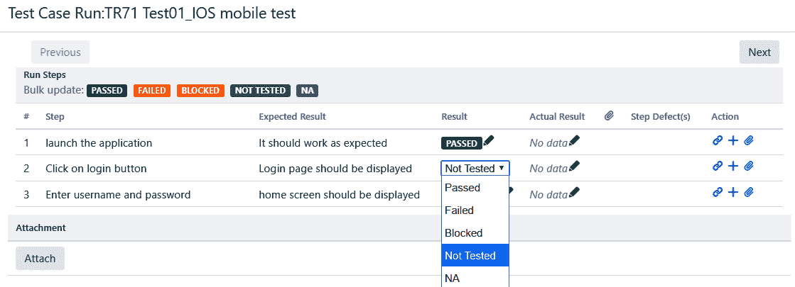
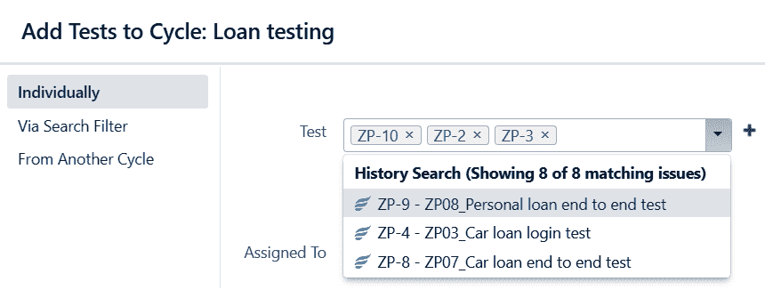
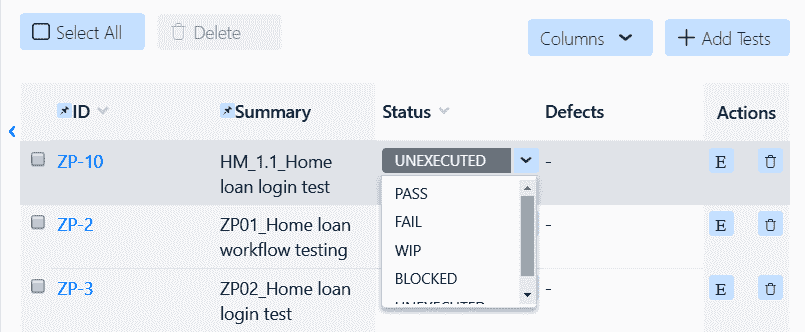
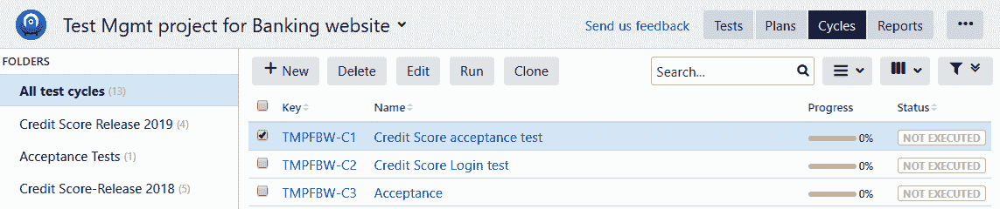
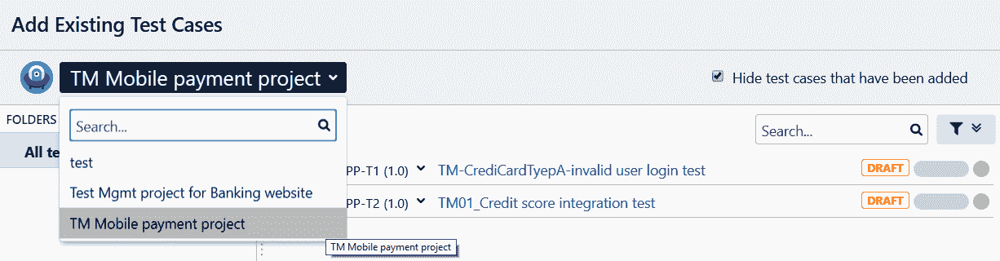

# 七、测试执行阶段

现在我们已经理解了测试设计阶段是什么，是时候进入下一个阶段了，也就是测试执行阶段。这是软件测试生命周期中的一个阶段，其中构建代码使用测试设计阶段设计和创建的测试用例进行验证。

当开发团队忙于为应用构建代码时，测试团队加快了测试设计和测试周期准备阶段。它还利用这段时间来准备测试环境和测试数据。然后，团队开始测试用例的执行，但是只有在测试环境中部署了最新的代码更改之后，或者当第一个可测试的组件已经被部署用于测试时。一旦测试环境为测试做好了准备，测试团队就要进行预测试，看看组件是否相对于预期的功能是完整的，从而是可测试的。

在本章中，我们将涵盖以下主题:

*   定义测试周期
*   将测试用例添加到同一项目的测试周期中
*   将测试用例添加到不同项目的测试周期中

我们还将解释测试执行的过程，以及如何使用 JIRA 进行管理。

# 定义测试周期

测试周期是基于测试团队工作的项目类型来设计的。在设计测试周期时，测试团队执行以下任务:

1.  **验证测试覆盖**:这确保了测试执行阶段包括验证所有需求所需的所有测试用例。

2.  **估算工作量**:基于需求的复杂性、测试用例的优先级、分配资源的当前技能水平、测试工具的可用性以及范围和分配的时间，测试团队估算完成测试执行所需的时间。
3.  **定义迭代**:如果在最初的测试执行迭代中发现了几个缺陷，对应用的特性造成了巨大的影响，那么测试团队总是可以增加另一个测试执行迭代。根据周期数、缓冲时间、缺陷重测时间和预定会议，测试执行的估计可能会有所不同。

测试团队可以根据定义和隐含的客户需求设计各种类型的测试周期/迭代。一些测试用例也应该被设计为冒烟和回归测试周期的一部分:

*   **冒烟测试周期**:这个周期可以让测试人员在执行一小组测试用例后，检查当前部署的版本是否可测试。例如，在银行网站的情况下，一些基本测试，如启动应用、在各种选项卡中导航、单击可用链接以及登录和退出应用，可能会有所帮助，以便您可以了解应用是否正常工作。如果它在启动后或点击个人银行链接后立即损坏，团队可以报告缺陷。然后，开发人员可以立即开始修复工作。冒烟测试有助于确保在请求的测试环境中部署了正确版本的构建。有时，在部署阶段，构建可能会失败，开发人员可能不得不回滚更改并重新部署新的构建。在这种情况下，冒烟测试很有用，因为它可以确定是否所有的基本特性都可以测试，并且当前部署的构建中没有文件或功能缺失。
*   **回归测试周期**:该周期用于识别新增加/实现的要求对产品或应用的现有可行解决方案的任何不利影响。我们还可以使用自动化工具来安排回归测试，并在需要时收集结果。

在[第 4 章](04.html)*测试管理方法*中，我们研究了如何将测试周期添加到测试计划中。在下一节中，我们将详细了解如何在测试周期中添加和移除测试用例，以及如何在测试执行阶段启动、完成和中止测试周期。

# 从同一个项目向测试周期添加测试用例

因为我们已经完成了必要的测试用例，它们已经可以使用了，我们可以将它们添加到测试周期中。从当前项目中添加测试用例是通过将测试用例拖放或链接到新创建的测试周期中来完成的。让我们看看如何创建和初始化测试周期。一旦我们创建了测试周期，我们就可以向它们添加测试用例，更新测试周期，然后开始测试执行阶段。

# 初始化测试周期

测试用例被分组以形成测试周期或测试迭代。在我们开始执行一个周期之前，检查我们是否已经添加了验证一个特性请求所需的完整测试用例集是很重要的。在初始化测试周期之前，您应该检查以下内容:

*   将对其执行测试的当前版本
*   将执行测试的测试环境
*   执行开始和结束日期
*   测试用例应该根据它们的优先级来组织
*   测试用例应该被分配给负责执行测试用例的测试人员

让我们看看如何使用 JIRA 插件创建和执行测试周期。

# 突触支持

在 synapseRT 中，一旦测试计划被创建并准备好，因为它已经添加了测试用例，我们可以创建测试周期:

1.  单击测试周期部分的添加按钮，输入测试周期的详细信息，如名称、环境以及开始日期和结束日期，如下图所示:

2.  创建循环后，我们可以选择将其状态从“草稿”更改为“开始”、“完成”或“中止”。我们还可以查看和编辑其详细信息。要修改其详细信息，请单击新创建的测试周期旁边的编辑，如下图所示:

3.  在添加测试周期之后，我们可以看到作为这个测试周期的一部分添加到测试计划中的所有测试用例。当测试周期处于 DRAFT 状态时，我们可以根据需要添加或删除测试用例。一旦我们开始测试周期，我们就不能移除它，但是我们总是可以向它添加测试用例:

4.  一旦我们开始测试周期，我们就可以开始执行测试用例。在 synapseRT 中，我们可以选择在测试步骤级别以及测试用例级别更新测试执行状态。正如您在下面的截图中所看到的，通过、失败、被阻止、未测试和未授权状态对于任何测试用例都是可用的:

# 泽法

像 synapseRT 一样，泽法不需要测试计划或测试用例来创建测试周期。按照以下步骤创建测试周期:

1.  在泽法创建测试周期时，我们可以更具体地了解其细节，例如版本、描述、名称、开始和结束日期等。这些细节有助于我们区分测试周期:

2.  正如您在下面的截图中看到的，一旦我们添加了一个测试周期，它就会显示在周期摘要选项卡下。此选项卡向我们显示了在此测试周期下添加的测试用例总数、其创建者、总执行次数、开始和结束日期等:

3.  通过点击测试周期中的+添加测试按钮，可以添加和删除测试用例。我们还可以选择通过他们的票号或者通过从另一个测试周期中添加他们来选择测试用例。正如您在下面的截图中看到的，我们已经使用它们的标签号添加了三个测试用例:

4.  在泽法的例子中，我们可以在测试用例级别更新测试状态，或者在测试步骤级别更新它。下面的截图显示了在测试用例级别更新测试用例的执行状态。默认情况下，泽法具有测试执行的未执行、通过、失败、在制品和冻结状态:

# 测试管理

像泽法一样，测试管理工具不需要测试计划或测试用例来创建测试周期:

1.  我们可以通过导航到测试|周期部分来添加测试周期。单击“新建”按钮添加新周期后，我们将看到以下“详细信息”屏幕，我们可以在其中输入该周期的详细信息，如文件夹、状态、版本、迭代、所有者、计划开始日期和计划结束日期、描述等:

2.  一旦我们添加了一个新的测试周期，我们就可以访问它的唯一标识符，这样我们就可以将其与其他周期区分开来。所有周期都可以在周期选项卡下查看。在本节中，我们可以选择编辑、开始执行、删除或复制测试周期:

3.  我们还可以从“测试用例”选项卡中，将选定项目的测试用例添加到我们当前的测试周期中。为此，导航到测试用例部分，点击添加按钮，如下图所示。我们还可以选择只查看那些没有添加到当前测试周期中的测试用例。正如您在下面的截图中看到的，总共有 10 个测试用例被选择作为这个测试周期的一部分:

4.  一旦我们开始测试周期，测试团队就可以开始一个接一个地执行测试用例。在这个逐步执行的过程中，测试人员可以选择在测试步骤级别或测试用例级别更新测试结果。正如您在下面的截图中看到的，一旦我们导航到测试周期，我们就可以看到该周期下的所有测试用例。我们可以通过点击计时器图标来开始测试用例的执行。我们还可以将测试状态从“未执行”更新为“进行中”、“通过”、“失败”或“已阻止”:

# 测试执行状态

测试执行状态定义了它在执行阶段的当前状态。以下是最常用的测试执行状态:

*   **未运行/未执行**:当测试用例已经添加到测试周期中时，显示“未运行”或“未执行”测试状态。然后根据执行结果更新其状态。
*   **通过**:如果测试中提到的所有测试步骤都满足预期结果，其状态可以标记为通过。
*   **失败**:如果任何一个测试步骤没有达到预期的结果，那么可以标记为失败。
*   **不适用/不在范围内**:有时候，测试用例不需要作为当前测试周期的一部分来执行。在这种情况下，测试执行状态可以更新为不适用。
*   **阻塞**:如果一个开放的缺陷影响了一个或多个测试用例的测试，那么相关的测试用例可以被标记为阻塞，并有更新的缺陷号与之链接。

如果在测试用例执行的任何时候，测试步骤失败，那么整个测试用例的状态被标记为失败。在这一点上，测试人员可以选择创建缺陷并将它们链接到测试用例，无论是在步骤级别还是在测试用例级别。

此外，在每次测试运行期间，测试工具都会创建一个新的测试运行实例。因此，比较同一个周期中一个测试的测试执行结果相对容易。

# 组织测试周期

就像我们可以区分测试用例的优先级一样，测试周期也可以根据它们的优先级来排序。顺序安排和重新排序测试周期通常可以节省重新测试一个或多个测试用例，甚至整个周期的时间和精力，并且有助于在测试执行周期的初始阶段验证最完整或最紧急的需求。

这有助于缺陷的早期识别，并给团队足够的时间来修复和重新测试任何更改。随着执行的进行，测试团队向所有项目涉众更新当前的执行状态，其中包含关于这个版本考虑的测试用例总数、标记为通过、失败、被阻止或没有运行的测试用例的数量，以及缺陷的数量和它们的当前状态的信息。

# 完成测试周期

在确认测试周期结束之前，您需要完成以下清单:

*   该周期中的所有测试用例要么标记为通过，要么标记为不适用
*   所有与测试用例相关的缺陷都已经被修复和重新测试，并且相关的测试用例已经通过
*   作为文本执行一部分的所有工件都已经生成并附加到相关的测试用例中
*   根据测试计划，所有工件，包括已经生成的测试报告，都满足退出或测试完成标准
*   测试执行报告已经生成并与项目干系人共享，并得到相关批准人的批准

一旦这个清单通过并完成，测试团队就可以正式宣布选定的测试周期/迭代或执行阶段的结束。

# 从不同的项目向测试周期添加测试用例

重用以前版本或不同项目的测试用例是理想的。我们可以将它们添加到当前项目下，并将其用作当前周期的一部分。让我们看看如何将来自不同项目的测试用例添加到测试周期中。

# 突触支持

我们可以将另一个项目的测试用例添加到测试周期中。为此，单击测试用例中的添加测试用例按钮，并搜索所需的测试用例。正如您在下面的截图中所看到的，我们通过搜索另一个项目的 ID 来添加测试用例:

# 泽法

我们可以从另一个项目中添加泽法的测试用例。导航到测试周期，然后单击添加测试按钮；您将看到以下屏幕。现在，根据它们的标签号搜索来自另一个项目的任何测试用例，并将它们添加到项目中:

# 测试管理

向当前测试周期添加测试用例时，测试管理为您提供了选择必要项目的选项。默认情况下，当前项目处于选中状态。我们可以选择另一个我们想要添加测试用例的项目。选择之后，我们可以看到所有可供我们添加到当前测试周期的测试用例。选择所需的测试用例，并点击添加按钮:

# 摘要

在本章中，我们学习了使用 JIRA 插件创建和执行测试周期。测试执行阶段的测试周期可以用诸如开始和结束日期、指定的测试人员、构建编号等细节来创建。可以修改测试周期，以便在开始测试周期之前，在当前项目中添加和移除测试用例。作为当前版本的一部分，测试用例也可以从以前的版本中重用。

在下一章中，我们将讨论缺陷管理的重要性，并看看 JIRA 如何帮助我们有效地跟踪和管理缺陷。