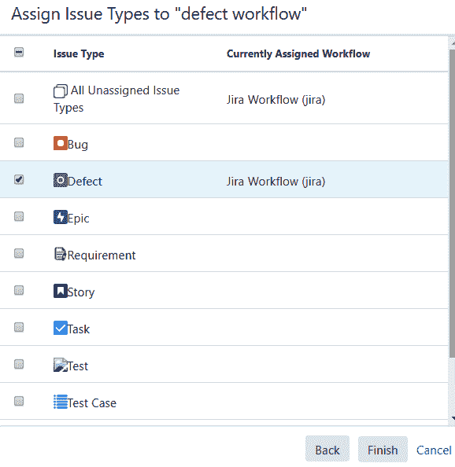
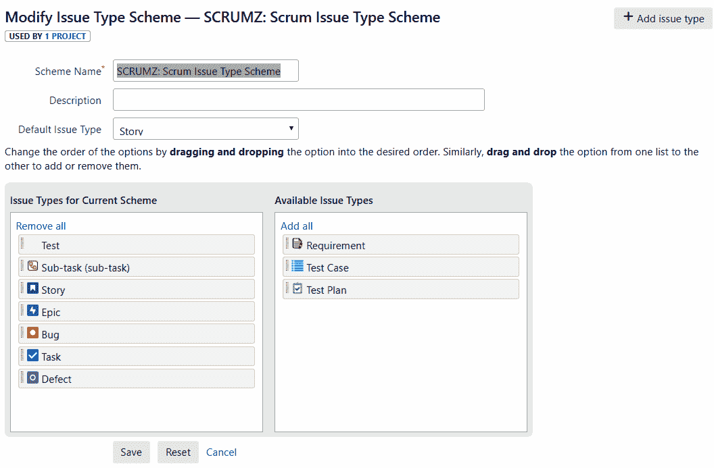
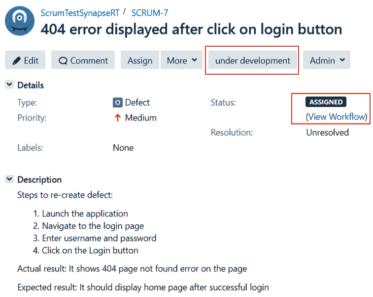
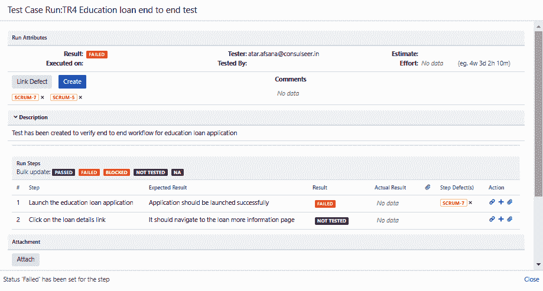
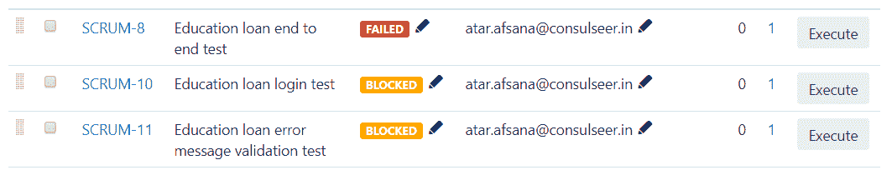
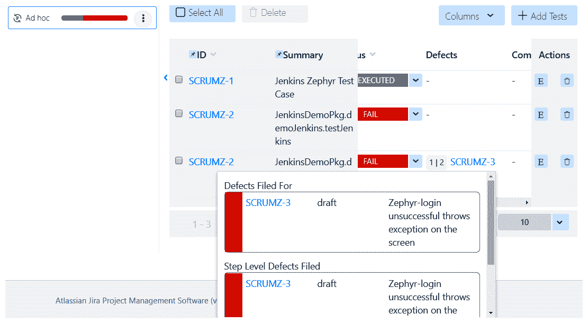

# 八、缺陷管理阶段

软件产品只有在没有任何缺陷的情况下产生令人满意的结果，才是可信的。无效结果会对最终用户产生负面影响。有缺陷的产品会让消费者不开心，并造成挫败感。因此，及时发现错误或问题可以帮助开发人员交付高质量的产品。但是，我们需要了解如何对缺陷进行分类，以及报告缺陷的有效方式，以便确认缺陷是否已经得到解决。

在本章中，我们将涵盖以下主题:

*   了解记录缺陷的重要性
*   制造新的缺陷
*   将现有缺陷与测试用例联系起来

我们还将看到 JIRA 如何帮助我们有效地跟踪和管理缺陷。

# 了解记录缺陷的重要性

在理解缺陷的重要性之前，让我们先了解一下缺陷在软件行业中的实际含义。当团队开始处理项目的一部分或组件时，他们开始用一组预定义的需求或条件来构建它。类似地，当测试团队创建测试用例时，他们基于各自组件的相同需求集。

现在，在测试执行阶段，测试团队开始通过一步一步地与应用交互来验证测试环境中的实际产品，因为最终用户将执行相同的操作，并将它们与预期结果进行比较。如果结果匹配，测试人员可以通过选择的步骤或测试用例。但是，如果结果不同，那么我们称之为**缺陷**。

测试团队想要跟踪项目开发过程中出现的问题有多种原因。这里列出了一些利弊:

*   记录系统中的缺陷有助于跟踪在执行周期、冲刺和项目期间观察到的问题。
*   它有助于识别那些有大量缺陷并且需要更多资源来解决它们的需求。因此，它有助于更好地组织资源。
*   它有助于生成可以被当前项目的所有涉众引用的工件，以及新的资源作为参考。
*   它促进了团队之间的协作，并帮助他们专注于应用的改进和解决任何问题。
*   它使应用没有缺陷，并给最终用户带来更好的体验。
*   如果在最近的构建中观察到一些东西或者客户报告了一些东西，团队总是可以参考以前记录的缺陷。
*   它帮助测试人员或项目经理生成缺陷验收报告(我们将在[第 10 章](10.html)、*测试执行状态报告*中讨论该主题)，并与项目干系人共享该报告，以使团队在向最终用户发布产品之前了解现有缺陷及其当前状态。
*   它有助于管理人员估计资源在应用的某一部分上所付出的努力，并依次添加资源计费详细信息和更新项目估计详细信息。

这些是团队应该投资于全面缺陷管理的众多原因中的几个。

# 制造新的缺陷

简单地说，与预期结果的偏差被视为缺陷。在这个行业中，还有一些术语可以互换使用来定义一个问题，比如故障、bug 或错误。然而，任何形式的问题，不管叫什么，都必须在产品发布前解决。

软件缺陷可能是以下原因造成的:

*   功能是基于无效或不完整的需求构建的
*   需求中说明了一个特性，但是缺少所需的软件
*   代码中使用的函数没有返回预期的结果，或者在无限循环中运行，或者接受输入参数的无效数字/类型
*   不限制用户执行无效/未经授权的操作
*   错误消息未按预期显示
*   不符合规定和未规定的要求
*   文本和图像不可读
*   无效代码被合并到生成中，并部署在测试环境中

一旦确认应用展示的行为不符合规定的要求，开发团队也确认了这一点，那么测试团队就可以将其标记为缺陷，并将其记录在测试管理系统中。在接下来的章节中，我们将看看如何使用 JIRA 插件创建和记录缺陷。

现在我们知道了什么是缺陷，让我们从缺陷创建过程开始。测试管理工具可以用来报告新发现的缺陷。这有助于追踪缺陷，并帮助测试人员与团队顺利协作。在创建新的缺陷之前，有必要检查系统中是否已经存在类似的缺陷，以及其当前状态是什么。缺陷只有在可复制的情况下才能成功报告和修复；因此，在将其登录到系统之前，有必要将其复制几次。

建议在记录任何缺陷之前，遵守以下清单。虽然这是一个常见的清单，但可以根据您的要求添加更多步骤:

*   需求文档中指定的应用行为不同于实现的结果
*   验证测试是否在具有预期配置的正确环境中进行
*   检查应用的构建版本是否正确，是否已经按照测试要求进行了配置
*   检查应用所需的所有服务是否都已启动并正在运行
*   检查应用是否与指定的操作系统、浏览器或第三方应用兼容
*   检查测试是否在具有有效测试数据的应用的指定状态下执行
*   检查用户角色是否拥有执行测试用例中提到的操作所需的所有权限
*   检查应用、服务器和数据库之间是否连接

向缺陷中添加更多细节有助于开发人员在执行根本原因分析时，在代码的特定部分中确定开始调试的初始位置，而不是检查整个产品或模块。让我们看看在记录缺陷时应该添加哪些细节。

For more information about defect management, please check the article on defect management that is available at [https://www.red-gate.com/simple-talk/dotnet/software-delivery/a-primer-on-defect-managment/](https://www.red-gate.com/simple-talk/dotnet/software-delivery/a-primer-on-defect-managment/).

# 如何使用 JIRA 插件创建缺陷

通常，测试管理工具提供了一个带有一些默认字段的模板来记录缺陷。但是，我们总是可以更具描述性，例如，通过指定以下内容:

*   识别缺陷的唯一标识符
*   缺陷的总结
*   为重现缺陷而采取的措施
*   实际结果和预期结果之间的差异
*   用于执行测试的测试环境
*   先决条件，例如测试中的应用的状态
*   带有配置详细信息的测试中应用的版本
*   部署在测试环境中的代码的构建版本
*   用于执行测试的测试数据
*   缺陷创建日期
*   缺陷的当前状态
*   将处理缺陷的受让人的姓名
*   记录缺陷的记者的姓名
*   缺陷的优先级和严重性，以确定缺陷对应用的影响以及修复缺陷的紧迫性
*   发生的项目/冲刺/模块名称
*   关于何时不能按预期工作的要求细节
*   标记为失败的相关测试用例/测试步骤
*   工件，例如截图、日志文件、错误描述、用于执行测试用例的测试数据、生成的输出结果(如果有)等等

既然我们现在知道了模板，让我们使用 JIRA 插件创建缺陷。

# 在 JIRA 设计和管理缺陷工作流程

可以定制缺陷工作流，使其具有缺陷问题类型可以经历的一组自己的状态。组织可以有自己的一套工作流。让我们看看缺陷应该经历的一些推荐状态。这也称为缺陷生命周期:

*   草稿:当测试人员仍然需要提供更多相关细节时，可以在草稿上设置缺陷
*   **新建/打开**:当所有的细节都被添加并且准备分配给开发者时，可以为缺陷设置该状态
*   **ASSIGNED** :一旦项目团队确定了一个将要处理记录的缺陷的开发人员，缺陷的状态就可以设置为 ASSIGNED，并且应该分配给有问题的开发人员
*   **进行中**:一旦分配了缺陷，开发人员可以将缺陷的状态更改为进行中，以表明开发人员正在努力解决问题
*   **FIXED** :一旦实现了所需的代码更改，开发人员就可以将缺陷状态更改为 FIXED，并使测试人员可以验证这些更改
*   **未修复**:如果缺陷仍可再现，且修复不符合要求，测试仪将缺陷状态设置为未修复
*   **CLOSED** :如果修复的缺陷工作正常，并且符合规定的要求，那么测试人员关闭缺陷，并将其状态设置为 CLOSED
*   重新打开:如果以前解决的缺陷现在再次出现，那么测试人员可以将缺陷的状态更改为重新打开
*   **不适用**:如果新创建的缺陷与验证的变更不相关，那么开发人员可以将缺陷的状态更改为不适用
*   **非缺陷**:如果应用或特性的行为符合预期，那么开发人员可以将缺陷的状态更改为非缺陷
*   **不可再现**:如果开发人员无法在相同的环境和构建版本中重新创建缺陷，那么其状态可以更新为不可再现
*   **replicate**:如果系统中已经存在类似的缺陷，那么开发团队可以将缺陷状态更新为 replicate
*   **已验证**:如果缺陷的代码变化已经过测试仪验证，那么其状态可以标记为已验证

*   **待定**:如果缺陷验证由于环境、测试数据或资源不可用而被搁置，那么其状态可以更新为*待定*
*   **延期**:如果团队决定在即将到来的冲刺或发布中进行修复，缺陷状态可以标记为延期

既然我们现在已经熟悉了缺陷工作流程，让我们使用 JIRA 创建一个:

1.  为了在 JIRA 创建一个定制的工作流，我们需要添加一个工作流方案，并向该方案添加一个定制的工作流。添加工作流方案的选项位于管理|问题|工作流|工作流方案下。为此缺陷工作流方案指定一个名称，如`DefectWorkflowScheme-1`，添加一个描述，然后点击添加按钮创建一个方案:

2.  如下图所示，定制的缺陷工作流有各种状态，类似于我们前面讨论的状态。此工作流已被归类为缺陷工作流，将被添加到工作流方案中:

3.  选择现有工作流程后，单击下一步按钮。以下屏幕截图显示了要应用于此工作流的问题类型。选择缺陷问题类型，然后单击完成按钮，如图所示:

4.  添加缺陷工作流后，可以从项目设置|问题|工作流部分查看。如下图所示，当前项目有两种类型的工作流，即 JIRA 工作流和缺陷工作流。缺陷工作流字段具有作为缺陷的相关问题类型。在这里，它将提示您发布更改，并且一旦您发布，新添加的工作流将被添加到缺陷问题类型:

5.  现在，导航到项目|项目设置|问题部分。在这里，您需要定制您的项目，以具有缺陷问题类型。如下图所示，我们在“当前方案的问题类型”部分添加了缺陷问题类型，以便将其添加到您当前的项目方案中:

6.  单击保存，我们的缺陷工作流就创建好了。

# 突触支持

synapseRT 有额外的问题类型，包括需求、测试用例和测试计划，但是它有一个缺失的缺陷问题类型。从前面的部分，我们现在知道了如何用定制的工作流将缺陷问题类型添加到我们的项目中。添加问题类型后，按照以下步骤记录缺陷:

1.  由于缺陷是另一种问题类型，单击创建按钮创建缺陷，选择有问题的项目，然后选择问题类型为缺陷，如下图所示。然后，单击下一步按钮:

2.  这将加载标题为“创建问题”的问题描述页面，如下图所示。在此页面上，提供详细信息，包括摘要、报告者、描述(包括重现缺陷所采取的步骤)、实际和预期行为、先决条件、测试数据、优先级、受让人详细信息和关联问题。输入所有必要的详细信息后，点击创建按钮创建缺陷:

3.  一旦您创建了缺陷，JIRA 将自动生成唯一的票证编号来标识此问题类型。缺陷按照设计的工作流程经历不同的阶段，我们将在下一节看到。如下面的截图所示，JIRA 为这个缺陷添加了一个唯一的 ID 作为 SCRUM-7。缺陷的当前状态为“已分配”，根据定制的工作流程，下一个状态正在开发中。它还将此问题类型的性质显示为缺陷，其优先级(由报告者设置)为中等:

我们可以将缺陷问题类型添加到泽法和测试管理项目中。由于这是一个新的问题类型，在泽法和测试管理中创建缺陷的步骤保持不变。

# 将现有缺陷与测试用例联系起来

建立缺陷和测试用例之间的关系有助于识别缺陷对测试用例当前执行的影响。如果单个缺陷影响了多个测试用例，那么测试人员可以将同一个缺陷链接到所有受影响的测试用例，并将测试用例状态更新为阻塞。

然而，除了影响分析之外，它还有助于生成可追溯性矩阵，其中需求被链接到测试用例，测试用例被链接到缺陷。缺陷可以在测试用例级别或测试步骤级别链接到测试用例。如果一个测试用例有更多的测试步骤，并且对于相同的测试用例观察到了多个缺陷，那么在这种情况下，在测试步骤级别链接这些缺陷来识别错误具体发生在哪个步骤更有意义。

# 改变与缺陷相关的测试用例状态

每当测试团队记录一个缺陷并将其链接到相关的测试用例时，测试用例的状态就会更新为失败。现在，测试用例状态仍然是失败的，除非并且直到相关的缺陷被关闭或者延迟。一旦缺陷被关闭，相关的测试用例状态被更新为通过。

但是，如果缺陷是在测试步骤级别链接的，那么按预期工作的步骤将被更新为“通过”。观察到缺陷的步骤被更新为失败，测试人员无法执行的剩余步骤保持默认的未执行或未运行状态。

让我们使用 JIRA 插件将缺陷与测试用例联系起来。

# 突触支持

synapseRT 提供了在测试用例级别或测试步骤级别链接缺陷的选项。选择 synapseRT 中的任何测试用例，并创建一个临时运行。在执行过程中，它会创建一个新的测试运行，并在运行属性部分显示链接现有缺陷或创建新缺陷的选项。我们还可以选择在测试步骤级别更新测试状态。

在下面的截图中，第一步被标记为失败，它在测试步骤级别有一个相关的 SCRUM-7 缺陷。然而，有两个缺陷，SCRUM-7 和`SCRUM-5`，与测试用例级别相关联。由于这里有一个测试步骤失败了，整个测试用例的状态被更新为失败:

如果多个测试用例在测试周期中由于一个缺陷而被阻塞，那么同一个缺陷可以被链接到测试用例，并且它们的状态可以被更新为阻塞。下面的截图描述了这种行为:

总共有三个测试用例。一个因为缺陷而失败，同样的缺陷阻塞了当前测试周期中剩下的两个测试用例。

# 泽法

在泽法的例子中，一旦我们开始执行所选测试周期的测试用例，我们就可以在测试用例级别或测试步骤级别更新测试状态。

在执行测试时，我们还可以选择在测试步骤级别或测试用例级别链接缺陷。如下图所示，由于一个步骤被标记为失败，整个测试用例的状态已经变为失败。以下步骤被标记为已阻止。在缺陷部分，它有一个链接为`SCRUMZ-3`的缺陷:

完成此运行后，可以在测试周期级别查看测试执行及其关联缺陷的状态。在下面的截图中，我们可以看到一个`Ad hoc`测试周期有一个名为`SCRUMZ-2`的测试用例，它与缺陷`SCRUMZ-3`相关联:

# 测试管理

测试管理工具还有一个选项，可以链接缺陷，并在测试步骤和测试用例级别更新测试步骤的状态。

如下图所示，测试用例`TESTP-T2`在第 1 步被标记为失败，其 ISSUES 部分指示链接的缺陷。在我们的例子中，这是`TESTP-1`。其余步骤被标记为已阻止:

# 摘要

在本章中，我们学习了缺陷创建和管理过程。我们学会了识别缺陷并了解其可能的根本原因。我们还查看了在报告缺陷之前应该执行的初步检查，以及在系统中记录缺陷时应该提供的细节。

然后，我们通过定制的问题类型(如**缺陷**)和定制的工作流程，学会了在 JIRA 创建缺陷。为了创建可追溯性，我们学习了如何在 JIRA 插件的帮助下将缺陷链接到相关的测试用例，无论是在测试步骤还是在测试执行阶段的测试用例级别。

在下一章中，我们将讨论如何使用 JIRA 问题来跟踪项目需求。我们还将看到 JIRA 可以用来将需求和测试用例联系起来作为需求覆盖的方法。