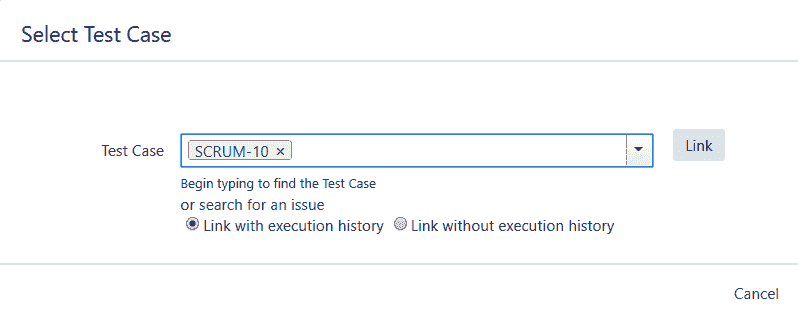
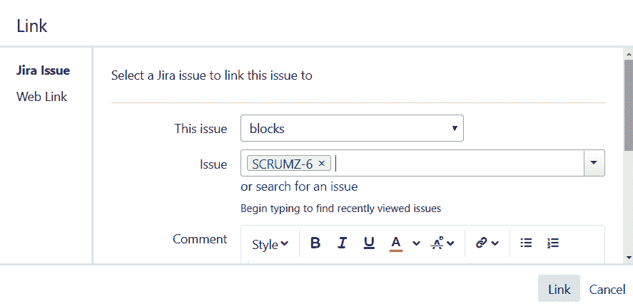
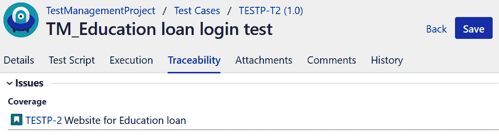

# 需求管理

需求是与项目相关的客户需求。使用吉拉的需求编号或票据编号来跟踪它们，以监控项目进度。将需求链接到测试用例不仅有助于项目团队估计验证链接需求所需的资源和时间，而且有助于理解哪个需求在执行阶段有更多的缺陷。

在本章中，我们将涵盖以下主题:

*   根据要求创建吉拉问题类型
*   建立需求和测试用例之间的关系

我们还将了解吉拉如何帮助我们使用吉拉问题类型定义项目需求。

# 根据要求创建吉拉问题类型

在吉拉，我们有默认的问题类型，如史诗、故事、任务、子任务和 Bug。这些问题类型使我们能够根据项目的需求灵活地定义自己的问题类型。但是，这些问题类型中的每一种都可以被视为一种需求。一旦需求被定义并记录在系统中，跟踪和管理它们就变得容易了。我们在[第 3 章](03.html)、*中学习了如何定义需求，了解吉拉*的测试组件。现在，让我们在吉拉创建它们。

# 创建需求

吉拉有一组预定义的字段来创建吉拉门票。此外，我们可以根据所选问题类型添加所需的自定义字段。任何需求问题类型通常应包含以下内容:

*   需求的目的或团队期望完成的任务
*   将复杂需求分解为更多细节和规范的详细描述
*   问题类型的优先级
*   问题类型的当前状态

创建需求问题类型时添加了以下详细信息:

| **需求字段** | **描述** |
| 需求标识 | 此字段有助于唯一识别需求。大多数情况下，业务需求是由业务分析师准备的，并根据需要贴上标识。 |
| 摘要 | 此字段根据预期完成的目标或指标提供需求的简短描述。 |
| 详细描述 | 此字段详细定义需求的目标。如果它有各种需要处理的组件或模块，或者任何其他技术规范，那么所有这些项目都可以在该字段中指定。 |
| 优先 | 此字段定义处理需求并将其发布给最终用户的紧迫性。 |
| 状态 | 需求的状态有助于项目涉众了解所选需求的当前状态和进度。 |
| 创建日期 | 一般来说，当需求在系统中创建时，需求管理工具会为它们添加一个时间和日期。 |
| 批准人 | 通常，需求必须经过批准阶段。一旦得到项目涉众的同意和批准，被分配到这个任务的开发人员就可以开始工作了。此字段可用于列出指定要求所需的批准人。 |
| 批准日期 | 一旦相关人员批准了需求，系统会自动更新批准人的详细信息以及批准的时间和日期。 |
| 代理人 | 此字段决定需要对需求采取措施的下一个负责人。这可能是业务分析师、批准者、开发人员或测试人员。 |
| 记者 | 系统会自动添加此字段，其中包含在系统中记录需求的相关人员的姓名。 |
| 内部版本号 | 一旦需求以代码的形式被转换、审查并准备好部署进行测试，它们就可以被链接到一个构建号。构建号有助于测试人员和开发人员轻松调试和分析代码，并确定哪个需求失败了。 |
| 应用程序版本 | 如果应用程序构建在不同的版本中，并且有不同的需求集，那么在创建需求时添加应用程序版本可以帮助项目团队有效地区分和管理需求。 |
| 发布号 | 如果项目有不同的版本，那么将需求链接到相关的版本是一个很好的选择。它不仅有助于管理需求，而且有助于生成特定于发布的报告并跟踪其进度。 |
| 项目名 | 需求通常是特定于项目的。因此，在创建需求时添加项目细节是个好主意。 |
| 链接测试用例 | 将测试用例与需求联系起来有助于理解测试覆盖率。此外，它还有助于生成可追溯性矩阵。因此，一旦测试团队准备好测试用例，就可以将它们链接到指定的需求。 |
| 评论 | 如果有任何其他信息，可以添加到注释字段。 |
| 属国 | 如果有任何依赖需求，或者在工具、另一个模块、资源或批准方面有任何依赖，所有这些都应该在这个字段中定义。 |

组织经常定制它们来指定需求。因此，您可能会观察到这种格式的变化。

# 确定需求的优先级

根据向最终用户交付功能的需求和紧迫性来确定需求优先级。在对需求进行优先排序的同时，项目团队还会考虑其复杂性以及完成所请求任务所需的努力。项目团队可以根据优先级采取行动。

例如，如果功能请求具有关键优先级，这意味着它的重要性非常高，并且它的时间表非常短。因此，实现上述任务所需的所有东西，如数据、工具、权限、技能集和资源，都是在短时间内获得的，项目团队试图按照设定的时间表实现其目标。

默认情况下，吉拉为任何问题类型分配了四种不同的优先级:

*   **关键**:这些都是非常紧急的需求，对业务的影响很大。这些方面需要在最短的时间内解决和修复，以便在紧急情况下将它们交付给最终用户。
*   **高**:这些都是需要尽快解决和努力的需求。然而，时间表通常由项目干系人指定。
*   **中等**:这些是中等优先级的需求，在所有关键或高优先级的项目交付后处理，因为它们的紧急程度是中等的。
*   **低**:低优先级要求紧急程度最小。因此，它们是开发人员优先级列表中最后一个要处理的项目。有时，如果项目团队需要更多的时间关注当前版本/sprint 中最关键/高优先级的项目，低优先级的任务/子任务也可以转移到另一个版本或 sprint。

# 需求状态

需求状态有助于项目团队了解其当前状态，并为下一步行动提供方向。设置状态是工作流程的一部分。因此，组织可能具有定制的状态，该状态可能因项目甚至问题类型而异。

通常，以下状态对于需求问题类型很有用:

*   **草案**:顾名思义，如果有进一步的细节需要负责成员补充，可以使用这个状态。通常，业务分析师负责创建业务需求。如果没有，则项目负责人在系统中创建它们。
*   **草稿完成**:一旦添加了所有的需求细节，它们的状态可以更新为草稿完成。
*   **已分配审批**:如果需求需要审批，可以分配给相关人员，状态更新为已分配审批。
*   **待审批**:顾名思义，如果因为任何原因等待审批，需求状态可以更新为待审批。
*   **已批准**:一旦需求通过审批审核，看起来可以开始开发了，它们的状态可以标记为*已批准*。
*   **选择用于开发**:已添加到当前冲刺或发布中用于开发的处于批准状态的需求被更新为具有选择用于开发状态。
*   **进行中**:当开发人员致力于将需求转换为代码时，他们的状态可以更新为进行中。
*   **准备评审**:一旦代码变更在系统中实现，开发人员可以将其状态更新为*准备评审*，并将其分配给开发团队进行同行评审。
*   **评审完成**:如果在同行评审过程中有任何意见，有问题的开发人员会对其进行处理，并对代码进行修改。根据评论更新代码后，其状态更新为*审核完成*。
*   **准备测试**:开发人员通过将代码添加到所需的代码分支，使代码准备好在测试环境中部署。然后通过将状态更新为*准备测试*将其分配给测试团队。
*   **正在进行的测试**:一旦项目团队确定了将要验证所选需求的测试人员，他们将被分配到该测试人员，并且票证状态将更新为*正在进行的测试*。
*   **测试完成**:测试人员在测试执行阶段根据指定的需求设计测试用例并开始验证。一旦链接到特定需求的所有测试用例被标记为通过或不适用，需求的状态就可以更新为*测试完成*。
*   **准备发布**:所有已经过测试的验证需求，以及所有已经修复和重新测试的 bug，准备在生产中部署，都可以标记为*准备发布*。
*   **已发布**:在生产环境中部署所选需求供终端用户使用后，其状态更新为*已发布*。
*   **Closed** :一旦需求在生产环境中部署成功，并且假设没有其他新创建的依赖需求或需要开发的问题，它们的状态可以标记为 *Closed* 。

# 管理需求工件

需求可以用各种格式创建，而不同类型的工件是可能的，包括以下内容:

*   **项目章程**:由此启动项目。
*   **项目批准的需求文件**:包含高层批准的需求。
*   **项目的高层和低层设计文件**:这些详细定义了项目架构。
*   **项目计划**:包括范围、时间、成本、预算和其他相关计划的细节，包括变更管理战略计划和资源分配计划。它还定义了每个阶段结束时可接受的交付物列表及其格式。
*   **项目的相关第三方工具文档**:这些将用于与当前项目相关的内容，例如产品信息、教程或访问工具所需的用户权限。
*   **风险缓解策略和行动计划**:用于了解项目风险以及缓解风险所需的步骤。
*   **知识库库**:包含所有发布的与当前项目相关的文档，以及项目组可以使用的任何其他相关项目。示例包括项目团队可以参考的经验教训和以前版本的回顾性文档。
*   **培训文档**:这些是资源培训相关的文档和视频，如果有的话。
*   **角色和职责**:这些是与资源角色和职责相关的文档。
*   **项目会议**:这包括项目计划、每周和/或每天的会议或电话、讨论报告，包括会议记录或用于确认项目特征要求或条件的任何电子邮件。
*   **项目进度报告**:该报告在产品开发的每个冲刺或每个阶段结束时生成。例子包括冲刺报告、epic 报告、项目燃耗图、测试执行报告、测试周期报告和测试计划报告。

由于在项目之前、期间和结束时会生成各种类型的文档，因此按照 sprint 或 release 来管理项目存储库是必要的。

# 建立需求和测试用例之间的关系

建立可追溯矩阵的第一步是将基于需求设计的测试用例与系统中记录的相关需求联系起来。可追溯性矩阵有助于测试团队理解测试覆盖率，并通过适当地添加或移除测试用例来适当地管理测试用例。

在测试执行阶段，这个链接帮助测试团队理解哪些需求失败了或者需要更多的时间来执行。然后，测试经理可以决定克服这些问题的策略，并根据需要分配更多的资源或时间。

让我们看看如何使用吉拉插件将测试用例链接到需求。

# 突触支持

为了将测试用例链接到吉拉的不同问题类型，我们需要从配置部分将问题类型配置为需求。一旦配置正确，这些问题类型将有一个测试用例部分，可用于将测试用例链接到票据。现在，让我们观察以下链接测试用例的步骤:

1.  如下图所示，故事问题类型已被配置为需求。因此，它有一个测试用例部分，用户可以创建一个新的测试用例，或者将一个现有的测试用例链接到这个故事。下面截图有一个测试用例`SCRUM-11`，链接到故事`SCRUM-14`:

2.  “创建测试用例”选项将打开一个“创建问题”页面，您可以在其中创建一个新的测试用例，它将自动链接到故事。为了链接现有的测试用例，点击链接测试用例按钮，如下图所示，它提供了选择测试用例并将其链接到票据的选项:

3.  由于在 synapseRT 中发布的测试用例是另一种问题类型，我们也可以选择从测试用例问题类型中链接一个需求。为此，请打开测试用例问题，然后单击选择需求部分的链接按钮。如下图所示，通过标识选择需求并点击链接:

4.  在链接需求之后，如果您现在回到测试用例的需求部分，您将看到吉拉已经在测试用例和来自测试用例问题类型的故事之间创建了一个链接。如下面的截图所示，除了需求部分，我们还可以添加关于测试用例所属的测试套件以及测试计划的细节:

5.  我们在 synapseRT 中还有一个选项，叫做测试计划问题类型，用来查看所选需求的测试用例覆盖率。为了首先查看覆盖率，我们需要在需求问题类型中以及测试计划中添加相同的测试用例集。之后，如果您打开测试计划问题，您可以从需求部分查看测试用例覆盖率，如下图所示。在这种情况下，需求覆盖率为 100.0%，因为计划到需求的所有测试用例都链接到需求问题类型，并被添加到测试计划中以验证功能:

# 泽法

在泽法，我们可以通过链接问题来建立需求问题类型和测试用例之间的关系。

1.  为此，首先在泽法创建一个需求问题类型。在“创建问题”屏幕上，有一个名为“链接问题”的字段。点击它。这显示了下面的截图，从这里可以链接相关的问题——在我们的例子中，是一个测试用例:

2.  一旦我们完成了将所有测试用例链接到需求问题类型，就可以从问题链接部分查看这些链接。现在，由于泽法的测试用例也是一个问题类型，通过遵循相同的步骤，我们可以将需求链接到测试用例问题。如下图所示，测试用例问题类型`SCRUMZ-5`已经链接到其相关的需求故事问题类型`SCRUMZ-6`，这是在测试用例的问题链接部分下添加的:

# 测试管理

在吉拉插件的测试管理的情况下，我们可以从可追溯性部分向需求问题类型添加测试用例。本节提供了多个选项来创建或链接测试用例，甚至测试周期:

1.  单击故事问题类型的可追溯性部分中的+图标。
2.  选择一个选项，添加现有测试用例。这显示了以下用于选择现有测试用例的屏幕。它在“添加现有测试用例”窗口中显示所有现有的测试用例。选中所需测试用例的复选框，并单击添加按钮将这些测试用例添加到需求问题类型中:

3.  在将现有的测试用例链接到故事类型之后，所有链接的测试用例都可以从可追溯性部分查看。如下图截图所示，在故事`TESTP-2`的情况下，我们链接了两个测试用例，`TESTP-T2(1.0)`和`TESTP-T3(1.0)`:

4.  我们也可以从测试用例中链接需求。为此，请导航到测试部分，打开任何现有测试，然后单击可追溯性选项卡。单击问题部分中的添加按钮，选择想要链接到测试用例的问题。可以从当前项目或其他项目中搜索问题。单击您要链接的所需问题的复选框，然后单击添加按钮。
5.  添加需求后，它应该显示在可追溯性|问题部分下。如下图所示，我们已经将`TESTP-T2`测试用例与来自测试用例可追溯性部分的`TESTP-2`需求相链接:

# 摘要

在本章中，我们学习了如何在吉拉有效地管理和记录需求。我们看到了如何利用吉拉问题来跟踪测试阶段的需求。然后我们理解了如何使用可追溯性矩阵来跟踪测试覆盖率。此外，我们通过将需求链接到相关的测试用例，使用每个吉拉插件创建了可追溯性矩阵。

在下一章中，我们将探讨吉拉如何利用报告来帮助监测和控制项目，我们将详细介绍吉拉提供的各种报告。