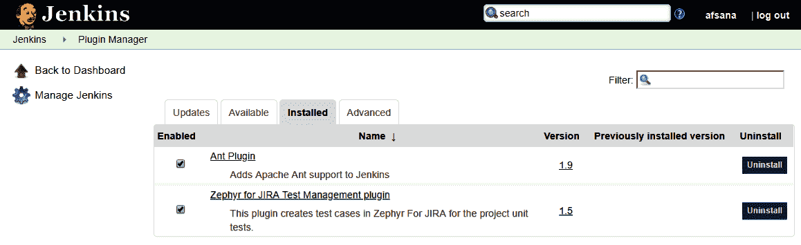
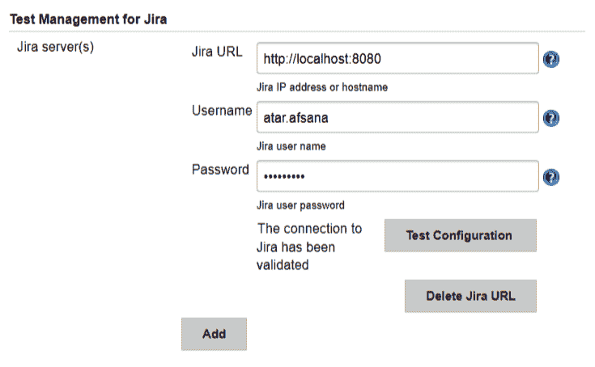
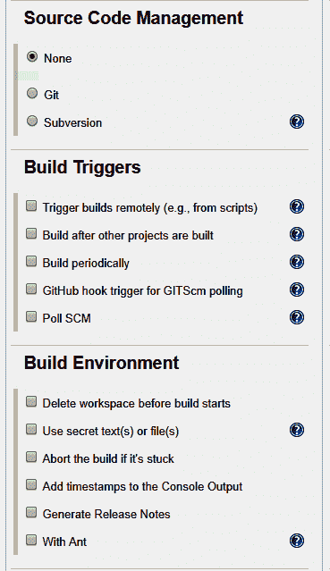
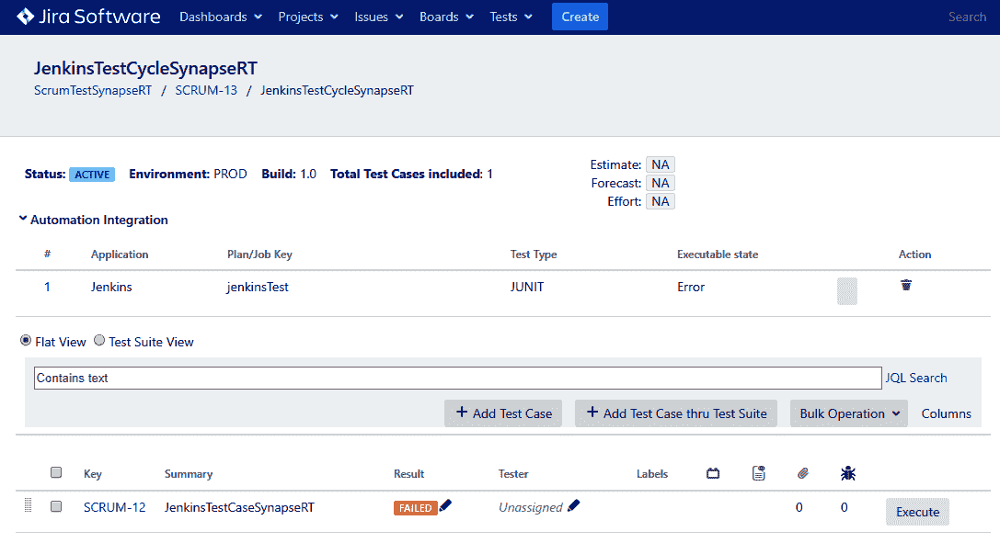
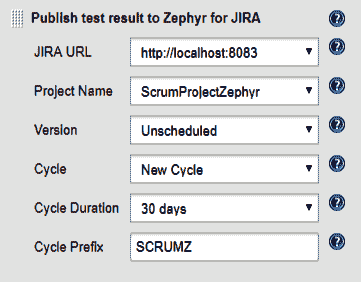
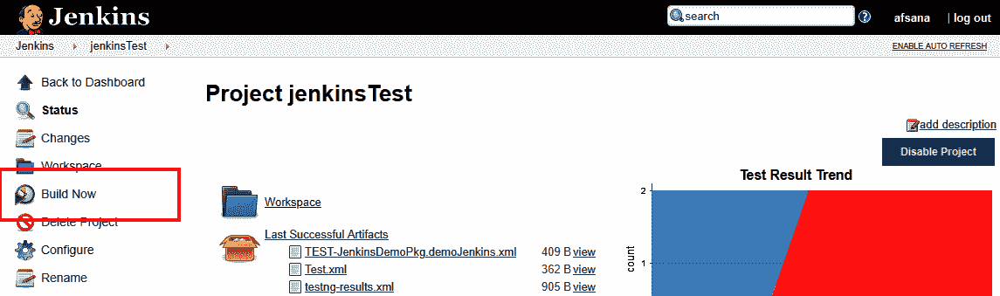

# 十一、JIRA与自动化测试工具的集成

在前面的章节中，我们已经学习了什么是测试管理，以及JIRA如何帮助 SQA 团队有效地管理测试过程。现在，让我们看看如何利用JIRA和 DevOps 管道来自动化和管理测试执行，以提高开发生命周期中的敏捷性。

在本章中，我们将涵盖以下主题:

*   了解 DevOps 管道
*   正在配置JIRA插件以连接到Jenkins
*   了解集成和执行自动化脚本的示例工作流

我们还将了解JIRA如何在软件项目中帮助**持续集成** ( **CI** )和**持续交付** ( **CD** )。

# 了解 DevOps 管道

DevOps 是一个软件开发范例，它涉及一个持续开发、测试、集成、部署和监控的周期。这个模型是成熟的软件开发实践的结果，特别是随着敏捷方法的出现，敏捷方法要求更快的产品和服务发布，同时确保足够的质量度量。下图显示了 DevOps 周期中的各个阶段:


从上图中可以看出，DevOps 需要开发、测试和操作功能协同工作。DevOps 阶段基本上是敏捷 SDLC 中开发阶段的自动化和简化的实现。

在开发阶段，开发人员开始根据产品的需求编写代码。此外，测试人员开始为自动化测试编写测试用例或脚本。这需要开发人员和测试人员在维护他们的代码和脚本的几个版本的同时提交他们的工件，然后才能实现最终的工作构建。因此，源代码管理对于有效和高效的开发是必不可少的。在没有版本控制工具的团队环境中，这可能是个问题。因此，DevOps 采用了几个版本控制工具，如 GitHub、Bitbucket 和 Team Foundation。

一旦开发人员提交了代码，DevOps 进程就会被触发，它会自动编译并构建代码以及团队其他成员提交的其他代码集。如果已经编写了适当的单元测试，DevOps 会处理并执行它们，以确定结果是否符合预期。在这个阶段发现的任何缺陷或问题都会通过电子邮件和票证传达给开发团队。市场上有几个用于 CI 的工具，比如 Jenkins 和 Circle CI。在这一章中，我们将研究如何利用Jenkins和JIRA。Jenkins 是一个用于 CI 的开源工具。它可以与多种软件开发工具集成，实现 CI/CD 过程的自动化。

一旦构建通过了开发级别的单元测试和集成测试，发布构建就被部署到适当的测试服务器上，供测试团队启动他们的测试。此时，自动化测试脚本(如果可用)被触发来测试构建。自动化确保 DevOps 阶段是连续的；否则，就会导致开发过程的敏捷性出现瓶颈。有几种测试自动化框架和工具可用，例如 Selenium、TestComplete 和茄子，它们可以帮助自动化测试过程。

一旦测试并修复了所有缺陷，构建就可以部署了。在得到产品团队和利益相关者的适当批准后，它将被部署到生产服务器上。已部署构建的容器化有助于促进弹性服务器，以及有效的负载平衡和配置管理。市场上有许多集装箱化工具，包括 Docker、Ansible 和 Kubernetes。

DevOps 流程的所有阶段都需要持续监控，使用 Prometheus、Splunk 和 Ganglia 等工具，提醒开发团队需要有效解决的问题。持续监控对于解决瓶颈和改进流程以实现更快的交付机制是必要的。持续反馈是通过帮助团队计划下一次部署来改进产品的另一种机制。

现在我们已经了解了 DevOps 过程的基础，让我们看看如何配置 Jenkins，使其与JIRA和测试自动化工具相集成。

# 正在配置JIRA插件以连接到Jenkins

JIRA插件的 synapseRT、泽法和测试管理工具都有自己与 CI/CD 工具连接的方式，比如 Jenkins。我们将看看如何为Jenkins安装和配置这些JIRA插件。

# 突触支持

synapseRT 预装了配置项/光盘工具集成。让我们配置插件以连接到我们的 Jenkins 安装:

1.  转到管理|加载项|突触支持|集成，然后单击添加按钮。
2.  将Jenkins设置为应用程序类型，并提供Jenkins网址。在我们的例子中，我们在 Docker 实例上托管了JIRA，而 Jenkins 在端口`8081`上托管在本地主机上。因此，我们提供`http://host.docker.internal:8081`作为网址，而不是`http://localhost:8081`，以及Jenkins实例的用户和密码:


For more information or clarification on issues regarding configuring and setting up synapseRT for Jenkins, visit [https://bit.ly/2RBEAfA](https://bit.ly/2RBEAfA).

# 泽法

泽法提供了与Jenkins集成的插件:

1.  要安装插件，请单击管理Jenkins|管理插件:


2.  点击可用选项卡，搜索`Zephyr for Jira`，点击不重启安装或立即下载重启后安装按钮。安装成功后，插件将显示在“已安装”选项卡上:



一旦它被安装，我们可以配置插件，在我们的JIRA实例中，将它与JIRA的泽法连接起来。

3.  现在，单击管理Jenkins，然后单击配置系统。如果插件安装正确，配置系统将有一个部分，泽法为 JIRA -测试管理配置。选择组织中JIRA实例的类型。在我们的案例中，我们选择了 JIRA 服务器/数据中心。
4.  提供与JIRA项目相关的 JIRA 服务器网址和凭据。单击测试配置按钮验证设置。如果一切都经过验证，它将如下所示:


For more information or clarification on issues regarding configuring and setting up Zephyr for Jira for Jenkins, visit the following link: [https://wiki.jenkins.io/display/JENKINS/Zephyr+For+Jira+Test+Management+Plugin](https://wiki.jenkins.io/display/JENKINS/Zephyr+For+Jira+Test+Management+Plugin).

# 测试管理

JIRA的测试管理提供了与Jenkins集成的插件。

1.  要安装插件，点击管理Jenkins|管理插件，就像你为泽法做的那样。
2.  然后，点击可用选项卡，搜索`Test Management for Jira`，点击不重启安装或立即下载重启后安装按钮。安装成功后，插件将显示在“已安装”选项卡上:


3.  一旦安装好了，我们就可以配置插件，在我们的JIRA实例中，将它与JIRA的测试管理连接起来。单击管理Jenkins，然后单击配置系统。如果插件安装正确，配置系统将有一个部分作为JIRA测试管理。选择组织中JIRA实例的类型。在我们的案例中，我们选择了JIRA服务器。

4.  提供与JIRA项目相关的JIRA网址和凭据。单击测试配置按钮验证设置。如果一切都经过验证，它将如下所示:



For more information or clarification on issues regarding configuring and setting up Test Management for Jira for Jenkins, visit the following link: [https://www.adaptavist.com/doco/display/KT/Jenkins](https://www.adaptavist.com/doco/display/KT/Jenkins).

# 集成和执行自动化脚本的示例工作流

现在，我们已经配置了我们的插件与Jenkins集成，我们现在看到一个例子，说明 DevOps 管道如何与每个插件一起工作。对于此工作流，我们使用以下自动化测试脚本:

1.  在 Eclipse 中创建一个测试自动化代码，其中包含一个 XML 的 TestNG 构建脚本。为此，我们使用 Eclipse 用 Java 创建了代码。我们在名为`JenkinsDemoPkg`的新包中创建了一个新的 Java 项目，类名为`demoJenkins`。我们还使用`JenkinsDemoPkg.demoJenkins: testJenkins`来获取类和方法的完整名称，该名称将用于插件中的跟踪:

```
package JenkinsDemoPkg;
import org.testng.annotations.Test;
public class demoJenkins {
        @Test
        public void testJenkins(){
               System.out.println("Hello World");
        }
}
```

现在，右键单击 Java 类文件，并从测试上下文菜单中选择转换为测试。测试插件需要通过帮助|安装新软件安装在 Eclipse 上...要获取测试上下文菜单:


这将创建一个如下所示的 XML 文件:

```
<?xml version="1.0" encoding="UTF-8"?>
<!DOCTYPE suite SYSTEM "http://testng.org/testng-1.0.dtd">
<suite name="Suite">
  <test thread-count="5" name="Test">
    <classes>
      <class name="JenkinsDemoPkg.demoJenkins"/>
    </classes>
  </test> <!-- Test -->
</suite> <!-- Suite -->
```

The project has been placed in the `C:\Users\Owner\workspace\JenkinsDemo` directory.

2.  创建一个窗口批处理文件来运行测试构建文件。要执行这个构建，我们使用如下的 Windows 批处理文件:

```
@echo off
rem run.bat
c:
cd C:\Users\Owner\workspace\JenkinsDemo
set classpath=C:\Users\Owner\workspace\JenkinsDemo\bin;C:\Users\Owner\.p2\pool\plugins\*;C:\Users\Owner\Desktop\Projects\seleniumtest\lib\*;
java org.testng.TestNG testng.xml
```

批处理文件首先将目录更改为项目的位置，然后设置类路径。类路径基本上是为项目存储库的路径。最后，我们使用 XML 文件执行 TestNG 项目。

3.  创建一个 Jenkins 作业，并配置该作业来执行代码。单击新建项目，提供作业名称，然后选择自由式项目:


让我们通过单击配置来配置作业。现在提供项目目录作为自定义工作区:


对于所有插件，步骤 1 到 3 将保持不变。

4.  接下来的几个部分(源代码管理、构建触发器和构建环境)可以根据需要在您的项目中使用:

*   **源代码管理**可以用来从 Git、GitHub 等版本控制工具中拉取你的代码。
*   **构建触发器**可用于指定如何触发Jenkins作业。Jenkins的工作可以通过多种方式触发。
*   **构建环境**允许我们配置执行作业的环境:



5.  现在，提供我们在构建部分创建的 Windows 批处理文件的名称，然后单击确定:


# 突触支持

让我们看看将 Jenkins 与 synapseRT 集成的步骤。

1.  将构建操作的结果捕获为构建后活动。要在 Jenkins 中捕获构建结果，以便 synapseRT 能够提取它们，需要为 Jenkins 作业配置构建后操作，如下所示:


2.  synapseRT 允许我们在测试周期内触发 Jenkins 作业。为了使 synapseRT 能够跟踪执行结果，它需要将测试引用添加到自动化部分的测试用例中:


3.  自动化|测试参考是我们在步骤 1 中捕获的模块的完整名称。然后，将测试用例添加到测试周期中，并单击“运行”按钮来触发 Jenkins 作业:


当您单击“运行”按钮时，Jenkins作业开始运行:


4.  在JIRA插件中捕获构建的结果。大约 60 秒后，这项工作的结果将在JIRA获得:



# 泽法

让我们看看Jenkins和泽法整合的步骤。

1.  将构建操作的结果捕获为构建后活动。为了获取Jenkins的构建结果，以便泽法能够提取它，需要为Jenkins的工作配置构建后操作。提供泽法项目的项目名称，并选择适当的周期和版本:



2.  要触发Jenkins作业，请在单击作业名称后单击立即构建按钮:



3.  在JIRA插件中捕获构建的结果。Jenkins工作完成后，结果将在后期构建活动中捕获，并发送到JIRA的泽法。构建的结果在泽法获得:


# 测试管理

将JIRA的测试管理与 Jenkins 和其他 CI/CD 工具集成就像我们为泽法执行的设置一样。这已在以下链接的帮助部分详细介绍:[https://www.adaptavist.com/doco/display/KT/Integrations](https://www.adaptavist.com/doco/display/KT/Integrations)。

# 摘要

在本章中，我们学习了 DevOps 管道和使用JIRA插件的执行。我们了解了如何在软件开发项目中利用 DevOps 管道来变得真正敏捷并持续交付，同时改进交付。我们为JIRA配置了测试管理插件，与Jenkins集成为我们的配置项/光盘工具。我们看到了一个在 DevOps 管道中进行自动化测试用例管理的简单实践例子。

我们漫长旅程的终点来了。我希望你喜欢读这本书！