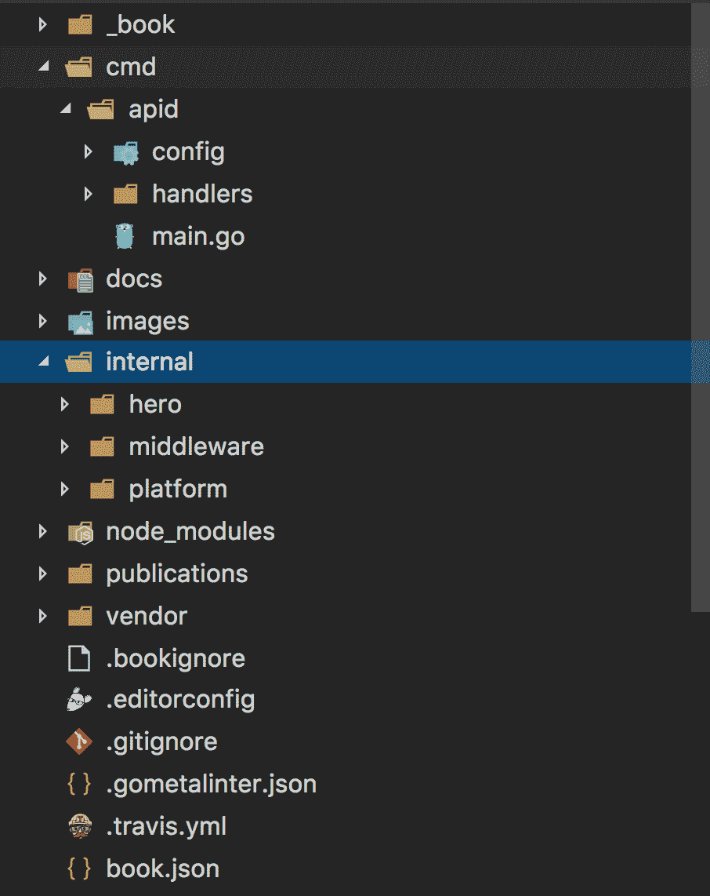

# 二、持续集成的基础

本章将有助于介绍**持续集成** ( **CI** )的概念，并有助于建立我们将在后面章节中探讨的 CI/CD 概念的基础。理解配置项构建的目的很重要，因为这些概念超越了您可能使用的任何给定的CI/CD工具。CI 很重要，因为它有助于保持代码库的健康，并帮助开发人员保持软件系统独立于任何特定的开发人员机器运行。配置项构建加强了软件组件和本地环境配置的独立性。配置项构建应该从任何一个开发人员配置中分离出来，并且应该能够在状态方面是可重复的和隔离的。运行的每个构建本质上都应该是独立的，因为这保证了软件系统正常工作。

本章将涵盖以下主题:

*   什么是 CI？
*   CI的价值
*   利用CI降低风险
*   软件在源代码签入时构建
*   小版本和大版本细分
*   CI构建实践

# 技术要求

本章仅假设对版本控制系统有粗略的了解，但读者至少应该了解什么是配置文件，并对编程有基本的了解。我们将简单地看一下一个 makefile 示例，这一章中会有一些代码片段。

我们将在本章中查看几个代码示例，包括一个使用 React/node . js/express . js/RethinkDB 的 API Workshop([https://github.com/jbelmont/api-workshop](https://github.com/jbelmont/api-workshop))和一个演示应用([https://github . com/jbelmont/advanced-tech-in-Wilmington-React-app](https://github.com/jbelmont/advanced-tech-in-wilmington-react-app))，我们还将展示一个`gulp.js`脚本文件。

# 什么是 CI？

CI 本质上是一个软件工程任务，其中源代码在主线干线上被合并和测试。配置项任务可以执行多种任务，包括测试软件组件和部署软件组件。配置项的行为本质上是说明性的，是任何开发人员、系统管理员或操作人员都可以执行的行为。持续集成是持续的，因为开发人员可以在开发软件的同时持续集成软件组件。

# 到底什么是软件构建？

软件构建不仅仅是一个编译步骤。软件构建可以包括编译步骤、测试阶段、代码检查阶段和部署阶段。软件构建可以作为一种验证步骤，检查您的软件是否作为一个内聚的单元工作。静态编译的语言，如 Golang 和 C++，通常有生成二进制文件的构建工具。例如，一个 Golang 构建命令，如`go build`，将生成一个静态编译的二进制文件，并在代码库中运行林挺。其他语言，如 JavaScript，可以使用工具，如`gulp.js` / `grunt.js`来完成被认为是构建步骤的工作，如**缩小**—将多个 JavaScript 源文件转换为一个文件—以及**修改**，去掉源文件的注释和任何空白，还有林挺和正在运行的测试运行程序。

# 简而言之，CI流程步骤

开发人员可以将代码提交给**版本控制** **项目** ( **VCP** )系统，例如 GitHub 和 GitLab。配置项服务器可以轮询存储库的更改，也可以配置配置项服务器通过网络钩子触发软件构建。我们将在稍后与Jenkins、Travis和 Circle CI 一起探讨这一点。配置项服务器将从 VCP 系统获得最新的软件版本，然后可以执行集成软件系统的构建脚本。配置项服务器应该生成反馈，将构建失败时的构建结果通过电子邮件发送给指定的项目成员。配置项服务器将持续轮询更改，或者从配置的网络钩子进行响应。

# CI的价值

CI之所以有价值，有很多原因。首先也是最重要的，配置项构建是有价值的，因为它可以降低风险，并且您的软件的健康状况变得可衡量。CI 有助于减少开发人员的假设。配置项环境不应该依赖于环境变量，也不应该依赖于在任何一个人的机器上设置的某些配置文件。

配置项构建应该干净且独立于每个开发人员的本地机器构建，并且配置项构建应该与任何本地环境分离。如果一个开发人员说一个构建可以在他/她的机器上运行，但是其他开发人员不能运行完全相同的代码，那么你就知道一个构建可能不能正常运行。配置项构建可以帮助解决这些问题，因为配置项构建与任何给定开发人员的设置和环境变量是分离的，并且独立于它们运行。

配置项构建应该减少重复的手动过程，并且配置项构建过程应该在每个构建中以相同的方式运行。配置项构建过程可能包括编译步骤、测试阶段和报告生成阶段。每次开发人员向版本控制系统(如 Git、subversion 和 mercurial)提交一个提交时，都应该运行配置项构建过程。配置项构建应该让开发人员能够从事更高价值的工作，并且应该减少由重复的手动过程造成的可能的错误。

一个好的配置项构建应该有助于随时随地生成可部署的软件。配置项构建应该支持项目可见性，并且应该建立开发团队对您的软件的信心。开发人员可以放心，与本地运行构建相比，配置项构建更容易发现代码更改的问题。

# 利用CI降低风险

CI 可以帮助减轻软件构建中普遍存在的风险，例如*它在我的机器*综合症中起作用。CI 还有助于统一故障的集成点，例如数据库逻辑以及许多其他类型的问题。

# 但是它在我的机器上工作！

开发人员之间的一个常见线程是软件构建在一个开发人员的机器上工作，但在另一个开发人员的机器上不工作。每个开发人员的机器都应该尽可能地反映软件集成。软件构建所需的一切都需要交付给版本控制系统。开发人员不应该拥有只存在于他们本地机器上的定制构建脚本。

# 数据库同步

完成软件构建所需的任何数据库工件都应该存储在版本控制中。如果您有一个关系数据库，那么任何数据库创建脚本、数据操作脚本、SQL 存储过程和数据库触发器都应该存储在版本控制中。

例如，如果您有一个 NoSQL 数据库系统，比如 MongoDB([https://www.mongodb.com/](https://www.mongodb.com/))，并且正在使用 RESTful API，那么一定要在文档中记录 API 端点。请记住，开发人员可能需要特定于数据库的代码来实际运行软件构建。

# 缺少部署自动化阶段

软件部署应该使用部署工具实现自动化。您使用的部署工具可能因不同的软件架构而异。

以下是部署工具列表:

*   章鱼部署(https://octopus.com/)
*   AWS 弹性豆茎([https://aws.amazon.com/elasticbeanstalk/](https://aws.amazon.com/elasticbeanstalk/)[)](https://aws.amazon.com/elasticbeanstalk/)
*   希罗库〔t 0〕https://www .希罗库. com/
*   谷歌应用引擎([https://cloud.google.com/appengine/](https://cloud.google.com/appengine/))
*   doku(http://doku . view docs . io/doku/)

部署工具很有价值，因为它们往往是跨平台的，可以在许多不同的软件架构中使用。例如，如果一个开发人员编写了一个 Bash 脚本，那么有一个潜在的假设，即其他开发人员正在一个类似 Unix 的系统上工作，而在 Windows 环境中工作的开发人员可能无法运行该脚本，这取决于他们使用的 Windows 版本。Windows 10 现在提供了一个 bash 子系统，Windows 开发人员可以在操作 Windows 操作系统的同时运行 Unix 命令和脚本。

# 缺陷发现较晚

配置项构建有助于防止软件缺陷的后期发现。配置项构建应该有一个足够好的测试套件，覆盖大部分代码库。健康的代码库的一个可能的度量是代码库中有 70%或更多的代码覆盖率。我们稍后将讨论代码覆盖率，但是任何软件测试都应该签入源代码，并且测试应该在 CI 构建上运行。您进行的任何软件测试都应该在配置项系统上连续运行。

# 测试覆盖率未知

一般来说，高百分比的代码覆盖率表明测试良好的代码库，但不一定保证代码库没有软件错误——只是测试套件始终有良好的测试覆盖率。尝试使用代码覆盖工具，以查看您的测试实际上覆盖了多少源代码。

# 代码覆盖工具

以下是一些流行的代码覆盖工具:

*   **伊斯坦布尔**([h](https://istanbul.js.org/)[ttps://伊斯坦布尔. js.org/](https://istanbul.js.org/) ):又一个 JavaScript 代码覆盖工具，通过模块加载器挂钩计算语句、行、函数和分支覆盖，在运行测试时透明地添加覆盖。支持所有 JS 覆盖用例，包括单元测试、服务器端功能测试和浏览器测试。专为规模化打造。
*   **goverbals**([https://github.com/mattn/goveralls](https://github.com/mattn/goveralls)):为[https://coveralls.io/](https://coveralls.io/)连续码覆盖追踪系统进行整合。
*   **dot cover**([https://www.jetbrains.com/dotcover/](https://www.jetbrains.com/dotcover/)):jetbarks dot cover 是一个. NET 单元测试运行器和代码覆盖工具，与 Visual Studio 集成。

确保您知道单元测试在多大程度上覆盖了您的代码。dotCover 计算并报告目标应用中的语句级代码覆盖率。NET 框架、Silverlight 和。NET 核心。

# 缺乏项目可见性

配置项系统应配置为以多种方式发送警报:

*   电子邮件
*   短信
*   通过智能手机推送通知提醒

一些软件开发办公室也使用一些其他创造性的方式在软件构建中发送问题通知，例如某种环境光变化，甚至可能是内部通话系统。主要的一点是，需要通知开发人员 CI 构建被破坏，以便他们可以快速修复构建。CI 构建不应该一直中断，因为这可能会中断其他开发人员的工作。

# 软件在源代码签入时构建

软件构建应该在版本控制系统中的每次源代码签入时触发。这是部署管道中的一个重要步骤，我们将在下一章中看到。

# 什么是软件构建？

软件构建可以只包括编译软件组件。构建可以包括编译和运行自动化测试，但是，一般来说，添加到构建中的过程越多，构建中的反馈循环就越慢。

# 脚本工具

倾向于使用专门为构建软件而不是个人脚本而设计的脚本工具。自定义 Shell 脚本或批处理脚本往往不是跨平台的，可以隐藏环境配置。脚本工具是开发一致的、可重复的构建解决方案的最有效的过程。

以下是脚本工具列表:

*   使([https://www.gnu.org/software/make/](https://www.gnu.org/software/make/))
*   玛文(https://玛文. apache.org/
*   莱宁根 （ [https://leiningen.org/](https://leiningen.org/) ）
*   stack([https://docs . haskellstack . org/en/stability/readme/](https://docs.haskellstack.org/en/stable/README/)[)](https://docs.haskellstack.org/en/stable/README/)

# 执行单命令构建

努力创建单一命令构建来简化软件构建过程，因为运行构建过程越容易，您就越能加快采用和开发人员的参与。如果做一个软件构建是一个复杂的过程，那么你最终将只有几个开发人员真正做一个构建，这不是你想要的。

# 简而言之，构建你的软件

1.  使用脚本工具创建您的构建，例如 Ant([https://ant.apache.org/](https://ant.apache.org/))、Make([https://www.gnu.org/software/make/](https://www.gnu.org/software/make/))、Maven([https://maven.apache.org/](https://maven.apache.org/))或 Rake([https://ruby.github.io/rake/](https://ruby.github.io/rake/))
2.  从配置项构建的简单过程开始
3.  添加每个过程，将您的软件集成到构建脚本中
4.  从命令行或集成开发环境运行脚本

这里有一个示例 makefile，它运行我的开源 https://github.com/jbelmont/api-workshop 的一个 Golang API 服务:

```
BIN_DIR := "bin/apid"
 APID_MAIN := "cmd/apid/main.go"
all: ensure lint test-cover
ensure:
 go get -u github.com/mattn/goveralls
 go get -u github.com/philwinder/gocoverage
 go get -u github.com/alecthomas/gometalinter
 go get -u github.com/golang/dep/cmd/dep
 go get -u golang.org/x/tools/cmd/cover
 dep ensure
lint:
 gometalinter --install
 gometalinter ./cmd/... ./internal/...
compile: cmd/apid/main.go
 CGO_ENABLED=0 go build -i -o ${BIN_DIR} ${APID_MAIN}
test:
 go test ./... -v
test-cover:
 go test ./... -cover
## Travis automation scripts
travis-install:
 go get -u github.com/mattn/goveralls
 go get -u github.com/philwinder/gocoverage
 go get -u github.com/alecthomas/gometalinter
 go get -u github.com/golang/dep/cmd/dep
 go get -u golang.org/x/tools/cmd/cover
 dep ensure
travis-script:
 set -e
 CGO_ENABLED=0 go build -i -o ${BIN_DIR} ${APID_MAIN}
 gometalinter --install
 gometalinter ./cmd/... ./internal/...
 go test ./... -cover
 gocoverage
 goveralls -coverprofile=profile.cov -repotoken=${COVERALLS_TOKEN}
```

下面是一个使用`gulp.js`的构建脚本示例，它从`sass`源文件生成一个 CSS 构建并运行一个 linter。第一个块 sh 初始化变量并获取准备使用的配置对象:

```
'use strict';

const gulp = require('gulp');
const webpack = require('webpack');
const sourcemaps = require('gulp-sourcemaps');
const sass = require('gulp-sass');
const autoprefixer = require('gulp-autoprefixer');
const uglify = require('gulp-uglify');
const concat = require('gulp-concat');
const runSequence = require('run-sequence');
const gutil = require('gulp-util');
const merge = require('merge-stream');
const nodemon = require('gulp-nodemon');
const livereload = require('gulp-livereload');
const eslint = require('gulp-eslint');

// Load Environment constiables
require('dotenv').config();
const webpackConfig = process.env.NODE_ENV === 'development'
  ? require('./webpack.config.js')
  : require('./webpack.config.prod.js');

const jsPaths = [
  'src/js/components/*.js'
];
const sassPaths = [
  'static/scss/*.scss',
  './node_modules/bootstrap/dist/css/bootstrap.min.css'
];

const filesToCopy = [
  {
    src: './node_modules/react/dist/react.min.js',
    dest: './static/build'
  },
  {
    src: './node_modules/react-dom/dist/react-dom.min.js',
    dest: './static/build'
  },
  {
    src: './node_modules/react-bootstrap/dist/react-bootstrap.min.js',
    dest: './static/build'
  },
  {
    src: img/favicon.ico',
    dest: './static/build'
  },

  {
    src: './icomoon/symbol-defs.svg',
    dest: './static/build'
  }
];
```

第二段代码是我们设置大量任务的地方:复制 React.js 文件，对 JavaScript 文件进行丑化，创建一个构建 JavaScript 文件，以及从 Sass 文件创建 CSS 文件。

```
gulp.task('copy:react:files', () => {
  const streams = [];
  filesToCopy.forEach((file) => {
    streams.push(gulp.src(file.src).pipe(gulp.dest(file.dest)));
  });
  return merge.apply(this, streams);
});

gulp.task('uglify:js', () => gulp.src(jsPaths)
    .pipe(uglify())
    .pipe(gulp.dest('static/build')));

gulp.task('build:js', (callback) => {
  webpack(Object.create(webpackConfig), (err, stats) => {
    if (err) {
      throw new gutil.PluginError('build:js', err);
    }
    gutil.log('[build:js]', stats.toString({ colors: true, chunks: false }));
    callback();
  });
});

gulp.task('build:sass', () => gulp.src(sassPaths[0])
    .pipe(sourcemaps.init())
    .pipe(sass({
      outputStyle: 'compressed',
      includePaths: ['node_modules']
    }))
    .pipe(autoprefixer({ cascade: false }))
    .pipe(concat('advanced-tech.css'))
    .pipe(sourcemaps.write('.'))
    .pipe(gulp.dest('./static/build'))
    .pipe(livereload()));

gulp.task('build:vendor:sass', () => gulp.src([...sassPaths.slice(1)])
    .pipe(sourcemaps.init())
    .pipe(sass({
      outputStyle: 'compressed',
      includePaths: ['node_modules']
    }))
    .pipe(autoprefixer({ cascade: false }))
    .pipe(concat('vendor.css'))
    .pipe(sourcemaps.write('.'))
    .pipe(gulp.dest('./static/build')));
```

在最后这段代码中，我们运行了一些观察器任务，这些任务将观察 JavaScript 文件和 Sass 文件中的任何更改，执行林挺操作，并创建一个 nodemon 进程，该进程将在任何文件更改时重新启动 Node 服务器:

```
gulp.task('watch:js', () => {
  const config = Object.create(webpackConfig);
  config.watch = true;
  webpack(config, (err, stats) => {
    if (err) {
      throw new gutil.PluginError('watch:js', err);
    }
    gutil.log('[watch:js]', stats.toString({ colors: true, chunks: false }));
  });
  gulp.watch('static/js/components/*.js', ['uglify:js', 'build:js']);
});

gulp.task('watch:sass', () => {
  gulp.watch('static/scss/*.scss', ['build:sass']);
});

gulp.task('watch-lint', () => {
  // Lint only files that change after this watch starts
  const lintAndPrint = eslint();
  // format results with each file, since this stream won't end.
  lintAndPrint.pipe(eslint.formatEach());

  return gulp.watch(['*.js', 'routes/*.js', 'models/*.js', 'db/*.js', 'config/*.js', 'bin/www', 'static/js/components/*.jsx', 'static/js/actions/index.js', 'static/js/constants/constants.js', 'static/js/data/data.js', 'static/js/reducers/*.js', 'static/js/store/*.js', 'static/js/utils/ajax.js', '__tests__/*.js'], event => {
    if (event.type !== 'deleted') {
      gulp.src(event.path).pipe(lintAndPrint, {end: false});
    }
  });
});

gulp.task('start', () => {
  nodemon({
    script: './bin/www',
    exec: 'node --harmony',
    ignore: ['static/*'],
    env: {
      PORT: '3000'
    }
  });
});

gulp.task('dev:debug', () => {
  nodemon({
    script: './bin/www',
    exec: 'node --inspect --harmony',
    ignore: ['static/*'],
    env: {
      PORT: '3000'
    }
  });
});

gulp.task('build', (cb) => {
  runSequence('copy:react:files', 'uglify:js', 'build:js', 'build:sass', 'build:vendor:sass', cb);
});

gulp.task('dev', (cb) => {
  livereload.listen();
  runSequence('copy:react:files', 'uglify:js', 'build:sass', 'build:vendor:sass', ['watch:js', 'watch:sass', 'watch-lint'], 'start', cb);
});

gulp.task('debug', (cb) => {
  livereload.listen();
  runSequence('copy:react:files', 'uglify:js', 'build:sass', 'build:vendor:sass', ['watch:js', 'watch:sass', 'watch-lint'], 'dev:debug', cb);
});
```

# 从集成开发环境中分离构建脚本

尽量避免将您的构建脚本耦合到任何特定的**集成开发环境** ( **IDE** )。构建脚本不应该依赖于任何集成开发环境。

这很重要，原因有二:

*   每个开发人员可能使用不同的 IDE/编辑器，并且可能有不同的配置
*   配置项服务器必须在没有任何人工干预的情况下执行自动构建

# 软件资产应该集中化

以下软件资产应可在集中的版本控制存储库中获得:

*   组件，如源文件或库文件
*   第三方组件，如 dll 和 JAR 文件
*   配置文件
*   初始化应用所需的数据文件
*   构建脚本和构建环境设置
*   某些组件所需的安装脚本

You must decide what should go into version control.

# 创建一致的目录结构

您必须为您的软件资产选择一致的目录结构，因为它可以帮助您从配置项服务器执行脚本检索。

下面是我为一个框架 React/Redux 应用所做的示例文件夹结构:

*   `ca`(证书颁发机构)
*   `config`(配置文件)
*   `db`(数据库相关资料)
*   `docs`(文档)
*   `images`
*   `models`(数据文件)
*   `test`(我所有的测试文件)
    *   `unit`
    *   `integration`
    *   `e2e`
    *   `helpers`
*   `static`
    *   `build`
    *   `js`
        *   `actions`
        *   `components`
        *   `constants`
        *   `data`
        *   `reducers`
        *   `store`
        *   `utils`
    *   `scss`
*   `utils`(实用程序文件)

下面是我一直遵循的另一个目录结构，是 **Bill Kennedy 从 Golang 社区**([https://www . ardanlabs . com/blog/2017/02/package-oriented-design . html](https://www.ardanlabs.com/blog/2017/02/package-oriented-design.html))推荐的面向包的目录结构:

*   `kit`:
    *   为现有的不同应用项目提供基础支持的包
    *   日志记录、配置或 web 功能
*   `cmd/`:
    *   为正在为启动、关闭和配置而构建的特定程序提供支持的包
*   `internal/`:
    *   为项目拥有的不同程序提供支持的包
    *   CRUD、服务或业务逻辑
*   `internal/platform/`:
    *   为项目提供内部基础支持的包
    *   数据库、身份验证或封送处理

要点是，您应该遵循所有开发人员都遵循的标准代码库命名约定。这将有助于开发团队的工作，因为他们将熟悉代码中的特定内容。不是每个人都会同意特定的目录布局，但是有一个标准是最重要的部分。例如，任何使用较新服务的人都应该能够基于文件夹的编码命名约定来设置项目结构，源文件放在哪里，测试文件放在哪里:



这是我在 GitHub 中创建的一个 API Workshop([https://github.com/jbelmont/api-workshop](https://github.com/jbelmont/api-workshop))使用的示例目录结构。

# 软件构建应该很快失败

这可以通过执行以下操作来实现:

1.  集成软件组件。
2.  运行真正的单元测试——不依赖于数据库但独立运行的单元测试。
3.  确保单元测试能够快速运行。如果一个单元测试需要几分钟，那么这可能是一个问题的迹象。
4.  运行其他自动化流程(重建数据库、检查和部署)。

It is up to each company what other steps are necessary for their builds.

# 适合任何环境的建筑

应该为不同的环境设置配置文件和环境变量，例如开发/生产/测试。日志详细程度应该能够根据环境进行设置。开发人员可能需要增加调试日志。可以在构建文件中设置应用服务器配置信息以及数据库连接信息和框架配置。

下面是一个可以使用的示例文本文件。需要注意的一点是，此类文件不应提交给源代码管理，因为它们可能包含客户端机密和 API 机密:

```
API_URL=http://localhost:8080
PORT=8080
AUTH_ZERO_CLIENT_ID=fakeClientId
AUTH_ZERO_JWT_TOKEN=someFaketToken.FakedToken.Faked
AUTH_ZERO_URL=https://fake-api.com
REDIS_PORT=redis:6379
SEND_EMAILS=true
SMTP_SERVER=fakeamazoninstance.us-east-1.amazonaws.com
SMTP_USERNAME=fakeUsername
SMTP_PASSWORD=FakePassword
SMTP_PORT=587
TOKEN_SECRET="A fake Token Secret"
```

像这样的配置文本文件可以帮助其他开发人员连接到第三方服务，并将帮助组织客户端机密信息的存储位置。

# 小构建和大构建细分

小型构建通常是可以由配置项服务器快速运行的构建，通常包括编译步骤以及运行所有单元测试。一个小的构建可以通过运行分阶段构建来优化，这将在 *CI 构建实践*部分讨论。

大型构建是指在一个大型构建中运行所有构建任务的构建。进行大规模构建的缺点是它们会阻碍开发人员运行它们。如果一个软件构建需要很长时间来运行，那么许多开发人员会完全避免运行这个构建。快速运行的小版本鼓励开发人员在版本控制系统上不断签入他们的更改，并有助于保持代码库的健康。

# CI构建实践

CI 构建实践就像垫脚石；它们相互叠加。正如我们将在下一章中看到的，配置项构建过程中的每一步都很重要，并保证您的代码库处于健康状态。

# 私人建筑

开发人员应该在将代码提交到存储库之前运行私有构建。

下面是一个使用 Git 的开发人员会话示例:

1.  检查您将从存储库中修改的代码:
    1.  进入版本控制文件夹。
    2.  `git checkout -b new_branch`。
2.  对代码进行更改:
    1.  编辑〔t0〕。
3.  从存储库中获取最新的系统更改:
    1.  `git pull`。
4.  运行一个在本地机器上执行所有单元测试和可能的集成测试的构建。
5.  将您的代码更改提交到存储库。
6.  配置项构建应该自动触发构建并运行存储库中的任何测试。
7.  配置项构建还应该执行其他任务，如报告和调用其他服务(如果需要)。

# 配置项服务器的使用

配置项服务器应该以指定的时间间隔轮询版本控制存储库系统(如 GitHub)中的更改，或者通过 WebHook 进行配置以触发软件构建。配置项构建应该在计划的基础上执行某些操作—每小时或每天，如果需要的话。您应该确定一个*平静期*，在此期间，没有为项目执行集成构建。配置项服务器应该支持不同的构建脚本工具，如瑞克、Make、NPM 或 Ant。配置项服务器应该向相关方发送电子邮件，并显示以前版本的历史记录。

配置项服务器应该显示一个可通过网络访问的仪表板，以便所有相关方可以在必要时查看集成构建信息。Jenkins、Travis和 Circle CI 都有可通过网络访问的仪表盘。配置项服务器应该支持不同项目的多个版本控制系统，例如 svn、Git 和 mercurial。

# 手动集成构建

如果有一个长期运行的功能很难在配置项服务器上运行，手动运行集成构建是减少集成构建错误的一种方法，但是要谨慎使用这种技术。例如，您可以指定一台不用于执行手动集成任务的机器；尽管有了云，现在比以往任何时候都更容易按需启动服务器实例。

# 运行快速构建

通过增加计算资源，尽可能快地运行软件构建。将运行速度较慢的测试(如系统级测试)卸载到辅助构建或夜间构建中。将代码检查卸载到第三方服务。例如，对于代码覆盖率分析，您可以使用以下第三方服务:

*   codecov([https://codecov.io/#features](https://codecov.io/#features))
*   工作服([https://coveralls.io/features](https://coveralls.io/features)T2)
*   代号气候[(](https://coveralls.io/features)[)](https://coveralls.io/features)
*   https://www.codacy.com/product

运行分阶段构建也可以促进快速构建。第一个构建可以编译和运行所有的单元测试。第二个构建可以运行所有的集成测试和系统级测试。为了快速构建，您可以有任意多的阶段。可以说，第一次构建应该是最快的，因为这将是开发人员将代码签入代码库时使用的主要构建。

# 摘要

本章提供了配置项概念的基础，并介绍了在开发团队中使用成功的配置项服务器的技术。我们看了脚本工具和构建工具。我们讨论了什么是软件构建，创建构建脚本时要遵循的良好实践，以及一些测试概念，例如代码覆盖率。下一章是**持续交付** ( **光盘**)，这是 CI 的自然延伸，我们将详细介绍部署管道、配置管理、部署脚本和部署生态系统。

# 问题

1.  什么是软件构建？
2.  分阶段构建是什么意思？
3.  你能说出一些脚本工具吗？
4.  为什么要遵循命名约定和文件夹结构？
5.  CI 的价值是什么？

# 进一步阅读

一本深入研究CI的好书是由帕克特出版社出版的《学习与Jenkins的持续集成——第二版:使用Jenkins 2([https://www.amazon.com/dp/1788479351/](https://www.amazon.com/dp/1788479351/))实现持续集成和持续交付的初学者指南》。