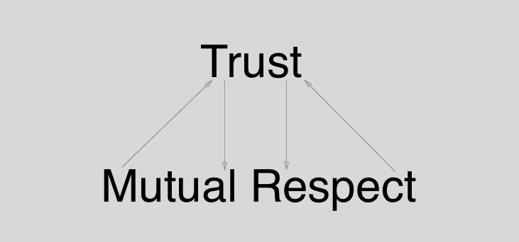
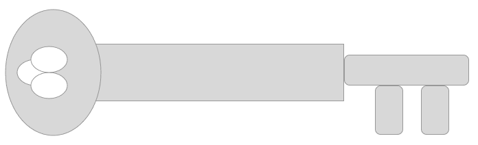
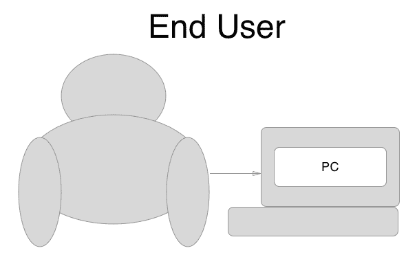
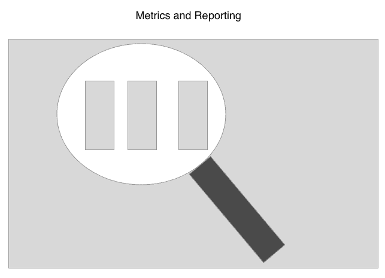

# 四、CI/CD的商业价值

既然我们已经清楚了什么是自动化、**持续集成** ( **CI** )和**持续交付** ( **CD** )我们需要将这些实践的商业价值传达给商业利益相关者，否则我们就有可能在没有包含这些实践的行动项目的情况下构建特性。这一章是关于说服利益相关者这些价值观，我们将讨论沟通方面的问题，如何向团队成员传达痛点，在不同团队之间分担责任，了解您的关键利益相关者，如何展示为什么 CI/CD 很重要，以及如何获得利益相关者对 CI/CD 的认可。

本章将涵盖以下主题:

*   沟通问题
*   向团队成员传达痛点
*   在不同团队之间分担责任
*   了解您的利益相关者
*   展示CI/CD为何重要
*   从您的利益相关者处获得 CI/CD 的批准

# 技术要求

本章假设您已经熟悉了自动化和 CI/CD 的概念；阅读[第 1 章](01.html)、*自动化测试 CI/CD*、[第 2 章](02.html)、*持续集成基础知识*，如果对这些主题不确定，请在阅读本章之前阅读。本章将主要讲述如何向涉众传达这些实践的价值，因此不会有任何代码示例或安装要做。

# 沟通问题

在任何工作环境中，沟通肯定会有问题，尤其是在敏捷工作环境中。沟通中的一些问题是需求沟通不畅、缺乏适当的文档、时区差异、缺乏信任和相互尊重、文化差异、语言障碍以及反馈循环周期长。

# 需求的错误传达

下面是需求清单的描述。需求清单的目的是为一个特定的特性列出所有必要的事实:

需求的错误传达是敏捷工作环境中冲刺周期中常见的问题。要真正完全消除需求的错误传达是不可能的，但是通过确保您从特性请求开始就与最终用户或客户进行沟通来最小化这种风险是很重要的。

重要的是，您正在实现的特性请求要明确陈述，并且每一项功能都有明确的业务意图。这很重要，因为它有助于开发人员、开发人员和质量保证/测试人员在实现阶段做好更好的准备。

提前了解关键的业务需求将有助于减少团队之间的需求沟通错误，因为当某些行为没有被预期时，缺失的需求很容易造成开发瓶颈。任何关键需求信息都需要正确记录。

# 缺乏适当的文件

文档需要在任何需求被定义的时刻被编写，并且必须在特性被处理的同时用附加信息不断更新。只有当一切都被尽可能清晰地定义和陈述时，你才能开始编写一个计划来实现一个特定的特性。如果开发人员遇到问题，需要客户澄清，那么答案需要直接放在需求中，以备将来参考。

避免拥有多个包含需求信息的文档，而是拥有一个包含需求信息的文档，否则您将面临信息过期的风险；或者更糟的是，不同的需求分散在相互矛盾的不同地方。

There should be a single source of truth with the business requirements and they should be understood by all parties.

# 时区差异

随着越来越多的团队变得分散和全球化，时区的差异会造成沟通瓶颈。在剧烈的时区差异中工作的开发人员需要确保良好的 CI/CD 实践发挥作用。破碎的配置项构建和配置管理问题可能会随着时区的不同而迅速恶化，因为一个时区的团队将无法完成有效的工作。对于分布式团队来说，沟通尤其重要，因为缺乏面对面的互动会导致沟通失败，最糟糕的是，如果管理不当，会在团队之间产生敌意。

I once worked at a startup where there was a 3-hour time zone difference, which in itself is not an issue, but the standup was done at the end of the business day while the other team started the day at noon our time. Naturally, this led to days where changes done by the other team would block us until midday our time, when the other team was available. 

# 缺乏信任和相互尊重

以下图表描述了信任和相互尊重是相辅相成的，团队需要这一点才能高效运作:

团队之间的信任至关重要，很容易*失去*，但*很难赢得*。最好是有一个好的项目经理，他可以促进团队之间的沟通，并帮助澄清必然会发生的问题。当专题工作中出现问题时，健康的团队会公开交流，有回顾来帮助团队成员发泄不满和建立信任是很好的。

如果可能的话，最好举办团队郊游活动，让多个团队可以相互交流，帮助彼此建立合作关系。一些公司每季度召开一次会议，团队可以一起做一些有趣的事情，比如运动或游戏。团队建设练习也可以经常安排，以保持人们的参与和建立合作精神。

# 文化差异和语言障碍

随着敏捷工作环境变得更加全球化，全球团队变得更加普遍。团队之间的文化差异使得沟通成为项目成功的更重要因素。幽默可能是一把双刃剑，因为如果有意的幽默被断章取义，许多团队可能会制造分裂和敌意，所以最好能让团队了解文化规范和习俗，以避免误解问题。

语言障碍也会产生问题，因为特性请求的需求可能会被误解。最好是项目经理能够作为团队之间的联络人，确保团队之间清楚地理解所有需求，并帮助澄清任何沟通瓶颈。

# 长反馈环路周期

以下是反馈循环的描述。反馈回路越大，做出改变所需的时间就越长。重要的是在部署管道上有一个简短的反馈循环，以便有效，并使您能够在必要时及时做出更改:

我们在 [第 1 章](01.html)、*带有自动测试的 CI/CD*中谈到了长反馈循环，特别是我们谈到了长反馈循环的危险以及缩短反馈循环周期是多么重要，以便在正确的时间将正确的信息提供给正确的人。同样，团队之间长时间的反馈循环会产生问题和自然瓶颈。

理想情况下，团队会尽快获得他们需要的信息，但这并不总是现实。一个合适的联络员或项目经理可以帮助缩短团队之间的反馈循环，团队需要正确地记录任何过程，并确保其他团队可以看到和知道这些文档，否则团队之间的过程可能会有所不同。

Remember that short feedback loops lead to faster response times.

# 向团队成员传达痛点

团队成员能够有效地沟通阻碍进展的特定痛点或阻碍因素非常重要。我们将在本节中讨论几个痛点，包括等待需求信息、部署管道中未记录的步骤、太多的王国密钥持有者以及太多的通信渠道。

# 等待需求信息

通常情况下，开发人员会开始一个特定的故事/特性，并且没有完成分配给他们的工作所需的所有要求。这对于开发人员来说尤其成问题，因为他们所处理的任何代码都可能需要废弃和重做，这取决于需求离正确完成还有多远。开发人员在开始一个故事之前需要所有的需求；每个特性都必须有流程来获取所有的需求，理想情况下，每个故事都有验收测试，作为被认为已经完成的特性工作的行动项目。在理想的情况下，开发人员在开始他们特定的特性工作之前就已经准备好了所有必要的信息，当特性按照需求文档中的规定完成时，为这个故事编写的验收测试就会通过。

在 [第 1 章](01.html)*带有自动化测试的 CI/CD*中，我们以比利·鲍勃的机器零件公司为例进行了讨论。现在，假设开发团队的汤姆已经开始显示供应商名称，汤姆发现这张票的范围似乎很大，他可能无法及时完成。这个场景也因为需求文档严重缺乏和开发过程中关键细节缺失而变得复杂。汤姆问产品所有者，他是否可以对某些项目提供反馈，但必须等待几天才能获得这些必要的信息。

# 部署管道中未记录的步骤

部署管道过程中的每一步都应该被适当地记录和自动化。我们在[第 5 章](05.html)、*Jenkins*的安装和基础知识中谈到了在部署管道中尽可能实现自动化的重要性。重申一下，手动过程是有问题的，因为它们是可重复和可靠的。自动化很重要，因为它为部署管道带来了可重复性和可靠性。每当有人不得不做一个手动步骤时，就不能保证这个过程是否会在每次运行中以相同的方式正确完成；只有自动化，您才能保证部署管道阶段的可重复性。

Alvin 是 DevOps 团队的一员，他正在开发软件产品的最新版本，并在部署管道中运行一个复杂的手动过程。Alvin 输入了错误的命令，最终破坏了生产数据库。对阿尔文来说幸运的是，有一个一天前的备份，他可以将生产数据库恢复到这个副本。如果有自动化流程，这就不会发生。

# 王国的钥匙选择很少

下图代表一把钥匙，关于王国的钥匙，需要记住的主要事情是少数几个人拥有生产环境的访问/钥匙:

控制谁能在生产环境中做出改变是很重要的，许多软件公司通常会选出几个甚至一个能在生产中做出改变的人。如果这个特定的人不可用或者离开了公司，这可能会成为问题，但是一些公司已经建立了开发团队端对端拥有一个特定特性的实践，并且在该特性上工作的同一个开发人员负责修复在部署管道中遇到的问题。在我工作过的一家公司，我们亲切地说，*只有少数人拥有王国的钥匙*。

阿尔文是为数不多的持有王国钥匙的德沃普人员之一。一名客户支持代表向开发团队发送了生产中断的消息，开发团队正忙着为客户恢复生产环境。Alvin 和 DevOps 的另一名成员是唯一能够接触生产环境的人。阿尔文或其他指定的德沃普斯人员都不在，这一事实加剧了这个问题。

# 沟通渠道太多

在通信方面应该有一个低的信噪比。如果开发人员收到关于问题的电子邮件、短信、语音邮件和 Slack 消息，他们可能很快就会忽略这些问题，不再关注这些问题。当遇到问题时，让开发人员注意解决问题是很重要的，但是您可能不应该像军事指挥中心那样被警告，在那里您会被来自许多不同来源的通知轰炸。

想象一下，Bruce 是团队中较新的开发人员，Bruce 收到了关于他处理的低优先级票证的警报。布鲁斯收到了一封关于这张票的电子邮件、短信、短信和电话。布鲁斯往往会收到很多这样的信息，很快就决定忽略它们。在一个特别的下午，布鲁斯忽略了一张高优先级的票，因为他认为这是一个毫无意义的警报。布鲁斯对警报变得不敏感了。

There is too much noise and not really any true signals in the alerting process with all of these alerts.

# 痛苦驱动发展

如果 CI/CD 管道中的某些东西给你带来了某种程度的痛苦，那么自动化这个过程可能是个好主意。如果您有一个在部署管道中容易出错的 15 步过程，并且由于执行中的错误而在发布过程中导致了许多问题，那么这可能是其他人在某个时候感受到的痛苦。这个想法是，痛苦应该引导你朝着正确的方向去寻找更好的解决方案。如果您对流程有问题，那么您可能需要自动化该流程。并不总是需要为了自动化而自动化任务；您需要持续评估您的流程，PDD 可以成为找到需要改进的流程的有效工具。

吉米在林挺失败的每个承诺阶段都遇到了问题。Jimmy 在将代码推送到存储库之前忘记检查 lint 任务。这特别麻烦，因为 Jimmy 确保运行所有的单元测试来检查它们是否通过，但是习惯性地忘记检查林挺错误。吉米认为痛苦已经足够了，需要一个新的过程。Jimmy 编写了一个预 Git 推挂钩脚本，在每次 Git 推送到主服务器时运行 linter。现在，每次有人向主服务器推送代码时，脚本都会运行 linter，以确保不会在代码库中引入林挺错误。

# 在不同团队之间分担责任

如果没有一些协作和透明度，特定的痛点或实践在其他团队中发生的地方并不总是显而易见的。如果团队能够与其他团队分享责任和实践，这是很好的。如果可能的话，你应该轮换团队成员，尝试寻求开发实践的反馈，并尝试创建跨职能团队。

# 轮换团队成员

下图象征着团队成员的轮换。如果可能的话，创建一个团队轮换，让不同的团队成员可以在不同的工作职责之间循环，这可以帮助团队成员分担责任，建立高效的流程，并有可能激发创新:

通过将团队成员轮换到不同的团队，您有助于塑造他们的视角，并提供对开发实践更广泛的理解，增加他们的产品知识。这并不总是可能的，尤其是对于高度专业化的团队，如安全团队或机器学习团队，因为任何给定开发人员有效工作所需的加速时间水平可能会有所不同。如果可能的话，将团队成员轮换到相关的项目和技术中可以帮助防止开发人员倦怠，并且可以帮助开发人员相互学习。很容易变得自满，习惯于事情是如何做的，通常情况下，一双新鲜的眼睛可以用新的眼光看待事情，并帮助给开发团队带来必要的变化。

布鲁斯在 API 开发团队工作，已经轮换到网络工程团队。轮换周期大约是 3 到 6 个月，Bruce 已经学习了一些对 API 开发团队有帮助的实践。交叉培训工程师的一些优点是，他们在其他开发团队中学习的技能可以转移回其他团队。Bruce 学习了一些缓存优化，他可以将其应用于网络层和 OSI 层，这将有助于 API 开发团队。**开放系统互连** ( **OSI** )是一个概念模型，可以说，它将通过网络发送的信息分解成不同的层。OSI 模型中有七层——T4 应用层(第七层)**表示层**(第六层)**会话层**(第五层)**传输层**(第四层)**网络层**(第三层)**数据链路** **层**(第二层)**物理层**(第一层)。Bruce 一直在应用层使用优化策略，但是通过对网络层的一些新发现的知识，Bruce 提出了更新的优化策略。

# 征求对开发实践的反馈

团队成员之间的沟通对于团队的长期成功至关重要。开发人员不应该害怕要求反馈为什么事情是以特定的方式完成的，创造一个欢迎*建设性批评*的健康环境是很重要的。团队成员可能会对团队流程感到自满，并可能错过优化流程的机会。

让我们回到我们的示例公司，比利·鲍勃的机器零件公司。假设汤姆最近加入了团队，并注意到在应用编程接口报告中设置的步骤过于复杂，需要许多步骤来启动和运行特定的环境。Tom 询问是否有人考虑过使用构建工具自动化一些步骤，并被告知要努力自动化他认为有帮助的任何步骤。Tom 决定编写一个 Makefile，它可以通过简单地运行`make`命令来封装开始特定环境的所有步骤。Tom 创建了一个对 API repo 的拉请求，并引入了这一新功能，这有助于自动化创建特定环境的步骤。

# 创建跨职能团队

如果可能的话，如果你有资源，试着创建跨职能团队，这样团队就可以在其他团队成员之间分享专业知识。例如，一个团队可以有两到三个开发人员、一个质量保证团队成员、一个安全团队成员、一个开发团队成员和一个产品所有者，他们一起工作，能够提高效率，否则如果他们单独工作，就不会提高效率。

回到我们的示例公司，想象一下下面的跨职能团队集合。汤姆、史蒂文和鲍勃都是开发人员，里奇是安全团队成员，苏珊是 DevOps 团队成员，尼基是产品所有者。所有人都在同一个空间工作，每天早上一起站起来。现在，团队成员能够拥有端到端的部署管道阶段，因为他们可以一起工作并相互帮助自动化流程。Tom 和 Steven 使用一个新的库帮助编写了一个自动化测试套件，Ricky 能够添加第三个构建阶段，该阶段运行对主分支所做更改的安全检查。随着每个项目在部署管道中的进展，Susan 添加了监控和报告指标。尼基很快更新了鲍勃的需求文档，因为他注意到了他的新功能作品的一个优势案例。团队成员公开地交流他们过程中的每一步，并且能够优化过程，因为他们公开地相互协作。

# 了解您的利益相关者

对于一个开发团队来说，了解他们所有的涉众是很重要的，因为涉众将掌握着可以帮助团队成功或失败的关键信息。开发团队应该能够在必要时与项目经理沟通，公开与执行领导团队的成员沟通，并能够与最终用户交谈。

# 项目经理

虽然产品所有者可能会承担项目经理的角色，并且可以帮助促进 scrum 主的职责，但是最好由不同的人来完成这些角色。项目经理可以被视为适应动态工作环境的变革代理人。在一天结束时，项目经理希望能够将可交付成果发送给最终用户，并帮助打开不同团队之间的沟通渠道。重要的是，开发人员能够公开交流，并将他们在特性工作中遇到的任何问题通知项目经理。

一些公司还雇佣了一名敏捷项目经理，负责敏捷工作环境中的工作流和方法。敏捷项目经理将为冲刺时间表制定一个路线图，并确保开发团队中的每个开发人员都被适当地分配到他们计划的工作中。这种类型的经理通常会更加了解团队的所有工作，并确保所有相关方拥有完成交付所需的所有工具和信息。

# 行政领导团队

公司文化在很大程度上受到高管领导团队的影响，如**首席执行官***(***【CEO】**)、**首席信息官** ( **CIO** )、 **c** **hief 技术官** ( **CTO** )、**首席运营官** ( **首席运营官**)。除非你在这些高管层工作，否则不可能对公司产生广泛的影响。如果开发团队认为决策是法令，他们在决策中没有发言权，他们可能无法预防原本可以预防的问题。许多公司表示，他们有一个开放的政策，欢迎建设性的反馈，但通常开发团队在与破碎的流程斗争时，不会被授权畅所欲言。

假设 Tom 在周末阅读了一篇博客文章，并发现了一种减少自动化验收测试套件中反馈循环的方法。汤姆想介绍的这种变化需要在工作中有所突破。汤姆试图在周一早上的起立发言中提到这一点，但遭到了团队的阻挠，因为还有更有价值的工作要做。汤姆认为这一点非常重要，高层管理人员应该意识到这一点。汤姆继续使用门户开放政策与首席技术官谈论此事，但第二天因没有通过适当的领导渠道而受到口头训斥。这样，Tom 就无法做出最有利于团队的决策，因为没有一个团队成员觉得自己有权对工作流程进行更改。

# 最终用户

这是对最终用户的描述；说到底，他们是最重要的利益相关者。最终用户的反馈最有分量:

最终用户将使用您添加到产品中的新功能。从这个意义上说，它们可以帮助澄清对开发人员的必要要求。通常情况下，最终用户并不完全清楚他们在寻找什么，直到它就在他们面前。重要的是，如果需要的话，产品所有者应该提前从客户那里获得所有必要的需求，一些软件组织甚至让产品所有者/客户编写测试，在代码中指定必须实现的需求。在任何情况下，在开发人员开始工作之前，产品所有者和最终用户必须与所请求的功能保持同步。

开发团队在很大程度上脱离了最终用户，不会与任何最终用户进行交互。然而，对于开发团队来说，了解最终用户在使用软件系统时遇到的具体痛点是很重要的。从这个意义上说，开发人员最有能力在系统中创建有利于最终用户的更改，但是如果开发人员没有意识到这些痛点，他们将无法创建有利于最终用户的必要更改。让开发人员在适当的时候与客户成功团队合作，看看最终用户如何使用软件系统，可能会有所帮助。

# 展示CI/CD为何重要

CI/CD 管道的重要性不可低估，开发人员需要通过提供度量标准、报告以及对领导层进行自动化重要性的教育来证明其重要性。

# 度量和报告

下图是图表和图形的描述，您可以使用这些图表和图形向您的利益相关者演示 CI/CD 为什么重要。开发图形和图表是一个好主意，因为视觉效果非常令人信服:

通常，在公司的管理层，数字和幻灯片必须展示为什么某件事很重要。开发人员应该能够用度量标准(图表、图解和任何其他可视形式)来说明 CI/CD 如何改进现有流程。已经有一些企业解决方案可以帮助生成这些信息，但是开发团队可以将这些信息聚合到一个 Excel 电子表格中。

假设来自开发团队的 Bob 已经决定适可而止，并且当前在发布日实现的手动流程迫切需要自动化。Bob 汇总了过去 6 个月在紧急修复上花费的所有时间，以及每个开发人员在发布日期间出现的问题上浪费的工时。Bob 创建了一个漂亮的可视化图表，帮助说服管理层创建一个敏捷史诗，处理创建自动化部署管道。

# 培养自动化领导能力

开发团队不能假设领导层理解自动化意味着什么，以及自动化的哪些领域已经成熟。如果技术代表(如首席技术官)能够作为自动化的支持者提供帮助，并帮助向执行领导团队解释这一点，那将是最好的。像首席技术官这样的人可以帮助成为代表开发人员发言的变革代理人，但是无论谁传递这些信息，执行团队都必须了解什么是自动化，什么东西能够被自动化。

领导团队往往远离开发人员日常工作。领导团队对公司有更多的全球关注，并将倾向于与其他成员合作，如销售、营销、运营和项目经理。对执行领导团队来说，接受自动化方面的教育仍然很重要，这样开发人员就有必要的时间来开发自动化部署管道，因此他们在每次冲刺时都有时间进行测试，并不断将自动化流程添加到 CI/CD 构建管道和部署管道中。需要清楚地了解组织最高级别的自动化，以便开发人员、系统管理员和 DevOps 人员能够将自动化实践纳入公司路线图中的关键交付内容。

# 从您的利益相关者处获得 CI/CD 的批准

即使在强调自动化的重要性并教育您的利益相关者自动化的重要性时，您也可能需要在没有官方批准的情况下采取行动。许多软件项目都是作为一个 skunkworks 项目开始的，由一个单独的开发人员在没有官方批准的情况下开发。开发人员也可以在他的本地机器上或者在需要的时候在一个未使用的机器上进行部署管道自动化任务。

# 启动 skunkworks 项目

skunkworks 项目一词的起源尚有争议，但总的想法是，这是一个由一个或多个特定个人秘密进行的项目，旨在为组织带来创新和变革。对于开发人员来说，获得对给定任务的批准并不总是可能的，他们可能需要诉诸替代策略来表达他们的观点。

想象一下，开发团队的 Bob 有一个想法，要编写一个 CLI 应用，帮助车载第三方开发人员利用公司仪表板。鲍勃试图把这个想法传达给高层管理人员，但没有成功。鲍勃决定在接下来的几周内编写一个命令行界面应用，并决定使用一种叫做 **Rust** 的较新的编程语言来编写命令行界面项目。Bob 创建了一个直观的 CLI 应用，该应用易于使用且可插拔。Bob 能够向团队展示这个新应用，并反过来说服高层管理人员将资源投入到 CLI 项目中。

# 在本地计算机上启动CI/CD

开发团队可能无法获得启动CI/CD管道的财务批准。为了发现并让其他人相信自动化 CI/CD 管道的重要性，开发人员可以在他或她的机器上复制部署管道，并向团队和上层管理人员展示构建自动化管道阶段的好处。

如今，有了大型云提供商，如 Azure、AWS 和谷歌应用引擎，就有可能获得提供云服务的免费账户计划。这样，开发人员可以通过展示一个小项目并展示 CI/CD 管道中的所有阶段，如提交阶段、自动化验收测试阶段以及可选的安全性和容量构建阶段，轻松地建立更现实的部署管道。

# 公司介绍

公司范围内的演示文稿可能是在您的组织中获得 CI/CD 批准的最有效方式。有些公司赞助黑客马拉松，你可以在赞助的黑客马拉松上为公司创建一个新的自动化流程。这样做的好处是，您可以在公司演示期间将消息自动化提升到组织的最高级别。

假设开发团队的 Tommy 正在试验 Docker，并且有想法为每个部署管道创建一个 Docker 映像。Tommy 展示了 Docker 容器可以作为一个隔离的版本控制系统，QA 可以用它来测试软件产品的版本，这也有环境隔离的优势。Tommy 构建了这个自动化过程，并在公司演示中显示，这可以节省 QA 部门 25 小时的回归测试工时。首席执行官没有意识到，在部署过程中，质量保证花费了很多时间试图建立一个环境来进行回归测试。Tommy 通过一个令人信服的演示展示了自动化的重要性。

# 午餐和学习

下图只是对一把刀叉的描绘，但主要的一点是，和别人掰饼是打开沟通渠道，把人聚在一起的好方法。您可以在午餐时间的公司会议中加入自动化演示:

你可以邀请高层管理人员，并使用图表和幻灯片，这些图表和幻灯片有助于解释什么是自动化，并显示花费在手动流程上的资金。通常，上层管理人员对一项活动的金钱影响更感兴趣，如果你能向他们展示手动流程的成本，他们会更倾向于倾听。

# 摘要

正如本章所述，传播CI/CD的商业价值非常重要。本章一开始我们讨论了沟通方面的问题，并讨论了一些向团队成员传达痛点的策略。我们讨论了在不同的团队成员之间分担责任，了解您的利益相关者，展示为什么CI/客户关系管理对您的利益相关者很重要，最后从您的利益相关者那里获得CI/客户关系管理的批准。

下一章将介绍如何在您的本地环境中设置Jenkins配置项。本章将介绍本书的第一个 CI/CD 工具。

# 问题

1.  为什么一开始就要有所有的需求信息？
2.  为什么是痛苦驱动的开发？
3.  为什么拥有很多沟通渠道会有问题？
4.  轮换团队成员有哪些好处？
5.  征求对现有开发实践的反馈有什么好处？
6.  使用指标和报告在向利益相关方展示 CI/CD 的价值方面有何用处？
7.  为什么需要对领导层进行自动化教育？

# 进一步阅读

考虑阅读*包装出版*的*持续集成、交付和部署*，因为这本书讨论了 CI/CD 对软件组织的价值:

*   [https://www . packtpub . com/application-development/continuous-integration-delivery-and-deployment](https://www.packtpub.com/application-development/continuous-integration-delivery-and-deployment)