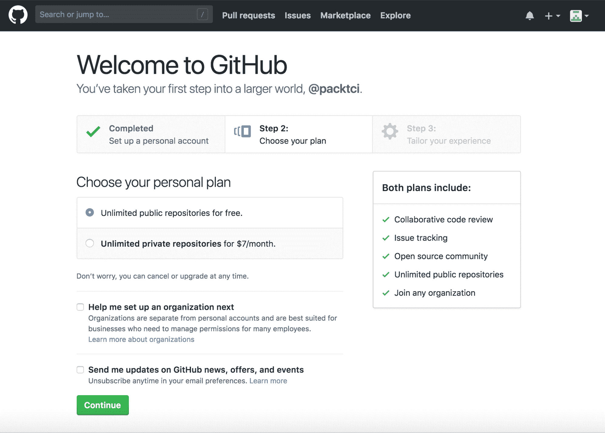
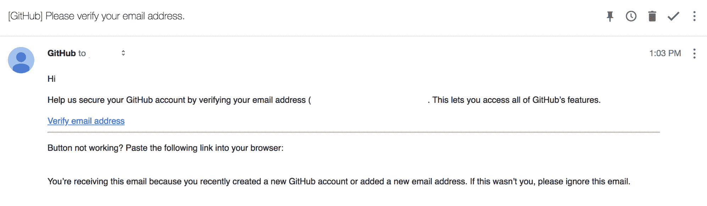
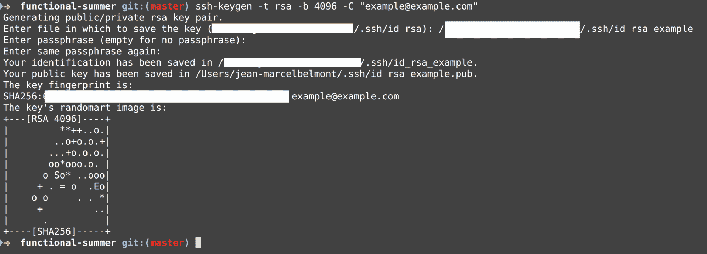
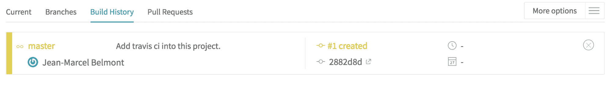
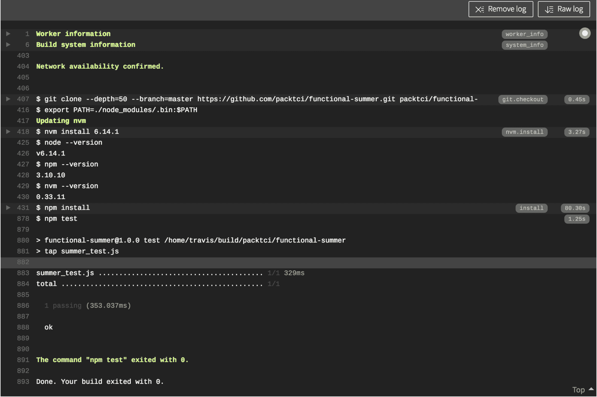
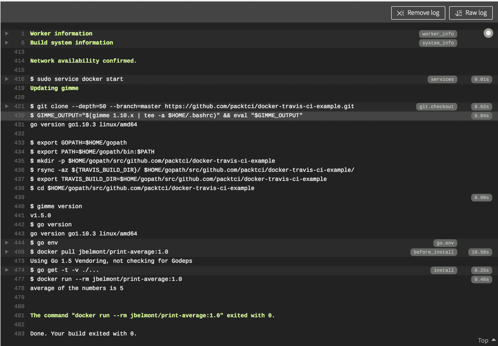
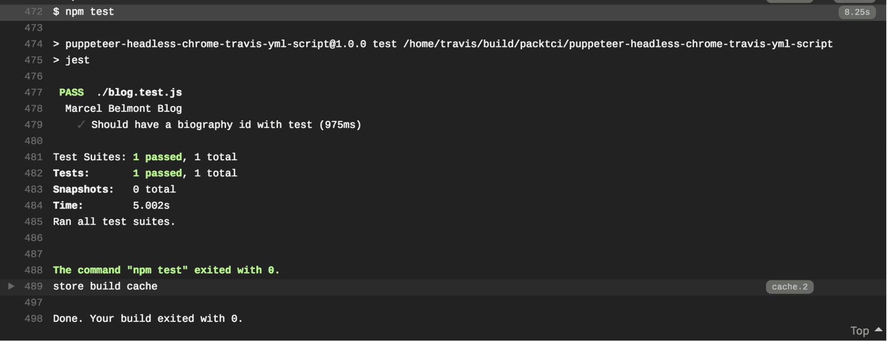

# 特拉维斯竞争情报的安装和基础

本章将帮助您设置 Travis **持续集成** ( **CI** )。我们将解释像 Travis CI 这样的托管解决方案的应用程序嵌入式配置的概念。我们还将解释什么是 YAML 配置以及如何使用它。我们将了解使用 Travis CI 的基础知识，并花一些时间探索 Travis CI 和 Jenkins 之间的一些差异，以及 Travis CI 的概念。我们将讨论 Travis CI 的不同部分，包括语法和构建生命周期，并查看真实世界的示例。

本章将涵盖以下主题:

*   特拉维斯 CI 游戏攻略
*   特拉维斯 CI 先决条件
*   添加简单的 Travis CI YAML 配置脚本
*   特拉维斯 CI 脚本分解

# 技术要求

这一章将需要一些基本的编程技能，我们在前面几章中讨论的许多配置项概念将在这一章中得到利用。如果您尝试创建一个 GitHub 帐户和 Travis CI 帐户，将会很有帮助。您可以按照 *Travis CI 先决条件*部分中的步骤进行操作。一些示例使用了 Docker，这是一种容器技术，因此如果您对容器和 Docker 有一些了解，将会很有帮助。在本章中，您将学习 YAML 语法。本章中有一些命令使用命令行应用程序，因此熟悉命令行应用程序或 CLi 会很有帮助。

# 特拉维斯 CI 游戏攻略

Travis CI 是一个用于 CI 构建的托管和自动化解决方案。Travis CI 使用了一个应用程序内的配置文件，该文件使用了 YAML([http://yaml.org/spec/1.2/spec.html](http://yaml.org/spec/1.2/spec.html))语法，我们将在本章后面更详细地讨论该语法。由于 Travis CI 托管在云中，因此它具有的优势是，它可以快速用于其他环境和不同的操作系统，而无需我们担心设置和安装。这意味着特拉维斯 CI 设置比Jenkins快得多。

# 特拉维斯·西和Jenkins的比较

Jenkins 是一个独立的开源自动化服务器，它是可定制的，需要在组织级别进行设置和配置。请记住，在Jenkins CI 章节中，我们花了一些时间在 Windows、Linux 和 macOS 上安装了Jenkins。我们还能够按照自己的意愿配置Jenkins。虽然这对于在运营、DevOps 等领域拥有专门团队的软件公司来说很棒，但对于开源项目来说就不那么棒了，因为在开源项目中，通常只有开发人员为他们的个人项目设置环境。

Travis CI 是围绕开源开发的原则和易用性而设计的。Travis CI 可以在 GitHub 中创建项目的几分钟内设置好。尽管在这方面 Travis CI 不如 Jenkins CI 可定制，但它具有快速设置和使用的明显优势。Travis CI 使用一个应用内配置文件来实现这一点，然而目前必须与 GitHub([https://github.com/](https://github.com/))开发平台一起使用，尽管未来可能会扩展到其他平台，如 Bitbucket([https://bitbucket.org/dashboard/overview](https://bitbucket.org/dashboard/overview))，但这仍然是一个开放的讨论。

# 特拉维斯 CI 先决条件

为了开始使用 Travis CI，您需要创建一个 GitHub 帐户，您可以在 GitHub([https://github.com/](https://github.com/))上创建该帐户。

# 创建 GitHub 帐户

查看截图—您只需提供用户名、电子邮件和密码，然后单击注册 GitHub 按钮:


为了本章的目的，我们将创建一个名为`packtci`的 GitHub 用户名。单击注册 GitHub 按钮后，您将进入以下页面:



请注意，您可以在 GitHub 中免费创建无限数量的公共存储库，而私有存储库需要每月订阅费。单击继续按钮后，您将被重定向到以下页面:


如果需要，您可以通过滚动到页面底部并单击跳过此步骤按钮来跳过所有这些选项。单击“提交”按钮或“跳过此步骤”按钮后，您将进入此页面:


你应该收到一封来自 GitHub 的电子邮件；请看下面的截图:



你需要点击链接来验证你在 GitHub 的账号，然后你就可以用你的 GitHub 账号进行设置了。

# 创建特拉维斯竞争情报帐户

您需要创建一个特拉维斯竞争情报帐户，以便开始使用特拉维斯竞争情报。您将需要使用您的 GitHub 登录凭据登录。在此处的截图中，请注意您可以单击“注册”按钮或“使用 GitHub 登录”按钮:


在本章中，我单击了使用 GitHub 登录按钮，然后输入了我使用用户名`packtci`创建的 GitHub 帐户的登录凭据。输入您的 GitHub 凭据后，您将被重定向到以下页面:


您需要单击“授权特拉维斯-配置项”按钮来完成特拉维斯配置项设置。单击“授权 travis-ci”按钮后，Travis CI 完成最终设置步骤后，您将被重定向到以下页面:


请注意，我们有一个特拉维斯配置项的应用编程接口令牌，我们将在以后使用。我们在这个新帐户中没有任何 GitHub 项目，因此没有显示任何项目。为了本章的目的，我将创建一个运行一些基本测试的 GitHub 项目。

# 向您的新 GitHub 帐户添加 SSH 密钥

为了创建一个新的 GitHub 存储库，您需要将 SSH 密钥添加到您的用户帐户中。如果您的系统中没有任何 SSH 密钥，可以使用以下命令创建:



请注意，这里我提供了一个电子邮件地址，并指定了一种 RSA 类型，这是一种加密算法。运行此命令后，它将在您的系统上创建一个公钥和私钥。

一旦你创建了 SSH 密钥，你只需要上传公钥到 GitHub。您需要复制文件的内容；如果您正在使用 macOS，您可以运行以下命令将其复制到系统剪贴板:

```
ssh-keygen -t rsa -b 4096 -C "myemail@someemailaddress.com"
# This command generates a file in the path that you pick in the interactive prompt which in this case is ~/.ssh/id_rsa_example.pub

pbcopy < ~/.ssh/id_rsa_example.pub
```

您需要进入 GitHub 的设置页面:


然后，您需要在设置页面中单击以下按钮:


接下来，您需要单击“新建 SSH 密钥”按钮，然后提供一个名称并粘贴到您的 SSH 密钥的内容中。在下面的截图中，我提供了一个`Example SSH Key`的名称，然后粘贴在我的公钥内容中:


您只需要点击**添加 SSH 密钥**按钮，然后您就可以提交对您在 GitHub 中拥有的任何存储库的更改了。

# 添加简单的 Travis CI YAML 配置脚本

我创建了一个示例 GitHub 存储库，您可以在 GitHub([https://github.com/packtci/functional-summer](https://github.com/packtci/functional-summer))的功能夏季看到它。这个存储库是一个 Node.js 项目，它有一个`package.json`脚本，一个名为`summer.js`的文件和一个名为`summer_test.js`的测试文件。我们将在存储库根目录下名为`.travis.yml`的文件中为 Travis CI 添加配置。这个配置脚本将做一些事情。首先，它将通知 Travis CI 我们正在运行一个 Node.js 项目，然后它将安装项目的依赖项，最后它将运行 CI 构建中指定的测试。

# Travis CI YML 脚本内容

我们将首先在存储库的根目录下创建一个名为`.travis.yml`的文件，然后将以下内容复制到该文件中:

```
language: node_js

node_js:
    - "6.14.1"

install:
    - npm install

script: npm test
```

我们将更详细地介绍这个 YML 脚本的每个条目，但本质上我们对 Travis CI 说的是，这是一个 Node.js 项目，我们希望 Travis CI 在 CI 构建中使用 Node 版本 6.14.1，然后使用 **npm 包管理器**安装项目所需的所有依赖项，最后使用`npm test script`命令运行所有测试。我将把这个变更提交到`functional-summer`存储库中，然后我们将看到如何为这个项目打开特拉维斯配置项。

# 将 Github 存储库添加到您的 Travis CI 帐户中

第一步，您必须前往[https://travis-ci.org/](https://travis-ci.org/)，然后为您的 GitHub 帐户提供登录凭据。然后点击屏幕右上角的头像进入个人资料页面，如下图所示:


接下来，我添加了一个截图，详细说明了向 Travis CI 添加新存储库的步骤:


请注意，在截图中，我添加了一个文本块，表示第一步是单击同步帐户按钮，这是必要的，这样 Travis CI 将看到您添加到 GitHub 帐户中的任何新存储库。一旦 Travis CI 同步了您的帐户，那么应该可以在您的帐户中看到您的存储库。根据您已经拥有的项目数量，您可能需要根据您的存储库名称进行筛选来查找您的项目。下一步是用您的存储库名称切换滑块，如屏幕截图所示。

在下面的截图中，我们已经打开了 Travis UI 上的`functional-summer`存储库，现在我们可以简单地点击该行进入这个新添加的 Travis CI 构建作业:


单击该行后，您将被重定向到 Travis CI 中的以下页面:


我们还没有任何已经被触发的构建，但是 Travis CI 已经设置了一些默认设置。如果您将更改提交到任何推送的分支上，或者在 GitHub 中打开一个拉取请求，Travis CI 将启动一个构建。让我们对`functional-summer`存储库进行一个小的更改，这将触发 Travis CI 中的构建。如果您单击“构建历史”选项卡，您将会注意到已经使用 Git 提交更改创建了一个构建:



# 特拉维斯竞争情报工作日志

您可以单击 Travis CI 屏幕左侧的构建作业项目，如下所示:


或者，您可以单击“当前”选项卡查看已配置存储库的当前执行作业。为了查看作业日志，您需要向下滚动到作业日志选项卡，查看 Travis CI 构建中运行的命令，对于`functional-summer`存储库，这些命令如下所示:



请记住，在我们添加到 GitHub 的`.travis.yml`脚本中，我们指定了四件事:

1.  在`.yml`脚本的顶部，我们指定了 Node.js 语言
2.  我们指定了 6.14.1 版本的 Node.js
3.  我们运行`npm install`命令来安装一个项目的所有依赖项
4.  最后，我们运行`npm test`命令

您可以确认这些步骤已在作业日志中运行。请注意，在前面的截图中，有向右箭头链接，这些链接扩展到 CI 构建中每个命令的更多细节。

# 特拉维斯 CI 脚本分解

现在我们已经学习了 YAML 语法，我们可以更详细地解释 Travis CI 脚本的各个部分。

# 选择一种编程语言

```
language: go
```

在`.travis.yml`脚本的这个块中，我们添加了将在持续集成构建中使用的编程语言。这通常是您添加的`.travis.yml`脚本中的第一个条目。

Travis CI 支持多种编程语言，例如:

*   C
*   C++
*   带有 Node.js 的 JavaScript
*   长生不老药
*   去
*   哈斯克尔
*   红宝石

您可以查看 Travis CI 文档中的语言([https://docs.travis-ci.com/user/languages](https://docs.travis-ci.com/user/languages))以获得支持的编程语言的完整列表。

# 选择基础设施

您可以使用 YML 脚本中的`sudo`和`dist`字段，在 Travis CI 中设置更定制的环境。

# 具有 Ubuntu precision(12.04)基础架构的虚拟映像

您可以通过在 Travis YML 脚本中使用以下条目来使用 Ubuntu Precise 基础结构:

```
sudo: enabled
dist: precise
```

# 默认基础设施

您可以通过添加以下条目来显式设置默认基础架构，即容器化的 Ubuntu 14.04 环境:

```
sudo: false
```

This is not necessary to do as you can just set the language and the default infrastructure will be done for you.

# 具有 Ubuntu 可信(14.04)基础架构的虚拟映像

您可以通过在 Travis YML 脚本中使用以下条目来使用 Ubuntu Trusty 基础结构:

```
sudo: enabled
dist: trusty
```

# 基于容器的基础设施

您可以通过在 Travis YML 脚本中使用以下条目来使用基于容器的基础架构:

```
sudo: false
dist: trusty
```

Notice here that we explicitly set sudo privileges to false and use Ubuntu Trusty.

# macOS 基础设施

您可以通过使用 Travis YML 脚本中的以下条目来使用 macOS 基础架构:

```
os: osx
```

# 构建定制

在 Travis CI 中，您可以通过多种方式定制构建，我们将从解释构建生命周期开始。

# 构建生命周期

Travis CI 中的构建由两个步骤组成:

*   **安装**:安装任何需要的依赖项。我们在 YML 脚本的安装块中看到了这一步。
*   **脚本**:运行构建脚本。这可以是运行的一系列脚本。

# 安装前步骤

这一步正式称为 **before_install** 步骤，在这里您可以在您的配置项构建中安装任何附加的依赖项，并且可以启动自定义服务。

# 安装步骤

我们已经看到这一步在行动；在**安装**步骤中，您安装了正确运行配置项构建所需的所有依赖项。

# 脚本步骤之前

在 **before_script** 步骤中，您可以指定在脚本块能够正确执行之前需要执行的任何命令。例如，您可能有一个 PostgreSQL([https://www.postgresql.org/](https://www.postgresql.org/))数据库，并且需要在运行任何测试之前播种该数据库。

# 脚本步骤

在**脚本**步骤中，您可以执行任何对健康代码库至关重要的命令。例如，运行代码库中的任何测试来清理代码库是很常见的。linter 或 lint 工具是一种分析代码库的工具，用于查找任何与编程相关的错误、软件错误、样式错误或任何可能有**代码气味**的代码。

# 脚本步骤后

在 **after_script** 步骤中，您可以执行任何有用的命令，例如报告和分析。您可能需要发布代码覆盖率报告，或者在代码库中创建度量报告。

# 构建生命周期列表

以下是 Travis CI 的完整生命周期:

*   可选安装: **apt 插件**
*   可选安装:**缓存组件**
*   **前 _ 安装**
*   **安装**
*   **前 _ 脚本**
*   **脚本**
*   可选: **before_cache**
*   **成功后**或**失败后**
*   **前 _ 部署**
*   **部署**
*   **后 _ 部署**
*   **后 _ 脚本**

# 构建失败行为

如果在 before_install、install 或 before_script 生命周期事件中发生错误，则配置项构建将立即出错，配置项构建将停止。

如果脚本生命周期事件中出现错误，则构建将失败，但配置项构建将继续运行。

如果在 after_success、after_failure、after_script 和 after_deploy 生命周期事件中出现错误，则构建不会被标记为失败，但是如果这些生命周期事件中的任何一个导致超时，则构建将被标记为失败。

# 为配置项生成安装辅助编程语言

通过在 **before_install** 生命周期事件中添加一个条目，可以很容易地在 CI 构建中安装另一种编程语言。最好先指定你的主要语言，然后再指定第二语言。

# 多种语言的 Travis CI YML 脚本示例

在这里的 Travis CI YML 脚本中，我们将 1.10 版本指定为主要编程语言，然后将 Node.js 指定为次要语言。我们在 before_install 生命周期事件中安装 Node.js 依赖项，然后运行 Golang 测试，接着是 Node.js 测试:

```
language: go

go: 
    - "1.10"

env:
    - NODE_VERSION="6"

before_install:
    - nvm install $NODE_VERSION

install:
    - npm install

script:
    - go test
    - npm test
```

如果你想进一步探索这个例子，那么查看`multiple-languages`存储库([https://github.com/packtci/multiple-languages](https://github.com/packtci/multiple-languages))。

# 特拉维斯 CI 的码头工人

可以在 Travis CI 中使用 Docker，启用 Docker 所需的唯一步骤是在 Travis CI YML 脚本中添加以下条目:

```
sudo: required

services:
 - docker
```

Notice here that we added an entry into the `services` block and we added a list entry of Docker.

# 带有 Dockerfile 的 Travis CI YML 脚本示例

在这里的 Travis YML 脚本中，我们指定了`sudo`权限，这是 Golang 的一种编程语言，然后我们指定了 Docker 服务，下拉`jbelmont/print-average:1.0`的自定义 Docker 映像，然后运行 Docker 容器并删除它:

```
sudo: required

language: go

services:
  - docker

before_install:
  - docker pull jbelmont/print-average:1.0

script:
  - docker run --rm jbelmont/print-average:1.0
```

我已经添加了 Travis CI 构建的截图供您参考:



请注意，Docker 正在 CI 构建中运行，因为我们将 Docker 指定为要在 Travis CI 中运行的服务。当我们运行 Docker 容器时，它会打印出在`docker-travis-ci-example`存储库中([https://github.com/packtci/docker-travis-ci-example](https://github.com/packtci/docker-travis-ci-example))的`main.go`中计算出的平均值。你可以在码头中心([https://hub.docker.com/r/jbelmont/print-average/](https://hub.docker.com/r/jbelmont/print-average/))查看我的码头工人图片。

# 特拉维斯 CI 中的图形用户界面和无头浏览器

您可以通过几种方式在 Travis CI 中运行无头浏览器。你可以使用一个 X 虚拟帧缓冲区，或者简称 XVFB，你可以在 XVFB 的文档中读到更多。我们将研究在木偶师([https://pptr.dev/](https://pptr.dev/))中使用无头 chrome，这是一个由谷歌开发的库，它提供了一个高级 API 来使用无头 Chrome。

# 带有无头 Chrome、木偶师和 Jest 测试库的 Travis yml 脚本示例

在这里的 Travis YML 脚本中，我们在 Travis CI 构建中设置了许多不同的操作。首先，我们将语言设置为`node_js`，然后将`node_js`的版本设置为`8.11`，然后设置一个名为`dist: trusty`的新属性，该属性将 Travis CI 环境设置为 Ubuntu 14.04，称为 **Trusty** 。然后，我们使用加载项块来添加最新稳定的 Chrome 版本。然后，我们在端口`9222`上的配置项构建上获得运行的谷歌 Chrome 的稳定版本，然后我们使用`cache`块，以便在每次配置项构建运行时缓存`node_modules`。然后我们安装我们的 Node.js 依赖项，最后我们使用 Jest 库运行 Node.js 测试:

```
language: node_js

node_js:
 - "8.11"

dist: trusty

sudo: false

addons:
 chrome: stable

before_install:
 - google-chrome-stable --headless --disable-gpu --remote-debugging-port=9222 http://localhost &

cache:
 directories:
 - node_modules

install:
 - npm install

script:
 - npm test
```

在第一张截图中，请注意我们在 Travis CI 构建中开始以`headless`模式运行`google-chrome`然后安装依赖项的部分:


在第二张截图中，我们使用谷歌 Chrome 木偶师库运行测试。请注意，构建以退出状态`0`运行，并成功完成:



你可以在[https://Travis-CI . org/pack TCI/puppeter-headless-chrome-Travis-yml-script/jobs/395882388 # L70](https://travis-ci.org/packtci/puppeteer-headless-chrome-travis-yml-script/jobs/395882388#L70)找到这个 Travis CI 构建，你可以在[https://github . com/pack TCI/puppeter-headless-chrome-Travis-yml-script](https://github.com/packtci/puppeteer-headless-chrome-travis-yml-script)和 GitHub 找到这个存储库的源代码。

# 摘要

在这一章中，我们已经讨论了特拉维斯 CI 的许多方面，包括特拉维斯 CI 和Jenkins之间的差异。为了设置 Travis CI，我们检查了一些先决条件操作，并学习了向您的 GitHub 帐户添加 SSH 密钥。然后，我们解释了 Travis CI 构建工作，并详细介绍了 YAML 语法。然后，我们探索了 Travis YML 脚本的许多真实例子，并解释了 Travis CI 中的构建生命周期，并考察了不同的方面，例如启动 Docker 等服务及其在 Travis CI 中的使用。

在下一章中，我们将浏览所有 Travis CLI 命令，解释如何在 Linux、macOS 和 Windows 上安装 Travis CLI，并浏览使用 Travis CLI 命令自动执行加密凭据等任务。

# 问题

1.  Jenkins和特拉维斯 CI 的主要区别是什么？
2.  特拉维斯 CI 能在比特桶工作吗？
3.  如何向 Travis CI 添加新的存储库？
4.  YAML 的标量变量是什么？
5.  YAML 的名单是什么？
6.  为什么主播在 YAMl 中有用？
7.  在 Travis CI 构建中可以使用辅助编程语言吗？
8.  在 Travis CI 构建中，您会如何使用 docker？

# 进一步阅读

您可以通过查看 Travis CI 网站([https://docs.travis-ci.com/](https://docs.travis-ci.com/))上的用户文档，进一步探索 Travis CI 中的概念。