# 特拉维斯配置项用户界面记录和调试

本章将概述 Travis 作业日志以及作业日志中的各个部分。本章还将解释如何以几种不同的方式调试 Travis 构建作业，包括使用 Docker 在本地构建，然后在调试模式下运行构建。我们将讨论获取作业标识的所有不同方法，以及如何在公共存储库中启用调试模式，然后使用特拉维斯应用编程接口在调试模式下启动构建。我们将解释如何使用 **tmate** ，这是一个终端多路复用器，然后我们将讨论在 Travis Web Client 中记录环境变量。最后，我们将介绍如何使用 Heroku 在 Travis CI 中进行部署，以及如何调试部署失败。

本章将涵盖以下主题:

*   Travis 网络客户端概述
*   使用 Docker 在本地调试构建
*   在调试模式下运行生成
*   特拉维斯网络用户界面日志
*   Travis CI 部署概述和调试

# 技术要求

本章将需要一些基本的 Unix 编程技能以及一些 bash 脚本知识。对如何调用 RESTful API 有一个基本的了解会有所帮助，因为我们将使用 curl 作为 REST 客户端来调用 Travis API。对 Docker 和容器也有一个基本的了解会很有帮助，因为我们也将使用 Docker 运行本地构建。

# Travis 网络客户端概述

我们在[第 9 章](09.html)、*Travis CI 的安装和基础知识*中简要地浏览了 Travis CI 的网络仪表盘，但是让我们再看一下 UI 的不同部分。

# 主仪表板概述

特拉维斯竞争情报网络客户端有几个不同的部分需要理解:

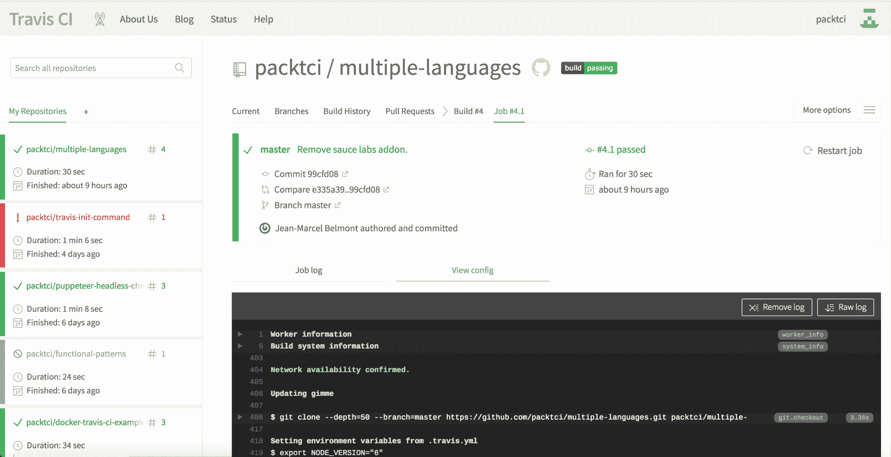

在左边分开的部分，您可以单独点击您感兴趣的每个存储库。此外，您可以按名称搜索存储库，因为您或您所属的组织可能拥有许多存储库。还要注意，这里有关于项目中运行的最后一次构建的详细信息，以及它是通过还是失败，还有关于持续时间和最后一次构建运行时间的构建详细信息。

在右边分开的部分，你会发现特拉维斯网络客户端的主要导航组件。请注意，这里有几个导航链接，例如当前版本，这是当您转到存储库时打开的默认链接。如果单击分支链接，您将看到所有不同分支中触发的所有构建，包括拉取请求。让我们推送一个新分支，并在`multiple-languages`([https://github.com/packtci/multiple-languages](https://github.com/packtci/multiple-languages))存储库中创建一个拉取请求，并查看一个正在运行的新构建:

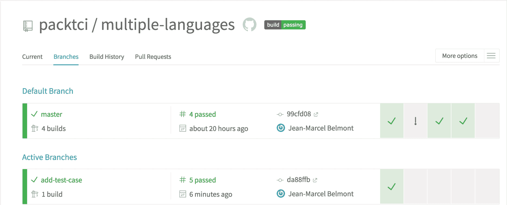

请注意，Travis CI 为我们推送的新分支创建了一个名为`add-test-case`的新构建:

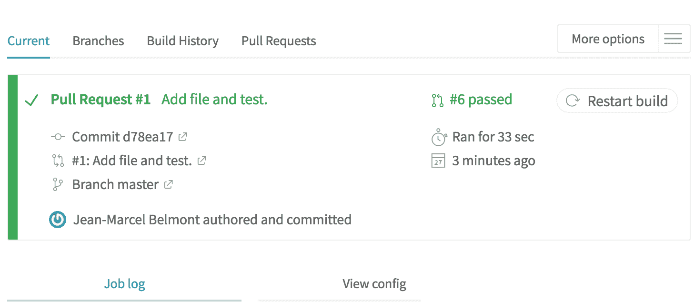

此外，您打开的任何拉取请求也将触发 Travis CI 的新构建:


当您将一个拉取请求合并到另一个分支时，就会在 Travis CI 中触发另一个 CI 构建。

# 作业日志概述

Travis CI 中的作业日志从构建系统配置信息开始:


注意这里构建语言设置为`go`，构建操作系统为 Ubuntu Trusty 14.04:

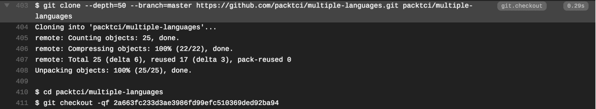

Travis CI 克隆了`multiple-languages`存储库的一个新副本，这是持续集成的一个重要方面。请记住，配置项构建应该在每个构建上构建一个新副本，并且不应该有假定的环境变量:


注意 Travis CI 为我们设置了一些环境变量，包括`GOPATH`和`PATH`环境变量。Travis CI 运行`go version`命令来验证配置项构建中是否安装了 1.10 版本:

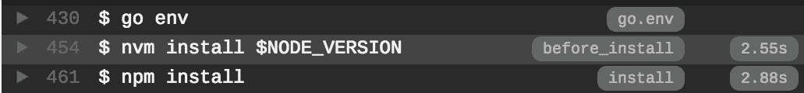

在配置项构建的这一步，我们安装我们的二级编程语言 Node.js。这是可选的，但是请注意 Travis CI 在`before_install`的右侧有一个构建标签，这是我们在*构建定制*部分的[第 9 章](09.html)、*Travis CI 的安装和基础知识*中讨论的构建步骤之一。另外，请注意在`before_install`和`install`的构建生命周期标签的右侧，有一个时间戳，表示构建步骤实际花费了多长时间，该时间戳以人类可读的格式表示为`2.55`秒和`2.88`秒，表示`before_install`和`install`生命周期事件:

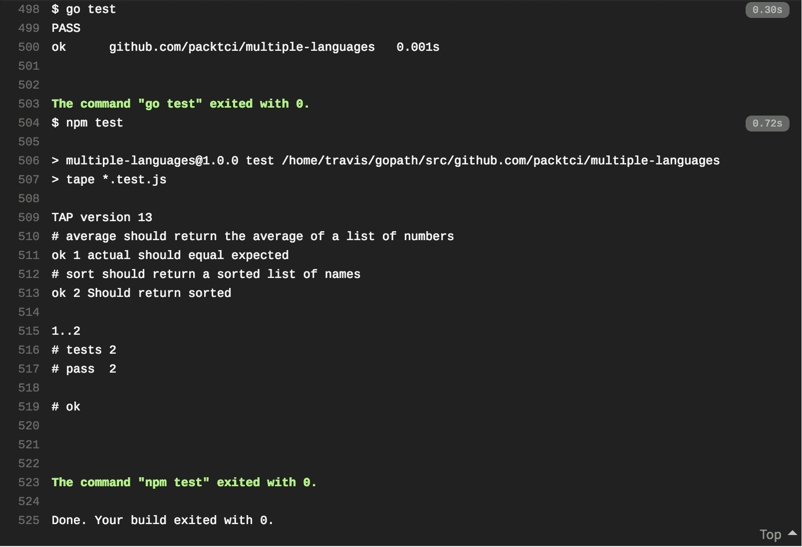

注意这里没有脚本构建生命周期的构建标签，因为这是配置项构建的主要部分。

任何其他生命周期事件，如`after_success`和`after_script`生命周期事件，都将有一个构建标签和一个时间戳。

# 使用 Docker 在本地调试生成

您可以通过下拉文档链接“Docker 映像中的本地故障排除”中的 Docker 映像来本地调试版本。您可以在此链接中找到安装 Docker 的说明([https://docs.docker.com/install/](https://docs.docker.com/install/))。

1.  下拉“待办事项”图像:

```
docker pull travisci/ci-garnet:packer-1512502276-986baf0
```

请注意，我们运行`docker pull`命令来实际下拉 Docker 图像

2.  启动交互式 Docker 会话:

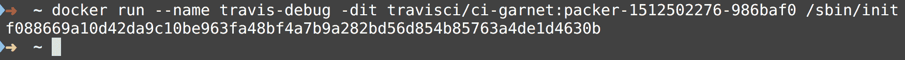

请注意，我们在分离模式下运行了一个交互式 shell 会话

3.  在运行容器中打开登录外壳:

```
docker exec -it travis-debug bash -l
```

该命令使用一个 Bash shell 启动与正在运行的 Docker 容器的交互式 shell 会话

4.  切换到特拉维斯用户:

```
su - travis
```

在这个命令中，我们切换到 Travis 用户，而不是默认的根用户

5.  将`multiple-languages` Git 存储库克隆到主目录中:

```
git clone --depth=50 --branch=master https://github.com/packtci/multiple-languages
cd multiple-languages
```

该命令将我们的`multiple-languages`存储库本地克隆到 Docker 容器中，然后更改到该目录中

6.  签出我们要在本地测试的 Git 提交。

运行`git log`命令，在本地找到我们想要签出的提交。最有可能的是我们将检查的顶级 Git 提交:

```
git log
git checkout 2a663fc233d3ae3986fd99efc510369ded92ba94
```

在这一步中，我们希望确保只测试与我们想要测试的变更相对应的变更。

7.  安装库依赖项和辅助编程语言:

```
NODE_VERSION="6"
nvm install $NODE_VERSION
npm install
```

在这一步中，我们通过使用**节点版本管理器** ( **nvm** )安装 Node.js 作为辅助编程语言，然后运行`npm install`命令来安装我们所有的库依赖项

8.  运行脚本构建步骤。

在下面的截图中，我们运行`go test`和`npm test`命令来模拟本地 Docker 容器中的脚本构建生命周期事件:

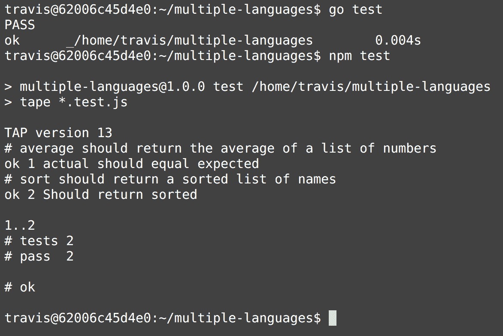

# 在调试模式下运行生成

调试构建时问题的另一种技术是在 Travis CI 中运行调试构建。您需要通过电子邮件`support@travis-ci.com`为公共存储库打开此功能，而私有存储库默认启用调试模式。这样做的原因是，任何人都可以看到包含 SSH 访问的日志，然后可以连接到虚拟机，然后可能读取机密环境信息，如客户端标识、机密等。

# 从配置文件页面获取应用编程接口令牌

要通过应用编程接口在调试模式下重新启动作业，您需要向作业的调试端点发送`POST`请求。需要通过将您的 Travis CI API 令牌添加到授权头来验证此请求。您可以在公共项目的特拉维斯配置文件页面中找到您的应用编程接口令牌。

你需要访问一个网址，比如[https://travis-ci.org/profile/packtci](https://travis-ci.org/profile/packtci)。然后，您需要在配置文件页面中复制您的 API 令牌，如下所示:

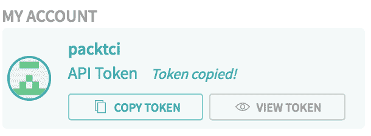

接下来，您将需要通过使用带有 API 令牌的 REST 客户端来命中调试端点。

# 使用特拉维斯命令行界面访问令牌

您可以通过运行以下命令，使用 Travis CLI 获取访问令牌:

```
travis token
```

# 从构建日志中获取作业标识

您可以通过展开`Build system information`选项卡，然后查找标签`Job id`来获取作业标识。在下面的截图中，有一个箭头指向`Job id`:


# 从“查看配置”按钮中的网址获取作业标识

如果您单击查看配置按钮，网址将会改变，您可以从网址复制作业标识。在下面的截图中，我们单击了视图配置按钮，如下所示:


然后网址改成了这个配置:[https://Travis-ci . org/packtci/多语言/作业/401101740/配置](https://travis-ci.org/packtci/multiple-languages/jobs/401101740/config)。

该网址中的作业标识为`401101740`。

# 通过对/builds 端点的应用编程接口调用获取作业标识

您也可以通过调用特拉维斯应用编程接口中的`/builds`端点来获取作业标识。您需要发出`GET`请求并提供有效的访问令牌才能进行 REST 调用。以下是使用`curl` REST 客户端的请求示例:

```
curl -s -X GET \
 -H "Content-Type: application/json" \
 -H "Accept: application/json" \
 -H "Travis-API-Version: 3" \
 -H "Authorization: token $(travis token)" \
 -d '{ "quiet": true }' \
 https://api.travis-ci.org/builds
```

这将获取与存储库相关联的所有构建，这可能是一个很大的 JSON 负载。您可以使用**jq**([https://stedolan.github.io/jq/](https://stedolan.github.io/jq/))命令行 JSON 处理器过滤掉作业标识信息。下面是同样的 REST 调用，它将 JSON 有效负载传送到`jq`命令行实用程序中，只过滤出对应于构建的作业标识:


# 在调试模式下启动构建作业的 API 调用

只要您有有效的访问令牌，就可以使用任何 REST 客户端来调用 Travis API。

以下是对`40110174`作业标识的调试端点的示例 REST 调用:

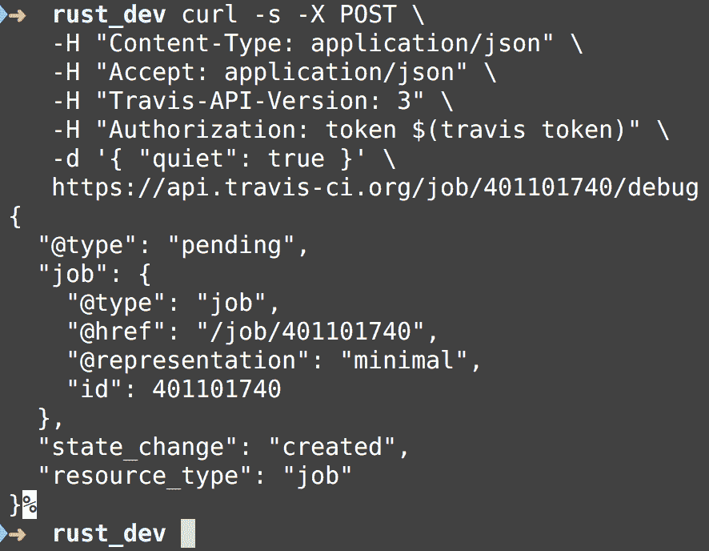

请注意，在此截图中，我们添加了`Authorization` HTTP 头，并使用 Travis CLI 通过使用 Bash 字符串插值打印出我们的访问令牌，如下所示:

```
Authorization: token $(travis token)
```

还要注意，我们使用的是 https://api.travis-ci.org 的公共特拉维斯端点。

# 获取调试模式的 SSH 会话

如果您返回 Travis web UI 并查看当前的作业日志，您将看到以下内容:


现在，您只需进入命令提示符或终端会话，并输入`ssh`命令，开始与当前版本的交互式调试会话:


调试模式 SSH 会话将只保持活动状态 30 分钟，然后您需要进行另一个 API 调用来启动另一个调试会话:

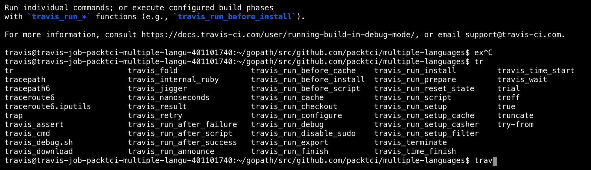

# Travis 调试模式便利 Bash 函数

以下是可用的便利 Bash 函数列表:

*   `travis_run_before_install`对应于安装前生命周期事件
*   `travis_run_install`对应于**安装**生命周期事件
*   `travis_run_before_script`对应于脚本生命周期事件之前的
***   `travis_run_script`对应**脚本**生命周期事件*   `travis_run_after_success`对应于成功后的**生命周期事件*****   `travis_run_after_failure`对应于失效后的**生命周期事件*****   `travis_run_after_script`对应于**后 _ 脚本**生命周期事件******

 ******在下面的截图中，我们运行了`travis_run_before_install`功能:

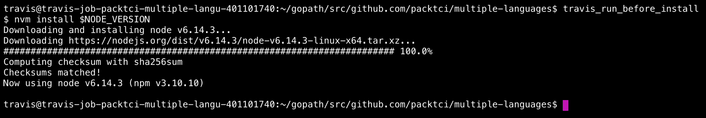

请记住，这是在运行`before_install`生命周期事件中指定的内容，该事件在`multiple-languages`存储库中有以下内容:

```
before_install:
 - nvm install $NODE_VERSION
```

现在我们将运行`travis_run_install`便利 Bash 函数，该函数安装 Travis `install`生命周期事件中指定的库依赖项:

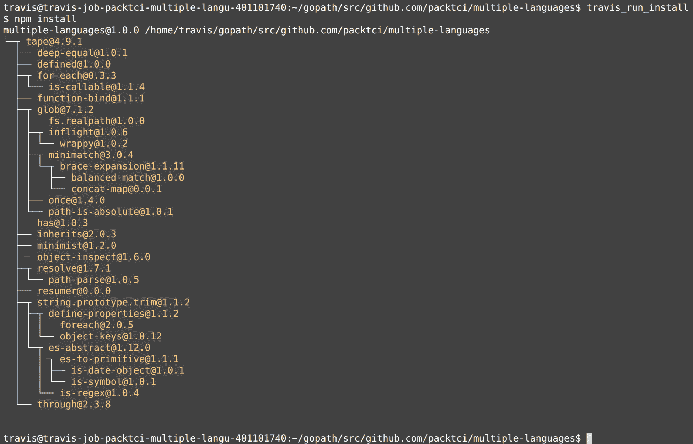

我们在`multiple-languages`存储库中的`install`生命周期事件中有以下条目:

```
install:
 - npm install
```

请注意，这正是运行`travis_run_install`便利功能时运行的内容。

接下来，我们运行`travis_run_script`便利函数，该函数运行 Travis `script`生命周期事件中定义的任何脚本:

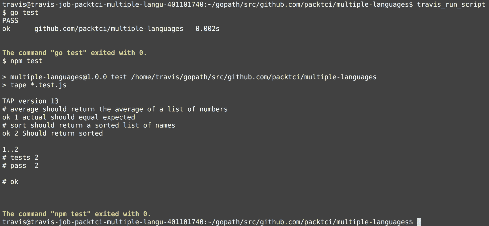

我们在`multiple-languages`存储库中的`script`生命周期事件中有以下条目:

```
script:
 - go test
 - npm test
```

如果我们指定了任何其他的生命周期事件，我们就可以使用剩下的便利 Bash 函数。

# tmate 外壳会话操作

SSH shell 会话使用 tmux([https://github.com/tmux/tmux](https://github.com/tmux/tmux))的分叉，这是一个名为 tmate([https://tmate.io/](https://tmate.io/))的终端多路复用器程序，使用它，您可以打开窗口、滚动历史记录等。

*   如果您按下 *Control-b* [，您将能够上下滚动您的命令历史

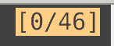

*   要退出历史滚动模式，只需按下字母 *q* 。
*   如果您按下 *Control-b c* ，您将创建一个可以使用的新窗口。

*   如果按下*控制-b [0..9]* ，然后您可以在您创建的任何新窗口之间切换。请注意，这里括号的意思是，例如，Control-b 0、Control-b 1 等等，用于切换窗口会话。

# 特拉维斯网络用户界面日志记录

您当然可以注销 Travis CI 中的一些环境变量，但要注意不要注销日志中的机密信息。

# Travis CI 为保护您的环境特定变量而采取的步骤

默认情况下，Travis CI 将隐藏任何变量，如令牌和环境变量，并简单地在它们的位置显示字符串`[secure]`。

如果您转到构建# 3[https://Travis-ci . org/pack ktci/puppeter-headless-chrome-Travis-yml-script/builds/398696669](https://travis-ci.org/packtci/puppeteer-headless-chrome-travis-yml-script/builds/398696669)，您将看到以下条目:


请记住，我们在[第 10 章](10.html)、 *Travis CI CLI 命令和自动化*中在此存储库中添加了以下加密环境变量:

```
travis encrypt SECRET_VALUE=SuperSecret12345 --add
```

请注意，该命令将以下条目添加到 Travis YML 脚本中:

```
env:
 global:
 secure: 
WLiuzi0CTx/ta5zuoU5K2LeZgzrAhWATUjngx++Azz7Tw4+XqbxeHZ/6ITymE1YLDRMxdIh8hItvkoNCbPmJ6q1To6bdirloWZq2rlZ5BPGYfVY3cuoUuxTAz1uhhfnngkqd76eJfB4lBUfOIVNAg2rpI7QFAQr1aiIKxjthiTms57fR4dusEi/efVO90I7yzFtyxEa0tLTgW9x+dPSt2ApmJ0EP9tftk7M7Uw/F2Gm1/AzWpM1Blklm/iEHF3ZY6Ij/V+ZG2SCpfrF88m50a8nJF1a+KttZz/TTbwqA58dXNokxcD30HB468/oaGMTJxYLFmG3QMfbXuP2wUkuinIEWQxGBEDh3uw11ZhypCGVNvE6vbRpdIIzywcVcX95G1px+Dgcil+c8AebO1wbWlDXMuWNQHC7JjdQspvLUtsLeyyei3LKshTY7LktvhJEG/+sgd5sejeqnzFmLmC9TdbCazLMFWzqhl+SBcmQtFNVuqAGBlMFlT1l54zFnZl7mixetVeBziuS7xGG3XXm0BsYIQnkcJYxNGv8JrFMSoqBTdQV4C20UyyXAw8s+5lu6dGziiMPSUK4KUSVPJ3hyeNiGhLTBsJn4bnTPiJ5ilVdyNM8RD8X2EJRImT3uvGvuFqHraCBrBuZVaW4RtbGX0JYYtMMMr/P84jKrNC3iFD8=
```

请记住，Travis 作业日志只显示了字符串`[secure]`来代替这个环境变量。

# Travis CI 部署概述和调试

我们在*第 3 章“持续交付的基础知识”*中讨论了软件部署，但是概括地说，部署是由开发人员创建的软件的最终产品，您的最终用户将使用它。部署通常在成功的配置项/光盘管道结束时完成。请记住，CI/CD 管道可以由提交阶段组成，在提交阶段构建任何二进制文件并运行单元测试套件，然后是第二阶段，在第二阶段可以运行集成测试，然后可能是第三阶段，包括负载测试和/或安全测试，最后是第四阶段，包括验收测试套件。如果配置项/内容分发管道的所有阶段都成功完成，则应该启动部署管道。

在 Travis CI 中部署相对容易/请记住，您可以使用 Travis CLI 在 Travis CI 中轻松设置一些部署工具。

# 特拉维斯竞争情报中受支持的提供商

以下是一些受支持的提供商，您可以将其与 Travis CI 一起用于部署:

*   AWS 代码部署([https://docs.travis-ci.com/user/deployment/codedeploy/](https://docs.travis-ci.com/user/deployment/codedeploy/))
*   AWS 弹性豆茎([https://docs . Travis-ci . com/user/deployment/Elastic 豆茎/](https://docs.travis-ci.com/user/deployment/elasticbeanstalk/) )
*   AWS Lambda([https://docs.travis-ci.com/user/deployment/lambda/](https://docs.travis-ci.com/user/deployment/lambda/))
*   AWS S3([https://docs.travis-ci.com/user/deployment/s3/](https://docs.travis-ci.com/user/deployment/s3/))
*   蔚蓝网络应用([https://docs.travis-ci.com/user/deployment/azure-web-apps/](https://docs.travis-ci.com/user/deployment/azure-web-apps/))
*   bluemix cloud foundry([https://docs . Travis-ci . com/user/deployment/bluemix cloud foundry/](https://docs.travis-ci.com/user/deployment/bluemixcloudfoundry/))
*   厨师超市([https://docs.travis-ci.com/user/deployment/chefsupermarket/](https://docs.travis-ci.com/user/deployment/chefsupermarket/))
*   cloud foundry([https://docs.travis-ci.com/user/deployment/cloudfoundry/](https://docs.travis-ci.com/user/deployment/cloudfoundry/))

*   GitHub Pages([https://docs.travis-ci.com/user/deployment/pages/](https://docs.travis-ci.com/user/deployment/pages/))
*   GitHub 发布([https://docs.travis-ci.com/user/deployment/releases/](https://docs.travis-ci.com/user/deployment/releases/))
*   谷歌应用引擎([https://docs . Travis-ci . com/user/deployment/Google-App-Engine/](https://docs.travis-ci.com/user/deployment/google-app-engine/))
*   谷歌云存储([https://docs.travis-ci.com/user/deployment/gcs/](https://docs.travis-ci.com/user/deployment/gcs/))
*   谷歌 Firebase([https://docs.travis-ci.com/user/deployment/firebase/](https://docs.travis-ci.com/user/deployment/firebase/))
*   heroku([h](https://docs.travis-ci.com/user/deployment/heroku/)T2】ttps://docs . Travis-ci . com/user/deployment/heroku/)
*   open shift([https://docs.travis-ci.com/user/deployment/openshift/](https://docs.travis-ci.com/user/deployment/openshift/))
*   NPM([https://docs.travis-ci.com/user/deployment/npm/](https://docs.travis-ci.com/user/deployment/npm/))
*   浪涌(https://docs.travis-ci.com/user/deployment/surge/)

有关支持的提供商的完整列表，请访问特拉维斯用户文档([https://docs . Travis-ci . com/user/deployment/# Supported-Providers](https://docs.travis-ci.com/user/deployment/#Supported-Providers))。

# 特拉维斯 CI 中的英雄库设置

我们可以使用 Travis CLI 来帮助我们在`multiple-languages`([https://github.com/packtci/multiple-languages](https://github.com/packtci/multiple-languages))存储库中设置 Heroku([https://www.heroku.com/platform](https://www.heroku.com/platform))。

我们需要做的第一步是确保我们使用 Heroku CLI 登录 Heroku，您可以在[https://devcenter . Heroku . com/articles/Heroku-CLI #下载安装](https://devcenter.heroku.com/articles/heroku-cli#download-and-install)下载安装。登录后，我们将获得一个可以使用的访问令牌:

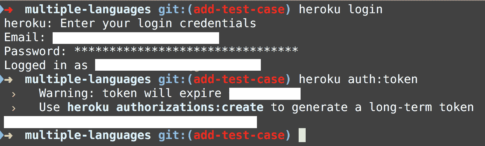

Notice here that we used the  `heroku auth:token` command to print out our access token.

现在我们只需要使用`travis setup`命令进行设置:


Notice that we did not have to provide an access token as we already logged into Heroku and the `travis setup` command is smart enough to grab it for us.

`travis setup`命令使用 Heroku 提供者信息自动更新我们的 Travis YML 脚本，现在我们的 Travis TML 脚本如下所示:

```
language: go

go:
 - '1.10'

env:
 - NODE_VERSION="6"

before_install:
 - nvm install $NODE_VERSION

install:
 - npm install

script:
 - go test
 - npm test

deploy:
 provider: heroku
 api_key:
 secure: ueVMBom+3LHS4xhXXi9hbPR8FIIS/z01Z7NW4hngea4WRHq3gU8AY70xz25w/FshMPtaHeCUdZ90eDDvLF5/hwI+9zup/XI4gONiTTOpxpiY3EyHkP2frra0sdSQhYBHETsq4hEQxODE83ClQjx2jCKM3LOTdzI6wrKXpI5UtoD73yIa7AbKCxl8IXGIeNePImyLe6Wl7ovfxq1zcXz5c6Tu6uIqO2VwkvILrQKB41Id6VQN1MpfY1kQMASuRwaiJQ8HCmi0NP8A067v0s83OM9bNVK+KXDTLsVyrovnpidUnVS/Gk2QDNz0Or5xEIM2iXCsQDoa8jGNSCNfPcXq3aYtl2hjgDSVnz28EoxYRBmx365UxzwRVpsgdf1b+sCfd9FBJge7xZqTCGwimoBJvrQH0qvgYzQ855EvmtEyBU5t0JRmU8x/Z74KryO24YHD/hSY0a1REPCnZqjBkBS5FHQprIJm5XQabwU/IOqPMdM1KvMYj34N+dxK0X92sf0TLSAv3/62oquQ7Lkhjl4nAsEa05v+kQNMQdLemYFBZi8/Qf6a4YQPNmLXmKwis1FLTzicccwPE8qJ2H3wPQRQUUZVYQxgjUkh5ni6ikqCkxmZRnNJgCbTWhw3ip1xaWjmm6jtvMhiWiUr6vDgIbvbty120ySBIe3k2P5ARW77fOA=

 app: multiple-languages
 on:
 repo: packtci/multiple-languages
```

# Travis YML 脚本调试失败

如果我们看一下`multiple-languages`项目的 build 8.1([https://Travis-ci . org/packtci/多语言/jobs/403102478#L548](https://travis-ci.org/packtci/multiple-languages/jobs/403102478#L548) )，我们可以看到它出错了，正如截图所示，因为我们在 Heroku 中实际上没有一个名为多语言的应用程序:


我们只需要在 Heroku 中创建一个名为`multiple-languages`的应用，如下所示:

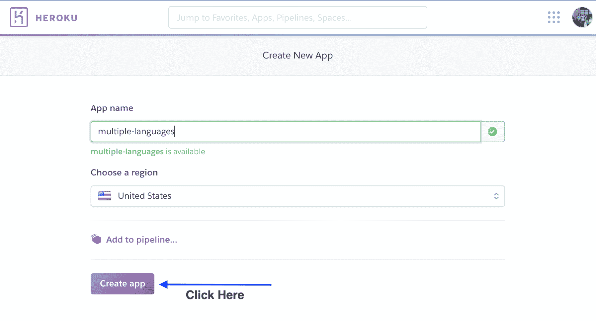

现在让我们使用`travis restart`命令在 Travis 中重新开始构建:

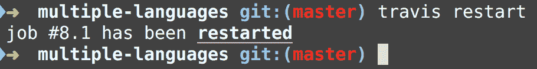

现在，让我们再次查看构建 8.1 的作业日志:


现在，如果我们查看 Heroku 仪表板，我们可以确认我们的应用程序已成功部署到 Heroku:

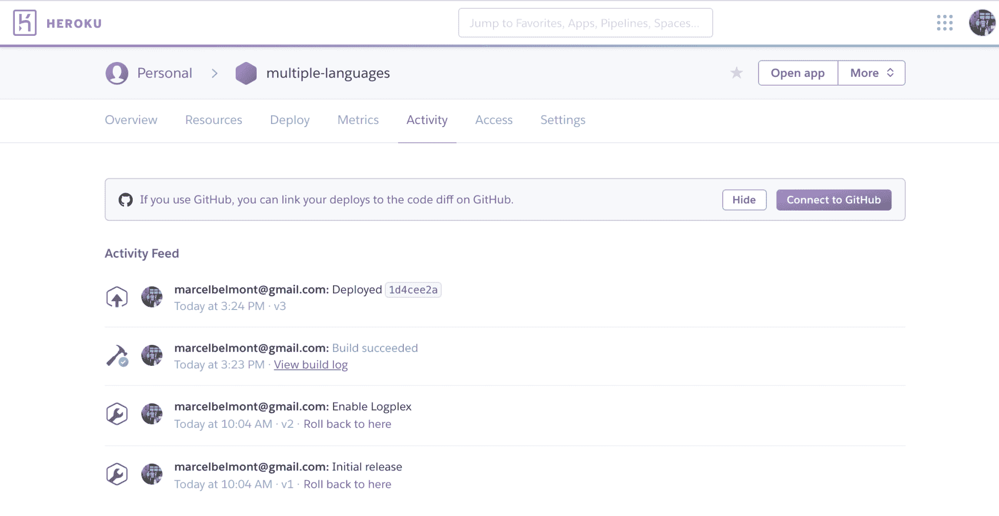

# 摘要

在本章中，我们概述了 Travis 作业日志，并解释了作业日志的不同部分。我们研究了使用 Docker 在本地运行构建，并学习了如何通过使用 Travis API 在调试模式下启用构建。然后，我们查看了 Travis CI 在工作日志中保护您的机密和密钥所采取的步骤。最后，我们看了如何通过使用 Travis CLI 在 Travis CI 中部署应用程序，然后看了如何调试构建失败并在 Travis CI 中成功部署。

在下一章中，我们将解释如何在软件项目中设置 Circle CLI，然后复习 Circle CI UI 的基础知识。

# 问题

1.  当你在 GitHub 中合并一个请求时，另一个构建会被启动吗？
2.  在脚本生命周期事件中运行任何脚本时，Travis 作业日志是否显示标签？
3.  我们如何在本地调试特拉维斯 CI 中的构建？
4.  公共存储库可以使用调试构建模式吗？
5.  您将如何使用特拉维斯应用编程接口来获取工作标识？
6.  在调试模式下运行构建时，可以为 before_install 生命周期事件使用的便利 bash 函数是什么？
7.  您会使用什么 Travis CLI 命令来设置诸如 Heroku 之类的附加组件来进行部署？

# 进一步阅读

您可以在 Travis 用户文档中进一步探索调试选项和更高级的配置信息:[https://docs.travis-ci.com/](https://docs.travis-ci.com/)。******