# CircleCI 的安装和基础

在前一章中，我们展示了如何在本地调试 Travis CI 项目，并更详细地解释了 Travis CI web 界面。我们还研究了如何在 Travis CI 中进行日志记录。本章将帮助您使用 CircleCI 进行设置，我们将解释如何创建一个 Bitbucket 帐户，并将介绍如何在一个新的 CircleCI 帐户上同时设置 GitHub 和 Bitbucket。我们将在 Bitbucket 中创建一个简单的 Java 项目，并为其运行一个 CircleCI 构建。我们还将讨论如何导航 Bitbucket 用户界面。然后，我们将通过创建一个新的 GitHub 存储库来结束这一章，并讨论一个 CircleCI YML 脚本，该脚本将通过 Docker 映像安装 Golang 并运行我们的单元测试。

本章将涵盖以下主题:

*   CircleCI 简介
*   CircleCI 与 Jenkins 的比较
*   CircleCI 先决条件
*   在 GitHub 中设置 CircleCI
*   在比特桶中设置 CircleCI
*   CircleCI 配置概述

# 技术要求

本章将需要一些基本的编程技能，我们将利用本章中讨论的一些持续集成/持续交付概念。如果你尝试自己创建一个 Bitbucket 帐户和一个 CircleCI 帐户，将会很有帮助。可以按照 *CircleCI 先决条件*部分的步骤进行操作。我们将使用 Maven 创建一个基本的 Java 应用程序，因此理解 Java 中的一些基本编程概念会很有帮助，但是如果您知道任何编程语言，您应该能够理解。基本的 Git 和 Unix 知识会很有帮助。

# 绕圈圈圈圈圈圈圈圈圈圈圈圈圈圈圈圈圈圈圈圈圈圈圈圈圈圈圈圈圈圈圈圈圈圈圈圈圈圈圈圈圈圈圈圈圈圈圈圈

CircleCI 是针对**持续集成** ( **CI** )构建的托管和自动化解决方案。CircleCI 使用应用程序内配置文件，该文件使用 YAML([http://yaml.org/spec/1.2/spec.html](http://yaml.org/spec/1.2/spec.html))语法，例如 Travis YML 脚本，我们在[第 9 章](09.html)、*Travis CI 的安装和基础知识*到[第 11 章](11.html)、 *Travis CI UI 记录和调试*中讨论过。由于 CircleCI 托管在云中，它的优势是可以在其他环境中快速设置，也可以在不同的操作系统中使用，而不必像使用 Jenkins CI 那样担心设置和安装。正因为如此，CircleCI 的设置速度要比 Jenkins 快得多。

# 比较切尔勒基和Jenkins

Jenkins 是一个独立的开源自动化服务器，它是可定制的，需要在组织级别进行设置和配置。记得在Jenkins CI 章节中，我们花了一些时间在 Windows、Linux 和 macOS 操作系统中安装了Jenkins。我们还能够按照自己的意愿配置Jenkins。虽然这对于在运营、DevOps 等领域拥有专门团队的软件公司来说很棒，但对于开源项目来说就不那么棒了，因为在开源项目中，通常只有单独的开发人员为他们的个人项目设置环境。

CircleCI 是围绕开源开发的原则和易用性而设计的。CircleCI 可以在 GitHub 和 Bitbucket 平台上创建项目的几分钟内设置好。尽管 CircleCI 在这方面不如 Jenkins CI 可定制，但它具有快速设置的明显优势。CircleCI 使用应用程序内配置文件，该文件使用 YAML 语法，可用于 GitHub([https://github.com/](https://github.com/))平台以及 Bitbucket([https://bitbucket.org/](https://bitbucket.org/))平台，与 Travis CI 不同。

# CircleCI 先决条件

为了开始使用 CircleCI，您需要在[https://github.com/](https://github.com/)创建一个 GitHub 帐户，或者在[https://bitbucket.org/product](https://bitbucket.org/product)创建一个 Bitbucket 帐户。

# 创建 GitHub 帐户

我们在*创建 GitHub 帐户*一节中的[第 9 章](09.html)、*Travis CI 的安装和基础知识*中详细介绍了如何创建 GitHub 帐户。

# 创建比特币账户

我们将创建一个 Bitbucket 帐户，并再次为我们的用户使用`packtci`用户名:


单击绿色的“继续”按钮后，您将被重定向到如下页面:


您需要输入您的全名和密码，您在上一页中提供的电子邮件地址已经为您设置好了。单击绿色的“继续”按钮后，您将收到一封新 Bitbucket 帐户的验证电子邮件，如下所示:

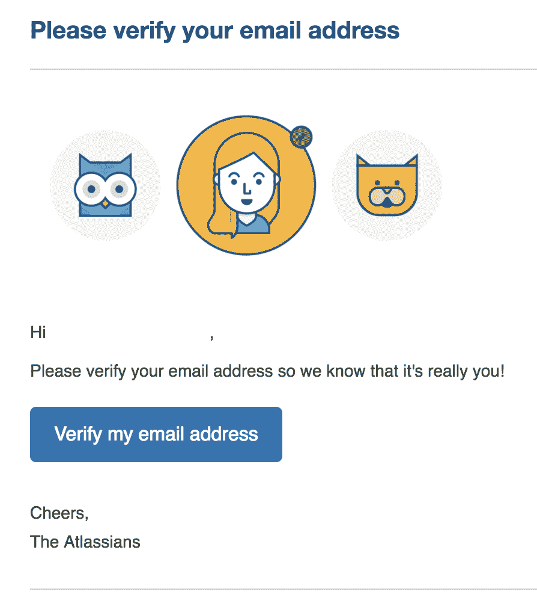

单击“验证我的电子邮件地址”按钮后，您将被重定向到以下页面:

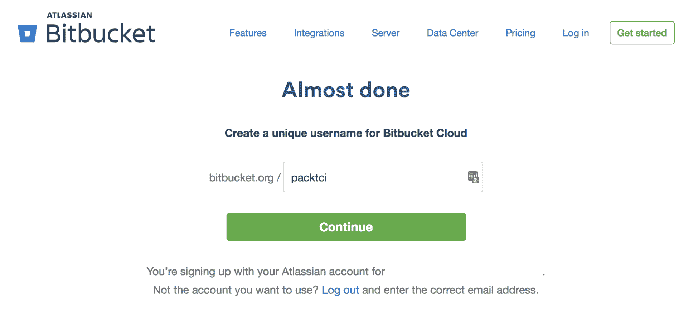

您必须为新的 Bitball 帐户提供唯一的用户名，因为您不能使用任何现有的用户名。单击继续按钮后，您将进入以下页面:


您可以通过单击“跳过”按钮跳过此部分，也可以输入您的信息，然后单击“提交”按钮，您将进入以下页面:

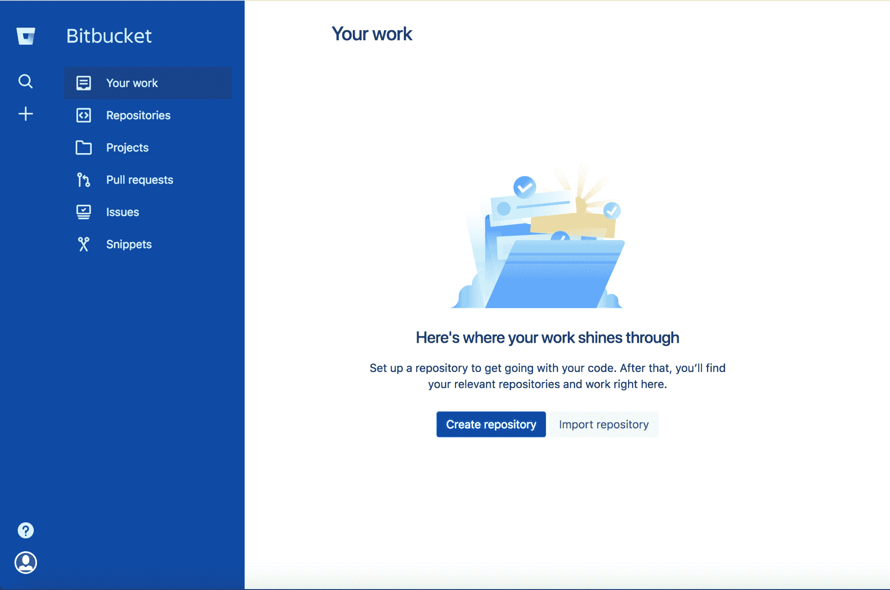

# 创建 CircleCI 帐户

为了开始使用 CircleCI，您需要创建一个 CircleCI 帐户，并且您可以使用您的 GitHub 登录凭据或您的 Bitbucket 登录凭据:


您需要单击“注册”按钮来创建一个新的 CircleCI 帐户，您将被重定向到以下页面:


你可以用任何一种注册，但是我们会选择*用比特桶**注册。o**T3 一旦点击按钮，您将被重定向到以下页面:*

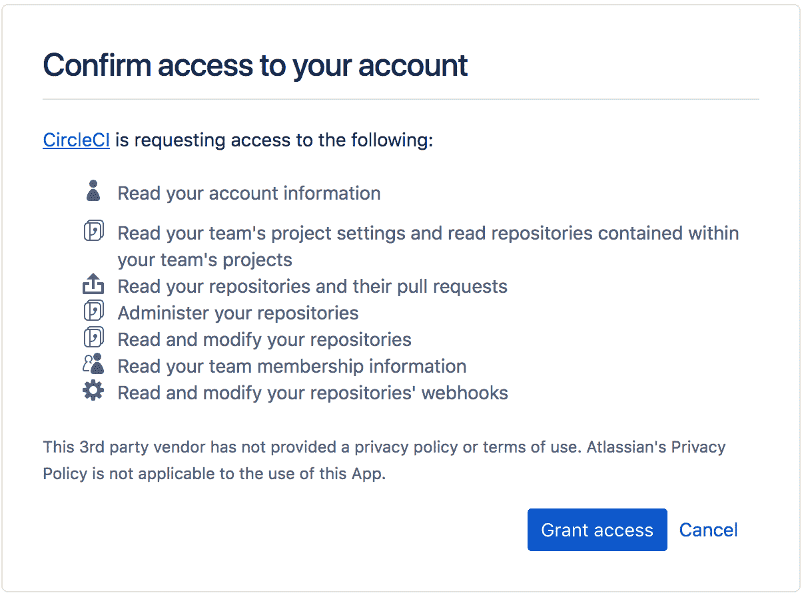

我们将单击“授予访问权限”按钮，然后我们将转到以下页面:

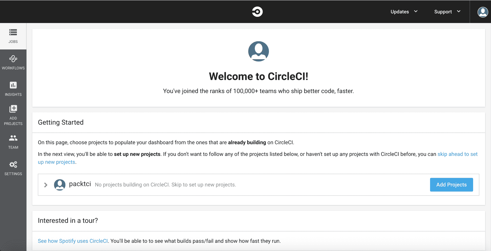

请注意，我们没有在 CircleCI 中运行的项目，稍后需要添加一个项目。

即使我们注册了新的 Bitbucket 帐户，我们仍然可以将我们的 GitHub 帐户连接到新的 CircleCI 帐户。您需要点击屏幕右上角的头像，然后点击用户设置按钮:

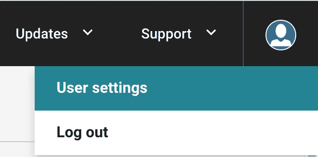

单击用户设置按钮后，您将进入显示帐户集成的页面。我们需要通过单击“连接”按钮将我们的 GitHub 帐户连接到 CircleCI:

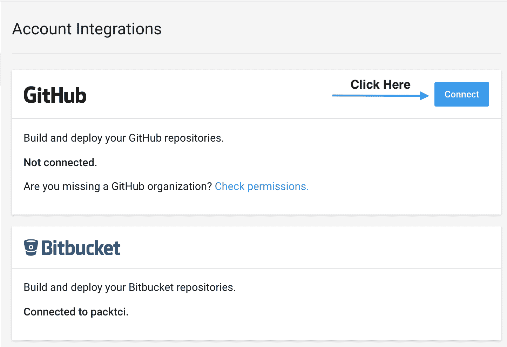

单击“连接”按钮后，您将被重定向到如下所示的“授权 CircleCI”应用程序页面:

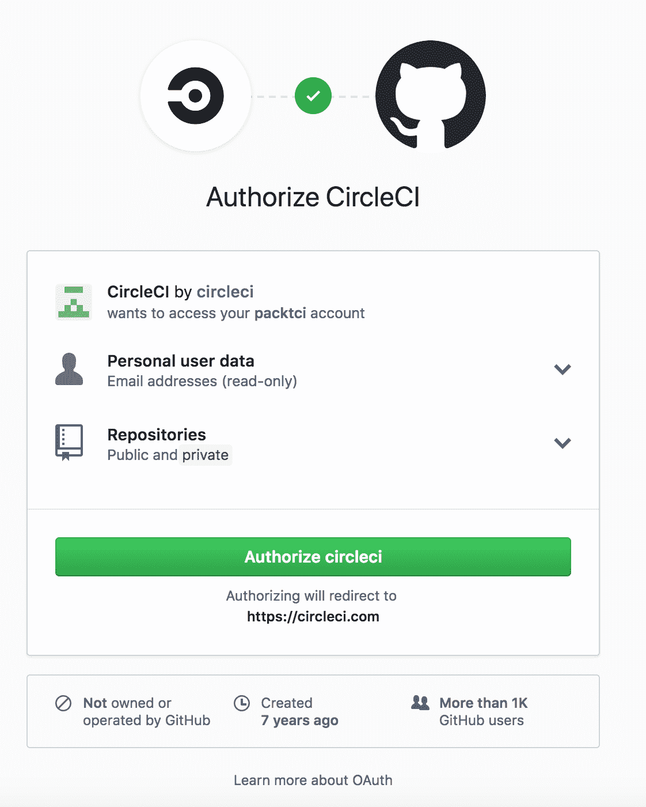

单击授权 circleci 按钮后，您将被重定向到 CircleCI 仪表板页面，现在您将拥有两个`packtci`帐户，分别对应于您的 GitHub 帐户和您的 Bitbucket 帐户:


# 在 GitHub 中设置 CircleCI

让我们使用我们的`packtci`([【https://github.com/packtci】](https://github.com/packtci))GitHub 帐户，用我们的`functional-summer`([【https://github.com/packtci/functional-summer】](https://github.com/packtci/functional-summer))GitHub 项目向 CircleCI 添加一个新项目。我们需要做的第一件事是单击 GitHub 的“添加项目”按钮，该按钮在仪表板中如下所示:


单击“添加项目”按钮后，您将进入如下页面:


我们将单击`functional-summer` GitHub 存储库的“设置项目”按钮，并将被路由到如下页面:


CircleCI 自动选择 Node 作为我们的语言，因为我们有一个`package.json`文件，并且因为我们在这个存储库中有 JavaScript 文件。不过，我们还没有完成。如果您进一步向下滚动此页面，您将注意到在我们的项目中启动 CircleCI 的一些后续步骤:


我们需要在项目的根目录下创建一个名为`.circleci`的文件夹，并在这个文件夹中添加一个名为`config.yml`的文件。让我们使用 GitHub 用户界面创建这个文件夹和文件。我们将前往以下网址:[https://github.com/packtci/functional-summer](https://github.com/packtci/functional-summer)。然后单击创建新文件按钮:

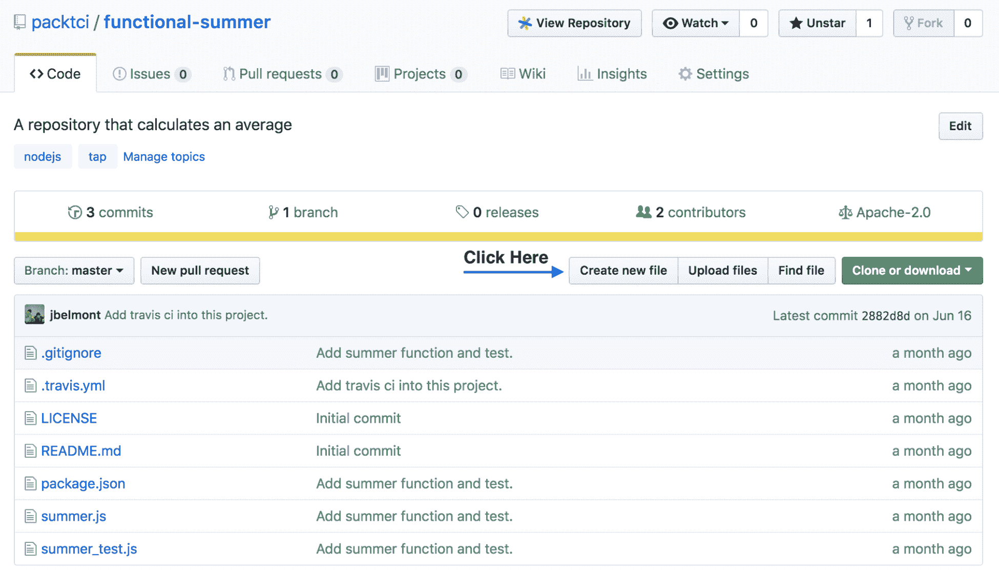

单击此按钮后，我们将被重定向到 GitHub 用户界面中的类似页面:

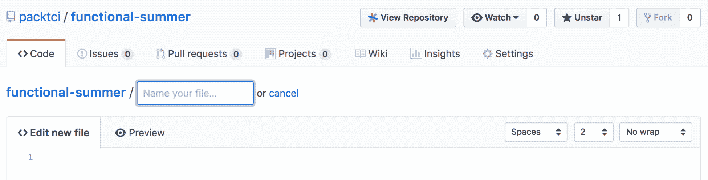

将我们的文件夹名称输入为`.circleci`，然后输入`/`字符，然后将我们的文件命名为`config.yml`。完成后，它将如下所示:


现在我们需要为我们的`config.yml`文件输入内容，`.circleci`为我们提供了一个样本`config.yml`文件，其中包含我们可以在新的 CircleCI 项目中使用的值:

```
# Javascript Node CircleCI 2.0 configuration file
#
# Check https://circleci.com/docs/2.0/language-javascript/ for more details
#
version: 2
jobs:
 build:
     docker:
     # specify the version you desire here
     - image: circleci/node:7.10

     # Specify service dependencies here if necessary
     # CircleCI maintains a library of pre-built images
     # documented at https://circleci.com/docs/2.0/circleci-images/
     # - image: circleci/mongo:3.4.4

     working_directory: ~/repo

     steps:
         - checkout

         # Download and cache dependencies
         - restore_cache:
             keys:
              - v1-dependencies-{{ checksum "package.json" }}
              # fallback to using the latest cache if no exact match is found
              - v1-dependencies-

         - run: yarn install

         - save_cache:
             paths:
                 - node_modules
             key: v1-dependencies-{{ checksum "package.json" }}

         # run tests!
         - run: yarn testSetup Circle CI in Atlassian Bitbucket
```

我们将在后面更详细地解释它的内容，但现在我们只需将它复制并粘贴到 GitHub 用户界面编辑器中，然后单击提交新文件按钮:


我们需要做的最后一步是返回到 CircleCI 中的“添加项目”页面，并单击“开始构建”按钮来启动我们在 CircleCI 中新配置的项目:


This also sets up a webhook with CircleCI so that CircleCI listens to any new code changes that we commit to GitHub.

一旦我们点击开始构建按钮，我们将被重定向到我们的第一个构建工作，我们的`functional-summer`存储库带有 CircleCI:


如果我们进一步向下滚动，我们将在 CircleCI 应用程序中看到构建的每个步骤:

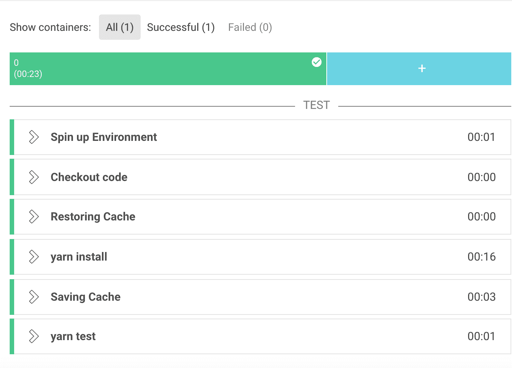

我们将在后面的章节中更详细地解释这一点，但是每个步骤都可以扩展以显示该步骤的细节。例如，如果我们单击纱线测试步骤，我们将看到以下详细信息:


# 在比特桶中设置 CircleCI

由于我们刚刚创建了一个新的 Bitball 帐户，我们需要将 ssh 密钥上传到 Bitball 中，以便能够将更改推送到 Bitball。我们在第 9 章、*Travis CI*的安装和基础知识中，在*向您的新 GitHub 帐户*添加 SSH 密钥一节中介绍了如何创建 SSH 密钥，因此如果您尚未设置任何 SSH 密钥，请阅读该章。我们已经在*第 9 章“Travis CI 的安装和基础知识”*的*中创建了一个 SSH 密钥，将 SSH 密钥添加到您的新 GitHub 帐户*部分。我们只需要通过运行以下命令，将公共 ssh 密钥复制到系统剪贴板中:

```
pbcopy < ~/.ssh/id_rsa_example.pub
```

一旦我们将我们的公共 SSH 密钥复制到系统剪贴板中，我们需要转到 Bitbucket 中的以下页面:


我们需要点击添加键按钮。这将打开一个模式，我们在其中输入标签和公钥的内容，如下所示:


然后，我们单击添加键按钮，现在我们准备将更改推送到我们的 Bitbucket 帐户。

# 用 CircleCI 构建在 Bitbucket 中建立一个新的 Java 项目

我们将在 Bitbucket 中创建一个名为`java-summer`的新 Java 项目，方法是单击左侧导航窗格中的加号按钮:


接下来，我们将单击存储库按钮，如下所示:

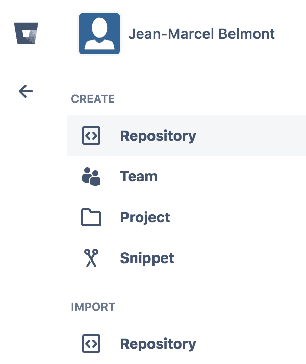

接下来，我们将通过提供存储库名称来创建一个新的存储库，将我们的版本控制系统设置为 Git，然后通过单击创建存储库按钮来完成:


请注意，我们单击了可选的高级设置下拉菜单，并将我们的语言设置为 Java 编程语言。单击“创建存储库”按钮后，我们将被重定向到如下页面:

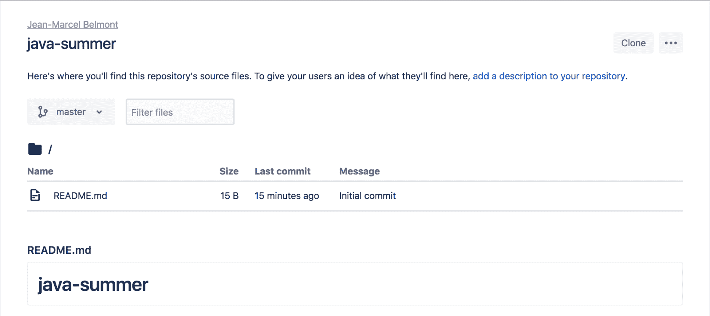

我们将使用 Maven 构建工具创建一个新的 Java 项目，该项目有一个`src`目录，该目录有一个主子目录和一个测试子目录。我们在[第 7 章](07.html)、*开发插件*中详细解释了如何安装和使用 Maven 构建工具，所以如果您没有安装 Maven 并且不知道如何使用它，请重读[第 7 章](https://cdp.packtpub.com/hands_on_continuous_integration_and_delivery/wp-admin/post.php?post=35&action=edit#post_30)、*开发插件*中的相应章节。

为了用 Maven 创建新的 Java 项目，我们将发出以下命令:

```
mvn archetype:generate -DgroupId=com.packci.app -DartifactId=java-summer -DarchetypeArtifactId=maven-archetype-quickstart -DinteractiveMode=false
```

我们将首先通过在 shell 会话中发出以下命令来克隆我们的存储库:

```
git clone git@bitbucket.org:packtci/java-summer.git java-summer-proj
```

然后，我们将复制这个克隆存储库中隐藏的`.git`目录的内容，并将其粘贴到我们用 Maven 构建工具创建的新`java-summer`文件夹中。假设我们有正确的路径结构，我们可以发出以下命令:

```
mv java-summer-proj/.git java-summer
```

然后我们可以删除`java-summer-proj`文件夹，然后`cd`进入`java-summer`文件夹。然后我们将使用 Java 语言示例配置，您可以在 CircleCI 文档中的**语言-Java**([https://circleci.com/docs/2.0/language-java/](https://circleci.com/docs/2.0/language-java/))中找到该配置。我们将创建一个名为`.circleci`的文件夹，然后创建一个名为`config.yml`的文件。

我们将提交我们的更改，并使用以下命令将其推送到 Bitbucket:

```
git push
```

现在，如果您查看 CircleCI 应用程序，我们可以通过单击应用程序的左上角来切换到 packtci Bitbucket 用户帐户，如下所示:


接下来，我们需要单击左侧导航窗格中的“添加项目”按钮，如下所示:

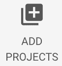

然后，我们需要单击“设置项目”按钮，以便 CircleCI 了解我们在 Bitbucket 中的`java-summer`存储库，如下所示:

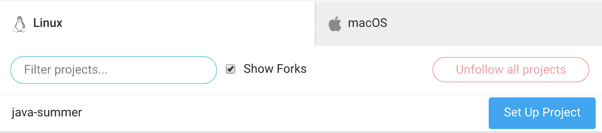

然后我们将被路由到设置项目页面，在那里我们需要选择我们的操作系统，在 CircleCI 中默认为 Linux。然后我们选择我们的构建语言，在我们的例子中应该是 Java。为了清晰起见，我们将在下面的截图中再次显示该页面:

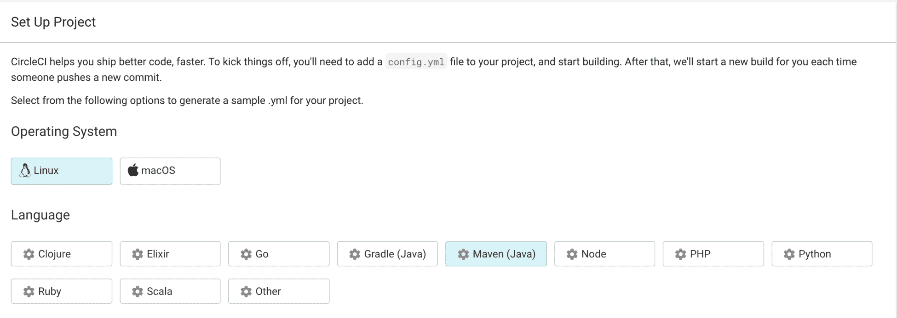

然后我们将 CircleCI 为我们提供的示例配置文件复制到`.circleci/config.yml`文件中:

```
# Java Maven CircleCI 2.0 configuration file
#
# Check https://circleci.com/docs/2.0/language-java/ for more details
#
version: 2
jobs:
  build:
    docker:
      # specify the version you desire here
      - image: circleci/openjdk:8-jdk

      # Specify service dependencies here if necessary
      # CircleCI maintains a library of pre-built images
      # documented at https://circleci.com/docs/2.0/circleci-images/
      # - image: circleci/postgres:9.4

    working_directory: ~/repo

    environment:
      # Customize the JVM maximum heap limit
      MAVEN_OPTS: -Xmx3200m

    steps:
      - checkout

      # Download and cache dependencies
      - restore_cache:
          keys:
          - v1-dependencies-{{ checksum "pom.xml" }}
          # fallback to using the latest cache if no exact match is found
          - v1-dependencies-

      - run: mvn dependency:go-offline

      - save_cache:
          paths:
            - ~/.m2
          key: v1-dependencies-{{ checksum "pom.xml" }}

      # run tests!
      - run: mvn integration-test
```

接下来，我们将提交更改并将其推送到 Bitbucket 版本控制系统中，然后我们需要滚动到“下一步”部分，只需单击“开始构建”按钮，如下所示:


这将触发我们对`java-summer`项目的第一次构建，并让 webhook 为存储库工作。一旦我们点击开始构建按钮，我们需要点击作业按钮，以便查看我们被触发的新构建:


现在，为了测试 webhooks 是否正在听 Bitbucket 中的代码更改，让我们对我们的`java-summer`文件进行一个更改，这样它实际上就有了一个函数，该函数可以对一组值进行求和，并用 JUnit 添加一个单元测试用例([https://junit.org/junit4/javadoc/latest/](https://junit.org/junit4/javadoc/latest/))。

让我们在应用程序文件中添加一个像这样的静态函数:

```
public static int average(int[] numbers) {
    int sum = 0;
    for (int i = 0; i < numbers.length; i++) {
        sum += numbers[i];
    }
    return sum;
}
```

然后让我们添加一个测试用例，用 JUnit 测试像这样的平均函数:

```
public void testaverage() {
    App myApp = new App();
    int[] numbers = {
            1, 2, 3, 4, 5
    };
    assertEquals(15, myApp.average(numbers));
}
```

我们可以使用`mvn package`命令在本地测试更改，以确保没有任何损坏，然后提交我们的更改并将这些更改推送到 Bitbucket 版本控制系统。我们现在应该注意到，由于我们对主分支的代码更改，用 CircleCI 自动触发了一个构建。

如果我们回到 CircleCI web 应用程序，我们可以看到一个新的构建被触发，并且它通过了:


请注意，在前面的截图中，CircleCI 显示第二次构建被触发。它还显示提交 SHA 哈希和提交消息，并确认构建成功。

# CircleCI 配置概述

CircleCI 使用数据序列化语言 YAML([http://yaml.org/spec/1.2/spec.html](http://yaml.org/spec/1.2/spec.html))作为其配置语言，Travis CI 也是如此。

# CircleCI 配置的概念概述

我们将在后面的章节中讨论更多 CircleCI 中的概念和配置选项，但是作为概述，让我们看一下一个基本的`config.yml`文件并解释它的一些概念。我们将与我们的`packtci`([https://github.com/packtci](https://github.com/packtci))GitHub 用户在 GitHub 中创建新的存储库。您可以在[https://github . com/packtci/go-template-example-with-circle-ci](https://github.com/packtci/go-template-example-with-circle-ci)找到新的存储库。我们还将在 Golang 中创建一个解析模板的函数。然后我们将编写一个测试用例，解析模板文本，然后创建一个 CircleCI `config.yml`文件。我们将把这些代码更改推送到 GitHub，然后最终用 CircleCI 建立这个新项目。

# 将源文件添加到新存储库中

在新的存储库中，我们添加了一个名为`template.go`的文件，下面是我们将要测试的函数:

```
func parseTemplate(soldier Soldier, tmpl string) *bytes.Buffer {
    var buff = new(bytes.Buffer)
    t := template.New("A template file")
    t, err := t.Parse(tmpl)
    if err != nil {
        log.Fatal("Parse: ", err)
        return buff
    }
    err = t.Execute(buff, soldier)
    if err != nil {
        log.Fatal("Execute: ", err)
        return buff
    }
    return buff
}
```

我们添加了以下单元测试用例来测试`template_test.go`文件中的`parseTemplate`功能:

```
func TestParseTemplate(t *testing.T) {
    newSoldier := Soldier{
        Name: "Luke Cage",
        Rank: "SGT",
        TimeInService: 4,
    }
    txt := parseTemplate(newSoldier, templateText)
    expectedTxt := `
Name is Luke Cage
Rank is SGT
Time in service is 4
`
    if txt.String() != expectedTxt {
        t.Error("The text returned should match")
    }
}
```

然后，我们将以下 CircleCI YML 脚本添加到存储库中:

```
version: 2

jobs:
    build:
        docker:
            - image: circleci/golang:1.9
        working_directory: /go/src/github.com/packtci/go-template-example-with-circle-ci

        steps:
            - checkout
            - run:
                name: "Print go version"
                command: go version
            - run:
                name: "Run Unit Tests"
                command: go test
```

CircleCI YML 脚本中首先要添加的是版本([https://circle ci . com/docs/2.0/configuration-reference/# version](https://circleci.com/docs/2.0/configuration-reference/#version))字段。这是一个需要添加的字段，目前**版本 1** 仍受支持，但很快将被弃用，因此建议使用 CircleCI YML 语法的**版本 2** 。你可以在以下 CircleCI 的博文中读到更多关于这方面的内容:[https://circleci.com/blog/sunsetting-1-0/](https://circleci.com/blog/sunsetting-1-0/)。

这个`config.yml`脚本中的下一个内容是 jobs([https://circleci.com/docs/2.0/configuration-reference/#jobs](https://circleci.com/docs/2.0/configuration-reference/#jobs))字段，它由一个或多个命名的 jobs 组成。在我们的例子中，我们有一个名为构建的作业，如果我们不使用工作流字段，则需要这个构建作业。我们将在后面的章节中更详细地讨论这一点。

然后我们有一个名为`docker`的字段，它有一个 Golang 的语言图像。我们还可以有一个服务映像来运行特定的服务，这将在后面的章节中讨论。

然后我们有一个名为`steps`的字段，它定义了我们想要在 CircleCI 构建中执行的步骤。注意`steps`字段中有三个字段条目，分别是`checkout`和两个`run`([https://circleci.com/docs/2.0/configuration-reference/#jobs](https://circleci.com/docs/2.0/configuration-reference/#jobs))命令。run 命令有一个名称和一个命令，但是您也可以省略一个名称，只给出一个命令。

# 新存储库的 CircleCI 构建作业

下面的截图显示了通过的 CircleCI 构建:


以下是构建作业的步骤:

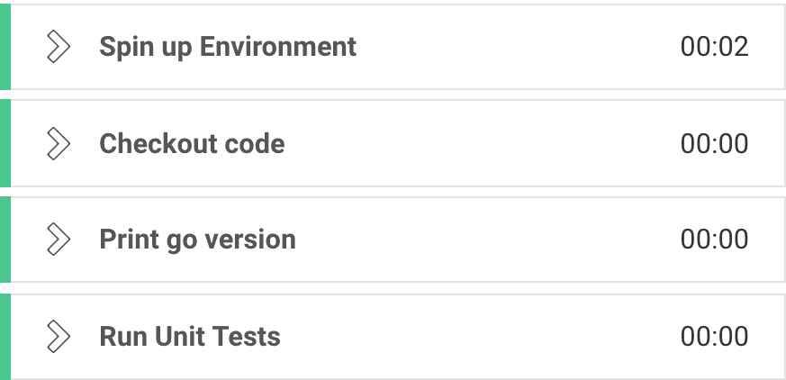

请注意，这里还有一个名为“加速环境”的附加步骤。这一步创建了一个新的构建环境，特别是对于我们的构建，它创建了一个 Golang Docker 映像，然后设置了一些特定于 CircleCI 的环境变量。

# 摘要

在本章中，我们介绍了 CircleCI 和 Travis CI 之间的区别，并介绍了 CircleCI 的先决条件。我们创建了一个新的 Bitbucket 帐户，并解释了 Bitbucket UI 的基础知识，以及在 Bitbucket 中上传您的 SSH 密钥以访问存储库的位置。然后，我们在 GitHub 和 Bitbucket 中设置了 CircleCI，并解释了 CircleCI web 应用程序的部分内容以及如何在其中导航。最后，我们简要介绍了 CircleCI YAML 配置语法。在下一章中，我们将浏览 CircleCI 命令，并浏览 CircleCI 中的一些更高级的主题，例如工作流。

# 问题

1.  Jenkins和特拉维斯 CI 的主要区别是什么？
2.  CircleCI 可以同时在 Bitbucket 和 GitHub 中工作吗？
3.  在 CircleCI 中，您在哪里设置存储库？
4.  如何看待 CircleCI 中的构建作业？
5.  我们在 Bitbucket 的`java-summer`存储库中使用了哪个构建工具？
6.  您应该使用版本 1 的 CircleCI 语法吗？
7.  在 CircleCI `config.yml`脚本中，我们在哪个字段输入我们的构建语言？

# 进一步阅读

您可以通过查看位于[https://circleci.com/docs/2.0/.](https://circleci.com/docs/2.0/)的 CircleCI 官方文档，进一步探索 CircleCI 中的概念