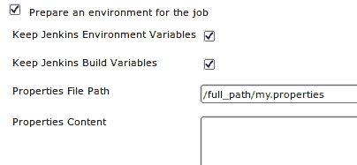

# 三、构建软件

在本章中，我们将介绍以下食谱:

*   在Jenkins中绘制替代代码度量
*   通过 Maven 运行 Groovy 脚本
*   操纵环境变量
*   在 Maven 中通过 Groovy 运行 AntBuilder
*   基于 JSP 语法错误的Jenkins作业失败
*   为集成测试配置 Jetty
*   利用 RATs 查看许可证违规情况
*   从 Maven 内部审查许可证违规
*   通过构建描述公开信息
*   使用构建后 Groovy 插件对生成的数据做出反应
*   通过Jenkins应用编程接口远程触发乔布斯
*   自适应网站生成

# 简介

本章回顾了 Jenkins 和 Maven 构建之间的关系，以及 Groovy 和 Ant 的少量脚本。

Jenkins是灵活性的大师。它可以在多种平台和技术上很好地工作。Jenkins 有一个直观的界面，具有清晰的配置设置。这对完成工作很有帮助。然而，清楚地定义 Jenkins 插件和 Maven 构建文件之间的界限也很重要。

缺乏分离会让你不必要地依赖Jenkins。如果你知道你将总是通过 Jenkins 运行你的构建，那么你可以把一些核心工作放在 Jenkins 插件中，获得有趣的额外功能。但是，如果您希望始终能够直接构建、测试和部署，那么您需要将细节保留在 `pom.xml`中。您必须在添加配置的地方判断平衡。当你使用更多Jenkins插件的特性集时，很容易出现特性蠕变。UI 比写长的 `pom.xml`更容易配置。可读性的提高意味着与配置相关的缺陷减少。对于您来说，将 Jenkins 用于大多数常见任务也更简单，例如传输工件、交流和绘制测试趋势。

Jenkins和马文之间相互作用的一个例子是使用Jenkins通过 SSH 发布插件([https://wiki . Jenkins-ci . org/display/Jenkins/Publish+Over+SSH+Plugin](https://wiki.jenkins-ci.org/display/JENKINS/Publish+Over+SSH+Plugin))。您可以配置传输文件或添加一段 `pom.xml`，如下所示:

```
<build>
<plugins>
<plugin>
<artifactId>maven-antrun-plugin</artifactId>
<configuration>
<tasks>
<scp file="${user}:${pass}@${host}:${file.remote}" localTofile="${file.local}"/>
</tasks>
</configuration>
<dependencies>
<dependency>
<groupId>ant</groupId>
<artifactId>ant-jsch</artifactId>
<version>1.6.5</version>
</dependency>
<dependency>
<groupId>com.jcraft</groupId>
<artifactId>jsch</artifactId>
<version>0.1.42</version>
</dependency>
</dependencies>
</plugin>
</plugins>
</build>

```

记住 Maven 插件有时使用的对特定 JARs 和版本的依赖感觉很神奇。Jenkins插件简化了细节。

本章稍后，您将有机会使用 **AntBuilder** 运行 Groovy 脚本。每种方法都是可行的，并且使用更多地取决于您的偏好，而不是一种选择。

Jenkins 插件可以很好地协同工作。例如，升级的构建插件([https://wiki . JENKINS-ci . org/display/JENKINS/Promoted+Builds+Plugin](https://wiki.jenkins-ci.org/display/JENKINS/Promoted+Builds+Plugin))在构建满足特定标准时发出信号，通过成功的构建放置图标。例如，您可以使用此功能向质量保证团队发出信号，告知他们需要测试构建或系统管理员来获取工件并进行部署。


其他插件也可以通过升级来触发，包括 SSH 插件。但是，Maven 并不知道推广机制。随着Jenkins的发展，期待更多的插件相互关系。

Jenkins精通动作编排。您应该将作业的运行时间保持在最小，并将较重的作业偏移到节点。繁重的工作往往集中在文档生成或测试上。Jenkins 允许您将 Jobs 链接在一起，因此 Jobs 将被耦合到特定的 Maven 目标，例如集成测试。在这种情况下，您可以选择编写许多构建文件，可能是作为一个多模块项目(http://Maven . Apache . org/plugins/Maven-assembly-plugin/examples/multi module/module-source-inclusion-simple . html)或一个更厚的 `pom.xml`，不同的目标准备在乔布斯之间调用。**保持简单愚蠢(KISS)** 偏向于更大的单个文件。

## 一个模板 pom.xml

本章的食谱将包括 `pom.xml`个例子。为了节省页面空间，将只显示基本细节。你可以从帕克特出版网站下载完整的例子。

这些示例针对 Maven 2.2.1 进行了测试。你需要在你的Jenkins服务器上安装这个版本，给它一个标签 `2.2.1`。

要为 Maven 项目生成基本模板，您有两种选择。你可以通过原型目标创建一个项目。或者可以从一个简单的 `pom.xml file`开始，如下代码所示:

```
<project 
xmlns:xsi="http://www.w3.org/2001/XMLSchema-instance"
xsi:schemaLocation="http://maven.apache.org/POM/4.0.0 http://Maven.apache.org/maven-v4_0_0.xsd">
<modelVersion>4.0.0</modelVersion>
<groupId>org.berg</groupId>
<artifactId>ch3.builds.xxx</artifactId>
<version>1.0-SNAPSHOT</version>
<name>Template</name>
</project>

```

模板看似简单，但只是更大有效 `pom.xml`的一部分。它与隐藏在 Maven 中的默认值相结合。要查看扩展版本，您需要运行以下命令:

```
mvn help:effective-pom

```

除非另有说明，食谱中提到的片段应该插入模板中，就在`</project>`标签之前，根据自己的口味更新您的 `groupID, artifactID`和 `version`值。

## 设置文件系统配置管理

在前几章中，您使用了将文件复制到工作区的方法。这很容易解释，但是是特定于操作系统的。您也可以通过**文件系统配置管理插件**([https://wiki.jenkins-ci.org/display/JENKINS/File+System+SCM](https://wiki.jenkins-ci.org/display/JENKINS/File+System+SCM))进行文件复制，这与操作系统无关。您将需要安装插件，确保文件具有正确的权限，以便Jenkins用户可以复制。在 Linux 中，考虑将文件放在 Jenkins 主目录下: `/var/lib/Jenkins`。

# 在 Jenkins 中绘制备选代码度量

本食谱详细介绍了如何使用**绘图**插件([https://wiki.jenkins-ci.org/display/JENKINS/Plot+Plugin](https://wiki.jenkins-ci.org/display/JENKINS/Plot+Plugin))绘制自定义数据。这允许您可视化地公开数字构建数据。

Jenkins 有许多插件，可以创建由构建生成的测试结果的视图。**分析收集器插件**从这些插件中提取结果来创建汇总的摘要和历史记录。这对于绘制标准结果类型的历史非常有用，例如 JUnit、FindBugs、JMeter 和 NCSS。还有一个插件([http://docs . codehaus . org/display/SONAR/Hudson+和+Jenkins+Plugin](http://docs.codehaus.org/display/SONAR/Hudson+and+Jenkins+Plugin) )支持推数据到 SONAR([http://www.sonarsource.org/](http://www.sonarsource.org/))。**声纳**专门报告项目的代码质量。然而，尽管有丰富的选项，可能有一天你会需要绘制自定义结果。

**场景:**您想知道在集成测试期间，您的定制缓存中生成了多少命中或未命中的历史记录。绘制构建图将为您提供一个指示器，指示代码更改是在提高性能还是降低性能。

在这个配方中，一个简单的 Perl 脚本将生成随机缓存结果。

## 做好准备

在Jenkins的**插件管理器**部分，例如 `http://localhost:8080/pluginManager/available`，安装剧情插件。

创建目录 `ch3.building_software/plotting`。

## 怎么做...

1.  创建文件 `ch3.building_software/plotting/hit_and_miss.pl`，添加以下内容:

    ```
    #!/usr/bin/perl
    my $workspace = $ENV{'WORKSPACE'};
    open(P1, ">$workspace/hits.properties")|| die;
    open(P2, ">$workspace/misses.properties")|| die;
    print P1 "YVALUE=".rand(100);
    print P2 "YVALUE=".rand(50);

    ```

2.  创建一个名为 `ch3.plotting`的自由式作业。
3.  在**源代码管理**部分，检查**文件系统**，为**路径**添加到您的绘图目录的完全限定路径，例如 `/var/lib/Jenkins/cookbook/ch3.building_software/plotting`。
4.  在**构建**部分，为**执行** shell 添加一个构建步骤，如果是 Windows 系统，**执行 Windows** 批处理命令。
5.  对于命令，添加 `perl hit_and_miss.pl`。
6.  在**后期构建操作**部分，选择**绘制构建数据**复选框。
7.  向新扩展的区域添加以下值:
    *   **地块组:** `Cache Data`
    *   **剧情标题:** `Hits and misses`
    *   **绘制 y 轴标签:** `Number of hits or misses`
    *   **剧情风格:** `Stacked Area`
8.  添加一个带有**数据系列图例标签**的**数据系列文件** `misses.properties`
9.  添加带有**数据系列图例标签**T5 的**数据系列文件**T0
10.  At the bottom of the **Configuration** page, click on the **Save** button.

    

11.  多次运行该作业。
12.  Review the **Plot** link.

    

## 它是如何工作的...

Perl 脚本生成两个属性文件: `hits`和 `misses`。 `hits`文件包含在 `0`和 `100`之间的 `YVALUE`，而 `misses`文件包含在 `0`和 `50`之间的 `YVALUE`。这些数字是随机生成的。绘图插件然后从属性 `YVALUE`中读取值。

这两个属性文件由绘图插件读取。该插件跟踪历史记录及其在趋势图值中显示的值。您将不得不尝试不同的图形类型，以便为您的自定义测量找到最佳的绘图。

目前还有另外两种数据格式可以使用: **XML** 和 **CSV** 。然而，在在线帮助清楚地解释所使用的结构之前，我建议保持属性格式。

选择 Perl 是因为它的编码简洁，并且它与平台无关。该脚本也可以用 Groovy 编写，并在 Maven 项目中运行。您可以在*中看到一个通过 Maven* 食谱运行 Groovy 脚本的 Groovy 示例。

## 还有更多...

绘图插件允许您在多种绘图类型之间进行选择，包括面积、条形、条形三维、直线、直线三维、堆叠面积、堆叠条形、堆叠条形三维和瀑布。如果选择正确的图形类型，可以生成漂亮的图。

如果您想将这些自定义图表添加到您的报告中，您需要保存它们。您可以通过右键单击浏览器中的图像来实现。

您可能还希望有不同的图形大小。您可以通过访问以下网址来生成图像:[http://host/job/JobName/plot/getPlot？指数=n &宽度=x &高度=y](http://host/job/JobName/plot/getPlot?index=n&width=x&height=y) 。

宽度和高度定义了绘图的大小。 `n`是指向特定地块的指数。如果你只有一个剧情，那么 `n`就等于 `0`。如果您配置了两个地块，那么 n 可以是 `0`或 `1`。要发现索引，请访问绘图链接，检查**跳转到**选择框，并从最高的绘图号减去 1。


要根据本配方中的作业生成尺寸为 `800x600`的巴布亚新几内亚格式的图形，您可以使用类似以下内容的网址:

`localhost:8080/job/ch3.plotting/plot/getPlot?index=0&width=800&height=600`

### 类型

要下载图像而不自己登录，也可以使用配方*中提到的可脚本化认证方法远程触发作业*。

## 另见

*   *通过 Maven 运行 Groovy 脚本*
*   *自适应站点生成*
*   *通过Jenkins应用编程接口*远程触发作业

# 通过 Maven 运行 Groovy 脚本

这个食谱描述了如何使用 **gmaven** 插件([http://docs.codehaus.org/display/GMAVEN/Home](http://docs.codehaus.org/display/GMAVEN/Home))来运行 Groovy 脚本。

在构建中运行 Groovy 脚本的能力允许您在 Maven 和 Jenkins 中一致地使用一种脚本语言。Groovy 可以在任何 Maven 阶段运行。Maven 可以从构建文件、另一个文件位置或远程 web 服务器执行 Groovy 源代码。

### 类型

**脚本的可维护性**

为了以后的重用，考虑将您的 Groovy 代码集中在构建文件之外。

## 做好准备

创建目录 `ch3.building_software/running_groovy`。

## 怎么做...

1.  在模板文件中的`</project>`标签前添加以下片段(在介绍中提到)，确保 `pom.xml`文件是Jenkins可读的。

    ```
    <build>
    <plugins>
    <plugin>
    <groupId>org.codehaus.gmaven</groupId>
    <artifactId>gmaven-plugin</artifactId>
    <version>1.3</version>
    <executions><execution>
    <id>run-myGroovy</id>
    <goals><goal>execute</goal></goals>
    <phase>verify</phase>
    <configuration>
    <classpath>
    <element>
    <groupId>commons-lang</groupId>
    <artifactId>commons-lang</artifactId>
    <version>2.6</version>
    </element>
    </classpath>
    <source>
    import org.apache.commons.lang.SystemUtils
    if(!SystemUtils.IS_OS_UNIX) { fail("Sorry, Not a UNIX box")}
    def command="ls -l".execute()
    println "OS Type ${SystemUtils.OS_NAME}"
    println "Output:\n ${command.text}"
    </source>
    </configuration>
    </execution></executions>
    </plugin>
    </plugins>
    </build>

    ```

2.  用作业名 `ch3.groovy_verify`创建一个自由风格的作业。
3.  在**源代码管理**部分，检查**文件系统**，为**路径**添加到您的绘图目录的完全限定路径，例如 `/var/lib/jenkins/cookbook/ch3.building_software/running_groovy`。
4.  在**构建**部分，为**添加一个构建步骤，调用顶级 Maven 目标**。在新展开的部分中，添加:
    *   **Maven 版本:`2.2.1`T2]**
    *   **目标:`Verify`**
5.  运行作业。如果你的系统在 `*NIX`框上，那么类似的输出会出现在下面:

    ```
    OS Type Linux
    Output:
    total 12
    -rwxrwxrwx 1 jenkins jenkins 1165 2011-09-02 14:26 pom.xml
    drwxrwxrwx 1 jenkins jenkins 312 2011-09-02 14:53 target

    ```

    ```
    Sorry, Not a UNIX box

    ```

    *   在 Windows 系统上，如果 Jenkins 配置正确，脚本将失败，并显示以下消息:

## 它是如何工作的...

您可以在构建过程中多次执行 `gmaven-plugin`。在示例中，相位 `verify`是触发点。

为了使 Groovy 插件能够在其核心特性之外找到导入的类，您需要在`<classpath>`中添加一个元素。源代码包含在`<source>`标签中。

```
import org.apache.commons.lang.SystemUtils
if(!SystemUtils.IS_OS_UNIX) { fail("Sorry, Not a UNIX box")}
def command="ls -l".execute()
println "OS Type ${SystemUtils.OS_NAME}"
println "Output:\n ${command.text}"

```

`import`语句起作用，因为在`<classpath>`标签中提到了依赖关系。

`systemutils`类([http://commons . Apache . org/lang/API-2.6/org/Apache/commons/lang/systemutils . html](http://commons.apache.org/lang/api-2.6/org/apache/commons/lang/SystemUtils.html))提供了帮助方法，例如能够辨别您运行的是哪个 OS、Java 版本以及用户的主目录。

`fail`方法允许 Groovy 脚本在构建时失败。在这种情况下，当您没有在 `*NIX`操作系统上运行构建时，大多数时候您会希望您的构建与操作系统无关。但是，在集成测试期间，您可能希望使用特定的操作系统来执行特定网络浏览器的功能测试。检查将停止构建，以防您的测试发现自己在错误的节点上。

### 注

一旦您对 Groovy 代码感到满意，就可以考虑将代码编译成底层的 Java 字节码。您可以在以下网址找到完整的说明:

[http://docs . codehaus . org/display/GMAVEN/Building+Groovy+project](http://docs.codehaus.org/display/GMAVEN/Building+Groovy+Projects)

## 还有更多...

这里有一些你可能会发现有用的提示。

### 跟踪警告

查看日志文件很重要，不仅是在失败时，而且是在警告时。在这种情况下，您将看到两个警告:

```
[WARNING] Using platform encoding (UTF-8 actually) to copy
[WARNING] JAR will be empty - no content was marked for inclusion!

```

`platform encoding`警告表示将使用默认平台编码复制文件。如果您更改了服务器，并且服务器上的默认编码不同，则复制的结果也可能不同。为了保持一致性，最好通过添加以下行来实施特定的编码:

```
<properties>
<project.build.sourceEncoding>UTF8</project.build.sourceEncoding>
</properties>

```

请更新您的模板文件以考虑到这一点。

JAR 警告是因为我们只运行一个脚本，没有内容来制作一个 JAR。如果在打包 JAR 之前调用脚本，就不会触发警告。

### 我的来源在哪里？

还有另外两种方法指向要执行的 Groovy 脚本。首先是指向文件系统，例如:

```
<source>${script.dir}/scripts/do_some_good.Groovy</source>

```

另一种方法是通过类似以下的网址连接到 web 服务器:

```
<source>http://localhost/scripts/test.Groovy</source>

```

使用 web 服务器存储 Groovy 脚本给基础结构增加了额外的依赖性。然而，它也非常适合用 web 访问将代码集中在一个 SCM 中。

### 马文阶段

Jenkins在乔布斯那里一起工作。对于使用构建前和构建后支持的构建，它是粗粒度的。Maven 更加精细，有 21 个阶段作为触发点。参见[http://Maven . Apache . org/guides/introduction/生命周期介绍. html](http://Maven.apache.org/guides/introduction/introduction-to-the-lifecycle.html) 。

目标捆绑阶段，例如，对于站点目标，有四个阶段:前站点、站点、后站点和站点部署，所有这些都将由 `mvn site`或直接使用语法 `mvn site:phase`按顺序调用。

这个想法是将一系列轻量级的乔布斯联系在一起。您应该将任何繁重的作业(如集成测试或大量 JavaDoc 生成)外包给一个从节点。您还应该按时间进行划分，以平衡负载并帮助诊断问题。

对于 2.2.1 和 3.0.3，您可以在以下网址找到连接生命周期代码的 XML:

*   [http://SVN . Apache . org/view VC/maven/maven-2/tags/maven-2 . 2 . 1/maven-core/src/main/resources/META-INF/丛丛/components.xml？视图=标记](http://svn.apache.org/viewvc/maven/maven-2/tags/maven-2.2.1/maven-core/src/main/resources/META-INF/plexus/components.xml?view=markup)
*   [http://SVN . Apache . org/view VC/maven/maven-3/tags/maven-3 . 0 . 3/maven-core/src/main/resources/META-INF/丛丛/components.xml？视图=标记](http://svn.apache.org/viewvc/maven/maven-3/tags/maven-3.0.3/maven-core/src/main/resources/META-INF/plexus/components.xml?view=markup)

你会在线下找到 `components.xml`中提到的 Maven 相位:

```
<!-- START SNIPPET: lifecycle -->

```

Maven 插件绑定到特定的阶段。对于站点生成，`<reporting>`标签包围了大部分配置。在报告下配置的插件生成有用的信息，其结果保存在 `target/site`目录下。有许多插件可以获取生成的结果，然后绘制它们的历史。Jenkins插件，一般来说，不执行测试，但消费结果。也有例外，比如**slocount**插件([https://wiki . JENKINS-ci . org/display/JENKINS/slocount+Plugin](https://wiki.jenkins-ci.org/display/JENKINS/SLOCCount+Plugin))和**任务扫描器**插件([https://wiki . JENKINS-ci . org/display/JENKINS/Task+Scanner+Plugin](https://wiki.jenkins-ci.org/display/JENKINS/Task+Scanner+Plugin))。这些差异将在后面的[第 5 章](5.html "Chapter 5. Using Metrics to Improve Quality")、*中探讨使用度量来提高质量*。

Groovy 插件在所有阶段都很有用，因为它不专门用于任何特定的任务，例如打包或部署。它为您提供了一种统一的方法来应对 Maven 常见功能之外的情况。

### 类型

【Maven 版本之间的差异

Maven 2.2 和 3 的行为有所不同，尤其是在站点生成方面。它们汇总在[https://cwiki . Apache . org/MAVEN/Maven-3x-compatibility-notes . html](http://https://cwiki.apache.org/MAVEN/Maven-3x-compatibility-notes.html)。

你可以在[https://cwiki . Apache . org/MAVEN/MAVEN-3x-plugin-compatibility-matrix . html](http://https://cwiki.apache.org/MAVEN/Maven-3x-plugin-compatibility-matrix.html)找到插件兼容性列表。

## 另见

*   *在 Maven 中通过 Groovy 运行 AntBuilder】*
*   *使用后期构建 Groovy 插件*对生成的数据做出反应
*   *自适应站点生成*

# 操纵环境变量

这个配方向您展示了如何将变量从Jenkins传递到您的构建作业，以及如何覆盖不同的变量。它还描述了一种在关键信息没有被正确传递的情况下使构建失败的方法。

Jenkins 有许多用于将信息传递给构建的插件，包括 **Setenv** 插件([https://wiki.jenkins-ci.org/display/JENKINS/Setenv+Plugin](https://wiki.jenkins-ci.org/display/JENKINS/Setenv+Plugin))、 **Envfile** 插件([https://wiki.jenkins-ci.org/display/JENKINS/Envfile+Plugin](https://wiki.jenkins-ci.org/display/JENKINS/Envfile+Plugin))和**envinjet**插件([https://wiki . JENKINS-ci . org/display/JENKINS/envinjet+Plugin](https://wiki.jenkins-ci.org/display/JENKINS/EnvInject+Plugin))。Envinject 插件被选择用于这个配方，因为据报道它可以与节点一起工作，并提供了广泛的属性注入选项。

## 做好准备

安装 Envinject 插件。创建名为。

## 怎么做...

1.  创建Jenkins可读的 `pom.xml`文件，内容如下:

    ```
    <project  xmlns:xsi="http://www.w3.org/2001/XMLSchema-instance" xsi:schemaLocation="http://maven.apache.org/POM/4.0.0 http://maven.apache.org/maven-v4_0_0.xsd">
    <modelVersion>4.0.0</modelVersion>
    <groupId>org.berg</groupId>
    <artifactId>ch3.jenkins.builds.properties</artifactId>
    <version>1.0-SNAPSHOT</version>
    <name>${name.from.jenkins}</name>
    <properties>
    <project.build.sourceEncoding>
    UTF8
    </project.build.sourceEncoding>
    </properties>
    <build>
    <plugins><plugin>
    <groupId>org.codehaus.gmaven</groupId>
    <artifactId>gmaven-plugin</artifactId>
    <version>1.3</version>
    <executions><execution>
    <id>run-myGroovy</id>
    <goals><goal>execute</goal></goals>
    <phase>verify</phase>
    <configuration>
    <source>
    def environment = System.getenv()
    println "----Environment"
    environment.each{ println it }
    println "----Property"
    println(System.getProperty("longname"))
    println "----Project and session"
    println "Project: ${project.class}"
    println "Session: ${session.class}"
    println "longname: ${project.properties.longname}"
    println "Project name: ${project.name}"
    println "JENKINS_HOME: ${project.properties.JENKINS_HOME}"
    </source>
    </configuration>
    </execution></executions>
    </plugin></plugins>
    </build>
    </project>

    ```

2.  创建一个名为 `my.properties`的文件，并将其放置在与 `pom.xml`文件相同的目录中，添加以下内容:

    ```
    project.type=prod
    secrets.file=/etc/secrets
    enable.email=true
    JOB_URL=I AM REALLY NOT WHAT I SEEM

    ```

3.  用作业名 `ch3.environment`创建一个空白的自由格式作业。
4.  在**源代码管理**部分，检查**文件系统**，为**路径**添加到您的目录的完全限定路径，例如: `/var/lib/jenkins/cookbook/ch3.building_software/environment`
5.  在**构建**部分，为**添加一个构建步骤，调用顶级 Maven 目标**。在新展开的部分中，添加:
    *   **Maven 版本:**t0]
    *   **目标:** `Verify`
6.  点击**高级**按钮，添加**属性:`longname=SuperGood.`**
7.  通过点击**为工作准备环境**(靠近**工作配置**页面顶部)，在 `my.properties`中注入数值。
8.  For **Properties File Path**, add `/full_path/my.properties`, for example: `/home/var/lib/cookbook/ch3.building_software/environment/my.properties`.

    

9.  运行作业。构建将失败，输出如下所示:

    ```
    ----Project and session
    Project: class org.apache.Maven.model.Model
    Session: class org.apache.Maven.execution.MavenSession
    longname: SuperGood
    [INFO] -------------------------------------------------------
    [ERROR] BUILD ERROR
    [INFO] -------------------------------------------------------
    [INFO] Groovy.lang.MissingPropertyException: No such property: name for class: script1315151939046

    ```

10.  在**的**构建**部分调用顶级 Maven 目标**，点击**高级**按钮。在新展开的部分，添加一个额外的属性 `name.from.jenkins=The build with a name`
11.  运行作业。现在应该成功了。

## 它是如何工作的...

**envinjet**插件对于将属性注入构建非常有用。

在食谱中，Maven 运行两次。第一次在没有定义变量 `name.from.jenkins`的情况下运行时，Jenkins作业失败。第二次在定义了变量的情况下运行时，Jenkins作业成功。

Maven 期望定义变量 `name.from.jenkins`，否则也不会定义项目名称。通常，这不足以阻止你的工作成功。然而，当运行 Groovy 代码时，行 `println "Project name: ${project.name}`特别是调用 `project.name`将导致构建失败。这对于防止属性值丢失非常有用。

Groovy 代码可以看到项目 `org.apache.Maven.model.Model`和会话类 `org.apache.Maven.execution.MavenSession`的实例。项目实例是您可以以编程方式访问的 XML 配置的模型。您可以通过 `project.properties.longname`参照 `longname`获得该房产。如果属性不存在，您的 Maven 目标将失败。您也可以通过电话 `System.getProperty("longname"))`到达酒店。但是，使用环境调用 `System.getenv()`无法到达该属性。

非常值得学习的各种选项，它们是:

*   **保留Jenkins环境变量**和**保留Jenkins构建变量:**这两个选项都会影响您的工作所看到的与Jenkins相关的变量。保持环境尽可能干净是有好处的，因为这将有助于您以后的调试。
*   **属性内容:**可以覆盖属性文件中的特定值。
*   **环境脚本文件路径:**它指向将设置您的环境的脚本。如果您想要检测运行环境的特定细节并相应地配置您的构建，这将非常有用。
*   **填充构建原因:**您使Jenkins能够设置 `BUILD_CAUSE`环境变量。此变量包含关于哪个事件触发了作业的信息。

## 还有更多...

Maven 有一个读取属性的插件([http://mojo.codehaus.org/properties-maven-plugin/](http://mojo.codehaus.org/properties-maven-plugin/))。要在属性文件之间进行选择，您需要在插件配置中设置一个变量，并将其作为Jenkins作业的一部分进行调用。例如:

```
<build>
<plugins>
<plugin>
<groupId>org.codehaus.mojo</groupId>
<artifactId>properties-maven-plugin</artifactId>
<version>1.0-alpha-2</version>
<executions>
<execution>
<phase>initialize</phase>
<goals>
<goal>read-project-properties</goal>
</goals>
<configuration>
<files>
<file>${fullpath.to.properties}</file>
</files>
</configuration>
</execution>
</executions>
</plugin>
</plugins>
</build>

```

如果使用属性文件的相对路径，则该文件可以驻留在修订控制系统中。如果使用完整路径，则属性文件可以存储在 Jenkins 服务器上。如果包含敏感密码(如数据库连接的密码)，则第二个选项更可取。

当您手动运行作业时，Jenkins 能够询问变量。这叫做**参数化构建**([https://wiki . JENKINS-ci . org/display/JENKINS/parameter+Build](https://wiki.jenkins-ci.org/display/JENKINS/Parameterized+Build))。在生成时，您可以通过从属性文件位置选择来选择属性文件。

## 另见

*   *在 Maven 中通过 Groovy 运行 AntBuilder】*

# 在 Maven 中通过 Groovy 运行 AntBuilder

Jenkins与拥有广泛技术背景的观众互动。在使用 Maven 之前，有许多开发人员已经精通蚂蚁脚本。比起编辑一个 `pom.xml`文件，开发人员可能更喜欢编写一个 Ant 任务。有一些任务关键型蚂蚁脚本仍然在相当一部分组织中运行。

在 Maven 中，可以直接用 `ant-run`插件([http://maven.apache.org/plugins/maven-antrun-plugin/](http://maven.apache.org/plugins/maven-antrun-plugin/))或者通过 Groovy([http://docs . codehaus . org/display/Groovy/Using+Ant+from+Groovy](http://docs.codehaus.org/display/GROOVY/Using+Ant+from+Groovy))运行 Ant 任务。 `Antrun`代表自然迁徙路径。这是最少初始工作的路径。

对于将 Groovy 作为其任务一部分的 Jenkins 管理员来说，Groovy 方法很有意义。Groovy 作为一种一流的编程语言，拥有广泛的控制结构，这在 Ant 中很难复制。您可以通过使用 `Ant-contrib`库([http://ant-contrib.sourceforge.net](http://ant-contrib.sourceforge.net))来部分实现这一点。然而，作为一种成熟的编程语言，Groovy 更具表现力。

这个食谱详细说明了如何运行两个包含 Groovy 和 Ant 的 Maven pom。第一个 pom 向您展示了如何在 Groovy 中运行最简单的 Ant 任务，第二个 POM 执行 Ant contrib 任务来保护来自大量计算机的复制文件。

## 做好准备

创建名为 `ch3.building_software/antbuilder`的目录。

## 怎么做...

1.  创建一个模板文件，称之为 `pom_ant_simple.xml`。
2.  更改 `groupId, artifactId, version`和 `name`的值以适合您的偏好。
3.  在`</project>`标记前添加以下 XML 片段:

    ```
    <build>
    <plugins><plugin>
    <groupId>org.codehaus.gmaven</groupId>
    <artifactId>gmaven-plugin</artifactId>
    <version>1.3</version>
    <executions>
    <execution>
    <id>run-myGroovy-test</id>
    <goals><goal>execute</goal></goals>
    <phase>test</phase>
    <configuration>
    <source>
    def ant = new AntBuilder()
    ant.echo("\n\nTested ----> With Groovy")
    </source>
    </configuration>
    </execution>
    <execution>
    <id>run-myGroovy-verify</id>
    <goals><goal>execute</goal></goals>
    <phase>verify</phase>
    <configuration>
    <source>
    def ant = new AntBuilder()
    ant.echo("\n\nVerified at ${new Date()}")
    </source>
    </configuration>
    </execution>
    </executions>
    </plugin></plugins>
    </build>

    ```

4.  运行 `mvn test`。查看输出。请注意，没有关于空 JAR 文件的警告。
5.  运行 `mvn`验证。查看输出。看起来应该和下面类似:

    ```
    [INFO] [surefire:test {execution: default-test}]
    [INFO] No tests to run.
    [INFO] [Groovy:execute {execution: run-myGroovy-test}]
    [echo]
    [echo]
    [echo] Tested ----> With Groovy
    [INFO] [jar:jar {execution: default-jar}]
    [WARNING] JAR will be empty - no content was marked for inclusion!
    [INFO] Building jar:ch3.jenkins.builds-1.0-SNAPSHOT.jar
    [INFO] [Groovy:execute {execution: run-myGroovy-verify}]
    [echo]
    [echo]
    [echo] Verified at Fri Sep 16 11:25:53 CEST 2011
    [INFO] [install:install {execution: default-install}]
    [INFO] Installing /target/ch3.jenkins.builds-1.0-SNAPSHOT.jar to ch3.jenkins.builds/1.0-SNAPSHOT/ch3.jenkins.builds-1.0-SNAPSHOT.jar
    [INFO] -------------------------------------------------------
    [INFO] BUILD SUCCESSFUL
    [INFO] -------------------------------------------------------
    [INFO] Total time: 4 seconds

    ```

6.  创建第二个名为 `pom_ant_contrib.xml`的模板文件。
7.  更改 `groupId, artifactId, version`和 `name`的值以适合您的偏好。
8.  Add the following XML fragment just before the`</project>` tag:

    ```
    <build>
    <plugins><plugin>
    <groupId>org.codehaus.gmaven</groupId>
    <artifactId>gmaven-plugin</artifactId>
    <version>1.3</version>
    <executions><execution>
    <id>run-myGroovy</id>
    <goals><goal>execute</goal></goals>
    <phase>verify</phase>
    <configuration>
    <source>
    def ant = new AntBuilder()
    host="Myhost_series"
    print "user: "
    user = new String(System.console().readPassword())
    print "password: "
    pw = new String(System.console().readPassword())
    for ( i in 1..920) {
    counterStr=String.format('%02d',i)
    ant.scp(trust:'true',file:"${user}: ${pw}${host}${counterStr}: /${full_path_to_location}",
    localTofile:"${myfile}-${counterStr}", verbose:"true")
    }
    </source>
    </configuration>
    </execution></executions>
    <dependencies>
    <dependency>
    <groupId>ant</groupId>
    <artifactId>ant</artifactId>
    <version>1.6.5</version>
    </dependency>
    <dependency>
    <groupId>ant</groupId>
    <artifactId>ant-launcher</artifactId>
    <version>1.6.5</version>
    </dependency>
    <dependency>
    <groupId>ant</groupId>
    <artifactId>ant-jsch</artifactId>
    <version>1.6.5</version>
    </dependency>
    <dependency>
    <groupId>com.jcraft</groupId>
    <artifactId>jsch</artifactId>
    <version>0.1.42</version>
    </dependency>
    </dependencies>
    </plugin></plugins>
    </build>

    ```

    ### 注

    该代码仅具有代表性。要使它工作，您必须将其配置为指向真实服务器上的文件。

## 它是如何工作的...

Groovy 运行基本的 Ant 任务，而不需要额外的依赖。创建一个 AntBuilder 实例([http://groovy . codehaus . org/Using+Ant+Libraries+with+Ant builder](http://Groovy.codehaus.org/Using+Ant+Libraries+with+AntBuilder)，然后调用 Ant `echo`任务。在引擎盖下，Groovy 调用 Ant 用来执行 `echo`命令的 Java 类。在 `echo`命令中，通过直接创建匿名对象来打印日期，例如:

```
ant.echo("\n\nVerified at ${new Date()}").

```

您将 `pom.xml`配置为分两个阶段启动 Groovy 脚本:**测试阶段**，然后在**验证阶段**。测试阶段发生在生成 JAR 文件之前，因此避免了创建关于空 JAR 的警告。顾名思义，这个阶段对于打包前的测试非常有用。

第二个示例脚本强调了将 Groovy 与 Ant 相结合的优势。SCP 任务([http://Ant.apache.org/manual/Tasks/scp.html](http://Ant.apache.org/manual/Tasks/scp.html))在多台服务器上运行了大量时间。该脚本首先要求用户名和密码，避免存储在文件系统或版本控制系统中。Groovy 脚本期望您注入变量宿主: `full_path_to_location`和 `myfile`。

请注意 Ant SCP 任务和它在 `pom_ant_contrib.xml`文件中的表达方式之间的相似性。

## 还有更多...

动态创建自定义属性文件允许您将信息从一个Jenkins作业传递到另一个作业。

您可以使用 `echo`任务通过 AntBuilder 创建属性文件。下面的代码创建了一个名为 `value.properties`的文件，有两行: `x=1`和 `y=2`。

```
def ant = new AntBuilder()
ant.echo(message: "x=1\n", append: "false", file: "values.properties")
ant.echo(message: "y=2\n", append: "true", file: "values.properties")

```

第一个 `echo`命令将 `append`设置为 `false`，这样每次构建发生时，都会创建一个新的 `properties`文件。第二 `echo`追加其消息。

### 注

当默认值设置为 `true`时，您可以删除第二个追加 `attribute`。

## 另见

*   *通过 Maven 运行 Groovy 脚本*

# 基于 JSP 语法错误的Jenkins作业失败

**Java Server Pages**([http://www.oracle.com/technetwork/java/overview-138580.html](http://www.oracle.com/technetwork/java/overview-138580.html))是一个标准，它使得创建简单的 web 应用变得简单明了。您可以将带有额外标记的 HTML(如页面)与 Java 代码一起写入文本文件。如果在运行的 web 应用程序中这样做，那么代码将在下一次页面调用时重新编译。这个过程支持**快速应用开发(RAD)** ，但风险在于开发人员会做出凌乱且难以阅读的 JSP 代码，难以维护。如果Jenkins能够显示代码的度量标准来捍卫质量，那就太好了。

当收到用户对页面的请求时，首次动态编译 JSP 页面。用户会认为这是页面加载缓慢，这可能会阻止他们未来的访问。为了避免这种情况，您可以在构建过程中编译 JSP 页面，并将编译后的代码放在 `WEB-INF/classes`目录中，或者打包在您的 web 应用程序的 `WEB-INF/lib`目录中。这种方法的优点是第一页加载速度更快。

拥有编译过的源代码的第二个优点是，您可以在代码库上运行许多统计代码审查工具，并获得可测试性度量。这将生成测试数据，供Jenkins插件显示。

本食谱描述了如何基于 `maven-jetty-jspc-plugin`插件([http://jetty.codehaus.org/jetty/jspc-maven-plugin/](http://jetty.codehaus.org/jetty/jspc-maven-plugin/))编译 JSP 页面。编译后的代码将与 Jetty 服务器一起工作，该服务器通常用于集成测试。

### 注

**警告:**这个食谱中提到的 JSP 是故意不安全的，准备在本书后面测试。

### 类型

**Tomcat 特定的预编译和部署**

专门用于 Tomcat 部署的补充插件是 `tomcat-maven-plugin`插件([http://tomcat.apache.org/Maven-plugin.html](http://tomcat.apache.org/Maven-plugin.html))。

## 做好准备

创建名为 `ch3.building_software/jsp_example`的目录。

## 怎么做...

1.  通过键入以下命令从 Maven 原型创建一个战争项目:

    ```
    mvn archetype:generate

    ```

2.  选择 `Maven-archetype-webapp (142):`
3.  输入值:
    *   **组号:** `ch3.packt.builds`
    *   **artifact id:**T0】
    *   **版本:**T0】
    *   **套餐:**T0】
4.  按*进入*确认数值。
5.  编辑 `jsp_example/pom.xml`文件，添加以下构建部分:

    ```
    <build>
    <finalName>jsp_example</finalName>
    <plugins>
    <plugin>
    <groupId>org.mortbay.jetty</groupId>
    <artifactId>maven-jetty-jspc-plugin</artifactId>
    <version>6.1.14</version>
    <executions>
    <execution>
    <id>jspc</id>
    <goals><goal>jspc</goal></goals>
    <configuration></configuration>
    </execution>
    </executions>
    </plugin>
    <plugin>
    <groupId>org.apache.maven.plugins</groupId>
    <artifactId>maven-war-plugin</artifactId>
    <configuration>
    <webXml>${basedir}/target/web.xml</webXml>
    </configuration>
    </plugin>
    </plugins>
    </build>

    ```

6.  将 `src/main/webapp/index.jsp`文件替换为以下代码:

    ```
    <html>
    <head>
    <meta http-equiv="Content-Type" content="text/html; charset=UTF-8">
    <title>Hello World Example</title>
    </head>
    <body> <% String evilInput= null;
    evilInput = request.getParameter("someUnfilteredInput");
    if (evilInput==null){evilInput="Hello Kind Person";} %> <form action="index.jsp">
    The big head says: <%=evilInput%><p>
    Please add input:<input type='text' name='someUnfilteredInput'>
    <input type="submit">
    </form>
    </body>
    </html>

    ```

7.  使用命令 `mvn package`创建一个 WAR 文件。
8.  修改 `./src/main/webapp/index.jsp`使其不再是有效的 JSP 文件，通过添加行 `if`；线下以 `if (evilInput==null)`开始。
9.  运行命令 `mvn package`。构建现在将失败，并显示类似如下的可理解的错误消息:

    ```
    [INFO] : org.apache.jasper.JasperException: PWC6033: Unable to compile class for JSP
    PWC6197: An error occurred at line: 4 in the jsp file: /index.jsp
    PWC6199: Generated servlet error:
    Syntax error on token "if", delete this token
    Failure processing jsps

    ```

## 它是如何工作的...

看到 `index.jsp`页面的 Maven 插件将其编译成名为 `jsp.index_jsp`的类，将编译后的类放在 `WEB-INF/classes`下。然后插件将类定义为 `WEB-INF/web.xml`中的一个 servlet，映射到 `/index.jsp`。例如:

```
<servlet>
<servlet-name>jsp.index_jsp</servlet-name>
<servlet-class>jsp.index_jsp</servlet-class>
</servlet>
<servlet-mapping>
<servlet-name>jsp.index_jsp</servlet-name>
<url-pattern>/index.jsp</url-pattern>
</servlet-mapping>

```

## 还有更多...

这里有一些你应该考虑的事情。

### 不同的服务器类型

默认情况下，Jetty Maven 插件(版本 6.1.14)用 JDK1.5 加载 JSP2.1 库。这不适用于所有服务器类型。例如，如果您部署。由这个配方生成的 war 文件到 Tomcat 7 服务器，它将无法正确部署。如果你查看 `logs/catalina.out`，你会看到如下错误:

```
javax.servlet.ServletException: Error instantiating servlet class jsp.index_jsp
Root Cause
java.lang.NoClassDefFoundError: Lorg/apache/jasper/runtime/ResourceInjector;

```

这是因为不同的服务器对 JSP 代码是如何编译的以及它们依赖于哪些库来运行有不同的假设。对于 Tomcat，您需要调整所使用的编译器和 Maven 插件依赖关系。更多详情，请查看以下链接:[http://docs.codehaus.org/display/JETTY/Maven+Jetty+Plugin](http://docs.codehaus.org/display/JETTY/Maven+Jetty+Plugin)。

### JSP 页面的 Eclipse 模板

**Eclipse** 是一个受 Java 开发人员欢迎的开源 IDE([http://www.eclipse.org/](http://www.eclipse.org/))。如果您使用 Eclipse 作为 JSP 页面的默认模板，那么您的页面可能无法编译。这是因为默认编译器不喜欢`<html>`标签前提到的 `meta`信息。例如:

```
<%@ page language="java" contentType="text/html;charset=UTF-8" pageEncoding="UTF-8"%>
<!DOCTYPE html PUBLIC "-//W3C//DTD HTML 4.01 Transitional//EN" "http://www.w3.org/TR/html4/loose.dtd">

```

只需在编译前删除这些行，或者更改您使用的 JSP 编译器。

## 另见

*   *为集成测试配置 Jetty】*

# 为集成测试配置 Jetty

记录测试历史的 Jenkins 插件通常是 Maven 构建中生成的数据的消费者。为了让 Maven 自动运行集成、性能或功能测试，它需要运行一个实时测试服务器。你有两个主要选择:

1.  将您的工件(如 `.war`文件)部署到一个实时服务器上。您可以使用 `Maven-wagon`插件([http://mojo.codehaus.org/wagon-maven-plugin/](http://mojo.codehaus.org/wagon-maven-plugin/))或通过Jenkins插件，如名副其实的部署插件([https://wiki.jenkins-ci.org/display/JENKINS/Deploy+Plugin](https://wiki.jenkins-ci.org/display/JENKINS/Deploy+Plugin))来实现这一点。
2.  在构建中运行轻量级 Jetty 服务器。这简化了您的基础架构。然而，服务器将作为Jenkins作业的一部分运行，消耗潜在的稀缺资源。这将限制Jenkins可以运行的并行执行器的数量，从而降低作业的最大吞吐量。

该方法运行在名为*的方法中开发的网络应用程序，基于 JSP 语法错误*使Jenkins作业失败，通过在测试运行前启动服务器，然后关闭服务器，将 Jetty 与集成测试捆绑在一起。该生成创建自签名证书。为 HTTP 和安全 TLS 流量定义了两个 Jetty 连接器。要创建远程登录端口，还需要定义 `shutdown`命令。

## 做好准备

遵循食谱*基于 JSP 语法错误*使Jenkins·乔布斯失败，生成一个 `.war`文件。将项目复制到名为 `ch3.building_software/jsp_jetty`的目录中。

## 怎么做...

1.  在 `pom.xml`文件中的`</plugins>`标签前添加以下 XML 片段。

    ```
    <plugin>
    <groupId>org.codehaus.mojo</groupId>
    <artifactId>keytool-maven-plugin</artifactId>
    <executions>
    <execution>
    <phase>generate-resources</phase>
    <id>clean</id>
    <goals>
    <goal>clean</goal>
    </goals>
    </execution>
    <execution>
    <phase>generate-resources</phase>
    <id>genkey</id>
    <goals>
    <goal>genkey</goal>
    </goals>
    </execution>
    </executions>
    <configuration>
    <keystore>
    ${project.build.directory}/jetty-ssl.keystore
    </keystore>
    <dname>cn=HOSTNAME</dname>
    <keypass>jetty8</keypass>
    <storepass>jetty8</storepass>
    <alias>jetty8</alias>
    <keyalg>RSA</keyalg>
    </configuration>
    </plugin>
    <plugin>
    <groupId>org.mortbay.jetty</groupId>
    <artifactId>jetty-maven-plugin</artifactId>
    <version>8.0.0.M0</version>
    <configuration>
    <webApp>${basedir}/target/jsp_example.war</webApp>
    <stopPort>8083</stopPort>
    <stopKey>stopmeplease</stopKey>
    <connectors>
    <connector implementation= "org.eclipse.jetty.server.nio.SelectChannelConnector">
    <port>8082</port>
    </connector>
    <connector implementation= "org.eclipse.jetty.server.ssl.SslSocketConnector">
    <port>9443</port>
    <keystore>
    ${project.build.directory}/jetty-ssl.keystore
    </keystore>
    <password>jetty8</password>
    <keyPassword>jetty8</keyPassword>
    </connector>
    </connectors>
    </configuration>
    <executions>
    <execution>
    <id>start-jetty</id>
    <phase>pre-integration-test</phase>
    <goals>
    <goal>run</goal>
    </goals>
    <configuration>
    <daemon>true</daemon>
    </configuration>
    </execution>
    <execution>
    <id>stop-jetty</id>
    <phase>post-integration-test</phase>
    <goals>
    <goal>stop</goal>
    </goals>
    </execution>
    </executions>
    </plugin>

    ```

2.  运行命令 `mvn jetty:run`。现在，您将看到 Jetty 服务器启动时的控制台输出。
3.  使用网络浏览器，访问位置 `https://localhost:9443`。在传递关于自签名证书的警告后，您将看到 web 应用程序正在工作。
4.  按 *Ctrl+C* 停止服务器。
5.  运行 `mvn verify`。现在，您将看到服务器启动，然后停止。

## 它是如何工作的...

在`<executions>`标记内，Jetty 在 Maven **预集成测试**阶段运行，随后在 Maven **后集成测试**阶段停止。在**生成资源**阶段，Maven 使用 `keytool`插件创建自签名证书。证书存储在具有已知密码和别名的 Java 密钥存储中。密钥加密设置为 `RSA`([http://en.wikipedia.org/wiki/RSA_%28algorithm%29](http://en.wikipedia.org/wiki/RSA_%28algorithm%29))。如果您的证书中没有正确设置**通用名称(CN)** ，那么您的网络浏览器将会投诉该证书。要将证书的**可分辨名称(DN)** 更改为您的主机名称，请修改`<dname>cn=HOSTNAME</dname>`。

Jetty 配置了两种连接器类型:用于 HTTP 的端口 `8082`和用于安全连接的端口 `9443`。选择这些端口是因为它们位于端口 `1023`之上，因此您不需要管理权限来运行构建。端口号也避免了Jenkins使用的端口。Jetty 和 Keytool 插件都使用 `keystore`标签来定义密钥存储的位置。

使用自签名证书会给功能测试人员带来额外的工作。每当他们遇到新版本的证书时，他们将需要在他们的 web 浏览器中接受证书作为安全例外。最好使用知名权威机构的证书。您可以通过删除密钥生成并将 `keystore`标签指向一个已知的文件位置来实现这个方法。

生成的 `.war`文件由 `webapp`标签指向，Jetty 运行应用程序。

## 还有更多...

与 Maven 2.2.1 相比，Maven 3 在定义插件版本上更为复杂。这是有充分理由的。如果您知道您的构建在特定版本的 Maven 上运行良好，那么这可以防止不必要的更改。例如，这个配方中使用的 Jetty 插件保持在 8.0.0.M0 版本。从错误报告([http://jira.codehaus.org/browse/JETTY-1071](http://jira.codehaus.org/browse/JETTY-1071))中可以看到，配置细节随着版本的变化而变化。

另一个优点是，如果插件版本太旧，那么插件将被从中央插件库中拉出。当您下一次清理本地存储库时，这将破坏您的构建。这就是你想要的，因为这清楚地表明需要审查，然后升级。

## 另见

*   *基于 JSP 语法错误的Jenkins作业失败*

# 用 rat 查看许可证违规情况

这个食谱描述了如何在Jenkins搜索任何违反许可证的工作。它基于 Apache RATs 项目([http://incubator.apache.org/rat](http://incubator.apache.org/rat))。您可以通过直接运行 RAT JAR 文件、通过贡献的 ANT 任务或通过 Maven 来搜索许可证违规。在这个食谱中，你将直接运行一个 `.jar`文件。报告输出到控制台，为Jenkins插件(如日志解析器插件)处理信息做好准备。

## 做好准备

登录Jenkins。

## 怎么做...

1.  创建一个名为 `License_Check`的自由作业。
2.  在**源代码管理**下，勾选**颠覆**。
3.  填写[http://svn.apache.org/repos/asf/incubator/rat/main/trunk](http://svn.apache.org/repos/asf/incubator/rat/main/trunk)获取网址。
4.  将**退房策略**设置为**尽可能使用“svn 更新”**。
5.  在“发布步骤”部分下，选中“仅在构建成功时运行”。
6.  为**执行 Shell** 添加一个**后期构建**步骤(我们假设您正在运行一个 NIX 系统)。在**执行 Shell** 文本区添加以下文本，用正确的值替换 `jar`版本。

    ```
    java -jar ./apache-rat/target/apache-rat-0.8-SNAPSHOT.jar --help
    java -jar ./apache-rat/target/apache-rat-0.8-SNAPSHOT.jar -d ${JENKINS_HOME}/jobs/License_Check/workspace -e '*.js' -e '*target*'

    ```

7.  按下**保存**按钮。
8.  运行作业。
9.  Review the path to the workspace of your Jobs. Visit the **Configure Jenkins** screen, for example `http://localhost:8080/configure`. Just under the **Home Directory**, press the **Advance** button. The **Workspace Root Directory** values become visible.

    

## 它是如何工作的...

RATs 源代码被编译并运行两次:第一次打印帮助，第二次检查许可证头。

代码基础正在发生变化，随着时间的推移，它预计选项的数量会增加。运行 `help`，你会发现最新的信息。

`–d`选项告诉应用程序哪个目录是你的源代码。在本例中，您已经使用变量 `${JENKINS_HOME}`定义了路径的顶层。接下来，我们假设该工作位于 `./job/jobname/workspace`目录下。您在食谱的*第 9 步*中检查了这个假设是否正确。如果不正确，您需要调整选项。要为另一个项目生成报告，只需通过替换作业名称来更改路径。

`–e`选项将某些文件名模式排除在审查范围之外。您已经排除了目标目录下所有生成文件的 JavaScript 文件 `*.js`和 `*target*`。在一个复杂的项目中，期待一长串的排除。

### 注

**警告:**即使要检查的目录不存在，构建仍然会成功，并报告类似以下内容的错误:

错误:/var/lib/Jenkins/作业/许可证 _ 检查/工作区

完成:成功

您必须使用日志解析插件来强制失败。

## 还有更多...

一个免费的用于在源代码中更新许可证的 Maven 插件是 `Maven-license-Plugin`插件([http://code.google.com/p/maven-license-plugin](http://code.google.com/p/maven-license-plugin))。您可以使用它来保持您的源代码许可证头是最新的。要使用许可证 `src/etc/header.txt`添加/更新源代码，请将以下 XML 片段添加到您的构建部分。

```
<plugin>
<groupId>com.mycila.maven-license-plugin</groupId>
<artifactId>maven-license-plugin</artifactId>
<configuration>
<header>src/etc/header.txt</header>
</configuration>
</plugin>

```

然后，您需要添加自己的许可证文件: `src/etc/header.txt`。

一个强大的功能是可以添加变量进行扩展。在下面的例子中， `${year}`将被展开。

```
Copyright (C) ${year} Licensed under this open source License

```

要格式化源代码，您可以运行以下命令:

```
mvn license:format -Dyear=2012

```

## 另见

*   *从 Maven 内部审查许可证违规情况*
*   *用后期构建 Groovy 插件*对生成的数据做出反应

# 从 Maven 内部审查许可证违规

## 做好准备

创建名为 `ch3.building_software/license_maven`的目录。

## 怎么做...

1.  创建模板 `pom.xml`文件。
2.  更改 `groupId, artifactId, version`和 `name`的值以适合您的偏好。
3.  在`</project>`标记前添加以下 XML 片段:

    ```
    <pluginRepositories>
    <pluginRepository>
    <id>apache.snapshots</id>
    <url>http://repository.apache.org/snapshots/</url>
    </pluginRepository>
    </pluginRepositories>
    <build>
    <plugins><plugin>
    <groupId>org.apache.rat</groupId>
    <artifactId>apache-rat-plugin</artifactId>
    <version>0.8-SNAPSHOT</version>
    <executions><execution>
    <phase>verify</phase>
    <goals><goal>check</goal></goals>
    </execution></executions><configuration>
    <excludeSubProjects>false</excludeSubProjects>
    <numUnapprovedLicenses>97</numUnapprovedLicenses>
    <excludes>
    <exclude>**/.*/**</exclude>
    <exclude>**/target/**/*</exclude>
    </excludes>
    <includes>
    <include>**/src/**/*.css</include>
    <include>**/src/**/*.html</include>
    <include>**/src/**/*.java</include>
    <include>**/src/**/*.js</include>
    <include>**/src/**/*.jsp</include>
    <include>**/src/**/*.properties</include>
    <include>**/src/**/*.sh</include>
    <include>**/src/**/*.txt</include>
    <include>**/src/**/*.vm</include>
    <include>**/src/**/*.xml</include>
    </includes>
    </configuration>
    </plugin></plugins>
    </build>

    ```

4.  创建一个名为 `ch3.BasicLTI_license`的 Maven 2/3 项目。
5.  Under the **Source Code Management** section, tick **Subversion** with the URL repository `https://source.sakaiproject.org/svn/basiclti/trunk`.

    ### 注

    **警告:**请不要向**颠覆**存储库发送垃圾邮件。请仔细检查是否没有激活生成触发器。

6.  在 `Build`部分下，设置:
    *   **根 POM:** `pom.xml`
    *   **目标和选项:** `clean`
7.  在**发布步骤**部分下，调用顶级 Maven 目标:
    *   **Maven 版本:**t0]
    *   **目标:** `verify`
8.  点击**高级**按钮。
9.  在展开的部分中，设置:
    *   **POM:**RATs POM 文件的完整路径，例如:
    *   `/var/lib/cookbook/ch3.building_software/license_maven /pom.xml`
    *   **属性:** `rat.basedir=${WORKSPACE}`
10.  在**发布步骤**部分下，向 `Execute`外壳添加一个复制命令，将报告移动到您的工作区，例如:

    ```
    cp /var/lib/cookbook/ch3.building_software/license_/target/rat.txt ${WORKSPACE}

    ```

11.  运行作业。您现在可以访问工作区并查看 `./target/rat.txt`。该文件应该类似于以下内容:

    ```
    Summary
    -------
    Notes: 0
    Binaries: 0
    Archives: 0
    Standards: 128
    Apache Licensed: 32
    Generated Documents: 0
    JavaDocs are generated and so license header is optional
    Generated files do not required license headers
    96 Unknown Licenses

    ```

## 它是如何工作的...

您已经从开源项目中提取了源代码；在这种情况下，来自**酒井基金会**([www.sakaiproject.org](http://www.sakaiproject.org/))的颠覆知识库。

**背景信息:**酒井是一个**学习管理系统(LMS)** ，每天都有数百万学生使用。酒井基金会代表 80 多个组织，大多数是大学。

源代码包括不同的许可证，由 RATs Maven 插件检查。该插件在验证阶段被调用，并检查由Jenkins注入的 `${WORKSPACE}`变量定义的作业的工作空间位置。

`excludeSubProjects`设置为 `false`告诉 RATs 访问任何子项目以及主项目。 `numUnapprovedLicenses`是作业失败前可接受的未经批准的许可证数量。

`excludes`排除目标目录和任何其他目录。 `includes`覆盖 `src`目录下的特定文件类型。根据项目中使用的框架类型，包含的范围会有所变化。

### 注

有关为特定许可证类型定制 RATs 的信息，请访问:

[http://孵化器. Apache . org/rat/Apache-rat-plugin/examples/custom-license . html](http://incubator.apache.org/rat/apache-rat-plugin/examples/custom-license.html)

## 还有更多...

以下是一些更有用的复习技巧:

### 多种途径和反模式

配置Jenkins工作有多种方法。通过修复 RATs 报告文件在 Maven 插件配置中的位置，可以避免复制该文件。这具有避免复制动作的优点。您也可以使用 **Multiple SCM** 插件([https://wiki . JENKINS-ci . org/display/JENKINS/Multiple+SCMs+Plugin](https://wiki.jenkins-ci.org/display/JENKINS/Multiple+SCMs+Plugin))首先将源代码复制到工作区。您还应该考虑分成两个作业，然后将 RATs 作业指向源代码工作区。最后一种方法是最佳实践，因为它清晰地分离了测试。

### 快照

与工件的固定版本不同，快照不能保证它们的细节不会随时间变化。**如果你想测试最新最棒的功能，快照**很有用。但是，对于最容易维护的代码，使用固定版本要好得多。

为了维护基础级别的稳定性，考虑编写一个 Job，在 `pom.xml`中触发一个小的 Groovy 脚本来访问您的所有项目。脚本需要在 `version`标签中搜索单词 `SNAPSHOT`，然后为后期构建的 Groovy 插件编写一个可识别的警告，如果需要的话，让 Job 失败。使用这种方法，您可以逐步收紧边界，给开发人员时间来改进他们的构建。

## 另见

*   *用 RATs 查看许可证违规情况*
*   *用后期构建 Groovy 插件*对生成的数据做出反应

# 通过构建描述公开信息

**设置器**插件允许您从构建日志中收集信息，并将其作为描述添加到构建历史中。这很有用，因为它允许您稍后快速评估问题的历史原因，而无需深入控制台输出。这样可以节省很多鼠标点击。您现在可以立即在**趋势**报告中看到详细信息，而无需单独查看所有构建结果。

setter 插件使用 Regex 表达式来抓取描述。这个食谱告诉你怎么做。

## 做好准备

安装描述设置器插件([https://wiki . JENKINS-ci . org/display/JENKINS/Description+Setter+Plugin](https://wiki.jenkins-ci.org/display/JENKINS/Description+Setter+Plugin))。为配方文件创建一个名为 `ch3.building_software/descriptions`的目录。

## 怎么做...

1.  创建模板 `pom.xml`文件。
2.  更改 `groupId, artifactId, version`和 `name`的值以适合您的偏好。
3.  在`</project>`标记前添加以下 XML 片段:

    ```
    <build>
    <plugins><plugin>
    <groupId>org.codehaus.gmaven</groupId>
    <artifactId>gmaven-plugin</artifactId>
    <version>1.3</version>
    <executions><execution>
    <id>run-myGroovy</id>
    <goals><goal>execute</goal></goals>
    <phase>verify</phase>
    <configuration>
    <source>
    if ( new Random().nextInt(50) > 25){
    fail "MySevere issue: Due to little of resource X"
    } else {
    println "Great stuff happens because: This world is fully resourced"
    }
    </source>
    </configuration>
    </execution></executions>
    </plugin></plugins>
    </build>

    ```

4.  创建一个名为 `ch3.descriptions`的 Maven 2/3 项目。
5.  在**源代码管理**部分，检查**文件系统**，为**路径**添加到您的目录的完全限定路径，例如: `/var/lib/Jenkins/cookbook/ch3.building_software/description`。
6.  勾选**设置构建描述**，并将以下值添加到展开的选项中。
    *   **正则表达式:** `Great stuff happens because: (.*)`
    *   **失败构建的正则表达式:** `MySevere issue: (.*)`
    *   **失败版本描述:** `The big head says failure: "\1"`
7.  Run the Job a number of times, and review the build history. You will see that the description of each build varies.

    

## 它是如何工作的...

Groovy 代码被称为安装目标的一部分。代码要么以模式 `MySevere Issue`使作业失败，要么以模式 `Great stuff happens because`将输出打印到构建中。

```
if ( new Random().nextInt(50) > 25){
fail "MySevere issue: Due to little of resource X"
} else {
println "Great stuff happens because: This world is fully resourced"

```

作为后期构建动作，触发**描述设置器**插件。构建成功后，它会寻找模式 `Great stuff happens because: (.*)`。

`(.*)`将模式第一部分之后的任何文本拉入变量 `"\1`，该变量随后在特定构建描述的设置中展开。

失败的构建也是如此，除了在扩展 `"\1`之前添加了一些额外的文本。您在失败版本的描述配置中对此进行了定义。

通过扩展**正则表达式**，有可能有比 `\1`更多的变量。例如，如果控制台输出是 `fred is happy`，那么模式 `(.*)`就是 `(.*) generates "\1" equal to fred and "\2" equal to happy`。

## 还有更多...

该插件能够解析来自**令牌宏**插件的文本。令牌宏插件允许在文本中定义宏，然后通过调用**实用程序**方法来扩展文本。这种使用实用插件的方法简化了插件的创建，并支持一致性。

## 另见

*   *用后期构建 Groovy 插件*对生成的数据做出反应

# 用后期构建 Groovy 插件对生成的数据做出反应

构建信息有时会隐藏在日志文件或报告中，Jenkins很难公开这些信息。这个食谱将向你展示一种将这些细节引入Jenkins的方法。

构建后 Groovy 插件允许您在构建运行后运行 Groovy 脚本。由于插件在 Jenkins 中运行，它可以编程访问服务，例如能够读取控制台输入或更改构建摘要页面。

这个方法在一个 Maven `pom.xml`文件中使用一个 Groovy 脚本来输出一个文件到控制台。然后，Groovy 代码从插件中获取控制台输入，重要的统计数据显示在构建历史中。构建摘要详细信息也会被修改。

## 做好准备

遵循配方*从 Maven* 内部审查许可证违规。添加 Groovy 后期构建插件([https://wiki . JENKINS-ci . org/display/JENKINS/Groovy+后期构建+插件](https://wiki.jenkins-ci.org/display/JENKINS/Groovy+Postbuild+Plugin))。

## 怎么做...

1.  通过在`</plugins>`标签前添加以下 XML 片段来更新 `pom.xml`文件:

    ```
    <plugin>
    <groupId>org.codehaus.gmaven</groupId>
    <artifactId>gmaven-plugin</artifactId>
    <version>1.3</version>
    <executions><execution>
    <id>run-myGroovy</id>
    <goals><goal>execute</goal></goals>
    <phase>verify</phase>
    <configuration>
    <source>
    new File("${basedir}/target/rat.txt").eachLine{ line-> println line}
    </source>
    </configuration>
    </execution></executions>
    </plugin>

    ```

2.  更新**后期构建操作**部分下 `ch3.BasicLTI_license`作业的配置。检查 Groovy 后期构建。将以下脚本添加到 Groovy 脚本文本输入中。

    ```
    def matcher = manager.getMatcher(manager.build.logFile, "^(.*) Unknown Licenses\$")
    if(matcher?.matches()) {
    title="Unknown Licenses: ${matcher.group(1)}"
    manager.addWarningBadge(title)
    manager.addShortText(title, "grey", "white", "0px", "white")
    manager.createSummary("error.gif") .appendText("<h2>${title}</h2>", false, false, false, "grey")
    manager.buildUnstable()
    }

    ```

3.  确保选择框**如果脚本失败:**设置为**不做任何事**。
4.  点击**保存**。
5.  Run the Job a number of times. In the **Build History**, you will see results similar to the following screenshot:

    

    并对结果进行了总结。

    

## 它是如何工作的...

RATs 许可报告保存到位置 `target/rat.txt`。然后，Groovy 代码读取 RATs 文件并将其打印到控制台，准备好被后期构建插件获取。您本可以在后期构建插件中完成所有的工作，但是您以后可能想要重用这个构建。

构建完成后，构建后的 Groovy 插件运行。插件可以看到许多 Jenkins 服务:

*   `manager.build.logFile`获取日志文件，该文件现在包含许可信息。
*   `manager.getMatcher`检查日志文件中匹配 `"^(.*) Unknown Licenses\$`的模式。符号 `^`检查行首， `\$`检查行尾。行尾带有 `Unknown Licenses`图案的任何一行将与存储在 `matcher.group(1)`中的之前的任何一行匹配。它将标题字符串设置为 `Unknown licenses`的数字。
*   `manager.addWarningBadge(title)`在构建历史框中添加一个警告标记，当鼠标悬停在图标上时，标题作为文本显示。
*   `manager.addShortText`在图标旁边添加可见文本。
*   通过 `manager.createSummary`方法创建摘要。Jenkins中已经存在的图像会添加标题。

### 注

您可以向摘要中添加 HTML 标记。将此视为安全问题。

## 还有更多...

通过搜索规则模式将信息拉入报告中称为**抓取**。刮擦的稳定性依赖于 RATs 报告中生成的一致模式。如果你改变 RAT 插件的版本，模式可能会改变并破坏你的报告。如果可能的话，使用稳定的数据源更容易维护，比如 XML 文件，它有定义良好的语法。

## 另见

*   *通过构建描述公开信息*

[第二章](2.html "Chapter 2. Enhancing Security")*加强安保*:

*   *通过微小的配置变化提高安全性*

# 通过Jenkins应用编程接口远程触发作业

Jenkins有一个远程应用编程接口，允许您启用、禁用、运行、删除作业和更改配置。随着Jenkins版本的增加，应用编程接口也在增加。要获得最新的详细信息，您需要查看 `http://yourhost/job/Name_of_Job/api/`。其中 `yourhost`是您的Jenkins服务器的位置， `Name_of_Job`是您的服务器上存在的作业的名称。

本食谱详细介绍了如何使用安全令牌远程触发构建。这将允许您在 Maven 中运行其他作业。

## 做好准备

这个食谱期望打开Jenkins安全，这样你就必须以用户身份登录。它还假设您安装了现代版的**wget**([http://www.gnu.org/s/wget/](http://www.gnu.org/s/wget/))。

## 怎么做...

1.  创建一个名为 `ch3.RunMe`的自由风格项目。
2.  勾选**本次构建参数化**，选择**字符串参数:**
    *   **名称:**T0】
    *   **默认值:** `Default`
    *   **描述:**T0】
3.  在**构建触发器**部分，选中**远程触发构建** `(e.g., from scripts)`。
4.  在**认证令牌**文本框中，添加 `changeme`。
5.  点击**保存**按钮。
6.  运行作业。
7.  您将被要求输入变量**我的变量**。点击**建立**。
8.  访问您的个人配置页面，例如: `http://localhost:8080/user/your_user/configure`，在这里您用您的 Jenkins 用户名替换 `your_user`。
9.  在 **API 令牌**部分，点击**显示 API 令牌...**按钮。
10.  将令牌修改为 `apiToken`。
11.  点击**更改 API 令牌**按钮。
12.  从终端控制台，运行 `wget`登录，远程运行作业。例如:

    ```
    wget --auth-no-challenge --http-user=Alan --http-password=apiToken http://localhost:8080/job/RunMe/build?token=changeme

    ```

13.  检查Jenkins作业以验证它是否已运行。
14.  From a terminal console, run `wget` to log in, and run the Job. For example:

    ```
    wget --auth-no-challenge --http-user=Alan --http-password=apiToken http://localhost:8080/job/RunMe/buildWithParameters?token=changeme\&Myvariable='Hello World'

    ```

    ### 注

    **警告:**这个食谱中有两个明显的安全问题:

    短令牌很容易猜测。你应该让你的代币变得大而随机。

    HTTP 协议可以被第三方进行数据包嗅探。传输密码时使用 HTTPS。

## 它是如何工作的...

要运行作业，您需要以用户身份进行身份验证，然后获得运行特定作业的权限。这是通过 `apiTokens`实现的，你应该认为是密码。

有两个远程方法调用。第一个是 `build`，它在不传递参数的情况下运行构建。第二个是 `buildWithParameters`，期望你至少传递一个参数给Jenkins。参数由 `\&`分隔。

`wget`工具完成了繁重的工作，否则你将不得不编写一些棘手的 Groovy 代码。我们选择了简单性和对操作系统的依赖性，因为这是一个运行可执行风险的简单方法，使您的构建特定于操作系统。可执行文件将取决于底层环境是如何设置的。然而，有时你需要做出妥协来避免复杂性。您可以在以下网址找到等效的 Java 代码:

[https://wiki . JENKINS-ci . org/display/JENKINS/Remote+access+API](http://https://wiki.jenkins-ci.org/display/JENKINS/Remote+access+API)

在页面的最后有一些来自社区的优秀评论。

## 还有更多...

以下是您应该考虑的几件事:

### 从 Maven 内部运行作业

不用大惊小怪，你可以通过 `maven-antrun-plugin`插件运行 `wget`。下面是等价的 pom XML 片段。

```
<build>
<plugin>
<groupId>org.apache.maven.plugins</groupId>
<artifactId>Maven-antrun-plugin</artifactId>
<executions><execution>
<phase>compile</phase>
<configuration>
<tasks>
<exec executable="wget">
<arg line="--auth-no-challenge --http-user=Alan --http- password=apiToken http://localhost:8080/job/RunMe/build?token=changeme" />
</exec>
</tasks>
</configuration>
<goals><goal>run</goal></goals>
</execution></executions>
</plugin>
</build>

```

### 远程生成作业

还有一个项目允许你通过 Maven([http://evgeny-goldin.com/wiki/maven-jenkins-plugin](http://evgeny-goldin.com/wiki/maven-jenkins-plugin))远程创建 Jenkins Jobs。这种方法的优势在于它能够在作业之间实现一致性和重用。您可以使用一个参数来选择 Jenkins 服务器并填充。这对于生成大量结构一致的作业非常有用。

## 另见

*   *在 Maven 中通过 Groovy 运行 AntBuilder】*

# 适应性站点生成

Jenkins是一个伟大的沟通者。它可以使用由构建生成的测试结果。Maven 有一个网站生成的目标，在 `pom.xml`文件中，配置了很多 Maven 测试插件。该配置受 `reporting`标签限制。

当运行时，Jenkins·马文 2/3 软件项目作业会做很多事情。它会记录站点何时生成，并在作业主页中创建快捷图标。这是一个高度可见的图标，可以与内容链接。


通过触发在不同的 Maven 阶段构造站点的 Groovy 脚本，您可以获得对 Maven 站点生成的细粒度控制。

在这个菜谱中，您将使用 Groovy 生成一个动态站点菜单，该菜单具有不同的菜单链接，具体取决于脚本中的随机选择。然后，第二个脚本为每个站点生成一个新的结果页面。如果您想要公开自己的自定义测试结果，这些操作非常有用。*Jenkins*中的配方*报告替代代码指标*描述了如何在Jenkins中绘制自定义结果，从而进一步增强用户体验。

### 注

**警告:**此食谱在 Maven 2 . 2 . 1 版或更早版本中有效。Maven 3 有一个稍微不同的站点生成方法。

要在 `pom.xml`文件中实施 Maven 版本，您需要添加`<prerequisites><maven>2.2.1</maven></prerequisites>`。

## 做好准备

为配方创建名为 `ch3.building_software/site`的目录。安装**复制数据到工作区**插件([https://wiki . JENKINS-ci . org/display/JENKINS/Copy+Data+To+工作区+插件](https://wiki.jenkins-ci.org/display/JENKINS/Copy+Data+To+Workspace+Plugin))。这将让你练习另一个有用的插件。您将使用这个插件将本食谱中提到的文件复制到Jenkins工作区。

## 怎么做...

1.  在模板 `pom.xml`文件中`</project>`之前添加以下 XML 片段(在介绍中提到)，确保 `pom.xml`文件是Jenkins可读的。

    ```
    <url>My_host/my_dir</url>
    <description>This is the meaningful DESCRIPTION</description>
    <build>
    <plugins><plugin>
    <groupId>org.codehaus.gmaven</groupId>
    <artifactId>gmaven-plugin</artifactId>
    <version>1.3</version>
    <executions>
    <execution>
    <id>run-myGroovy-add-site-xml</id>
    <goals><goal>execute</goal></goals>
    <phase>pre-site</phase>
    <configuration>
    <source>
    site_xml.Groovy
    </source>
    </configuration>
    </execution>
    <execution>
    <id>run-myGroovy-add-results-to-site</id>
    <goals><goal>execute</goal></goals>
    <phase>site</phase>
    <configuration>
    <source>
    site.Groovy
    </source>
    </configuration>
    </execution>
    </executions>
    </plugin></plugins>
    </build>

    ```

2.  在与您的 `pom.xml`文件相同的目录下创建名为 `site_xml.Groovy`的文件，其内容如下:

    ```
    def site= new File('./src/site')
    site.mkdirs()
    def sxml=new File('./src/site/site.xml')
    if (sxml.exists()){sxml.delete()}
    sxml << '<?xml version="1.0" encoding="ISO-8859-1"?>'
    sxml << '<project name="Super Project">'
    sxml << '<body>'
    def random = new Random()
    if (random.nextInt(10) > 5){
    sxml << ' <menu name="My super project">'
    sxml << ' <item name="Key Performance Indicators" href="/our_results.html"/>'
    sxml << ' </menu>'
    print "Data Found menu item created\n"
    }
    sxml << ' <menu ref="reports" />'
    sxml << ' </body>'
    sxml << '</project>'
    print "FINISHED - site.xml creation\n"

    ```

3.  将名为 `site.Groovy`的文件添加到与您的 `pom.xml`文件相同的目录中，内容如下:

    ```
    def site= new File('./target/site')
    site.mkdirs()
    def index = new File('./target/site/our_results.html')
    if (index.exists()){index.delete()}
    index << '<h3>ImportAnt results</h3>'
    index << "${new Date()}\n"
    index << '<ol>'
    def random = new Random()
    for ( i in 1..40 ) {
    index << "<li>Result[${i}]=${random.nextInt(50)}\n"
    }
    index << '</ol>'

    ```

4.  创建一个名为 `ch3.site`的 Maven 2/3 项目。
5.  在**构建**部分下，填写以下详细信息:
    *   **Maven 版本:**t0]
    *   **根 POM:** `pom.xml`
    *   **目标和选项:** `site`
6.  在**构建环境**部分，勾选**将数据复制到工作区**。
7.  添加到**文件夹路径:**放置文件的目录路径。
8.  Run the job a number of times, reviewing the generated site. On the right-hand side, you should see a menu section named **My super project**. For half of the runs, there will be a sub-menu link named **Key Performance Indicators**.

    

## 它是如何工作的...

两个 Groovy 脚本在站点目标的两个不同阶段运行。首先生成 `site.xml`文件。Maven 用它在索引页面的左侧创建了一个额外的菜单结构。第二个 Groovy 脚本生成一页随机结果。

`site_xml.Groovy`运行在前置站点阶段。 `site.Groovy`在站点生成期间执行。 `site_xml.Groovy`生成目录 `src/site`，然后是文件 `src/site/site.xml`。这是 Maven 站点生成插件用来定义 `sites`菜单左侧的文件。有关该过程的更多细节，请查看[http://Maven.apache.org/guides/mini/guide-site.html](http://Maven.apache.org/guides/mini/guide-site.html)。

然后，Groovy 脚本在第 `if (random.nextInt(10) > 5)`行随机决定何时为结果页面显示额外的菜单项。

`site.Groovy`生成 40 个条目的随机结果页面。如果存在旧的结果页面，Groovy 脚本会将其删除。这个脚本通过首先创建 `target/site`目录来作弊。如果您想要更长或更短的页面，请修改第 `for ( i in 1..40 ) {`行的 `40`号。

运行构建脚本后，Jenkins 看到一个站点位于常规位置，并向作业添加了一个图标。

### 注

**警告:**撰写本文时，只有 Maven 2/3 项目作业感知到生成站点的存在并发布站点图标。自由风格的工作没有。

## 还有更多...

以下是一些更有用的信息:

### 搜索示例站点生成配置

有时，在配置站点生成时可能会有任意的 XML 魔力。快速学习的方法之一是使用软件代码搜索引擎。例如，尝试使用 **Koders** 搜索引擎([http://www.koders.com](http://www.koders.com))搜索术语`<reporting>`。

### Maven 2 和 Maven 3 -差异

Maven 3 大部分与 Maven 2 向后兼容。不过确实有一些小的不同可以在[https://cwiki . Apache . org/MAVEN/MAVEN-3x-compatibility-notes . html](http://https://cwiki.apache.org/MAVEN/maven-3x-compatibility-notes.html)查看，插件兼容性列表:[https://cwiki . Apache . org/MAVEN/MAVEN-3x-plugin-compatibility-matrix . html](http://https://cwiki.apache.org/MAVEN/maven-3x-plugin-compatibility-matrix.html)

在帽子下面，Maven 3 是 Maven 2 的重写，具有改进的架构和性能。重点是与 Maven 2 的兼容性。您不想破坏传统配置，因为这会导致不必要的维护工作。与 Maven 2 相比，Maven 3 对语法有点大惊小怪。例如，如果您忘记为任何依赖项或插件添加版本号，它会抱怨。

最明显的变化是 Maven 3 中 `maven-site-plugin`插件的使用，这反映在`<reporting>`部分的配置方式上。更多详情，可查看[http://Maven . Apache . org/plugins/Maven-site-plugin-3.0-beta-3/](http://Maven.apache.org/plugins/Maven-site-plugin-3.0-beta-3/)。

## 另见

*   *通过 Maven 运行 Groovy 脚本*
*   *在Jenkins中绘制替代代码度量*