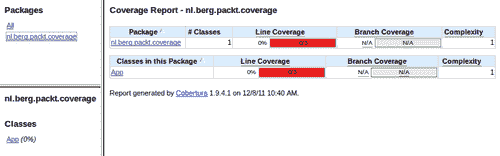
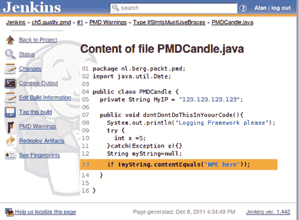
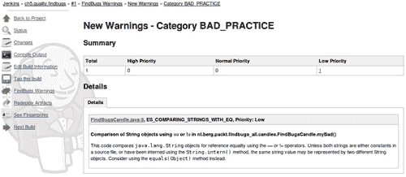
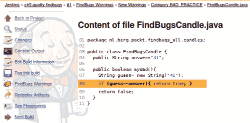
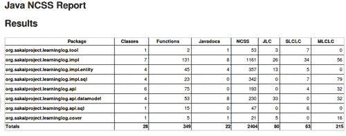

# 五、使用度量来提高质量

在本章中，我们将介绍以下食谱:

*   通过 Sloccount 评估项目的价值
*   通过代码覆盖寻找“臭”代码
*   激活更多 PMD 规则集
*   创建自定义 PMD 规则
*   使用 FindBugs 查找 bug
*   启用额外的 findbugs 规则
*   使用 FindBugs 查找安全缺陷
*   验证 HTML 有效性
*   用 JavaNCSS 报告
*   使用外部 pom.xml 检查样式
*   伪造 checkstyle 结果
*   将Jenkins与声纳集成

### 注

一些构建文件和代码存在故意的错误，例如不良的命名约定、不良的编码结构或特定于平台的编码。这些缺陷的存在是为了给Jenkins一个可以进行射击测试的目标。

# 简介

本章探讨了使用 Jenkins 插件来显示代码度量和失败的构建。自动化降低了成本，有助于一致性。这个过程不会累。如果你在项目开始前决定了成功和失败的标准，那么这将从发布会上消除一定程度的主观争论。

2002 年，NIST 估计软件缺陷每年给美国造成大约 600 亿美元的损失(T0)http://www.abeacha.com/NIST_press_release_bugs_cost.htm，预计此后成本会大幅增加。

为了省钱和提高质量，您需要在软件生命周期中尽早消除缺陷。Jenkins测试自动化创建了一个安全的测量网络。另一个关键的好处是，一旦添加了测试，为其他项目开发类似的测试就变得微不足道了。

Jenkins 在最佳实践中表现良好，例如**测试驱动开发(TDD)** 或**行为驱动开发(BDD)** 。使用 TDD，您首先编写失败的测试，然后构建通过测试所需的功能。使用 BDD，项目团队根据行为编写测试描述。这使得更多的观众可以理解这种描述。更广泛的受众对实现的细节有更大的影响力。

回归测试增加了您在重构软件时没有破坏代码的信心。测试对代码的覆盖越多，信心就越大。食谱*通过代码覆盖率*寻找“臭”*代码向您展示了如何测量覆盖率。您还将通过 PMD 和 FindBugs 找到静态代码审查的方法。**静态**表示不用运行就可以看代码。PMD 查看 `.java`文件中的特定错误模式。使用 PMD 规则设计器编写新的错误检测规则相对容易。 **FindBugs** 扫描编译后的 `.class`文件；您可以直接查看申请 `.jar`文件。FindBugs 规则是准确的，大多指向真实的缺陷。在本章中，您将使用 FindBugs 来搜索安全缺陷，使用 PMD 来搜索违反设计规则的情况。*

本章还提到了具有已知缺陷的 Java 类的使用。我们将使用类来检查测试工具的价值。这是一种类似于病毒检查器基准测试的方法，其中病毒检查器解析具有已知病毒特征的文件。注入已知缺陷的好处是你可以理解违反的规则。这是一个很好的方法，不仅可以收集在你的项目中发现的真实缺陷，还可以表征和重用真实缺陷。考虑将你自己的类添加到项目中，看看质量保证过程是否发现了缺陷。

良好的文档和源代码结构有助于代码的可维护性和可读性。Sun 编码约定在项目之间强制执行一致的标准。在本章中，您将使用 **Checkstyle** 和 **JavaNCSS** 来对照 Sun 编码约定([【http://www.oracle.com/technetwork/java/codeconv-138413.html】](http://www.oracle.com/technetwork/java/codeconv-138413.html))测量您的源代码。

Jenkins插件生成的结果可以通过**违规插件**([https://wiki.jenkins-ci.org/display/JENKINS/Violations](https://wiki.jenkins-ci.org/display/JENKINS/Violations))聚合成一份报告。还有其他插件，特定于给定的工具，例如，PMD 或 FindBugs 插件。这些插件由**分析收集器插件**([https://wiki . JENKINS-ci . org/display/JENKINS/Analysis+收集器+插件](https://wiki.jenkins-ci.org/display/JENKINS/Analysis+Collector+Plugin)支持，该插件将其他报告聚合成一个一致的整体。单个插件报告可以通过 **Portlets 仪表板插件**显示，这在*使用仪表板插件*配方节省屏幕空间、[第 4 章](4.html "Chapter 4. Communicating through Jenkins")、*通过Jenkins*通信中讨论过。

Jenkins 不仅限于测试 Java 许多插件，如 sloccount 或 DRY 插件(发现代码重复)，是语言无关的。在中甚至有对 NUnit 测试的特定支持。NET 或编译成其他语言。如果您缺少特定的功能，那么您可以按照[第 7 章](7.html "Chapter 7. Exploring Plugins")、*探索插件*中的详细描述来构建您自己的 Jenkins 插件。

对软件度量有许多很好的介绍；其中包括一个关于指标细节的维基手册(http://en . wikibooks . org/wiki/Introduction _ to _ Software _ Engineering/Quality/Metrics)。一本写得很好的书是由*迪奥米迪斯·斯宾利斯编写的《代码质量:开源视角》*， **ISBN 0-321-16607-8** 。

在本章的最后一个食谱中，您将把Jenkins项目与声纳报告联系起来。**声纳**是一个专门的工具，它收集软件度量，并将其分解成一个可以理解的报告。声纳详细说明了项目的质量。它使用了广泛的度量标准，包括本章中提到的 FindBugs 和 PMD 等工具的结果。项目本身发展迅速。考虑使用 Jenkins 进行早期预警，并发现明显的缺陷，例如错误的提交。然后，您可以使用声纳进行更深入的审查。

### 类型

当处理多模块 Maven 项目时，Maven 插件会生成一系列结果。Maven 2/3 项目类型严格假设结果存储在常规位置，但这并不总是一致发生的。对于自由式项目，您可以明确地告诉 Jenkins 插件在哪里使用与 Ant 文件集一致的正则表达式找到结果([http://ant.apache.org/manual/Types/fileset.html](http://ant.apache.org/manual/Types/fileset.html))。

# 通过慢账估算项目价值

深入了解项目价值的一种方法是计算项目中代码的行数，并在代码语言之间进行划分。大卫·惠勒博士的 http://www.dwheeler.com/sloccount/命令行工具就是这么做的。

## 做好准备

安装 sloccount 插件([https://wiki . Jenkins-ci . org/display/JENKINS/sloc count+Plugin](https://wiki.jenkins-ci.org/display/JENKINS/SLOCCount+Plugin))。为此食谱代码创建一个新目录。在Jenkins实例上安装 sloccount，如[http://www.dwheeler.com/sloccount](http://www.dwheeler.com/sloccount)中所述。如果您运行在 Debian 操作系统上，以下安装命令将会工作:

```
sudo apt-get install sloccount

```

有关如何在其他系统上安装 sloccount 的详细信息，请查看[http://www.dwheeler.com/sloccount/sloccount.html](http://www.dwheeler.com/sloccount/sloccount.html)。

## 怎么做...

1.  创建一个命名为 `ch5.quality.sloccount`的自由式项目，并添加以下代码:

    ```
    <h2>SLOCCOUNT REPORT Project</h2>
    <h3>Compared to wider Sakai project</h3>
    <script type="text/javascript" src =http://www.ohloh.net/p/3551/widgets/project_languages.js>
    </script>

    ```

2.  在**源代码管理**部分，勾选**颠覆**，添加**存储库网址:[https://source.sakaiproject.org/svn/shortenedurl/主干。](https://source.sakaiproject.org/svn/shortenedurl/%20trunk.)**
3.  在**构建**部分，从**添加构建步骤**中选择**执行 shell** 。添加以下命令:

    ```
    /usr/bin/sloccount -duplicates -wide -details . >./sloccount.sc

    ```

4.  在**后期构建操作**部分，勾选**发布结算分析结果**，将 `sloccount.sc`添加到文本输入**结算报告**中。
5.  点击**保存**。
6.  Run the job, and review the details.

    

## 它是如何工作的...

这个方法引入了现实的代码，一个基于 Java 的服务，可以生成缩短的网址([https://confluence.sakaiproject.org/display/SHRTURL](https://confluence.sakaiproject.org/display/SHRTURL))。Jenkins插件将 sloccount 生成的结果转换成详细信息。该报告分为三个选项卡式表格，按文件、文件夹和语言进行汇总和排序。根据这些信息，您可以估计从头开始重新创建项目所需的工作量。

该作业的描述包括少量指向 Ohloh.net 的 JavaScript，这是一个可信的第三方服务。 **Ohloh** 允许你添加带有统计数据的小部件到你的网页。Ohloh 是一个众所周知的服务，有很好的隐私规则([http://www.ohloh.net/about/privacy](http://www.ohloh.net/about/privacy))。但是，如果您不完全信任第三方服务的声誉，那么就不要通过 Jenkins 描述来链接。


关于酒井学习管理系统的信息可以通过访问[http://www.ohloh.net/p/3551](http://www.ohloh.net/p/3551)找到。 `shortenedURL`服务只是这个整体的一小部分。综合统计数据可以让游客更好地了解更广泛的背景。

## 还有更多...

这里还有一些细节需要考虑。

### 软件成本估算

Sloccount 使用 **COCOMO 模型**([http://en.wikipedia.org/wiki/COCOMO](http://en.wikipedia.org/wiki/COCOMO))估算项目成本。您不会在 Jenkins 报告中看到这一点，但是如果您从命令行运行 sloccount，则可以生成估计成本。

成本估算为 `effort * personcost * overhead`。

随时间变化最大的元素是 `personcost`(以美元计)。您可以使用命令行参数 `personcost`更改该值。

### 再见谷歌代码搜索，你好 Koders.com

谷歌宣布关闭其源代码搜索引擎。幸运的是，koders.com，另一个可行的搜索引擎，宣布它将提供 ohloh.net 描述的代码库的覆盖范围。在 koders.com 和 ohloh.net 之间，您将能够查看大量的开源项目。

## 另见

*   *通过谷歌分析了解你的受众*[第四章](4.html "Chapter 4. Communicating through Jenkins")*通过Jenkins*交流

# 通过代码覆盖寻找“臭”代码

这个配方使用**Cobertura**([http://cobertura.sourceforge.net/](http://cobertura.sourceforge.net/))来查找单元测试没有覆盖的代码。

通过一致的实践，编写单元测试将变得和向 `stdout`写入调试信息一样困难。大多数流行的特定于 Java 的 IDE 都内置了对运行单元测试的支持。Maven 运行它们作为测试目标的一部分。如果您的代码没有回归测试，那么在重构过程中，代码更有可能崩溃。测量代码覆盖率可以用来搜索未测试代码的热点。

更多信息可以查看[http://on Java . com/on Java/2007/03/02/statement-branch-and-path-coverage-testing-in-Java . html](http://onjava.com/onjava/2007/03/02/statement-branch-and-path-coverage-testing-in-java.html)。

## 做好准备

安装 Cobertura 代码覆盖率插件([https://wiki . Jenkins-ci . org/display/JENKINS/Cobertura+Plugin](https://wiki.jenkins-ci.org/display/JENKINS/Cobertura+Plugin))。

## 怎么做...

1.  使用以下命令生成模板项目:

    ```
    mvn archetype:generate -DgroupId=nl.berg.packt.coverage -DartifactId=coverage -DarchetypeArtifactId=maven-archetype-quickstart -Dversion=1.0-SNAPSHOT

    ```

2.  使用以下命令测试未修改项目的代码覆盖率:

    ```
    mvn clean cobertura:cobertura

    ```

3.  Review the output from Maven, and it will look similar to the following:

    **-**

    **T E S T S**

    **-**

    **正在运行 nl.berg.packt.coverage.AppTest 测试运行:1，失败:0，错误:0，跳过:0，经过时间:0.036 秒结果:测试运行:1，失败:0，错误:0，跳过:0[INFO][cobertura:Cobertura { execution:default-CLI }][INFO]Cobertura 1.9.4.1-GNU GPL License(无保修)Cobertura:加载了 1 个类的信息。报告时间:107 毫秒[INFO] Cobertura 报告生成成功。**

4.  In a web browser, view `/target/site/cobertura/index.html`. Notice that there is no code coverage.

    

5.  `src/main/java/nl/berg/packt/coverage/Dicey.java:`

    ```
    package nl.berg.packt.coverage;
    import java.util.Random;
    public class Dicey {
    private Random generator;
    public Dicey(){
    this.generator = new Random();
    throwDice();
    }
    private int throwDice() {
    int value = generator.nextInt(6) + 1;
    if (value > 3){
    System.out.println("Dice > 3");
    }else{
    System.out.println("Dice < 4");
    }
    return value;
    }
    }

    ```

    增加以下内容
6.  通过将 `testApp()`方法更改为以下内容，修改 `src/test/java/nl/berg/packt/coverage/AppTest.java`以实例化新的 Dicey 对象:

    ```
    Public void testApp(){
    new Dicey();
    assertTrue( true );
    }

    ```

7.  使用以下命令测试 JUnit 测试的代码覆盖率:

    ```
    mvn clean cobertura:cobertura

    ```

8.  Review the Maven output, noticing that `println` from within the Dicey constructor is also included.

    **-T E S T S-Running nl . Berg . packkt . coverage . apptest 骰子< 4 次测试运行:1 次，失败:0 次，错误:0 次，跳过:0 次，经过时间:0.033 秒**

9.  In a web browser, view `/target/site/cobertura/index.html`. Your project now has the code coverage, and you can see which lines of code have not yet been called.

    

10.  将以下构建部分添加到您的 `pom.xml:`

    ```
    <build>
    <plugins>
    <plugin>
    <groupId>org.codehaus.mojo</groupId>
    <artifactId>cobertura-maven-plugin</artifactId>
    <version>2.5.1</version>
    <configuration>
    <formats>
    <format>xml</format>
    <format>html</format>
    </formats>
    </configuration>
    </plugin>
    </plugins>
    </build>

    ```

11.  使用以下命令测试 JUnit 测试的代码覆盖率:

    ```
    mvn clean cobertura:cobertura

    ```

12.  访问 `target/site/cobertura`位置，注意结果现在也存储在 `coverage.xml`中。
13.  运行 `mvn clean`删除目标目录。
14.  将 Maven 项目添加到您的 subversion 存储库中。
15.  创建一个新的自由式Jenkins工作名为 `ch5.quality.coverage`。
16.  在**源代码管理**部分，勾选 **Subversion** ，为**资源库 URL** 添加您的 Subversion 资源库位置。
17.  在**目标和选项**的**构建**部分下，将值设置为 clean cobertura: cobertura。
18.  在**后期构建操作**部分，勾选**发布 Cobertura 覆盖报告**，为 **Cobertura xml 报告模式**输入添加 `**/target/site/cobertura/coverage.xml`。
19.  点击**保存**。
20.  构建作业两次；这将产生一种趋势。查看结果。

## 它是如何工作的...

Cobertura 在编译过程中检测 Java 字节码。Maven 插件生成 HTML 和 XML 报告。 **HTML 报告**允许您从命令行快速查看代码状态。Jenkins插件解析需要 **XML 报告**。

您已经将插件配置放在了构建部分而不是报告部分，以避免运行带有额外阶段的站点目标。

使用了自由风格的项目，使得 cobertura 插件可以获得多个 XML 报告。这是由模式 `fileset **/target/site/cobertura/coverage.xml`定义的，该模式规定工作区下任何 `target/site/cobertura`目录下的任何名为 `coverage.xml`的报告都将被处理。

马文跑了 `clean cobertura:cobertura`。 `clean`目标是删除所有目标目录，包括任何先前编译和检测的代码。 `cobertura:cobertura`目标编译和测试代码，运行单元测试，并生成报告。

`testApp`单元测试调用 Dicey 类的构造函数。构造器随机生成一个从 `1`到 `6`的数字。这模拟了骰子，并在 `if`语句的两个分支之间进行选择。cobertura 报告允许您放大源代码并发现做出了哪个选择。这份报告有助于发现遗漏的测试。如果您重构代码，当代码意外地改变行为时，您将无法在这些区域中发现单元测试。该报告还善于发现比周围环境更复杂的代码。代码越复杂越难理解，越容易引入错误([http://www . IBM . com/developer works/Java/library/j-CQ 01316/index . html？ca=drs](http://www.ibm.com/developerworks/java/library/j-cq01316/index.html?ca=drs) )。

## 还有更多...

科伯图拉的另一个开源工具是**艾玛:**[http://emma.sourceforge.net](http://emma.sourceforge.net)。艾玛也有一个相关的Jenkins插件:[https://wiki.jenkins-ci.org/display/JENKINS/Emma+Plugin](https://wiki.jenkins-ci.org/display/JENKINS/Emma+Plugin)。在 Maven 中，您不必向 `pom.xml`添加任何配置。你只需要运行目标 `clean emma:emma package`，并将Jenkins插件指向结果。

# 激活更多 PMD 规则集

PMD 有捕捉特定虫子的规则。它将这些规则打包成**规则集**。例如，有一个规则集的主题是安卓为代码大小或设计编写另一个规则集。默认情况下，测量三个无争议的 PMD 规则集:

*   **基本:**每个开发人员都应该遵循的显而易见的实践，例如不要忽视被抓住的异常
*   **未使用的代码:**找到从未使用过的代码行，可以消除，避免浪费，提高可读性
*   **进口:**发现不必要的进口

这个食谱告诉你如何启用更多的规则。主要的风险是额外的规则会产生大量的误报，使得很难看到真正的缺陷。这样做的好处是，你可以捕捉到更大范围的缺陷，其中一些如果投入生产，成本会很高。

## 做好准备

安装Jenkins PMD 插件([https://wiki.jenkins-ci.org/display/JENKINS/PMD+Plugin](https://wiki.jenkins-ci.org/display/JENKINS/PMD+Plugin))。

## 怎么做...

1.  使用以下命令生成模板项目:

    ```
    mvn archetype:generate -DgroupId=nl.berg.packt.pmd -DartifactId=pmd -DarchetypeArtifactId=maven-archetype-quickstart -Dversion=1.0-SNAPSHOT

    ```

2.  添加 Java 类 `src/main/java/nl/berg/packt/pmd/PMDCandle.java`，内容如下:

    ```
    package nl.berg.packt.pmd;
    import java.util.Date;
    public class PMDCandle {
    private String MyIP = "123.123.123.123";
    public void dontDontDoThisInYoourCode(){
    System.out.println("Logging Framework please");
    try {
    int x =5;
    }catch(Exception e){}
    String myString=null;
    if (myString.contentEquals("NPE here"));
    }
    }

    ```

3.  使用以下命令测试您未修改的项目:

    ```
    mvn clean pmd:pmd Review the directory target, and you will notice the results basic.xml, imports.xml, unusedcode.xml, and the aggregated results pmd.xml.

    ```

4.  在网络浏览器中查看 `target/site/pmd.html`文件。
5.  将以下报告部分添加到您的 `pom.xml:`

    ```
    <reporting>
    <plugins>
    <plugin>
    <groupId>org.apache.maven.plugins</groupId>
    <artifactId>maven-jxr-plugin</artifactId>
    <version>2.1</version>
    </plugin>
    <plugin>
    <groupId>org.apache.maven.plugins</groupId>
    <artifactId>maven-pmd-plugin</artifactId>
    <version>2.6</version>
    <configuration>
    <targetJdk>1.5</targetJdk>
    <format>xml</format>
    <linkXref>true</linkXref>
    <minimumTokens>100</minimumTokens>
    <rulesets>
    <ruleset>/rulesets/basic.xml</ruleset>
    <ruleset>/rulesets/braces.xml</ruleset>
    <ruleset>/rulesets/imports.xml</ruleset>
    <ruleset>/rulesets/logging-java.xml</ruleset>
    <ruleset>/rulesets/naming.xml</ruleset>
    <ruleset>/rulesets/optimizations.xml</ruleset>
    <ruleset>/rulesets/strings.xml</ruleset>
    <ruleset>/rulesets/sunsecure.xml</ruleset>
    <ruleset>/rulesets/unusedcode.xml</ruleset>
    </rulesets>
    </configuration>
    </plugin>
    </plugins>
    </reporting>

    ```

6.  使用以下命令测试您的项目:

    ```
    mvn clean site

    ```

7.  在网络浏览器中查看 `target/site/pmd.htm`文件，注意现在已经发现了额外的违规。这是由于 `pom.xml`增加了额外的规则。
8.  运行 `mvn clean`删除目标目录。
9.  将源代码添加到您的 subversion 存储库中。
10.  创建一个名为 `ch5.quality.pmd`的新 Maven 2/3 Jenkins 作业
11.  在**源代码管理**部分，勾选 **Subversion** ，为**资源库 URL** 添加您的 Subversion 资源库位置。
12.  在**构建**目标和选项**的**部分，将该值设置为 `clean site`。
13.  在**构建设置**部分，勾选**发布 PMD 分析结果**。
14.  点击**保存**。
15.  To generate a trend, you will need to run the Job twice. Afterwards, review the results.

    

## 它是如何工作的...

Maven PMD 插件测试了广泛的规则集。通过从 PMD 网站下载二进制包，你可以通过列出 `pmd.jar`文件的内容找到规则集的路径。在 `*NIX`系统下，这样做的命令是:

```
unzip -l pmd-version.jar | grep rulesets

```

您已经添加了一个标准的蜡烛，一个已知缺陷会触发 PMD 警告的 Java 类。例如，以下两行代码中有多个缺陷:

```
String myString=null;
if (myString.contentEquals("NPE here"));

```

最显著的缺陷是，Java 程序员需要将文字放在第一位，以避免出现 `NullPointerException`，例如:

```
"NPE here".contentEquals(myString)

```

当 `myString`为 `null`时，首先放置文字返回 `false`。 `if`语句周围缺少括号是一个问题。当 `if`语句被触发时，缺少要运行的命令也是如此。

另一个微不足道的例子是将基础设施细节硬编码到您的源代码中；例如，密码、IP 地址和用户名。将细节移出到只驻留在部署服务器上的属性文件中要好得多。下面一行测试 PMD 发现这种缺陷的能力:

```
private String MyIP = "123.123.123.123";

```

FindBugs 和 PMD 都有自己的一套 bug 模式检测器。两者都无法捕捉到所有的缺陷。因此，运行这两个工具来捕获最大范围的缺陷是值得的。要查看这两款产品，请访问[http://www . freesoftware magazine . com/articles/destroy _ 恼人 _ bug _ part _ 1](http://www.freesoftwaremagazine.com/articles/destroy_annoying_bugs_part_1)。

其他几个您可能感兴趣的静态代码审查工具是**QJPro**([http://qjpro.sourceforge.net/](http://qjpro.sourceforge.net/))和**Jlint**([http://jlint.sourceforge.net/](http://jlint.sourceforge.net/))。

## 还有更多...

开箱即用，PMD 测试了一组合理的 bug 缺陷，然而，每个项目都是不同的，你需要调整。

### 抑制 PMD 规则集

你可以在[http://pmd.sourceforge.net/rules/index.html](http://pmd.sourceforge.net/rules/index.html)找到当前的 PMD 规则集。

理解规则集的含义，并将 Maven 配置塑造为只包含有用的规则集，这一点很重要。如果你不这样做，那么对于一个中型项目来说，报告将包括成千上万的违规行为，隐藏真正的缺陷。然后，该报告将需要时间在您的网络浏览器中呈现。仅当您希望使用量作为项目成熟度的指标时，才考虑启用一长串规则。

为了抑制，排除部分代码，并系统地清理报告的区域。

### 不重复自己的原则

剪切粘贴式编程、克隆、然后修改代码会成为重构的噩梦。如果代码没有被正确封装，那么很容易在代码库中出现稍微不同的片段。如果你想去除已知的缺陷，那就需要额外的努力。

PMD 支持**不要重复自己(DRY)** 的原则，找到重复的代码。触发点通过 `minimumTokens`标签配置。但是，PMD 插件不获取结果(存储在 `cpd.xml)`中)。您将需要安装和配置 DRY 插件([https://wiki.jenkins-ci.org/display/JENKINS/DRY+Plugin](https://wiki.jenkins-ci.org/display/JENKINS/DRY+Plugin))或违例Jenkins插件。

### 注

如果你已经从 PMD 二进制文件的网站([http://sourceforge.net/projects/pmd/files/pmd/](http://sourceforge.net/projects/pmd/files/pmd/))下载了该文件，那么在 `bin`目录中的就是 `cpdgui`。这是一个 Java swing 应用程序，允许您探索源代码是否存在重复。

## 另见

*   *创建自定义 PMD 规则*

# 创建自定义 PMD 规则

与其他静态代码审查工具相比，PMD 有两个额外的特性。第一个是 `cpdgui`工具，它允许你寻找已经从代码库的一部分剪切粘贴到另一部分的代码。第二个，也是我们将在本食谱中探讨的一个，是使用 Xpath 为 Java 源代码设计定制 bug 发现规则的能力。

## 做好准备

确保您已经安装了Jenkins PMD 插件([https://wiki.jenkins-ci.org/display/JENKINS/PMD+Plugin](https://wiki.jenkins-ci.org/display/JENKINS/PMD+Plugin))。从[http://pmd.sourceforge.net](http://pmd.sourceforge.net)下载并解压 PMD 发行版。访问 PMD bin 目录，确认您有启动脚本 `designer.sh`和 `designer.bat`。

## 怎么做...

1.  使用以下命令从命令行创建一个 Maven 项目:

    ```
    mvn archetype:generate -DgroupId=nl.berg.packt.pmdrule -DartifactId=pmd_design -DarchetypeArtifactId=maven-archetype-quickstart -Dversion=1.0-SNAPSHOT

    ```

2.  在`</project>`标签前的 `pom.xml`中，添加一个报告部分，内容如下:

    ```
    <reporting>
    <plugins>
    <plugin>
    <groupId>org.apache.maven.plugins</groupId>
    <artifactId>maven-jxr-plugin</artifactId>
    <version>2.1</version>
    </plugin>
    <plugin>
    <groupId>org.apache.maven.plugins</groupId>
    <artifactId>maven-pmd-plugin</artifactId>
    <version>2.6</version>
    <configuration>
    <targetJdk>1.6</targetJdk>
    <format>xml</format>
    <rulesets>
    <ruleset>password_ruleset.xml</ruleset>
    </rulesets>
    </configuration>
    </plugin>
    </plugins>
    </reporting>

    ```

3.  在顶层目录中，创建文件 `password_ruleset.xml`，内容为:

    ```
    <?xml version="1.0"?>
    <ruleset name="STUPID PASSWORDS ruleset"  xmlns:xsi="http://www.w3.org/2001/XMLSchema-instance" xsi:schemaLocation="http://pmd.sf.net/ruleset/1.0.0 http://pmd.sf.net/ruleset_xml_schema.xsd" xsi:noNamespaceSchemaLocation= "http://pmd.sf.net/ruleset_xml_schema.xsd">
    <description>
    Lets find stupid password examples
    </description>
    </ruleset>

    ```

4.  编辑 `src/main/java/nl/berg/packt/pmdrule/App.java`，这样主要方法是:

    ```
    public static void main( String[] args )
    {
    System.out.println( "Hello World!" );
    String PASSWORD="secret";
    }

    ```

5.  根据您的操作系统，使用启动脚本 `bin/designer.sh`或 `bin/designer.bat`运行 `pmd designer`。
6.  点击屏幕左上方的 **JDK** 选项，选择 **JDK 1.6** 作为 **Java 版本**。
7.  在**源代码**文本区域，添加您想要测试的示例代码。本例中:

    ```
    public class RuleTest {
    static final String PASSWORD="secret";
    }

    ```

8.  对于**查询** `(if any)`文本区添加:

    ```
    //VariableDeclaratorId[@Image='PASSWORD']

    ```

9.  Click on **Go**. You will now see the result **ASTVariableDeclarorID** at *line 2 column 20*.

    

10.  在屏幕顶部的**动作**菜单选项下，选择**创建规则 XML** ，并添加以下值:
    *   **规则名称:** `No Password`
    *   **规则消息:** `If we see a PASSWORD we should flag`
    *   **统治 desc:** `Let's find stupid password examples`
11.  Click on **Create rule XML**. The generated XML should have a fragment similar to the following:

    ```
    <rule name="NO_PASSWORD"
    message="If we see a PASSWORD we should flag"
    class="net.sourceforge.pmd.rules.XPathRule">
    <description>
    If we see a PASSWORD we should flag
    </description>
    <properties>
    <property name="xpath">
    <value>
    <![CDAT[
    //VariableDeclaratorId[@Image='PASSWORD']
    ]]>
    </value>
    </property>
    </properties>
    <priority>3</priority>
    <example>
    <![CDAT[
    public class RuleTest {
    static final String PASSWORD="secret";
    }
    ]]>
    </example>
    </rule>

    ```

    

12.  将生成的代码复制粘贴到`</ruleset>`之前的 `password_ruleset.xml`中。
13.  将项目提交到您的 subversion 存储库中。
14.  在Jenkins中，创建一个名为 `ch5.quality.pmdrule`的 Maven 2/3 作业。
15.  在**源代码管理**部分，勾选 **Subversion** ，为**资源库 URL** 添加您的 Subversion 资源库位置。
16.  在**构建**目标和选项**的**部分，将该值设置为 `clean pmd:pmd`。
17.  在**构建设置**部分，勾选**发布 PMD 分析结果**。
18.  点击**保存**。
19.  运行作业。
20.  查看 **PMD 警告**链接。

## 它是如何工作的...

PMD 分析了源代码，并将其分解为元数据，称为**抽象语法树(AST)**-[http://onjava . com/pub/a/onjava/2003/02/12/static _ analysis . html](http://onjava.com/pub/a/onjava/2003/02/12/static_analysis.html)。PMD 能够使用 Xpath 规则在 AST 中搜索模式。 **w3schools** 提供了对 Xpath([http://www.w3schools.com/xpath/](http://www.w3schools.com/xpath/))的温和介绍。**设计工具**使您能够编写 Xpath 规则，并根据源代码示例测试您的规则。为了可读性，重要的是您测试的源代码只包含基本的细节。然后将规则存储在 XML 中。

要将 XML 规则捆绑在一起，您必须将规则添加为`<ruleset>`标记的一部分。

Maven PMD 插件能够从其类路径、本地文件系统或通过远程服务器的 `http`协议读取规则集。您通过添加配置选项添加了规则集。

```
<ruleset>password_ruleset.xml</ruleset>

```

如果你建立了一套规则，那么你应该把所有的规则整合到一个项目中，以便于管理。

您还可以基于已经存在的规则创建自己的自定义规则集，拉出您最喜欢的错误检测模式。这是通过用指向已知规则的 `ref`标记`<rule>`来实现的；例如，下面从 `imports.xml ruleset:`中拉出 `DuplicateImports`规则

```
<rule ref="rulesets/imports.xml/DuplicateImports"/>

```

该配方中生成的规则测试了名为 `PASSWORD`的变量。在实际项目中，我已经多次看到该规则触发。

PMD 主页是了解 Xpath 规则的一个很好的地方。它包含规则集的描述和细节；例如，对于日志记录规则，查看[http://pmd.sourceforge.net/rules/logging-java.html](http://pmd.sourceforge.net/rules/logging-java.html)。

## 还有更多...

如果静态代码审查工具能够就如何修复代码提出建议，那将是非常有效的。然而，这有点危险，因为探测器并不总是准确的。作为一个实验，我编写了一个小的 Perl 脚本来首先修复文字，并丢弃一些资源浪费。代码是“概念证明”，因此不能保证正确工作。它的优点是简洁，看

[https://source . sakaiproject . org/contrib/QA/trunk/static/clean up/easy _ wins _ find _ Java . pl](http://https://source.sakaiproject.org/contrib/qa/trunk/static/cleanup/easy_wins_find_java.pl)。

## 另见

*   *激活更多 PMD 规则集*

# 用 FindBugs 寻找 bug

很容易迷失在静态代码审查工具发现的大量缺陷中。另一种质量保证攻击模式是逐个包地清除缺陷，将开发人员的时间集中在最常用的特性上。

这个配方将向您展示如何为特定的包生成和报告由 FindBugs 发现的缺陷。

## 做好准备

安装Jenkins FindBugs 插件([https://wiki.jenkins-ci.org/display/JENKINS/FindBugs+Plugin](https://wiki.jenkins-ci.org/display/JENKINS/FindBugs+Plugin))。

## 怎么做...

1.  从命令行，创建一个 Maven 项目:

    ```
    mvn archetype:generate -DgroupId=nl.berg.packt.FindBugs_all -DartifactId=FindBugs_all -DarchetypeArtifactId=maven-archetype-quickstart -Dversion=1.0-SNAPSHOT

    ```

2.  在 `pom.xml`中，在`</project>`标签前添加一个构建部分，内容如下:

    ```
    <build>
    <plugins>
    <plugin>
    <groupId>org.codehaus.mojo</groupId>
    <artifactId>FindBugs-maven-plugin</artifactId>
    <version>2.3.3</version>
    <configuration>
    <FindBugsXmlOutput>true</FindBugsXmlOutput>
    <FindBugsXmlWithMessages>true</FindBugsXmlWithMessages>
    <onlyAnalyze>
    nl.berg.packt.FindBugs_all.candles.*
    </onlyAnalyze>
    <effort>Max</effort>
    </configuration>
    </plugin>
    </plugins>
    </build>

    ```

3.  创建目录 `src/main/java/nl/berg/packt/FindBugs_all/candles`。
4.  蜡烛目录中包含 `FindBugsCandle.java`，内容如下:

    ```
    package nl.berg.packt.FindBugs_all.candles;
    public class FindBugsCandle {
    public String answer="41";
    public boolean myBad(){
    String guess= new String("41");
    if (guess==answer){ return true; }
    return false;
    }
    }

    ```

5.  创建一个名为 `ch5.quality.FindBugs`的自由风格项目。
6.  在**源代码管理**部分，勾选 **Subversion** 单选框，添加 `Your Repository URL`到**存储库网址**。
7.  在**构建**目标和选项**的**部分，将该值设置为 `clean compile findBugs:findBugs`。
8.  在**构建设置**部分，勾选**发布 FindBugs 分析结果**。
9.  点击**保存**。
10.  运行作业。
11.  Review the results.

    

FindBugs 报告的一个便利特性是，对于每个警告，您都可以查看违规代码。



## 它是如何工作的...

在这个食谱中，您已经创建了一个标准的 Maven 项目，并添加了一个已知缺陷的 Java 文件。

`pom.xml`配置强制 `FindBugs`仅报告 `nl.berg.packt.FindBugs_all.candles`包中的类的缺陷。

带有 `guess==answer`的标准蜡烛线是典型的编程缺陷。正在比较两个对对象的引用，而不是它们的字符串值。由于猜测对象是在前一行创建的，因此结果将始终是 `false`。这些缺陷在程序中可能会表现为微妙的问题。JVM 缓存字符串，有时两个明显不同的对象实际上是同一个对象。

## 还有更多...

FindBugs 在开发人员中很受欢迎，并为许多流行的 IDEs 提供插件。其结果经常被其他工具用作更广泛报告的一部分。

### FindBugs Eclipse 插件

Eclipse 插件的自动安装位置是[http://findbugs.cs.umd.edu/eclipse](http://findbugs.cs.umd.edu/eclipse)。

默认情况下，FindBugs Eclipse 插件启用了有限数量的规则。要增加测试集，您需要进入**窗口**下的**首选项**菜单选项，从左侧菜单中选择**查找 bug**。在右侧，您将看到**报告器配置**下的**报告(可见)bug 类别**。现在，您可以调整可见的类别。


### Xradar 和 Maven 仪表盘

有替代的 Maven 插件仪表板来积累生成的软件度量。Maven 仪表盘就是一个例子([http://mojo.codehaus.org/dashboard-maven-plugin/](http://mojo.codehaus.org/dashboard-maven-plugin/))。您需要将其连接到自己的数据库。在*阿帕奇 Maven 3 烹饪书，Srirangan，Packt Publishing*([http://www.packtpub.com/apache-maven-3-0-cookbook](http://www.packtpub.com/apache-maven-3-0-cookbook))、*设置 Maven 仪表盘*、[第 4 章](4.html "Chapter 4. Communicating through Jenkins")、*报告和文档*中有一个食谱。

**Xradar** 和 **QALab** 是仪表板的其他例子，可以说没有那么受欢迎。([http://xradar.sourceforge.net/usage/maven-plugin/howto.html](http://xradar.sourceforge.net/usage/maven-plugin/howto.html)、[http://qalab . SourceForge . net/multi project/maven 2-qalab-plugin/index . html)](http://qalab.sourceforge.net/multiproject/maven2-qalab-plugin/index.html))。

## 另见

*   *启用额外的 FindBugs 规则*
*   *用 FindBugs 发现安全缺陷*
*   *激活更多 PMD 规则集*

# 启用额外的 FindBugs 规则

FindBugs 有广泛的辅助 bug 模式检测器。这些探测器被捆绑到一个位于**SourceForge**([http://sourceforge.net/projects/fb-contrib/](http://sourceforge.net/projects/fb-contrib/))的投稿人项目中。

本食谱详细介绍了如何将额外的 bug 检测器添加到 `fb-contrib`项目的 FindBugs 中，并使用检测器捕获已知的缺陷。

## 做好准备

假设你已经按照之前的食谱，*用 FindBugs* 寻找 bug。您将使用配方的 Maven 项目作为起点。

## 怎么做...

1.  将顶层 `pom.xml`配置复制到 `pom_fb.xml`。
2.  将 `pom_fb.xml`的`<plugin>`部分替换为以下内容:

    ```
    <plugin>
    <groupId>org.codehaus.mojo</groupId>
    <artifactId>FindBugs-maven-plugin</artifactId>
    <version>2.3.3</version>
    <configuration>
    <FindBugsXmlOutput>false</FindBugsXmlOutput>
    <FindBugsXmlWithMessages>true</FindBugsXmlWithMessages>
    <onlyAnalyze>
    nl.berg.packt.FindBugs_all.candles.*
    </onlyAnalyze>
    <pluginList>
    http://downloads.sourceforge.net/project/ fb-contrib/Current/fb-contrib-4.6.1.jar
    </pluginList>
    <effort>Max</effort>
    </configuration>
    </plugin>

    ```

3.  在 `src/main/java/nl/berg/packt/fingbugs_all/candles`目录中，添加 Java 类 `FindBugsFBCandle.java`，内容如下:

    ```
    package nl.berg.packt.FindBugs_all.candles;
    public class FindBugsFBCandle {
    public String FBexample(){
    String answer="This is the answer";
    return answer;
    }
    }

    ```

4.  将更新提交到您的 subversion 存储库中。
5.  创建一个名为 `ch5.quality.FindBugs.fb`的Jenkins马文 2/3 作业。
6.  在**源代码管理**部分，选中 **Subversion** 单选框，将**存储库 URL** 的 URL 添加到您的代码中。
7.  在**构建**部分，设置以下内容:
    *   **根 POM:** `pom_fb.xml`
    *   **目标和选项:** `clean compile findbugs:findbugs` >
8.  在**构建设置**部分，勾选**发布 FindBugs 分析结果**。
9.  点击**保存**。
10.  运行作业。
11.  作业完成后，查看**查找 bug 警告**链接。你现在会看到一个新的警告:

    ```
    USBR_UNNECESSARY_STORE_BEFORE_RETURN

    ```

## 还有更多...

Java 语言有许多微妙的边界情况，除非用真实的例子来解释，否则很难理解。获取知识的一个很好的方法是，当你在代码中看到问题时，自己写例子。注入标准蜡烛是测试团队知识的自然方式，有助于质量保证过程中的目标实践。

`FindBugs`项目根据 *Java 谜题人约书亚·布洛赫*和*尼尔·加福特*([http://www.javapuzzlers.com/](http://www.javapuzzlers.com/))的内容生成了他们的一些探测器。

## 它是如何工作的...

为了包含外部检测器，您在 FindBugs 的 Maven 配置中增加了一行代码:

```
<pluginList>
http://downloads.sourceforge.net/project/fb-contrib/Current/ fb-contrib-4.6.1.jar
</pluginList>

```

值得去 SourceForge 看看最新版本的探测器。

目前，不可能使用 Maven 的依赖关系管理从存储库中引入检测器，尽管这可能会改变。

在这个食谱中，您添加了一个 Java 类来触发新的错误检测规则。反模式是返回之前创建答案对象的不必要的行。匿名返回对象更简洁，例如:

```
Return "This is the answer";

```

蚂蚁模式触发 `USBR_UNNECESSARY_STORE_BEFORE_RETURN`模式，这在 `fb-contrib`项目的主页上有描述。

## 另见

*   *用 FindBugs 寻找 bugs】*
*   *用 FindBugs 发现安全缺陷*
*   *激活更多 PMD 规则集*

# 用 FindBugs 发现安全缺陷

在本食谱中，您将使用 FindBugs 来发现一个 Java 服务器页面中的安全缺陷和一个有缺陷的 Java 类中的一些安全缺陷。

## 做好准备

要么按照基于 JSP 语法错误、[第三章](3.html "Chapter 3. Building Software")、*构建软件*的方法*让Jenkins·乔布斯失败，要么使用可从 Packt 网站下载的提供的项目。*

## 怎么做...

1.  编辑 `pom.xml`只需将`<build>`中的`<plugins>`替换为 `FindBugs`插件，添加以下内容:

    ```
    <plugins>
    <plugin>
    <groupId>org.codehaus.mojo</groupId>
    <artifactId>findBugs-maven-plugin</artifactId>
    <version>2.3.3</version>
    <configuration>
    <FindBugsXmlOutput>true</FindBugsXmlOutput>
    <FindBugsXmlWithMessages>true</FindBugsXmlWithMessages>
    <effort>Max</effort>
    </configuration>
    </plugin>
    </plugins>

    ```

2.  创建目录结构 `src/main/java/nl/berg/packt/finbugs_all/candles`。
3.  添加 Java 文件 `FindBugsSecurity.java`，内容如下:

    ```
    package nl.berg.packt.FindBugs_all.candles;
    public class FindBugsSecurityCandle {
    private final String[] permissions={"Read", "SEARCH"};
    private void infiniteLoop(int loops){
    infiniteLoop(99);
    }
    public String[] exposure(){
    return permissions;
    }
    public static void main(String[] args) {
    String[] myPermissions = new FindBugsSecurityCandle().exposure();
    myPermissions[0]="READ/WRITE";
    System.out.println(myPermissions[0]);
    }
    }

    ```

4.  将更新提交到您的 subversion 存储库中。
5.  创建一个名为 `ch5.quality.FindBugs.security`的 Maven 2/3 Jenkins 作业。
6.  在**源代码管理**部分，勾选 **Subversion** 单选框，在**资源库 URL** 文本输入中添加您的 Subversion 资源库位置。
7.  在**构建**目标和选项**的**部分下方，将该值设置为 `clean package findbugs:findbugs`。
8.  点击**保存**。
9.  运行作业。
10.  作业完成后，查看链接**查找 bug 警告**。请注意，JSP 包存在，但对 `XSS_REQUEST_PARAMETER_TO_JSP_WRITER`有一个警告。但是，该链接无法找到源代码的位置。
11.  复制 `src/main/webapp/index.jsp`到 `jsp/jsp.index_jsp`。
12.  提交到您的 subversion 存储库中。
13.  再次运行作业。
14.  在**查找 bug 警告**链接下查看结果。现在，您将能够查看 JSP 源代码。

## 它是如何工作的...

JSP 首先从文本翻译成 Java 源代码，然后编译。FindBugs 通过解析编译后的 Java 字节码来工作。

最初的 JSP 项目有一个巨大的安全缺陷——它信任来自互联网的输入。这导致了许多攻击媒介，包括 **XSS 攻击**([http://en.wikipedia.org/wiki/Cross-site_scripting](http://en.wikipedia.org/wiki/Cross-site_scripting))。用允许令牌的白名单解析输入是降低风险的一种方法。FindBugs 发现缺陷并用 `XSS_REQUEST_PARAMETER_TO_JSP_WRITER`警告。Jenkins查找 bug 插件详细说明了 bug 的类型。显示这些消息是因为您在配置中使用以下选项打开了它们:

```
<FindBugsXmlWithMessages>true</FindBugsXmlWithMessages>

```

没有实现 FindBugs 插件来理解 JSP 文件的位置。当点击一个源代码的链接时，插件会看错地方。一个临时的解决方案是将 JSP 文件复制到 Jenkins 插件期望的位置。

FindBugs 报告的行号位置也没有意义。它是指向从 `.jsp`文件生成的 `.java`文件中的行，而不是直接指向 JSP 文件。尽管有这些限制，FindBugs 还是发现了关于 JSP 缺陷的有用信息。

### 注

JSP 错误检测的一个替代方法是 PMD。从命令行，可以配置为只使用 `jsponly`选项扫描 JSP 文件；参见[http://pmd.sourceforge.net/jspsupport.html](http://pmd.sourceforge.net/jspsupport.html)。

## 还有更多...

尽管 FindBugs 有属于安全类别的规则，但是还有其他 bug 检测器可以发现与安全相关的缺陷。标准 `candle`类包括两个这样的缺陷。第一个是递归循环，它将不断从自身内部调用相同的方法:

```
private void infiniteLoop(int loops){
infiniteLoop(99);
}

```

也许程序员打算在 99 次循环后使用计数器强制退出，但这样做的代码并不存在。如果调用此方法，最终结果是它将继续调用自己，直到为堆栈保留的内存被使用，并且应用程序失败。这也是一个安全问题。如果攻击者知道如何到达这些代码，他们可以关闭相关的应用程序，这是一种**拒绝服务**攻击。

在标准蜡烛中捕获的另一个攻击是改变一个看起来不可变的数组中的内容的能力。诚然，对数组的引用不能更改，但对数组元素的内部引用可以更改。在这个例子中，一个有动机的黑客，拥有对内部对象的访问权，能够将 `READ`权限更改为 `READ/WRITE`权限。为了防止这种情况，请考虑制作原始数组的防御副本，并将副本传递给调用方法。

### 注

`OWASP`项目提供了大量关于测试安全性主题的信息；参见:

[https://www.owasp.org/index.php/Category:OWASP_Java_Project](http://https://www.owasp.org/index.php/Category:OWASP_Java_Project)。

## 另见

*   *用 FindBugs 寻找 bugs】*
*   *启用额外的 FindBugs 规则*
*   *激活更多 PMD 规则集*
*   *为集成测试配置 Jetty*[第 3 章](3.html "Chapter 3. Building Software")*构建软件*

# 验证 HTML 有效性

这个食谱告诉你如何使用 Jenkins 来测试 HTML 页面是否符合 HTML 和 CSS 标准。

您可以根据 W3C 的统一验证器([http://code.w3.org/unicorn](http://code.w3.org/unicorn))上传和验证您的 HTML 文件。统一验证器将根据一些聚合服务检查您的网页的正确性。Jenkins插件会自动为你做这件事。

## 做好准备

安装 **Unicon 验证插件**([https://wiki . JENKINS-ci . org/display/JENKINS/Unicon+验证+插件](https://wiki.jenkins-ci.org/display/JENKINS/Unicorn+Validation+Plugin))。如果你还没有安装**剧情插件**([https://wiki.jenkins-ci.org/display/JENKINS/Plot+Plugin](https://wiki.jenkins-ci.org/display/JENKINS/Plot+Plugin))。

## 怎么做...

1.  创建一个名为 `ch5.quality.html`的自由作业。
2.  在**构建**部分，通过选择**独角兽验证器**添加构建步骤。
3.  对于要验证输入的**站点，向允许您测试的站点添加一个网址。**
4.  点击**保存**。
5.  运行作业。
6.  点击 `unicorn_output.html`和 `markup-validator_errors.properties`查看**工作区**。对于属性文件内容，您将看到类似于 `YVALUE=2`的内容。
7.  配置项目。在**后期构建操作**部分，检查**地块构建数据**，并添加以下详细信息:
    *   **地块组:** `Validation Errors`
    *   **剧情标题:** `Markup Validation errors`
    *   **要包含的构件数量:** `40`
    *   **绘制 y 轴标签:** `Errors`
    *   **剧情风格:** `Area`
    *   **数据系列文件:** `markup-validator_errors.properties`
    *   验证是否选中了**属性文件**中的**加载数据**
    *   **数据系列图例标签:** `Feed errors`
8.  点击**保存**。
9.  运行作业。
10.  Review the **Plot** link.

    

## 它是如何工作的...

**Unicon 验证**插件使用 W3C 的验证服务来生成关于您配置的网址的报告。插件处理返回的报告，并获取缺陷的绝对计数。然后将总和放入属性文件中，在那里由绘图插件获取值(参见[第 3 章](3.html "Chapter 3. Building Software")、*构建软件*中的配方*绘制替代代码度量。如果您看到警告突然激增，那么检查 HTML 页面是否有重复的缺陷。*

## 还有更多...

从单元测试中获得一个像样的代码覆盖率是相当困难的。对于有许多不同实践的团队的大型项目来说尤其如此。通过使用访问应用程序中尽可能多的链接的工具，您可以大大提高 web 应用程序的自动测试覆盖率。这包括 HTML 验证器、链接检查器、搜索引擎爬虫和安全工具。考虑在集成测试期间设置一系列工具来攻击您的应用程序，记住要解析日志文件中的意外错误。您可以使用方法*通过日志解析*、[第 1 章](1.html "Chapter 1. Maintaining Jenkins")、*维护Jenkins*来自动执行日志解析。

# 用 JavaNCSS 报告

**JavaNCSS**([http://javancss.codehaus.org/](http://javancss.codehaus.org/))是一款计算两类信息的软件度量工具。第一个是包中活动的、注释的或与 JavaDoc 相关的源代码行数的总和。第二种类型根据存在多少不同的决策分支来计算代码的复杂性。

Jenkins JavaNCSS 插件忽略了复杂性计算，专注于更容易理解的行数。

## 做好准备

安装 JavaNCSS 插件([https://wiki.jenkins-ci.org/display/JENKINS/JavaNCSS+Plugin](https://wiki.jenkins-ci.org/display/JENKINS/JavaNCSS+Plugin))。

## 怎么做...

1.  创建一个名为 `ch5.quality.ncss`的 Maven 2/3 项目。
2.  在**源代码管理**部分，勾选**颠覆**单选框。
3.  添加**存储库网址**
4.  查看**构建触发器**，确保没有激活。
5.  在**为**目标和选项**类型构建**部分下，清除 `javancss:report`。
6.  在**构建设置**部分，勾选**发布爪哇 NCSS 报告**。
7.  点击**保存**。
8.  运行作业。
9.  查看**爪哇 NCSS 报告**。
10.  Review the top-level `pom.xml` configuration in the `Workspace`; for example: `http://localhost:8080job/ch5.quality.ncss/ws/pom.xml`.

    

## 它是如何工作的...

《工作》从酒井的颠覆知识库中提取了源代码。该项目是一个多模块项目，应用编程接口与实现分离。

JavaNCSS 不需要编译类，也不需要修改 Maven `pom.xml`。这就形成了一个简单的循环。作业运行一个 Maven 目标，通过 JavaNCSS Jenkins 插件发布报告。

查看该报告，可以发现与其他包相比，该实现有更多的活动代码行。API 文档对于其他开发人员重用代码至关重要。值得注意的是，API 中没有 JavaDoc 行。

汇总表中的缩写具有以下含义:

*   **类:**包中的类数。
*   **功能:**包中的功能数量。
*   **JavaDoc:**包中不同 JavaDoc 块的数量。这不是完全指示性的，因为大多数现代 IDEs 使用样板模板生成类。因此，您可能会生成大量质量差的 JavaDoc，从而产生误导性的结果。
*   **NCSS:** 未注释的源代码行数。
*   **JLC:**JavaDoc 的行数。
*   **SLCLC:** 仅包含单个注释的行数。
*   **MLCLC:** 作为多行注释一部分的源代码行数。

生成摘要显示当前作业和上次作业之间的更改(增量)信息；例如:

```
classes (+28)
functions (+349)
ncss (+2404)
javadocs (+22)
javadoc lines (+80)
single line comments (+63)
multi-line comments (+215)

```

在摘要中， `+`字符表示代码已被添加，而-字符表示代码已被删除。如果您看到大量的代码流入，但是比通常的 JavaDoc 流入量低，那么代码要么是自动生成的，要么更有可能被匆忙推向市场。

## 还有更多...

当你习惯了相对简单的 JavaNCSS 总结的含义时，考虑将 **JDepend** 添加到你的代码度量安全网中。JDepend 生成更广泛的质量相关指标([http://clarkware.com/software/JDepend.html](http://clarkware.com/software/JDepend.html)、[http://mojo . codehaus . org/jde pend-maven-plugin/plugin-info . html](http://mojo.codehaus.org/jdepend-maven-plugin/plugin-info.html)或[https://wiki.jenkins-ci.org/display/JENKINS/JDepend+Plugin)](https://wiki.jenkins-ci.org/display/JENKINS/JDepend+Plugin)。

JDepend 生成的最重要的度量之一是循环依赖。如果甲类依赖于乙类，而乙类又依赖于甲类，那么这就是循环依赖。当存在这种依赖关系时，它表明出错的风险增加，例如争夺资源、无限循环或同步问题。可能需要重构来消除缺乏明确责任的情况。

# 使用外部 pom.xml 检查样式

如果你只想在不改变源代码的情况下检查代码风格的文档质量，那么就注入你自己的 `pom.xml`文件。这个食谱告诉你如何做 checkstyle。 **Checkstyle** 是一个工具，主要根据定义明确的标准检查文档，例如 Sun 编码约定。

# 做好准备

安装 checkstyle 插件([https://wiki . Jenkins-ci . org/display/JENKINS/check style+Plugin](https://wiki.jenkins-ci.org/display/JENKINS/Checkstyle+Plugin))。在 subversion 存储库中为这个配方代码创建一个新目录。

# 怎么做...

1.  创建一个名为 `OVERRIDE`的目录。
2.  创建文件 `OVERRIDE/pom_checkstyle.xml`，内容如下:

    ```
    <project  xmlns:xsi="http://www.w3.org/2001/XMLSchema-instance" xsi:schemaLocation="http://maven.apache.org/POM/4.0.0 http://maven.apache.org/maven-v4_0_0.xsd">
    <modelVersion>4.0.0</modelVersion>
    <groupId>nl.berg.packt.checkstyle</groupId>
    <artifactId>checkstyle</artifactId>
    <packaging>pom</packaging>
    <version>1.0-SNAPSHOT</version>
    <name>checkstyle</name>
    <url>http://maven.apache.org</url>
    <modules>
    <module>api</module>
    <module>help</module>
    <module>impl</module>
    <module>util</module>
    <module>pack</module>
    <module>tool</module>
    <module>assembly</module>
    <module>deploy</module>
    <module>bundle</module>
    </modules>
    <build>
    <plugins>
    <plugin>
    <groupId>org.apache.maven.plugins</groupId>
    <artifactId>maven-checkstyle-plugin</artifactId>
    <version>2.8</version>
    </plugin>
    </plugins>
    </build>
    <properties>
    <project.build.sourceEncoding>
    UTF-8
    </project.build.sourceEncoding>
    </properties>
    </project>

    ```

3.  将源代码提交到您的 subversion 存储库中。
4.  创建一个名为 `ch5.quality.checkstyle.override`的 Maven 2/3 作业。
5.  在**源代码管理**部分，勾选 **Subversion** ，将你的 Subversion 存储库 URL 添加到**存储库 URL** ，值 `./OVERRIDE`添加到**本地模块目录`(optional).`**
6.  点击**添加更多位置……**按钮。
7.  对于**新存储库网址**，添加 `https://source.sakaiproject.org/svn/profile2/tags/profile2-1.4.5`。
8.  在**预步骤**部分，对于**添加预构建**步骤，选择选项**执行 shell** 。
9.  在命令文本区域，添加 `cp OVERRIDE/pom_checkstyle.xml`。
10.  在**构建**部分下，添加以下详细信息:
    *   **根 POM:** `pom_checkstyle.xml`
    *   **目标和选项:** `clean checkstyle:checkstyle`
11.  在**构建设置**部分，勾选**发布检查样式分析结果**。
12.  点击**保存**。
13.  多次运行作业，并查看输出。

# 它是如何工作的...

**profile2 工具**在**酒井学习管理系统**([http://sakaiproject.org](http://sakaiproject.org))内被全球数百万用户使用。这是一个真实的工业质量编码。这是一个社交中心，用于管理其他人可以看到的您的帐户详细信息。该项目将代码分为实现、应用编程接口和模型。

在这个食谱中，你已经创建了一个替换的 `pom.xml`文件。您不需要从原始的 `pom.xml`中复制任何依赖项，因为 checkstyle 不需要编译代码来进行计算。然而，模块的位置对于它知道在哪里寻找代码是需要的。

通过配置**本地模块目录** `(optional)`选项，注入的 `pom.xml`文件被拉入Jenkins工作区中自己的存储库中。这避免了当 Jenkins 引入 profile2 源代码时注入的代码被覆盖。然后，该作业将注入的 `pom.xml`文件复制到主工作区目录，以便它可以在正确的相对位置找到模块。

Checkstyle 在 `pom.xml`中没有详细配置，因为我们只对整体趋势感兴趣。但是，如果您想要放大细节，可以将 checkstyle 配置为基于特定指标生成结果，例如布尔表达式的复杂性或**非注释源语句(NCSS)—**[http://checkstyle.sourceforge.net/config_metrics.html](http://checkstyle.sourceforge.net/config_metrics.html)。

# 还有更多...

通过使用Jenkins XML 应用编程接口，您可以远程查看大多数质量测量工具的统计数据。checkstyle、PMD、FindBugs 等的语法是 `Jenkins_HOST/job/[Job-Name]/[Build-Number]/[Plugin-URL]Result/api/xml`。

例如，类似于以下的网址将适用于此配方:

`localhost:8080/job/ch5.quality.checkstyle.override/11/checkstyleResult/api/xml`

该配方返回的结果类似于以下内容:

```
<checkStyleReporterResult>
<newSuccessfulHighScore>true</newSuccessfulHighScore>
<warningsDelta>38234</warningsDelta>
<zeroWarningsHighScore>1026944</zeroWarningsHighScore>
<zeroWarningsSinceBuild>0</zeroWarningsSinceBuild>
<zeroWarningsSinceDate>0</zeroWarningsSinceDate>
</checkStyleReporterResult>

```

要远程获取数据，您需要进行身份验证。有关如何执行远程身份验证的信息，请查看[第 3 章](3.html "Chapter 3. Building Software")、*构建软件中的*远程触发作业*配方。*

# 另见

*   *伪造检查样式结果*

# 伪造检查样式结果

这个食谱详细说明了如何伪造检查样式的报告。这将允许您将您的自定义数据连接到 **checkstyle Jenkins 插件**([https://wiki . Jenkins-ci . org/display/Jenkins/Check style+Plugin](https://wiki.jenkins-ci.org/display/JENKINS/Checkstyle+Plugin))，无需编写新的 Jenkins 插件即可公开您的自定义测试结果。与自定义绘图相比，这种方法的好处是更符合逻辑的测试结果位置在Jenkins。另一个好处是，您还可以使用**分析收集器插件**(https://wiki . JENKINS-ci . org/display/JENKINS/Analysis+收集器+插件)将虚假结果与其他指标汇总在一起。

## 做好准备

如果您还没有这样做，请安装 checkstyle，并在 subversion 存储库中为代码创建一个新目录。

## 怎么做...

1.  创建一个名为 `generate_data.pl`的 Perl 脚本文件，内容如下:

    ```
    #!/usr/bin/perl
    $rand=int(rand(9)+1);
    print <<MYXML;
    <?xml version="1.0" encoding="UTF-8"?>
    <checkstyle version="5.4">
    <file name="src/main/java/MAIN.java">
    <error line="$rand" column="1" severity="error" message="line=$rand" source="MyCheck"/>
    </file>
    </checkstyle>
    MYXML
    #Need this extra line for the print statement to work

    ```

2.  制作目录 `src/main/java`。
3.  添加 Java 文件 `src/main/java/MAIN.java`，内容如下:

    ```
    //line 1
    public class MAIN {
    //line 3
    public static void main(String[] args) {
    System.out.println("Hello World"); //line 5
    }
    //line 7
    }
    //line 9

    ```

4.  将文件提交到您的 subversion 存储库中。
5.  创建一个Jenkins自由风格的工作 `ch5.quality.checkstyle.generation`。
6.  在**源代码管理**部分，勾选**颠覆**添加 `Your repo URL`到**存储库网址**。
7.  在**构建**部分，选择**构建步骤，执行 Shell** 。在**命令**输入中，添加命令 `perl generate_data.pl > my-results.xml`。
8.  在**后期构建操作**部分，勾选**发布检查样式分析结果**。在**检查样式结果**文本输入中，添加 `my-results.xml`。
9.  点击**保存**。
10.  Run the Job a number of times, and review the results and trend.

    

详细信息报告链接到源代码的 HTML 版本中的正确行号。


## 它是如何工作的...

本章中使用的插件将它们的信息存储在 XML 文件中。我们选择了最简单的 XML 结构来伪造结果。这恰好来自 checkstyle 工具。

Perl 代码创建了一个简单的 XML 结果文件，它选择了 1 到 9 之间的一行，然后失败了。输出的格式类似如下:

```
<checkstyle version="5.4">
<file name="src/main/java/MAIN.java">
<error line="9" column="1" severity="error" message="line=9" source="MyCheck"/>
</file>

```

文件位置相对于Jenkins工作区。Jenkins插件打开在这个位置找到的文件，这样它就可以将其显示为源代码。

对于发现的每个错误，都会创建一个`<error>`标记。该插件将严重级别错误映射为高。

## 还有更多...

你可能不必强迫你的结果变成假的格式。首先考虑**迅驰插件**([https://wiki.jenkins-ci.org/display/JENKINS/xUnit+Plugin](https://wiki.jenkins-ci.org/display/JENKINS/xUnit+Plugin))。它是一个实用插件，支持不同回归测试框架结果的转换。该插件将不同的结果类型转换成标准化的 JUnit 格式。您可以在[http://windyroad.org/dl/Open%20Source/JUnit.xsd](http://windyroad.org/dl/Open%20Source/JUnit.xsd)找到 JUnit 结果模式。

## 另见

*   *在Jenkins*[第二章](2.html "Chapter 2. Enhancing Security")*构建软件*中绘制替代代码指标
*   *使用外部 pom.xml 检查样式*

# 将Jenkins与声纳集成

**声纳**是一个快速发展的应用程序，用于报告质量指标和查找代码热点。这个食谱详细说明了如何通过一个Jenkins插件，生成代码指标，并将它们直接推送到声纳数据库。

## 做好准备

安装**声纳插件**([http://docs . codehaus . org/display/Sonar/Hudson+和+Jenkins+插件](http://docs.codehaus.org/display/SONAR/Hudson+and+Jenkins+Plugin))。

下载并打开声纳。通过选择下面的操作系统目录，您可以直接从 `bin`目录中运行。比如桌面 Ubuntu 启动脚本就是 `bin/linux-x86-32/sonar.sh`。您现在在端口 `9000`上运行了一个不安全的默认实例。有关更全面的安装说明，请查看[http://docs.codehaus.org/display/SONAR/Install+Sonar](http://docs.codehaus.org/display/SONAR/Install+Sonar)。

## 怎么做...

1.  在主Jenkins配置(`/configure`)中，在**声纳**部分，为**名称**添加 `localhost`。
2.  点击**保存**。
3.  创建一个名为 `ch5.quality.sonar`的 Maven 2/3 作业。
4.  在**存储库网址**的**源代码管理**部分下，添加 `https://source.sakaiproject.org/contrib/programmerscafe/blogwow/tags/0.9.9`。
5.  在**构建触发器**部分，确认没有选择构建触发器。
6.  在**为**目标和选项**创建**部分下，添加 `clean install`。
7.  对于**建造后动作**部分，检查**声纳**。
8.  点击**保存**。
9.  运行作业。
10.  Click on the **Sonar** link, and review the newly generated report.

    

## 它是如何工作的...

源代码是酒井基金会在程序员咖啡馆使用的博客工具。**博客项目**是一个多模块项目，有一些相对复杂的细节。**程序员咖啡馆**是新酒井程序员有机会学习编程酒井工具的活动。

默认的声纳实例预先配置了内存数据库。Jenkins 插件已经知道默认配置，并且几乎不需要额外的配置。Jenkins声纳插件不需要你重新配置你的 `pom.xml`。Jenkins插件自己处理生成结果的所有细节。

该作业首先运行 Maven 来清除工作区中的旧编译代码，然后运行安装目标，该目标将编译代码作为其一个阶段的一部分。

Jenkins声纳插件然后与声纳数据库直接联系，并添加先前生成的结果。您现在可以在声纳应用程序中看到结果。

## 还有更多...

声纳是测量软件质量度量的专用应用程序。像Jenkins一样，它有一个专注而活跃的社区。你可以期待一个积极的改进路线图。其功能，如指出可疑代码热点的能力、视觉上吸引人的报告仪表板、易于配置以及查看检查规则的详细控制，目前使其有别于Jenkins。

### 声纳插件

通过添加额外的插件，很容易扩展声纳的功能。你可以在以下网址找到提到的官方设置:

[http://docs.codehaus.org/display/SONAR/Sonar+Plugin+Library](http://docs.codehaus.org/display/SONAR/Sonar+Plugin+Library)

这些插件包含了许多与你在Jenkins可以找到的功能相当的功能。声纳明显不同的地方是它的治理插件。这是代码覆盖率用来保护项目质量的地方。

### 使用违规插件聚合结果

Jenkins**违规插件**接受一系列质量度量工具的结果，并将它们组合成一个统一的报告。这个插件相当于Jenkins的声纳。在决定您的基础架构中是否需要额外的应用程序之前，值得检查一下它是否满足您的质量度量需求。

## 另见

*   *通过代码覆盖寻找“臭”代码*
*   *激活更多 PMD 规则集*
*   *解释 JavaNCSS*