# 第七章。探索插件

在本章中，我们将介绍以下食谱:

*   个性化詹金斯
*   测试然后推广
*   锁定 JS 游戏的乐趣
*   查看图形用户界面示例插件
*   更改文件系统配置管理插件的帮助
*   向职务说明添加横幅
*   创建一个根动作插件
*   导出数据
*   启动时触发事件
*   当网页内容改变时触发事件
*   查看三个列表视图插件
*   创建我的第一个列表视图插件

# 简介

这一章有两个目的。首先是展示一些有趣的插件。第二个是简单回顾一下插件是如何工作的。如果你不是程序员，那就跳过插件如何工作的讨论吧。

当我开始写这本书时，有 300 多个詹金斯插件可用；在写这一页的时候，有 400 多个。很可能已经有满足或接近满足您需求的插件可用。Jenkins 不仅是一个持续集成服务器，也是一个创造额外功能的平台。一旦学习了一些概念，程序员就可以根据他/她的组织的需求来调整可用的插件。

如果您看到某个功能缺失，通常修改现有功能比从头开始编写更容易。如果你正在考虑适应，那么插件教程([https://wiki.jenkins-ci.org/display/JENKINS/Plugin+tutorial](https://wiki.jenkins-ci.org/display/JENKINS/Plugin+tutorial))就是一个很好的起点。本教程提供了您日常使用的基础架构的相关背景信息。

插件上有大量可用的信息。以下是一些要点:

*   插件很多，还会开发更多。为了跟上这些变化，您需要定期查看 Jenkins 插件管理器的可用部分。
*   与社区一起工作:如果你集中提交你的改进，那么它们会被广泛的受众看到。在社区的密切关注下，代码很可能会得到改进。
*   不要重新发明轮子:有这么多插件，在大多数情况下，修改一个已经存在的插件比从头开始写更容易。
*   当您无法通过 Jenkins 插件管理器将插件更新到新版本时，就会锁定插件。牵制有助于维持一个稳定的詹金斯环境。
*   大多数插件工作流程都很容易理解。但是，随着您使用的插件数量的增加，无意中出现配置错误的可能性也会增加。
*   Jenkins Maven 插件允许您在 Maven 构建中运行测试 Jenkins 服务器，而没有任何风险。
*   惯例可以节省精力:文件在插件中的位置很重要。例如，您可以在文件位置 `/src/main/resources/index.jelly`找到詹金斯中显示的插件描述。
*   通过遵守詹金斯惯例，您编写的源代码量被最小化，可读性得到提高。
*   詹金斯大量使用的三个框架是:
    *   **果冻**用于创建图形用户界面
    *   **订书机**用于将 Java 类绑定到 URL 空间
    *   **Xstream** 用于将配置持久化为 XML

# 个性化詹金斯

这个食谱强调了两个改善用户体验的插件:绿球插件和 T2 收藏夹插件。

詹金斯拥有广泛的国际观众。有时，詹金斯的长相会表现出微妙的文化差异。一个例子是当一个构建成功时，一个蓝色的球显示为图标。然而，许多詹金斯用户很自然地将交通灯的绿色作为继续前进的信号。

收藏夹插件允许您选择您最喜欢的项目，并在视图中显示一个图标来突出显示您的选择。

## 做好准备

安装绿球和喜欢的插件([https://wiki.jenkins-ci.org/display/JENKINS/Green+Balls](https://wiki.jenkins-ci.org/display/JENKINS/Green+Balls)，[https://wiki . JENKINS-ci . org/display/JENKINS/收藏夹+插件)](http://https://wiki.jenkins-ci.org/display/JENKINS/Favorite+Plugin))。

## 怎么做...

1.  创建一个名为 `ch7.plugin.favourit`的空的新自由风格作业。
2.  Build the Job a number of times, reviewing the build history. You will now see green balls instead of the usual blue.

    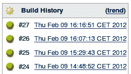

3.  返回主页。
4.  要创建新视图，点击 **+** 图标。
5.  将**名称**填入 `FAV`。
6.  在**作业过滤器**部分下，选中**使用正则表达式将作业包含到视图**中。**正则表达式**增加 `.*`。
7.  In the **Columns** section, make sure you have three columns: **Name, Status**, and **Favorite**.

    

8.  点击**确定**。
9.  You will find yourself in the **FAV** view. By clicking on the star icon, you can select/deselect your favorite projects.

    

## 它是如何工作的...

绿球插件的工作原理和广告宣传的一样。但是，一个限制是，它当前不影响标准列表视图，该视图仍然显示蓝色球。

收藏夹插件允许您选择您最感兴趣的项目，并将其显示为收藏夹图标。这提醒你这个项目需要一些立即的行动。

### 注

如果你有兴趣与社区合作，那么这些插件就是你可以添加额外功能的例子。

## 还有更多...

最喜欢的项目的反面，至少是暂时的，是构建失败的项目。**声明插件**([https://wiki.jenkins-ci.org/display/JENKINS/Claim+plugin](https://wiki.jenkins-ci.org/display/JENKINS/Claim+plugin))允许个人开发者声明失败的构建。这使得工作流能够映射到个人责任。

一旦索赔插件安装完毕，您将能够在**允许损坏的构建索赔**的工作的**构建后操作**部分找到一个勾选框。一旦启用，如果构建失败，您可以声明一个特定的构建，添加一个关于您的动机的注释。


在 Jenkins 主页中，现在有一个指向日志的链接，该日志保存了所有声明的构建的摘要。项目经理现在可以快速阅读问题概述。日志是处理当前问题的团队成员的直接链接。


收藏夹插件简洁优雅。下一个配方，*测试然后提升*，将发出进一步的信号，允许你合并复杂的工作流程。

## 另见

*   *测试然后推广*
*   *牵制 JSGames 的乐趣*

# 测试然后推广

在打包的应用程序被自动测试之前，您不希望质量保证团队审查它。为此，可以使用**推广插件**。

晋升是詹金斯的一个视觉信号。特定构建旁边会设置一个图标，提醒团队执行某项操作。

促销和上一个食谱中提到的收藏夹插件的区别在于，促销插件可以根据各种自动操作自动触发。操作包括运行脚本或验证其他上游或下游作业的状态。

在这个食谱中，你将写两个简单的工作。第一个作业将触发第二个作业，如果第二个作业成功，则第一个作业将被提升。这是一个现实的质量保证过程的核心，测试工作促进了包装工作。

## 做好准备

安装升级版本插件[。](http://https://wiki.jenkins-ci.org/display/JENKINS/Promoted+Builds+Plugin)

## 怎么做...

1.  创建一个名为 `ch7.plugin.promote_action`的自由作业。
2.  运行此作业并验证它是否成功。
3.  创建一个名为 `ch7.plugin.to_be_promoted`的自由作业。
4.  在配置页面顶部附近，选中**在以下情况下升级构建...**。
5.  Fill in the following details:
    *   **名称:**T0】
    *   选择**图标**的 `Green star`
    *   检查**以下下游项目建设成功时**
    *   **作业名称:**

    

6.  在**后期建设行动**部分，勾选**建设其他项目**。
7.  填写 `ch7.plugin.promote_action`为**项目建设**。
8.  勾选**仅在构建成功时触发**。
9.  点击**保存**。
10.  构建作业。
11.  Click on the **Promotion Status** link.

    

12.  Review the build report.

    

## 它是如何工作的...

升级的构建类似于收藏夹插件，但是工作流自动化。您可以根据工件创建触发的作业进行升级。这是一个典型的工作流程，当您希望在挑选和检查作业之前对其进行基线质量测试时。

该插件有足够的配置选项，使其可以适应大多数工作流。另一个例子是，对于一个典型的开发、验收或生产基础设施，你不希望在开发和验收还没有被推广之前，一个技巧就被部署到生产中。对此进行配置的方法是，根据上游开发和验收作业的推进情况，拥有一系列最后一次推进生产的作业。

### 注

如果要添加人工干预，则在**作业配置**中勾选【仅手动审批时**，并添加审批人列表。**

 **## 还有更多...

如果您依赖人工干预，并且没有自动测试，请考虑使用简化的升级版本插件([https://wiki . JENKINS-ci . org/display/JENKINS/Promoted+Builds+Simple+Plugin](https://wiki.jenkins-ci.org/display/JENKINS/Promoted+Builds+Simple+Plugin))。顾名思义，该插件简化了配置，并且可以很好地与大部分质量保证工作流配合使用。简化配置可以简化解释工作，让更多的人使用。

您可以在 Jenkins 主配置页面中配置不同类型的促销。

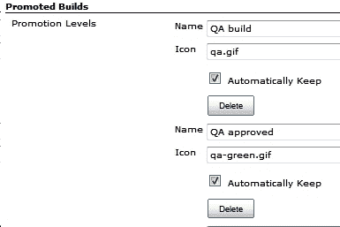

### 注

**警告:**明智地使用**自动保持**功能。该选项告诉 Jenkins 将工件从构建中一直保留下来。如果用作增量构建过程的一部分，最终会消耗大量磁盘空间。

该插件允许你提升晋升。通过构建左侧的链接，有一个简单的选择。此功能允许您将一系列玩家添加到促销过程中。

### 注

**警告:**当最终晋升发生时，如将晋升设置为**一般可用(GA)** 时，晋升被锁定，不能再降级。


用户提升的能力取决于授予他们的权限。例如，如果您使用的是基于矩阵的安全性，那么您需要先更新其表，然后才能在作业的配置页面中看到额外的选项。


## 另见

*   *个性化詹金斯*

# 牵制 JS 游戏的乐趣

这个食谱告诉你如何锁定一个詹金斯插件。锁定一个插件会阻止你在 Jenkins 插件管理器中更新它的版本。

既然老板已经走了，生活并不总是关于代码质量。为了释放压力，考虑使用 JS Games 插件让你的团队放松。

## 做好准备

安装 JS 游戏插件([https://wiki.jenkins-ci.org/display/JENKINS/JSGames+Plugin](https://wiki.jenkins-ci.org/display/JENKINS/JSGames+Plugin))。

## 怎么做...

1.  使用以下命令签出并查看标记 jsgames-0.2::

    ```
    git clone https://github.com/jenkinsci/jsgames-plugin
    git tag
    git checkout jsgames-0.2

    ```

2.  Review the front page of Jenkins; you will see a link to **JS Games**.

    

3.  Click on the link and you will have the choice of two games: **Mario Kart** and **Tetris**.

    

4.  作为詹金斯管理员，访问**管理插件**部分，点击**安装的**标签(`http://localhost:8080/pluginManager/installed`)。请注意，JS 游戏插件没有被固定。
5.  From the command line, list the contents of the plugin directory (`JENKINS_HOME/plugin`), for example:

    ```
    ls /var/lib/jenkins/plugins

    ```

    输出将类似于以下内容:

    ```
    ant ant.jpi
    jsgames jsgames.jpi
    maven-plugin maven-plugin.jpi

    ```

6.  在 `plugins`目录下，创建一个名为 `jsgames.jpi.pinned`的文件。例如:

    ```
    sudo touch /var/lib/jenkins/plugins/jsgames.jpi.pinned
    sudo chown jenkins /var/lib/jenkins/plugins/jsgames.jpi.pinned

    ```

7.  In your web browser, refresh the **Installed Plugin** page. You will now see that the **JSGames Plugin** is pinned.

    

## 它是如何工作的...

锁定插件会阻止詹金斯管理员更新到插件的新版本。要锁定一个插件，你需要在 `plugins`目录中创建一个文件，其名称与以锁定扩展名结尾的插件相同。参见 `https://wiki.jenkins-ci.org/display/JENKINS/Pinned+Plugins`。

大约每周都会发布一个新版本的 Jenkins，其中包含错误修复和功能更新。这导致快速向市场交付改进，但有时也会导致失败。锁定一个插件意味着你可以阻止一个插件被意外更新，直到你有时间评估新版本的稳定性和价值。锁定是维护生产服务器稳定性的工具。

## 还有更多...

源代码包括一个顶层 `pom.xml`来控制 Maven 构建过程。按照惯例，四个主要的源代码区域是:

*   `src/test:`这是构建期间测试的代码。对于 `jsgames`，有一堆 JUnit 测试。
*   `src/main/java:`这是 Java 代码的位置。詹金斯使用**订书机**([https://wiki.jenkins-ci.org/display/JENKINS/Architecture](https://wiki.jenkins-ci.org/display/JENKINS/Architecture))在这个目录中的 Java 对象和詹金斯在 `src/main/resources`下面的目录中找到的视图之间映射数据。
*   `src/main/resources:`这是插件视图的位置。图形用户界面与您在詹金斯交互时看到的插件相关联；例如，JS Games 的链接。视图是使用**果冻标签**定义的。
*   `src/main/webapp:`这是资源的位置，比如图像、样式表和 JavaScript。该位置映射到网址空间。 `/src/main/webapp`映射到网址 `/plugin/name_of_plugin`。例如，位置 `/src/main/webapp/tetris/resources/tetris.js`映射到网址 `/plugin/jsgames/tetris/resources/tetris.js`。

## 另见

*   *创建根动作插件*

# 查看图形用户界面示例插件

这个食谱描述了如何通过 Maven 运行一个 Jenkins 测试服务器。在测试服务器中，您将看到示例图形用户界面插件。图形用户界面插件展示了许多标签元素，您可以在以后的插件中使用。

## 做好准备

创建一个目录来保存这个配方的结果。

## 怎么做...

1.  在菜谱目录中，添加 `pom.xml`，内容如下:

    ```
    <?xml version="1.0"?>
    <project  xmlns:xsi="http://www.w3.org/2001/XMLSchema-instance" xsi:schemaLocation="http://maven.apache.org/POM/4.0.0 http://maven.apache.org/maven-v4_0_0.xsd">
    <modelVersion>4.0.0</modelVersion>
    <parent>
    <groupId>org.jenkins-ci.plugins</groupId>
    <artifactId>plugin</artifactId>
    <version>1.449</version>
    </parent>
    <artifactId>Startup</artifactId>
    <version>1.0-SNAPSHOT</version>
    <packaging>hpi</packaging>
    <name>Startup</name>
    <repositories>
    <repository>
    <id>m.g.o-public</id>
    <url>http://maven.glassfish.org/content/groups/public/</url>
    </repository>
    </repositories>
    <pluginRepositories>
    <pluginRepository>
    <id>m.g.o-public</id>
    <url>http://maven.glassfish.org/content/groups/public/</url>
    </pluginRepository>
    </pluginRepositories>
    </project>

    ```

2.  从命令行运行 `mvn hpi:run`。如果您有一个默认的詹金斯运行在端口 `8080`上，那么您将看到一个类似如下的错误消息:

    ```
    2012-02-05 09:56:57.827::WARN: failed SelectChannelConnector @ 0.0.0.0:8080
    java.net.BindException: Address already in use
    at sun.nio.ch.Net.bind0(Native Method)

    ```

3.  如果服务器还在运行，按 *Ctrl + C* 。
4.  要在端口 `8090`上运行，请键入以下命令:

    ```
    mvn hpi:run -Djetty.port=8090

    ```

5.  服务器现在将运行，并从控制台生成一个 `SEVERE`错误。

    ```
    SEVERE: Failed Inspecting plugin /DRAFT/Exploring_plugins/hpi_run/./work/plugins/Startup.hpl
    java.io.IOException: No such file: /DRAFT/Exploring_plugins/hpi_run/target/classes

    ```

6.  Visit `localhost:8090`. At the bottom of the page, review the version number of Jenkins.

    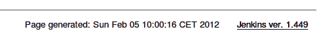

7.  Click on the **UI Samples** link.

    

8.  复习提到的各种类型的例子，如 `AutoCompleteTextBox` ( `http://localhost:8090/ui-samples/AutoCompleteTextBox/`)。

## 它是如何工作的...

出于开发目的，从 Maven 运行测试服务器的能力非常好。您可以更改代码、编译、打包，然后在 Jenkins 的本地实例上查看它，而不用担心配置或损坏真正的服务器。您不必太担心安全性，因为测试服务器只在您测试期间运行。

目标 `hpi:run`试图打包然后部署一个名为**启动**的插件。但是，该包不可用，因此它会记录投诉，然后忠实地运行詹金斯服务器。Jenkins 服务器的版本号与在`<parent>`标签内的 `pom.xml <version>`标签中定义的版本号相同。

为了避免与詹金斯的本地实例到达同一个端口，可以设置 `jetty.port`选项。

一旦 Jenkins 开始运行，访问 GUI 示例插件将向您展示许多用 Jelly 语言编写的不同 GUI 元素。这些元素将在以后为你自己的插件编程时派上用场。插件中使用的果冻文件位于 `/src/main/resources`目录下。詹金斯使用订书机绑定在 `src/main/java`中找到的任何相关类。

您可以在 `work`文件夹中找到詹金斯工作区。您在测试服务器上所做的任何配置更改都会保留在这里。要重新开始，您需要手动删除目录。

对于本章的所有食谱，我们将詹金斯版本锁定在 `1.449`。原因有二:

*   依赖关系占用了大量空间。Jenkins WAR 文件和测试 WAR 文件占用了本地 Maven 存储库大约 120 MB 的空间。将这个数字乘以所使用的 Jenkins 版本的数量，就可以快速填满 GBs 的磁盘空间。
*   保持在一个特定的詹金斯版本稳定的食谱。

随时更新到最新和最伟大的詹金斯版本；本章中的例子应该仍然有效。遇到困难，你可以随时返回已知的安全号码。

## 还有更多...

在幕后，马文做了很多繁重的工作。 `pom.xml`文件定义了引入依赖项的存储库 `http://maven.glassfish.org/content/groups/public/`。它称之为 `org.jenkins-ci.plugins.plugin`的 `1.449`版本。版本号与 Maven 运行的 Jenkins 的版本号同步。

要了解哪些版本号是可接受的，请访问以下网址:

[http://maven . Jenkins-ci . org/content/group/artifacts/org/Jenkins-ci/plugins/plugin/](http://maven.jenkins-ci.org/content/groups/artifacts/org/jenkins-ci/plugins/plugin/)

詹金斯服务器和任何额外插件的详细信息可以在 `1.449/plugin-1.449.pom`中找到。 `ui-samples-plugin`版本也盯住了 `1.449`版本。

## 另见

*   *更改文件系统配置管理插件的帮助*

# 更改文件系统配置管理插件的帮助

这个食谱回顾了文件系统配置管理插件的内部工作。这个插件允许您将代码放在本地目录中，然后在构建中获取。

## 做好准备

为该配方中的代码创建一个名为 `ready`的目录。

## 怎么做...

1.  下载插件的源代码。

    ```
    svn export -r 40275 https://svn.jenkins-ci.org/trunk/hudson/plugins/filesystem_scm

    ```

2.  在顶层目录中，通过将`<parent>`版本更改为 `1.449`来编辑 `pom.xml`文件。

    ```
    <parent>
    <groupId>org.jenkins-ci.plugins</groupId>
    <artifactId>plugin</artifactId>
    <version>1.449</version>
    </parent>

    ```

3.  将 `src/main/webapp/help-clearWorkspace.html`的内容替换为:

    ```
    <div>
    <p>
    <h3>HELLO WORLD</h3>
    </p>
    </div>

    ```

4.  运行 `mvn clean install`。单元测试失败，输出如下:

    ```
    Failed tests: test1(hudson.plugins.filesystem_scm.SimpleAntWildcardFilterTest): expected:<2> but was:<0>
    Tests run: 27, Failures: 1, Errors: 0, Skipped: 0

    ```

5.  通过运行 `mvn clean package -Dmaven.test.skip=true`跳过失败的测试。插件现已打包。
6.  Upload the plugin `./target/filesystem_scm.hpi` in the **Advanced** section of your plugin manager (`http://localhost:8080/pluginManager/advanced`).

    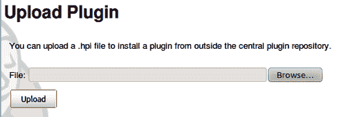

7.  重启詹金斯服务器。
8.  登录 Jenkins，访问已安装插件列表(`http://localhost:8080/pluginManager/installed`)。
9.  创建一个名为 `ch7.plugins.filesystem_scm`的 Maven 2/3 作业。
10.  在**源代码管理**下，你现在有一个名为**文件系统**的部分。
11.  Click on the **help** icon. You will see your custom message.

    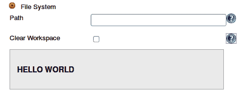

12.  要删除插件，从 `JENKINS_HOME/plugins`下删除 JPI 文件和扩展目录。
13.  重启詹金斯。

## 它是如何工作的...

恭喜你！你已经更新了配置管理插件。

首先，您修改了插件的 `pom.xml`文件，更新了测试 Jenkins 服务器的版本。接下来，您修改了它的 `help`文件。

对于每个 Java 类，您可以通过关联的 `config.jelly`文件配置其图形用户界面表示。映射是从 `src/main/java/package_path/classname.java`到 `src/main/resources/package_path/classname/config.jelly`。

例如， `src/main/resources/hudson/plugins/filestem_scm/FSSCM/config.jelly`为 `src/main/java/hudson/plugins/filesystem_scm/FSSCM.java`配置詹金斯图形用户界面。

`help`文件的位置在 `config.jelly`中定义，属性 `help`在 `entry`果冻标签中:

```
<f:entry title="Clear Workspace" help="/plugin/filesystem_scm/ help-clearWorkspace.html">
<f:checkbox name="fs_scm.clearWorkspace" checked="${scm.clearWorkspace}"/>
</f:entry>

```

`src/main/webapps`目录为静态内容提供了一个稳定的 Jenkins URL `/plugin/name_of_plugin`，例如图像、样式表和 JavaScript 文件。这就是为什么 `help`档案被存放在这里的原因。修改 `help-clearWorkspace.html`更新了条目标签指向的帮助。

变量 `${scm.clearworkspace}`是对 `FSSCM`实例中 `clearWorkspace`成员值的引用。

## 还有更多...

插件通常附带两种类型的果冻文件: `global.jelly`和 `config.jelly. config.jelly`文件生成配置作业时看到的配置元素。 `global.jelly`文件呈现在主詹金斯配置页面。

使用 Xstream 框架将数据保存在 XML 文件中。在 `./jobs/job_name/plugin_name.xml`内可以找到詹金斯工作区下的作业配置数据，全局插件配置可以找到 `./work/name_of_plugin.xml`。

## 另见

*   *查看图形用户界面示例插件*

# 在职位描述中添加横幅

**场景:**你的公司有一个面向公众的 Jenkins 实例。所有者不希望项目所有者在项目描述中编写非转义标记。这带来了太多的安全问题。但是，所有者确实希望在每个描述的底部放一个公司横幅。在管理层开始接受不必要的建议之前，你有 15 分钟的时间来解决问题。在前五分钟内，您确定转义标记插件(参见*通过模糊化发现詹金斯中的 500 个错误和 XSS 攻击*、[第 2 章](2.html "Chapter 2. Enhancing Security")、*增强安全性)*执行描述的转义。

这个食谱向你展示了如何修改标记插件来给所有的描述添加一个标题。

## 做好准备

为项目创建一个目录。

## 怎么做...

1.  查看 `escaped-markup-plugin`的 `escape-markup-plugin-0.1`标签。

    ```
    git clone https://github.com/jenkinsci/escaped-markup-plugin
    cd escaped-markup-plugin
    git checkout escaped-markup-plugin-0.1

    ```

2.  在项目的顶层目录中，尝试使用 `mvn install`命令创建插件。构建失败。
3.  将 pom.xml 中的 Jenkins 插件版本从 1.408 更改为 1.449:

    ```
    <parent>
    <groupId>org.jenkins-ci.plugins</groupId>
    <artifactId>plugin</artifactId>
    version>1.449</version>
    </parent>

    ```

4.  用 `mvn install`构建插件。构建和测试将会成功。你现在可以在 `target/escaped-markup-plugin.hpi`找到这个插件。
5.  通过访问插件管理器(`http://localhost:8080/pluginManager/advanced`)下的**高级**选项卡安装插件。
6.  在**上传插件**部分，上传 `escaped-markup-plugin.hpi`文件。
7.  重新启动服务器；例如:

    ```
    sudo /etc/init.d/jenkins restart

    ```

8.  Visit the Jenkins configuration page (`http://localhost:8080/configure`), and review the markup formatters.

    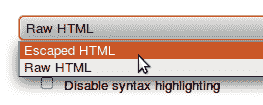

9.  将 `src/main/resources/index.jelly`替换为:

    ```
    <div>
    This plugin escapes the description of project , user, view , and build to prevent from XSS.
    Revision: Unescaped banner added at the end.
    </div>

    ```

10.  将 `src/main/java/org/jenkinsci/plugins/escapedmarkup/ EscapedMarkupFormatter.java`的类定义替换为:

    ```
    public class EscapedMarkupFormatter extends MarkupFormatter {
    private final String BANNER= "\n<hr><h2>THINK BIG WITH xyz dot blah</h2><hr>\n";
    @DataBoundConstructor
    public EscapedMarkupFormatter() {
    }
    @Override
    public void translate(String markup, Writer output) throws IOException {
    output.write(Util.escape(markup)+BANNER);
    }
    @Extension
    public static class DescriptorImpl extends MarkupFormatterDescriptor {
    @Override
    public String getDisplayName() {
    return "Escaped HTML with BANNER";
    }
    }
    }

    ```

11.  用 `mvn install`建造。由于测试失败，构建失败了(这是一件好事)。
12.  使用以下命令再次构建，这次跳过测试:

    ```
    mvn -Dmaven.test.skip=true -DskipTests=true clean install

    ```

13.  阻止詹金斯；例如:

    ```
    sudo /etc/init.d/jenkins stop

    ```

14.  从 Jenkins 插件目录中删除转义标记插件，并在同一目录中删除扩展版本。例如:

    ```
    sudo rm /var/lib/jenkins/plugins/escaped-markup-plugin.jpi
    sudo rm -rf /var/lib/jenkins/plugins/escaped-markup-plugin

    ```

15.  将 `target/escaped-markup-plugin.hpi`插件复制到詹金斯插件目录。
16.  重启詹金斯。
17.  Visit the **Installed plugins** page at `http://localhost:8080/pluginManager/installed`. You will now see an updated description of the plugin.

    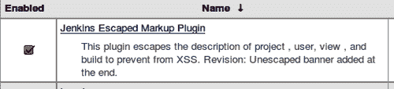

18.  在詹金斯中，作为管理员，访问 `http://localhost:8080/configure`处的配置页面。
19.  For **Markup Formatter**, choose **Escape HTML with Banner:**

    

20.  点击**保存**。
21.  创建名为 `ch7.plugin.escape`的新作业。
22.  在作业主页中，您现在将看到横幅。

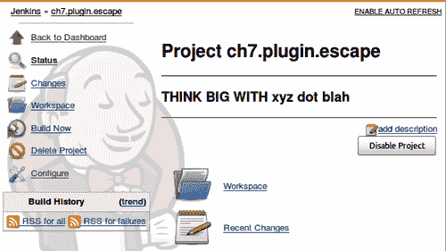

## 它是如何工作的...

标记插件会转义描述中的标签，因此无法注入任意脚本操作。食谱*中解释了插件的使用，通过模糊化*、[第二章](2.html "Chapter 2. Enhancing Security")、*安全*在詹金斯中发现 500 个错误和 XSS 攻击。

在这个食谱中，我们修改了插件来逃避一个项目的描述，然后添加了一个横幅。横幅包含任意的 HTML。

首先，您编译并上传了标记插件。然后，您修改了源，在作业描述的末尾包含一个横幅。该插件被重新部署到一个准备审查的牺牲测试实例中。你也可以用 `mvn hpi:run`进球让詹金斯穿过马文。有多种部署方式，包括将插件直接转储到 Jenkins 插件目录中。您决定使用哪种部署方法是一个品味问题。

渲染插件的描述在 `src/main/resources/index.jelly`中定义。您更新了文件以准确描述新的横幅功能。

在 Jenkins 中，扩展点是对 Jenkins 功能的一部分进行建模的 Java 接口或抽象类。Jenkins 有丰富的扩展点([https://wiki . JENKINS-ci . org/display/JENKINS/Extension+points](https://wiki.jenkins-ci.org/display/JENKINS/Extension+points))。甚至可以自己做扩展点([https://wiki . JENKINS-ci . org/display/JENKINS/Defining+a+new+扩展+点](https://wiki.jenkins-ci.org/display/JENKINS/Defining+a+new+extension+point))。

为了符合我们的目的，标记插件只做了很少的改动。我们扩展了 `MarkupFormatter`扩展点。

詹金斯使用注释。 `@Override`注释告诉编译器覆盖该方法。在这种情况下，我们重写了 `translate`方法，并使用了一个实用程序类来使用詹金斯 `utility`方法过滤标记字符串。在结果字符串的末尾，横幅字符串被添加并传递给 Java 编写器。然后，编写器被传递回调用方法。

插件的 `selectbox`(参见*步骤 19)* 中的文本是在 `DescriptorImpl`类的 `getDisplayName()`方法中定义的。

**结论:**编写一个新的插件，理解 Jenkins 对象模型比复制一个有效的插件然后调整它需要更多的努力。将横幅功能添加到一个已经存在的插件中所需的代码更改量是最小的。

## 还有更多...

詹金斯有很多资料。然而，对于核心程序员来说，最好的细节来源是查看代码。例子包括 JavaDoc([http://javadoc.jenkins-ci.org/](http://javadoc.jenkins-ci.org/))和 IDEs 的内置代码完成工具，比如 Eclipse。如果您将 Jenkins 插件项目作为一个 Maven 项目导入到 Eclipse 中，那么 Eclipse 的最新版本将为您整理依赖关系，从而在编辑文件的过程中完成代码。在像 Jenkins 这样快速发展的项目中，有时在添加特性和记录特性之间会有一段时间的延迟。在这种情况下，代码需要自我记录。代码完成与编写良好的 JavaDoc 相结合，简化了开发人员的学习过程。

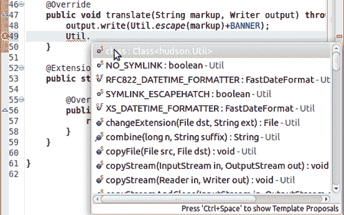

## 另见

*   *通过模糊化*[第二章](2.html "Chapter 2. Enhancing Security")*增强安全*在詹金斯发现 500 个错误和 XSS 攻击
*   *更改文件系统配置管理插件的帮助*
*   *创建根动作插件*

# 创建根动作插件

在建立你自己的插件之前，看看你是否能修改别人的插件是值得的。在**趣味牵制 JS Games** 食谱中，插件在首页创建了一个链接。


在这个食谱中，我们将使用插件的元素在詹金斯主页创建一个链接。

## 做好准备

创建一个目录来存储您的源代码。

## 怎么做...

1.  Create a copy of the `pom.xml` file from the *Looking at the GUI Samples plugin and hpi:run* recipe, and replace:

    ```
    <artifactId>Startup</artifactId>
    <version>1.0-SNAPSHOT</version>
    <packaging>hpi</packaging>
    <name>Startup</name>

    ```

    与:

    ```
    <artifactId>rootaction</artifactId>
    <version>1.0-SNAPSHOT</version>
    <packaging>hpi</packaging>
    <name>Jenkins Root Action Plugin</name>

    ```

2.  创建目录 `src/main/java/Jenkins/plugins/rootaction, src/main/resources`和 `src/main/webapp`。
3.  在 `src/main/java/Jenkins/plugins/rootaction`中，添加文件 `MyRootAction.java`，内容如下:

    ```
    package jenkins.plugins.rootaction;
    import hudson.Extension;
    import hudson.model.RootAction;
    @Extension
    public class MyRootAction implements RootAction {
    public final String getDisplayName() {
    return "Root Action Example";
    }
    public final String getIconFileName() {
    return "/plugin/rootaction/myicon.png";
    }
    //Feel free to modify the URL
    public final String getUrlName() {
    return "http://www.uva.nl";
    }
    }

    ```

4.  在 `src/main/webapp`目录下，添加一个名为 `myicon.png`的 PNG 文件。如需示例图像，请参见[http://www.iconfinder.com/icondetails/46509/32/youtube_icon](http://www.iconfinder.com/icondetails/46509/32/youtube_icon)。
5.  添加内容如下的 `src/main/resources/index.jelly`文件:

    ```
    <div>
    This plugin adds a root link.
    </div>

    ```

6.  在顶层目录中，运行以下命令:

    ```
    mvn -Dmaven.test.skip=true -DskipTests=true clean install hpi:run -Djetty.port=8090

    ```

7.  Visit the main page at `http://localhost:8090`.

    

8.  点击**根动作示例**链接；你的浏览器现在被发送到阿姆斯特丹大学的主网站。
9.  查看詹金斯安装的插件页面(`http://localhost:8090/pluginManager/installed`)。

## 它是如何工作的...

您实现了 `RootAction`扩展点。它用于在 Jenkins 中向主菜单添加链接。

扩展点很容易扩展。链接名称在 `getDisplayName`方法中定义，图标在 `getIconFileName`方法中的位置和链接到的网址在 `getUrlName`中定义。

## 还有更多...

惯例节省了编程工作。按照惯例，插件的描述在 `src/main/resources/index.jelly`中定义，链接名称在 `pom.xml`文件中位于`<packaging>`标签旁边的`<name>`标签下。例如:

```
<artifactId>rootaction</artifactId>
<version>1.0-SNAPSHOT</version>
<packaging>hpi</packaging>
<name>Jenkins Root Action Plugin</name>

```

詹金斯维基中细节的位置被计算为一个带有插件名称的固定网址([http://wiki.jenkins-ci.org/display/JENKINS/](http://wiki.jenkins-ci.org/display/JENKINS/)，然后名称中的空格被 `+`符号替换。这个插件也是如此，它有生成的链接[。](http://wiki.jenkins-ci.org/display/JENKINS/Jenkins+Root+Action+Plugin)


## 另见

*   *牵制 JS 游戏的乐趣*

# 导出数据

作业导出器插件创建一个包含项目相关属性列表的属性文件。当你想让詹金斯把信息从一项工作传递到另一项工作时，这是一个方便的粘合剂。

## 做好准备

安装作业导出器插件([https://wiki . Jenkins-ci . org/display/JENKINS/作业+导出器+插件](https://wiki.jenkins-ci.org/display/JENKINS/Job+Exporter+Plugin))。

## 怎么做...

1.  下载已知版本号的源代码。

    ```
    svn export -r 40275 https://svn.jenkins-ci.org/trunk/hudson/plugins/job-exporter

    ```

2.  创建一个名为 `ch7.plugins.job_export`的自由作业。
3.  在 `build`部分，添加构建步骤 `export runtime parameters`。
4.  点击 `Save`。
5.  运行作业。
6.  在控制台输出的作业构建历史中，您将看到类似如下的输出:

    ```
    Started by user Alan Mark Berg
    Building in workspace /var/lib/jenkins/workspace/ch7.plugins.job_export
    ###################################################################
    job-exporter plugin started
    hudson.version: 1.450
    host:
    id: 2012-02-02_15-58-51
    duration: 2 ms
    slave:
    started: 2012-02-02T15:58:51
    result: SUCCESS
    summary: Executor #0 for master : executing ch7.plugins.job_export #1
    executor: 0
    elapsedTime: 3
    number: 1
    jobName: ch7.plugins.job_export
    we have 1 build cause:
    Cause.UserIdCause Started by user Alan Mark Berg
    user.id: Alan
    user.name: Alan Mark Berg
    user.fullName: Alan Mark Berg
    user.emailAddress: xxx@yyy.nl
    new file written: /var/lib/jenkins/workspace/ch7.plugins.job_export/hudsonBuild.properties
    job-exporter plugin finished. That's All Folks!
    ###################################################################
    Finished: SUCCESS

    ```

7.  查看新创建的属性文件；你会看到类似如下的文字:

    ```
    #created by com.meyling.hudson.plugin.job_exporter.ExporterBuilder
    #Thu Feb 02 15:58:51 CET 2012
    build.user.id=Alan
    build.result=SUCCESS

    ```

## 它是如何工作的...

作业导出器插件使詹金斯能够将与作业相关的信息导出到一个属性文件中，该文件以后可以被其他作业重新使用。

查看代码 `src/main/java/com/meyling/hudson/plugin/job_exporter/ExporterBuilder.java`扩展 `hudson.tasks.Builder`，其 `perform`方法在构建运行时被调用。 `perform`方法在被调用时接收 `hudson.model.Build`对象。 `Build`实例包含关于构建本身的信息。调用 `build.getBuiltOnStr()`方法返回一个字符串，该字符串包含运行构建的节点的名称。该插件使用了许多这样的方法来发现信息，这些信息随后被输出到属性文件中。

## 还有更多...

在查看插件代码时，您可以发现有趣的技巧，可以在自己的插件中重用。插件通过使用以下方法发现了环境变量:

```
final EnvVars env = build.getEnvironment(new LogTaskListener(Logger.getLogger( this.getClass().getName()), Level.INFO));

```

在这里， `EnvVars`属于 `hudson.EnvVars`([http://javadoc.jenkins-ci.org/hudson/EnvVars.html](http://javadoc.jenkins-ci.org/hudson/EnvVars.html))类。 `EnvVars`甚至有一种从远程 Jenkins 节点获取环境变量的方法。

您还可以在系统信息(`http://localhost:8080/systemInfo`)下的**詹金斯管理**区域找到为詹金斯定义的所有环境变量的列表。

## 另见

*   *我的第一个 ListView 插件*

# 启动时触发事件

通常，当服务器启动时，您会希望执行清理操作。例如，运行一个向所有 Jenkins 管理员发送电子邮件的作业，警告他们启动事件。可以通过**启动触发插件**来实现。

## 做好准备

安装启动触发插件([https://wiki.jenkins-ci.org/display/JENKINS/Startup+Trigger](https://wiki.jenkins-ci.org/display/JENKINS/Startup+Trigger))。

## 怎么做...

1.  下载源代码。

    ```
    svn export -r 40275 https://svn.jenkins-ci.org/trunk/hudson/plugins/startup-trigger-plugin

    ```

2.  创建一个名为 `ch7.plugin.startup`的自由作业。
3.  在**构建触发器**部分，勾选**詹金斯第一次启动**时的构建。
4.  点击**保存**。
5.  重启詹金斯。
6.  返回到项目页面；您会注意到作业已经被触发。
7.  查看构建历史控制台输出。您将看到类似如下的输出:

    ```
    Started due to Jenkins startup.
    Building in workspace /var/lib/jenkins/workspace/ch7.plugins.startup
    Finished: SUCCESS

    ```

## 它是如何工作的...

启动触发器插件在启动时运行作业。这对于管理任务很有用，例如检查文件系统。它的设计也很简洁。

启动触发器插件扩展了 `/src/main/java/org/jvnet/hudson/plugins/triggers/startup/HudsonStartupTrigger` Java 类中的 `hudson.triggers.Trigger`，并覆盖了方法 `start`，该方法后来在詹金斯启动时被调用。

`start`方法调用父 `start`方法，如果不是新实例，它将调用 `project.scheduleBuild`方法，然后开始构建。

```
@Override
public void start( BuildableItem project, boolean newInstance )
{
super.start( project, newInstance );
// do not schedule build when trigger was just added to the job
if ( !newInstance )
{
project.scheduleBuild( new HudsonStartupCause() );
}
}

```

启动的原因在 `HudsonStartupCause`中定义，它本身延伸了 `hudson.model.Cause`。该插件覆盖了 `getShortDescription()`方法，返回字符串 `Started due to Hudson startup`。字符串作为日志记录的一部分输出到控制台。

```
@Override
public String getShortDescription()
{
return "Started due to Hudson startup.";
}

```

## 另见

*   *当网页内容发生变化时触发事件*

# 当网页内容发生变化时触发事件

在这个方法中，如果一个网页改变了它的内容，URL 触发插件将触发一个构建。

Jenkins 部署在各种基础设施中。有时标准插件不能被你选择的系统触发。网络服务器是众所周知的技术。在大多数情况下，您要连接的系统有自己的 web 界面。如果应用程序没有，那么您仍然可以设置一个网页，当应用程序需要詹金斯的反应时，这个网页会发生变化。

## 怎么做...

1.  创建一个名为 `ch7.plugin.url`的新自由作业。
2.  在**构建触发器**部分，选中**【URL trigger】-使用 URL 进行投票**复选框。
3.  点击**添加网址监控**。
4.  对于**网址**，添加[http://www.google.com](http://www.google.com)。
5.  检查**检查网址内容**。
6.  Select **Monitor a change of the content** from **Add a content nature**.

    

7.  对于**日程**输入，添加文本 `*****`。这会将**时间表**设置为每分钟一次**。**
8.  点击**保存**。
9.  On the right-hand side, there is a link to **URLTrigger Log**. Click on this link.

    

10.  现在，您将看到日志信息每分钟更新一次，内容类似如下:

    ```
    Polling for the job ch7.plugin.url
    Polling on master.
    Polling started on Feb 9, 2012 4:55:45 PM
    Invoking the url:
    http://www.google.com
    Inspecting the content
    The content of the URL has changed.
    Polling complete. Took 0.21 sec.
    Changes found. Scheduling a build.

    ```

11.  删除作业，因为我们不想每分钟都轮询谷歌。

## 它是如何工作的...

您将插件配置为每分钟访问一次 google.com，并下载和比较谷歌页面进行更改。一分钟一次的时间表是激进的；考虑使用与您的 SCM 存储库类似的时间间隔，例如，每五分钟一次。

由于返回的每个谷歌页面都有细微的差异，触发被激活。通过查看**URL 触发日志**来验证这一点。

**URLTrigger 插件**也可以用于 JSON 和文本或 XML 响应。未来，期待更多的选择。

## 还有更多...

URI 模式的一部分用于指向您的本地文件系统([http://en.wikipedia.org/wiki/File_URI_scheme](http://en.wikipedia.org/wiki/File_URI_scheme))。当你把一个本地文件加载到你的网络浏览器中时，你会看到这样的例子。


该插件无法监控本地文件系统中的更改。如果您将作业重新配置为指向位置 `file:///`，您将获得以下错误消息:

```
java.lang.ClassCastException: sun.net.www.protocol.file.FileURLConnection cannot be cast to java.net.HttpURLConnection

```

你将不得不使用文件系统配置管理插件。

## 另见

*   *启动时触发事件*

# 查看三个列表视图插件

詹金斯的头版所传播的信息很重要。对你的项目质量的最初认知很可能是通过这种最初的接触来判断的。

在本食谱中，我们将回顾您可以添加到列表视图中的**上次成功、上次失败**和**上次持续时间**列。


在下一个菜谱中，您将看到如何在列表视图中为自己的列编写插件。

## 做好准备

安装列表视图列插件、上次失败版本列插件([https://wiki . JENKINS-ci . org/display/JENKINS/Last+失败+版本+列+插件](https://wiki.jenkins-ci.org/display/JENKINS/Last+Failure+Version+Column+Plugin))、上次成功描述列插件([https://wiki . JENKINS-ci . org/display/JENKINS/Last+成功+描述+列+插件](https://wiki.jenkins-ci.org/display/JENKINS/Last+Success+Description+Column+Plugin))和上次成功版本列插件([https://wiki . JENKINS-ci . org/display/JENKINS/Last+成功+版本+列+插件](https://wiki.jenkins-ci.org/display/JENKINS/Last+Success+Version+Column+Plugin))。

## 怎么做...

1.  将源代码本地安装在选择的目录中。

    ```
    git clone https://github.com/jenkinsci/lastfailureversioncolumn-plugin
    git clone https://github.com/jenkinsci/lastsuccessversioncolumn-plugin
    svn export r 40277
    https://svn.jenkins-ci.org/trunk/hudson/plugins/lastsuccessdescriptioncolumn

    ```

2.  查看 git 源代码中的正确标签:

    ```
    cd lastfailureversioncolumn-plugin
    git checkout lastfailureversioncolumn-1.1
    cd ../lastsuccessversioncolumn-plugin
    git checkout lastsuccessversioncolumn-1.1

    ```

3.  在詹金斯中，创建一个名为 `ch7.plugin.lastview`的新自由作业。不需要进一步配置。
4.  On the **Main Page**, press the `+` tab next to the **All** tab.

    

5.  创建名为 `LAST`的**列表视图**。
6.  Under **Job Filters | Jobs**, check the **ch7.plugin.lastview** checkbox.

    

7.  Click on **OK**. You will be returned to the main page with the **LAST** list view showing.

    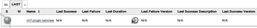

8.  Click on the build icon to run the `ch7.plugin.lastview` Job.

    

9.  刷新页面。**最后成功版本**列现在有了链接到构建历史的数据。
10.  在**最后成功描述**栏，点击**不适用**链接。
11.  在右侧，点击**添加描述**。
12.  添加对构建 `"This is my great description`的描述。
13.  点击**提交**。
14.  Return to the **LAST** list view by clicking on **LAST** in the breadcrumb displayed at the top of the page.

    

15.  The **Last Success Description** column is now populated.

    

## 它是如何工作的...

这三个插件执行类似的功能；唯一的区别是列的细节略有不同。这些细节对于项目的快速决策非常有用。你可以让普通观众忽略项目中最后一个重要的动作，而不需要他们深入源代码。当构建成功时，向构建中添加一个有意义的描述，例如“更新核心库以使用现代浏览器”。通过正确使用描述来公开信息可以节省大量点击。

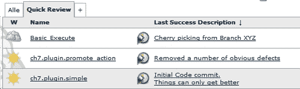

## 还有更多...

**ListView** 插件市场健康。其中包括:

*   **Extra Columns plugin:** 它添加了计算成功和失败构建数量的选项、项目配置页面的快捷方式、启用/禁用项目按钮和项目描述按钮。这些新列中的每一个都允许您更好地理解项目的状态或有效地执行操作。
*   **Cron Column 插件:**它显示项目中的计划触发器，并显示它们是启用还是禁用。如果你想比较系统监控信息和旋律插件，这是很有用的。
*   **Emma 覆盖率插件:**显示 Emma 插件报告的代码覆盖率结果。如果您的组织有一个内部风格指南，其中代码需要达到特定的代码覆盖级别，那么这一点尤其有用。
*   **进度条插件:**显示运行作业的进度条。这给头版增加了一种活跃的感觉。

## 另见

*   *创建我的第一个列表视图插件*
*   *高效使用视图*、[第 4 章](4.html "Chapter 4. Communicating through Jenkins")、*通过詹金斯*进行沟通
*   *通过仪表盘插件*、[第四章](4.html "Chapter 4. Communicating through Jenkins")、*通过詹金斯*交流节省屏幕空间
*   *通过 JavaMelody* 、[第 1 章](1.html "Chapter 1. Maintaining Jenkins")监控，维护詹金斯

# 创建我的第一个列表视图插件

在这个最终的食谱中，你将创建你的第一个自定义列表视图插件。这允许您向标准列表视图添加一个额外的列，该列带有注释。专栏内容的代码是一个占位符，只等你用自己的精彩实验来替换。

## 做好准备

创建一个为代码做好准备的目录。

## 怎么做...

1.  Create a top-level `pom.xml` file with the content of `pom.xml` from the *Creating my first RootAction plugin* recipe. Change the`<parent>` section from:

    ```
    <artifactId>Startup</artifactId>
    <version>1.0-SNAPSHOT</version>
    <packaging>hpi</packaging>
    <name>Startup</name>

    ```

    到内容:

    ```
    <artifactId>commentscolumn</artifactId>
    <version>1.0-SNAPSHOT</version>
    <packaging>hpi</packaging>
    <name>Jenkins Fake Comments Plugin</name>

    ```

2.  创建 `src/main/java/jenkins/plugins/comments`目录。
3.  在 `comments`目录中，添加 `CommentsColumn.java`，内容如下:

    ```
    package jenkins.plugins.comments;
    import org.kohsuke.stapler.StaplerRequest;
    import hudson.views.ListViewColumn;
    import net.sf.json.JSONObject;
    import hudson.Extension;
    import hudson.model.Descriptor;
    import hudson.model.Job;
    public class CommentsColumn extends ListViewColumn {
    public String getFakeComment(Job job) {
    return "Comments for <em>"+job.getName()+"</em>"+ "Short URL: <em>"+job.getShortUrl()+"</em>";
    }
    @Extension
    public static final Descriptor<ListViewColumn> DESCRIPTOR = new DescriptorImpl();
    public Descriptor<ListViewColumn> getDescriptor(){
    return DESCRIPTOR;
    }
    private static class DescriptorImpl extends Descriptor<ListViewColumn> {
    @Override
    public ListViewColumn newInstance(StaplerRequest req, JSONObject formData) throws FormException {
    return new CommentsColumn();
    }
    @Override
    public String getDisplayName() {
    return "FakeCommentsColumn";
    }
    }
    }

    ```

4.  创建 `src/main/resources/jenkins/plugins/comments/CommentsColumn`目录。
5.  在 `CommentsColum`目录中，添加 `column.jelly`，内容如下:

    ```
    <j:jelly xmlns:j="jelly:core">
    <j:set var="comment" value="${it.getFakeComment(job)}"/>
    <td data="${comment}">${comment}</td>
    </j:jelly>

    ```

6.  在 `CommentsColum`目录中， `add columnHeader.jelly`有以下内容:

    ```
    <j:jelly xmlns:j="jelly:core">
    <th>${%Fake Comment}</th>
    </j:jelly>

    ```

7.  在 `CommentsColumn`目录中，添加 `columnHeader.properties`，内容如下:

    ```
    Fake\ Comment=My Fake Column [Default]

    ```

8.  在 `CommentsColumn`目录中，添加 `columnHeader_an.properties`，内容如下:

    ```
    Fake\ Comment=My Fake Column [an]

    ```

9.  在 `src/main/resources`目录下，添加插件描述 `index.jelly`文件，内容如下:

    ```
    <div>
    This plugin adds a comment to the sections mentioned in list view.
    </div>

    ```

10.  在顶层目录中，运行以下命令:

    ```
    mvn -Dmaven.test.skip=true clean install hpi:run -Djetty.port=8090

    ```

11.  Visit the Jenkins Job creation page at `http://localhost:8090/view/All/newJob`. Create a new free-style Job named `ch7.plugin.list`.

    在 Jenkins 主页上，http://localhost:8090，您将看到一个名为**我的假专栏【默认】**的视图。如果您将网页浏览器的首选语言更改为`Aragonese [an]`，那么该栏现在将被称为**我的假栏【an】**。

    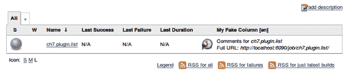

    ### 注

    在 Ubuntu 的默认火狐浏览器中，您可以在**语言**部分的**编辑|首选项|内容**选项卡下更改首选语言。

    

## 它是如何工作的...

在这个配方中，一个基本的 ListView 插件被创建，其结构如下:

**──POM . XML**

**──src**

**──主要**

**【Java】**

**──Jenkins**

**──插件**

**──注释**

**──comment column . Java**

**──资源**

**──指标. jelly**

**──Jenkins**

**──插件**

**──备注**

**──评论员栏**

**──column header _ an . properties**

**──column header . jelly**

**μ──column header . properties**

**──column . jelly**

插件中包含的一个 Java 文件是 `/src/main/java/Jenkins/plugins/comments`下的 `CommentsColumn.java`。该类扩展了 `ListViewColumn`扩展点。

方法 `getFakeComment`需要作业类型的输入，并返回一个字符串。此方法用于填充列中的条目。

ListView 中的 GUI 是在/src/main/resources/package name/class name/下定义的。您可以找到映射到 `/src/main/resources/Jenkins/plugins/comments/CommentsColumn`目录的 `/src/main/java/ Jenkins/plugins/comments/CommentsColumn.java`图形用户界面。在这个目录中，有两个果冻文件: `columnHeader.jelly`和 `column.jelly`。

顾名思义， `columnHeader.jelly`在列表视图中呈现列的标题。其内容如下:

```
<j:jelly xmlns:j="jelly:core">
<th>${%Fake Comment}</th>
</j:jelly>

```

`FAKE Comment`在 `columnHeader.properties`中定义。 `%`标志告诉 Jelly 根据网络浏览器返回的**语言**设置上的值查看不同的属性文件。在这个食谱中，我们将网页浏览器的语言值设置为**和**，这相当于先寻找 `columnHeader_an.properties`文件。如果网页浏览器返回的语言没有自己的属性文件，那么果冻默认为 `columnHeader.properties`。

`columns.jelly`有以下内容:

```
<j:jelly xmlns:j="jelly:core">
<j:set var="comment" value="${it.getFakeComment(job)}"/>
<td data="${comment}">${comment}</td>
</j:jelly>

```

`it.getFakeComment`在 `CommentsColumn`类的实例上调用方法 `getFakeComment`。这是对象实例的默认名称。返回的对象类型按照惯例由文件结构 `/src/main/resources/Jenkins/plugins/comments/CommentsColumn`定义。

返回的字符串被放入变量 `comment`中，然后显示在`<td>`标签中。

### 注

如果你对 Jenkins 中可用的 Jelly 标签感到好奇，那么可以查看[https://wiki . Jenkins-ci . org/display/Jenkins/Understanding+Jelly+Tags](http://https://wiki.jenkins-ci.org/display/JENKINS/Understanding+Jelly+Tags)。

## 还有更多...

如果你想参与社区，那么治理页面就是必读([https://wiki . JENKINS-ci . org/display/JENKINS/Governance+Document](https://wiki.jenkins-ci.org/display/JENKINS/Governance+Document))。关于许可问题，该页指出:

> 核心完全在麻省理工学院的许可中，大多数基础设施代码(运行项目本身)和许多插件也是如此。我们鼓励托管插件使用相同的麻省理工学院许可证，以简化用户的故事，但插件可以自由选择自己的许可证，只要它是现场视察批准的开源许可证。

您可以在[http://opensource.org/licenses/alphabetical](http://opensource.org/licenses/alphabetical)找到已批准的现场视察许可证列表。

大多数插件的顶级目录中都有一个 `License.txt`文件，该文件拥有**麻省理工学院许可**([http://en.wikipedia.org/wiki/MIT_License](http://en.wikipedia.org/wiki/MIT_License))。例如，查看[https://github . com/Jenkins ci/lastfailureversioncylun-plugin/blob/master/LICENSE . txt](http://https://github.com/jenkinsci/lastfailureversioncolumn-plugin/blob/master/LICENSE.txt)。它有一个结构，类似于下面的:

```
The MIT License
Copyright (c) 20xx, Name x, Name y…
Permission is hereby granted, free of charge, to any person obtaining a copy of this software and associated documentation files (the "Software"), to deal in the Software without restriction, including without limitation the rights to use, copy, modify, merge, publish, distribute, sublicense, and/or sell copies of the Software, and to permit persons to whom the Software is furnished to do so, subject to the following conditions:
The above copyright notice and this permission notice shall be included in all copies or substantial portions of the Software.
THE SOFTWARE IS PROVIDED "AS IS", WITHOUT WARRANTY OF ANY KIND, EXPRESS OR IMPLIED, INCLUDING BUT NOT LIMITED TO THE WARRANTIES OF MERCHANTABILITY, FITNESS FOR A PARTICULAR PURPOSE AND NONINFRINGEMENT. IN NO EVENT SHALL THE AUTHORS OR COPYRIGHT HOLDERS BE LIABLE FOR ANY CLAIM, DAMAGES OR OTHER LIABILITY, WHETHER IN AN ACTION OF CONTRACT, TORT OR OTHERWISE, ARISING FROM, OUT OF OR IN CONNECTION WITH THE SOFTWARE OR THE USE OR OTHER DEALINGS IN THE SOFTWARE.

```

## 另见

*   *查看三个列表视图插件***