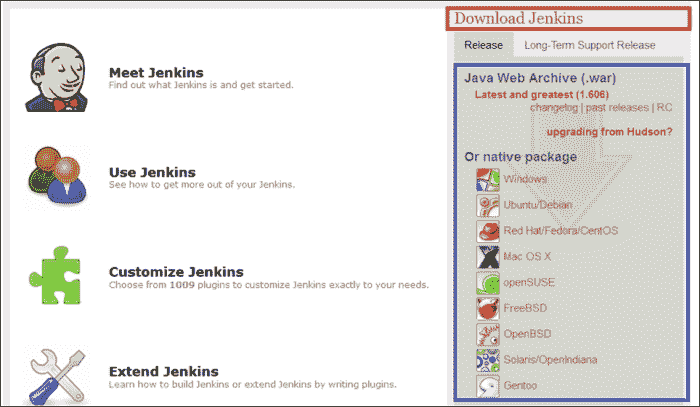
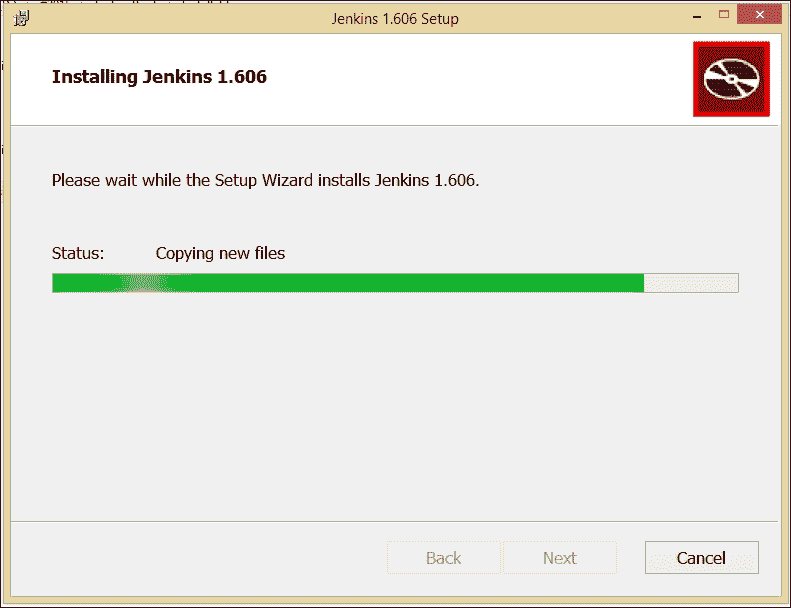
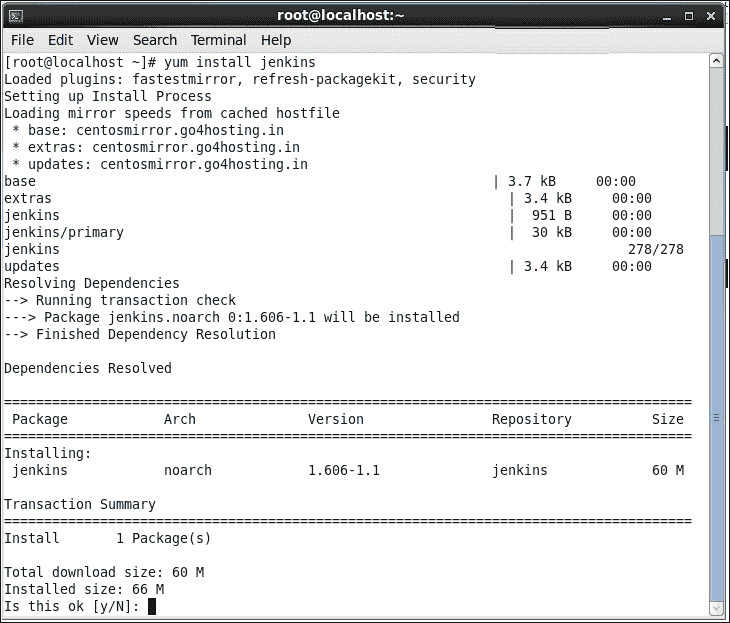
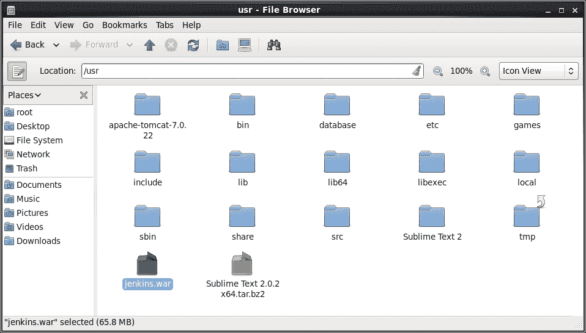
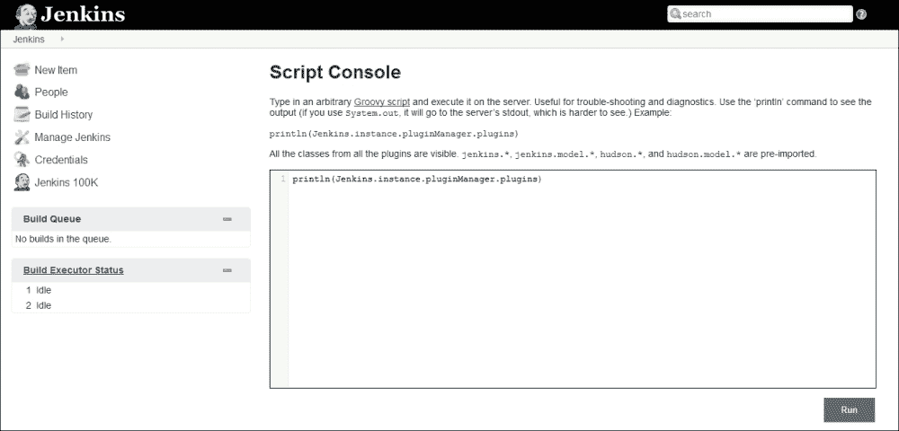
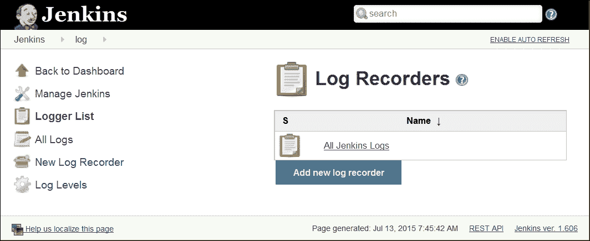
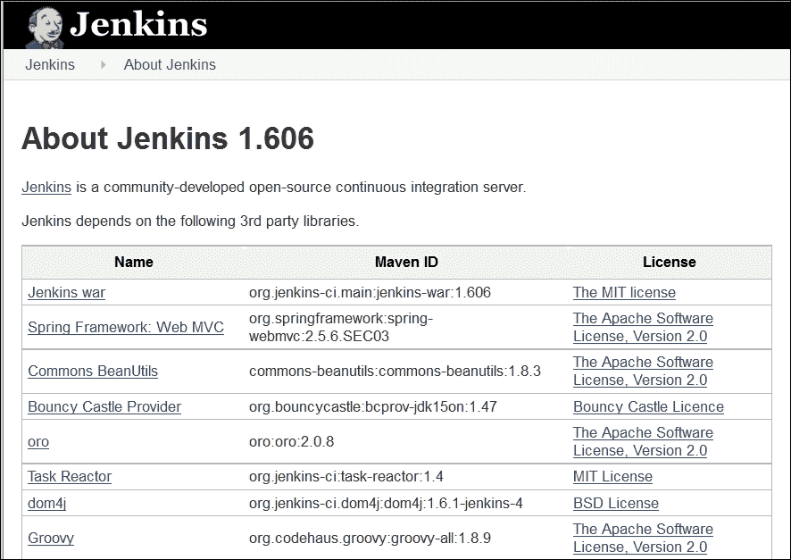
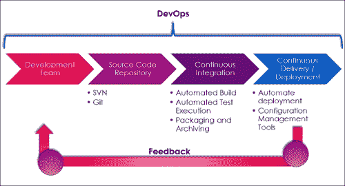

# 一、探索Jenkins

|   | *“持续的努力——而不是力量或智力——是释放我们潜力的关键。”* |   |
|   | - *温斯顿·丘吉尔* |

Jenkins 是一个用 Java 编写的开源应用。它是最流行的**持续集成** ( **CI** )工具之一，用于构建和测试不同类型的项目。在本章中，我们将对Jenkins、基本特征及其对 DevOps 文化的影响进行快速概述。在我们开始使用 Jenkins 之前，我们需要安装它。在本章中，我们提供了安装 Jenkins 的分步指南。安装 Jenkins 是一项非常简单的任务，并且不同于操作系统的风格。

我们还将学习Jenkins的基本配置。我们将快速浏览Jenkins用户界面和插件安装的一些关键部分。本章还将介绍 DevOps 管道，以及其余章节将如何实现它。

准确地说，我们将在本章中讨论以下主题:

*   Jenkins及其特点简介
*   在视窗和中央操作系统上安装Jenkins
*   Jenkins仪表盘的快速入门之旅
*   如何在 Jenkins 中更改配置设置
*   什么是部署管道

各就各位，准备出发！

# Jenkins及其特征简介

我们先了解一下什么是持续集成。CI 是最近最流行的应用开发实践之一。开发人员将 bug 修复、新特性开发或创新功能集成到代码库中。配置项工具通过自动构建和自动测试执行来验证集成过程，以检测应用当前来源的问题，并提供快速反馈。

Jenkins 是一个简单、可扩展、用户友好的开源工具，为应用开发提供 CI 服务。Jenkins 支持 StarTeam、Subversion、CVS、Git、AccuRev 等 SCM 工具。Jenkins 可以构建基于自由式、Apache Ant 和 Apache Maven 的项目。

插件的概念让 Jenkins 更有吸引力，容易学习，也容易使用。有各种类型的插件可用，如源代码管理、从属启动器和控制器、构建触发器、构建工具、构建通知、构建报告、其他构建后操作、外部站点/工具集成、用户界面插件、身份验证和用户管理、安卓开发、iOS 开发等。NET 开发、Ruby 开发、库插件等等。

Jenkins 定义了对构建系统的一个方面建模的接口或抽象类。接口或抽象类定义了需要实现什么的协议；Jenkins 使用插件来扩展这些实现。

### 注

要了解更多关于所有插件的信息，请访问 https://wiki.jenkins-ci.org/x/GIAL T2。

要了解如何创建一个新的插件，请访问[https://wiki.jenkins-ci.org/x/TYAL](https://wiki.jenkins-ci.org/x/TYAL)。

要下载不同版本的插件，请访问[https://updates.jenkins-ci.org/download/plugins/](https://updates.jenkins-ci.org/download/plugins/)。

## 特征

Jenkins是市场上最受欢迎的 CI 服务器之一。其受欢迎的原因如下:

*   易于在不同的操作系统上安装。
*   易于升级—Jenkins的发布周期非常快。
*   简单易用的用户界面。
*   使用第三方插件可轻松扩展-超过 400 个插件。
*   易于在用户界面中配置安装环境。也可以根据喜好定制用户界面。
*   主从架构支持分布式构建，以减少配置项服务器上的负载。
*   Jenkins 可以使用围绕 JUnit 构建的测试工具；测试结果以图形和表格形式提供。
*   基于 cron 表达式构建调度(要了解 cron 的更多信息，请访问[http://en.wikipedia.org/wiki/Cron](http://en.wikipedia.org/wiki/Cron))。
*   在预构建步骤中执行 Shell 和 Windows 命令。
*   与构建状态相关的通知支持。

# 在 Windows 和 CentOS 上安装 Jenkins

1.  Go to [https://jenkins-ci.org/](https://jenkins-ci.org/). Find the **Download Jenkins** section on the home page of Jenkins's website.

    

2.  根据您的操作系统下载`war`文件或原生包。运行Jenkins需要一个 Java 安装。
3.  在操作系统上安装基于 Java 的，并相应设置 JAVA_HOME 环境变量。

## 在 Windows 上安装Jenkins

1.  选择适用于窗口的原生软件包。它会下载`jenkins-1.xxx.zip`。在我们的情况下，它会下载`jenkins-1.606.zip`。提取它，你会得到`setup.exe`和`jenkins-1.606.msi`文件。
2.  Click on `setup.exe` and perform the following steps in sequence. On the welcome screen, click **Next**:

    

3.  选择目标文件夹，点击**下一步**。
4.  Click on **Install** to begin installation. Please wait while the Setup Wizard installs Jenkins.

    

5.  Once the Jenkins installation is completed, click on the **Finish** button.

    

6.  Verify the Jenkins installation on the Windows machine by opening URL `http://<ip_address>:8080` on the system where you have installed Jenkins.

    

## 在中央操作系统上安装Jenkins

1.  要在 CentOS 上安装Jenkins，请在`/etc/yum.repos.d/`将Jenkins存储库定义下载到您的本地系统并导入密钥。
2.  Use the `wget -O /etc/yum.repos.d/jenkins.repo http://pkg.jenkins-ci.org/redhat/jenkins.repo` command to download `repo`.

    

3.  Now, run `yum install Jenkins`; it will resolve dependencies and prompt for installation.

    

4.  Reply with `y` and it will download the required package to install Jenkins on CentOS. Verify the Jenkins status by issuing the `service jenkins status` command. Initially, it will be stopped. Start Jenkins by executing `service jenkins start` in the terminal.

    

5.  Verify the Jenkins installation on the CentOS machine by opening the URL `http://<ip_address>:8080` on the system where you have installed Jenkins.

    

## 将 Jenkins 安装为网络应用

1.  下载 **Java 网页存档(。战争)**(最新最伟大的(1.606))来自[http://jenkins-ci.org/](http://jenkins-ci.org/)。
2.  Copy `jenkins.war` into your virtual or physical machine. Open Command Prompt or a terminal based on the operation system. In our case, we will copy it into a directory of a CentOS virtual machine.

    

3.  Open Command Prompt and execute the `java –jar Jenkins.war` command. Verify the Jenkins installation on the system by opening the `http://<ip_address>:8080` URL on the system where you have installed Jenkins.

    

# Jenkins仪表盘的快速入门之旅

1.  On the Jenkins dashboard, click on **Create new jobs** or on **New Item** to create Freestyle- or Maven-based projects for CI.

    

2.  To verify system properties, visit `http://<ip_address>:8080/systeminfo` or click on **Manage Jenkins**, and then click on **System Information** to get environmental information to assist troubleshooting.

    

# 如何在 Jenkins 中更改配置设置

1.  Click on the **Manage Jenkins** link on the dashboard to configure system, security, to manage plugins, slave nodes, credentials, and so on.

    

2.  Click on the **Configure System** link to configure Java, Ant, Maven, and other third-party products' related information.

    

3.  Jenkins uses Groovy as its scripting language. To execute the arbitrary script for administration/trouble-shooting/diagnostics on the Jenkins dashboard, go to the **Manage Jenkins** link on the dashboard, click on **Script Console**, and run `println(Jenkins.instance.pluginManager.plugins)`.

    

4.  To verify the system log, go to the **Manage Jenkins** link on the dashboard and click on the **System Log** link or visit `http://localhost:8080/log/all`.

    

5.  To get more information on third-party libraries—version and license information in Jenkins, go to the **Manage Jenkins** link on the dashboard and click on the **About Jenkins** link.

    

# 什么是部署管道？

应用开发生命周期传统上是一个漫长的手动过程。此外，它需要开发和运营团队之间的有效协作。部署管道展示了应用开发生命周期中涉及的自动化，包括自动化的构建执行和测试执行、对涉众的通知以及在不同运行时环境中的部署。实际上，部署管道是配置项和持续交付的组合，因此是 DevOps 实践的一部分。下图描述了部署管道流程:

开发团队的成员将代码检查到源代码库中。Jenkins等 CI 产品被配置为从代码存储库中轮询更改。存储库中的更改被下载到本地工作区，Jenkins 触发了一个自动化的构建过程，该过程由 Ant 或 Maven 辅助。自动化测试执行或单元测试、静态代码分析、报告以及成功或失败的构建过程的通知也是 CI 过程的一部分。

一旦构建成功，就可以将其部署到不同的运行时环境中，如测试、预生产、生产等。根据 JEE 应用部署`war`文件通常是部署管道的最后阶段。

部署管道的最大好处之一是更快的反馈周期。在早期阶段识别应用中的问题，并且不依赖于人工努力，这使得整个端到端过程更加有效。

在接下来的章节中，我们将看到Jenkins如何被用于实现信息技术现代化的CI实践。

### 注

欲了解更多信息，请访问[http://martinfowler.com/bliki/DeploymentPipeline.html](http://martinfowler.com/bliki/DeploymentPipeline.html)和[http://www.informit.com/articles/article.aspx?p=1621865&seqNum = 2](http://www.informit.com/articles/article.aspx?p=1621865&seqNum=2)。

# 自测题

Q1。Jenkins是什么？

1.  持续集成产品
2.  持续交付的产品

Q2。是什么让Jenkins具有可扩展性？

1.  插件
2.  开源发行版

Q3。哪个命令用于运行`war`格式的Jenkins安装文件？

1.  Java–jar`Jenkins.war`
2.  Java–j`Jenkins.war`

Q4。我们如何在Jenkins仪表盘上获取系统信息？

1.  访问`http://<ip_address>:8080/manage`
2.  访问`http://<ip_address>:8080/systeminfo`

Q5。我们如何在 Jenkins 仪表板上更改配置的全局设置？

1.  点击仪表板上的**管理Jenkins**链接
2.  点击仪表盘上的**凭证**链接

Q6。什么是部署管道？

1.  持续集成实践
2.  持续交付实践
3.  演示应用开发生命周期中涉及的自动化
4.  以上都不是

Q7。解释部署管道的好处？

1.  更快的反馈周期
2.  在早期阶段识别应用中的问题
3.  不依赖人工努力
4.  上述全部

# 总结

恭喜你！本章已经结束，因此我们已经在物理或虚拟机上安装了 Jenkins，您已经准备好进入下一章了。到目前为止，我们已经介绍了CI的基础知识，并介绍了Jenkins及其特点。我们在 Windows 和 CentOS 平台上完成了 Jenkins 的安装。我们还完成了Jenkins仪表板中可用功能的快速浏览。除此之外，我们还讨论了部署管道及其在 CI 中的重要性。

现在我们可以使用我们的 CI 服务器 Jenkins 了，我们可以开始创建一个作业并验证 Jenkins 是如何工作的。