# 二、代码存储库和构建工具的安装和配置

|   | *“生活真的很简单，但我们坚持让它变得复杂”* |   |
|   | -孔子 |

我们在上一章看到了部署管道，其中源代码存储库和自动化构建构成了重要的一部分。SVN、Git、CVS 和 StarTeam 是一些管理代码、工件或文档变更的流行代码存储库，而 Ant 和 Maven 是 Java 应用的流行构建自动化工具。

本章详细描述了如何使用 Java 应用为生命周期管理准备运行时环境，并使用 Jenkins 对其进行配置。它将涵盖如何集成 Eclipse 和代码存储库，如 SVN，以创建持续集成的基础。以下是本章涵盖的主题列表:

*   Jenkins的构建及其需求概述
*   安装 Java 和配置环境变量
*   CentOS 和 Windows 上的 SVN 安装、配置和操作
*   安装蚂蚁
*   在Jenkins配置蚂蚁、马文和 JDK
*   将 Eclipse 与代码存储库集成
*   安装和配置 Git
*   用 Git 在Jenkins创建一个新的构建作业

# Jenkins的构建及其需求概述

为了解释持续集成，我们将使用安装在物理机器或笔记本电脑上的代码存储库，而 Jenkins 安装在虚拟机上，正如[第 1 章](01.html "Chapter 1. Exploring Jenkins")、*探索 Jenkins* 中以不同方式建议的那样。下图描述了运行时环境的设置:


我们在[第 1 章](01.html "Chapter 1. Exploring Jenkins")*探索Jenkins*中看到，仪表盘上的**管理Jenkins**链接用于配置系统。点击**配置系统**链接，配置 Java、Ant、Maven 等第三方产品相关信息。我们可以使用虚拟机箱或 VMware 工作站来创建虚拟机。我们需要安装所有必需的软件，为持续集成提供运行时环境。我们假设系统中已经安装了 Java。

# 安装 Java 并配置环境变量

如果系统中还没有安装 Java，那么可以按如下方式安装:

在 CentOS 存储库中找到可用的 Java 相关包，并找到要安装的合适包。

```
[root@localhost ~]# yum search java
Loaded plugins: fastestmirror, refresh-packagekit, security
.
.
ant-javamail.x86_64 : Optional javamail tasks for ant
eclipse-mylyn-java.x86_64 : Mylyn Bridge:  Java Development
.
.
java-1.5.0-gcj.x86_64 : JPackage runtime compatibility layer for GCJ
java-1.5.0-gcj-devel.x86_64 : JPackage development compatibility layer for GCJ
java-1.5.0-gcj-javadoc.x86_64 : API documentation for libgcj
java-1.6.0-openjdk.x86_64 : OpenJDK Runtime Environment
java-1.6.0-openjdk-devel.x86_64 : OpenJDK Development Environment
java-1.6.0-openjdk-javadoc.x86_64 : OpenJDK API Documentation
java-1.7.0-openjdk.x86_64 : OpenJDK Runtime Environment
jcommon-serializer.x86_64 : JFree Java General Serialization Framework
.
.
Install the identified package java-1.7.0-openjdk.x86_64
[root@localhost ~]# yum install java-1.7.0-openjdk.x86_64
Loaded plugins: fastestmirror, refresh-packagekit, security
No such command: in. Please use /usr/bin/yum –help

```

现在，通过执行如下`yum install`命令，安装本地存储库中可用的 Java 包:

```
[root@localhost ~]# yum install java-1.7.0-openjdk.x86_64
Loaded plugins: fastestmirror, refresh-packagekit, security
Loading mirror speeds from cached hostfile
Setting up Install Process
Resolving Dependencies
--> Running transaction check
---> Package java-1.7.0-openjdk.x86_64 1:1.7.0.3-2.1.el6.7 will be installed
--> Finished Dependency Resolution

Dependencies Resolved
.
.
Install       1 Package(s)

Total download size: 25 M
Installed size: 89 M
Is this ok [y/N]: y
Downloading Packages:
java-1.7.0-openjdk-1.7.0.3-2.1.el6.7.x86_64.rpm                                                                                                  |  25 MB     00:00
Running rpm_check_debug
Running Transaction Test
Transaction Test Succeeded
Running Transaction
 Installing : 1:java-1.7.0-openjdk-1.7.0.3-2.1.el6.7.x86_64                                       1/1
 Verifying  : 1:java-1.7.0-openjdk-1.7.0.3-2.1.el6.7.x86_64                                      1/1

Installed:
 java-1.7.0-openjdk.x86_64 1:1.7.0.3-2.1.el6.7
Complete!

```

从本地存储库中成功安装 Java。

## 配置环境变量

以下是配置环境变量的步骤:

1.  设置`JAVA_HOME`和`JRE_HOME`变量
2.  转到`/root`
3.  按 *Ctrl* + *H* 列出隐藏文件
4.  Find `.bash_profile` and edit it by appending the Java path, as shown in the following screenshot:

    

# 在 CentOS 和 Windows 上安装、配置和操作 SVN

从 CentOS 上的本地存储库中安装 SVN。

## 在中央操作系统上安装 SVN

要在 CentOS 机器上安装 SVN，请执行如下`yum install mod_dav_svn subversion`命令:

```
[root@localhost ~]# yum install mod_dav_svn subversion
Loaded plugins: fastestmirror, refresh-packagekit, security
Loading mirror speeds from cached hostfile
Setting up Install Process
Resolving Dependencies
--> Running transaction check
---> Package mod_dav_svn.x86_64 0:1.6.11-7.el6 will be installed
---> Package subversion.x86_64 0:1.6.11-7.el6 will be installed
--> Processing Dependency: perl(URI) >= 1.17 for package: subversion-1.6.11-7.el6.x86_64
--> Running transaction check
---> Package perl-URI.noarch 0:1.40-2.el6 will be installed
--> Finished Dependency Resolution

Dependencies Resolved
.
.
Installed:
 mod_dav_svn.x86_64 0:1.6.11-7.el6                                                   subversion.x86_64 0:1.6.11-7.el6

Dependency Installed:
 perl-URI.noarch 0:1.40-2.el6
Complete!
[root@localhost ~]#

```

### 配置 SVN

使用`htpasswd`命令创建密码文件。首先使用`-cm`参数。这将创建文件，并使用 MD5 加密密码。如果您需要添加用户，请确保您在初始创建后仅使用`-m`标志，而不是`–c`。

```
[root@localhost conf.d]# htpasswd -cm /etc/svn-auth-conf yourusername
New password:
Re-type new password:
Adding password for user yourusername
[root@localhost conf.d]#

[root@localhost conf.d]# htpasswd -cm /etc/svn-auth-conf mitesh
New password:
Re-type new password:
Adding password for user mitesh
[root@localhost conf.d]#

```

现在在 Apache 中配置 SVN 以集成两者。编辑`/etc/httpd/conf.d/subversion.conf`。该位置是 Apache 将在网址栏中传递的内容。

```
LoadModule dav_svn_module     modules/mod_dav_svn.so
LoadModule authz_svn_module   modules/mod_authz_svn.so

#
# Example configuration to enable HTTP access for a directory
# containing Subversion repositories, "/var/www/svn".  Each repository
# must be both:
#
#   a) readable and writable by the 'apache' user, and
#
#   b) labelled with the 'httpd_sys_content_t' context if using
#   SELinux
#

#
# To create a new repository "http://localhost/repos/stuff" using
# this configuration, run as root:
#
#   # cd /var/www/svn
#   # svnadmin create stuff
#   # chown -R apache.apache stuff
#   # chcon -R -t httpd_sys_content_t stuff
#

<Location />
 DAV svn
 SVNParentPath /var/www/svn/
#
#   # Limit write permission to list of valid users.
#   <LimitExcept GET PROPFIND OPTIONS REPORT>
#      # Require SSL connection for password protection.
#      # SSLRequireSSL
#
 AuthType Basic
 SVNListParentPath on
 AuthName "Subversion repos"
 AuthUserFile /etc/svn-auth-conf
 Require valid-user
#   </LimitExcept>
</Location>

```

现在所有配置完成。让我们对 SVN 进行手术。

### SVN 运营

创建在 CentOS 虚拟机上执行 SVN 操作的实际存储库。

```
[root@localhost ~] cd /var/www/ -- Or wherever you placed your path above
[root@localhost ~] mkdir svn
[root@localhost ~] cd svn
[root@localhost ~] svnadmin create repos
[root@localhost ~] chown -R apache:apache repos
[root@localhost ~] service httpd restart

```

### 将目录导入 SVN

创建一个样本文件夹结构来测试 SVN 操作。用名为`main`、`configurations`和`resources`的子目录创建`mytestproj`目录。在每个子目录中创建示例文件。

```
[root@localhost mytestproj]# svn import /tmp/mytestproj/ file:///var/www/svn/repos/mytestproj -m "Initial repository layout for mytestproj"
Adding         /tmp/mytestproj/main
Adding         /tmp/mytestproj/main/mainfile1.cfg
Adding         /tmp/mytestproj/configurations
Adding         /tmp/mytestproj/configurations/testconf1.cfg
Adding         /tmp/mytestproj/resources
Adding         /tmp/mytestproj/resources/testresources1.cfg
Committed revision 1.

```

从网络浏览器验证存储库:`http://localhost/repos`。

### 从 SVN 退房

要从存储库中签出源代码，请执行以下操作:

1.  启动`httpd`服务。

    ```
    [root@localhost testmit]# service httpd restart
    Stopping httpd:
    [  OK  ]
    Starting httpd: httpd: Could not reliably determine the server's fully qualified domain name, using localhost.localdomain for ServerName
    [  OK  ]

    ```

2.  查看源代码。

    ```
    [root@localhost testmit]# svn co http://localhost/repos/mytestproj
    Authentication realm: <http://localhost:80> Subversion repos
    Password for 'root':
    Authentication realm: <http://localhost:80> Subversion repos
    Username: mitesh
    Password for 'mitesh':xxxxxxxxx

    -----------------------------------------------------------------------
    ATTENTION!  Your password for authentication realm:

     <http://localhost:80> Subversion repos

    can only be stored to disk unencrypted! You are advised to configure your system so that Subversion can store passwords encrypted, if possible. See the documentation for details.

    ```

3.  您可以通过在`/root/.subversion/servers`中将`store-plaintext-passwords`选项的值设置为`yes`或`no`来避免将来出现此警告。

    ```
    -----------------------------------------------------------------------
    Store password unencrypted (yes/no)? no
    A    mytestproj/main
    A    mytestproj/main/mainfile1.cfg
    A    mytestproj/configurations
    A    mytestproj/configurations/testconf1.cfg
    A    mytestproj/options
    A    mytestproj/options/testopts1.cfg
    Checked out revision 1.

    ```

## Windows 上的 VisualSVN 服务器

1.  从:[https://www.visualsvn.com/server/download/](https://www.visualsvn.com/server/download/)下载 VisualSVN 服务器。它允许你安装和管理一个全功能的颠覆服务器。
2.  执行`VisualSVN-Server-x.x.x-x64.msi`并按照向导安装 VisualSVN 服务器。
3.  打开 VisualSVN 服务器管理器。
4.  Create a new repository, `JenkinsTest`.

    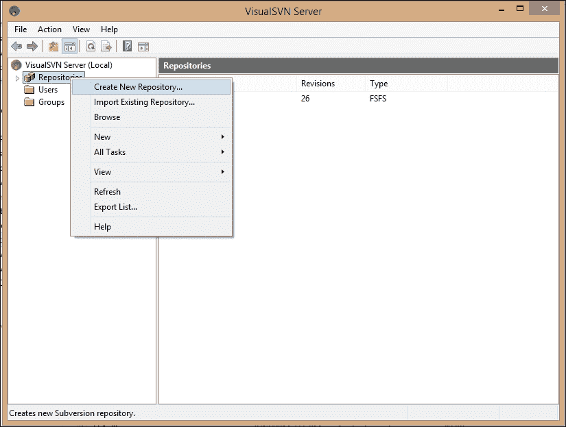

5.  Select the regular subversion repository and click on **Next >**.

    

6.  Provide the **Repository Name** and click on **Next >**.

    

7.  Select **Single-project repository** and click on **>**.

    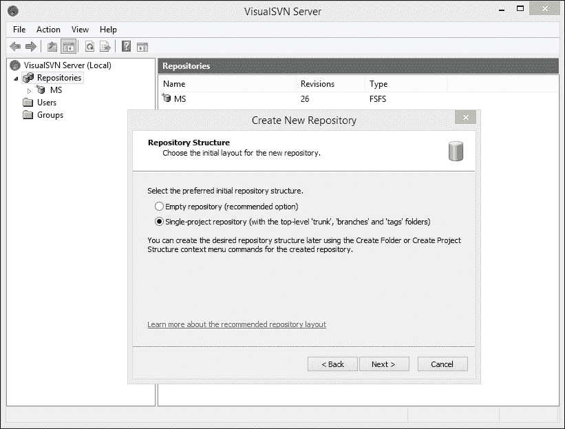

8.  Select the Repository Access Permissions based on your requirements and click on **Create**.

    

9.  Review the created repository details and click on **Finish**.

    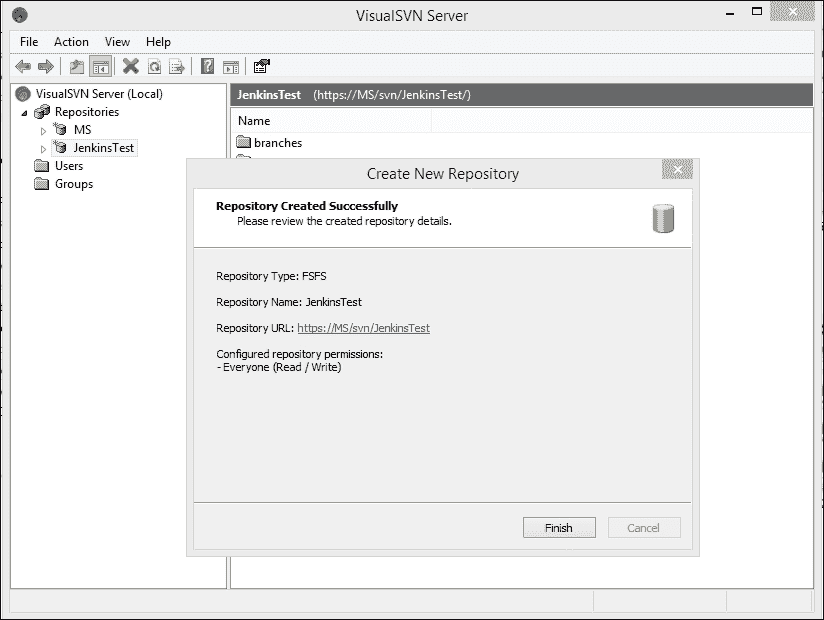

10.  Verify the newly created repository in VisualSVN Server Manager.

    

11.  Verify the repository location in the browser, as shown in the following screenshot:

    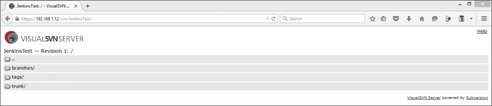

12.  现在安装来自:[http://sourceforge.net/projects/tortoisesvn/](http://sourceforge.net/projects/tortoisesvn/)的 SVN 客户端，执行 SVN 操作。

让我们在 Eclipse 中创建一个示例 JEE 项目来说明 SVN 和 Eclipse 的集成。

1.  Open Eclipse, go to the **File** menu and click on **Dynamic Web Project**.

    

2.  It will open a dialog box to create a **New Dynamic Web Project**.

    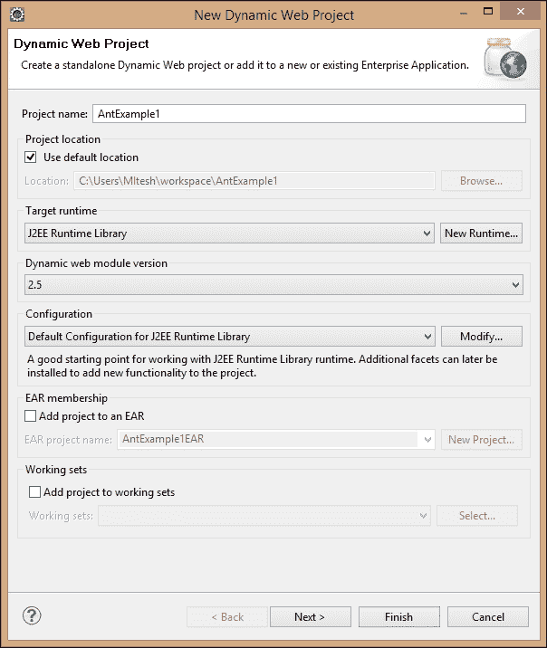

3.  Create the source files and a `build` file for a simple project.

    

4.  Go to **Application Directory**, right-click on it, select **TortoiseSVN**, and select **Import** from the sub-menu.

    

5.  Enter the repository URL and click on **OK**.

    

6.  It will add all files from the application to SVN, as shown in the following screenshot.

    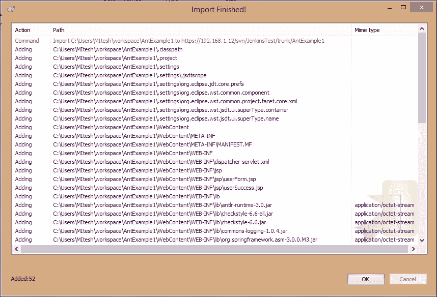

7.  Verify the import by visiting the SVN repository in a browser as shown:

    

# 将 Eclipse 与代码库集成

1.  打开 Eclipse IDE，转到**帮助**菜单，点击**安装新软件**。
2.  Add the repository by adding this URL: [http://subclipse.tigris.org/update_1.10.x](http://subclipse.tigris.org/update_1.10.x), then select all packages and click on **Next >**.

    

3.  在向导中查看要安装的项目和查看许可证。接受协议条款，点击**完成**。
4.  重启 Eclipse。进入**窗口**菜单，选择**显示视图**，点击**其他**，找到 SVN 和 SVN 库。
5.  In the SVN repositories area, right-click and select **New**; select **Repository Location…** from the sub-menu.

    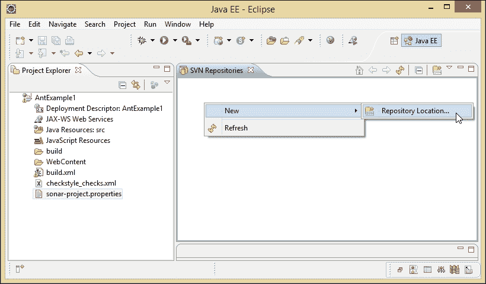

6.  在 Eclipse 中添加一个新的 SVN 存储库，网址为:`https://<Ip address/ localhost / hostname>/svn/JenkinsTest/`。
7.  Click on **Finish**.

    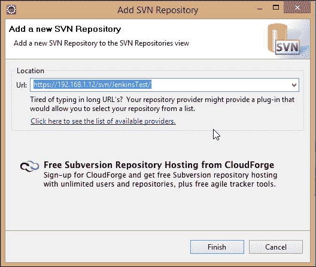

8.  Verify the SVN repository.

    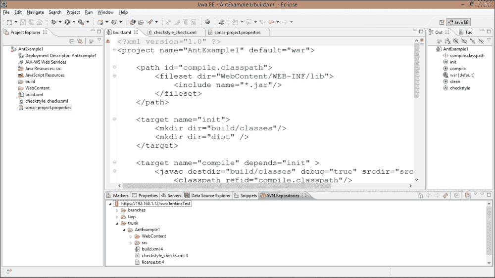

尝试将安装在 CentOS 上的 SVN 与 Eclipse IDE 集成，作为练习。

# 安装和配置 Ant

1.  从:[https://ant.apache.org/bindownload.cgi](https://ant.apache.org/bindownload.cgi)下载蚂蚁分布并解压。
2.  Set the `ANT_HOME` and `JAVA_HOME` environment variables.

    

Jenkins中有一个选项可以自动安装 Ant 或 Maven。我们将在Jenkins部分的*配置蚂蚁、马文和 JDK 中研究这一点。*

# 安装 Maven

从[https://maven.apache.org/download.cgi](https://maven.apache.org/download.cgi)和下载Maven 二进制 ZIP 文件，并将其提取到安装了 Jenkins 的本地系统。

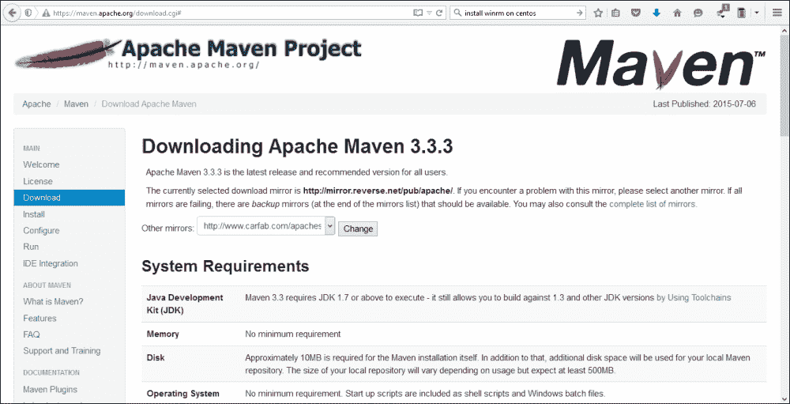

# 在Jenkins配置蚂蚁、马文和 JDK

1.  在浏览器中打开Jenkins仪表盘，网址为:`http://<ip_address>:8080/configure`。进入**管理Jenkins**部分，点击**配置系统**。
2.  Configure Java, based on the installation shown in the following screenshot:

    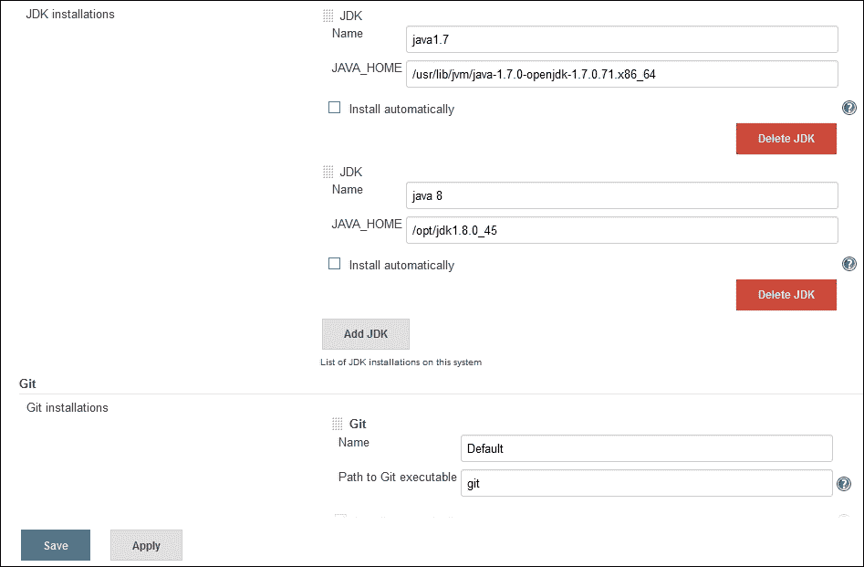

3.  Configure or install Ant automatically on the same page. Configure Maven as well.

    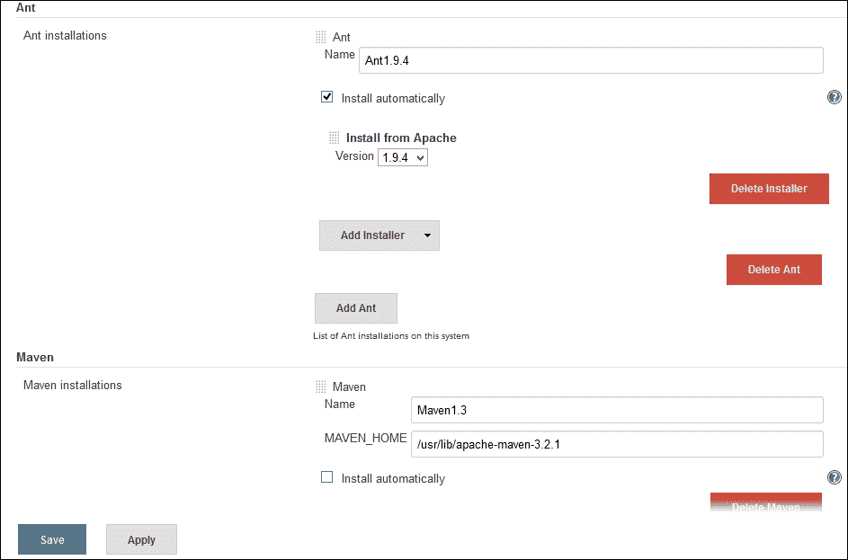

# 安装和配置 Git

Git 是一个自由开源的分布式版本控制系统。在本节中，我们将尝试安装和配置 Git。

1.  在基于 CentOS 的系统中打开终端，在终端中执行`yum install git`命令。
2.  安装成功后，使用`git --version`命令验证版本。
3.  使用`git config`命令提供关于用户的信息，以便生成带有正确信息的`commit`消息。
4.  提供要嵌入提交的名称和电子邮件地址。
5.  To create a workspace environment, create a directory called `git` in the home directory and then create a subdirectory inside of that called `development`.

    在终端使用`mkdir -p ~/git/development ; cd ~/git/development`。

6.  将`AntExample1`目录复制到`development`文件夹中。
7.  使用`git init`命令将现有项目转换为工作空间环境。
8.  Once the repository is initialized, add files and folders.

    

9.  Commit by executing `git commit -m "Initial Commit" –a`.

    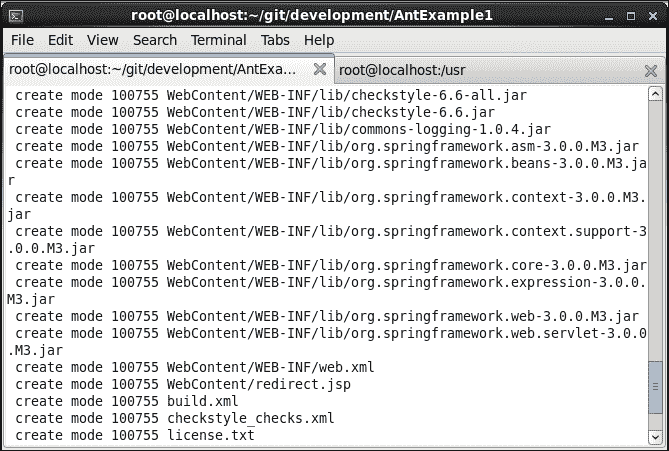

10.  Verify the Git repository

    

11.  Verify the project in the Git repository.

    

# 用 Git 在Jenkins创建一个新的构建作业

1.  在Jenkins仪表盘上，点击**管理Jenkins**并选择**管理插件**。点击**可用**选项卡，在搜索框中写下`github`插件。
2.  点击复选框，点击按钮，**立即下载，重启**后安装。
3.  Restart Jenkins.

    

4.  Create a new **Freestyle project**. Provide **Item name** and click on **OK**.

    

5.  Configure **Git** in the **Source Code Management** section.

    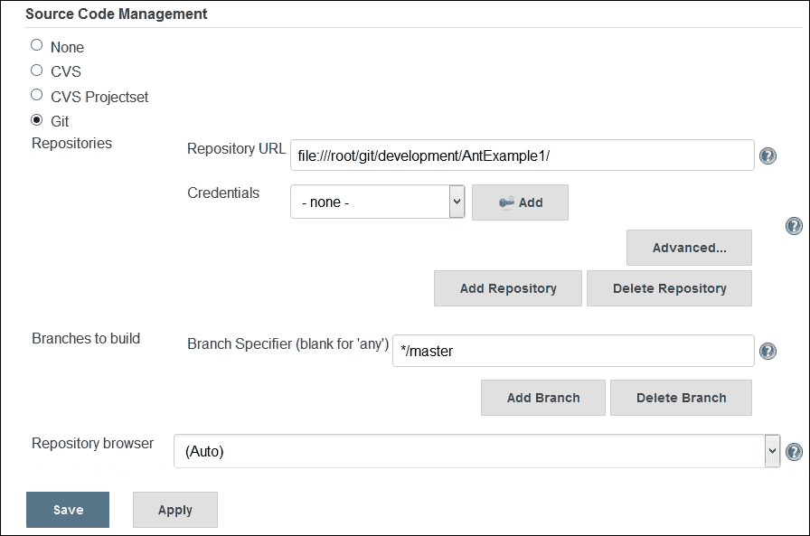

6.  Add the **Invoke Ant** build step by clicking on **Add build step**.

    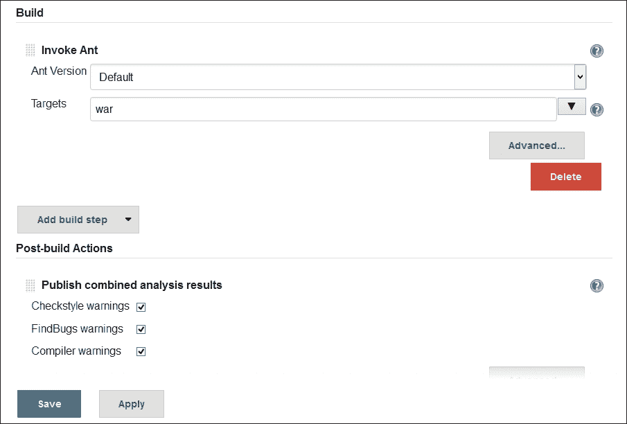

7.  Execute the build.

    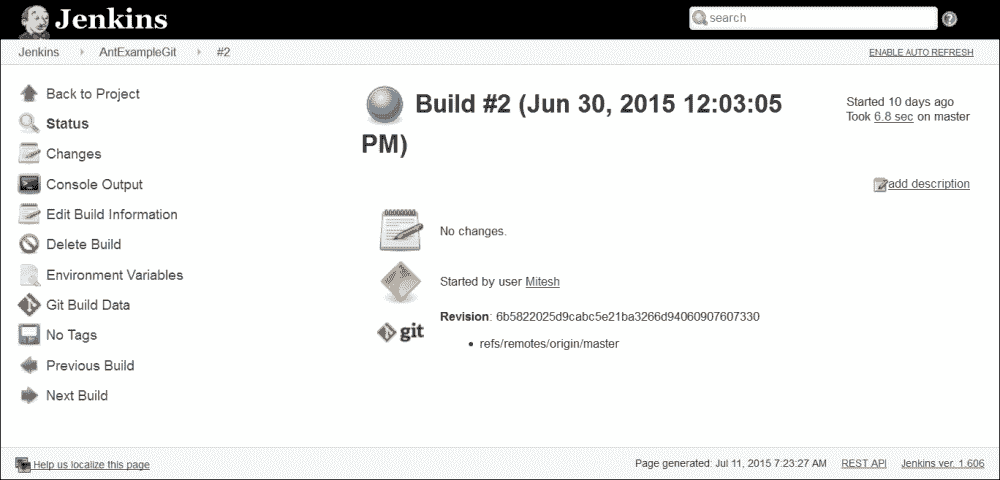

8.  Click on **Console Output** to see the progress of the build.

    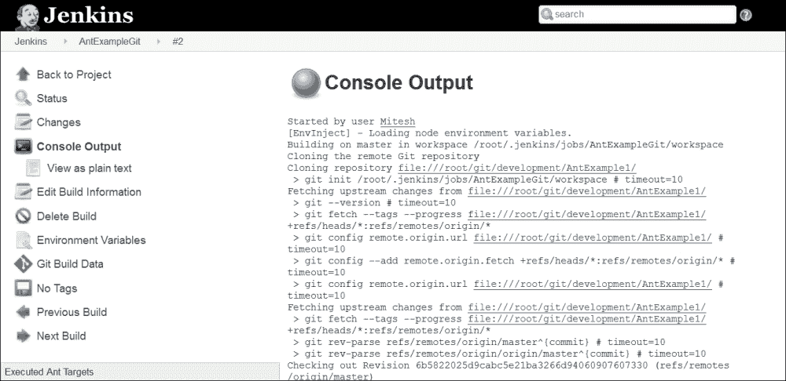

9.  Once the build has succeeded, verify **Workspace** in the build job.

    

10.  搞定了。

# 自测题

Q1。在哪里设置`JAVA_HOME`和`JRE_HOME`环境变量？

1.  `/root/ .bash_profile`
2.  `/root/ .env_profile`
3.  `/root/ .bash_variables`
4.  `/root/ .env_variables`

Q2。哪些是有效的 SVN 行动？

1.  `svn import /tmp/mytestproj/`
2.  `svn co http://localhost/repos/mytestproj`
3.  以上两者

Q3。你在Jenkins哪里配置 Java 和 Ant？

1.  进入**管理Jenkins**部分，点击**配置系统**
2.  进入**管理Jenkins**部分，点击**全局配置**

# 总结

万岁！我们已经到了这一章的结尾。我们已经介绍了如何通过设置本地 CentOS 存储库、在 CentOS 和 Windows 上安装 SVN 等代码存储库以及构建工具 Ant 来准备持续集成的环境。我们还在 Jenkins 中看到了关于如何配置存储库和构建工具的详细说明。最后，我们已经介绍了如何将集成开发环境与代码存储库集成，以便进行高效的开发和轻松的`commit`操作，从而促进部署管道流程。