# 第六章。管理代码质量和通知

|   | *“通过非常小的增量变化来限制你的负担”* |   |
|   | - *匿名* |

我们看到了各种客户是如何根据他们的需求在云上使用詹金斯的。我们还看到了 Red Hat OpenShift 和 CloudBees 提供的基于云的产品，以及了解如何有效使用 Jenkins 的案例研究。现在，是时候了解代码质量检查和构建失败通知的其他方面了。

本章将教你如何将静态代码分析行为集成到 Jenkins 中。代码质量是影响应用程序有效性的一个极其重要的特性，通过将它与声纳、Checkstyle、FindBugs 和其他工具集成，用户可以深入了解代码中有问题的部分。

*   与声纳集成
*   探索静态代码分析插件
*   生成状态的电子邮件通知

# 与声纳集成

代码的质量是 DevOps 文化的重要方面之一。它提供质量检查突出可靠性、安全性、效率、可移植性、可管理性等水平。它有助于发现源代码中的 bug 或 bug 的可能性，并设置文化以与组织中的编码标准保持一致。

SonarQube 是持续检查代码质量的开源平台。它支持 Java、C#、PHP、Python、C/C++、Flex、Groovy、JavaScript、PL/SQL、COBOL、Objective-C、Android 开发等等。它提供关于编码标准、代码覆盖率、复杂代码、单元测试、重复代码、潜在错误、注释、设计和架构的报告。

1.  Go to [http://www.sonarqube.org/downloads/](http://www.sonarqube.org/downloads/), and download SonarQube 5.1.

    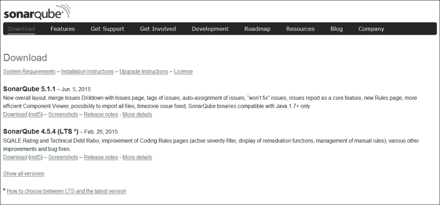

2.  Extract files, and it will look similar to the following screenshot:

    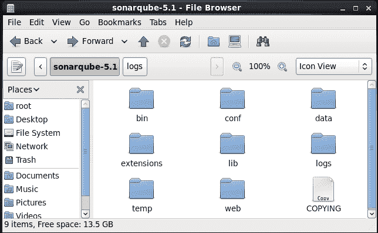

3.  Go to the `bin` folder to run SonarQube based on the operating system on which you want to run Sonar.

    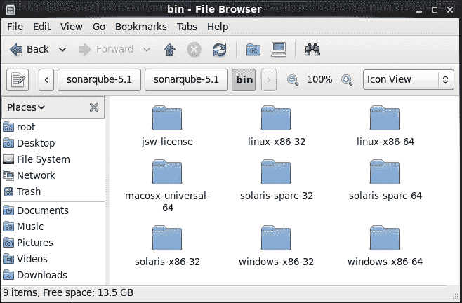

4.  Select a folder based on your platform, in our case, we are installing it on CentOS, and so we will select `linux-x86-64`.

    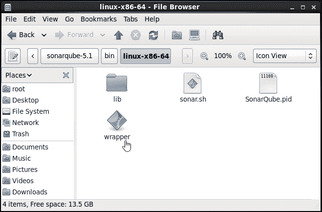

5.  Open the terminal and go to the SonarQube home directory; go to `bin/linux-x86-64/` and run `sonar.sh`. We need to use parameters with `sonar.sh`, as shown in the following usage:

    ```
    [root@localhost linux-x86-64]# ./sonar.sh
    Usage: ./sonar.sh { console | start | stop | restart | status | dump }

    ```

    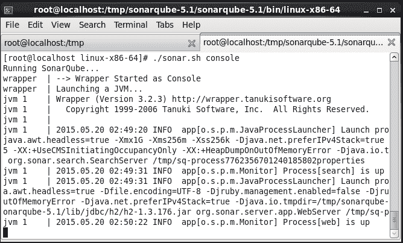

6.  Visit `http://localhost:9000/` or `http://<IP address>:9000/`.

    

7.  Explore **Rules** in the SonaQube dashboard.

    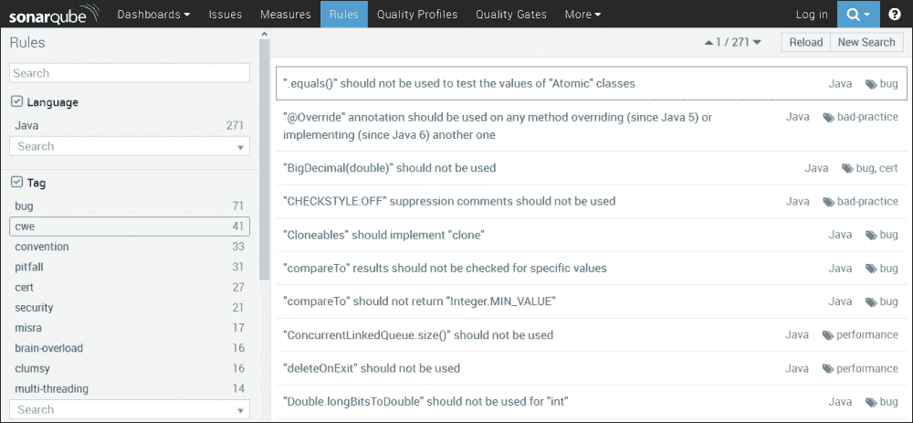

8.  Verify **Settings** in the SonaQube dashboard.

    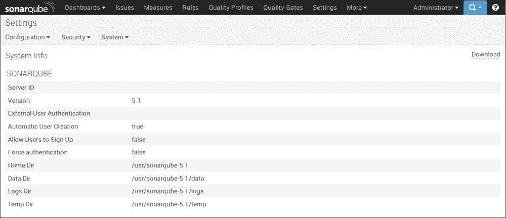

9.  创建`sonar-project.properties`，并将其保存在存储项目的存储库中:

    ```
    # must be unique in a given SonarQube instance
    sonar.projectKey=Ant:project
    # this is the name displayed in the SonarQube UI
    sonar.projectName=Ant project
    sonar.projectVersion=1.0
    sonar.sources=src

    ```

10.  Install the SonarQube plugin in Jenkins. To know more on this, visit [https://wiki.jenkins-ci.org/display/JENKINS/SonarQube+plugin](https://wiki.jenkins-ci.org/display/JENKINS/SonarQube+plugin).

    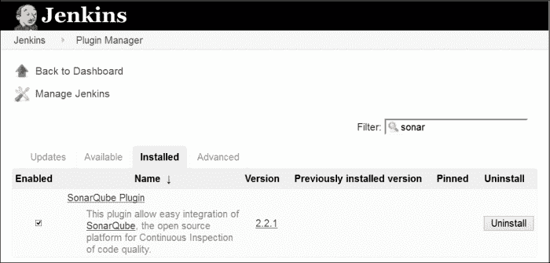

11.  Click on **Manage Jenkins** and go to **Configure System**. Go to the **SonarQube** section, and configure SonarQube in Jenkins.

    

12.  Add Build step to **Invoke Standalone SonarQube Analysis** in a build Job.

    

13.  Run the build job, and if you get a certificate error, execute the `svn export` command to solve the certificate issue.

    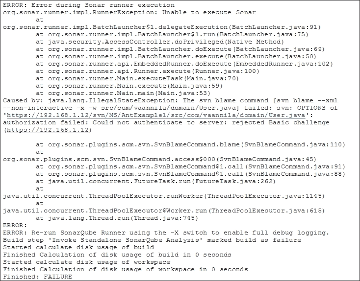

14.  Execute the `svn export` command to solve certificate issue on a virtual machine where SonarQube and Jenkins are installed, as shown in the following screenshot:

    

15.  Run the build job.

    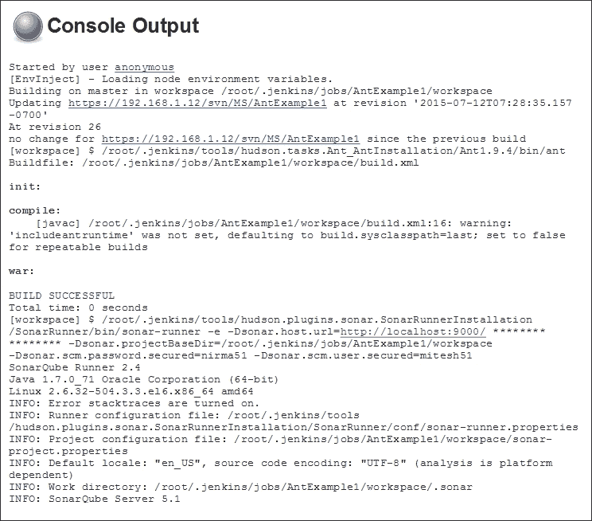

16.  Verify the Sonar execution steps in the console.

    

17.  Refresh the dashboard of SonarQube, and we will be able to see details on the recently executed build in SonarQube, as shown in the following screenshot:

    

18.  To get more details on code verification, click on the project, and we will be able to get details on **Lines of Code**, **Duplications**, **Complexity**, and so on.

    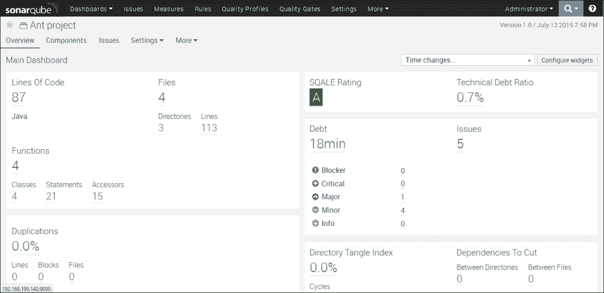

探索更多关于 SonarQube 和 Jenkins 集成的内容，如以下步骤所示。

# 探索静态代码分析插件

静态代码分析插件为静态代码分析插件提供实用程序。Jenkins 解释了几种静态代码分析工具的结果文件，使用不同的插件进行配置和解析。我们可以更灵活地使用这些插件来构建您想要的东西。

要安装这些插件中的任何一个，进入詹金斯仪表盘，点击**管理詹金斯**，选择**管理插件**链接。转到**可用**选项卡，找到相应的插件，并选择它。点击**立即下载**，重启后安装。

所有这些结果都由同一个后端可视化。以下插件使用相同的可视化:

## 校验和型插件

Checkstyle 插件为开源静态代码分析程序 Checkstyle 生成报告。

要了解更多关于检查样式插件的信息，请访问。

## 查找 bug 插件

静态分析收集器插件支持 FindBugs 插件，该插件在聚合趋势图中显示结果、运行状况报告并建立稳定性。

要了解更多信息，请访问 https://wiki.jenkins-ci.org/display/JENKINS/FindBugs+Plugin T2。

## 编译器警告插件

编译器警告插件为控制台日志或日志文件中的编译器警告生成趋势报告。

要了解更多信息，请访问 https://wiki.jenkins-ci.org/display/JENKINS/Warnings+Plugin T2。

要发布 Checkstyle、FindBugs 和编译器警告插件的组合结果，请转到任何作业的**构建**部分，然后单击**添加构建后操作**并选择**发布组合分析结果**。


我们也可以通过仪表板视图插件看到这些结果。

在仪表板视图的配置中，单击**编辑** **查看**，并选择**警告数量**部分中的复选框。在不同部分添加**仪表板 portlet**，用于检查样式、编译器和 Findbug。


完成所有更改并运行生成作业后，验证视图。


下面的插件也很有用。

## 干插

DRY 插件显示项目中重复的代码块。它只显示重复代码检查工具的结果。

要了解更多信息，请访问 https://wiki.jenkins-ci.org/display/JENKINS/DRY+Plugin T2。

## PMD 插件

PMD 插件扫描构建工作区中的`pmd.xml`文件，并报告警告。

欲了解更多信息，请访问【https://wiki.jenkins-ci.org/display/JENKINS/PMD+Plugin】。

## 任务扫描器插件

任务扫描器插件扫描工作区文件中的未完成任务，并提供趋势报告。

更多了解请访问[https://wiki . JENKINS-ci . org/display/JENKINS/Task+Scanner+Plugin](https://wiki.jenkins-ci.org/display/JENKINS/Task+Scanner+Plugin)。

## CCM 插件

CCM 插件提供了圈复杂度的详细信息。NET 代码。

要了解更多信息，请访问 https://wiki.jenkins-ci.org/display/JENKINS/CCM+Plugin T2。

## Android Lint 插件

安卓 lint 插件解析安卓 Lint 工具的输出。

更多了解请访问[https://wiki . JENKINS-ci . org/display/JENKINS/Android+Lint+Plugin](https://wiki.jenkins-ci.org/display/JENKINS/Android+Lint+Plugin)。

## OWASP 依赖检查插件

依赖检查詹金斯插件具有执行依赖分析构建的能力。

更多了解请访问[https://wiki . JENKINS-ci . org/display/JENKINS/OWASP+依赖检查+插件](https://wiki.jenkins-ci.org/display/JENKINS/OWASP+Dependency-Check+Plugin)。

# 关于构建状态的电子邮件通知

要根据构建状态发送电子邮件通知，我们需要配置 SMTP 详细信息。点击**管理詹金斯**，进入**配置系统**。转到**电子邮件通知**部分。

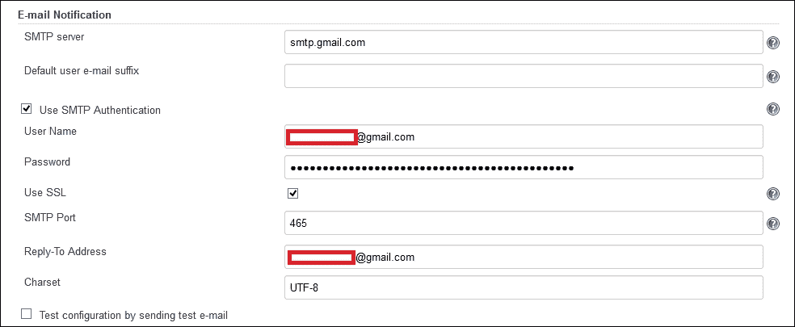

转到构建作业配置，点击**添加构建后动作**。选择**电子邮件通知**。提供收件人列表并保存。


运行生成作业，如果生成失败，邮箱中会出现电子邮件通知。

# 自测题

Q1。SonarQube 支持哪些语言？

1.  Java 语言(一种计算机语言，尤用于创建网站)
2.  C#
3.  服务器端编程语言（Professional Hypertext Preprocessor 的缩写）
4.  计算机编程语言
5.  C/C++
6.  Java Script 语言
7.  上述全部

Q2。其中哪个不是静态代码分析插件？

1.  干外挂程式
2.  PMD 插件
3.  任务扫描器插件
4.  查找臭虫插件
5.  以上都不是

# 总结

这里，我们又到了另一章的结尾。我们需要记住，每一个新的开始都来自另一个开始的结束。总而言之，我们学习了如何管理已配置应用程序的代码质量，以及如何使用通知功能根据失败的构建向开发人员发送信息。简而言之，我们还介绍了一些静态代码分析插件，以便对其有所了解。在下一章中，我们将学习如何管理和监控詹金斯。