# 第八章。詹金斯基础之外——利用“必备”插件

|   | *“力量和成长只有通过不断的努力和奋斗才能到来。”* |   |
|   | *拿破仑山* |

在最后一章中，我们介绍了 Jenkins 的管理和监控以及安全方面。在安全性方面，我们了解了身份验证和授权是如何工作的。现在，是时候认识到一些重要插件的附加值了。

本章介绍了 Jenkins 的高级用法，这在特定场景中非常有用。为了更好地利用 Jenkins，这里介绍了基于场景的特定插件的使用，这些插件有助于开发和运营团队。其中一些插件在通知场景中非常有用。以下是我们将在本章中介绍的主要主题:

*   扩展电子邮件插件
*   工作区清理插件
*   预配置-构建步骤插件
*   条件构建步骤插件
*   注射外挂程式
*   构建管道插件

# 扩展电子邮件插件

电子邮件扩展插件扩展了詹金斯提供的电子邮件通知功能。它在导致邮件通知和内容生成的条件方面提供了更多的定制。

你可以从詹金的仪表盘上安装这个插件。

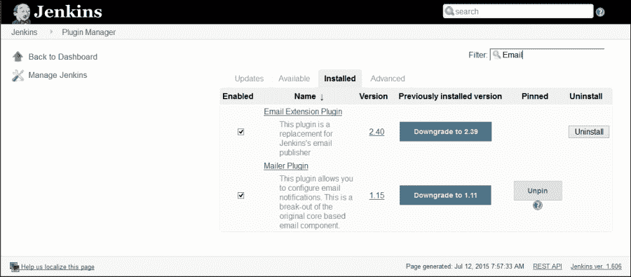

定制有三个方面:

*   触发器:我们可以选择导致发送电子邮件通知的条件
*   内容:我们可以指定每封触发邮件的主题和正文内容；我们可以在内容中使用默认的环境变量
*   收件人:我们可以指定当电子邮件被触发时谁应该收到它

在詹金斯仪表盘中，点击**管理詹金斯**，然后点击**配置系统**。转到**扩展电子邮件通知**部分，配置与您的 SMTP 邮件服务器设置相匹配的全局电子邮件扩展名属性。

我们还可以自定义主题、最大附件大小、默认内容等等。

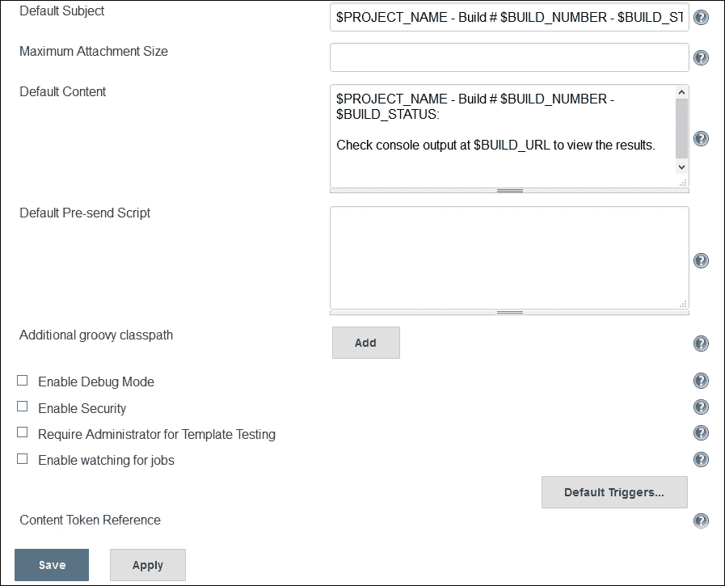

要配置特定于构建作业的电子邮件文本，请在项目配置页面中启用它。在**后期构建操作**中，选择标有**可编辑电子邮件通知**的复选框。配置以逗号(或空格)分隔的全局收件人、主题和内容列表。在高级配置中，我们可以配置预发送脚本、触发器、电子邮件令牌等。

发送前脚本功能允许我们在发送消息之前编写一个可以修改`MimeMessage`对象的脚本。触发器允许我们配置发送电子邮件必须满足的条件。Email-ext 插件使用令牌允许将动态数据插入收件人列表、电子邮件主题行或正文。更多详情，请访问[https://wiki . JENKINS-ci . org/display/JENKINS/Email-ext+plugin](https://wiki.jenkins-ci.org/display/JENKINS/Email-ext+plugin)。

# 工作区清理插件

工作区清理插件用于在构建之前或构建完成并保存工件时从詹金斯中删除工作区。如果我们想用一个干净的工作空间开始一个 Jenkins 构建，或者我们想在每次构建之前清理一个特定的目录，那么我们可以有效地使用这个插件。删除工作区有不同的选项。

你可以从詹金斯仪表盘安装这个插件。

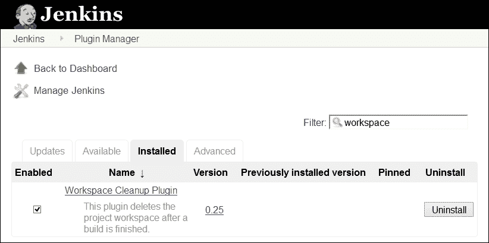

我们可以根据构建作业的状态为要删除的文件应用模式。我们可以为工作区删除添加构建后操作。

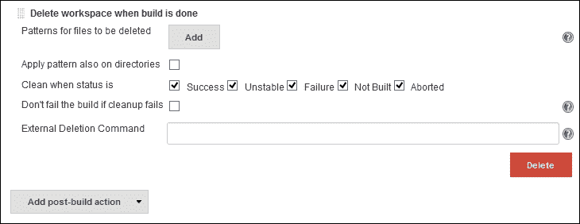

更多详情，请访问[https://wiki . JENKINS-ci . org/display/JENKINS/Workspace+clean+Plugin](https://wiki.jenkins-ci.org/display/JENKINS/Workspace+Cleanup+Plugin)。

# 预配置-构建步骤插件

Pre-scm-buildstep 插件允许在 scm 签出之前运行特定的构建步骤，以防我们需要在工作空间上执行任何构建步骤操作，考虑到任何特殊的需求，例如添加一个带有一些 SCM 设置的文件，执行一些命令来创建一些文件，清理或调用其他需要在签出之前运行的脚本。

你可以从詹金斯仪表盘安装这个插件。

从列表中选择条件步骤，如下图所示:

根据需求选择条件步骤，并提供基于操作系统的命令列表，如下图所示:

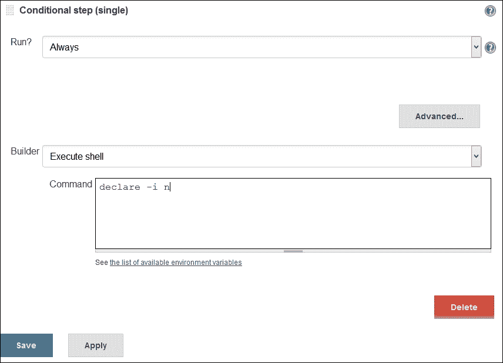

更多详情，请访问[https://wiki . JENKINS-ci . org/display/JENKINS/pre-SCM-build step](https://wiki.jenkins-ci.org/display/JENKINS/pre-scm-buildstep)。

# 条件构建步骤插件

构建步骤插件允许我们包装任意数量的其他构建步骤，根据定义的条件控制它们的执行。

你可以从詹金斯的仪表盘上安装这个插件。

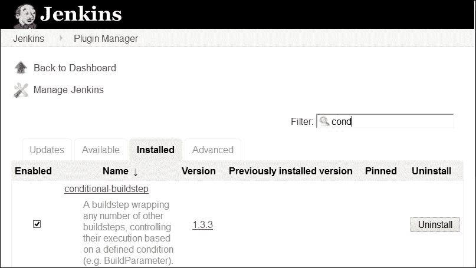

该插件定义了一些核心运行条件，例如:

*   始终/从不:从作业配置中禁用构建步骤
*   布尔条件:如果一个标记扩展为真，则执行该步骤
*   当前状态:如果当前构建状态在配置/特定范围内，则执行构建步骤
*   文件存在/文件匹配:如果文件存在或匹配模式，则执行该步骤
*   字符串匹配:如果两个字符串相同，则执行该步骤
*   数字比较:根据两个数字的比较结果执行构建步骤
*   正则表达式匹配:这提供了一个正则表达式和一个标签，以便在表达式与标签匹配时执行构建步骤
*   时间/星期几:在一天中的指定时间段或一周中的某一天执行构建作业
*   和/或/否:允许运行条件的组合和感测反转的逻辑操作
*   构建原因:到根据构建的原因执行构建步骤，例如，由定时器、用户、scm-change 等触发
*   脚本条件:利用 shell 脚本来决定是否应该跳过某个步骤
*   窗口批处理条件:利用窗口批处理来决定是否应该跳过一个步骤

从**添加构建步骤**中选择**条件步骤(单个)**。

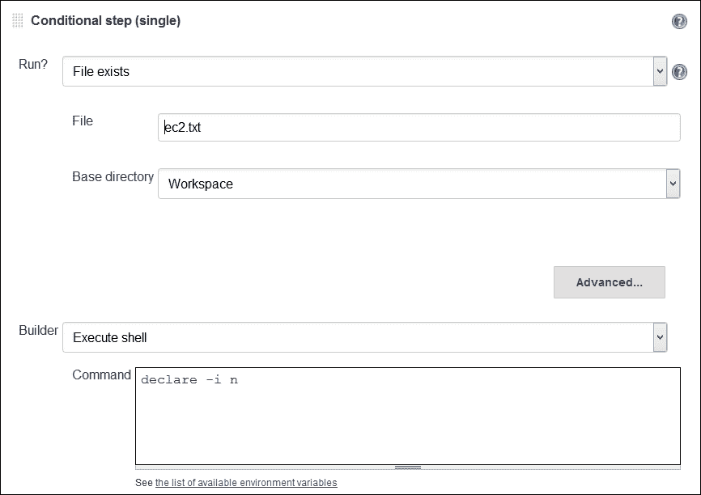

从**添加构建步骤**中选择 **条件步骤(多个)**。在这个条件步骤中，我们可以向条件添加多个步骤。

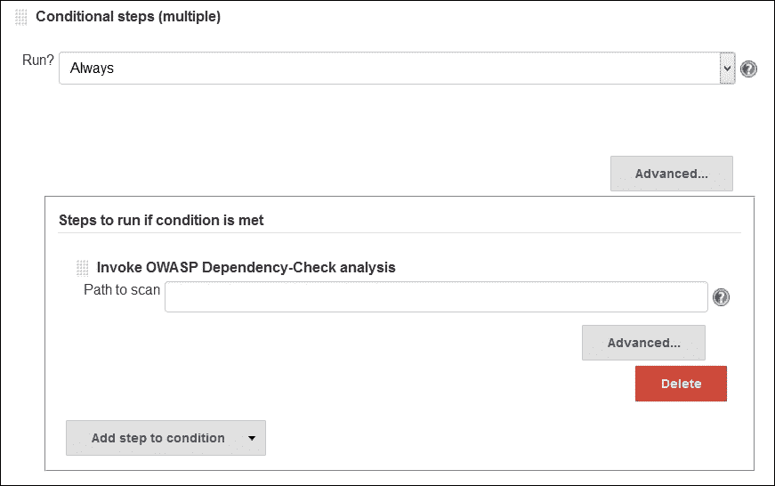

更多详情，请访问[https://wiki . JENKINS-ci . org/display/JENKINS/Conditional+BuildStep+Plugin](https://wiki.jenkins-ci.org/display/JENKINS/Conditional+BuildStep+Plugin)。

# 注射插件

我们知道不同的环境如开发、测试和生产需要不同的配置。

从詹金斯仪表盘安装这个插件。

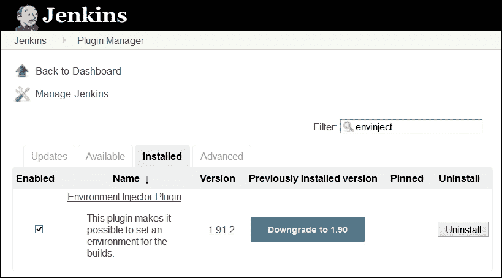

environment 插件为不同的构建作业提供了一个隔离的环境。EnvInject 插件在节点启动时、在运行的配置管理检查之前或之后注入环境变量，作为运行的构建步骤，等等。选择**将环境变量注入特定于构建作业的构建过程**。

更多详情，请访问[https://wiki . JENKINS-ci . org/display/JENKINS/envinjet+Plugin](https://wiki.jenkins-ci.org/display/JENKINS/EnvInject+Plugin)。

# 构建管道插件

持续集成已经成为应用程序开发的一种流行做法。构建管道插件提供了上游和下游连接作业的管道视图，这些作业通常形成构建管道，能够定义手动触发器或审批流程。在投入生产之前，我们可以通过不同的质量门来协调版本升级，从而创造一系列的工作。

从詹金斯仪表板安装这个插件。

我们已经安装了仪表板视图插件。我们将为四个构建作业创建一个管道。假设我们有四个构建作业，如下图所示，其中提到了每个构建作业的目标:

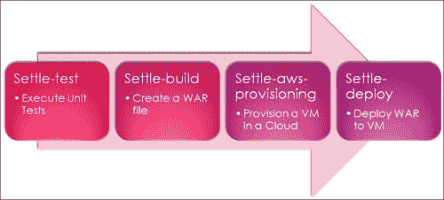

1.  Create a new view and select **Build Pipeline View**.

    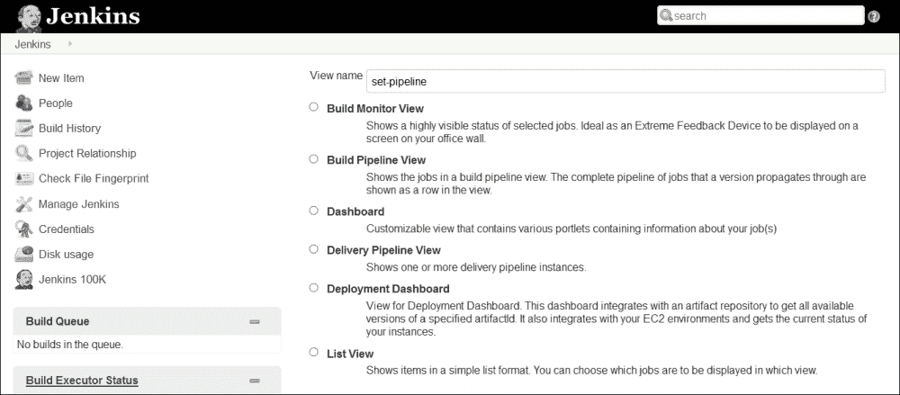

2.  提供描述，并从构建管道的配置中选择布局。
3.  Select an initial job and the number of displayed builds and save the configuration.

    

4.  In a configuration of the build pipeline, select job to trigger parameterized build as `settle-build` job in **Post-build Actions**. It will be the first build job in the pipeline.

    

5.  In a `settle-build` job, trigger the parameterized build on the `settle-aws-provisioning` job in **Post-build Actions**.

    

6.  In a `settle-aws-provisioning` job, the manual build steps for a `settle-deploy` job in **Post-build Actions**.

    

7.  In a `settle-aws-provisioning` job, trigger the parameterized build on the `settle-deploy` job in **Post-build Actions**. In the `settle-deploy` build job, we can write script or execute commands so that it can deploy `war` file to newly provisioned virtual machine in the cloud environment.

    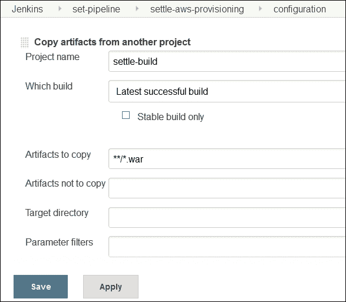

8.  Go to the dashboard view, which we created earlier, and verify the pipeline created after our configuration in build jobs in the previous section. The new build pipeline will be created as shown in the following diagram:

    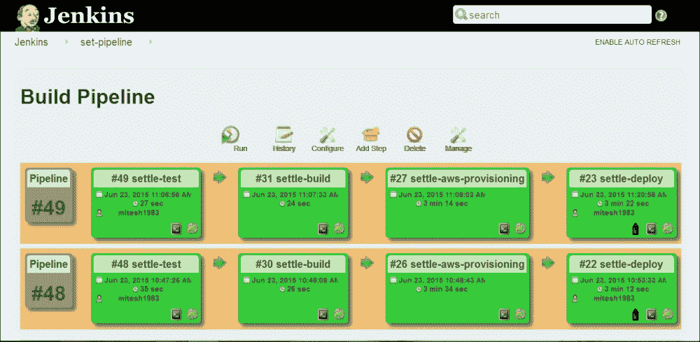

更多详情，请访问[https://wiki . JENKINS-ci . org/display/JENKINS/Build+Pipeline+Plugin](https://wiki.jenkins-ci.org/display/JENKINS/Build+Pipeline+Plugin)。

# 自测题

Q1。扩展电子邮件插件在哪些方面提供定制？

1.  扳机
2.  内容
3.  收件人
4.  上述全部

Q2。工作区清理插件提供了一个选项，用于在构建状态为:

1.  成功
2.  易变的
3.  失败
4.  未构建
5.  流产的
6.  上述全部

# 总结

我们学习了如何使用一些重要的插件来帮助詹金斯现有的特性来满足特定的需求。我们介绍了 Jenkins 的所有基本用法，包括安装运行时环境、创建构建作业、在云上使用 Jenkins、监控、管理、安全和其他插件。就本书的范围而言，这似乎足够了。下一步是在云环境中动态调配资源，以实现 DevOps 旅程中的端到端自动化。

如果你想要一个幸福的结局，那当然取决于你在哪里停止你的故事。我们当然知道在哪里停止我们的！