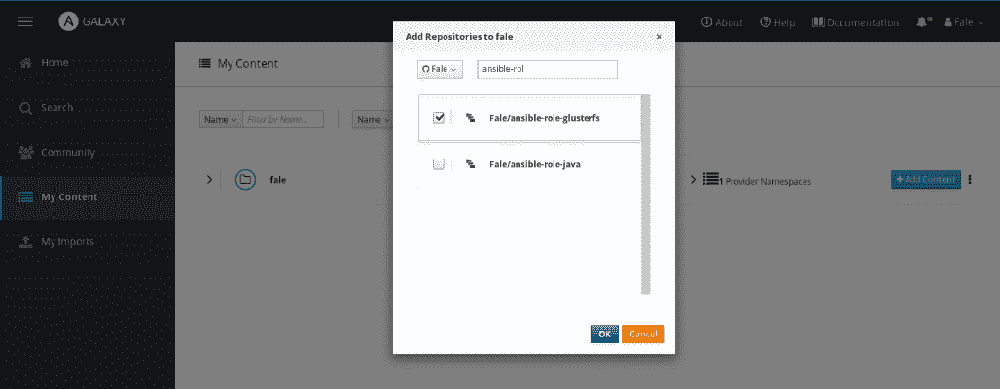

# 为企业介绍 Ansible

在前一章中，我们看到了 Ansible 是如何工作的，以及如何利用它。到目前为止，我们已经阅读了整本书，假设我们的目标是 Unix 机器，我们将自己编写所有的行动手册，并且 Ansible 命令行界面正是我们想要的。我们现在将远离这些假设，看看我们如何超越典型的 Ansible 用法。

在本章中，我们将探讨以下主题:

*   可在 Windows 上运行
*   易逝集群
*   可折叠塔

# 技术要求

除了 Ansible 本身，为了能够在您的机器上遵循本章中的示例，您将需要一个 Windows 盒子。

# 可在 Windows 上运行

Ansible 版开始能够用几个基本模块管理 Windows 机器。红帽收购 Ansible 后，微软等很多公司和人都在这个任务上投入了很多心血。到 2.1 版本发布时，Ansible 管理 Windows 机器的能力已经接近完成。一些模块已经被扩展为在 Unix 和 Windows 上无缝工作，而在其他情况下，Windows 逻辑与 Unix 非常不同，需要创建新的模块。

At the time of writing, using Windows as a control machine is not supported, though some users have tweaked the code and their environment to make it work.

从控制机器到 Windows 机器的连接不是通过 SSH 进行的；相反，它是通过 **Windows 远程管理** ( **WinRM** )实现的。您可以访问微软的网站了解详细的解释和实现:[http://msdn . Microsoft . com/en-us/library/aa 384426(v = vs . 85)。aspx](https://docs.microsoft.com/en-in/windows/desktop/WinRM/portal) 。

在控制机器上，一旦安装了 Ansible，安装 WinRM 就很重要了。您可以使用以下命令通过`pip`进行操作:

```
pip install "pywinrm>=0.3.0"  
```

You may need to use `sudo` or the `root` account to execute this command.

在每台远程 Windows 计算机上，您需要安装 PowerShell 或更高版本。Ansible 提供了一些有用的脚本来设置它:

*   WinRM([https://github . com/ansi ble/ansi ble/blob/dev/examples/scripts/configureremotingforensible . PS1](https://github.com/ansible/ansible/blob/devel/examples/scripts/ConfigureRemotingForAnsible.ps1))
*   PowerShell 3.0 升级版([https://github . com/cchuch/ansi ble/blob/dev/examples/scripts/upgrade _ to _ PS3 . PS1](https://github.com/cchurch/ansible/blob/devel/examples/scripts/upgrade_to_ps3.ps1))

您还需要允许端口`5986`通过防火墙，因为这是默认的 WinRM 连接端口，并确保可以从命令中心访问。

要确保您可以远程访问服务，请运行`curl`命令:

```
curl -vk -d `` -u "$USER:$PASSWORD" "https://<IP>:5986/wsman".  
```

如果基本身份验证工作正常，您可以开始运行命令。设置完成后，您就可以开始运行 Ansible 了！让我们通过运行`win_ping`在 Ansible 中运行相当于 Windows 版本的`Hello, world!`程序。为了做到这一点，让我们设置我们的凭证文件。

这可以使用`ansible-vault`完成，如下所示:

```
$ ansible-vault create group_vars/windows.yml  
```

正如我们已经看到的，`ansible-vault`会要求你设置`password`:

```
Vault password:
Confirm Vault password:  
```

此时，我们可以添加我们需要的变量:

```
ansible_ssh_user: Administrator 
ansible_ssh_pass: <password> 
ansible_ssh_port: 5986 
ansible_connection: winrm 
```

让我们设置我们的`inventory`文件，如下所示:

```
[windows] 
174.129.181.242 
```

接下来，让我们运行`win_ping`:

```
ansible windows -i inventory -m win_ping --ask-vault-pass  
```

Ansible 将向我们询问`Vault password`，然后打印运行结果，如下所示:

```
Vault password: 
174.129.181.242 | success >> { 
    "changed": false, 
    "ping": "pong" 
} 
```

我们现在已经看到了如何连接到远程机器。现在，您可以像管理 Unix 机器一样管理 Windows 机器。唯一需要注意的是，由于 Windows 操作系统和 Unix 系统之间的巨大差异，并非每个 Ansible 模块都能正常工作。由于这个原因，许多 Unix 模块已经从头开始重写，以具有与 Unix 模块相似的行为，但是具有完全不同的实现。这些模块的列表可以在[https://docs . ansi ble . com/ansi ble/latest/modules/list _ of _ windows _ modules . html](https://docs.ansible.com/ansible/latest/modules/list_of_windows_modules.html)上找到。

# 易逝集群

Ansible Galaxy 是一个免费网站，您可以在这里下载社区开发的 Ansible 角色，并在几分钟内启动您的自动化。您可以共享或查看社区角色，以便其他人可以轻松地在 Ansible Galaxy 上找到最值得信任的角色。您可以通过简单地注册推特、谷歌和 GitHub 等社交媒体应用程序，或者通过在位于[https://galaxy.ansible.com/](https://galaxy.ansible.com/)的 Ansible Galaxy 网站上创建一个新帐户，并使用 ansi ble 1 . 4 . 2 及更高版本附带的`ansible-galaxy`命令下载所需的角色来开始使用 Ansible Galaxy。

In case you want to host your own local Ansible Galaxy instance, you can do so by fetching the code from [https://github.com/ansible/galaxy](https://github.com/ansible/galaxy).

要从 Ansible Galaxy 下载 Ansible 角色，请使用以下命令:

```
ansible-galaxy install username.rolename  
```

您也可以指定版本，如下所示:

```
ansible-galaxy install username.rolename[,version]  
```

如果没有指定版本，那么`ansible-galaxy`命令会下载最新的可用版本。您可以通过两种方式安装多个角色；首先，通过传递由空格分隔的多个角色名，如下所示:

```
ansible-galaxy install username.rolename[,version] username.rolename[,version]  
```

其次，您可以通过在文件中指定角色名称并将该文件名传递给`-r/--role-file`选项来实现。例如，您可以创建包含以下内容的`requirements.txt`文件:

```
user1.rolename,v1.0.0 
user2.rolename,v1.1.0 
user3.rolename,v1.2.1 
```

然后，您可以通过将文件名传递给`ansible-galaxy`命令来安装角色，如下所示:

```
ansible-galaxy install -r requirements.txt  
```

让我们看看如何使用`ansible-galaxy`为 Apache HTTPd 下载一个角色:

```
ansible-galaxy install geerlingguy.apache  
```

您将看到类似如下的输出:

```
- downloading role 'apache', owned by geerlingguy
- downloading role from https://github.com/geerlingguy/ansible-role-apache/archive/3.0.3.tar.gz
- extracting geerlingguy.apache to /home/fale/.ansible/roles/geerlingguy.apache
- geerlingguy.apache (3.0.3) was installed successfully
```

前面的`ansible-galaxy`命令将把 Apache HTTPd 角色下载到`~/.ansible/roles`目录。现在，您可以直接在行动手册中使用前面的角色，并创建包含以下内容的`playbooks/galaxy.yaml`文件:

```
- hosts: web 
  user: vagrant 
  become: True 
  roles: 
    - geerlingguy.apache 
```

如您所见，我们创建了一个带有`geerlingguy.apache`角色的简单剧本。我们现在可以测试它:

```
ansible-playbook -i inventory playbooks/galaxy.yaml 
```

这将为我们提供以下输出:

```
PLAY [web] ***********************************************************

TASK [Gathering Facts] ***********************************************
ok: [ws01.fale.io]

TASK [geerlingguy.apache : Include OS-specific variables.] ***********
ok: [ws01.fale.io]

TASK [geerlingguy.apache : Include variables for Amazon Linux.] ******
skipping: [ws01.fale.io]

TASK [geerlingguy.apache : Define apache_packages.] ******************
ok: [ws01.fale.io]

TASK [geerlingguy.apache : include_tasks] ****************************
included: /home/fale/.ansible/roles/geerlingguy.apache/tasks/setup-RedHat.yml for ws01.fale.io

TASK [geerlingguy.apache : Ensure Apache is installed on RHEL.] ******
changed: [ws01.fale.io]

TASK [geerlingguy.apache : Get installed version of Apache.] *********
ok: [ws01.fale.io]

...
```

As you may have noticed, many steps were skipped due to the fact that this role is designed to work on many different Linux distributions.

现在，您已经知道如何利用 Ansible Galaxy 角色，您可以花更少的时间重写已经有人编写的代码，而花更多的时间编写特定于您的体系结构的部分，并赋予您更多的价值。

# 将一个角色推向易逝集群

由于 Ansible Galaxy 是一个社区驱动的工作，您也可以添加自己的角色。在我们开始发布它之前，我们需要准备它。

Ansible 为我们提供了一个工具，可以从模板引导一个新的 Galaxy 角色。为了利用它，我们可以运行以下命令:

```
ansible-galaxy init ansible-role-test
```

这将创建`ansible-role-test`文件夹，以及 Ansible 角色通常拥有的所有常用文件夹。

唯一对你来说是新的文件是`meta/main.yaml`，尽管没有 Ansible Galaxy 也可以使用，但它包含了很多 Ansible Galaxy 可读的关于角色的信息。

该文件中的主要信息如下，您可能需要根据自己的需要进行相应的设置:

*   `author`:你的名字。
*   `description`:这里放一个角色的描述。
*   `company`:把你工作的公司名称放在这里(或者删行)。
*   `license`:设置您的模块将拥有的许可证。一些建议的许可证是 BSD(这也是默认的)、MIT、GPLv2、GPLv3、Apache 和 CC-BY。
*   `min_ansible_version`:设置测试过角色的 Ansible 的最低版本。
*   `galaxy_tags`:在这一部分，请列出你的模块所针对的平台和版本。
*   `dependencies`:列出执行角色所需的角色。

要继续发布，您需要使用 GitHub 帐户登录到 Galaxy，然后您可以转到“我的内容”开始添加内容。

按下“添加内容”后，将出现一个窗口，向您显示可供选择的存储库，如下图所示:



选择正确的存储库，然后单击“确定”按钮后，Ansible Galaxy 将开始导入给定的角色。

如果您在完成此操作几分钟后返回“我的内容”页面，您将看到您的角色及其状态，如下所示:


您现在可以像其他人一样使用该角色。需要修改的时候记得更新！

# 安塞布尔塔和 AWX

Ansible Tower 是由红帽开发的基于网络的图形用户界面。Ansible Tower 为您提供了一个易于使用的控制面板，您可以在其中管理节点和基于角色的身份验证，以控制对 Ansible Tower 控制面板的访问。Ansible Tower 的最大特点如下:

*   **LDAP/AD 集成**:您可以根据 Ansible Tower 在您的 LDAP/AD 服务器上执行的 LDAP/AD 查询结果，导入(并授予)用户权限。
*   **基于角色的访问控制**:它限制用户只运行他们被授权运行的行动手册和/或只针对有限数量的主机。
*   **REST API** :所有的 Ansible Tower 功能都是通过 REST API 公开的。
*   **作业调度** : Ansible Tower 允许我们调度作业(剧本执行)。
*   **图形化库存管理** : Ansible Tower 比 Ansible 更动态的管理库存。
*   **仪表盘** : Ansible Tower 可以让我们看到当前和之前所有作业执行的情况。
*   **日志记录** : Ansible Tower 会记录每个作业执行的所有结果，以便在需要时可以返回查看。

在红帽收购 Ansible Inc .期间，有人承诺 Ansible Tower 将成为开源软件。2017 年，这种情况发生了，它以 AWX 的名字回来了。

AWX 和 Ansible Tower 通常用于企业版，因为它为 Ansible 生态系统提供了非常方便的功能。我们将在接下来的章节中更详细地讨论这些问题。

# 摘要

在本章中，我们通过查看如何控制 Windows 主机，了解了如何将 Ansible 移出 Unix 世界。然后我们转到了 Ansible Galaxy，在那里你可以找到许多其他人编写的角色，你可以简单地重用它们。最后，我们谈到了 Ansible Tower，它是 AWX 开源的化身。在接下来的章节中，我们将讨论更多关于 AWX 的内容，从安装过程到运行您的第一个作业。