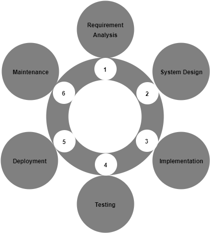
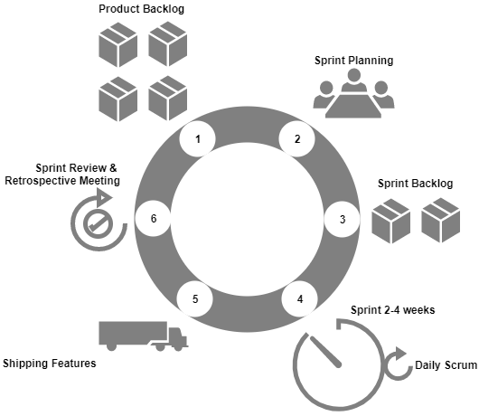
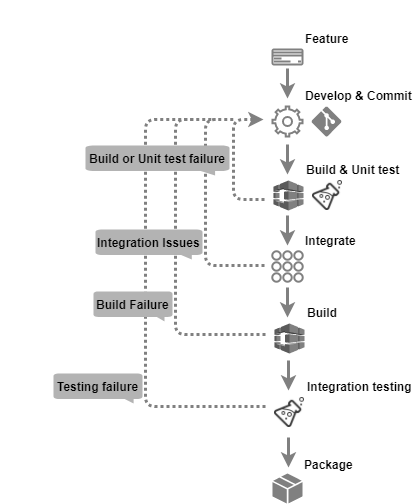
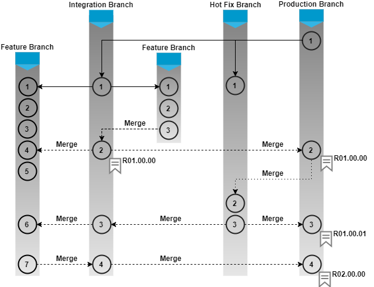
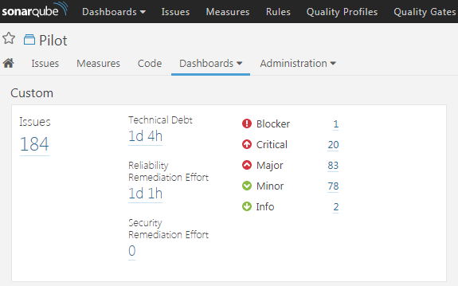

# 持续集成的概念

我们将在本章开始概述这个时代的两种主要软件开发方法:瀑布法和敏捷法。理解它们的概念和含义将有助于我们回答**持续整合** ( **CI** )是如何产生的。

接下来，我们将尝试理解 CI 背后的概念以及构成它的元素。通读这些主题，你会看到CI如何帮助项目变得敏捷。完成本章后，您应该能够:

*   描述CI是如何产生的。
*   定义什么是配置项。
*   描述CI的要素。

# 软件开发生命周期

对于那些不熟悉“软件开发生命周期”这个术语的人，让我们试着去理解它。

**软件开发生命周期**，有时简称为 **SDLC** ，是规划、开发、测试和部署软件的过程。

团队遵循一系列阶段，每个阶段都使用前一阶段的结果，如下图所示:

Software Development Life Cycle

让我们详细了解一下 SDLC 阶段。

# 需求分析

这是周期的第一阶段。在这里，业务团队(主要由业务分析师组成)对他们项目的业务需求进行需求分析。需求可以是组织内部的，也可以是来自客户的外部需求。这项研究包括发现需求的性质和范围。根据收集到的信息，有人建议要么改进系统，要么创建一个新系统。项目成本决定了，效益也规划好了。然后定义项目目标。

# 设计

第二阶段是设计阶段。在这里，系统架构师和系统设计人员制定软件解决方案的期望特性，并创建项目计划。该计划可能包括流程图、整体界面和布局设计，以及大量文档。

# 履行

第三阶段是实现阶段。在这里，项目经理创建工作并分配给开发人员。开发人员根据设计阶段定义的任务和目标开发代码。根据项目的不同，这个阶段可能会持续几个月到一年。

# 测试

第四个阶段是测试阶段。当所有确定的特性都被开发出来后，测试团队就接管了。在接下来的几个月里，所有的功能都经过了彻底的测试。软件的每个模块都经过收集和测试。如果在测试过程中出现任何错误，就会引发缺陷。在失败的情况下，开发团队迅速采取行动来解决失败。经过全面测试的代码随后被部署到生产环境中。

# 演变

最后一个阶段是进化阶段或维护阶段。分析用户/客户的反馈，以补丁或升级的形式重复开发、测试和发布新特性和修复的整个周期。

# 软件开发的瀑布模型

瀑布模型是最著名和应用最广泛的软件开发过程之一。瀑布模型是一个连续的软件开发过程。它源于制造业。人们可以看到一个高度结构化的单向流程。在它创建的时候，没有其他的软件开发方法，开发人员唯一能想到的是生产线流程，它很容易适应软件开发。

下图说明了软件开发的瀑布模型:

Waterfall model

瀑布方法很容易理解，因为所涉及的步骤类似于 SDLC 的步骤。

首先是需求分析阶段，然后是设计阶段。有相当多的时间花在分析和设计部分。一旦结束，就没有进一步的增加或删除。简而言之，一旦开发开始，设计中就不允许修改。

接下来是实现阶段，在这里进行实际的开发。开发周期从三个月到六个月不等。在此期间，测试团队通常是自由的。当开发周期完成时，计划一整周的时间来执行源代码的集成。在此期间，会弹出许多集成问题并立即修复。这个阶段之后是测试阶段。

当测试开始时，它会继续进行三个月或更长时间，这取决于软件解决方案。测试成功完成后，源代码将部署在生产环境中。为此，一天左右的时间再次计划在生产中进行部署。可能会出现一些部署问题。当软件解决方案上线时，团队会得到反馈，也可能会预测问题。

最后一个阶段是维护阶段。分析用户/客户的反馈，以补丁或升级的形式重复开发、测试和发布新特性和修复的整个周期。

毫无疑问，瀑布模型几十年来都非常有效。然而，缺陷确实存在，但它们在很长一段时间内被忽视了。从那时起，软件项目有充足的时间和资源来完成工作。

然而，看看过去几年软件技术的变化，我们可以很容易地说瀑布模型不适合当前世界的需求。

# 瀑布模型的缺点

以下是瀑布模型的一些缺点:

*   工作软件只在软件开发生命周期结束时生产，在大多数情况下持续一年左右。
*   存在巨大的不确定性。
*   不适合新功能需求过于频繁的项目。例如，电子商务项目。
*   集成仅在整个开发阶段完成后执行。因此，集成问题会在后期大量出现。
*   没有向后追溯。
*   很难分阶段衡量进展。

# 瀑布模型的优点

通过查看瀑布模型的缺点，我们可以说它最适合以下项目:

*   需求被很好地记录和固定。
*   有足够的资金来维持管理团队、测试团队、开发团队、构建和发布团队、部署团队等等。
*   技术是固定的，不是动态的。
*   没有模棱两可的要求。最重要的是，除了需求分析阶段，它们不会在任何其他阶段出现。

# 敏捷救援

**敏捷**这个名字恰如其分地暗示了*快速而简单*。敏捷是通过自组织团队之间的协作来开发软件的方法的集合。敏捷背后的原则是增量的、快速的、灵活的软件开发，它促进适应性规划。

敏捷软件开发过程是前面讨论的传统软件开发过程的替代。

# 十二条敏捷原则

以下是敏捷模型的十二个原则:

*   通过早期和持续交付有用的软件使客户满意。
*   欢迎不断变化的需求，即使是在开发后期。
*   工作软件经常被交付(几周，而不是几个月)。
*   企业、人员和开发人员之间密切的日常合作。
*   项目是围绕有动力的个人建立的，他们应该被信任。
*   面对面的交谈是最好的交流方式(同地办公)。
*   工作软件是衡量进步的主要标准。
*   可持续发展——能够保持恒定的速度。
*   持续关注卓越的技术和良好的设计。
*   简单——最大化未完成工作量的艺术——至关重要。
*   自组织团队。
*   定期适应不断变化的环境。

To know more about the Agile principles visit the link: [http://www.agilemanifesto.org](http://www.agilemanifesto.org).

敏捷软件开发的十二条原则表明了当前软件行业的期望及其相对于瀑布模型的优势。

# 敏捷软件开发过程是如何工作的？

在敏捷软件开发过程中，整个软件应用被拆分成多个特性或模块。这些特性是在迭代中交付的。每次迭代持续三周，涉及跨职能团队，他们同时在不同的领域工作，例如计划、需求分析、设计、编码、单元测试和验收测试。

因此，没有人会在任何给定的时间点无所事事。这与瀑布模型有很大不同，在瀑布模型中，当开发团队忙于开发软件时，测试团队、生产团队和其他所有人都处于闲置或未充分利用的状态。下图说明了软件开发的敏捷模型:

Agile methodology

从前面的图中，我们可以看到没有时间花在需求分析或设计上。相反，我们准备了一个非常高层次的计划，足以勾勒出项目的范围。

然后团队经历一系列迭代。迭代可以被分类为时间框架，在一些成熟的项目中，每个持续一个月甚至一周。在此期间，项目团队开发和测试特性。目标是在一次迭代中开发、测试和发布一个特性。迭代结束时，该特性进行演示。如果客户喜欢，那么这个功能就会上线。但是，如果它被拒绝，这个特性就被当作一个积压，被重新排序，并在连续的迭代中再次被处理。

也有并行开发和测试的可能。在一次迭代中，可以并行开发和测试多个特性。

# 敏捷软件开发过程的优势

让我们看看敏捷软件开发过程的一些优势:

*   **功能可以快速开发和演示**:在敏捷过程中，软件项目是按功能划分的，每个功能都被称为一个积压。这个想法是在一周或一个月内，从概念化到部署，开发一个或一组特性。这将至少一两个功能放在客户的盘子上，然后他们可以开始使用。
*   **资源需求较少**:在敏捷中，没有单独的开发和测试团队。既没有构建或发布团队，也没有部署团队。在敏捷中，一个项目团队包含大约八个成员。团队的每个成员都有能力做任何事情。
*   **促进团队协作和交叉训练**:由于有一个 8 人左右的小团队，团队成员轮流转换角色，互相学习经验。
*   **适用于需求变化频繁的项目**:在软件开发的敏捷模型中，将完整的软件划分为多个功能，每个功能都在短时间跨度内开发和交付。因此，改变特性，甚至完全放弃它，不会影响整个项目。
*   **极简文档**:这种方法主要关注快速交付工作软件，而不是创建巨大的文档。文档是存在的，但它仅限于整体功能。
*   **很少或不需要规划**:由于功能是在短时间内一个接一个开发的，所以不需要进行大范围的规划。
*   **并行开发**:迭代由一个或多个按顺序，甚至并行开发的特征组成。

# Scrum 框架

Scrum 是一个开发和维护基于敏捷软件开发过程的复杂产品的框架。它不仅仅是一个过程；它是一个具有特定角色、任务和团队的框架。Scrum 由**肯·施瓦伯**和**杰夫·萨瑟兰**撰写；他们一起创建了*Scrum 指南*。

在 Scrum 框架中，开发团队决定如何开发一个特性。这是因为团队最了解他们面临的问题。我想大多数读者看完之后都会很开心。

Scrum 依赖于一个自组织和跨职能的团队。Scrum 团队是自组织的；因此，没有一个全面的团队领导来决定哪个人将做哪个任务，或者一个问题将如何解决。

# Scrum 框架中使用的重要术语

以下是 Scrum 框架中使用的重要术语:

*   **冲刺**:冲刺是一个时间盒，在这个时间盒里，一个可用的、潜在可发布的产品被创建出来。在前一次冲刺结束后，新的冲刺立即开始。冲刺可能会持续两周到一个月，这取决于项目对 Scrum 的控制。
*   **产品积压**:产品积压是软件解决方案中所有必需特性的列表。该列表是动态的。也就是说，客户或团队成员不时向产品积压添加或删除项目。
*   **冲刺积压**:冲刺积压是产品积压项目的集合，为冲刺选择。
*   **增量**:增量是一次冲刺过程中完成的所有产品积压项目的总和，以及之前所有冲刺的增量值。
*   **开发团队**:开发团队在每次 Sprint 结束时都会交付一组名为 Increment 的可发布特性。只有开发团队的成员才能创建增量。开发团队被组织授权组织和管理他们的工作。由此产生的协同效应优化了开发团队的整体效率和效果。
*   **产品所有者**:产品所有者是 Scrum 团队和其他所有人之间的中介。他是 Scrum 团队的门面，与客户、基础设施团队、管理团队、参与 Scrum 的每个人等等进行交互。
*   **Scrum Master**:Scrum Master 负责确保 Scrum 被理解和执行。Scrum Masters 通过确保 Scrum 团队遵循 Scrum 理论、实践和规则来做到这一点。

# Scrum 是如何工作的？

产品所有者、Scrum 大师和 Scrum 团队一起遵循一套严格的程序来交付软件特性。下图解释了 Scrum 开发过程:

Scrum methodology

让我们看看团队经历的 Scrum 软件开发过程的一些重要方面。

# 冲刺计划

冲刺计划是 Scrum 团队在当前冲刺周期中计划特性的机会。这个计划主要是由开发商制定的。一旦计划被创建，它就被解释给 Scrum 主和产品所有者。冲刺计划是一个有时间限制的活动，通常一个月的冲刺周期总共需要 8 个小时左右。确保每个人都参与冲刺计划活动是 Scrum 大师的责任。

在会议中，开发团队会考虑以下事项:

*   要处理的产品积压数量(包括上次 Sprint 中的新积压和旧积压)。
*   最后冲刺阶段的团队表现。
*   开发团队的预计能力。

# 冲刺周期

在 Sprint 周期中，开发人员只需完成 Sprint 计划中决定的积压工作。冲刺的持续时间可能从两周到一个月，这取决于积压的数量。

# 每日 Scrum 会议

这种情况每天都会发生。在 Scrum 会议期间，开发团队讨论昨天完成了什么，今天将完成什么。他们还讨论阻碍他们实现目标的事情。除了 Scrum 会议，开发团队不参加任何其他会议或讨论。

# 监控冲刺进度

每日 Scrum 是团队衡量其进展的好机会。Scrum 团队可以跟踪剩余的全部工作，通过这样做，他们可以估计实现 Sprint 目标的可能性。

# 冲刺评论

在冲刺评审中，开发团队展示了已经完成的特性。产品负责人更新产品积压状态。产品积压列表根据产品性能或市场使用情况进行更新。冲刺复习是为期一个月的冲刺总共四个小时的活动。

# 冲刺回顾

在这次会议中，团队讨论了进展顺利的事情，以及需要改进的地方。然后，团队决定必须改进的点，以便在即将到来的冲刺中表现得更好。这个会议通常在冲刺评审之后和冲刺计划之前举行。

# 连续累计

持续集成(CI)是一种软件开发实践，其中开发人员经常将他们的工作与项目的集成分支集成在一起，并创建一个构建。

集成是将您的私有工作(修改后的代码)提交给公共工作区(潜在的软件解决方案)的行为。这在技术上是通过将您的私人工作(个人分支)与公共工作区域(集成分支)合并来完成的。或者我们可以说，把你的私人分支推到远程分支。

CI 对于尽早揭示集成过程中遇到的问题是必要的。这可以从下图中理解，该图描述了在单个配置项周期中遇到的各种问题。

构建失败可能是由于不正确的代码或构建时的人为错误造成的(假设任务是手动完成的)。如果开发人员不经常用集成分支上的代码来替换他们的本地代码副本，就会出现集成问题。如果代码没有通过任何单元或集成测试用例，就会出现测试问题。

如果出现问题，开发人员必须修改代码来修复它:

CI process

# 敏捷在CI上运行

敏捷软件开发过程主要集中在快速交付上，CI帮助敏捷达到这个速度。但是 CI 是怎么做到的呢？让我们用一个简单的案例来理解。

开发一个特性涉及许多代码更改，在每个代码更改之间，都有一组任务要执行，例如签入代码、轮询版本控制系统的更改、构建代码、单元测试、集成、在集成代码上构建、集成测试和打包。在配置项环境中，通过使用配置项工具，如*Jenkins*，所有这些步骤都变得快速且无错误。

添加通知使事情变得更快。团队成员越早意识到构建、集成或部署失败，他们就能越快采取行动。下图描述了配置项流程中涉及的所有步骤:

CI process with notifications

通过这种方式，团队快速地从一个功能转移到另一个功能。简单来说，敏捷软件开发的*敏捷性*在很大程度上要归功于 CI。

# 从CI中受益的项目类型

为嵌入式系统编写的代码在汽车中的数量比在战斗机中的数量还要多。在当今世界，嵌入式软件存在于每一个产品中，无论是现代的还是传统的。无论是汽车、电视、冰箱、手表还是自行车；所有这些都有或多或少的软件相关特性。消费品一天比一天聪明。如今，我们可以看到一种产品在市场上更多地使用其智能和智能功能，而不是其硬件功能。例如，空调以其无线控制功能上市，电视以其智能功能上市，如嵌入式网络浏览器等。

营销新产品的需求增加了产品的复杂性。软件复杂性的增加使敏捷软件开发和CI方法成为焦点，尽管有时敏捷软件开发被不超过 30-40 人的团队用于一个简单的项目。几乎所有类型的项目都受益于CI:主要是基于网络的项目，例如，电子商务网站和手机应用程序。

CI 和敏捷方法用于基于 Java 的项目。NET、Ruby on Rails，以及今天出现的所有其他编程语言。您将看到它没有被使用的唯一地方是在遗留系统中。然而，即使是他们也在变得敏捷。基于 SAS、大型机的项目；所有人都试图从CI中受益。

# CI的要素

让我们看看CI流程的重要元素。

# 版本控制系统

这是实现 CI 最基本、最重要的要求。一个**版本控制系统，**有时也被称为**修订控制系统，**是一个管理你的代码历史的工具。它可以是集中式的，也可以是分布式的。一些著名的集中式版本控制系统是 SVN 和 IBM Rational ClearCase。在分布式领域，我们有 GIT 和 Mercurial 这样的工具。

理想情况下，构建软件所需的一切都必须是版本控制的。版本控制工具提供了许多功能，如标记、分支等。

# 分支策略

使用版本控制系统时，将分支保持在最小。少数公司只有一个主要分支，所有的开发活动都是在这个分支上进行的。然而，大多数公司遵循一些分支策略。这是因为团队中总有一部分人可能会在一个版本上工作，而其他人可能会在另一个版本上工作。其他时候，需要支持旧版本。这种情况总是导致公司使用多个分支机构。

GitFlow 是使用多个分支管理代码的另一种方式。在下面的方法中，主/生产分支保持干净，只包含可发布的、准备发货的代码。所有的开发都发生在特性分支上，集成分支是集成所有特性的公共场所。下图是 GitFlow 的一个中等版本:

Branching strategy

# GitFlow 分支模型

下图说明了完整版本的 GitFlow。我们有一个只包含生产就绪代码的主/生产分支。功能分支是所有开发发生的地方。集成分支是对代码进行集成和质量测试的地方。除此之外，当有稳定的发布时，我们有从集成分支中拉出的发布分支。与发布相关的所有错误修复都发生在发布分支中。当需要修补程序时，还有一个从主/生产分支中拉出的修补程序分支:

GitFlow branching strategy

# CI工具

什么是 CI 工具？嗯，它只不过是一个管弦乐队。配置项工具位于配置项系统的中心，连接到版本控制系统、构建工具、二进制存储库管理器工具、测试和生产环境、质量分析工具、测试自动化工具等。有许多配置项工具:构建锻造、竹子和团队城市，仅举几例。但我们这本书的主要焦点是Jenkins:

Centralized CI server

配置项工具提供了创建管道的选项。每条管道都有自己的用途。有管道来处理配置项。有些负责测试；有些负责部署，等等。从技术上讲，管道就是工作的流动。每个作业都是一组按顺序运行的任务。脚本是执行各种任务的配置项工具不可或缺的一部分。这些任务可能像将文件夹/文件从一个位置复制到另一个位置一样简单，也可能是复杂的 Perl 脚本来监控机器的文件修改。然而，这个脚本正在被Jenkins中不断增长的插件所取代。现在，您不需要编写脚本来构建 Java 代码；有插件可供使用。你所需要做的就是安装和配置一个插件来完成这项工作。从技术上讲，插件只不过是用 Java 编写的小模块。它们消除了开发人员的脚本负担。我们将在接下来的章节中了解更多关于管道的信息。

# 自触发构建

下一个需要理解的重要事情是自动触发的自动构建。构建自动化只是一系列编译代码和生成可执行文件的自动化步骤。构建自动化可以借助像 Ant 和 Maven 这样的构建工具。自触发自动构建是配置项系统最重要的部分。有两个主要因素需要自动化构建机制:

*   速度。
*   尽早捕捉集成或代码问题。

有些项目每天发生 100 到 200 次构建。在这种情况下，速度起着重要的作用。如果构建是自动化的，那么它可以节省很多时间。如果构建的触发是自动驱动的，没有任何人工干预，事情会变得更加有趣。每次代码更改时自动触发的构建进一步节省了时间。

当构建频繁且快速时，在 SDLC 框架中发现错误(构建错误、编译错误或集成错误)的概率越来越高:

Probability of error versus build graph

# 代码覆盖率

代码覆盖率是测试用例覆盖的代码量(百分比)。您可能在覆盖率报告中看到的指标或多或少如下表所定义:

| **覆盖类型** | **描述** |
| 功能 | 定义的函数总数中调用的函数数 |
| 声明 | 程序中从总数中真正调用的语句数 |
| 分支 | 执行的控制结构的分支数量 |
| 情况 | 正在测试真值和假值的布尔子表达式的数量 |
| 线条 | 代码中存在的总行数中被测试的源代码行数 |

Types of code coverage

这个覆盖率的计算方法是将测试的项目数除以找到的项目数。下面的截图说明了来自 SonarQube 的代码覆盖率报告:

**** Code coverage report on SonarQube

# 代码覆盖工具

根据您使用的语言，您可能会找到几个选项来创建覆盖率报告。下面列出了一些流行的工具:

| **语言** | **工具** |
| Java 语言(一种计算机语言，尤用于创建网站) | Atlassian Clover，掩护，雅各 |
| C#/。网 | OpenCover，dotCover |
| C++ | OpenCppCoverage，gcov |
| 计算机编程语言 | Coverage.py |
| 红宝石 | SimpleCov |

# 静态代码分析

静态代码分析，也通常称为**白盒**测试，是一种寻找代码结构质量的软件测试形式。例如，它回答了代码有多健壮或可维护。静态代码分析是在不实际执行程序的情况下执行的。它不同于功能测试，功能测试研究软件的功能方面，它是动态的。

静态代码分析是对软件内部结构的评估。例如，是否有一段代码被重复使用？代码是否包含大量注释行？代码有多复杂？使用用户定义的度量，生成一个分析报告，显示关于可维护性的代码质量。它没有质疑代码的功能。

像 SonarQube 这样的静态代码分析工具都有一个仪表板，显示每次运行的各种指标和统计数据。通常，作为配置项的一部分，每次运行构建时都会触发静态代码分析。如前几节所述，在开发人员尝试签入代码之前，静态代码分析也可以包括在内。因此，可以在初始阶段就防止低质量的代码。

它们支持很多语言，比如 Java、C/C++、Objective-C、C#、PHP、Flex、Groovy、JavaScript、Python、PL/SQL、COBOL 等等。以下截图说明了使用 SonarQube 的静态代码分析报告:

Static code analysis report

Static code analysis report

# 自动化测试

测试是软件开发生命周期的重要组成部分。为了维护高质量的软件，软件解决方案必须经历各种测试场景。不太重视测试会导致客户不满意和产品延迟。

由于测试是一项手动、耗时且重复的任务，自动化测试过程可以显著提高软件交付的速度。然而，自动化测试过程比自动化构建、发布和部署过程要困难一些。自动化项目中使用的几乎所有测试用例通常需要很大的努力。这是一项随着时间而成熟的活动。

因此，当开始自动化测试时，我们需要考虑几个因素。必须首先考虑具有巨大价值且易于自动化的测试用例。例如，自动化测试，其中步骤是相同的，尽管它们每次都用不同的数据运行。此外，自动化测试，在不同平台上测试软件功能。此外，自动化涉及以不同配置运行的软件应用程序的测试。

以前，世界主要由桌面应用程序主导。自动化基于图形用户界面的系统测试相当困难。这需要脚本语言，其中手动鼠标和键盘输入被编写脚本并执行以测试图形用户界面应用程序。然而，今天的软件世界完全由基于网络和移动的应用程序主导，这些应用程序很容易通过使用测试自动化工具的自动化方法进行测试。

一旦代码被构建、打包和部署，测试应该自动运行以验证软件。传统上，遵循的流程是为 SIT、UAT、PT 和预生产提供一个环境。首先，版本通过 SIT，代表系统集成测试。这里，对集成代码进行测试，以检查其功能。如果集成测试通过，代码将被部署到下一个环境，即 UAT，在那里通过用户验收测试，然后最后可以部署到 PT，在那里通过性能测试。这样，测试就被优先化了。

自动化所有的测试并不总是可能的。但是，这个想法是自动化任何可能的测试。前面讨论的方法需要有许多环境，并且需要在各种环境中进行更多的自动化部署。为了避免这种情况，我们可以使用另一种方法，在这种方法中，只有一个部署构建的环境，然后运行基本测试，之后，手动触发长时间运行的测试。

# 二进制存储库工具

作为 SDLC 的一部分，使用 CI 将源代码持续构建成二进制工件。因此，应该有一个地方来存储这些构建的包以备后用。答案是，使用二进制存储库工具。但是什么是二进制存储库工具呢？

二进制存储库工具是二进制文件的版本控制系统。不要将其与前面章节中讨论的版本控制系统相混淆。前者负责源代码的版本化，后者负责二进制文件，如`.rar`、`.war`、`.exe`、`.msi`等。除了管理构建的工件，二进制存储库工具还可以管理构建所需的三方二进制文件。例如，Maven 插件总是将构建代码所需的插件下载到一个文件夹中。可以使用存储库工具来管理插件，而不是一次又一次地下载插件:

Repository tool

从上图中，您可以看到，一旦构建被创建并通过所有检查，构建的工件就被上传到二进制存储库工具。从这里，开发人员和测试人员可以手动挑选、部署和测试它们。或者，如果自动化部署到位，那么构建的工件将自动部署到各自的测试环境中。那么，使用二进制存储库有什么好处呢？

二进制存储库工具执行以下操作:

*   每次生成一个构建好的工件，它都被存储在一个二进制存储库工具中。存储构建工件有很多优点。最重要的优势之一是构建工件位于一个集中的位置，需要时可以从那里访问它们。
*   它可以存储第三方二进制插件，即构建工具所需的模块。因此，构建工具不需要每次运行构建时都下载插件。存储库工具连接到在线源，并不断更新插件存储库。
*   它记录了创建构建包的内容、时间和人员。
*   它提供了一个类似于环境的平台来更好地管理发布。这也有助于加快CI流程。
*   在配置项环境中，构建的频率太高，每个构建都会生成一个包。由于所有构建的包都在一个地方，开发人员可以自由选择在更高的环境中推广什么和不推广什么。

# 自动化包装

一个构建可能有许多组件。让我们以一个有`.rar`文件作为输出的构建为例。除此之外，它还有一些 Unix 配置文件、发行说明、一些可执行文件以及一些数据库更改。所有这些不同的组件都需要在一起。从多个组件中创建单个归档或单个媒体的任务称为**打包**。同样，这可以使用配置项工具实现自动化，并且可以节省大量时间。

# 使用配置项的好处

以下是使用配置项的一些好处。这份清单很简短，也不全面。

# 摆脱长期集成

很少集成代码，就像在瀑布模型中看到的，会导致*合并地狱*。这是一种团队花费数周时间解决合并问题的情况。

与此相反，将特性分支上的每一个提交与集成分支进行集成，并对其进行问题测试(配置项)，可以让您尽早发现集成问题。

# 韵律学

Jenkins、索纳库、人工工厂和 GitHub 等工具允许您生成一段时间内的趋势。所有这些趋势都可以帮助项目经理和团队确保项目朝着正确的方向前进，并以正确的速度前进。

# 更快地捕捉问题

这是拥有一个精心实现的 CI 系统的最重要的优势。任何集成问题或合并问题都会很早被发现。一旦构建失败，配置项系统就可以发送通知。

# 迅速发展

从技术角度来看，CI 有助于团队更高效地工作。使用配置项的项目在构建、测试和集成其代码时遵循自动和连续的方法。这导致了更快的发展。

开发人员花更多的时间开发他们的代码，零时间构建、打包、集成和部署它，因为一切都是自动化的。这也有助于地理上分散的团队一起工作。有了好的*软件配置管理流程*，人们可以在分布广泛的团队中工作。

# 花更多时间添加功能

在过去，构建和发布活动是由开发人员管理的，还有常规的开发工作。随之而来的趋势是由不同的团队来处理构建、发布和部署活动。而且不止于此；这种新的模型受到了通信问题以及开发人员、发布工程师和测试人员之间缺乏协调的困扰。然而，使用配置项，所有的构建、发布和部署工作都实现了自动化。因此，开发团队不需要担心除了开发特性之外的任何事情。在大多数情况下，即使是完整的测试也是自动化的。因此，通过使用配置项过程，开发团队可以花更多的时间开发代码。

# 摘要

"Behind every successful agile project, there is a Continuous Integration process."

在这一章中，我们浏览了软件工程过程的历史。我们了解了CI和构成CI的要素。

本章中讨论的各种概念和术语构成了后续章节的基础。没有这些，接下来的章节只是技术诀窍。

在下一章中，我们将学习如何在各种平台上安装 Jenkins。