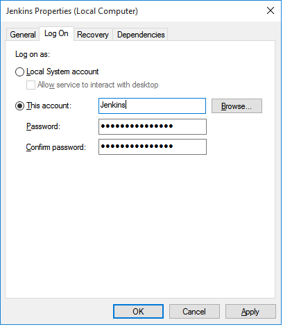
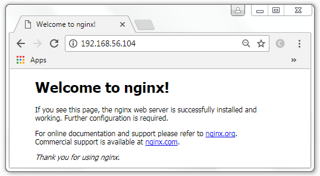
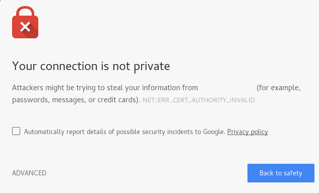
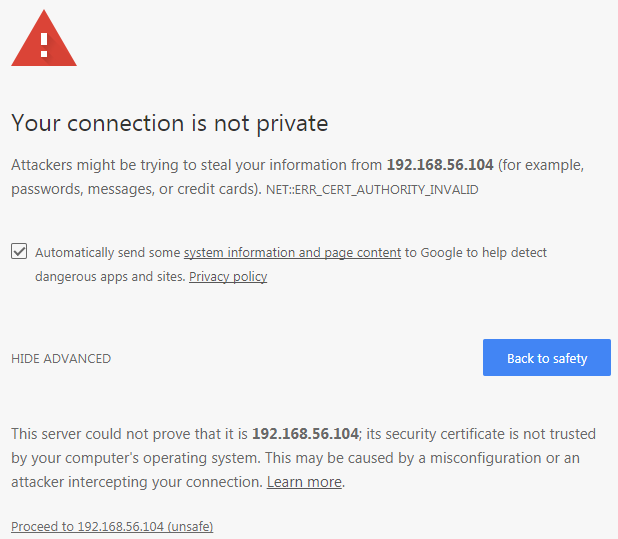
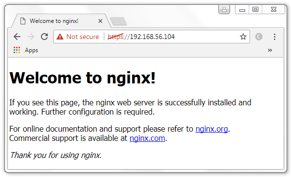
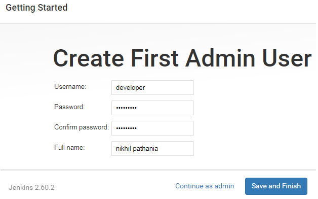

# 二、安装Jenkins

这一章是关于在各种平台上安装 Jenkins，等等。完成本章后，您应该能够执行以下操作:

*   在 servlet 容器上运行 Jenkins(Apache Tomcat)
*   在 Windows/Ubuntu/红帽 Linux/Fedora 上运行 Jenkins 作为独立应用
*   在反向代理服务器(Nginx)后面运行 Jenkins
*   和多克一起查Jenkins
*   利用 Docker 数据量的优势
*   使用 Docker 运行 Jenkins 的开发、试运行和生产实例

# 在 servlet 容器中运行 Jenkins

Jenkins 可在以下 servlet 容器上获得:

*   Apache Geronimo 3.0
*   GlassFish
*   IBM WebSphere
*   JBoss
*   码头
*   乔纳斯
*   自由简介
*   雄猫
*   中间件

在本节中，您将学习如何在 Apache Tomcat 服务器上安装 Jenkins。在 Apache Tomcat 上安装 Jenkins 作为服务非常简单。您可以选择运行 Jenkins 以及 Apache Tomcat 服务器上已经存在的其他服务，也可以使用 Apache Tomcat 服务器单独运行 Jenkins。

# 先决条件

在开始之前，请确保您已经准备好以下内容:

*   您需要一个至少有 4 GB 内存和多核处理器的系统。
*   根据您在团队中管理基础架构的方式，该机器可以是云平台(如 AWS、DigitalOcean 或任何其他云平台)上的实例、裸机，也可以是虚拟机(在 VMware vSphere 或任何其他服务器虚拟化软件上)。
*   机器上应该安装了 Ubuntu 16.04。选择 LTS 版本。
*   检查管理员权限；安装可能需要管理员用户名和密码。

# 安装 Java

按照以下步骤在 Ubuntu 上安装 Java:

1.  更新包索引:

```
 sudo apt-get update
```

2.  接下来，安装 Java。以下命令将安装 **Java 运行时环境** ( **JRE** ):

```
 sudo apt-get install default-jre 
```

3.  要设置`JAVA_HOME`环境变量，获取 Java 安装位置。通过执行以下命令来完成此操作:

```
 update-java-alternatives -l
```

4.  前面的命令将打印安装在您的机器上的 Java 应用的列表以及它们的安装路径。复制终端上显示的 Java 路径:

```
 java-1.8.0-openjdk-amd64  1081
        /usr/lib/jvm/java-1.8.0-openjdk-amd64
```

5.  使用以下命令打开`/etc/environment`文件进行编辑:

```
 sudo nano /etc/environment 
```

6.  在`/etc/environment`文件中添加 Java 路径(之前复制的路径)，格式如下:

```
        JAVA_HOME="/usr/lib/jvm/java-1.8.0-openjdk-amd64" 
```

7.  键入 *Ctrl* + *X* ，选择 *Y* 保存并关闭文件。
8.  接下来，使用以下命令重新加载文件:

```
 sudo source /etc/environment
```

# 安装 Apache Tomcat

按照以下步骤在您的 Ubuntu 机器上下载并安装 Apache Tomcat 服务器:

1.  移动到`/tmp`目录，使用`wget`命令下载 Tomcat 应用，如下图所示:

```
 cd /tmp
       wget https://archive.apache.org/dist/tomcat/tomcat-8/ \
        v8.5.16/bin/apache-tomcat-8.5.16.tar.gz
```

To get a complete list of Apache Tomcat versions visit: [https://archive.apache.org/dist/tomcat/](https://archive.apache.org/dist/tomcat/).

2.  使用以下命令创建名为`/opt/tomcat`的目录:

```
 sudo mkdir /opt/tomcat 
```

3.  在`/opt/tomcat`中打开档案的内容:

```
 sudo tar xzvf apache-tomcat-8*tar.gz \
        -C /opt/tomcat --strip-components=1 
```

4.  接下来，使用以下命令创建`systemd`服务文件:

```
 sudo nano /etc/systemd/system/tomcat.service
```

5.  将以下内容粘贴到文件中:

```
        [Unit] 
        Description=Apache Tomcat Web Application Container 
        After=network.target 

        [Service] 
        Type=forking 

        Environment=JAVA_HOME=/usr/lib/jvm/java-1.8.0-openjdk-amd64                     
        Environment=CATALINA_PID=/opt/tomcat/temp/tomcat.pid 
        Environment=CATALINA_HOME=/opt/tomcat 
        Environment=CATALINA_BASE=/opt/tomcat 
        Environment='CATALINA_OPTS=-Xms512M -Xmx1024M
        -server -XX:+UseParallelGC' 
        Environment='JAVA_OPTS=-Djava.awt.headless=true
        -Djava.security.egd=file:/dev/./urandom' 

        ExecStart=/opt/tomcat/bin/startup.sh 
        ExecStop=/opt/tomcat/bin/shutdown.sh 

        RestartSec=10 
        Restart=always 

        [Install] 
        WantedBy=multi-user.target 
```

6.  键入 *Ctrl* + *X* ，选择 *Y* 保存并关闭文件。
7.  接下来，使用以下命令重新加载 systemd 守护程序:

```
 sudo systemctl daemon-reload 
```

8.  使用以下命令启动 Tomcat 服务:

```
 sudo systemctl start tomcat 
```

9.  要检查 Tomcat 服务的状态，请运行以下命令:

```
 sudo systemctl status tomcat 
```

10.  您应该会看到以下输出:

```
 ● tomcat.service - Apache Tomcat Web Application Container 
          Loaded: loaded (/etc/systemd/system/tomcat.service; disabled;
          vendor preset: enabled) 
          Active: active (running) since Mon 2017-07-31 21:27:39 UTC;
          5s ago 
          Process: 6438 ExecStart=/opt/tomcat/bin/startup.sh (code=exited,
          status=0/SUCCESS) 
         Main PID: 6448 (java) 
            Tasks: 44 
           Memory: 132.2M 
              CPU: 2.013s 
           CGroup: /system.slice/tomcat.service 
                   └─6448 /usr/lib/jvm/java-1.8.0-openjdk-amd64/bin/java
       -Djava.util.logging.config.file=/opt/tomcat/conf/logging.properties
       -Djava.util.logging.manager=org.apache.juli.ClassLoaderLogMan 
```

# 启用防火墙和端口 8080

Apache Tomcat 在端口`8080`上运行。如果防火墙已禁用，请按照以下步骤启用:

1.  使用以下命令启用防火墙:

```
 sudo ufw enable 
```

2.  允许港口交通`8080`:

```
 sudo ufw allow 8080 
```

3.  使用以下命令启用 OpenSSH 以允许 SSH 连接:

```
 sudo ufw enable "OpenSSH" 
```

4.  使用以下命令检查防火墙状态:

```
 sudo ufw status 
```

5.  您应该会看到以下输出:

```
 Status: active  
        To                         Action      From 
        --                         ------      ---- 
        8080                       ALLOW       Anywhere 
        OpenSSH                    ALLOW       Anywhere 
        8080 (v6)                  ALLOW       Anywhere (v6) 
        OpenSSH (v6)               ALLOW       Anywhere (v6) 
```

6.  您现在应该可以在`http://<IP address of the Apache Tomcat>:8080`访问 Apache Tomcat 服务器页面。

# 配置 Apache Tomcat 服务器

在本节中，我们将启用对 Tomcat 管理器应用和主机管理器的访问:

1.  打开`/opt/tomcat/conf`目录下的`tomcat-users.xml`文件进行编辑:

```
 sudo nano /opt/tomcat/conf/tomcat-users.xml 
```

2.  该文件看起来如下所示，为了简单起见，我忽略了文件中的注释:

```
        <?xml version="1.0" encoding="UTF-8"?> 
        . . . 
        <tomcat-users  
        xmlns:xsi="http://www.w3.org/2001/XMLSchema-instance" 
        xsi:schemaLocation="http://tomcat.apache.org/xml tomcat-users.xsd" 
        version="1.0"> 
        . . . 
          <!-- 
            <role rolename="tomcat"/> 
            <role rolename="role1"/> 
            <user username="tomcat" password="<must-be-changed>"
             roles="tomcat"/> 
            <user username="both" password="<must-be-changed>"
             roles="tomcat,role1"/> 
            <user username="role1" password="<must-be-changed>"
             roles="role1"/> 
          --> 
        </tomcat-users> 
```

3.  从前面的文件中，可以看到`role`和`user`字段被注释了。我们需要启用一个角色和一个用户来允许访问 Tomcat 管理器应用页面:

```
        <role rolename="manager-gui"/> 
        <role rolename="admin-gui"/> 
        <user username="admin" password="password"
         roles="manager-gui,admin-gui"/>
```

4.  最后，文件应该如下所示(注释被删除):

```
        <?xml version="1.0" encoding="UTF-8"?>  
        <tomcat-users  
        xmlns:xsi="http://www.w3.org/2001/XMLSchema-instance" 
        xsi:schemaLocation="http://tomcat.apache.org/xml tomcat-users.xsd" 
        version="1.0"> 
          <role rolename="manager-gui"/> 
          <role rolename="admin-gui"/> 
          <user username="admin" password="password"
           roles="manager-gui,admin-gui"/> 
        </tomcat-users> 
```

5.  键入 *Ctrl* + *X* ，选择 *Y* 保存并关闭文件。
6.  默认情况下，您只能从 Apache Tomcat 服务器中访问管理器和主机管理器应用。因为我们将从远程机器管理在 Apache 上运行的服务，所以我们需要删除这些限制。
7.  打开以下两个文件，`/opt/tomcat/webapps/manager/META-INF/context.xml`和`/opt/tomcat/webapps/host-manager/META-INF/context.xml`。
8.  在这些文件中，对以下部分进行注释:

```
        <Context antiResourceLocking="false" privileged="true" > 
          <!--<Valve className="org.apache.catalina.valves.RemoteAddrValve" 
          allow="127\.\d+\.\d+\.\d+|::1|0:0:0:0:0:0:0:1" />--> 
          <Manager sessionAttributeValueClassNameFilter="java\.lang\
          .(?:Boolean|Integer|Long|Number|String)|org\.apache\.catalina\
          .filters\.CsrfPreventionFilter\$LruCache(?:\$1)?|java\.util\
          .(?:Linked)$ 
        </Context> 
```

9.  键入 *Ctrl* + *X* ，选择 *Y* 保存并关闭文件。

10.  使用以下命令重新启动 Tomcat 服务器:

```
 sudo systemctl restart tomcat 
```

11.  尝试从 Apache Tomcat 服务器主页访问管理器应用和主机管理器。

# 在 Apache Tomcat 服务器上安装 Jenkins

如果您不希望 Jenkins master 有一个独立的服务器，并且希望它与 Apache Tomcat 服务器上存在的其他服务一起托管，则可以执行以下步骤:

1.  移动到`/tmp`目录，使用`wget`命令下载 Jenkins 应用，如下所示:

```
 cd /tmp
        wget http://mirrors.jenkins.io/war-stable/latest/jenkins.war 
```

2.  之前的命令会下载最新稳定版本的`jenkins.war`文件。
3.  将文件从`/tmp`移动到`/opt/tomcat/`:

```
 sudo mv jenkins.war /opt/tomcat/webapps/ 
```

4.  列出`/opt/tomcat/webapps/`目录的内容:

```
 sudo ls -l /opt/tomcat/webapps 
```

您应该会看到以下输出:

```
 total 68984 
        -rw-rw-r--  1 ubuntu ubuntu 70613578 Jul 19 22:37 jenkins.war 
        drwxr-x---  3 root   root       4096 Jul 31 21:09 ROOT 
        drwxr-x--- 14 root   root       4096 Jul 31 21:09 docs 
        drwxr-x---  6 root   root       4096 Jul 31 21:09 examples 
        drwxr-x---  5 root   root       4096 Jul 31 21:09 manager 
        drwxr-x---  5 root   root       4096 Jul 31 21:09 host-manager 
        drwxr-x--- 10 root   root       4096 Jul 31 22:52 jenkins 
```

You will notice that a `jenkins` folder automatically gets created the moment you move the `jenkins.war` package to the `webapps` folder. This is because the `.war` file is a web application archive file that automatically gets extracted once deployed to the `webapps` directory. What we did is a small deployment activity.

5.  这就是你需要做的。您可以使用`http://<IP address of Tomcat server>:8080/jenkins`访问Jenkins。

# 在 Apache Tomcat 服务器上单独安装 Jenkins

如果您选择让 Apache Tomcat 服务器仅用于使用 Jenkins，请执行以下步骤:

1.  移动到`/tmp`目录，使用`wget`命令下载 Jenkins 应用，如下所示:

```
 cd /tmp 
 wget http://mirrors.jenkins.io/war-stable/latest/jenkins.war 
```

2.  将下载的`jenkins.war`包重命名为`ROOT.war`:

```
 sudo mv jenkins.war ROOT.war 
```

3.  接下来，切换到`root`用户，删除`/opt/tomcat/webapps`目录内的所有内容:

```
 sudo su - 
 cd /opt/tomcat/webapps 
 sudo rm -r * 
```

4.  现在将`ROOT.war`(已重命名)包从`/tmp`目录移动到`/opt/tomcat/webapps`文件夹:

```
 sudo mv /tmp/ROOT.war /opt/tomcat/webapps/ 
```

5.  列出`/opt/tomcat/webapps`目录的内容，你会注意到一个`ROOT`文件夹会自动创建:

```
 total 68964 
        drwxr-x--- 10 root   root       4096 Jul 31 23:10 ROOT 
        -rw-rw-r--  1 ubuntu ubuntu 70613578 Jul 19 22:37 ROOT.war 
```

It's always recommended to have a dedicated web server solely for Jenkins.

6.  您可以使用`http://<IP address of Tomcat server>:8080/`访问Jenkins，无需任何附加路径。显然，Apache 服务器现在是 Jenkins 服务器。

Deleting the content of the `/opt/tomcat/webapps` directory (leaving behind the `ROOT` directory and `ROOT.war`) and then moving the `jenkins.war` file to the `webapps` folder is also sufficient to make Apache Tomcat server solely for the use of Jenkins.

The step of renaming `jenkins.war` to `ROOT.war` is only necessary if you want to make `http://<IP address of Tomcat server>:8080/` the standard URL for Jenkins.

# 设置Jenkins家的道路

在我们开始使用 Jenkins 之前，有一件重要的事情需要配置，`jenkins_home`路径。当您在 Tomcat 上将 Jenkins 安装为服务时，`jenkins_home`路径会自动设置为`/root/.jenkins/`。这是存储所有 Jenkins 配置、日志和构建的位置。您在 Jenkins 仪表板上创建和配置的所有内容都存储在这里。

我们需要让它变得更容易接近，比如`/var/jenkins_home`。这可以通过以下方式实现:

1.  使用以下命令停止 Apache Tomcat 服务器:

```
 sudo systemctl stop tomcat 
```

2.  打开`/opt/tomcat/conf`里面的`context.xml`文件进行编辑:

```
 sudo nano /opt/tomcat/conf/context.xml 
```

3.  文件将如下所示(注释已删除):

```
        <?xml version="1.0" encoding="UTF-8"?> 
        <Context> 
          <WatchedResource>WEB-INF/web.xml</WatchedResource> 
          <WatchedResource>${catalina.base}/conf/web.xml</WatchedResource> 
        </Context>
```

4.  在`<Context> </Context>`之间增加以下一行:

```
        <Environment name="JENKINS_HOME" value="/var/jenkins_home" 
        type="java.lang.String"/> 
```

5.  使用以下命令启动 Tomcat 服务:

```
 sudo systemctl start tomcat 
```

# 在 Windows 上安装独立的Jenkins服务器

在 Windows 上安装 Jenkins 非常简单。在执行在 Windows 上安装 Jenkins 的步骤之前，让我们看一下先决条件。

# 先决条件

在我们开始之前，请确保您已经准备好以下内容:

*   我们需要一台至少有 4 GB 内存和多核处理器的机器。
*   根据您在团队中管理基础架构的方式，该机器可以是云平台(如 AWS、DigitalOcean 或任何其他云平台)上的实例、裸机，也可以是虚拟机(在 VMware vSphere 或任何其他服务器虚拟化软件上)。
*   机器上应安装任何一个最新的视窗操作系统(视窗 7/8/10、视窗服务器 2012/2012 R2/2016)。
*   检查管理员权限；安装可能会要求管理员用户名和密码。
*   确保端口`8080`打开。

# 安装 Java

按照以下步骤安装 Java:

1.  从[https://java.com/en/download/manual.jsp](https://java.com/en/download/manual.jsp)下载最新版本的 Java JRE(基于你的操作系统的 x86 或 x64)。
2.  遵循安装程序。
3.  要检查是否已成功安装 Java，请使用命令提示符运行以下命令:

```
 java -version 
```

4.  您应该会得到以下输出:

```
 java version "1.8.0_121" 
        Java(TM) SE Runtime Environment (build 1.8.0_121-b13) 
        Java HotSpot(TM) 64-Bit Server VM (build 25.121-b13, mixed mode) 
```

5.  要设置`JAVA_HOME`，首先使用以下命令获取 Windows 上的 Java 安装路径:

```
 where java 
```

6.  前面的命令应该输出 Java 安装路径，如下命令所示。复制没有`\bin\java`的路径:

```
 C:\Program Files\Java\jdk1.8.0_121\bin\java 
```

7.  以管理员身份打开命令提示符，运行以下命令设置`JAVA_HOME`路径。确保使用出现在屏幕上的 Java 安装路径:

```
 setx -m JAVA_HOME "C:\Program Files\Java\jdk1.8.121" 
```

# 安装Jenkins的最新稳定版本

要安装最新稳定版本的 Jenkins，请按顺序执行以下步骤:

1.  在Jenkins官方网站[https://jenkins.io/download/](https://jenkins.io/download/)下载最新稳定的Jenkins套装。要安装Jenkins的最新稳定版本，请下载**长期支持** ( **LTS** )版本。如果你只是想要Jenkins的最新版本，选择每周发布。
2.  解压下载的包，会发现一个`jenkins.msi`文件。
3.  运行`jenkins.msi`并遵循安装步骤。
4.  在安装过程中，您可以选择Jenkins安装目录。默认为`C:\Program Files\Jenkins`或`C:\Program Files (x86)\Jenkins`。保持原样，然后单击“下一步”按钮。
5.  单击“完成”按钮完成安装。

# 在 Windows 上启动、停止和重新启动Jenkins

默认情况下，Jenkins 在安装后开始运行。在本节中，显示了启动、停止、重新启动和检查 Jenkins 服务状态的命令:

1.  使用以下命令从命令提示符打开服务窗口:

```
 services.msc 
```

2.  找一个叫Jenkins的服务。
3.  再次右键单击Jenkins服务，然后单击属性。
4.  在常规选项卡下，您可以看到 Jenkins 服务名称、可执行文件的路径、服务状态和启动参数。
5.  使用启动类型选项，您可以选择Jenkins在 Windows 机器上启动的方式。您可以从自动、手动和自动(延迟启动)中进行选择。确保它始终设置为自动。

6.  在以下服务状态下，可以选择手动启动、停止、暂停和恢复Jenkins服务:


Configuring the Jenkins service startup option

7.  转到下一个选项卡，即登录。在这里，我们定义了Jenkins开始的用户名。
8.  您可以选择使用本地系统帐户(不推荐)，也可以创建具有特殊权限的特殊 Jenkins 用户(推荐):

An exclusive account for Jenkins is always preferred. The reason is that Local System account is not under control; it may get deleted or the password may expire depending on the organization's policies, whereas the Jenkins user account can be set with preferred policies and privileges.



Configuring the Jenkins service Log On option

9.  下一个选项卡是恢复。在这里，我们可以指定在 Jenkins 服务无法启动的情况下的操作项目。

10.  这里有一个例子。在第一次失败时，试图重新启动Jenkins，在第二次失败时，试图重新启动计算机。最后，在随后的故障中，运行一个程序来调试问题，或者我们可以运行一个脚本，通过电子邮件将 Jenkins 故障日志发送给相应的 Jenkins 管理员进行调查:


Configuring the Jenkins service Recovery option

# 在 Ubuntu 上安装独立的 Jenkins 服务器

在 Ubuntu 上安装一个 Jenkins 服务器相当容易。在执行在 Ubuntu 上安装 Jenkins 的步骤之前，让我们看一下先决条件。

# 先决条件

在我们开始之前，请确保您已经准备好以下内容:

*   我们需要一台至少有 4 GB 内存和多核处理器的机器。
*   根据您在团队中管理基础架构的方式，该机器可以是云平台(如 AWS、DigitalOcean 或任何其他云平台)上的实例、裸机，也可以是虚拟机(在 VMware vSphere 或任何其他服务器虚拟化软件上)。
*   机器上应该安装了 Ubuntu 16.04。选择 LTS 版本。
*   检查管理员权限；安装可能需要管理员用户名和密码。
*   确保端口`8080`打开。

# 安装 Java

按照以下步骤安装 Java:

1.  使用以下命令更新包索引:

```
 sudo apt-get update 
```

2.  接下来，安装 Java。以下命令将安装 JRE:

```
 sudo apt-get install default-jre 
```

3.  要设置`JAVA_HOME`环境变量，首先获取 Java 安装位置。通过执行以下命令来完成此操作:

```
 update-java-alternatives -l  
```

4.  前面的命令将打印安装在您的机器上的 Java 应用的列表以及它们的安装路径。复制终端上显示的 Java 路径:

```
 java-1.8.0-openjdk-amd64 1081
        /usr/lib/jvm/java-1.8.0-openjdk-amd64
```

5.  使用以下命令打开`/etc/environment`文件进行编辑:

```
 sudo nano /etc/environment 
```

6.  在`/etc/environment`文件中添加 Java 路径(之前复制的路径)，格式如下:

```
        JAVA_HOME="/usr/lib/jvm/java-1.8.0-openjdk-amd64" 
```

7.  键入 *Ctrl* + *X* ，选择 *Y* 保存并关闭文件。
8.  接下来，使用以下命令重新加载文件:

```
        sudo source /etc/environment
```

# 安装Jenkins的最新版本

要安装最新版本的 Jenkins，请按顺序执行以下步骤:

1.  使用以下命令将存储库密钥添加到系统中:

```
 wget --no-check-certificate -q -O \
        - https://pkg.jenkins.io/debian/jenkins-ci.org.key | \
 sudo apt-key add - 
```

2.  你应该得到`OK`的输出。接下来，使用以下命令追加 Debian 包存储库地址:

```
 echo deb http://pkg.jenkins.io/debian binary/ | \
        sudo tee /etc/apt/sources.list.d/jenkins.list 
```

3.  更新包索引:

```
 sudo apt-get update 
```

4.  现在，使用以下命令安装 Jenkins:

```
 sudo apt-get install jenkins 
```

5.  如果需要启动Jenkins，请参见 Ubuntu 上的*启动、停止和重新启动Jenkins部分。*
6.  Jenkins现在可以使用了。默认情况下，Jenkins服务在端口`8080`上运行。要访问Jenkins，请在浏览器中使用`http://localhost:8080/`或`http://<Jenkins server IP address>:8080/`。

# 安装Jenkins的最新稳定版本

如果您更喜欢安装 Jenkins 的稳定版本，请按顺序执行以下步骤:

1.  使用以下命令将存储库密钥添加到系统中:

```
 wget --no-check-certificate -q -O - \
        https://pkg.jenkins.io/debian-stable/jenkins-ci.org.key | \
        sudo apt-key add - 
```

2.  你应该得到`OK`的输出。接下来，使用以下命令追加 Debian 包存储库地址:

```
 echo deb http://pkg.jenkins.io/debian-stable binary/ | \
        sudo tee /etc/apt/sources.list.d/jenkins.list 
```

3.  更新包索引:

```
 sudo apt-get update
```

4.  现在，使用以下命令安装 Jenkins:

```
 sudo apt-get install jenkins 
```

5.  如果需要启动Jenkins，请参见 Ubuntu 上的*启动、停止和重新启动Jenkins部分。*
6.  Jenkins现在可以使用了。默认情况下，Jenkins服务在端口`8080`上运行。要访问Jenkins，请在浏览器中使用`http://localhost:8080/`或`http://<Jenkins server IP address>:8080/`。

In order to troubleshoot Jenkins, access the logs file `/var/log/jenkins/jenkins.log`.

The Jenkins service runs under the user `Jenkins`*,* which is automatically created upon installation.

# 在 Ubuntu 上启动、停止和重新启动 Jenkins

默认情况下，Jenkins 在安装后开始运行。以下是启动、停止、重启和检查 Jenkins 服务状态的命令:

1.  要启动Jenkins，请使用以下命令:

```
 sudo systemctl start jenkins 
```

2.  同样，要停止Jenkins，请使用以下命令:

```
 sudo systemctl stop jenkins 
```

3.  要重新启动 Jenkins，请使用以下命令:

```
 sudo systemctl restart jenkins 
```

4.  要检查Jenkins服务的状态，使用以下`systemctl`命令:

```
 sudo systemctl status jenkins 
```

5.  您应该会看到以下输出:

```
 ● jenkins.service - LSB: Start Jenkins at boot time 
        Loaded: loaded (/etc/init.d/jenkins; bad; vendor preset: enabled) 
        Active: active (exited) since Wed 2017-07-19 22:34:39 UTC; 6min ago 
        Docs: man:systemd-sysv-generator(8) 
```

# 在红帽 Linux 上安装独立的Jenkins服务器

在本节中，我们将学习在红帽 Linux 上安装 Jenkins。这里讨论的安装过程也适用于 Fedora。

# 先决条件

在我们开始之前，请确保您已经准备好以下内容:

*   我们需要一台至少有 4 GB 内存和多核处理器的机器。
*   根据您在团队中管理基础架构的方式，该机器可以是云平台(如 AWS、DigitalOcean 或任何其他云平台)上的实例、裸机，也可以是虚拟机(在 VMware vSphere 或任何其他服务器虚拟化软件上)。
*   这台机器应该安装了 RHEL 7.3。
*   检查管理员权限；安装可能需要管理员用户名和密码。
*   确保端口`8080`打开。

# 安装 Java

按照以下步骤安装 Java:

1.  移至`/tmp`目录下载 Java:

```
 cd /tmp 
 wget -O java_8.131.rpm \
        http://javadl.oracle.com/webapps/download/AutoDL? \
        BundleId=220304_d54c1d3a095b4ff2b6607d096fa80163 
```

2.  接下来，安装 Java。以下命令将安装 JRE:

```
 sudo rpm -ivh java_8.131.rpm 
```

3.  要设置`JAVA_HOME`环境变量，首先获取 Java 安装的位置。通过执行以下命令来完成此操作:

```
 sudo alternatives --config java 
```

4.  前面的命令将打印您的机器上安装的 Java 应用的列表，以及它们的安装路径。复制终端上显示的 Java 路径:

```
 There is 1 program that provides 'java'. 
        Selection    Command 
        ----------------------------------------------- 
        *+ 1           /usr/java/jre1.8.0_131/bin/java
```

5.  使用以下命令在`/etc/environment`文件中添加 Java 路径(之前复制的路径):

```
 sudo sh \
        -c "echo JAVA_HOME=/usr/java/jre1.8.0_131 >>
        /etc/environment" 
```

# 安装Jenkins的最新版本

要安装最新版本的 Jenkins，请执行以下步骤:

1.  使用以下命令将Jenkins存储库添加到`yum`存储库中:

```
 sudo wget -O /etc/yum.repos.d/jenkins.repo \
         http://pkg.jenkins-ci.org/redhat/jenkins.repo 
        sudo rpm --import https://jenkins-ci.org/redhat/jenkins-ci.org.key
```

2.  使用以下命令安装Jenkins:

```
 sudo yum install jenkins 
```

3.  如果需要启动 Jenkins，请参见红帽 Linux 上的*启动、停止和重新启动 Jenkins 部分。*

Jenkins现在可以使用了。默认情况下，Jenkins服务在端口`8080`上运行。要访问Jenkins，请在浏览器中使用`http://localhost:8080/`或`http://<Jenkins server IP address>:8080/`。

# 安装Jenkins的最新稳定版本

如果您更喜欢安装 Jenkins 的稳定版本，请按照以下步骤操作:

1.  使用以下命令将Jenkins存储库添加到`yum`存储库中:

```
 sudo wget -O /etc/yum.repos.d/jenkins.repo \
         http://pkg.jenkins-ci.org/redhat-stable/jenkins.repo 
 sudo rpm --import https://jenkins-ci.org/redhat/jenkins-ci.org.key 
```

2.  使用以下命令安装Jenkins:

```
 sudo yum install jenkins
```

3.  如果需要启动 Jenkins，请参见红帽 Linux 上的*启动、停止和重新启动 Jenkins 部分。*

# 在红帽 Linux 上启动、停止和重新启动Jenkins

以下是启动、停止、重启和检查 Jenkins 服务状态的命令:

1.  要启动Jenkins，请使用以下命令:

```
 sudo systemctl start jenkins 
```

2.  同样，要停止Jenkins，请使用以下命令:

```
 sudo systemctl stop jenkins 
```

3.  要重新启动 Jenkins，请使用以下命令:

```
 sudo systemctl restart jenkins 
```

4.  要检查Jenkins服务的状态，使用以下`systemctl`命令:

```
 sudo systemctl status jenkins  
```

5.  您应该会看到以下输出:

```
        ● jenkins.service - LSB: Jenkins Automation Server 
          Loaded: loaded (/etc/rc.d/init.d/jenkins; bad;
          vendor preset: disabled) 
          Active: active (running) since Wed 2017-07-19 18:45:47 EDT;
           2min 31s ago 
             Docs: man:systemd-sysv-generator(8) 
          Process: 1081 ExecStart=/etc/rc.d/init.d/jenkins start
          (code=exited, status=0/SUCCESS) 
           CGroup: /system.slice/jenkins.service 
                   └─1706 /etc/alternatives/java
           -Dcom.sun.akuma.Daemon=daemonized -Djava.awt.headless=true
           -DJENKINS_HOME=/var/lib/j...
```

In order to troubleshoot Jenkins, access the logs in `var/log/jenkins/jenkins.log`.

The Jenkins service runs with the user Jenkins, which automatically gets created upon installation.

# 在反向代理背后操纵Jenkins

在本例中，我们将学习如何将一台 Nginx 服务器(运行在独立机器上)放在一台 Jenkins 服务器(运行在另一台独立机器上)的前面。

# 先决条件

在我们开始之前，请确保您已经准备好以下内容:

*   我们需要两台至少有 4 GB 内存的机器和一个多核处理器。一个运行 Nginx，另一个运行 Jenkins。
*   根据您在团队中管理基础架构的方式，该机器可以是云平台(如 AWS、DigitalOcean 或任何其他云平台)上的实例、裸机，也可以是虚拟机(在 VMware vSphere 或任何其他服务器虚拟化软件上)。
*   机器上应该安装了 Ubuntu 16.04 或更高版本。
*   检查管理员权限；安装可能需要管理员用户名和密码。
*   两台机器应该在同一个网络上。以下设置假设您的组织有一个用于其所有服务的内部网。

# 安装和配置 Nginx

Ubuntu 上 Nginx 的安装很简单。按照以下步骤在 Ubuntu 上安装 Nginx 服务器:

1.  更新本地包索引:

```
 sudo apt-get update
```

2.  使用以下命令安装`nginx`:

```
 sudo apt-get install nginx 
```

# 在 Nginx 服务器上配置防火墙

我们需要在 Nginx 服务器上配置防火墙，以允许访问 Nginx 服务。请遵循以下步骤:

1.  使用`ufw`命令检查防火墙状态:

```
 sudo ufw status 
```

您应该会看到以下输出:

```
 Status: inactive 
```

2.  如果已启用，转到*步骤 3* 。但是，如果您发现它被禁用，请使用以下命令启用防火墙:

```
 sudo ufw enable  
```

您应该会看到以下输出

```
        Command may disrupt existing ssh connections.
        Proceed with operation (y|n)? y 
        Firewall is active and enabled on system startup 
```

3.  使用以下命令列出可用的配置。您应该会看到三个 Nginx 配置文件和一个 OpenSSH 配置文件:

```
 sudo ufw app list  
```

您应该会看到以下输出

```
        Available applications: 
          Nginx Full 
          Nginx HTTP 
          Nginx HTTPS 
          OpenSSH
```

The `Nginx Full` profile opens port `80` (unencrypted) and port `443` (TLS/SSL).

The `Nginx HTTP` profile opens only port `80` (unencrypted).

The `Nginx HTTPS` profile opens only port `443` (TLS/SSL).

The `OpenSSH` profile opens only port `22` (SSH).

It is always recommended to enable the most restrictive profile.

4.  为了简单起见，我们将启用`Nginx Full`配置文件，如下命令所示:

```
 sudo ufw allow 'Nginx Full'  
        Rules updated 
        Rules updated (v6) 
```

5.  此外，如果`OpenSSH`配置文件未激活，请将其启用，如图所示。这将允许我们通过 SSH 继续访问我们的 Nginx 机器:

```
 sudo ufw allow 'OpenSSH' 
```

You won't be able to log in to your Nginx machine if OpenSSH is disabled.

6.  使用以下命令验证更改。你应该在允许的情况下看到`Nginx Full`和`OpenSSH`:

```
 sudo ufw status  
```

您应该会看到以下输出:

```
        Status: active  
        To                         Action      From 
        --                         ------      ---- 
        OpenSSH                    ALLOW       Anywhere 
        Nginx Full                 ALLOW       Anywhere 
        OpenSSH (v6)               ALLOW       Anywhere (v6) 
        Nginx Full (v6)            ALLOW       Anywhere (v6)
```

7.  使用`systemctl`命令检查 Nginx 服务是否正在运行:

```
 systemctl status nginx  
```

您应该会看到以下输出:

```
        ● nginx.service - A high performance web server and a reverse proxy
        server 
           Loaded: loaded (/lib/systemd/system/nginx.service; enabled;
           vendor preset: enabled) 
           Active: active (running) since Thu 2017-07-20 18:44:33 UTC;
        45min ago 
         Main PID: 2619 (nginx) 
            Tasks: 2 
           Memory: 5.1M 
              CPU: 13ms 
           CGroup: /system.slice/nginx.service 
                   ├─2619 nginx: master process /usr/sbin/nginx
           -g daemon on;                master_process on 
                   └─2622 nginx: worker process
```

8.  从前面的输出中，您可以看到我们的 Nginx 服务运行良好。现在尝试使用浏览器访问它。首先，使用`ip route`命令获取机器的 IP 地址:

```
 ip route  
```

您应该会看到以下输出:

```
        default via 10.0.2.2 dev enp0s3
        10.0.2.0/24 dev enp0s3  proto kernel
        scope link src 10.0.2.15
        192.168.56.0/24 dev enp0s8  proto kernel  scope link
        src 192.168.56.104 
```

9.  现在使用`http://<IP Address>:80`进入 Nginx 主页。您应该会看到类似以下截图的内容:



The Nginx index page

# 启动、停止和重新启动 Nginx 服务器

现在我们已经启动了您的 Nginx 服务器，让我们看看可以用来管理 Nginx 的一些命令。就像Jenkins一样，我们将使用`systemctl`命令来管理 Nginx:

1.  要停止 Nginx，请使用以下命令:

```
 sudo systemctl stop nginx
```

2.  要在 Nginx 停止时启动它，请使用以下命令:

```
 sudo systemctl start nginx 
```

3.  要重新启动 Nginx，请使用以下命令:

```
 sudo systemctl restart nginx 
```

4.  要在进行配置更改后重新加载 Nginx，请使用以下命令:

```
 sudo systemctl reload nginx 
```

# 使用 OpenSSL 保护 Nginx

在本节中，我们将学习设置一个自签名的 SSL 证书，用于我们的 Nginx 服务器。

# 创建 SSL 证书

运行以下命令，使用 OpenSSL 创建自签名密钥和证书对:

```
sudo openssl req -x509 -nodes -days 365 -newkey rsa:2048 \
-keyout /etc/ssl/private/nginx-selfsigned.key -out \
/etc/ssl/certs/nginx-selfsigned.crt 
```

下表解释了上一个命令中使用的参数:

| **参数** | **描述** |
| `req` | 该参数表示我们要使用 X.509 **证书签署请求** ( **CSR** )管理。 |
| `-x509` | 此参数允许我们创建自签名证书，而不是生成证书签名请求。 |
| `-nodes` | 此参数允许 OpenSSL 跳过使用密码验证我们的证书的选项。 |
| `-days` | 此参数设置证书的有效期。 |
| `-newkey rsa: 2048` | 这个参数告诉 OpenSSL 同时生成一个新证书和一个新密钥。`rsa:2048`选项使 RSA 密钥`2048`位变长。 |
| `-keyout` | 此参数允许您将生成的私钥文件存储在您选择的位置。 |
| `-out` | 此参数允许您将生成的证书存储在您选择的位置。 |

当您发出以下命令来生成私钥和新证书时，系统会提示您提供信息。提示看起来如下所示:

```
Country Name (2 letter code) [AU]:DK 
State or Province Name (full name) [Some-State]:Midtjylland 
Locality Name (eg, city) []:Brande 
Organization Name (eg, company) [Internet Widgits Pty Ltd]: Deviced.Inc 
Organizational Unit Name (eg, section) []:DevOps 
Common Name (e.g. server FQDN or YOUR name) []:<IP address of Nginx> 
Email Address []:admin@organisation.com 
```

The **Common Name** (**CN**) field, also known as the **Fully Qualified Domain Name** (**FQDN**) is very important. You need to provide the IP address or the domain name of your Nginx server.

`/etc/ssl/private/`现在将包含您的`nginx-selfsigned.key`文件，`/etc/ssl/certs/`将包含您的`nginx-selfsigned.crt`文件。

接下来，我们将创建一个强大的迪菲-赫尔曼集团，用于与客户谈判**完美转发保密** ( **PFS** )。我们将通过使用`openssl`来实现，如下命令所示:

```
sudo openssl dhparam -out /etc/ssl/certs/dhparam.pem 2048 
```

这将花费相当长的时间，但是一旦完成，它将在`/etc/ssl/certs/`中生成一个`dhparam.pem`文件。

# 创建强加密设置

在下一节中，我们将设置一个强大的 SSL 密码套件来保护我们的 Nginx 服务器:

1.  在`/etc/nginx/snippets/`中创建一个名为`*s*sl-params.conf`的配置文件，如下图所示:

```
 sudo nano /etc/nginx/snippets/ssl-params.conf
```

2.  将以下代码复制到文件中:

```
        # from https://cipherli.st/ 
        # and https://raymii.org/s/tutorials/
          Strong_SSL_Security_On_nginx.html 

        ssl_protocols TLSv1 TLSv1.1 TLSv1.2; 
        ssl_prefer_server_ciphers on; 
        ssl_ciphers "EECDH+AESGCM:EDH+AESGCM:AES256+EECDH:AES256+EDH"; 
        ssl_ecdh_curve secp384r1; 
        ssl_session_cache shared:SSL:10m; 
        ssl_session_tickets off; 
        ssl_stapling on; 
        ssl_stapling_verify on; 
        resolver 8.8.8.8 8.8.4.4 valid=300s; 
        resolver_timeout 5s; 
        # disable HSTS header for now 
        #add_header Strict-Transport-Security "max-age=63072000;
         includeSubDomains; preload"; 
        add_header X-Frame-Options DENY; 
        add_header X-Content-Type-Options nosniff; 

        ssl_dhparam /etc/ssl/certs/dhparam.pem; 
```

3.  键入 *Ctrl* + *X* ，选择 *Y* 保存并关闭文件。

We have used the recommendations by Remy van Elst that are available at [https://cipherli.st/](https://cipherli.st/).

# 修改 Nginx 配置

接下来，我们将修改我们的 Nginx 配置以启用 SSL。请遵循以下步骤:

1.  首先，备份位于`/etc/nginx/sites-available/`中名为`default`的现有 Nginx 配置文件:

```
 sudo cp /etc/nginx/sites-available/default \
        /etc/nginx/sites-available/default.backup
```

2.  现在，使用以下命令打开文件进行编辑:

```
 sudo nano /etc/nginx/sites-available/default 
```

3.  你会发现文件中有很多注释行。如果您暂时忽略它们，您可能会看到以下内容:

```
        server { 
            listen 80 default_server; 
            listen [::]:80 default_server; 

            # SSL configuration 

            # listen 443 ssl default_server; 
            # listen [::]:443 ssl default_server; 

            . . . 

            root /var/www/html; 

            . . . 

            index index.html index.htm index.nginx-debian.html; 
            server_name _; 

            . . . 
```

4.  我们将修改配置，以便将未加密的 HTTP 请求自动重定向到加密的 HTTPS。我们将通过添加以下三行来实现这一点，如以下代码所示:

```
        server { 
            listen 80 default_server; 
            listen [::]:80 default_server; 
            server_name <nginx_server_ip or nginx domain name>; 
            return 301 https://$server_name$request_uri; 
        } 

            # SSL configuration 

            # listen 443 ssl default_server; 
            # listen [::]:443 ssl default_server; 

            . . .
```

5.  从前面的代码中，您可以看到我们已经关闭了服务器块。
6.  接下来，我们将启动一个新的服务器块，取消使用端口`443`的两个`listen`指令的注释，并将`http2`添加到这些行中，以便启用 HTTP/2，如以下代码块所示:

```
        server { 
            listen 80 default_server; 
            listen [::]:80 default_server; 
            server_name <nginx_server_ip or nginx domain name>; 
            return 301 https://$server_name$request_uri; 
        } 

        server { 

            # SSL configuration 

            listen 443 ssl http2 default_server; 
            listen [::]:443 ssl http2 default_server; 

            . . . 
```

7.  接下来，我们将添加自签名证书和密钥的位置。我们只需要包含我们设置的两个代码片段文件:

```
        server { 
            listen 80 default_server; 
            listen [::]:80 default_server; 
            server_name <nginx_server_ip or nginx domain name>; 
            return 301 https://$server_name$request_uri; 
        } 
        server { 

            # SSL configuration 

            listen 443 ssl http2 default_server; 
            listen [::]:443 ssl http2 default_server; 
            ssl_certificate /etc/ssl/certs/nginx-selfsigned.crt; 
            ssl_certificate_key /etc/ssl/private/nginx-selfsigned.key; 
            include snippets/ssl-params.conf; 

            . . .
```

8.  接下来，我们将在我们的 SSL 服务器块内将`server_name`值设置为我们的 Nginx IP 或域名。默认情况下，`server_name`可以设置为一个*下划线* ( `_` ) *、*，如下代码块所示:

```
        server { 
            # SSL configuration 

            . . . 

            server_name <nginx_server_ip or nginx domain name>; 

            . . . 
        } 
```

9.  键入 *Ctrl* + *X* ，选择 *Y* 保存并关闭文件。

# 启用更改并测试我们的 Nginx 设置

我们现在将重新启动 Nginx 来实现我们的新更改:

1.  首先，检查我们的文件中是否有语法错误。为此，请键入以下命令:

```
 sudo nginx -t 
```

2.  如果一切都成功，您应该会看到类似以下命令输出的内容:

```
 nginx: [warn] "ssl_stapling" ignored, issuer certificate not found 
        nginx: the configuration file /etc/nginx/nginx.conf syntax is ok 
        nginx: configuration file /etc/nginx/nginx.conf test is successful 
```

3.  使用以下命令重新启动 Nginx:

```
 sudo systemctl restart nginx 
```

4.  接下来，使用`http://<Nginx_IP_Address>:80`访问您的 Nginx 服务器。你应该注意到你已经被自动重定向到`https://<Nginx_IP_Address>:80`。

5.  您将看到一个类似于以下屏幕截图的警告:



SSL warning

6.  这是意料之中的，因为我们创建的证书不是由您浏览器的某个可信证书颁发机构签名的。
7.  点击高级...按钮，然后点击**进入 192.168.56.104(不安全)**:



Proceeding as unsafe

8.  现在，您应该能够看到 Nginx 默认页面，如下图所示:



The Nginx index page with SSL encryption

# 配置Jenkins服务器

在本节中，我们将在我们的 Jenkins 服务器上执行一些配置。要首先设置Jenkins服务器，请参见*在 Ubuntu 上安装独立的Jenkins服务器*部分。

一旦 Jenkins 服务器启动并运行，请执行以下步骤:

1.  为了让 Jenkins 与 Nginx 一起工作，我们需要更新 Jenkins 配置，以便 Jenkins 服务器只监听 Jenkins IP 地址或 Jenkins 域名接口，而不是所有接口(`0.0.0.0`)。如果 Jenkins 监听所有接口，那么它可能可以在其原始的未加密端口(`8080`)上访问。
2.  为此，修改`/etc/default/jenkins`配置文件，如下命令所示:

```
 sudo nano /etc/default/jenkins
```

3.  在文件内部，一直向下滚动到最后一行或者只寻找`JENKINS_ARGS`行。
4.  将以下参数追加到`JENKINS_ARGS`的现有值中:

```
        -httpListenAddress=<IP Address of your Jenkins>  
```

5.  最后的`JENKINS_ARGS`线应该是这样的(单线):

```
        JENKINS_ARGS="--webroot=/var/cache/$NAME/war
        --httpPort=$HTTP_PORT
        --httpListenAddress=192.168.56.105" 
```

6.  键入 *Ctrl* + *X* ，选择 *Y* 保存并关闭文件。
7.  要使新配置生效，请重新启动 Jenkins 服务器:

```
 sudo systemctl restart jenkins 
```

8.  要检查 Jenkins 是否正常运行，请执行以下命令:

```
 sudo systemctl status jenkins  
```

您应该会看到下面的截图:

```
        ● jenkins.service - LSB: Start Jenkins at boot time 
           Loaded: loaded (/etc/init.d/jenkins; bad;
           vendor preset: enabled) 
           Active: active (exited) since Sat 2017-07-22 23:30:36 UTC;
           18h ago 
             Docs: man:systemd-sysv-generator(8) 
```

# 向 Nginx 配置添加反向代理设置

以下步骤将帮助您将反向代理设置添加到 Nginx 配置中:

1.  打开 Nginx 配置文件进行编辑:

```
 sudo nano /etc/nginx/sites-available/default
```

2.  当我们向我们的 Jenkins 服务器发送所有请求时，注释掉默认的`try_files`行，如下面的代码块所示:

```
        location / { 
          # First attempt to serve request as file, then 
          # as directory, then fall back to displaying a 404\. 
          # try_files $uri $uri/ =404; 
        } 
```

3.  接下来，添加代理设置，如下所示:

```
        location / { 
          # First attempt to serve request as file, then 
          # as directory, then fall back to displaying a 404\. 
          #try_files $uri $uri/ =404; 
          include /etc/nginx/proxy_params; 
          proxy_pass http://<ip address of jenkins>:8080; 
          proxy_read_timeout  90s; 
          # Fix potential "It appears that your reverse proxy set up
 is broken" error. 
          proxy_redirect http://<ip address of jenkins>:8080
 https://your.ssl.domain.name; 
        } 
```

4.  键入 *Ctrl* + *X* ，选择 *Y* 保存并关闭文件。
5.  运行以下命令检查 Nginx 配置文件中的任何语法错误:

```
 sudo nginx -t  
```

您应该会看到以下输出:

```
        nginx: [warn] "ssl_stapling" ignored, issuer certificate not found 
        nginx: the configuration file /etc/nginx/nginx.conf syntax is ok 
        nginx: configuration file /etc/nginx/nginx.conf test is successful 
```

6.  如果输出没有错误，请重新启动 Nginx 以使新配置生效。使用以下命令:

```
 sudo systemctl restart nginx
```

7.  接下来，使用`https://<nginx_ip_address>:80`访问您的 Nginx 服务器:


Jenkins getting started page

# 在同一台机器上运行 Nginx 和 Jenkins

如果要在反向代理服务器(Nginx)后面运行 Jenkins，并且 Jenkins 服务器和 Nginx 服务器在同一台机器上运行，请依次执行以下部分:

1.  设置一台至少有 4 GB 内存和多核处理器的机器。
2.  根据您在团队中管理基础架构的方式，该机器可以是云平台(如 AWS、DigitalOcean 或任何其他云平台)上的实例，也可以是裸机，或者可以是虚拟机(在 VMware vSphere 或任何其他服务器虚拟化软件上)。

3.  机器上应该安装了 Ubuntu 16.04 或更高版本。
4.  检查管理员权限；安装可能需要管理员用户名和密码。
5.  安装 Nginx 参见*安装和配置 Nginx* 部分。
6.  配置防火墙；参见*在 Nginx 服务器上配置防火墙*部分。
7.  使用 OpenSSL 保护 Nginx 服务器；参见*使用 OpenSSL* 固定 Nginx 部分。
8.  使用以下命令配置防火墙以允许端口`8080`上的流量:

```
 sudo ufw allow 8080 
```

9.  接下来，使用以下命令检查防火墙状态:

```
 sudo ufw status  
```

您应该会看到以下输出:

```
        Status: active  
        To                         Action      From 
        --                         ------      ---- 
        OpenSSH                    ALLOW       Anywhere 
        Nginx Full                 ALLOW       Anywhere 
        8080                       ALLOW       Anywhere 
        OpenSSH (v6)               ALLOW       Anywhere (v6) 
        Nginx Full (v6)            ALLOW       Anywhere (v6) 
        8080 (v6)                  ALLOW       Anywhere (v6) 
```

10.  安装Jenkins，请参考*在 Ubuntu 上安装独立的Jenkins服务器*部分。
11.  配置Jenkins服务器；请参考*配置Jenkins服务器*部分。在执行本节提到的步骤时，确保将`127.0.0.1`放在`<IP Address of your Jenkins>`的位置。
12.  在 Nginx 中添加反向代理设置；请参考*将反向代理设置添加到 Nginx 配置*部分。在执行本节中提到的步骤时，您将被要求在 Nginx 配置文件中的不同位置输入 Jenkins 服务器 IP。由于我们的 Jenkins 服务器现在运行在与 Nginx 相同的机器上，`<IP Address of your Jenkins>`的值应该是`localhost`。

# 在码头经营Jenkins

让 Jenkins 加入 Docker 的真正优势是，当您必须快速创建生产 Jenkins 服务器的多个开发和登台实例时。当您在主 Jenkins 服务器上执行维护活动时，它在将流量重定向到辅助 Jenkins 服务器方面也非常有用。虽然我们稍后会看到这些用例，但是让我们首先尝试在 Docker 上运行 Jenkins。

# 先决条件

在我们开始之前，请确保您已经准备好以下内容:

*   我们需要一台至少有 4 GB 内存(越多越好)和多核处理器的机器。
*   根据您在团队中管理基础架构的方式，该机器可以是云平台(如 AWS、DigitalOcean 或任何其他云平台)上的实例、裸机，也可以是虚拟机(在 VMware vSphere 或任何其他服务器虚拟化软件上)。
*   机器上应该安装了 Ubuntu 16.04 或更高版本。
*   检查管理员权限；安装可能需要管理员用户名和密码。

# 设置 Docker 主机

在本节中，我们将学习如何使用存储库方法和 Debian 包来安装 Docker。按照以下部分中的步骤设置 Docker 主机。

# 设置存储库

按照以下步骤设置存储库:

1.  执行以下命令，让`apt`使用存储库:

```
 sudo apt-get install apt-transport-https ca-certificates 
```

2.  使用以下命令添加 Docker 的官方 GPG 密钥:

```
 curl -fsSL https://yum.dockerproject.org/gpg | sudo apt-key add -
```

3.  使用以下命令验证密钥标识是否准确`58118E89F3A912897C070ADBF76221572C52609D`:

```
 apt-key fingerprint 58118E89F3A912897C070ADBF76221572C52609D
```

您应该会看到以下输出:

```
        pub  4096R/2C52609D 2015-07-14 
        Key fingerprint = 5811 8E89 F3A9 1289 7C07  0ADB F762 2157 2C52
         609D 
        uid  Docker Release Tool (releasedocker) docker@docker.com 
```

4.  使用以下命令设置稳定的存储库以下载 Docker:

```
 sudo add-apt-repository \
       "deb https://apt.dockerproject.org/repo/ubuntu-$(lsb_release \
       -cs) main" 
```

It's recommended to always use the stable version of repository.

# 安装 Docker

设置存储库后，执行以下步骤安装 Docker:

1.  使用以下命令更新`apt`包索引:

```
 sudo apt-get update 
```

2.  要安装最新版本的 Docker，请运行以下命令:

```
 sudo apt-get -y install docker-engine 
```

3.  要安装 Docker 的特定版本，请使用以下命令列出可用版本:

```
 apt-cache madison docker-engine  
```

您应该会看到以下输出:

```
        docker-engine | 1.16.0-0~trusty |
        https://apt.dockerproject.org/repo ubuntu-trusty/main amd64
        Packages docker-engine | 1.13.3-0~trusty |
        https://apt.dockerproject.org/repo ubuntu-trusty/main amd64
        Packages  
        ...
```

The output of the previous command depends on the type of repository configured in the previous section (*Setting up the repository*).

4.  接下来，执行以下命令来安装 Docker 的特定版本:

```
 sudo apt-get -y install docker-engine=<VERSION_STRING>  
        sudo apt-get -y install docker-engine=1.16.0-0~trusty 
```

5.  Docker 服务会自动启动。要验证 Docker 是否已安装并运行，请执行以下命令:

```
 sudo docker run hello-world  
```

6.  前面的命令应该运行没有任何错误，您应该会看到一条`Hello from Docker!`消息:

```
        Unable to find image 'hello-world:latest' locally 
        latest: Pulling from library/hello-world 
        b04784fba78d: Pull complete 
        Digest: sha256:
          f3b3b28a45160805bb16542c9531888519430e9e6d6ffc09d72261b0d26ff74f 
        Status: Downloaded newer image for hello-world:latest 

        Hello from Docker! 
        This message shows that your installation appears to be working
        correctly. 
        ... 
```

# 从软件包安装

按照以下步骤使用`.deb`软件包安装 Docker:

1.  从[https://apt . dockerproject . org/repo/pool/main/d/docker-engine/](https://apt.dockerproject.org/repo/pool/main/d/docker-engine/)下载您选择的`.deb`包。
2.  要安装下载的软件包，请执行以下命令:

```
 sudo dpkg -i /<path to package>/<docker package>.deb
```

3.  通过运行以下命令验证您的 Docker 安装:

```
 sudo docker run hello-world  
```

您应该会看到以下输出:

```
        Hello from Docker! 
        This message shows that your installation appears to be working
        correctly. 
```

# 运行Jenkins容器

现在我们已经准备好了 Docker 主机，让我们运行 Jenkins:

1.  运行以下命令启动Jenkins容器。这可能需要一些时间，因为 Docker 将尝试从 Docker Hub 下载 Jenkins Docker 映像(`jenkins/jenkins:lts`):

```
 docker run -d --name jenkins_dev -p 8080:8080 \
        -p 50000:50000 jenkins/jenkins:lts  
```

您应该会看到以下输出:

```
        ...
 ...
 ... 
        d52829d9da9e0a1789a3117badc862039a0084677be6a771a959d8467b9cc267 
```

2.  下表解释了我们在前面的命令中使用的 Docker 命令:

| **参数** | **描述** |
| `docker` | 用于调用 Docker 实用程序。 |
| `run` | 运行容器的 Docker 命令。 |
| `-d` | 该选项在后端运行容器。 |
| `--name` | 此选项允许您给容器命名。 |
| `-p` | 此选项用于将容器的端口映射到主机。 |
| `jenkins/jenkins:lts` | Docker 映像的名称及其用于创建容器的版本。`jenkins/jenkins`是 Jenkins Docker 图像，`lts`是该图像的特定版本。 |

3.  要查看正在运行的容器列表，请执行以下命令:

```
 sudo docker ps --format "{{.ID}}: {{.Image}} {{.Names}}"
```

您应该会看到以下输出:

```
        d52829d9da9e: jenkins/jenkins:lts jenkins_dev 
```

To use the latest LTS release of Jenkins, use the `jenkins/jenkins:lts` Jenkins Docker image.

To use the latest weekly release of Jenkins, use the `jenkins/jenkins` Jenkins Docker image. 

4.  使用以下命令记下您的 Docker 主机 IP:

```
 sudo ip route  
```

您应该会看到以下输出:

```
        default via 10.0.2.2 dev enp0s3 
        10.0.2.0/24 dev enp0s3  proto kernel  scope link  src 10.0.2.15 
        172.17.0.0/16 dev docker0  proto kernel  scope link  src 172.17.0.1 
        192.168.56.0/24 dev enp0s8  proto kernel  scope link
        src 192.168.56.107 
```

5.  您的Jenkins服务器现在可以在`http:<IP Address of Docker host>:8080`上使用。现在，您应该能够看到Jenkins入门页面。
6.  要继续Jenkins设置，您可能需要`initialAdminPassword`键。这个文件在`/var/jenkins_home/secrets/`里面。有两种方法可以获取`initialAdminPassword`文件中的数据。可以使用`docker exec`命令，如下图所示:

```
 sudo docker exec -it jenkins_dev \
        cat /var/jenkins_home/secrets/initialAdminPassword
```

或者，通过在运行的 Jenkins 容器中登录，使用相同的`docker exec`命令，如下所示:

```
 sudo docker exec -it jenkins_dev bash
```

7.  进入容器后，执行以下 Linux 命令获取文件内容:

```
 cat /var/jenkins_home/secrets/initialAdminPassword \ 
```

这两个命令都将打印`initialAdminPassword`文件的内容，如下所示:

```
 1538ededb4e94230aca12d10dd461e52 
```

在这里，`-i`选项允许您与 Docker 容器进行交互，`-t`选项分配一个伪`-tty`。

8.  当您还在 Jenkins 容器中时，请注意`jenkins_home`目录存在于`/var/`目录中，而`jenkins.war`文件位于`/usr/share/jenkins`中。

The `jenkins_home` is a very important directory where all your Jenkins jobs, builds, metadata, configurations, users, and everything, are stored.

# 使用数据卷运行Jenkins容器

在前面几节中，我们创建了一个 Jenkins 容器，但没有机制来使`jenkins_home`目录中的数据持久化。简单来说，如果因为某种原因你删除了Jenkins容器，你就删除了你的`jenkins_home`目录。

幸运的是，仍然有一个更好的方法来用 Docker 运行 Jenkins，那就是使用数据量。数据卷是特殊的目录，它使数据持久化，并且独立于容器的生命周期。如果容器将数据写入数据卷，删除容器仍会使数据可用，因为容器及其关联的数据卷是两个不同的实体。

让我们使用一个数据卷创建一个 Jenkins 容器:

1.  使用以下命令运行Jenkins容器:

```
 sudo docker run -d --name jenkins_prod -p 8080:8080\
        -p 50000:50000 -v jenkins-home-prod:/var/jenkins_home \
        jenkins/jenkins:lts 
```

2.  `-v jenkins-home-prod:/var/jenkins_home`选项将创建一个名为`jenkins-home-prod`的数据卷，并将它映射到容器内的`/var/jenkins_home`目录。
3.  执行以下命令查看`jenkins_prod`Jenkins容器内`/var/jenkins_home`目录的内容:

```
 sudo docker exec -it jenkins_prod ls -lrt /var/jenkins_home 
```

您应该会看到以下输出:

```
        total 72 
        drwxr-xr-x  2 jenkins jenkins 4096 Jul 26 20:41 init.groovy.d 
        -rw-r--r--  1 jenkins jenkins  102 Jul 26 20:41
         copy_reference_file.log 
        drwxr-xr-x 10 jenkins jenkins 4096 Jul 26 20:41 war 
        -rw-r--r--  1 jenkins jenkins    0 Jul 26 20:41
         secret.key.not-so-secret 
        -rw-r--r--  1 jenkins jenkins   64 Jul 26 20:41 secret.key 
        drwxr-xr-x  2 jenkins jenkins 4096 Jul 26 20:41 plugins 
        drwxr-xr-x  2 jenkins jenkins 4096 Jul 26 20:41 jobs 
        drwxr-xr-x  2 jenkins jenkins 4096 Jul 26 20:41 nodes 
        -rw-r--r--  1 jenkins jenkins  159 Jul 26 20:41
          hudson.model.UpdateCenter.xml 
        -rw-------  1 jenkins jenkins 1712 Jul 26 20:41 identity.key.enc 
        drwxr-xr-x  2 jenkins jenkins 4096 Jul 26 20:41 userContent 
        -rw-r--r--  1 jenkins jenkins  907 Jul 26 20:41 nodeMonitors.xml 
        drwxr-xr-x  3 jenkins jenkins 4096 Jul 26 20:41 logs 
        -rw-r--r--  1 jenkins jenkins    6 Jul 26 20:41
          jenkins.install.UpgradeWizard.state 
        drwxr-xr-x  3 jenkins jenkins 4096 Jul 26 20:41 users 
        drwx------  4 jenkins jenkins 4096 Jul 26 20:41 secrets 
        -rw-r--r--  1 jenkins jenkins   94 Jul 26 20:41 jenkins.CLI.xml 
        -rw-r--r--  1 jenkins jenkins 1592 Jul 26 20:41 config.xml 
        drwxr-xr-x  2 jenkins jenkins 4096 Jul 26 20:41 updates 
```

4.  要列出 Docker 卷，请执行以下命令:

```
 sudo docker volume ls 
```

您应该会看到以下输出:

```
        DRIVER              VOLUME NAME 

        local               jenkins-home-prod 
```

5.  现在您有了一个带有持久`jenkins_home`目录的 Jenkins 容器。

# 测试数据量

我们将通过执行以下步骤来测试我们的数据量:

1.  我们将在我们的 Jenkins 服务器上进行一些更改；这将修改`/var/jenkins_home`目录内的内容。
2.  我们将删除Jenkins容器。
3.  我们将创建一个使用相同数据量的新 Jenkins 容器。
4.  使用以下命令检查激活的 Jenkins 容器:

```
 sudo docker ps --format "{{.ID}}: {{.Image}} {{.Names}}"
```

您应该会看到以下输出:

```
        5d612225f533: jenkins/jenkins:lts jenkins_prod 
```

5.  使用`http://<ip address of docker host>:8080`访问Jenkins服务器。

6.  使用以下命令获取`initialAdminPassword`文件的内容:

```
 sudo docker exec -it jenkins_prod \
        cat /var/jenkins_home/secrets/initialAdminPassword
```

您应该会看到以下输出:

```
        7834556856f04925857723cc0d0523d7
```

7.  将`initialAdminPassword`粘贴到Jenkins页面的管理员密码字段下，并继续进行Jenkins设置。
8.  在“创建第一个管理员用户”步骤中创建新用户，如下图所示:



Creating the first admin user on Jenkins

9.  继续其余步骤。
10.  执行以下命令列出`/var/jenkins_home/users`目录的内容。这是您拥有所有用户帐户的位置:

```
 sudo docker exec -it jenkins_prod ls -lrt /var/jenkins_home/users 
```

输出应如下所示:

```
        total 4 
        drwxr-xr-x 2 jenkins jenkins 4096 Jul 26 21:38 developer 
```

11.  请注意，我们新创建的用户开发人员列在`users`目录下。
12.  现在让我们使用以下命令删除`jenkins_prod`Jenkins容器:

```
 sudo docker kill jenkins_prod
        sudo docker rm jenkins_prod 
```

13.  使用以下命令列出现有的 Docker 容器(正在运行/已停止):

```
 sudo docker ps -a --format "{{.ID}}: {{.Image}} {{.Names}}"
```

您应该会看到以下输出。但是，你不应该在列表中看到`jenkins_prod`:

```
        3511cd609b1b: hello-world eloquent_lalande 
```

14.  使用以下命令列出卷:

```
 sudo docker volume ls 
```

你应该看到类似的东西。您可以看到，删除容器并没有删除其关联的数据卷:

```
        DRIVER              VOLUME NAME 

        local               jenkins-home-prod 
```

15.  现在让我们创建一个名为`jenkins_prod`的新Jenkins容器，它使用现有的`jenkins-home-prod`卷:

```
 sudo docker run -d --name jenkins_prod -p 8080:8080 \
        -p 50000:50000 -v jenkins-home-prod:/var/jenkins_home \
        jenkins/jenkins:lts 
```

16.  尝试使用`http://<IP Address of Docker host>:8080`进入Jenkins仪表盘。您将看不到Jenkins设置页面；相反，您应该看到登录页面。
17.  使用我们之前创建的用户登录到 Jenkins。您应该可以登录。这证明我们的整个Jenkins配置是完整的。

# 创建Jenkins的开发和试运行实例

很多时候，您需要Jenkins生产服务器的开发或试运行实例来测试新的东西。Docker 使创建Jenkins服务器的多个实例变得简单而安全。

下面是如何做到的。在本节中，我们将使用我们的 Jenkins 生产实例来创建 Jenkins 的开发和试运行实例。

# 先决条件

在我们开始之前，请确保您已经准备好以下内容:

*   我们需要一个 Docker 主机运行一个 Jenkins 实例(生产)，利用数据量
*   参考*使用数据卷*运行Jenkins容器部分

# 创建空数据卷

我们将分别为 Jenkins 的试运行和开发实例创建名为`jenkins-home-staging`和`jenkins-home-development`的数据卷:

1.  要创建一个空的`jenkins-home-staging`数据卷，运行以下命令:

```
 sudo docker volume create --name jenkins-home-staging 
```

2.  要创建一个空的`jenkins-home-development`数据卷，运行以下命令:

```
 sudo docker volume create --name jenkins-home-development
```

3.  使用`docker volume`命令列出新创建的数据卷:

```
 sudo docker volume ls 
```

您应该会看到以下输出:

```
        DRIVER              VOLUME NAME 

        local               jenkins-home-prod 
        local               jenkins-home-development 
        local               jenkins-home-staging
```

4.  从前面的列表中，您可以看到新创建的名为`jenkins-home-staging`和`jenkins-home-development`的数据卷。

If you have followed the previous section, you should also see the data volume `jenkins-home-prod` that is being used by our Jenkins production instance `jenkins_prod`.

# 在数据卷之间复制数据

我们现在有了新创建的空数据卷。让我们把`jenkins-home-prod`的内容复制给他们每个人:

1.  使用以下命令将`jenkins-home-prod`的内容复制到`jenkins-home-staging`:

```
 sudo docker run --rm -it --user root \
        -v jenkins-home-prod:/var/jenkins_home \
        -v jenkins-home-staging:/var/jenkins_home_staging \
        jenkins/jenkins:lts bash -c "cd /var/jenkins_home_staging \
        && cp -a /var/jenkins_home/* ." 
```

2.  上一个命令将执行以下操作:
    *   它将首先使用Jenkins的 Docker 图像创建一个交互式容器`jenkins/jenkins:lts`(该容器是临时的)。
    *   在此临时容器上执行的所有操作都将使用`root`用户。请注意前面命令中的`--user root`选项。
    *   它会将`jenkins-home-prod`数据卷的内容装载到容器内的`/var/jenkins_home`目录中。注意`-v jenkins-home-prod:/var/jenkins_home`选项。
    *   同样，它将把`jenkins-home-staging`数据卷的不存在的内容装载到容器内不存在的`/var/jenkins_home_staging`目录中。注意`-v jenkins-home-staging:/var/jenkins_home_staging`选项。
    *   然后将`/var/jenkins_home`的内容复制到`/var/jenkins_home_staging`中。注意`bash -c "cd /var/jenkins_home_staging && cp -a /var/jenkins_home/*"`选项。

3.  现在，使用以下命令将`jenkins-home-prod`的内容复制到`jenkins-home-development`:

```
 sudo docker run --rm -it --user root \
        -v jenkins-home-prod:/var/jenkins_home \
        -v jenkins-home-development:/var/jenkins_home_development \
        jenkins/jenkins:lts bash -c "cd /var/jenkins_home_development \
        && cp -a /var/jenkins_home/* ." 
```

4.  现在，我们在所有三个数据卷上都有相同的数据:`jenkins-home-prod`、`jenkins-home-staging`和`jenkins-home-development`。

# 创建开发和临时实例

现在我们有了用于开发和转移的数据量，让我们使用它们来生成容器:

1.  要使用`jenkins-home-staging`数据卷创建名为`jenkins_staging`的Jenkins转移实例，请运行以下命令:

```
 sudo docker run -d --name jenkins_staging \
        -v jenkins-home-staging:/var/jenkins_home -p 8081:8080 \
        -p 50001:50000 jenkins/jenkins:lts
```

The previous command will create a Jenkins instance running on port `8080` and mapped to port `8081` of the Docker host. We choose a different port on Docker host because we already have our Jenkins production instance, `jenkins_prod`, running on port `8080`, which is mapped to port `8080` of the Docker host.

The same reason applies to mapping port `50000` on the Jenkins instance to port `50001` on the Docker host.

2.  尝试使用`http:<IP Address of Docker host>:8081`访问您的Jenkins分期实例。
3.  同样，要使用`jenkins-home-development`数据卷创建名为`jenkins_development`的Jenkins开发实例，请运行以下命令:

```
 sudo docker run -d --name jenkins_development \
        -v jenkins-home-development:/var/jenkins_home -p 8082:8080 \
        -p 50002:50000 jenkins/jenkins:lts 
```

The previous command will create a Jenkins instance running on port `8080` and mapped to port `8082` of the Docker host. We choose a different port on the Docker host because port `8080` and `8081` are already in use on the Docker host.

The same reason applies to mapping port `50000` on the Jenkins instance to port `50002` on the Docker host.

4.  尝试使用`http:<IP Address of Docker host>:8082`访问您的 Jenkins 开发实例。

# 摘要

在本章中，我们学习了如何在 Apache Tomcat 服务器上安装 Jenkins，并将其作为独立应用安装在各种操作系统上。我们还学习了如何在我们的 Jenkins 服务器前面设置反向代理服务器(Nginx)，并使用 SSL 保护连接。

最重要的是，我们学会了如何在 Docker 上运行 Jenkins。我们还看到了在 Docker 上使用数据量的优势，并了解了如何利用它们来创建Jenkins服务器的按需实例(开发或试运行)。

本章的主要目的是向读者展示 Jenkins 在安装过程和它所支持的各种操作系统方面的多样性。Jenkins政府将在[第 4 章](04.html)*中讨论配置Jenkins*。

在下一章中，我们将快速了解一下 Jenkins 2.x 的新特性。