# 新Jenkins

在这一章中，我们将看看Jenkins 2.x 版本中的一些新特性。完成本章后，您将了解以下内容:

*   新的Jenkins安装向导
*   Jenkins管道作为代码(Jenkins管道作业)
*   Jenkins舞台视图
*   Jenkins声明性管道语法
*   Jenkins多分支管道
*   Jenkins管道语法实用程序(代码片段生成器)
*   Jenkins证书
*   Jenkins文件
*   Jenkins蓝色海洋
*   在Jenkins蓝海建立管道

# Jenkins安装向导

当您第一次访问 Jenkins 时，会出现“入门”向导。我们已经在上一章完成了这个练习；尽管如此，在下一节中，我们将更深入地了解它的一些重要部分。

# 先决条件

在我们开始之前，请确保您已经准备好以下内容:

*   在上一章讨论的任何平台(Docker、独立、云、VM、servlet 容器等)上运行的 Jenkins 服务器。
*   确保您的 Jenkins 服务器可以访问互联网。这是下载和安装插件所必需的。

# 解锁Jenkins

当你第一次访问Jenkins，你被要求使用一个秘密的初始管理密码解锁。该密码存储在文件`initialAdminPassword`中，文件位于您的`jenkins_home`目录中。该文件及其完整路径显示在 Jenkins 页面上，如下图所示:

*   **在 Windows** 上:可以在`C:\Program Files (x86)\Jenkins\secrets`下找到文件。如果您已经选择在其他地方安装Jenkins，那么在`<Jenkins installation directory>\secrets`下查找文件。
*   **在 Linux 上**:可以在`/var/jenkins_home/secrets`下找到文件:

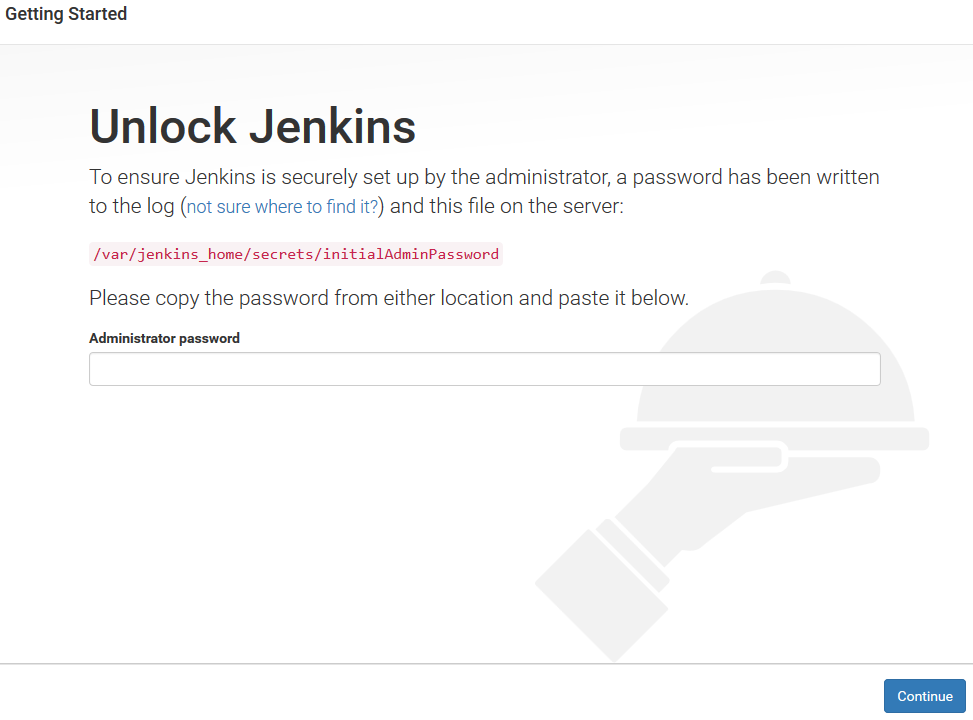

Unlocking Jenkins

从`initialAdminPassword`文件中获取密码，粘贴到管理员密码字段下，点击继续。

You can always log in to Jenkins using the password from the `intialAdminPassword` file and the username `admin`.

# 定制Jenkins

接下来，您将看到两个安装 Jenkins 插件的选项，如下图所示:


Customizing Jenkins

选择安装建议插件将为Jenkins安装所有通用插件，如 Git、管道作为代码等(正如Jenkins社区所建议的)。

选择“选择要安装的插件”将允许您安装自己选择的插件。

在下面的部分，我们将继续选择“选择要安装的插件”选项。当您这样做时，您应该会看到下面截图中显示的屏幕。下面的页面将列出一些最受欢迎的插件，尽管它不是Jenkins插件的完整列表。您会注意到，默认情况下，建议的插件已经被选中(勾选):


Choosing plugins to install

您可以选择全部、无或建议的插件。

选择完插件后，单击页面底部的安装。下面的截图显示了 Jenkins 插件的安装:

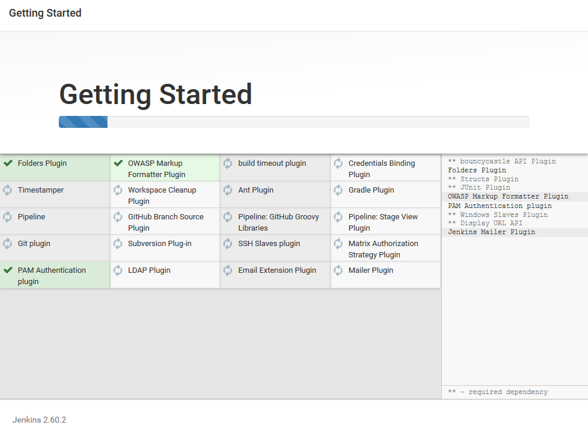

Installing Jenkins plugins

# 创建第一个管理员用户

安装插件后，您将被要求创建一个管理员用户帐户，如下图所示。以下管理员帐户不同于安装向导开始时使用的临时管理员用户帐户(初始管理员帐户):

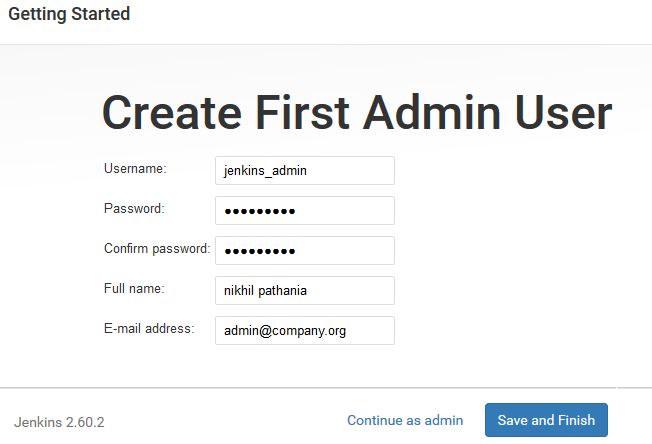

Creating your first Jenkins user

适当填写字段，然后单击保存并完成按钮。或者，您也可以选择忽略创建新的管理员用户，并通过单击继续作为管理员继续初始管理员用户。

接下来，在下一页，你会收到一条消息，说Jenkins准备好了！您的Jenkins设置已完成。单击开始使用Jenkins进入Jenkins仪表板。

# Jenkins管道的新工作

那些已经熟悉Jenkins的人很清楚自由式Jenkins的工作。在 Jenkins 中创建管道的经典方式是使用*自由式作业*，其中每个 CI 阶段都使用 Jenkins 作业(自由式)来表示。

Jenkins自由式工作是一个基于网络，图形用户界面推动的配置。对配置项管道的任何修改都需要您登录到Jenkins并重新配置每个Jenkins自由式作业。

**管道作为代码**的概念重新思考了我们创建 CI 管道的方式。这个想法是将整个 CI/CD 管道写成一个代码，提供某种级别的编程，并且可以进行版本控制。

以下是将管道作为代码路径的一些优点:

*   它是可编程的
*   您的所有CI/CD管道配置都可以用一个文件(Jenkins文件)来描述
*   它是版本可控的，就像任何其他代码一样
*   它附带了一个使用声明性管道语法定义管道的选项，这是一种简单而优雅的管道编码方式

让我们看看Jenkins管道的工作。我们将尝试通过创建一个简单的配置项管道来观察和感受它。

# 先决条件

在我们开始之前，请确保您已经准备好以下内容:

*   在上一章讨论的任何平台(Docker、独立、云、VM、servlet 容器等)上运行的 Jenkins 服务器。
*   确保您的 Jenkins 服务器可以访问互联网。这是下载和安装插件所必需的。
*   确保你的Jenkins服务器已经安装了所有建议的插件。参见*定制Jenkins*部分。

# 创建Jenkins管道作业

按照给定的步骤创建Jenkins管道作业:

1.  从Jenkins仪表板，点击新项目链接。
2.  在结果页面上，您将看到各种类型的Jenkins工作可供选择。
3.  选择“管道”，并使用“输入项目名称”字段为管道命名。

4.  完成后，单击页面底部的确定按钮。
5.  各种各样的 Jenkins 作业(自由式、管道式、多分支式等)现在都带有一个特色选项卡，如下图所示:

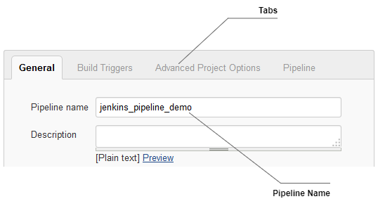

The new tab feature in Jenkins jobs

6.  我们将通过单击管道选项卡快速导航到管道部分。
7.  下面的截图描述了管道部分。让我们详细看看这一部分:
    *   “定义”字段提供了两个选项供您选择——管道脚本和来自配置管理的管道脚本。如果选择“管道脚本”选项，则可以在“脚本”字段中定义管道代码。但是，如果您从 SCM 中选择了“管道脚本”选项(屏幕截图中未显示)，那么您的管道脚本(Jenkinsfile)将自动从版本控制系统中获取(我们将在下一节中探讨该选项)。
    *   要获得任何选项的简短描述，您可以单击问号图标。
    *   管道语法是一个实用程序，可以帮助您将图形用户界面配置转换为代码。(我们将在下一节探讨这个选项)。


The pipeline section

8.  现在让我们在脚本字段中编写一些代码，看看管道是如何工作的。我们将尝试Jenkins提供的一些示例代码。
9.  为此，请单击“尝试示例管道...”字段，并选择 GitHub + Maven 选项，如下图所示:


Choosing a sample pipeline script

10.  这将用示例代码填充脚本字段。
11.  代码如下所示。它采用声明性管道语法形式:

```
      node { 
        def mvnHome 
        stage('Preparation') { // for display purposes 
          // Get some code from a GitHub repository 
          git 'https://github.com/jglick/
          simple-maven-project-with-tests.git' 
          // Get the Maven tool. 
          // ** NOTE: This 'M3' Maven tool must be configured 
          // **       in the global configuration.            
          mvnHome = tool 'M3' 
        } 
        stage('Build') { 
          // Run the maven build 
          if (isUnix()) { 
            sh "'${mvnHome}/bin/mvn'
            -Dmaven.test.failure.ignore clean package" 
          } else { 
            bat(/"${mvnHome}\bin\mvn"
            -Dmaven.test.failure.ignore clean package/) 
          }  
        } 
        stage('Results') { 
          junit '**/target/surefire-reports/TEST-*.xml' 
          archive 'target/*.jar' 
        } 
      } 
```

12.  让我们快速浏览一下管道脚本(我们将在下一节中探讨更多关于声明性管道语法的内容):
    *   `node {}`是告诉Jenkins在Jenkins主控器上运行整个管道脚本的主容器。
    *   在`node {}`容器内部，还有三个容器，如下图所示:

```
                  stage('Preparation') {...} 
                  stage('Build') {...} 
                  stage('Results') {...}
```

13.  单击页面底部的保存按钮，保存对管道作业所做的更改。

# “全局工具配置”页面

在我们运行管道之前，查看一下 Jenkins 中的全局工具配置页面非常重要。这是您配置您认为将在所有管道中全局使用的工具的地方:例如，Java、Maven、Git 等等。

假设您有多个构建代理(Jenkins 从属代理)来构建您的 Java 代码，并且您的构建管道需要 Java JDK、Maven 和 Git。您只需要在全局工具配置中配置这些工具，Jenkins 会在构建代理(Jenkins 从代理)上构建您的代码时自动调用它们。您不需要在任何构建代理上安装这些工具。

让我们在全局工具配置中配置 Maven 工具，以使我们的管道工作。遵循给定的步骤:

1.  要访问“全局工具配置”页面，请执行以下任一操作:
    1.  在Jenkins仪表板中，单击管理Jenkins|全局工具配置。
    2.  或者在浏览器中粘贴网址`http://<IP Address of your Jenkins server>:8080/configureTools/`。
2.  一直向下滚动到 Maven 部分，然后单击添加 Maven 按钮。您将看到一个选项列表，如下图所示。按如下方式填写信息:
    1.  通过填写名称字段，为您的 Maven 安装提供唯一的名称。(让我们的示例管道工作。)
    2.  默认情况下，将显示“从 Apache 安装”选项。这将使Jenkins从 Apache 下载 Maven 应用程序:

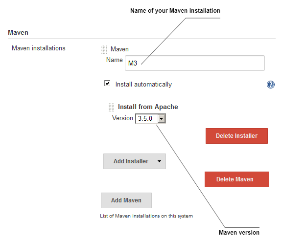

Configuring Maven inside the Global Tool ConfigurationTo choose a different installer first, delete the existing installer by clicking on the Delete Installer button. Next, click on the Add Installer drop-down menu and choose a different installer. The other options, apart from Install from Apache are, Run Batch Command, Run Shell Command, and Extract *.zip/*.tar.gz (not shown in the screenshot).

3.  构建 Maven 项目也需要 Java 工具，但是由于我们是在 Jenkins master(已经有了 Java JDK)上构建代码，我们现在可以跳过安装 Java 工具。
4.  配置完 Maven 后，向下滚动到页面底部，然后单击保存按钮。

# Jenkins管道阶段视图

Jenkins *Stage View* 是作为 2.x 版本的一部分出现的新功能，它只适用于 Jenkins Pipeline 和 Jenkins 多分支管道作业。

Jenkins阶段视图允许您实时可视化管道的各个阶段的进度。让我们通过运行示例管道来了解这一点:

1.  在Jenkins仪表板上的“所有视图”选项卡下，您将看到您的管道。
2.  单击构建触发器图标运行管道，如下图所示:


Viewing pipeline on the Jenkins dashboard

3.  要进入阶段视图，请单击您的管道名称(碰巧也是指向您的管道项目页面的链接)。

4.  或者，您可以将鼠标悬停在管道名称上，以获得包含操作项和链接列表的下拉菜单，如下图所示:


A view of the pipeline menu

5.  “阶段视图”页面类似于下面的截图:


The Stage View

6.  要查看特定阶段的构建日志，将鼠标放在彩色编码的状态框上，您应该会看到查看日志的选项。单击它将打开一个显示日志的小弹出窗口，如下图所示:


Jenkins individual stage logs

7.  要查看完整的构建日志，请在左侧查找构建历史记录。“构建历史记录”选项卡将列出所有已运行的构建。右键单击所需的内部版本号，然后单击控制台输出:


Accessing the console output

# 声明性管道语法

在前面的部分中，我们创建了一个 Jenkins 管道来查看和感受它的各种组件。我们使用遵循声明性语法的管道脚本来定义我们的管道。

声明性管道语法是 Groovy 语法的一个更加简化和结构化的版本，后者由于其可编程性而更加强大。在本节中，我们将更详细地了解声明性管道语法。这很重要，因为在接下来的章节中，我们将使用相同的方法来定义我们的配置项和光盘管道。

# 声明性管道的基本结构

简单来说，声明性管道是多个`node`块(节点)`stage`块(阶段)、指令和步骤的集合。一个`node`区块可以有多个`stage`区块，反之亦然。我们也可以并行运行多个阶段。让我们详细看看每一个。

# 节点块

一个`node`块定义了Jenkins代理，它的组成部分(阶段块、指令和步骤)应该在其中运行。`node`块结构如下图所示:

```
node ('<parameter>') {<constituents>} 
```

以下给出了关于`node`块的更多信息:

*   **定义**:应该运行`stage`、指令或步骤的节点
*   **成分**:多个`stage`块、指令或步骤
*   **必选**:是
*   **参数**:任意，标签

# 舞台积木

一个`stage`块是具有共同目标的密切相关的步骤和指令的集合。`stage`块结构如下图所示:

```
stage ('<parameter>') {<constituents>} 
```

以下给出了关于`stage`块的更多信息:

*   **定义**:步骤和指令的集合
*   **成分**:多个`node`块、指令或步骤
*   **必选**:是
*   **参数**:舞台名称的字符串(必填)

# 指令

指令的主要目的是通过为`node`块、`stage`块和步骤提供以下任何元素来帮助它们:环境、选项、参数、触发器和工具。

以下给出了关于`stage`块的更多信息:

*   **定义**:阶段应该运行的节点
*   **成分**:环境、选项、参数、触发器、工具
*   **必选**:不是，但是每个 CI/CD 管道都有
*   **参数**:无

# 步伐

步骤是组成声明性管道的基本元素。一个步骤可以是批处理脚本或外壳脚本，或者任何其他可执行的命令。步骤有多种用途，例如克隆存储库、构建代码、运行测试、将工件上传到存储库服务器、执行静态代码分析等等。在下一节中，我们将看到如何使用 Jenkins 管道语法实用程序生成步骤。

以下给出了关于`stage`块的更多信息:

*   **定义**:它告诉Jenkins该做什么
*   **成分**:命令、脚本等等。这是管道的基本部件
*   **必选**:不是，但是每个 CI/CD 管道都有
*   **参数**:无

以下是我们之前使用的管道代码。使用注释(`//`)突出显示`node`块、`stage`块、指令和步骤。如你所见，`node`街区内有三个`stage`街区。一个`node`块可以有多个`stage`块。除此之外，每个`stage`块包含多个步骤，其中一个还包含一个指令:

```
// Node block
node ('master') {
  // Directive 1
  def mvnHome

  // Stage block 1
  stage('Preparation') {    // Step 1
    git 'https://github.com/jglick/simple-maven-project-with-tests.git'
    // Directive 2
    mvnHome = tool 'M3' 
   }

   // Stage block 2 
   stage('Build') {
     // Step 2 
     sh "'${mvnHome}/bin/mvn' clean install" 
   } 

   // Stage block 3
   stage('Results') {
     // Step 3 
     junit '**/target/surefire-reports/TEST-*.xml'
     // Step 4
     archive 'target/*.jar' 
   } 

} 
```

在前面的代码中，请注意行:`node ('master') {`。这里，字符串`master`是一个参数(`label`)，它告诉Jenkins使用Jenkins主程序来运行`node`块的内容。

如果将参数值选择为任意，则所有阶段节点及其各自的步骤和指令将在任何一个可用的 Jenkins 从属代理上执行。

在接下来的章节中，我们将学习更多关于声明性管道的知识，其中我们将尝试使用它编写一个 CI/CD 管道。

For more information about Declarative Pipeline syntax, refer to [https://jenkins.io/doc/book/pipeline/syntax/#declarative-sections](https://jenkins.io/doc/book/pipeline/syntax/#declarative-sections).
To get a list of all the available steps that are compatible with the Declarative Pipeline, refer to [https://jenkins.io/doc/pipeline/steps/](https://jenkins.io/doc/pipeline/steps/)[.](https://jenkins.io/doc/book/pipeline/syntax/#declarative-sections)

# Jenkins 管道语法实用程序

Jenkins管道语法实用程序是创建管道代码的一种快速简单的方法。Jenkins管道作业中提供了管道语法实用程序；参见截图:*中的*管道部分*创建Jenkins管道作业*部分。

在本节中，我们将重新创建上一节中创建的管道，但这次使用的是管道语法实用程序。

# 先决条件

在我们开始之前，请确保您已经准备好以下内容:

*   在全局工具配置页面内配置的 Maven 工具(参见*全局工具配置页面*部分)
*   安装管道专家集成插件
*   构建 Maven 项目也需要 Java 工具，但是因为我们是在 Jenkins master(已经有了 Java JDK)上构建代码，所以我们可以跳过安装 Java 工具

# 安装管道专家集成插件

按照给定的步骤安装管道 Maven 集成插件。以下插件将允许我们在管道代码中使用 Maven 工具:

1.  从Jenkins仪表板中，单击管理Jenkins|管理插件|可用选项卡。
2.  在过滤器字段中输入`Pipeline Maven Integration`搜索相应的插件，如下图所示:


The Plugin Manager page

3.  单击复选框选择相应的插件，然后单击安装而不重启按钮来安装它。
4.  一旦你点击安装而不重启按钮，你会看到插件被安装，如下图所示。Jenkins 将首先检查网络连接，然后安装依赖项，最后安装插件。

5.  有些插件可能需要重启才能使用。为此，请选中“安装完成且没有作业运行时重新启动Jenkins”选项:

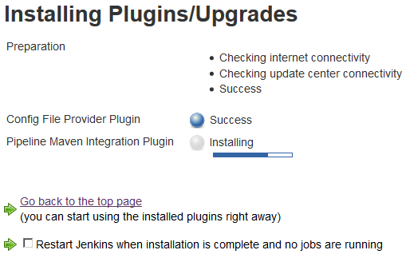

Plugin installation in progress

# 使用管道语法实用程序创建Jenkins管道

按照给定的步骤创建新的 Jenkins 管道作业:

1.  从Jenkins仪表板，点击新项目链接。
2.  在结果页面上，您将看到各种类型的Jenkins工作可供选择。
3.  选择“管道”，并使用“输入项目名称”字段为管道命名。
4.  完成后，单击页面底部的确定按钮。
5.  我们将通过单击管道选项卡快速导航到管道部分。

6.  在“管道”选项卡下，单击名为“管道语法”的链接。这将打开一个新的选项卡，如下图所示:


The Pipeline Syntax page

7.  我们将使用下面的代码片段生成器为不同的块和步骤创建管道代码。
8.  让我们首先为一个`node`块生成一个代码:
    1.  在“管道语法”页面的“步骤”部分下，选择“节点:使用示例步骤字段分配节点”，如下图所示。
    2.  在标签字段中，添加一个字符串`master`。通过这样做，我们告诉Jenkins使用Jenkins主节点作为执行我们的管道的选择节点。
    3.  单击生成管道脚本按钮来生成代码。
    4.  复制生成的代码，并将其保存在文本编辑器中:

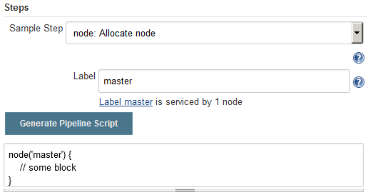

Generating code for the node block

9.  现在，让我们创建两个名为`Preparation`和`Build`的`stage`块:
    1.  在“管道语法”页面的“步骤”部分下，使用示例步骤字段选择阶段:阶段，如下图所示。
    2.  在阶段名称字段中，添加一个字符串`Preparation`。
    3.  单击生成管道脚本按钮来生成代码。
    4.  复制生成的代码并粘贴到我们之前生成的`node`块中:

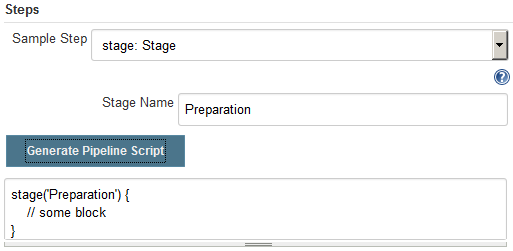

Generating code for the stage block

10.  同样，重复*步骤 9* 创建一个名为`Build`的`stage`块。将生成的代码粘贴到`node`块内和`Preparation`(T4)块后。
11.  到目前为止，我们的管道代码应该如下所示(没有`// some block`行):

```
      node('master') {

        stage('Preparation') {
        }

        stage('Build') {
        }

      }
```

12.  现在让我们创建一个从 GitHub 下载源代码的步骤:
    1.  在“管道语法”页面的“步骤”部分下，使用示例步骤字段选择 git: Git，如下图所示。
    2.  在存储库网址字段中，添加到示例 GitHub 存储库的链接:`https://github.com/jglick/simple-maven-project-with-tests.git`。
    3.  剩下的选项保持不变。
    4.  单击生成管道脚本按钮来生成代码。
    5.  复制生成的代码，粘贴到我们之前生成的`Preparation`(即`stage`块)中:

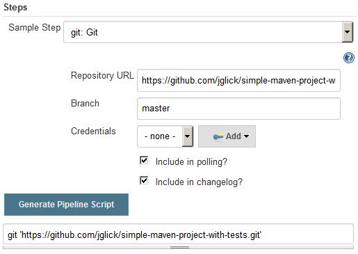

Generating code for the Git step

13.  接下来，让我们生成一个指令，告诉 Jenkins 使用我们在全局工具配置中配置的 M3 Maven 工具:
    1.  在“管道语法”页面的“步骤”部分下，选择“使用 Maven:使用示例步骤字段提供 Maven 环境”，如下图所示。
    2.  在 Maven 字段中，选择`M3`，这是我们在全局工具配置中配置的 Maven 工具。
    3.  剩下的选项保持不变。
    4.  单击生成管道脚本按钮来生成代码。
    5.  复制生成的代码，粘贴到我们之前生成的`Build`(即`stage`块)中:


Generating code for the withMaven directive

14.  最后，为我们的 Maven 构建命令生成一个管道代码:
    1.  在“管道语法”页面的“步骤”部分下，使用示例步骤字段选择 sh: Shell 脚本，如下图所示。这是创建 shell 脚本的一个步骤。
    2.  在 Shell 脚本字段中，键入`mvn -Dmaven.test.failure.ignore clean package`，这是用于构建、测试和打包代码的 Maven 命令。这将是我们 shell 脚本的内容。
    3.  单击生成管道脚本按钮来生成代码。
    4.  复制生成的代码，粘贴到我们之前生成的`withMaven`(指令)中:


Generating code for the maven build

15.  我们最终的管道脚本应该如下所示(没有`// some block`行):

```
      node('master') {

        stage('Preparation') {
          git 'https://github.com/jglick/
          simple-maven-project-with-tests.git'
        }

        stage('Build') {
          withMaven(maven: 'M3') {
            sh 'mvn -Dmaven.test.failure.ignore clean
            package'
          }
        }

      }
```

16.  现在切换到管道作业配置页面。
17.  滚动到“管道”部分，并将前面的管道代码粘贴到“脚本”字段中。
18.  点击页面底部的保存按钮。

在接下来的章节中，当我们尝试使用声明性管道语法，利用管道语法实用程序来创建 CI/CD 管道时，我们将看到更多的示例。

# 多分支管道

在本节中，我们将了解Jenkins的多分支管道工作。这是 Jenkins 版本中增加的新功能之一。

多分支管道允许您为源代码管理存储库中的每个分支自动创建管道。这在下面的截图中有描述。多分支管道使用与源代码一起存储在版本控制存储库中的**Jenkins文件**工作。一个**Jenkins文件**只不过是一个定义你的配置项管道的管道脚本:


Auto-generated pipeline for a new branch

除此之外，多分支管道被设计成每当在你的 Git/GitHub 存储库的任何分支上有新的代码变化时触发一个构建。这在下面的截图中有描述:


Usage of multibranch pipeline for continuous integration

# 先决条件

在我们开始之前，请确保您已经准备好以下内容:

*   在全局工具配置页面内配置的 Maven 工具(参见*全局工具配置页面*部分)。
*   安装管道马文集成插件。
*   构建 Maven 项目也需要 Java 工具，但是因为我们是在 Jenkins master(已经有了 Java JDK)上构建代码，所以我们可以跳过安装 Java 工具。
*   安装 GitHub 插件(如果您在 Jenkins 安装向导中选择安装推荐的插件，则已经安装)。
*   确保你的Jenkins网址可以从互联网上访问。如果您正在使用一个暂存或开发环境来执行本练习，并且您的 Jenkins 服务器没有域名，则您的 Jenkins 服务器可能无法从互联网访问。要通过互联网访问您的Jenkins网址，请参考[附录](10.html)、*支持工具和安装指南*中的*将您的本地服务器暴露给互联网*部分。

# 在Jenkins内部添加 GitHub 凭据

为了让 Jenkins 与 GitHub 进行通信，我们需要在 Jenkins 内部添加 GitHub 账户凭证。我们将使用Jenkins凭证插件来实现这一点。如果您已经遵循了 Jenkins 设置向导(在本章开头讨论过)，您将在 Jenkins 仪表板上找到凭据功能(参见左侧菜单)。

按照给定的步骤在 Jenkins 中添加 GitHub 凭据:

1.  从Jenkins仪表板中，单击凭据|系统|全局凭据(无限制)。
2.  在“全局凭据(无限制)”页面的左侧菜单中，单击添加凭据链接。
3.  您将看到一堆要配置的字段(参见下面的屏幕截图):
    1.  在“种类”字段中选择带密码的用户名。
    2.  为范围字段选择全局(Jenkins、节点、项目、所有子项目等)。
    3.  将您的 GitHub 用户名添加到用户名字段。
    4.  将您的 GitHub 密码添加到密码字段。
    5.  通过在标识字段中键入一个字符串，为您的凭据提供一个唯一的标识。
    6.  向描述字段添加一些有意义的描述。
    7.  完成后，单击保存按钮:


Adding GitHub credentials inside Jenkins

4.  这就是你在Jenkins内部保存凭证的方法。我们将很快使用这些 GitHub 凭证。

# 从Jenkins在 GitHub 上配置网络钩子

现在我们已经将 GitHub 帐户凭据保存在 Jenkins 内部，让我们将 Jenkins 配置为与 GitHub 对话。我们将通过在 Jenkins 配置中配置 GitHub 设置来实现这一点。

仔细按照给定的步骤在 Jenkins 内部配置 GitHub 设置:

1.  在Jenkins仪表板中，单击管理Jenkins|配置系统。
2.  在生成的 Jenkins 配置页面上，一直向下滚动到 GitHub 部分。
3.  在 GitHub 部分下，单击添加 GitHub 服务器按钮，并从可用下拉列表中选择 GitHub 服务器。这样做将显示一堆选项供您配置。
4.  让我们逐个配置它们，如下所示:
    1.  通过在名称字段中添加一个字符串，为您的 GitHub 服务器命名。
    2.  如果您使用的是公共 GitHub 帐户，在 API URL 字段下，添加`https://api.github.com`(默认值)。否则，如果您使用的是 GitHub 企业版，那么请指定其各自的 API 端点。
    3.  确保选中管理挂钩选项:

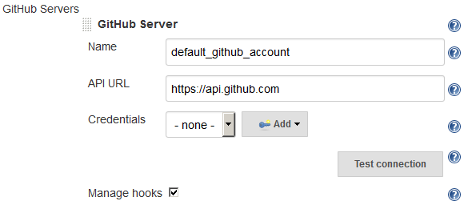

Configuring the GitHub server


Converting GitHub credentials to a token

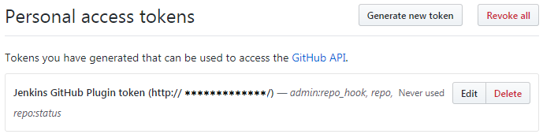

Personal access token on GitHub

5.  我们还没有完成Jenkins内部的 GitHub 配置。按照以下剩余步骤操作:
    1.  在Jenkins仪表板中，单击管理Jenkins|配置系统。
    2.  一直向下滚动到 GitHub 部分。
    3.  使用“凭据”字段，选择新生成的“种类”机密文本凭据(Jenkins内部的个人访问令牌条目)。
    4.  现在，点击测试连接按钮来测试我们在Jenkins和 GitHub 之间的连接。
    5.  完成后，单击Jenkins配置页面底部的保存按钮:

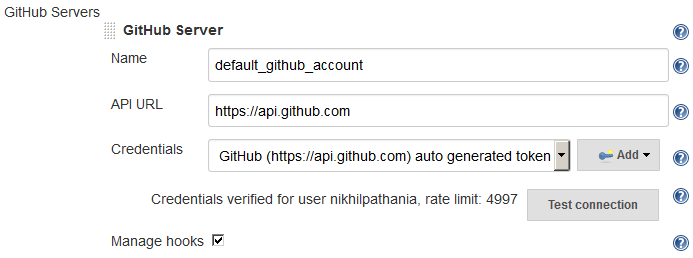

Testing the connection between Jenkins and GitHub

6.  我们现在已经完成了在 Jenkins 内部配置 GitHub 设置。

# 在 GitHub 上创建一个新的存储库

在本节中，我们将在 GitHub 上创建一个新的存储库。确保您将 Git 安装在用于执行下一节所述步骤的机器上(请参考[附录](10.html)、*支持工具和安装指南*中的*在 Windows/Linux 上安装 Git*一节)。

按照给定的步骤在 GitHub 上创建存储库:

1.  登录您的 GitHub 帐户。
2.  为了简单起见，我们将在[https://github . com/jglick/simple-maven-project-with-tests . git](https://github.com/jglick/simple-maven-project-with-tests.git)处重用存储库中的源代码。这是我们用来创建Jenkins管道的存储库。
3.  重用 GitHub 存储库最简单的方法是分叉它。为此，只需从您的互联网浏览器访问上述存储库，然后单击 Fork 按钮，如下图所示:

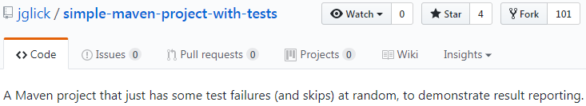

Forking a GitHub project

4.  一旦完成，在你的 GitHub 账号上就可以看到前面的仓库的副本。

# 使用Jenkins文件

Jenkins多分支管道利用Jenkins文件。在下一节中，我们将学习如何创建Jenkins文件。我们将重用上一节中创建的示例管道脚本来创建我们的Jenkins文件。遵循给定的步骤:

1.  登录您的 GitHub 帐户。
2.  导航到分叉存储库`simple-maven-project-with-tests`。
3.  进入存储库页面后，单击创建新文件按钮创建一个新的空文件，该文件将成为我们的Jenkins文件，如下图所示:


Creating a new file on GitHub

4.  通过填充空文本框命名新文件`Jenkinsfile`，如下图所示:


Naming your new file on GitHub

5.  将以下代码添加到您的`Jenkinsfile`中:

```
      node ('master') { 
        checkout scm 
        stage('Build') { 
          withMaven(maven: 'M3') { 
            if (isUnix()) { 
              sh 'mvn -Dmaven.test.failure.ignore clean package' 
            }  
            else { 
              bat 'mvn -Dmaven.test.failure.ignore clean package' 
            } 
          } 
        }   
        stage('Results') { 
          junit '**/target/surefire-reports/TEST-*.xml' 
          archive 'target/*.jar' 
        } 
      } 
```

6.  完成后，通过添加有意义的注释提交新文件，如下图所示:


Committing your new file on GitHub

# 在Jenkins创建多分支管道

按照给定的步骤创建新的 Jenkins 管道作业:

1.  从Jenkins仪表板，点击新项目链接。
2.  在结果页面上，您将看到各种类型的Jenkins工作可供选择。
3.  选择多分支管道，并使用输入项目名称字段为管道命名。

4.  完成后，单击页面底部的确定按钮。
5.  滚动到分支来源部分。这是我们配置想要使用的 GitHub 存储库的地方。
6.  点击添加源按钮，选择 GitHub。您将看到一个要配置的字段列表。让我们一个一个来看(见下面截图):
    1.  对于“凭据”字段，选择我们在上一节中创建的 GitHub 帐户凭据(如带密码的用户名)。
    2.  在所有者字段下，指定您的 GitHub 组织或 GitHub 用户帐户的名称。
    3.  此时，存储库字段将列出您的 GitHub 帐户上的所有存储库。
    4.  在存储库字段下选择`simple-maven-project-with-tests`。
    5.  将其余选项保留为默认值:

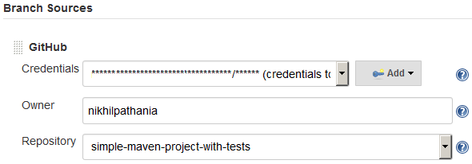

Configuring the multibranch pipeline

7.  一直向下滚动，然后单击保存按钮。

# 重新注册网络挂钩

在我们继续之前，让我们为我们所有的Jenkins管道重新注册网络钩子:

1.  为此，在Jenkins仪表板中，单击管理Jenkins|配置系统。
2.  在Jenkins配置页面上，一直向下滚动到 GitHub 部分。
3.  在 GitHub 部分，点击高级…按钮(你会看到其中两个；点击第二个)。

4.  这将显示更多的字段和选项。单击“为所有作业重新注册挂钩”按钮。
5.  前面的操作将在您的 GitHub 帐户内的相应存储库中为我们的多分支管道创建新的 Webhooks。请执行以下操作来查看 GitHub 上的网络钩子:
    1.  登录您的 GitHub 帐户。
    2.  转到您的 GitHub 存储库，在我们的例子中是`simple-maven-project-with-tests`。
    3.  点击存储库设置，如下图所示:


Repository Settings


Webhooks on GitHub repository

# Jenkins多分支管道投入使用

遵循给定的步骤:

1.  从Jenkins仪表板，点击你的多分支管道。
2.  在Jenkins多分支管道页面上，从左侧菜单中，单击立即扫描存储库链接。这将使用 Jenkinsfile 扫描存储库中的分支，并将立即为每个获得 Jenkinsfile 的分支运行一个管道，如下图所示:


Pipeline for the master branch

3.  在多分支管道页面的左侧菜单中，单击扫描存储库日志。您将看到如下所示的内容。请注意高亮显示的代码。你可以看到`master`分支符合标准，因为它有一个Jenkins文件和一个管道。没有为测试分支计划管道，因为它没有Jenkins文件:

```
Started by user nikhil pathania 
[Mon Aug 14 22:00:57 UTC 2017] Starting branch indexing... 
22:00:58 Connecting to https://api.github.com using ******/****** (credentials to access GitHub account) 
22:00:58 Connecting to https://api.github.com using ******/****** (credentials to access GitHub account) 
Examining nikhilpathania/simple-maven-project-with-tests 

 Checking branches... 

 Getting remote branches... 

 Checking branch master 

 Getting remote pull requests... 
 'Jenkinsfile' found 
 Met criteria 
Scheduled build for branch: master 

 Checking branch testing 
 'Jenkinsfile' not found 
 Does not meet criteria 

 2 branches were processed 

  Checking pull-requests... 

  0 pull requests were processed 

Finished examining nikhilpathania/simple-maven-project-with-tests 

[Mon Aug 14 22:01:00 UTC 2017] Finished branch indexing. Indexing took 2.3 sec 
Finished: SUCCESS 
```

4.  您不需要总是扫描存储库。GitHub Webhooks 被配置为每当 GitHub 存储库中有推送或新分支时自动触发管道。请记住，Jenkins文件也应该出现在相应的分支上，以告诉Jenkins当它在存储库中发现变化时它需要做什么。

# 创建新的特征分支来测试多分支管线

现在让我们从主分支中创建一个特性分支，看看 Jenkins 是否可以为它运行一个管道:

1.  为此，请登录您的 GitHub 帐户。
2.  转到您各自的 GitHub 存储库；在我们的例子中是`simple-maven-project-with-tests`。

3.  单击分支:主按钮，并在空文本框中键入新分支的名称。接下来，单击创建分支:要素选项创建一个名为要素的新分支，如下图所示:


Creating a feature branch

4.  这将立即在 Jenkins 内部为我们的新功能分支触发一个管道:


Pipeline for the new feature branch

# Jenkins蓝色海洋

Jenkins蓝海是一种全新的与Jenkins互动的方式。它更像是Jenkins主应用程序的用户界面助手。以下是Jenkins蓝色海洋的一些特点:

*   改进的可视化
*   管道编辑器
*   个性化
*   Git 和 GitHub 的快速简单的管道设置向导

您使用经典的Jenkins界面创建的管道可以在新的Jenkins蓝色海洋中可视化，反之亦然。正如我之前所说的，Jenkins蓝海是Jenkins主应用程序的用户界面助手。

在下一节中，我们将可视化我们在蓝色海洋的上一节中创建的Jenkins管道。我们还将创建一个新的管道，只是为了了解和感受新的Jenkins蓝色海洋界面。

# 安装Jenkins蓝海插件

为了使用Jenkins蓝海插件，我们需要为Jenkins安装蓝海插件。遵循给定的步骤:

1.  在Jenkins仪表板中，单击管理Jenkins|管理插件。
2.  在插件管理器页面上，单击可用选项卡。
3.  使用过滤器选项，搜索`Blue Ocean`，如下图所示:


Installing the Jenkins Blue Ocean plugin

4.  从项目列表中，选择蓝色海洋，然后单击不重启安装。你只需要蓝色海洋，其他什么都不需要。
5.  蓝色海洋的依赖列表很大，所以你会在安装插件/升级页面上看到很多东西和蓝色海洋插件一起被安装。

# 查看您在蓝海的常规Jenkins管道

在本节中，我们将尝试可视化我们在前面几节中创建的现有 Jenkins 管道:

1.  在 Jenkins 仪表板上，您现在应该会在左侧菜单上看到一个名为 Open Blue Ocean 的新链接。
2.  点击开放蓝海链接，进入Jenkins蓝海仪表盘。下面是你应该看到的(参考下面的截图):
    1.  “管理”链接将带您进入“管理Jenkins”页面。
    2.  管道链接将带您进入您现在看到的Jenkins蓝海仪表盘。
    3.  图标(正方形内的箭头)将带您进入经典的Jenkins仪表盘。
    4.  “新建管道”按钮将为基于 Git 和 GitHub 的项目打开管道创建向导。
    5.  管道列表(突出显示为 **e** ):


The Jenkins Blue Ocean dashboard

3.  让我们看看我们的多分支管道。从Jenkins蓝海仪表盘点击您的多分支管道。这样做将打开相应的多分支管道页面，如下图所示:
    1.  按钮(突出显示为 **a** )将带您进入管道配置页面。
    2.  “活动”选项卡将列出所有当前和过去的管道。
    3.  “分支”选项卡将向您显示每个分支的管道的聚合视图。
    4.  “拉取请求”选项卡将列出您分支机构上所有未完成的拉取请求。
    5.  按钮(突出显示为 **e** )用于重新运行管道:


Multibranch pipeline in Blue Ocean

4.  现在让我们看看单独的构建页面。为此，从 Jenkins 管道页面(参见前面的截图)中，单击任何一个构建，您将进入相应管道的构建页面，如下图所示:
    1.  “更改”选项卡将列出触发生成的代码更改。
    2.  工件选项卡将列出由构建生成的所有工件。
    3.  按钮(突出显示为 **c** )将重新运行您的构建。
    4.  该部分(突出显示为 **d** )显示了关于您的构建的一些指标。
    5.  该阶段视图(突出显示为 **e** )将列出所有顺序和并行阶段。
    6.  步骤结果部分将向您显示您选择的特定阶段的所有步骤(在下面的截图中，我选择了阶段结果)。
    7.  每个列出的步骤(突出显示为 **g** )都可以展开，并且可以查看其日志:

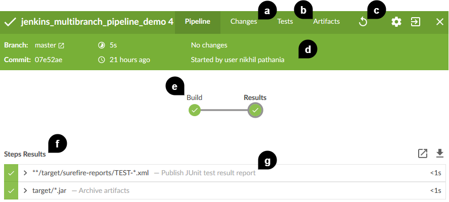

Build page in Blue Ocean

这是Jenkins管道(您使用经典的Jenkins用户界面创建的管道)在蓝色海洋中的外观的简短概述。它几乎展示了一切。不过，我鼓励读者继续探索。

# 在蓝色海洋中创建管道

在本节中，我们将看到如何从Jenkins蓝色海洋仪表板创建一个新的管道。我们将在蓝色海洋中查看新的管道创建向导。开始之前，请做好以下准备:

*   将以下存储库:[https://github.com/nikhilpathania/hello-world-example.git](https://github.com/nikhilpathania/hello-world-example.git)转移到您的 GitHub 帐户。我们将在下一节描述的示例中使用它
*   为Jenkins安装 JUnit 插件([https://plugins.jenkins.io/junit](https://plugins.jenkins.io/junit))

遵循给定的步骤:

1.  从Jenkins蓝海仪表板，点击新管道按钮。Jenkins会让你在 Git 和 GitHub 之间做出选择。对于我们当前的练习，我们将选择 GitHub:

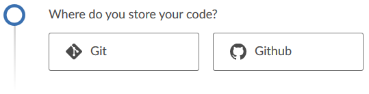

Choosing between Git and GitHub repositories

2.  接下来，Jenkins 将要求您为您的 GitHub 帐户提供 GitHub 访问令牌。单击“在此创建访问密钥”链接创建新的访问密钥:


GitHub access token field

3.  在新的选项卡中，您将被要求登录您的 GitHub 帐户。
4.  登录后，您将直接进入 GitHub 设置页面，创建新的个人访问令牌。
5.  在令牌描述字段中键入一个小描述来标识您的令牌。将“选择范围”部分下的选项保留为默认值:

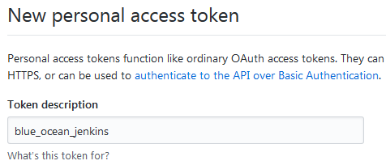

Creating a GitHub personal access token

6.  单击页面底部的生成新令牌按钮，以生成新的个人访问令牌:


GitHub personal access token

7.  复制新创建的个人访问令牌，并将其粘贴到您的 GitHub 访问令牌字段中，然后单击连接按钮(参见下面的截图)。
8.  接下来，单击列出的组织:


Choosing the GitHub account

9.  您可以在新建管道和自动发现Jenkins文件之间进行选择。在以下示例中，我们将选择“新建管道”选项:


Choosing between creating and discovering pipelines

10.  接下来，您将被要求从 GitHub 帐户的可用存储库列表中选择一个存储库。如果没有列出，您可以使用搜索选项来查找所需的存储库。在我们当前的例子中，我们将选择`hello-world-example`回购:

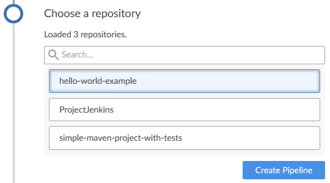

Choosing a repository

11.  接下来Jenkins会要求你做的是创建一个管道。由于在相应的存储库中找不到Jenkins文件，请单击创建管道按钮创建Jenkins文件:

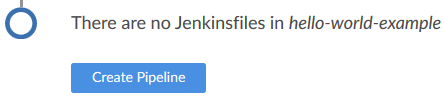

Creating a new pipeline

12.  创建管道的页面如下所示。在左侧，您将看到管道的可视化，在右侧，您将看到用于选择块、阶段和步骤的实用程序(类似于我们在上一节中看到的管道语法实用程序):

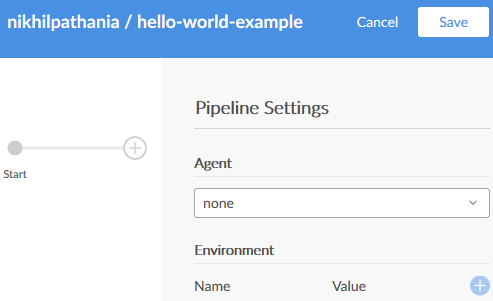

Blue Ocean pipeline editor

13.  让我们首先选择一个代理来运行我们的管道。为此，从管道设置中，使用代理字段，选择选项标签。然后在标签栏下输入`master`，如下图所示。这样，我们告诉Jenkins在Jenkins大师上运行我们的管道:


Creating a node block

14.  接下来，让我们创建一个名为`Build`的阶段，它将构建我们的源代码。为此，单击管道可视化工具上的+按钮。

15.  你将被要求说出你的新舞台。通过在“命名您的舞台”字段下键入`Build`来完成，如下图所示:


Creating a build stage

16.  接下来，我们将添加一个步骤来构建我们的 Maven 代码。为此，请单击+添加步骤按钮。
17.  您将被要求从可用步骤列表中进行选择，如下图所示:


The step menu

18.  我们的是一个 Maven 项目。因此，我们可能需要首先设置 Maven 环境，告诉 Jenkins 它可以使用哪个 Java 和 Maven 工具。
19.  为此，使用搜索框搜索`Provide Maven environment`(按名称查找步骤):


Choosing the provide Maven environment step Not all Jenkins plugins are compatible with Jenkins Blue Ocean. The list is still small. However, it's expected to grow over time.

20.  当您单击“提供 Maven 环境”步骤时，您将看到一个要配置的字段列表，如下图所示。在 Maven 字段下键入`M3`，其余选项保持不变:


Configuring the provide maven environment step

21.  在配置页面的底部，单击+添加步骤按钮来创建一个新的子步骤，它将构建我们的 Maven 代码。
22.  如果您的 Jenkins 主机是 Linux 机器，请从可用步骤列表中选择 Shell 脚本。如果是 Windows 机器，请选择“Windows 批处理脚本”。
23.  在外壳脚本/窗口批处理脚本文本框中键入以下代码:

```
        mvn clean install 
```


Configuring the shell script child step

24.  单击后退箭头返回上一菜单。现在，您应该会看到您的新步骤，Shell 脚本，列在子步骤部分下，如下图所示:


Shell script as one of the child steps

25.  单击后退箭头返回上一菜单。
26.  接下来，让我们创建一个名为 Results 的阶段，其中我们将归档我们构建的工件和 XML 结果报告。为此，单击管道可视化工具上的+按钮。
27.  你将被要求说出你的新舞台。通过在“命名您的舞台”字段下键入`Results`来完成，如下图所示:

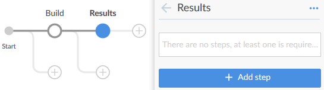

Creating a results stage

28.  接下来，我们将在新的舞台上增加几个步骤。第一步是公布我们的测试结果报告。为此，请单击+添加步骤按钮。
29.  从可用步骤列表中选择发布 JUnit 测试结果报告。您将看到一个要配置的选项列表:
    1.  在测试结果字段下添加`**/target/surefire-reports/TEST-*.xml`。
    2.  保持其余选项不变:


Configuring the publish JUnit test result report step

30.  单击后退箭头返回上一菜单。
31.  再次单击+添加步骤按钮添加新步骤。
32.  从可用步骤列表中选择归档工件。您将看到一个要配置的选项列表:
    1.  在工件字段下添加`target/*.jar`。
    2.  保持其余选项不变:


Configuring the Archive the artifacts step

33.  单击后退箭头返回上一菜单。
34.  最后，单击页面右上角的保存按钮保存您的管道配置。
35.  弹出窗口将要求您添加一些描述，并选择提交管道配置的分支。
36.  完成后，单击保存并运行按钮:

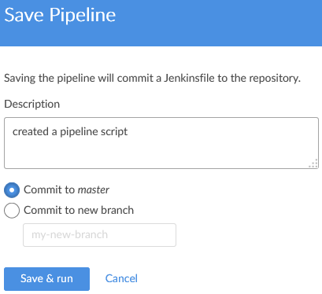

Saving the pipeline

37.  这将立即在相应的分支上运行管道，如下图所示:


A successful build on the master branch

38.  您会注意到在主分支下的存储库中已经创建了一个新文件:

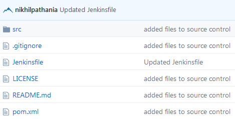

Jenkinsfile listed inside the source code

39.  以下应该是文件的内容:

```
pipeline { 
  agent { 
    node { 
      label 'master' 
    } 

  } 
  stages { 
    stage('Build') { 
      steps { 
        withMaven(maven: 'M3') { 
          sh 'mvn clean install' 
        } 

      } 
    } 
    stage('Results') { 
      steps { 
        junit '**/target/surefire-reports/TEST-*.xml' 
        archiveArtifacts 'target/*.jar' 
      } 
    } 
  } 
}
```

# 摘要

在前一章中，我们获得了关于 Jenkins 中几乎所有新特性的实践经验。我们选择了适度的例子来保持我们的管道简单。然而，在接下来的章节中，我们将学习使用 Jenkins 中的所有新特性来创建一个完整的 CI/CD 管道。

在下一章中，我们将了解一下 Jenkins 中的一些管理任务。