# 配置詹金斯

在本章中，我们将学习如何执行一些基本的 Jenkins 管理任务，如下所示:

*   更新/安装/卸载/降级詹金斯插件
*   手动安装詹金斯插件
*   执行詹金斯备份和恢复
*   在各种平台(Windows/Linux/servlet)上升级 Jenkins
*   升级在 Docker 容器中运行的 Jenkins
*   在詹金斯创建和管理用户
*   学习詹金斯的各种认证方法
*   在 Jenkins 中配置各种授权方法

詹金斯带来了一堆要配置的项目。安装的插件越多，需要配置的就越多。在本章中，我们将只介绍詹金斯中的基本管理任务。我们将在接下来的章节中了解更多关于詹金斯配置的信息，其中我们将尝试向詹金斯添加更多插件，以实现**持续集成** ( **CI** )和**持续交付** ( **CD** )。

# 詹金斯插件管理器

詹金斯的大部分力量来自插件。詹金斯插件是安装后增强詹金斯功能的软件。安装在 Jenkins 内部的插件在 Jenkins 作业或 Jenkins 系统配置中显示为参数或可配置项，或者在代码片段生成器下显示为事件(如果它与*声明性管道语法*兼容)。

下面的截图显示了詹金斯系统的配置。这是一个配置 SonarQube 工具(静态代码分析工具)的设置。只有在为 SonarQube 安装了 Jenkins 插件后，相应的配置才可用:

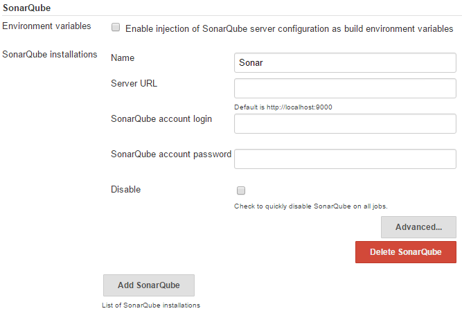

SonarQube settings inside Jenkins system configuration

詹金斯内部有一个特殊的部分来管理插件。在本节中，我们将学习如何使用詹金斯插件管理器管理插件:

1.  从詹金斯仪表盘点击**管理詹金斯**。
2.  进入管理詹金斯页面后，点击**管理插件**。您也可以使用`<Jenkins URL>/pluginManager`链接访问相同的詹金斯插件管理器页面。

3.  您将看到以下四个选项卡:更新、可用、已安装和高级。

# 更新詹金斯插件

**更新**选项卡列出了所有需要更新的插件，如下图所示:


Updating Jenkins plugins

要更新插件，点击相应的复选框选择它，然后点击**立即下载并在重启后安装**按钮。

要更新所有在**更新**标签下列出的插件，点击**全部**(在页面底部提供)。这将选择所有插件。然后，点击**立即下载，重启后安装**按钮安装更新。

在**更新**选项卡上，在页面底部，您将看到一个名为**立即检查**的按钮。点击它刷新显示在**更新**标签下的插件列表。这将检查插件更新。

# 安装新的詹金斯插件

**可用**选项卡列出了詹金斯可用的所有插件。詹金斯实例上安装的插件不会在此列出。

下面的截图显示了 Jenkins 可用插件的列表:


The plugins are grouped based on their functionality

要安装一个插件，点击相应的复选框选择它。然后，在页面底部点击**不重启安装**按钮(立即安装插件)或**立即下载并重启后安装**按钮(名称不言而喻)。

就像**更新**标签一样，在这里你也会看到一个名为**的按钮现在检查**。点击它将刷新**可用**标签下的插件列表。

# 卸载或降级詹金斯插件

**已安装**选项卡列出了当前安装在您的詹金斯实例上的所有插件。如下图所示，你可以看到有一个卸载插件和降级插件的选项。

在插件更新后，如果您的 Jenkins 实例变得不稳定或您的 CI/CD 管道表现不佳，您可以随时选择降级插件:

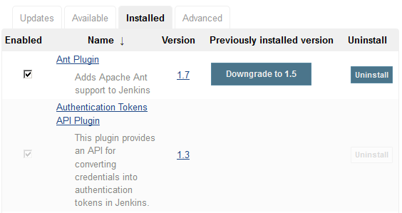

List of installed Jenkins plugin

# 在 Jenkins 中配置代理设置

在**高级**选项卡下，您将看到一个名为 HTTP 代理配置的部分。这是您配置代理设置以允许 Jenkins 从互联网获取更新的地方:


HTTP Proxy Configuration settings

如果您的 Jenkins 服务器不在任何防火墙后面，并且可以直接访问互联网，请将这些字段留空。

当您尝试安装或升级 Jenkins 插件时，Jenkins 会使用 HTTP 代理配置详细信息。它还使用此信息来更新“更新”选项卡和“可用”选项卡上可用的 Jenkins 插件列表。

要测试代理设置，请执行以下操作:

1.  在 **HTTP 代理配置**部分，点击**高级…** 按钮。
2.  在**测试网址**字段添加一个网址，点击**验证代理**按钮。
3.  您应该会看到一条消息:成功，如下图所示。
4.  点击**提交**按钮保存设置:


Checking the proxy settings

# 手动安装詹金斯插件

在**高级**标签下，就在 **HTTP 代理配置**部分之后，你会看到另一个名为**上传插件**的部分。它为您提供了安装或升级詹金斯插件的工具。

当您的 Jenkins 实例没有互联网访问权限，并且您需要一个新插件或需要升级一个现有插件时，此功能非常有用。想象一个场景，你有一个 Jenkins 实例在局域网内运行，但是不能访问互联网，或者我们应该说 Jenkins 在线插件库。在这种情况下，您将首先从在线 Jenkins 存储库中下载所需的 Jenkins 插件，然后使用可移动介质将其传输到 Jenkins 主服务器。最后，您将使用**上传插件**部分来安装所需的詹金斯插件。

让我们按照给定的步骤尝试手动安装插件:

1.  从一台可以上网的机器上，打开网站:[https://updates.jenkins-ci.org/download/plugins/](https://updates.jenkins-ci.org/download/plugins/)。

2.  前面的站点包含了 Jenkins 可用的所有插件列表，如下图所示:


Jenkins plugin index

3.  在下面的例子中，我们将安装一个名为`logstash`的插件。
4.  在索引页面，搜索`logstash`并点击。
5.  您将看到相应插件的所有可用版本。点击你需要的(我选择安装最新的):

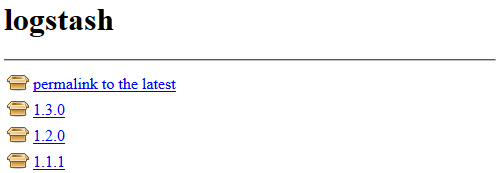

List of versions available for a plugin

6.  这会在你的系统上下载一个`.hpi`文件。
7.  当你下载一个插件时，下载它的依赖项(其他詹金斯插件)也很重要。
8.  在安装所需插件之前，必须安装所有依赖项(詹金斯插件)。
9.  将此`.hpi`文件(`logstash.hpi`)复制到您的詹金斯服务器或任何可以访问您的詹金斯仪表板的机器上。

10.  现在，登录到你的詹金斯服务器。从詹金斯仪表盘，导航至**管理詹金斯** | **管理插件** | **高级**。
11.  在**高级**选项卡的**上传插件**部分，执行以下操作(如下图截图所示):
12.  单击文件字段下的浏览…按钮。
13.  从结果窗口，上传下载的`.hpi`文件。
14.  完成后，点击**上传**按钮:


Manually uploading a Jenkins plugin

15.  詹金斯现在将继续安装插件。

# 詹金斯备份和恢复

如果有人不小心删除了重要的詹金斯配置，会发生什么？虽然使用我们将在*用户管理*部分看到的严格的用户权限可以避免这种情况，但是想象一下，在詹金斯配置中工作的某个人想要恢复到以前稳定的詹金斯配置。

从我们目前所了解到的情况来看，我们知道整个 Jenkins 配置都存储在 Jenkins 主目录下。是`C:\jenkins` (Windows)、`/var/jenkins_home` (Apache Tomcat)、`/var/lib/jenkins` (Linux)。在下一节中，我们将学习如何使用一个插件，即定期备份插件来备份和恢复詹金斯配置。

# 安装定期备份插件

按照给定的步骤安装定期备份插件:

1.  从詹金斯仪表盘，点击**管理詹金斯** | **管理插件**。
2.  在**插件管理器**页面，点击**可用**选项卡。
3.  使用**过滤**选项，搜索`Periodic Backup`，如下图所示:

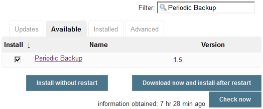

Installing the Periodic Backup plugin

4.  从项目列表中选择定期备份，点击**不重启安装**。你只需要蓝色海洋，其他什么都不需要。

# 配置定期备份插件

在我们开始使用它之前，我们需要告诉定期备份插件备份什么，备份到哪里，以及备份的频率。遵循给定的步骤:

1.  从詹金斯仪表盘转到**管理詹金斯** | **定期备份管理器**。
2.  首次访问定期备份管理器时，您将看到以下通知:

定期备份插件尚未配置。单击此处进行配置。

3.  点击**点击这里配置**链接。
4.  您将进入“定期备份管理器”页面，您会发现许多选项需要配置。让我们一个一个来看(如下图截图所示)。
5.  根目录`<your Jenkins home directory>`是你的詹金斯主目录。
6.  临时目录字段应该是位于您的 Jenkins 服务器机器上的目录。顾名思义，该目录用作在备份/恢复过程中执行归档/取消归档操作的临时位置。它可以是任何目录，应该在 Jenkins 主目录之外。
7.  备份计划(cron)字段是您定义备份时间或频率的地方。不要将此字段留空。请注意，该字段接受 cron 语法。例如，要在每天午夜进行备份，请使用以下不带引号的 cron 语法:`0 0 * * *`。
8.  “验证 cron 语法”按钮用于验证您在备份计划(cron)字段中输入的 cron。
9.  “位置中的最大备份数”字段告诉 Jenkins 不要存储超过此处所述数量的备份。
10.  存储不早于(天)字段告诉 Jenkins 删除任何早于此值的备份。
11.  在文件管理策略下，您有两个选项可供选择:仅配置和完整备份。如果选择“仅配置”选项，Jenkins 将备份 Jenkins 主目录中的所有`.xml`文件和所有作业的`config.xml`文件。但是，如果您选择完整备份，那么 Jenkins 将备份整个 Jenkins 主目录。
12.  在存储策略下，您有三个选项可供选择:空存储、TarGzStorage 和 ZipStorage(支持多卷)。你可以选择适合你要求的。
13.  在“备份位置”下，您可以添加多个备份位置来存储备份。为此，点击**添加位置**按钮并选择本地目录。接下来，在备份目录路径字段下，添加您希望 Jenkins 存储备份的位置。另外，不要忘记勾选**启用此位置**复选框。您可以选择多个位置并启用它们。


Periodic Backup configurations

# 创建詹金斯备份

现在我们已经配置了定期备份插件，让我们运行一个备份来测试我们的设置。为此，在定期备份管理器页面上，单击立即备份！左侧菜单中提供的链接。

当备份正在进行时，您将在“定期备份管理器”页面上看到通知“正在创建备份...”。

备份完成后，您将看到它列在同一页面上，如下图所示:


List of backup

# 正在恢复詹金斯备份

现在让我们测试恢复詹金斯备份。但是在此之前，让我们进行一些配置更改，看看恢复操作是否有效。为此，我们将在“配置系统”页面上进行一些配置更改:

1.  从詹金斯仪表盘，点击**管理詹金斯|配置系统**。
2.  在**配置系统**页面上，更改以下字段的值。
3.  将“执行者数量”字段的值从`2`更改为`5`。
4.  将安静时段字段的值从`5`更改为`10`。
5.  点击页面底部的**保存**按钮。
6.  现在，让我们将詹金斯还原到上述变化之前的某个点。
7.  从詹金斯仪表盘，点击**管理詹金斯|定期备份管理器**。
8.  在结果页面上，选择我们在上一节中创建的备份，并点击**恢复所选备份**按钮。
9.  您将看到以下消息:

正在恢复备份…

10.  刷新页面，从詹金斯仪表盘点击**管理詹金斯|配置系统**。
11.  您会发现“执行者数量”字段的值为 2，“安静时段”字段的值为 5。

# 查看备份和恢复日志

您可以看到关于 Jenkins 备份和恢复的整个日志。要查看详细信息日志，请执行以下步骤:

1.  从詹金斯仪表盘，点击**管理詹金斯|系统日志**。
2.  在日志页面的日志记录器部分，点击`org.jenkinsci.plugins.periodicbackup`。
3.  您将在这里找到备份和恢复操作的完整日志，如下图所示:

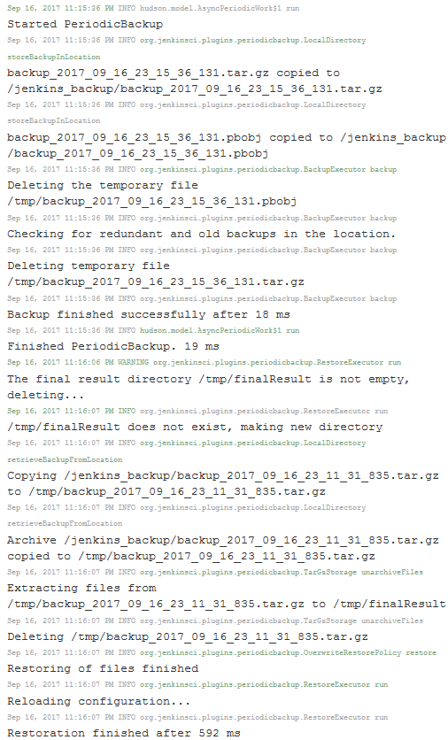

Jenkins Periodic Backup log

# 升级詹金斯

詹金斯发布有两种: *LTS 发布*和*周发布*。*詹金斯每周发布版*包含新功能和错误修复，而 *LTS(长期支持)* *发布版*是被认为在 12 周内稳定的特殊发布。建议您始终为詹金斯服务器选择一个 *LTS 版本*:


Jenkins download page

Jenkins 会在有新版本可用时自动通知您(前提是您的 Jenkins 服务器可以访问互联网)，如下图所示:


Jenkins notification about the availability of a new version

# 升级运行在 Tomcat 服务器上的 Jenkins

在下一节中，我们将学习更新 servlet (Apache Tomcat)中运行的 Jenkins。遵循给定的步骤:

1.  以超级用户身份登录您的 Apache Tomcat 服务器。
2.  使用以下命令在`/tmp`目录下下载最新(LTS)版本的`jenkins.war`:

```
 cd /tmp 
 wget http://mirrors.jenkins.io/war-stable/latest/jenkins.war
```

To download a specific version of Jenkins (LTS), go to the following link: [http://mirrors.jenkins.io/war-stable/](http://mirrors.jenkins.io/war-stable/) and choose the desired version of Jenkins (for example, [http://mirrors.jenkins.io/war-stable/2.73.1/jenkins.war](http://mirrors.jenkins.io/war-stable/2.73.1/jenkins.war)).

To download a specific version of Jenkins (Weekly), go to the following link: [http://mirrors.jenkins.io/war/](http://mirrors.jenkins.io/war/) and choose the desired version of Jenkins (for example, [http://mirrors.jenkins.io/war/2.78/jenkins.war](http://mirrors.jenkins.io/war/2.78/jenkins.war)).

3.  在我们升级詹金斯之前，备份我们的`jenkins_home`目录是很重要的。请参考*创建詹金斯备份*部分。

在升级詹金斯之前，请始终运行詹金斯的备份。

4.  现在，使用以下命令停止`tomcat`服务:

```
 systemctl stop tomcat
```

5.  接下来，转到当前`jenkins.war`文件所在的位置。在我们的案例中，是`/opt/tomcat/webapps`:

```
 cd /opt/tomcat/webapps/
```

如果您选择仅使用 Tomcat Server 运行 Jenkins，您可能会在`webapps`目录下找到`ROOT.war`而不是`jenkins.war`。请参阅第 2 章、*安装詹金斯中的*在 Apache Tomcat 服务器上单独安装詹金斯*一节。*

6.  备份您现有的`jenkins.war`或`ROOT.war`，并将其放在`webapps`目录之外的某个地方(例如，`/tmp`目录):

```
 cp jenkins.war /tmp/jenkins.war.last.stable.version
```

或者:

```
 cp ROOT.war /tmp/ROOT.war.last.stable.version
```

7.  现在，删除 webapps 目录中当前的`jenkins.war`或`ROOT.war`文件:

```
 rm –r jenkins.war
```

或者:

```
 rm –r ROOT.war
```

8.  接下来，将您从`/tmp`目录下载的新`jenkins.war`移动到`webapps`目录。如果您使用 Apache Tomcat 服务器只是为了运行 Jenkins，那么将`destination.war`文件重命名为`ROOT.war`:

```
 mv /tmp/jenkins.war /opt/tomcat/webapps/jenkins.war
```

或者:

```
 mv /tmp/jenkins.war /opt/tomcat/webapps/ROOT.war
```

9.  现在，使用以下命令启动 Tomcat 服务:

```
 systemctl start tomcat
```

10.  登录到您的詹金斯实例。要确认詹金斯版本，请查看您的詹金斯仪表板的右下角，在那里您会发现一个新的詹金斯版本号。

# 升级运行在 Windows 上的独立詹金斯

在 Windows 上升级独立的 Jenkins 服务器是一项简单的任务。遵循给定的步骤:

1.  从[https://jenkins.io/download/](https://jenkins.io/download/)下载最新`jenkins.war`。或者，如果您正在寻找想要升级到的特定 Jenkins 版本，请从以下链接下载:[http://mirrors.jenkins.io/war-stable/](http://mirrors.jenkins.io/war-stable/)。
2.  在我们升级詹金斯之前，备份我们的`jenkins_home`目录是很重要的。参考*詹金斯备份和恢复*部分下的*创建詹金斯备份*部分。

在升级詹金斯之前，请始终运行詹金斯的备份。

在詹金斯独立实例(运行在 Windows 机器上)上，`jenkins.war`文件存在于`jenkins_home`目录中。因此，备份`jenkins_home`目录就足够了。

3.  接下来，停止詹金斯服务。为此，从窗口运行中执行`services.msc`。这将打开窗口服务页面。
4.  搜索詹金斯服务(通常名为詹金斯)。停止 Jenkins 服务，如下图所示:


Stopping a Jenkins service

5.  或者，您也可以使用以下命令从 Windows 命令提示符(以管理员身份运行)停止 Jenkins 服务:

```
 net stop Jenkins
```

输出如下:

```
 The Jenkins service is stopping.
 The Jenkins service was stopped successfully.
```

6.  接下来，用新下载的`jenkins.war`文件替换`C:\Program Files (x86)\Jenkins\`下的`jenkins.war`文件。
7.  替换`jenkins.war`文件*后，*从服务窗口启动 Jenkins 服务，如下图截图所示:


Starting a Jenkins service

8.  或者，您也可以使用以下命令从 Windows 命令提示符(以管理员身份运行)启动 Jenkins 服务:

```
 net start Jenkins
```

输出如下:

```
 The Jenkins service is starting.
 The Jenkins service was started successfully.
```

9.  登录到您的詹金斯实例。要确认詹金斯版本，请查看詹金斯仪表板的右下角，在那里您应该会看到一个新的詹金斯版本号。

# 升级运行在 Ubuntu 上的独立 Jenkins

在下一节中，我们将学习如何更新运行在 Ubuntu 上的 Jenkins。遵循给定的步骤:

1.  以超级用户身份登录到您的 Jenkins 服务器。

2.  使用以下命令，在`/tmp`目录下下载最新(LTS)版本的`jenkins.war`:

```
 cd /tmp 
 wget http://mirrors.jenkins.io/war-stable/latest/jenkins.war
```

要下载詹金斯(LTS)的特定版本，请访问以下链接:[http://mirrors.jenkins.io/war-stable/](http://mirrors.jenkins.io/war-stable/)并选择所需版本的詹金斯(例如，[http://mirrors.jenkins.io/war-stable/2.73.1/jenkins.war](http://mirrors.jenkins.io/war-stable/2.73.1/jenkins.war))。

要下载詹金斯的特定版本(每周)，请访问以下链接:[http://mirrors.jenkins.io/war/](http://mirrors.jenkins.io/war/)并选择所需版本的詹金斯(例如，[http://mirrors.jenkins.io/war/2.78/jenkins.war](http://mirrors.jenkins.io/war/2.78/jenkins.war))。

3.  在我们升级詹金斯之前，备份我们的`jenkins_home`目录是很重要的。参考*詹金斯备份和恢复*部分下的*创建詹金斯备份*部分。

在升级詹金斯之前，请始终运行詹金斯的备份。

4.  现在，使用以下命令停止`jenkins`服务:

```
 systemctl stop jenkins
```

5.  接下来，转到当前`jenkins.war`文件所在的位置。在我们的案例中，是`/usr/share/jenkins/`:

```
 cd /usr/share/jenkins/
```

6.  备份您现有的`jenkins.war`并将其放在`jenkins`目录之外的某个地方(例如，`/tmp`目录):

```
 cp jenkins.war /tmp/jenkins.war.last.stable.version
```

7.  现在，删除`jenkins`目录中的当前`jenkins.war`文件:

```
 rm –r jenkins.war
```

8.  接下来，将您从`/tmp`目录下载的新`jenkins.war`文件移动到`jenkins`目录:

```
 mv /tmp/jenkins.war /usr/share/jenkins/jenkins.war
```

9.  现在，使用以下命令启动`jenkins`服务:

```
 systemctl start jenkins
```

10.  登录到您的詹金斯实例。要确认詹金斯版本，请查看您的詹金斯仪表板的右下角，在那里您会发现一个新的詹金斯版本号。

# 升级运行在 Docker 容器上的 Jenkins

在下一节中，我们将学习如何更新在 Docker 容器中运行的 Jenkins 实例:

以下部分仅适用于使用`jenkins_home`目录的数据卷运行 Jenkins 实例的情况。参见[第 2 章](02.html)、*安装詹金斯*中的*在 Docker 上运行詹金斯、使用数据卷运行詹金斯容器*部分。

1.  登录到您的 Docker 主机。
2.  使用以下命令查找正在运行的 Jenkins 容器:

```
 sudo docker ps --format "{{.ID}}: {{.Image}} {{.Names}}"
```

输出如下:

```
 d52829d9da9e: jenkins/jenkins:lts jenkins_prod
```

3.  您应该会得到类似于前面代码片段的输出。注意詹金斯容器的名字，在我的例子中是`jenkins_prod`。
4.  我们将使用以下 Docker 命令停止并删除正在运行的 Jenkins 容器。但是，在停止并删除 Jenkins 实例之前，请确保 Jenkins 服务器上没有正在运行的作业:

```
 sudo docker stop <your jenkins container name>
 sudo docker rm <your jenkins container name>
```

5.  使用以下命令列出 Docker 主机上可用的 Docker 映像。你可以看到我们有一个詹金斯·多克的图像:`jenkins/jenkins:lts`。然而，这已经不是最新的了:

```
 sudo docker images
```

输出如下:

```
 REPOSITORY        TAG      IMAGE ID        CREATED             SIZE
 jenkins/jenkins   lts      6376a2961aa6    7 weeks ago         810MB
 hello-world       latest   1815c82652c0    3 months ago        1.84kB
```

6.  使用以下命令下载最新的 Jenkins Docker 映像:

```
 sudo docker image pull jenkins/jenkins:2.73.1
```

上述命令可能需要一段时间来下载詹金斯 Docker 映像。

在撰写本章时，2.73.1 是最新的 Jenkins 版本(LTS)。通过修改命令选择所需的詹金斯版本。

7.  下载完成后，再次执行`sudo docker images`命令，如下图所示。请注意新的詹金斯·多克图像。在我的例子中，是`jenkins/jenkins:2.73.1`:

```
 sudo docker images
```

输出如下:

```
 REPOSITORY          TAG     IMAGE ID       CREATED             SIZE jenkins/jenkins     2.73.1  c8a24e6775ea   24 hours ago        814MB jenkins/jenkins     lts     6376a2961aa6   7 weeks ago         810MB hello-world         latest  1815c82652c0   3 months ago        1.84kB
```

8.  现在让我们使用新下载的 Jenkins Docker 映像启动一个新的 Jenkins 容器(我们将重用旧的 Jenkins 容器名称):

```
 sudo docker run -d --name jenkins_prod \
      -p 8080:8080 -p 50000:50000 \ 
      -v jenkins-home-prod:/var/jenkins_home \
      jenkins/jenkins:2.73.1
```

9.  下表解释了我们之前使用的 Docker 命令:

| `docker` | 用于调用 Docker 实用程序。 |
| `run` | 这是一个运行容器的 Docker 命令。 |
| `-d` | 该选项在后端运行容器。 |
| `--name` | 该选项为您的容器命名。 |
| `-p` | 此选项用于将容器的端口映射到主机。 |
| `jenkins/jenkins:2.73.1` | Docker 映像的名称及其用于创建容器的版本。`jenkins/jenkins`是 Jenkins Docker 图像，`2.73.1`是该图像的特定版本。 |

10.  登录到您的詹金斯实例。你应该看到你所有的工作/设置完好无损。要确认詹金斯版本，请查看您的詹金斯仪表板的右下角，在那里您会发现一个新的詹金斯版本号。

# 用户管理员

让我们看看詹金斯在用户管理领域能提供什么。在詹金斯仪表板中，单击管理詹金斯|配置全局安全性以访问配置全局安全性页面。

您也可以使用`<Jenkins URL>/configureSecurity/`链接访问配置全球安全页面。

在下一节中，我们将继续讨论与用户身份验证和权限相关的选项。我们将在接下来的章节中查看其他安全选项。

# 在 Jenkins 上启用/禁用全局安全性

在“配置全局安全性”页面上，您将看到“启用安全性”选项已经启用。启用安全选项应始终打开；禁用它将使任何拥有詹金斯网址的人都可以访问詹金斯，没有任何限制。

# 启用/禁用计算机来记住用户凭据

当用户尝试访问 Jenkins 时，会为他们提供一个选项，让他们在各自的计算机上被记住，如下图所示:

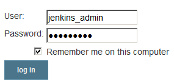

Remember me on this computer option

默认情况下，此行为处于启用状态。要禁用此功能，请勾选“配置全球安全”页面下的**禁用记住我**选项。

# 认证方法

Jenkins 提供了多种身份验证方法可供选择。以下是可用选项的列表:

*   委托给 servlet 容器
*   詹金斯自己的用户数据库
*   轻量级目录访问协议
*   Unix 用户/组数据库


Jenkins' authentication methods

默认情况下，詹金斯自己的用户数据库选项处于启用状态。我们在 Jenkins 设置向导中创建的初始用户都存储在 Jenkins 自己的用户数据库中。没有任何类型的实际数据库，所有用户信息都保存为 XML 文件。让我们快速了解一下每种身份验证方法。

# 委托给 servlet 容器

仅当您从 servlet 容器(如 Apache Tomcat 等)运行 Jenkins 服务器时，才能使用此选项。启用此选项将允许 Jenkins 使用 servlet 容器的领域对用户进行身份验证。

例如，在第 2 章、*安装詹金斯*、的*在 servlet 容器*内运行詹金斯子部分*中，我们修改了`tomcat-user.xml`文件来创建用户和访问。这就是`UserDatabaseRealm`的一个例子。*

这意味着，如果您的 Jenkins 服务器运行在 Apache Tomcat 服务器上，并且您已经配置了`UserDatabaseRealm`*，那么`tomcat-user.xml`文件中定义的所有用户都将能够访问 Jenkins。*

 *参考以下网站查看 Apache Tomcat 支持的所有类型的领域:[http://Tomcat . Apache . org/Tomcat-8.0-doc/Realm-how to . html # Standard _ Realm _ implements。](http://tomcat.apache.org/tomcat-8.0-doc/realm-howto.html#Standard_Realm_Implementations)

# 詹金斯自己的用户数据库

默认情况下，此选项处于启用状态。在该方案下，Jenkins 将所有用户信息存储在 XML 文件中。这个选项对于小型组织或者如果您正在探索 Jenkins 并且还没有使它成为您的组织的一部分，是很好的。

还有一个选项允许用户在登录页面注册。要启用它，勾选詹金斯自己的用户数据库下的**允许用户注册**选项。

这将在 Jenkins 登录页面启用名为**的链接创建账户**，如下图所示:

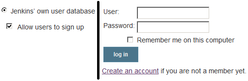

Allow user to sign up option

作为新用户，当你点击**创建账户**链接时，系统会要求你填写一些关于自己的基本信息，比如用户名、密码、邮箱、全名等等。一旦你填写完必要的信息，你将被允许进入詹金斯。

作为新用户，您在 Jenkins 上被允许看到/做什么取决于 Jenkins 内部的**授权**设置。我们将在本章后面了解**授权**设置。

# 轻量级目录访问协议

这是大多数组织中使用最广泛的身份验证方法之一。如果您没有看到**访问控制** | **安全领域**部分下列出的 **LDAP** 选项，请检查 **LDAP 插件**。

如下图所示，以下选项允许 Jenkins 使用 LDAP 服务器对用户进行身份验证。联系您组织中的信息技术管理团队，提供 LDAP 服务器的详细信息(如果您的组织使用 LDAP)。

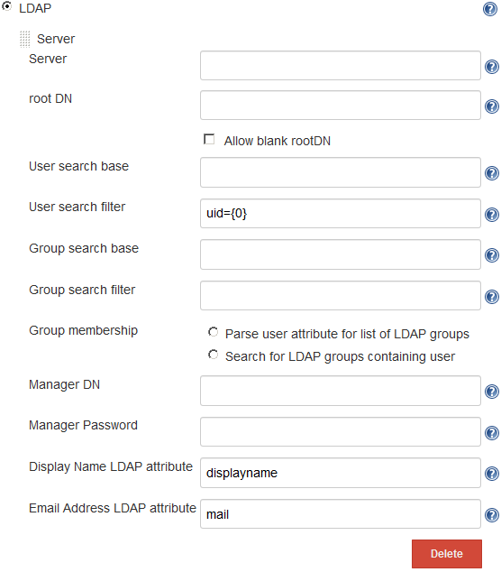

For more information about the LDAP configuration, refer to the LDAP plugin page: [https://wiki.jenkins.io/display/JENKINS/LDAP+Plugin](https://wiki.jenkins.io/display/JENKINS/LDAP+Plugin).

# Unix 用户/组数据库

如果 Jenkins 安装在 Unix/Linux 机器上，则以下选项有效。启用后，Jenkins 会将身份验证委托给底层操作系统。换句话说，在底层操作系统上配置的所有用户/组都可以访问 Jenkins。

您不需要在 Jenkins 内部配置任何东西来使这个选项工作。但是，底层操作系统上的所有用户都应该可以访问`/etc/shadow`文件*。*

使用以下命令使所有用户都可以访问`/etc/shadow`文件:

```
sudo chmod g+r /etc/shadow
```

# 在詹金斯内部创建新用户

以下部分仅适用于使用 Jenkins 自己的用户数据库作为身份验证方法的情况。执行以下步骤将用户手动添加到您的 Jenkins 服务器。

1.  从詹金斯仪表盘，点击**管理詹金斯|管理用户**。
2.  在**管理用户**页面，从左侧菜单，点击**创建用户**。
3.  在结果页面上，您将被要求提供一些关于用户的基本信息，如下图所示:


Creating a user in Jenkins

4.  用适当的值填充字段，并点击**创建用户**按钮。

仅当您使用 Jenkins 自己的用户数据库作为身份验证方法时，“管理用户”链接才可用。

# 人物页面

“人员”页面显示有权访问 Jenkins 服务器的所有用户，如下图所示:


The Jenkins People page

# 詹金斯中的用户信息和设置

单击任何特定的用户标识或名称(请参见下面的屏幕截图)以获取相应用户的信息。您将进入用户的状态页面，如下图所示:


The users' Status page

在用户状态页面，您将在左侧菜单上看到以下选项:**状态**、**构建**、**配置**、**我的视图**和**凭证**。让我们详细探讨其中的一些:

*   **构建**页面将显示当前用户运行的所有 Jenkins 构建的信息。
*   **我的视图**页面将带您进入当前用户可访问的视图。如果没有为当前用户配置视图，那么**我的视图**页面将显示默认的全部视图(詹金斯仪表盘)。
*   凭证链接将带您进入**凭证**页面。但是，“凭据”页面将显示与当前用户相关的附加信息，如下图所示:

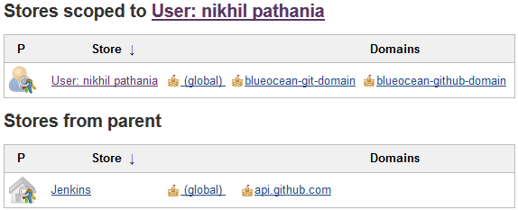

Jenkins credentials scoped to a user

# 授权方法

Jenkins 提供了多种授权方法可供选择。以下是可用选项的列表:

*   任何人都可以做任何事
*   传统模式
*   登录用户可以做任何事情
*   基于矩阵的
*   基于项目的矩阵授权策略

默认情况下，已登录用户可以做任何事情选项处于启用状态。让我们快速了解一下每种授权方法。

要访问詹金斯授权设置，从詹金斯仪表板导航至**管理詹金斯|配置全球安全|访问控制**。

# 任何人都可以做任何事

当您选择此选项时，Jenkins 不会执行任何授权。任何可以访问 Jenkins 的人都可以完全控制，包括匿名用户。不建议使用此选项。

# 传统模式

当您选择此选项时，Jenkins 的行为方式与 1.164 版之前相同。简单来说，Jenkins 将寻找名为`Admin`的用户(不考虑您使用的身份验证方法)*。*该`Admin`用户将被授予管理权限，其余用户将被视为匿名用户。同样不建议使用此选项。

# 登录用户可以做任何事情

这是詹金斯在安装和设置新的詹金斯服务器时附带的默认身份验证设置。名称不言自明，即登录用户默认为管理员。同样，不建议使用此选项。

在“登录用户可以做任何事情”字段下，有一个名为“允许匿名读取访问”的选项(默认情况下禁用)。勾选(启用)此选项后，任何有权访问詹金斯网址的人都将立即被带到詹金斯仪表板，对所有詹金斯职务具有只读访问权限。但是，您需要登录才能编辑詹金斯作业或查看詹金斯的配置。

# 矩阵安全

这是詹金斯最广泛使用的授权方法之一。让我们通过执行以下步骤来详细探索它:

1.  通过选择启用基于矩阵的安全授权方法。您将看到以下矩阵:


Matrix-based security configurations

2.  从前面的截图中，您可以看到列代表 Jenkins 中的各种项目，行代表各种用户。在矩阵的底部有一个添加用户的选项。
3.  让我们添加一些用户，并为他们提供一些权限。
4.  要添加用户，在**用户/组添加**字段输入用户的确切用户名，点击**添加**按钮。
5.  从下面的截图可以看到，我已经添加了四个用户(参考*人物页面*部分，可以在这里看到可以添加的用户列表)。如果您使用的是 Jenkins 自己的用户数据库，那么创建一些用户(参考*在 Jenkins 内部创建新用户*部分):

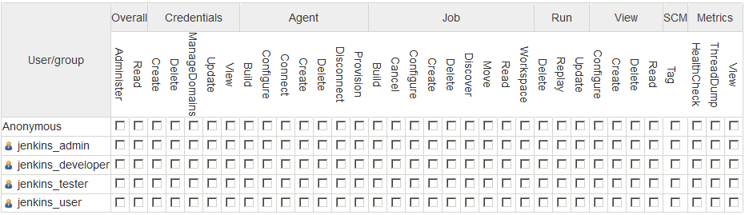

Adding users to the matrix

6.  现在，让我们通过选择适当的复选框给他们一些权限。从下面的截图可以看出，我已经给了用户`jenkins_admin`完全的访问权限。用户`jenkins_developer`和`jenkins_tester`被授予读取和执行 Jenkins 作业的权限，`jenkins_user`用户被授予只读权限:

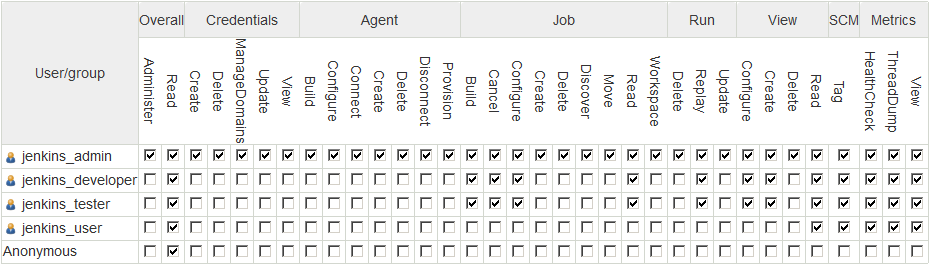

Providing permissions using the Matrix

7.  保持其余设置不变，点击页面底部的保存按钮。
8.  要检查配置，请以每个用户的身份登录，并确认您在 Jenkins 仪表板上看到的内容。

# 基于项目的矩阵授权策略

在前一节中，我们看到了基于矩阵的安全授权特性，它为我们提供了对用户和权限的大量控制。

但是，想象一下这样一种情况，您的 Jenkins 服务器已经发展到包含数百个 Jenkins 作业和许多用户的地步，您希望在作业级别(项目级别)控制用户权限。

在这种情况下，我们需要基于项目的矩阵授权策略:


User permission at job level

让我们学习如何配置基于项目的矩阵授权策略。请执行以下步骤:

1.  要访问詹金斯授权设置，从詹金斯仪表板导航至**管理詹金斯|配置全球安全|访问控制**。
2.  选择基于项目的矩阵授权策略选项。您将看到以下矩阵:


Project-based Matrix Authorization Strategy configurations

3.  现在，添加一个用户并授予其完全权限。要添加用户，请在要添加的用户/组字段中键入用户的确切用户名，然后点击**添加**按钮。

4.  从下面的截图可以看到，我已经添加了拥有完全权限的用户`jenkins_admin`:


Adding users to the matrix

5.  保持其余设置不变，点击页面底部的**保存**按钮。
6.  接下来，在詹金斯仪表板上右键单击任何詹金斯作业，并选择**配置**。
7.  在“作业配置”页面上，一直向下滚动到“启用基于项目的安全性”选项并将其启用。
8.  启用基于项目的安全性后，将出现一个矩阵表，如下图所示:


Project-based security configurations inside Jenkins job

9.  让我们添加一些用户，并为他们提供一些权限。
10.  要添加用户，请在要添加的用户/组字段中输入用户的确切用户名，然后点击**添加**按钮。

11.  从下面的截图中可以看到，我已经给用户`jenkins_developer`添加了一些权限:

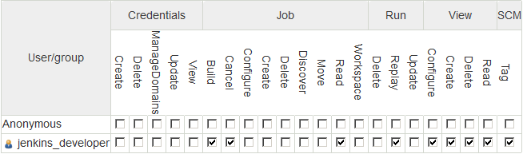

Providing permissions using the Matrix

12.  完成后，点击页面底部的**保存**按钮。
13.  现在以您刚刚授予相应 Jenkins 作业权限的用户身份登录(在我们的示例中为`jenkins_developer`)。
14.  您会发现用户只能看到它有权访问的 Jenkins 作业。
15.  同样，您可以在 Jenkins 中创建的每个作业上配置用户权限。

# 摘要

在本章中，我们看到了如何在 Jenkins 中配置一些基本但重要的元素，所有这些都借助于一些实际的例子。詹金斯升级、詹金斯备份和詹金斯用户管理是我们在本章中学到的一些重要内容。

下一章是关于詹金斯主从架构和詹金斯*分布式构建系统*。*