# 安装声纳管和配件

在这一章中，我们将学习 SonarQube，这是一个流行的用于静态代码分析的开源工具。我们还将了解 Artifactory，这是另一个流行的用于版本控制二进制文件的开源工具。在本章中，您将了解以下主题:

*   安装独立的 SonarQube 服务器
*   在 SonarQube 中创建项目
*   为 SonarQube 安装构建断路器插件
*   创建质量门和质量档案
*   在 Jenkins 中安装和配置 SonarQube 插件
*   安装独立的 Artifactory 服务器
*   在 Artifactory 内部创建存储库
*   在詹金斯安装和配置人工工厂插件

# 安装和配置声纳套管

除了以连续的方式集成代码之外，如今的 CI 管道还包括执行连续检查的任务——以连续的方式检查代码的质量。

持续检查处理检查和避免质量差的代码。SonarQube 等工具可以帮助我们实现这一目标。每次签入(提交)代码时，都会对代码进行代码分析。

这种分析基于代码分析工具定义的一些规则。如果代码通过了错误阈值，就可以进入生命周期的下一步。但是，如果它超过了错误阈值，它就会被丢弃。

一些组织更喜欢检查代码的质量，就在开发人员试图签入代码的时候。如果分析良好，则允许签入代码，否则取消签入，开发人员需要再次处理代码。

SonarQube 是一个代码质量管理工具，允许团队管理、跟踪和提高他们的源代码质量。它是一个基于 web 的应用程序，包含规则、警报和阈值，所有这些都可以配置。它涵盖了七种类型的代码质量参数，它们是架构和设计、重复、单元测试、复杂性、潜在的错误、编码规则和注释。

SonarQube 是一个开源工具，在插件的帮助下支持几乎所有流行的编程语言。SonarQube 还可以与 Jenkins 等 CI 工具集成，以执行持续检查，我们将很快看到这一点。

所以，首先让我们学习如何安装 SonarQube。在下一节中，我们将学习如何在 Ubuntu 16.04 上安装 SonarQube。

# 安装 Java

按照以下步骤安装 Java:

1.  更新包索引:

```
sudo apt-get update
```

2.  接下来，安装 Java。以下命令将安装 JRE:

```
sudo apt-get install default-jre
```

3.  要设置`JAVA_HOME`环境变量，首先获取 Java 安装位置。通过执行以下命令来完成此操作:

```
update-java-alternatives –l
```

4.  您应该会得到类似的输出:

```
java-1.8.0-openjdk-amd64 1081 /usr/lib/jvm/java-1.8.0-openjdk-amd64
```

5.  前面输出中的路径是`JAVA_HOME`位置。收到。
6.  打开`/etc/environment`文件进行编辑:

```
sudo nano /etc/environment
```

7.  在`/etc/environment`文件内增加如下一行，如下图:

```
JAVA_HOME="/usr/lib/jvm/java-1.8.0-openjdk-amd64"
```

8.  键入 *Ctrl* + *X* ，选择 *Y* 保存并关闭文件。
9.  接下来，使用以下命令重新加载文件:

```
 sudo source /etc/environment
```

# 下载 SonarQube 包

以下步骤将帮助您下载 SonarQube 软件包:

1.  导航至[https://www.sonarqube.org/downloads/](https://www.sonarqube.org/downloads/)，下载最新版本的 SonarQube 安装包。

建议您始终安装最新的 LTS*版 SonarQube。

2.  移至`/tmp`文件夹:

```
cd /tmp
```

3.  使用`wget`下载 SonarQube ZIP 包，如下命令所示。这里，我正在下载 SonarQube 5 . 6 . 7 版(LTS*):

```
wget https://sonarsource.bintray.com/Distribution/sonarqube/
sonarqube-5.6.7.zip
```

4.  接下来，使用以下命令解压缩`/opt`目录中的 SonarQube ZIP 包:

```
unzip sonarqube-5.6.7.zip -d /opt/
```

要使用`unzip`命令，请确保您的 Ubuntu 机器上安装了拉链工具。要安装 ZIP 工具，请执行以下命令:
`**sudo apt-get install zip**`

您也可以在不同的机器上下载 SonarQube ZIP 包，然后使用 WinSCP 将其移动到您的 SonarQube 服务器。

5.  移动到提取的文件夹并列出其内容:

```
cd /opt/sonarqube-5.6.7/ 
ls -lrt
```

`bin/`文件夹包含安装和启动 SonarQube 的所有脚本，`logs/`文件夹包含 SonarQube 日志。

# 运行 SonarQube 应用程序

按照以下步骤启动 SonarQube 服务器:

1.  移至`/opt/sonarqube-5.6.6/bin/linux-x86-64/`。在我们当前的示例中，我们在 64 位 Linux 操作系统上启动了 SonarQube:

```
cd /opt/sonarqube-5.6.6/bin/linux-x86-64/
```

2.  运行`sonar.sh`脚本启动 SonarQube，如下命令所示:

```
./sonar.sh start
```

3.  您应该会看到类似的输出:

```
Starting SonarQube... Started SonarQube.
```

4.  要访问 SonarQube，请使用您最喜欢的网络浏览器中的以下链接:`http://localhost:9000/`或`http://<IP-Address>:9000`。

目前，SonarQube 中没有配置用户帐户。但是，默认情况下，有一个用户名为`admin`，密码为`admin`的管理员帐户。
确保您至少有 4 GB 内存来运行 64 位版本的 SonarQube。

# 重置默认凭据并生成令牌

按照以下步骤重置凭据并生成令牌:

1.  在您最喜欢的浏览器中打开 SonarQube 链接，然后切换到管理员用户。
2.  在 SonarQube 仪表板中，单击管理员|我的帐户|安全性(选项卡)。
3.  在结果页面上的“更改密码”部分下，执行以下操作:
    1.  在旧密码字段下添加您的旧密码(`admin`)。
    2.  在“新密码”字段下添加新密码。
    3.  通过在确认密码字段中再次添加新密码来再次确认您的新密码。
    4.  完成后，单击更改密码按钮。
4.  在同一页面的令牌部分下，有一个生成令牌的选项。詹金斯可以用这个令牌访问 SonarQube。执行以下步骤生成新令牌:
    1.  在令牌部分下，通过单击生成按钮，使用生成令牌字段添加新令牌的名称。
    2.  将生成一个新的令牌，如下图所示。


Creating a token inside SonarQube

# 在 SonarQube 中创建项目

在下一节中，我们将在 SonarQube 中创建一个项目。该项目将用于显示静态代码分析:

1.  在 SonarQube 仪表板中，单击管理|项目(选项卡)|管理。
2.  在结果页面上，单击“创建项目”按钮。

3.  在结果窗口中，填写相应的详细信息，如以下步骤所示:
    1.  在“名称”字段下添加名称。
    2.  在“密钥”字段下添加密钥。
    3.  单击创建按钮创建项目:


Creating a project inside SonarQube

4.  您可以在“项目管理”页面上看到新创建的项目，如下图所示:


Newly created project inside SonarQube

# 为 SonarQube 安装构建断路器插件

SonarQube 提供了构建中断插件。这是一个 SonarQube 插件，而不是 Jenkins 插件。这个插件允许配置项系统(詹金斯)在不满足质量门条件的情况下强制使詹金斯构建失败。要安装构建断路器插件，请执行以下步骤:

1.  下载插件前，先参考兼容性表。这将帮助我们下载正确的插件版本。兼容性表可在[https://github.com/SonarQubeCommunity/sonar-build-breaker](https://github.com/SonarQubeCommunity/sonar-build-breaker)获得。
2.  从[https://github . com/Sonarqubecocommunity/sonar-build-breaker/releases](https://github.com/SonarQubeCommunity/sonar-build-breaker/releases)下载 build-breaker 插件。
3.  使用以下命令，移动到`/tmp`目录并下载构建断路器插件:

```
cd /tmp

wget https://github.com/SonarQubeCommunity/
sonar-build-breaker/releases/download/2.2/
sonar-build-breaker-plugin-2.2.jar
```

4.  将下载的`.jar`文件移动到`opt/sonarqube-5.6.7/extensions/plugins/`位置:

```
cp sonar-build-breaker-plugin-2.2.jar \
/opt/sonarqube-5.6.7/extensions/plugins/
```

5.  使用以下命令重新启动 SonarQube:

```
cd /opt/sonarqube-5.6.7/bin/linux-x86-64

sudo ./sonar.sh restart
```

6.  您应该会看到类似的输出:

```
Stopping SonarQube... Waiting for SonarQube to exit... Stopped SonarQube. Starting SonarQube... Started SonarQube.
```

7.  成功重启后，转到 SonarQube 仪表板并以管理员身份登录。

8.  单击菜单栏中的管理链接。
9.  在“管理”页面上，您将在“类别”边栏下看到“构建断路器”选项，如下图所示；什么都不做:

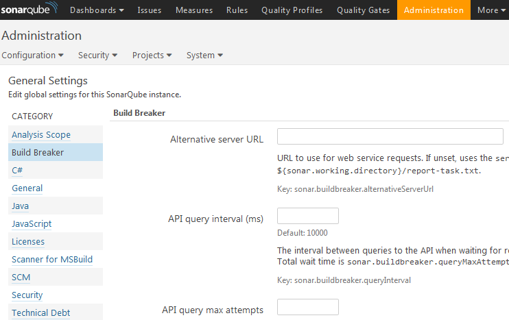

The build breaker plugin settings inside SonarQube

10.  构建断路器插件已成功安装。

# 创建质量门

为了让构建断路器插件工作，我们需要创建一个*质量门*；这只不过是有一些条件的规则。当詹金斯管道运行时，它将执行*质量简介*和质量门。如果质量门检查成功通过，则詹金斯流水线继续，但是如果失败，则詹金斯流水线中止。尽管如此，分析仍然发生。

按照以下步骤在 SonarQube 中创建质量门:

1.  在 SonarQube 仪表板中，单击菜单栏中的质量门链接。
2.  在结果页面上，单击左上角的创建按钮。
3.  您将看到一个弹出窗口，如下图所示。在“名称”字段下为质量门添加一个名称，然后单击“创建”按钮:


Creating a new quality gate

4.  您将在“质量门”页面上看到新的质量门，如下图所示:

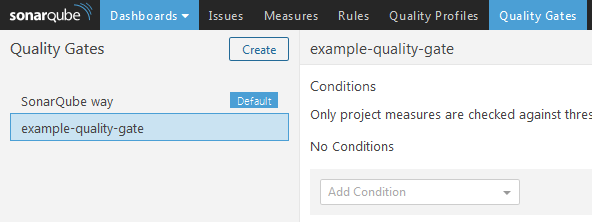

The new quality gate

5.  现在，让我们通过从“添加条件”菜单中选择一个条件来为质量门添加一个条件:


Condition menu

6.  下面的截图显示了一个名为“主要问题”的情况。如果大于`1`但小于`50`则为 WARNING，如果大于`50`则为 ERROR，如下图截图所示。这只是一个例子；您可以配置任意数量的条件:

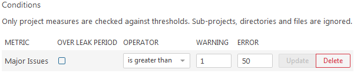

Configuring the quality gate

7.  接下来，让我们确保我们之前在 SonarQube 中创建的示例项目使用我们新创建的质量门。为此，从 SonarQube 仪表板中，单击管理|项目(选项卡)|管理。
8.  在结果页面上，您将看到我们之前在 SonarQube 中创建的示例项目。点击它。
9.  在结果页面上，单击管理(选项卡)|质量门。

10.  在“质量门”部分，您将看到一个选项，用于从 SonarQube 中的可用质量门列表中选择质量门。选择我们最近创建的一个，然后单击更新按钮:


Associating a quality gate to a project

# 更新默认质量配置文件

在下一节中，我们将修改 Java(声纳方式)的默认质量配置文件，我们打算将其用于静态代码分析。请遵循以下步骤:

1.  在 SonarQube 仪表板中，单击菜单栏中的质量配置文件链接。在结果页面上，您将看到 SonarQube 上存在的所有质量配置文件，如下图所示:

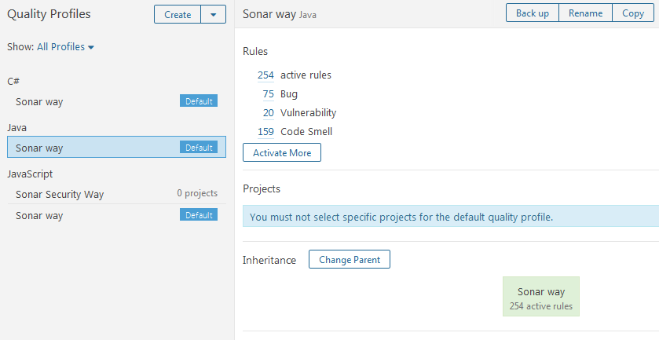

List of quality profiles in SonarQube

2.  从前面的截图可以看到，Java: Sonar 方式的默认质量配置文件包含 254 条活动规则。让我们尝试添加更多规则。
3.  单击激活更多按钮。
4.  在结果页面上，您将看到一些内容，如下图所示:


List of inactive rules

5.  这是您可以在质量档案中添加和删除规则的地方。让我们激活 Java 的所有非活动规则。

6.  为此，从页面的右上角，单击批量更改|以声纳方式激活，如下图所示:

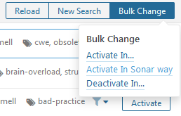

Activating rules in bulk

7.  您将看到一个弹出窗口，要求您确认更改。单击应用按钮并继续。
8.  接下来，从菜单栏中，单击质量配置文件链接。在结果页面，点击 Java 的**声纳方式**质量简介，现在你应该会看到比以前更多的规则。

The list of rules and default quality profiles visible on SonarQube depends on the installed plugin. To get rules for your desired language, install its respective SonarQube plugin. 

# 在詹金斯安装索纳库插件

按照以下步骤为詹金斯安装 SonarQube 插件:

1.  从詹金斯仪表板中，单击管理詹金斯|管理插件|可用(选项卡)。您将进入詹金斯管理插件页面。

2.  在过滤字段输入`SonarQube`，如下图所示:

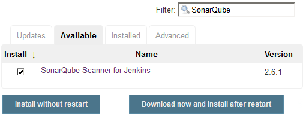

Installing the SonarQube plugin

3.  从列表中选择詹金斯的 SonarQube 扫描仪，然后单击“不重启安装”按钮。
4.  如果需要，重启詹金斯。

# 在詹金斯中配置 SonarQube 插件

现在我们已经安装了 SonarQube 插件，让我们配置它:

1.  在詹金斯仪表板中，单击管理詹金斯|配置系统。
2.  进入“配置系统”页面后，一直向下滚动到 SonarQube 服务器部分。
3.  在 SonarQube 服务器部分下，单击添加 SonarQube 按钮。您将看到要配置的设置，如下图所示。让我们一个一个来看。
4.  使用名称字段为您的 SonarQube 服务器命名。
5.  在服务器网址字段下输入 SonarQube 服务器网址。
6.  在默认部署者凭据下添加人工凭据。
7.  在服务器身份验证令牌字段下添加我们在 SonarQube 中创建的令牌。

8.  单击“测试连接”按钮，测试詹金斯与 Artifactory 的连接:


Configuring the SonarQube plugin

9.  完成后，单击页面末尾的保存按钮保存设置。

# 安装和配置 Artifactory

持续集成导致频繁的构建和打包。因此，需要一种机制来将所有这些二进制代码(构建、包、第三方插件等)存储在类似于版本控制系统的系统中。

由于版本控制系统如 Git、TFS 和 SVN 存储代码而不是二进制文件，我们需要一个二进制存储库工具。与 Jenkins 紧密集成的二进制存储库工具(如 Artifactory 或 Nexus)具有以下优势:

*   跟踪构建(谁触发？构建了什么代码？)
*   属国
*   部署历史记录

下图描述了像 artifacts 这样的二进制存储库工具如何与 Jenkins 一起存储构建工件。在接下来的主题中，我们将学习如何通过创建一个 Jenkins 作业将代码上传到 Artifactory 来实现这一点:

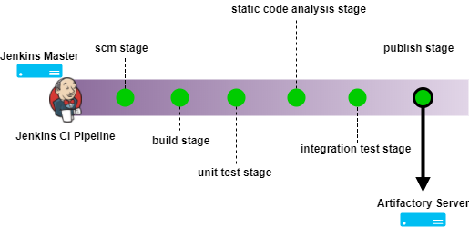

Jenkins pipeline pushing built artifacts to Artifactory

在当前的书中，我们将处理 Artifactory 来存储我们的构建。Artifactory 是一个用于版本控制二进制文件的工具。二进制文件可以是任何东西，从构建的代码、包、可执行文件、Maven 插件等等。

在下一节中，我们将在 Ubuntu 16.04 上设置 Artifactory。

# 安装 Java

按照以下步骤安装 Java:

1.  更新包索引:

```
sudo apt-get update
```

2.  接下来，安装 Java。以下命令将安装 JRE:

```
sudo apt-get install default-jre
```

3.  要设置`JAVA_HOME`环境变量，首先获取 Java 安装位置。通过执行以下命令来完成此操作:

```
update-java-alternatives –l
```

4.  您应该会得到类似的输出:

```
java-1.8.0-openjdk-amd64 1081 /usr/lib/jvm/java-1.8.0-openjdk-amd64
```

5.  前面输出中的路径是`JAVA_HOME`位置。收到。
6.  打开`/etc/environment`文件进行编辑:

```
sudo nano /etc/environment
```

7.  在`/etc/environment`文件内增加如下一行，如下图:

```
JAVA_HOME="/usr/lib/jvm/java-1.8.0-openjdk-amd64"
```

8.  键入 *Ctrl* + *X* ，选择 *Y* 保存并关闭文件。
9.  接下来，使用以下命令重新加载文件:

```
 sudo source /etc/environment
```

# 下载艺术工厂包

按照给定的步骤下载 Artifactory 包:

1.  从[https://www.jfrog.com/open-source/](https://www.jfrog.com/open-source/)或[https://bintray . com/jfrog/artifact/jfrog-artifact-OSS-zip](https://bintray.com/jfrog/artifactory/jfrog-artifactory-oss-zip)下载最新版本的 artifact(开源)。
2.  要下载 artifact Pro，请访问[https://bintray.com/jfrog/artifactory-pro/](https://bintray.com/jfrog/artifactory-pro/)或[https://bintray . com/jfrog/artifact-Pro/jfrog-artifact-Pro-zip](https://bintray.com/jfrog/artifactory-pro/jfrog-artifactory-pro-zip)。

建议您始终安装 Artifactory 的最新 LTS 版本。

在下一章中，我们将使用 artifact Pro 来演示在下一章中使用属性进行代码升级。

参考[https://www . jfrog . com/converge/display/RTF/Artifactory+Pro # artiforypro-activatingartifactrypro](https://www.jfrog.com/confluence/display/RTF/Artifactory+Pro#ArtifactoryPro-ActivatingArtifactoryPro)了解激活 ArtifactoryPro 的流程。

3.  移至`/tmp`文件夹:

```
cd /tmp
```

4.  使用`wget`下载 Artifactory Pro ZIP 包，如下图代码所示。这里，我正在下载 artifact 5 . 5 . 2 版(LTS*):

```
wget https://jfrog.bintray.com/artifactory-pro/org/artifactory/pro/jfrog-artifactory-pro/5.5.2/jfrog-artifactory-pro-5.5.2.zip
```

You can download the Artifactory ZIP package on a different machine (from a browser) and then move it to your to-be Artifactory server, using WinSCP.

5.  接下来，解压`/opt`目录下的 SonarQube ZIP 包，如下代码所示:

```
sudo unzip jfrog-artifactory-pro-5.5.2.zip -d /opt/
```

或者，如果下载的 ZIP 包有一个奇怪的名称:

```
sudo unzip \
download_file\?file_path\=jfrog-artifactory-pro-5.5.2.zip \
–d /opt/
```

要使用`unzip`命令，请确保您的 Ubuntu 机器上安装了拉链工具。要安装 ZIP 工具，请执行以下命令:
`**sudo apt-get install zip**`

6.  移动到提取的文件夹并列出其内容:

```
cd /opt/artifactory-pro-5.5.2/ 
ls -lrt
```

`bin/`文件夹包含安装和启动 artifact 的所有脚本，`logs/`文件夹包含 artifact 日志。

# 运行 Artifactory 应用程序

按照给定的步骤启动 Artifactory 服务器:

1.  移至`/opt/artifactory-pro-5.5.2/bin/`目录，运行`installService.sh`脚本:

```
sudo ./installService.sh
```

2.  您应该会看到类似的输出:

```
Installing artifactory as a Unix service that will run as user artifactory Installing artifactory with home /opt/artifactory-pro-5.5.2
Creating user artifactory...creating... DONE

Checking configuration link and files in /etc/opt/jfrog/artifactory...
Moving configuration dir /opt/artifactory-pro-5.5.2/etc /opt/artifactory-pro-5.5.2/etc.original...creating the link and updating dir... DONE
Creating environment file /etc/opt/jfrog/artifactory/default...creating... DONE
** INFO: Please edit the files in /etc/opt/jfrog/artifactory to set the correct environment
Especially /etc/opt/jfrog/artifactory/default that defines ARTIFACTORY_HOME, JAVA_HOME and JAVA_OPTIONS
Initializing artifactory.service service with systemctl... DONE

Setting file permissions... DONE

************ SUCCESS ****************
Installation of Artifactory completed

Please check /etc/opt/jfrog/artifactory, /opt/artifactory-pro-5.5.2/tomcat and /opt/artifactory-pro-5.5.2 folders

You can activate artifactory with:
> systemctl start artifactory.service
```

3.  使用以下任一命令启动 Artifactory 服务:

```
sudo service artifactory start
```

或者:

```
sudo /etc/init.d/artifactory start
```

或者:

```
sudo systemctl start artifactory
```

4.  您可以通过执行以下任一命令来检查 Artifactory 安装:

```
service artifactory check
```

或者:

```
/etc/init.d/artifactory check 
```

或者:

```
sudo ./artifactoryctl check
```

5.  通过导航至`http://<Server IP Address>:8081/`进入 Artifactory 仪表盘。

目前，Artifactory 中没有配置用户帐户。但是，默认情况下，有一个用户名为`admin`，密码为`password`的管理员帐户。

确保您至少有 4 GB 内存来运行 64 位版本的 Artifactory。

# 重置默认凭据并生成应用编程接口密钥

按照给定的步骤重置人工工厂凭据:

1.  使用以下链接访问 Artifactory 仪表板:`http://<Server IP Address>:8081/`。
2.  使用管理员的初始默认凭据以管理员身份登录。
3.  在工厂仪表板中，单击欢迎，管理|编辑配置文件。
4.  在当前密码字段中输入您的当前密码，然后按解锁按钮。
5.  在结果页面的“个人设置”下，添加您的电子邮件标识。
6.  在“更改密码”部分下，添加新密码以重置管理员用户的默认凭据。
7.  接下来，在身份验证设置部分下，单击生成密钥(齿轮徽标)以生成新的应用编程接口密钥。
8.  通过点击复制按钮复制生成的 API 密钥(参见下面的截图)。
9.  稍后，我们可能需要此 API 密钥进行身份验证:

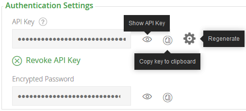

Artifactory API key

10.  完成后，单击保存按钮。

# 在 Artifactory 中创建存储库

在下一节中，我们将在 Artifactory 内部创建一个基因存储库。存储库将用于存储构建工件:

1.  从 Artifactory 仪表板的左侧菜单中，单击管理|存储库|本地，如下图所示:

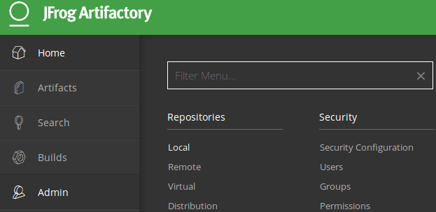

Creating a local repository in Artifactory

2.  结果页面将显示当前可用的所有本地存储库，如下图所示:

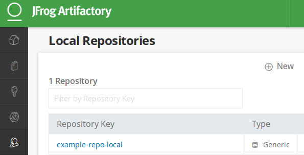

List of all the Local Repositories

3.  点击右上角的新建按钮，创建一个新的本地存储库(见下面的截图)。
4.  您将看到一个弹出窗口，其中列出了可供选择的各种类型的存储库，如下所示。选择通用类型(参见下面的屏幕截图):

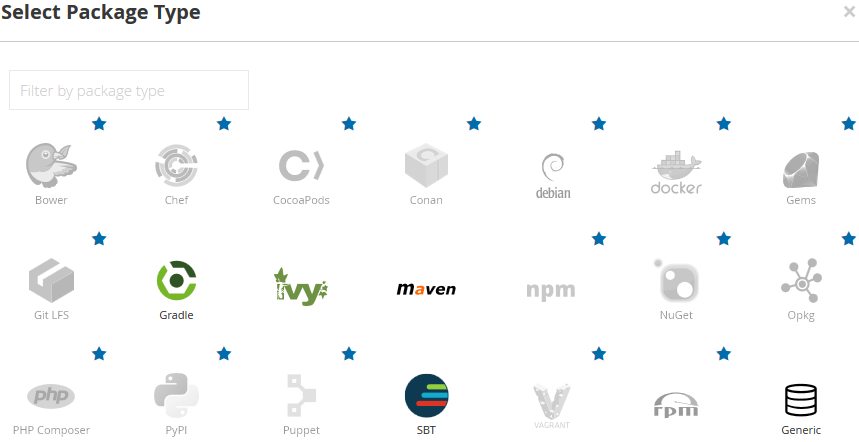

Option to choose various types of repositories

5.  通过在“存储库密钥”字段下添加一个值，为您的存储库命名，如下图所示。将其余设置保留为默认值:


Naming our new local repository

6.  完成后，单击保存并完成按钮。
7.  现在我们有了新的本地存储库，如下图所示:

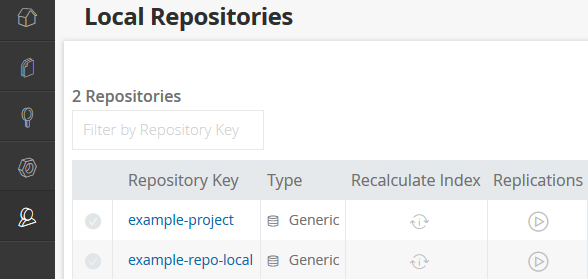

Our newly created local repository

# 在詹金斯内部添加人工身份证明

按照给定的步骤在 Jenkins 内部创建凭据，以便与 Artifactory 对话:

1.  从詹金斯仪表板中，单击凭据|系统|全局凭据(无限制)。
2.  单击左侧菜单上的添加凭据链接来创建新凭据(请参见下面的屏幕截图)。
3.  选择“种类”作为带密码的用户名。
4.  将“范围”字段保留为默认值。
5.  在用户名字段下添加人工工厂用户名。
6.  在密码字段下，添加密码。
7.  在标识字段下添加标识，在描述字段下添加描述。
8.  完成后，单击确定按钮:

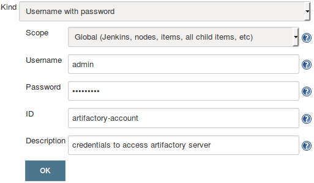

Adding Artifactory credentials inside Jenkins

# 在詹金斯安装人工工厂插件

按照给定的步骤为詹金斯安装 Artifactory 插件:

1.  从詹金斯仪表板中，单击管理詹金斯|管理插件|可用(选项卡)。您将进入詹金斯管理插件页面。
2.  在过滤字段输入`Artifactory`，如下图所示:

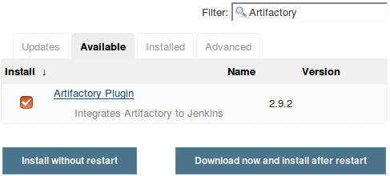

Installing the Artifactory Plugin

3.  从列表中选择人工工厂插件，然后单击不重启安装按钮。
4.  如果需要，重启詹金斯。

# 配置人工工厂插件

现在我们已经安装了 Artifactory 插件，让我们对其进行配置:

1.  在詹金斯仪表盘中，点击管理詹金斯|配置系统。
2.  进入“配置系统”页面后，向下滚动至“人工工厂”部分。
3.  在人工工厂部分下，单击添加按钮。您将看到以下要配置的设置，如下图所示。让我们一个一个来看。

4.  使用服务器标识字段为您的艺术工厂服务器命名。
5.  在网址字段下输入人工工厂服务器网址。
6.  在默认部署者凭据下添加 Artifactory 凭据，如下图所示。
7.  单击“测试连接”按钮，测试詹金斯与 Artifactory 的连接:

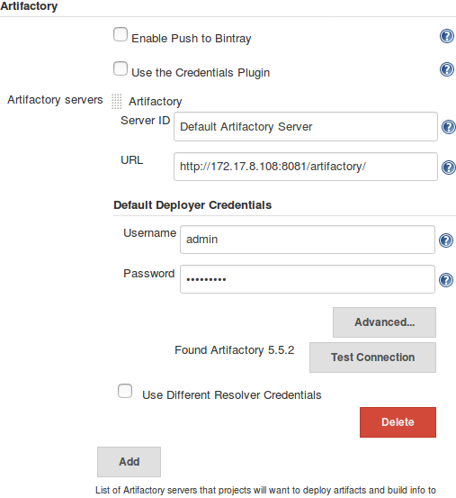

Configuring the Artifactory Plugin

8.  完成后，单击页面末尾的保存按钮保存设置。

# 摘要

在本章中，我们学习了如何安装和配置 SonarQube 和 Artifactory。在当今世界，静态代码分析是 CI 管道的重要组成部分(尽管这不是必需的)。类似地，artifacts 是一个流行的工具，用于存储由配置项管道生成的所有构建工件。一旦配置项管道完成，Artifactory 将占据中心位置。所有构建的工件都是从 artifactss 部署到各种测试环境中的，我们正是通过 artifact 执行代码升级的。

我们将在下一章中了解更多关于这些工具的信息，这一章是关于使用 Jenkins 实现持续集成的。