# 使用Jenkins进行持续集成

我们将以**持续集成** ( **CI** )设计开始本章，涵盖以下领域:

*   分支策略
*   配置项工具列表
*   Jenkins管道结构

CI设计将作为一个蓝图，指导读者回答如何、为什么以及在哪里实施CI。该设计将涵盖实施端到端 CI 管道所涉及的所有必要步骤。

The CI design discussed in this chapter should be considered as a template for implementing CI, and not a full and final model. The branching strategy and the tools used can all be modified and replaced to suit the purpose.

# Jenkins CI 设计

几乎每个组织在开始探索 CI 和 DevOps 工具之前都会创建一个。在本节中，我们将介绍一个非常通用的 CI 设计。

持续集成不仅包括Jenkins或任何其他类似的配置项工具，还涉及如何版本控制代码、遵循的分支策略等。

不同的组织可能遵循不同的策略来实现CI，因为这完全取决于项目的需求和类型。

# 分支策略

有分支策略总是好的。分支帮助您组织代码。这是一种将工作代码与正在开发的代码隔离开来的方法。在我们的 CI 设计中，我们将从三种类型的分支开始:

*   主分支
*   整合部门
*   特征分支

这种分支策略是 GitFlow 工作流分支模型的精简版本。

# 主分支

也可以称之为**生产分支**。它保存着已经交付的代码的工作副本。这个分支上的代码已经通过了所有的测试。这个分支没有发展。

# 整合部门

整合分支也被称为**主线分支**。这是集成、构建和测试所有特性的地方。同样，这里没有发展。然而，开发人员可以从集成分支中创建特性分支，并对其进行处理。

# 特征分支

最后，我们有特色分支。这就是实际开发发生的地方。我们可以有多个跨越集成分支的特性分支。

下图显示了我们将在 CI 设计中使用的典型分支策略。我们将创建从**集成/主线分支**延伸出来的两个特性分支，它本身也从主分支延伸出来:


Branching strategy

功能分支或集成分支上的提交(合并将创建提交)将经历构建、静态代码分析和集成测试阶段。如果代码成功通过了这些阶段，生成的包将被上传到 Artifactory(二进制存储库)。

# CI管道

我们现在是CI设计的核心。我们将在Jenkins创建一个多分支管道，该管道将有以下几个阶段:

1.  通过推送事件(CI 管道初始化)从**版本控制系统** ( **VCS** )获取代码。
2.  构建和单元测试代码，并在 Jenkins 上发布单元测试报告。

3.  对代码进行静态代码分析，并将结果上传到 SonarQube。如果缺陷的数量超过质量门定义的阈值，则管道失败。
4.  在 Jenkins 上执行集成测试并发布单元测试报告。
5.  将构建的工件以及一些有意义的属性上传到 artifacts。

以前的 CI 管道的目的是自动化持续构建、测试(单元测试和集成测试)、执行静态代码分析以及将构建的工件上传到二进制存储库中的过程。每一步都有失败/成功的报告。让我们详细讨论这些管道及其组成部分。

# 配置项工具集

我们正在实现配置项的示例项目是一个简单的 Maven 项目。在本章中，我们将看到Jenkins与许多其他工具密切合作。下表列出了我们将看到的所有内容中涉及的工具和技术:

| **技术** | **特性** |
| Java 语言(一种计算机语言，尤用于创建网站) | 用于编码的主要编程语言 |
| 专家 | 构建工具 |
| JUnit | 单元测试和集成测试工具 |
| Jenkins | 持续集成工具 |
| 开源代码库 | 版本控制系统 |
| 声纳员 | 静态代码分析工具 |
| 手工工厂 | 二进制存储库管理器 |

# 创建配置项管道

在本节中，我们将学习如何创建上一节中讨论的配置项管道。我们将执行以下步骤:

*   我们将在 GitHub 中创建一个源代码库
*   我们将创建一个 Jenkinsfile 来描述我们构建、单元测试、执行静态代码分析、集成测试以及将构建的工件发布到 artifacts 的方式
*   我们将利用 Docker 生成构建代理来运行我们的配置项管道
*   我们将在Jenkins创建一个多分支管道

重要的是，您已经配置了[第三章](03.html)、*新Jenkins*中的*在 GitHub 上配置网络钩子部分。*

# 在 GitHub 上创建新的存储库

让我们在 GitHub 上创建一个新的存储库。确保将 Git 安装在用于执行下一节中提到的步骤的计算机上:

1.  登录您的 GitHub 帐户。
2.  本章我们将以[https://github.com/nikhilpathania/hello-world-greeting.git](https://github.com/nikhilpathania/hello-world-greeting.git)的源代码为例。
3.  尝试分叉前面链接中提到的存储库。为此，只需从您的互联网浏览器访问存储库，然后单击**分叉**按钮，如下图所示:

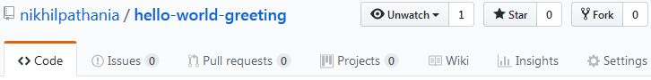

Forking a GitHub project

4.  一旦完成，在您的 GitHub 帐户下，将会看到一个存储库的副本。

# 为马文使用 SonarQube 扫描仪

理想情况下，我们需要 SonarQube 扫描器对项目执行静态代码分析。然而，我们将使用 SonarQube 扫描仪工具来代替 Maven，因为我们在本章中使用的示例源代码是一个 Maven 项目。

为此，将以下代码添加到您的`.pom`文件中:

```
<properties>
    <project.build.sourceEncoding>UTF-8</project.build.sourceEncoding>
    <sonar.language>java</sonar.language>
</properties>
```

You need not perform the previous step if you have forked the following repository:
[https://github.com/nikhilpathania/hello-world-greeting.git](https://github.com/nikhilpathania/hello-world-greeting.git).

# 为配置项编写Jenkins文件

在下一节中，我们将学习如何为我们的持续集成编写管道代码。

# 生成一个 Docker 容器——构建代理

首先，让我们创建管道代码来创建一个 Docker 容器(Jenkins slave)，它将作为我们的构建代理。

如果你还记得的话，在[第 5 章](05.html)、*分布式构建*的*添加Jenkins奴隶–码头工人容器*部分，我们学习了创建码头工人图像(`maven-build-slave-0.1`)来创建码头工人容器(Jenkins奴隶)。我们将在这里使用相同的 Docker 映像来为我们的 CI 管道生成Jenkins从属代理。

在我们的Jenkins文件中，为了生成一个 Docker 容器(Jenkins slave)，我们需要为`node`编写一个代码块，标签为`docker`:

```
node('docker') {
}
```

其中`docker`是`maven-build-slave-0.1` Docker 模板的标签。

我们希望在`docker`节点上执行以下任务:

*   执行构建
*   执行单元测试并发布单元测试报告
*   执行静态代码分析，并将结果上传到 SonarQube
*   执行集成测试并发布集成测试报告
*   将工件发布到 artifacts

所有之前的任务都是我们 CI 管道的不同阶段。让我们为它们中的每一个编写管道代码。

# 从 VCS 下载最新的源代码

我们希望我们的 Jenkins 管道下载最新的更改，并将其推送到 GitHub 存储库的主分支:

```
scm checkout
```

将上一步放入名为`Poll`的阶段:

```
stage('Poll') {
    scm checkout
}
```

# 执行构建和单元测试的管道代码

我们在本章中使用的示例项目是一个 Maven 项目。因此，构建的管道代码是运行`mvn clean`命令的简单外壳脚本:

```
sh 'mvn clean verify -DskipITs=true';
junit '**/target/surefire-reports/TEST-*.xml'
archive 'target/*.jar'
```

其中`-DskipITs=true`是跳过集成测试，只执行构建和单元测试的选项。

`junit '**/target/surefire-reports/TEST-*.xml'`命令使 Jenkins 能够在 Jenkins 管道页面上发布 JUnit 单元测试报告。`**/target/surefire-reports/TEST-*.xml`是生成单元测试报告的目录位置。

Your Maven `.pom` file should have `maven-surefire-plugin` and `maven-failsafe-plugin` for the previous command to work.
You also need the Jenkins JUnit plugin (installed by default).

将上一步放入名为`Build & Unit test`的阶段:

```
stage('Build & Unit test'){
    sh 'mvn clean verify -DskipITs=true';
    junit '**/target/surefire-reports/TEST-*.xml'
    archive 'target/*.jar'
}
```

# 执行静态代码分析的管道代码

执行静态代码分析的管道代码是一个简单的 shell 脚本，它将运行 Maven 命令，如下面的命令块所示。这可以通过使用 Maven 的 SonarQube 扫描仪实用程序来实现。还记得我们在*中看到的为 Maven* 使用 SonarQube 扫描仪的配置吗？

```
sh 'mvn clean verify sonar:sonar -Dsonar.projectName=example-project
-Dsonar.projectKey=example-project -Dsonar.projectVersion=$BUILD_NUMBER';
```

`-Dsonar.projectName=example-project`选项是传递 SonarQube 项目名称的选项。这样，我们的所有结果都将在上一章创建的`projectName=example-project`下可见。

类似地，`-Dsonar.projectKey=example-project`选项允许 Maven 实用程序的 SonarQube 扫描仪用 SonarQube 确认`projectKey=example-project`。

`-Dsonar.projectVersion=$BUILD_NUMBER`选项允许我们将Jenkins的内部版本号与我们执行的每一项分析联系起来，并上传到 SonarQube。`$BUILD_NUMBER`是构建号的Jenkins环境变量。

将上一步放入名为`Static Code Analysis`的阶段:

```
stage('Static Code Analysis'){
    sh 'mvn clean verify sonar:sonar -Dsonar.projectName=example-project
    -Dsonar.projectKey=example-project -Dsonar.projectVersion=$BUILD_NUMBER';}
```

# 执行集成测试的管道代码

执行集成测试的管道代码是一个运行 Maven 命令的外壳脚本，如以下命令块所示:

```
sh 'mvn clean verify -Dsurefire.skip=true';
junit '**/target/failsafe-reports/TEST-*.xml'
archive 'target/*.jar'
```

其中`-Dsurefire.skip=true`是跳过单元测试，只执行集成测试的选项。

`junit '**/target/failsafe-reports/TEST-*.xml'`命令使 Jenkins 能够在 Jenkins 管道页面上发布 JUnit 单元测试报告。`**/target/failsafe-reports/TEST-*.xml`是生成集成测试报告的目录位置。

将上一步放入名为`Integration Test`的阶段:

```
stage ('Integration Test'){
    sh 'mvn clean verify -Dsurefire.skip=true';
    junit '**/target/failsafe-reports/TEST-*.xml'
    archive 'target/*.jar'
}
```

Your Maven `.pom` file should have `maven-surefire-plugin` and `maven-failsafe-plugin` for the previous command to work.
You also need the Jenkins JUnit plugin (installed by default).

# 将构建的工件发布到 artifacts 的管道代码

要将构建工件上传到 artifacts，我们将使用*文件规格*。文件规格代码显示在以下代码块中:

```
"files": [
    {
      "pattern": "[Mandatory]",
      "target": "[Mandatory]",
      "props": "[Optional]",
      "recursive": "[Optional, Default: 'true']",
      "flat" : "[Optional, Default: 'true']",
      "regexp": "[Optional, Default: 'false']"
    }
  ]
```

下表列出了前面代码中的参数:

| **参数** | **条件** | **描述** |
| `pattern` | `[Mandatory]` | 指定应上传到 artifacts 的工件的本地文件系统路径。您可以通过使用通配符或正则表达式来指定多个工件，如`regexp`属性所指定的。
如果使用`regexp`，则需要使用反斜杠`\`转义表达式中使用的任何保留字符(如`.`、`?`等)。自从 2.9.0 版的 Jenkins Artifactory 插件和 2.3.1 版的 TeamCity Artifactory 插件以来，模式格式得到了简化，并对包括 Windows 在内的所有操作系统使用相同的文件分隔符`/`。 |
| `target` | `[Mandatory]` | 以以下格式指定 Artifactory 中的目标路径:`[repository_name]/[repository_path]`。如果模式以斜线结束，例如`repo-name/a/b/`，那么`b`被认为是 Artifactory 中的一个文件夹，文件被上传到其中。在`repo-name/a/b`的情况下，上传的文件在 Artifactory 中被重命名为`b`。为了灵活地指定上传路径，您可以以`{1}, {2}, {3}...`的形式包含占位符，这些占位符由括在括号中的源路径中的相应标记替换。更多详情请参考*使用占位符*一文([https://www . jfrog . com/converge/display/RTF/Using+File+Specs # Using filespecs-Using 占位符](https://www.jfrog.com/confluence/display/RTF/Using+File+Specs#UsingFileSpecs-UsingPlaceholders) ) **。** |
| `props` | `[Optional]` | 以分号(`;`)分隔的要作为属性附加到上传属性的`key=value`对列表。如果任何键可以取几个值，那么每个值用逗号(`,`)隔开。比如`key1=value1;key2=value21,value22;key3=value3`。 |
| `flat` | `[Default: true]` | 如果`true`，工件被上传到指定的精确目标路径，并且它们在源文件系统中的层次被忽略。
如果`false`，工件被上传到目标路径，同时保持它们的文件系统层次。 |
| `recursive` | `[Default: true]` | 如果`true`，还会从源目录的子目录中采集工件进行上传。
如果`false`，只上传源目录中特定的工件。 |
| `regexp` | `[Default: false]` | 如果`true`，该命令将把描述要上传的工件的本地文件系统路径的模式属性解释为正则表达式。
如果`false`，该命令将模式属性解释为通配符表达式。 |

以下是我们将在管道中使用的文件规格代码:

```
def server = Artifactory.server 'Default Artifactory Server'
def uploadSpec = """{
  "files": [
    {
       "pattern": "target/hello-0.0.1.war",
       "target": "example-project/${BUILD_NUMBER}/",
       "props": "Integration-Tested=Yes;Performance-Tested=No"
    }
  ]
}"""
server.upload(uploadSpec)
```

下表列出了前面代码中的参数:

| **参数** | **描述** |
| `def server = Artifactory.server 'Default Artifactory Server'` | 这一行告诉 Jenkins 使用在 Jenkins 中配置的现有 Artifactory 服务器。在我们的示例中，它是默认的 Artifactory 服务器。 |
| `Default Artifactory Server` | 这是在 Jenkins 内部配置的 Artifactory 服务器的名称。 |
| `"pattern": "target/hello-0.0.1.war",` | 这一行代码将查看目录目标中名为`hello-0.0.1.war`的文件，该文件也在 Jenkins 工作区目录中。 |
| `"target": "example-project/${BUILD_NUMBER}/",` | 这一行代码将尝试将构建工件上传到名为`helloworld-greeting-project`的 artifacts 存储库中。它会将工件放在 artifact 存储库中一个以内部版本号命名的文件夹中。 |
| `${BUILD_NUMBER}` | 内部版本号的Jenkins环境变量。 |
| `"props": "Integration-Tested=Yes;Performance-Tested=No"` | 这段代码创建了两个键值对，并将它们分配给上传的工件。这些键值对可以用作 Artifactory 中代码升级的标签。 |

将上一步放入名为`Publish`的阶段:

```
stage ('Publish'){
    def server = Artifactory.server 'Default Artifactory Server'
    def uploadSpec = """{
      "files": [
        {
          "pattern": "target/hello-0.0.1.war",
          "target": "helloworld-greeting-project/${BUILD_NUMBER}/",
          "props": "Integration-Tested=Yes;Performance-Tested=No"
        }
      ]
    }"""
  server.upload(uploadSpec)
}
```

# 组合配置项管道代码

以下是将在`docker`节点内运行的完整组合代码:

```
node('docker') {
  stage('Poll') {
    checkout scm
  }
  stage('Build & Unit test'){
    sh 'mvn clean verify -DskipITs=true';
    junit '**/target/surefire-reports/TEST-*.xml'
    archive 'target/*.jar'
  }
  stage('Static Code Analysis'){
    sh 'mvn clean verify sonar:sonar -Dsonar.projectName=example-project
    -Dsonar.projectKey=example-project -Dsonar.projectVersion=$BUILD_NUMBER';
  }
  stage ('Integration Test'){
    sh 'mvn clean verify -Dsurefire.skip=true';
    junit '**/target/failsafe-reports/TEST-*.xml'
    archive 'target/*.jar'
  }
  stage ('Publish'){
    def server = Artifactory.server 'Default Artifactory Server'
    def uploadSpec = """{
      "files": [
        {
          "pattern": "target/hello-0.0.1.war",
          "target": "example-project/${BUILD_NUMBER}/",
          "props": "Integration-Tested=Yes;Performance-Tested=No"
        }
      ]
    }"""
    server.upload(uploadSpec)
  }
}
```

# 使用Jenkins文件

Jenkins多分支管道利用Jenkins文件。在本节中，我们将学习如何创建Jenkins文件。我们将使用上一节中创建的示例管道脚本来创建Jenkins文件。请遵循以下步骤:

1.  登录您的 GitHub 帐户。
2.  导航到分叉存储库*。*
3.  Once on the repository page, click on the **Create new file** button to create a new empty file that will be our Jenkinsfile, as shown in the following screenshot:

    

Creating a new file on GitHub

4.  通过填写空文本框来命名您的新文件`Jenkinsfile`，如下图所示:


Naming your new file on GitHub

5.  在您的Jenkins文件中添加以下代码:

```
node('docker') {
  stage('Poll') {
    checkout scm
  }
  stage('Build & Unit test'){
    sh 'mvn clean verify -DskipITs=true';
    junit '**/target/surefire-reports/TEST-*.xml'
    archive 'target/*.jar'
  }
  stage('Static Code Analysis'){
    sh 'mvn clean verify sonar:sonar
    -Dsonar.projectName=example-project
    -Dsonar.projectKey=example-project
    -Dsonar.projectVersion=$BUILD_NUMBER';
  }
  stage ('Integration Test'){
    sh 'mvn clean verify -Dsurefire.skip=true';
    junit '**/target/failsafe-reports/TEST-*.xml'
    archive 'target/*.jar'
  }
  stage ('Publish'){
    def server = Artifactory.server 'Default Artifactory Server'
    def uploadSpec = """{
      "files": [
        {
          "pattern": "target/hello-0.0.1.war",
          "target": "example-project/${BUILD_NUMBER}/",
          "props": "Integration-Tested=Yes;Performance-Tested=No"
        }
      ]
    }"""
    server.upload(uploadSpec)
  }
}
```

6.  完成后，通过添加有意义的注释提交新文件，如下图所示:

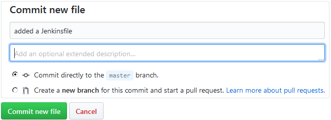

Committing your new file on GitHub

# 在Jenkins创建多分支管道

按照以下步骤创建新的 Jenkins 管道作业:

1.  从Jenkins仪表盘，点击**新项目**链接。
2.  在结果页面上，您将看到各种类型的Jenkins工作可供选择。
3.  选择**多分支** **管道** **e** ，并使用**输入项目名称**字段为您的管道命名。
4.  完成后，单击页面底部的确定按钮。
5.  滚动至**分支来源**部分。这是我们配置想要使用的 GitHub 存储库的地方。
6.  点击**添加信号源**按钮，选择 GitHub。您将看到一个要配置的字段列表。让我们一个一个来看(见下面截图)。
7.  对于“凭据”字段，选择我们在上一节中创建的 GitHub 帐户凭据(种类:带密码的用户名)。

8.  在所有者字段下，指定您的 GitHub 组织或 GitHub 用户帐户的名称。
9.  此时，存储库字段将列出您的 GitHub 帐户上的所有存储库。
10.  在“存储库”字段下选择“你好-世界-问候”。
11.  将其余选项保留为默认值:

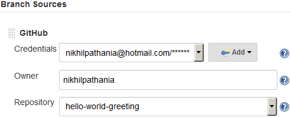

Configuring the Multibranch Pipeline

12.  一直向下滚动到构建配置部分。确保模式字段由Jenkins文件设置为，脚本路径字段设置为`Jenkinsfile`:

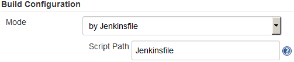

Build configuration

13.  一直向下滚动，点击**保存**按钮。

# 重新注册网络挂钩

现在，让我们为我们所有的Jenkins管道重新注册网络钩子。为此，请执行以下步骤:

1.  在Jenkins仪表盘上，点击**管理Jenkins** | **配置系统**。
2.  在Jenkins配置页面上，一直向下滚动到 GitHub 部分。

3.  在 GitHub 部分下，点击**高级…** 按钮(你会看到其中两个；点击第二个)。
4.  这将显示更多的字段和选项。点击**重新注册所有作业的挂钩**按钮。
5.  前面的操作将在您的 GitHub 帐户内的相应存储库中为我们的多分支管道创建新的网络钩子。请执行以下操作来查看 GitHub 上的网络钩子:
    1.  登录您的 GitHub 帐户。
    2.  转到您的 GitHub 存储库，在我们的例子中是`hello-world-greeting`。
    3.  点击存储库设置按钮，如下图所示:


Repository settings

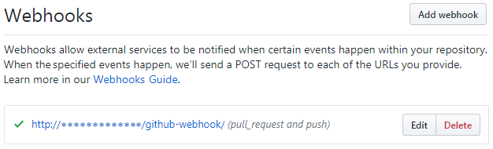

Webhooks on GitHub repository

# 行动中的持续整合

遵循给定的步骤:

1.  从Jenkins仪表板，点击你的多分支管道。
2.  在“Jenkins多分支管道”页面的左侧菜单中，单击“立即扫描存储库”链接。这将扫描存储库中的分支和Jenkins文件，并将立即为每个获得Jenkins文件的分支运行一个管道，如下图所示:

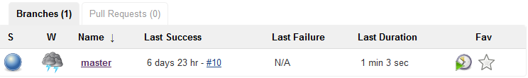

Pipeline for the master branch

3.  在“多分支管道”页面的左侧菜单中，单击扫描存储库日志。您将看到类似于以下输出的内容。请注意高亮显示的代码。您可以看到主分支符合标准，因为它有一个Jenkins文件，并且为它安排了一个管道。没有为测试分支计划管道，因为它没有Jenkins文件:

```
Started by user nikhil pathania
[Sun Nov 05 22:37:19 UTC 2017] Starting branch indexing...
22:37:19 Connecting to https://api.github.com using nikhilpathania@hotmail.com/****** (credentials to access GitHub account)
22:37:20 Connecting to https://api.github.com using nikhilpathania@hotmail.com/****** (credentials to access GitHub account)
Examining nikhilpathania/hello-world-greeting Checking branches...  
  Getting remote branches...    
    Checking branch master  
  Getting remote pull requests... ‘Jenkinsfile’ found    
    Met criteria
Changes detected: master (c6837c19c3906b0f056a87b376ca9afdff1b4411 1e5834a140d572f4d6f9665caac94828b779e2cd)Scheduled build for branch: master  
1 branches were processed  
Checking pull-requests...  
0 pull requests were processed
Finished examining nikhilpathania/hello-world-greeting
[Sun Nov 05 22:37:21 UTC 2017] Finished branch indexing. Indexing took 2.1 sec
Finished: SUCCESS
```

You need not always scan for the repository. The GitHub Webhooks are configured to automatically trigger a pipeline whenever there is a push or a new branch on your GitHub repository. Remember, a Jenkinsfile should also be present on the respective branch to tell Jenkins what it needs to do when it finds a change in the repository.

4.  在您的Jenkins多分支管道页面(`<Jenkins URL>/job/<Jenkins Multi-branch pipeline name>/`)中，单击相应的分支管道(参见下面的截图)。
5.  在结果页面上，您将看到主分支管道的阶段视图:


Pipeline Stage View

6.  要查看单元测试和集成测试结果，请单击“最新测试结果”链接，该链接位于阶段视图下方的同一页面上，如下图所示:


7.  在结果页面上，您将看到关于单元以及集成测试执行的详细报告，如下面的截图所示:

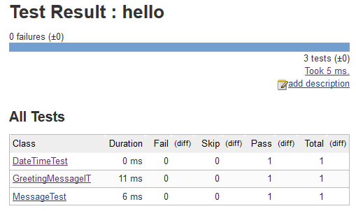

Test report using JUnit plugin

8.  您可以点击各个测试来获取更多详细信息。

9.  在同一页面上，左侧菜单上有一个名为“历史”的链接，它为您提供了一段时间内与测试执行相关的指标数量的历史图表:

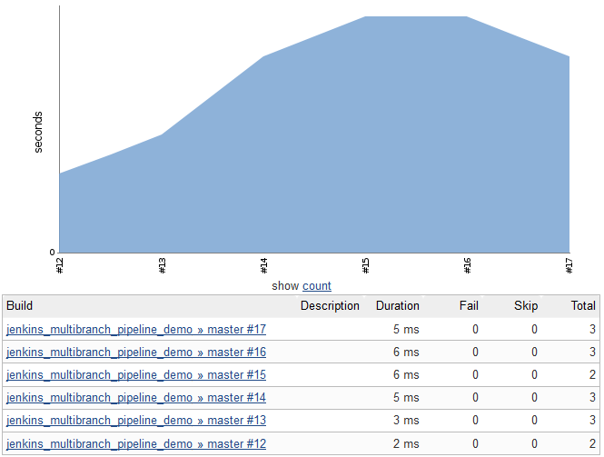

Test execution history

# 在 SonarQube 中查看静态代码分析

让我们看一下作为配置项管道的一部分执行的静态代码分析报告。请遵循以下步骤:

1.  使用您最喜欢的浏览器打开 SonarQube 链接。您应该会看到类似以下截图的内容:


2.  在 SonarQube 仪表板上，使用菜单选项，单击登录链接。
3.  输入您的 SonarQube 凭据。
4.  在结果页面上，在项目小部件下，单击`example-project`项目。
5.  您将看到项目静态代码分析的概述(参见下面的截图):


6.  单击测量|覆盖范围。在结果页面上，您将获得代码覆盖率和单元测试结果报告的概览，如下图所示:


# 从Jenkins那里获取 SonarQube 分析权限

您可以直接从配置项管道访问静态代码分析报告。请遵循以下步骤:

1.  从您的Jenkins仪表板，点击您的多分支管道。接下来，单击相应的分支管道(在我们的示例中是 master)。

2.  进入分支管道后，将鼠标悬停在静态代码分析阶段，然后单击日志。请看下面的截图:


3.  在名为“阶段日志(静态代码分析)”的弹出窗口中，一直向下滚动到最后。您应该会看到一个到 SonarQube 分析页面的链接。请看下面的截图:

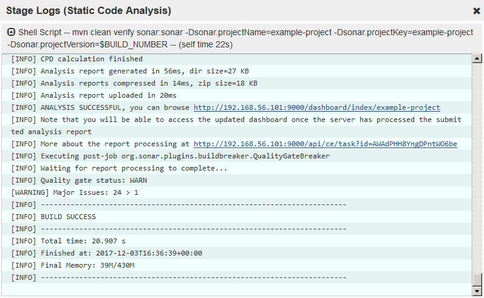

4.  点击链接，如前一张截图所示，将直接进入相应项目的 SonarQube 仪表板。

# 在艺术工厂中查看人工制品

让我们看看我们的工件上传到 artifacts 时的样子。请遵循以下步骤:

1.  从您最喜欢的浏览器中，访问 Artifactory 链接。从 Artifactory 控制面板中，使用登录链接登录。
2.  单击左侧菜单上的工件选项卡。您应该会在工件存储库浏览器下看到您的存储库，如下图所示:

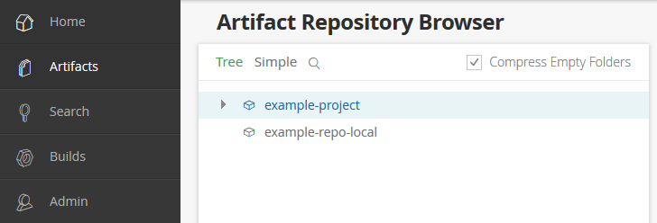

3.  展开存储库，您应该会看到构建的工件和属性，如下面的截图所示:


# 当质量门标准不满足时，构建失败

在下一节中，我们将调整我们在上一章中创建的 SonarQube 质量门，这样它就不会通过 Jenkins CI 管道。按照以下步骤模拟这种情况:

1.  登录到您的 SonarQube 服务器，然后从菜单栏中单击质量门。
2.  从左侧菜单中，单击我们在上一章中创建的质量门:`example-quality-gate`。
3.  现在，将错误字段的值从`50`更改为`3`。

4.  单击更新。最后，一切应该如下图所示:

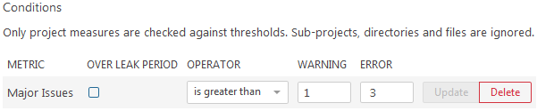

5.  接下来，对 GitHub 存储库进行一些更改，以在 Jenkins 中触发 CI 管道。
6.  登录Jenkins，导航到您的Jenkins多分支配置项管道。您应该会看到类似以下截图的内容:

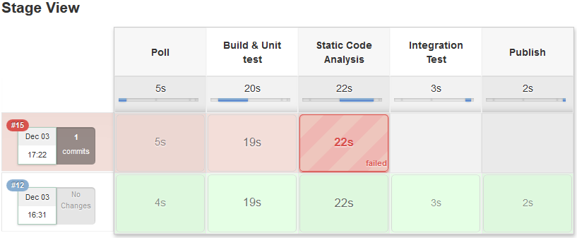

7.  单击相应管道的失败阶段以获取其日志。在弹出窗口中，一直向下滚动。您应该会看到管道失败的原因，如下图所示(箭头):


# 摘要

在本章中，我们学习了如何创建一个多分支 CI 管道，该管道在推送事件时被触发，执行构建、静态代码分析、集成测试，并将成功测试的二进制工件上传到 artifact。最后，我们从开发人员的角度看到了整个配置项管道的运行。

书中讨论的 CI 设计可以修改，以适应任何类型项目的需求；用户只需要确定可以与 Jenkins 一起使用的正确工具和配置。

在下一章中，我们将扩展我们的CI管道，在质量保证领域做更多的工作。