# Ansible Tower、Jenkins 和其他自动化工具

Ansible 功能强大。一旦你意识到写下一种配置和供应系统的方法的无数好处，你就再也不想回去了。事实上，您可能希望继续为复杂的云环境编写行动手册，为数据科学家部署堆栈。经验法则是，如果你能写剧本，你就能为它创作剧本。

让我们假设你已经这样做了。针对各种场景构建不同的行动手册。如果您看到了将基础架构的构建和供应方式编码的优势，您显然会希望将您的行动手册置于版本控制之下:


Multiple playbooks stored under version control, ready to be deployed to systems for provisioning

至此，我们已经解决了围绕自动化的有趣挑战:

*   我们现在有能力针对多个目标*回放*命令
*   请记住，如果行动手册是幂等的，我们可以放心地针对我们的目标运行它们 *n* 次
*   由于它们是基于文本的文档，我们获得了版本控制以及由此带来的所有好处

仍然是手动的是我们需要某人或某物来执行`ansible-playbook`命令。不仅如此，这个某人或某事还需要做以下事情:

*   记住何时执行行动手册
*   相应地安排它们
*   安全存储机密(通常我们需要 SSH 密钥才能登录)
*   存储输出，或者如果出现问题，记得重新运行剧本

我们都可以渴望在记住小事情时变得如此壮观，或者我们可以接受这些面向细节、基于时间安排的任务最好留给有能力的软件，而不是超级人类！


Superhumans will have the ability to remember, schedule, execute, and notify about playbooks

事实证明，我们不必都成为超人。我们可以简单地使用调度和自动化工具，如 Ansible Tower、Jenkins 或 Rundeck 来完成我们之前定义的所有工作，等等。

在本章中，我们将查看我们提到的所有三种工具，以了解它们提供了什么，从而将我们的自动化提升到自动化的下一个抽象层次。

具体来说，我们将涵盖以下主题:

*   安装和配置可拆卸塔架
*   使用 Ansible Tower 管理行动手册和时间表
*   安装和配置詹金斯
*   安装和配置运行平台

# 调度工具支持自动化的下一个抽象

调度和自动化工具使我们能够自动化任务，如持续集成和持续交付。他们能够通过提供以下相当标准的服务来做到这一点:

*   我们可以使用基于网络的用户界面来配置它们
*   通常，一个基于 REST 的应用编程接口，这样我们就可以以编程方式使用它们的特性
*   能够针对其本地存储或可能的其他服务进行身份验证(OAuth/ **安全声明标记语言** ( **SAML** ))
*   它们都从根本上为我们提供了一种清晰的方式来自动化任务，以适应我们的工作流程

大多数与安全相关的自动化确实归结为一遍又一遍地做类似的任务，并查看差异。当你在做安全操作和安全评估的时候尤其如此。

Remember that by using Ansible roles and the playbooks containing them, we are already on our way to doing security automation. Now our aim is to take away the grunt work of remembering to execute those playbooks and get going.

这种自动化有三个主要竞争者。这里列出并描述了它们:

*   可折叠塔
*   詹金斯
*   圆周率

| **工具** | **我们的服** | **牌照** |
| 可折叠塔 | Ansible 制造商的出色工具非常符合信息技术自动化的理念，我们将其扩展到我们的安全需求。 | 免费试用付费 |
| 詹金斯 | 大量 CI/CD 管道的主力和支柱。拥有数百个插件来扩展其核心功能。最好的选择，如果价格或许可证是一个问题。 | 免费开放源码 |
| 圆周率 | 作业调度和自动化的伟大工具。 | 有付费的专业版 |

在本章中，我们将安装和配置所有三个工具来帮助您入门。

Red Hat, who bought Ansible in the October 2015, has indicated that they plan to open source Ansible Tower. They made this announcement at AnsibleFest 2016\. You can follow the progress of that at [https://www.ansible.com/open-tower](https://www.ansible.com/open-tower).

# 起床跑步

让我们从设置我们提到的三个工具开始，看看它们的一些特性。

# 设置可平移的塔

安装 Ansible Tower 试用版有多种方法。最简单的设置方法是使用他们现有的来自 https://www.ansible.com/tower-trial 的图像。

您也可以使用它们的捆绑安装来手动设置。请在[http://docs . ansi ble . com/ansi ble-tower/3 . 1 . 4/html/installandreference/index . html](http://docs.ansible.com/ansible-tower/3.1.4/html/installandreference/index.html)处查看安装前的要求。

运行以下命令在 Ubuntu 16.04 操作系统中安装 Ansible Tower:

```
$ sudo apt-get install software-properties-common

$ sudo apt-add-repository ppa:ansible/ansible

$ wget https://releases.ansible.com/ansible-tower/setup/ansible-tower-setup-latest.tar.gz

$ tar xvzf ansible-tower-setup-latest.tar.gz

$ cd ansible-tower-setup-<tower_version>
```

然后编辑库存文件以更新密码和其他变量，并运行安装程序。库存文件包含塔管理员登录帐户的`admin_password`，`pg_host`和`pg_port`是 Postgres 数据库，如果我们设置多节点设置，这将是必需的。然后最后`rabbitmq`详细进行排队操作。

```
[tower]
localhost ansible_connection=local

[database]

[all:vars]
admin_password='strongpassword'

pg_host='' # postgres.domain.com
pg_port='' #5432

pg_database='awx'
pg_username='awx'
pg_password='postgrespasswordforuserawx'

rabbitmq_port=5672
rabbitmq_vhost=tower
rabbitmq_username=tower
rabbitmq_password='giverabitmqpasswordhere'
rabbitmq_cookie=cookiemonster

# Needs to be true for fqdns and ip addresses
rabbitmq_use_long_name=false
```

```
$ sudo ./setup.sh
```

如果你安装了游民，你可以简单地下载他们的游民箱就可以了。

Make sure you have Vagrant installed in your host system before running the following command: 
`$ vagrant init ansible/tower`
`$ vagrant up`
`$ vagrant ssh`

它将提示您输入 IP 地址、用户名和密码以登录到 Ansible Tower 仪表板。


然后将浏览器导航至`https://10.42.0.42`并接受 SSL 错误继续。这个 SSL 错误可以通过在`/etc/tower`的配置中提供有效证书来修复，并且需要重新启动 Ansible Tower 服务。输入登录凭据以访问 Ansible Tower 控制面板:

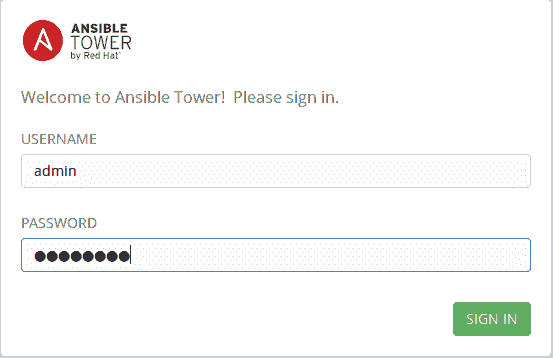

登录后，它会提示您输入 Ansible Tower 许可证:


Ansible Tower 还提供了**基于角色的身份验证控制** ( **RBAC** )，为不同的用户和组管理 Tower 提供了细粒度的控制。下面的屏幕截图显示了正在创建的具有系统管理员权限的新用户:

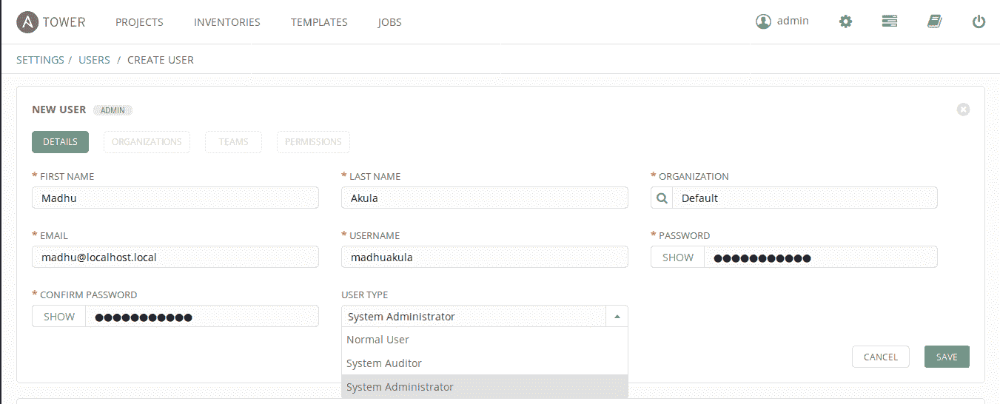

要将清单添加到 Ansible Tower 中，我们可以简单地手动输入，也可以使用动态脚本通过提供身份验证(或)访问密钥从云提供商那里收集清单。下面的截图显示了我们如何将清单添加到 Ansible Tower 中，我们还可以通过以 YAML 或 JSON 格式提供它来为不同的主机提供变量:

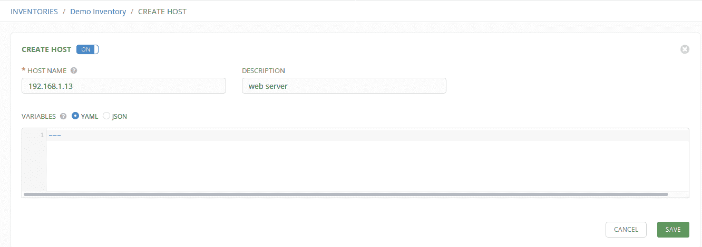

我们还可以通过在凭据管理中提供凭据(或密钥)来向塔中添加凭据(或密钥)，这些凭据也可以重用。

存储在 Ansible Tower 中的机密使用每个 Ansible Tower 集群独有的对称密钥进行加密。一旦存储在 Ansible Tower 数据库中，凭据只能在网络界面中使用，不能查看。Ansible Tower 可以存储的凭据类型有密码、SSH 密钥、Ansible Vault 密钥和云凭据。

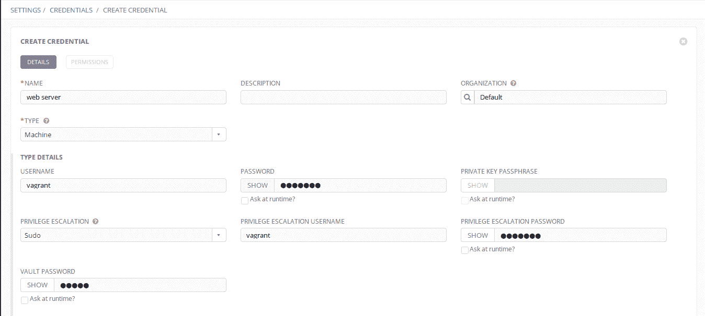

收集库存后，我们可以创建作业来执行行动手册或临时命令操作:

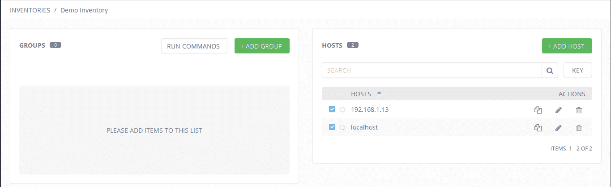

这里，我们选择了`shell`模块，并对两个节点运行`uname -a`命令:


一旦我们启动执行，我们可以在仪表板中看到标准输出。我们还可以使用 REST 应用编程接口来访问它:


请参考 Ansible Tower 文档了解更多详细信息。

There is another way of using Ansible Tower: `tower-cli` is a command-line tool for Ansible Tower. Get started with the  `pip install ansible-tower-cli` command.

The Ansible Tower REST API is a pretty powerful way to interact with the system

这基本上允许您使用易于使用的网络图形用户界面设计您的行动手册工作流等，并增加了从另一个配置项/光盘工具(如詹金斯)调用它的灵活性。顺便说一句，詹金斯是下一个需要安装和学习的软件。

# 设置詹金斯

让我们使用 Ansible 行动手册来安装 Jenkins 并开始使用它。

下面的代码片段是我们为在 Ubuntu 16.04 操作系统中设置 Jenkins 而编写的 Ansible 剧本的片段。

设置完成后，playbook 会返回首次登录应用程序所需的默认管理员密码:

```
- name: installing jenkins in ubuntu 16.04
  hosts: "192.168.1.7"
  remote_user: ubuntu
  gather_facts: False
  become: True

tasks:
  - name: install python 2
    raw: test -e /usr/bin/python || (apt -y update && apt install -y python-minimal)

  - name: install curl and git
    apt: name={{ item }} state=present update_cache=yes

    with_items:
      - curl
      - git

```

```
  - name: adding jenkins gpg key
    apt_key:
      url: https://pkg.jenkins.io/debian/jenkins-ci.org.key
      state: present

  - name: jeknins repository to system
    apt_repository:
      repo: http://pkg.jenkins.io/debian-stable binary/
      state: present

  - name: installing jenkins
    apt:
      name: jenkins
      state: present
      update_cache: yes

  - name: adding jenkins to startup
    service:
      name: jenkins
      state: started
      enabled: yes

  - name: printing jenkins default administration password
    command: cat /var/lib/jenkins/secrets/initialAdminPassword
    register: jenkins_default_admin_password

  - debug:
      msg: "{{ jenkins_default_admin_password.stdout }}"

```

要设置詹金斯，请运行以下命令。其中`192.168.1.7`为詹金斯将要安装的服务器 IP 地址:

```
ansible-playbook -i '192.168.1.7,' site.yml --ask-sudo-pass
```

现在，我们可以配置 Jenkins 安装插件，运行计划的作业，并做许多其他事情。首先，我们必须通过浏览到`http://192.168.1.7:8080`并提供自动生成的密码来导航到詹金斯仪表板。如果剧本运行没有任何错误，它将在剧本结束时显示密码:


通过填写详细信息并确认登录詹金斯控制台来创建新用户:

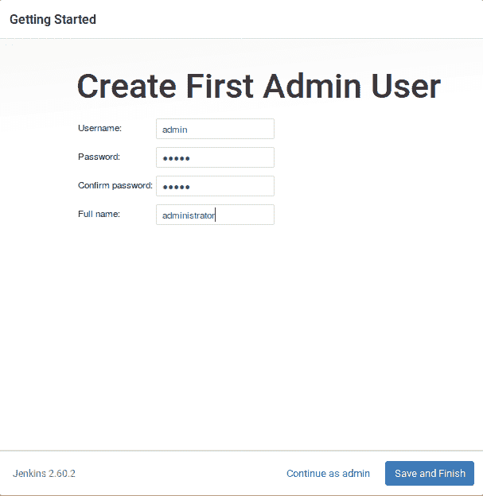

现在我们可以在 Jenkins 中安装自定义插件，导航到“管理 Jenkins”选项卡，选择“管理插件”，然后导航到“可用”选项卡。在过滤器中:输入插件名称为`Ansible`。然后选中该复选框，并单击“不重启安装”:

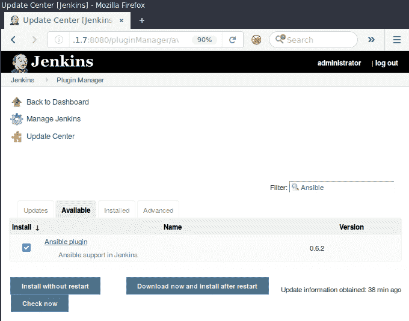

现在我们已经准备好为詹金斯使用 Ansible 插件了。在主仪表板中创建新项目，为其命名，然后选择自由式项目继续:


现在，我们可以配置构建选项，这是 Jenkins 为我们定义自己的触发器、构建指令和后期构建脚本提供更多灵活性的地方:

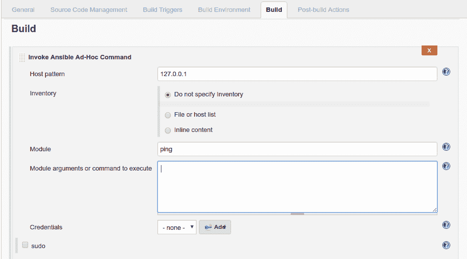

前面的截图是一个调用 Ansible 即席命令的构建示例。这可以修改为基于特定事件的可翻译剧本或任何其他脚本。

The Jenkins Ansible plugin also provides useful features such as configuring advanced commands and passing credentials, keys from Jenkins itself.

一旦构建基于某个事件触发，就可以将其发送到某个工件存储，它也可以在 Jenkins 构建控制台输出中获得:

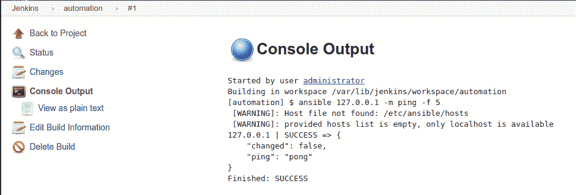

这是一种非常强大的执行动态操作的方法，例如根据对存储库的代码推送触发自动服务器和堆栈设置，以及计划扫描和自动报告。

# 设置运行平台

以下 Ansible 行动手册将在 Ubuntu 16.04 操作系统上设置 Rundeck。它还添加了 Rundeck 服务来启动该过程:

```
- name: installing rundeck on ubuntu 16.04
  hosts: "192.168.1.7"
  remote_user: ubuntu
  gather_facts: False
  become: True

  tasks:
    - name: installing python2 minimal
      raw: test -e /usr/bin/python || (apt -y update && apt install -y python-minimal)

    - name: java and curl installation
      apt:
        name: "{{ item }}"
        state: present
        update_cache: yes

      with_items:
        - curl
        - openjdk-8-jdk

    - name: downloading and installing rundeck deb package
      apt:
        deb: "http://dl.bintray.com/rundeck/rundeck-deb/rundeck-2.8.4-1-GA.deb"

    - name: add to startup and start rundeck
      service:
        name: rundeckd
        state: started
```

要设置运行平台，请运行以下命令。其中`192.168.1.7`是 Rundeck 将要安装的服务器 IP 地址:

```
ansible-playbook -i '192.168.1.7,' site.yml --ask-sudo-pass
```

一旦成功执行，将浏览器导航到`http://192.168.1.7:4440`，您可以看到 Rundeck 应用程序的登录面板。登录 Rundeck 的默认用户名和密码是`admin`:


现在我们可以创建一个新项目来开始工作。提供一个新的项目名称，现在使用默认设置:

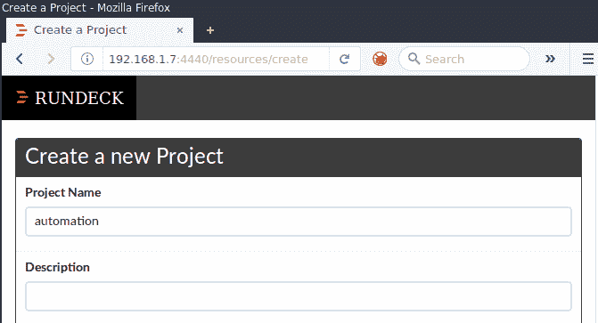

现在，我们可以将多个主机添加到 Rundeck 中来执行多个操作。下面的截图展示了一个跨多个节点运行`uname -a`命令的例子，与`osArch: amd64`匹配，我们也可以为不同的用例创建过滤器:


使用 Rundeck，我们还可以安排作业在特定的时间运行，并以不同的格式存储输出。Rundeck 还提供了一个 REST API，可以集成到现有的工具集中。

# 安全自动化用例

现在，一旦我们设置好了工具，让我们完成一些标准任务，让我们用它们做有用的事情。如果你没注意到，我们喜欢清单。下面列出了一些任务，这些任务将帮助您为重要的东西构建自动化层:

1.  添加行动手册或连接您的源代码管理(SCM)工具，如 GitHub/GitLab/BitBucket
2.  认证和数据安全
3.  记录自动化作业的输出并管理报告
4.  作业调度
5.  警报、通知和网络挂钩

# 添加行动手册

开始时，我们要么希望将我们的定制行动手册添加到信息技术自动化工具中，要么可能将它们添加到配置管理工具中，如 GitHub、GitLab 和 BitBucket。我们将在这里讨论的三个工具中配置和添加我们的行动手册。

# 可转换的塔式配置

Ansible Tower 具有多种功能，可以添加行动手册来执行计划和执行。我们将看到如何添加定制的书面行动手册(手册)以及从版本控制系统(如 Git)添加行动手册。还从 Ansible Galaxy 中获取行动手册。Ansible Galaxy 是您查找、重用和共享最佳 Ansible 内容的中心。

要将行动手册添加到 Ansible Tower 中，我们必须从创建项目开始，然后选择SCM TYPE 作为 Manual，并添加已经存在的行动手册。

**警告**:在`/var/lib/awx/projects`中没有可用的剧本目录。该目录为空，或者所有内容已经分配给其他项目。在那里创建一个新目录，并确保`awx`系统用户可以读取行动手册文件，或者让 Tower 使用前面讨论的配置管理类型选项直接从源代码管理中检索您的行动手册。

我们可以选择设置为 Git 的配置管理类型，并提供一个指向剧本的`github.com`网址:


Git SCM to add playbooks into projects We can also change the `PROJECTS_ROOT` under CONFIGURE TOWER to change this location.

通过创建作业模板来执行添加的行动手册。然后我们可以安排这些工作(或者)我们可以直接启动:

以下是为行动手册执行创建新作业模板的屏幕截图:

**** Playbook execution job template 

作业运行成功，输出如下图所示:

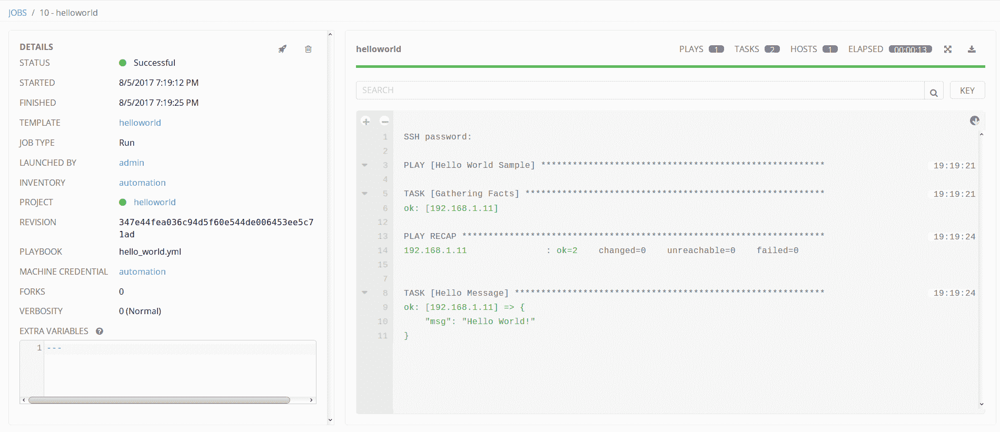

Playbook execution output in Ansible Tower

# Jenkins Ansible 集成配置

毫不奇怪，Jenkins 也支持 SCM 使用剧本和手册剧本的本地目录。这可以通过构建选项进行配置。Jenkins 支持临时命令和行动手册作为构建(或)后操作来触发。

下面的截图显示了我们如何指向我们的存储库并指定一个分支。如果我们想访问私有存储库，也可以指定凭据:

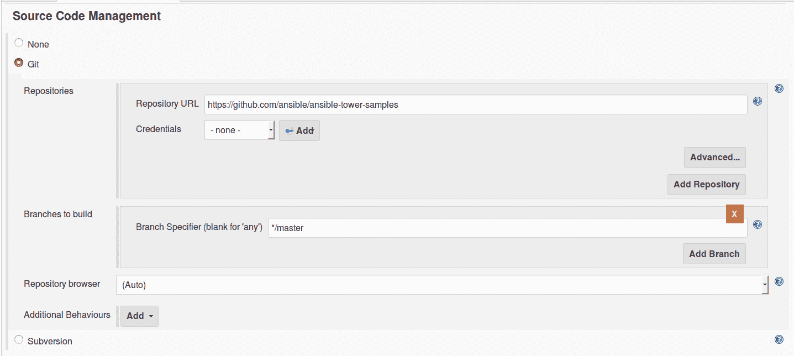

Adding Github (SCM) based playbooks for build

然后，我们可以通过指定行动手册的位置并根据需要定义库存和变量来添加行动手册路径:

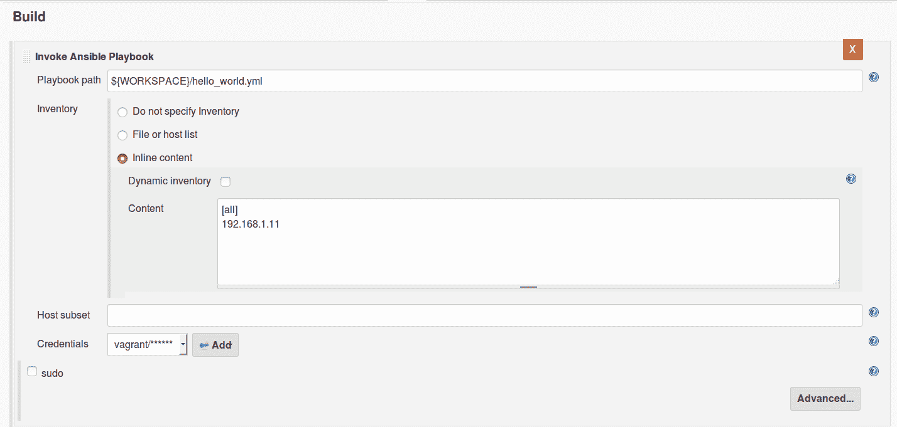

Start playbook execution when build triggers

最后，我们可以通过触发 Jenkins 构建来执行 Jenkins 作业(或者)我们可以将其与其他工具集成:


Jenkins build output of playbook execution

# 运行平台配置

Rundeck 支持添加自定义剧本，以及 SCM 和许多其他选项。以下截图显示了使用作业功能在 Rundeck 中添加行动手册和模块的不同选项。

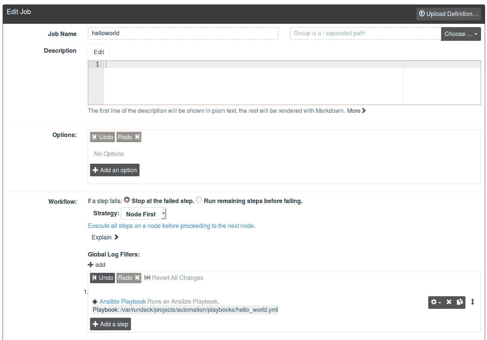

Rundeck has multiple options for us to choose from


Rundeck Ansible Playbook configuration for variables and keys

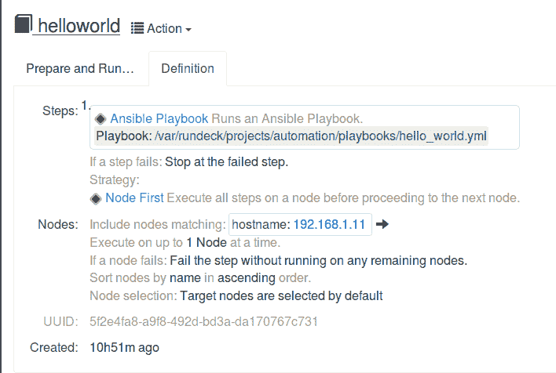

Rundeck job definition including overview of job details

# 认证和数据安全

当我们谈论自动化和使用系统时，我们应该谈论安全性。我们将继续讨论安全自动化，因为这是本书的标题。

这些工具提供的一些安全功能包括:

*   RBAC(认证和授权)
*   基于 TLS/SSL 的网络应用(动态数据的安全性)
*   用于存储机密的加密(静态数据的安全性)

# RBAC 代表易卜塔

Ansible Tower 支持 RBAC 管理多个具有不同权限和角色的用户。还支持企业版**轻量级目录访问协议** ( **LDAP** )集成，支持活动目录。该功能允许我们为访问 Ansible Tower 创建不同级别的用户。例如:

*   运营团队需要系统管理员角色来执行行动手册执行和其他活动，如监控
*   安全团队需要一个系统审计员角色来执行合规标准的审计检查，例如**支付卡行业数据安全标准** ( **PCI DSS** )甚至内部策略验证
*   普通用户，比如团队成员，可能只想看看事情进展如何，以状态更新和工作状态失败(或)成功的形式

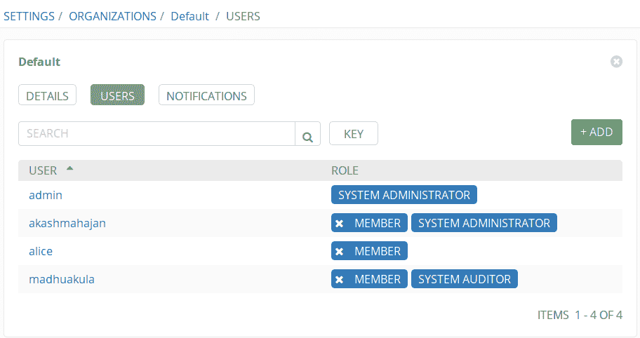

Users can be assigned to different types of roles

# 输电塔的张力腿系统/SSL

默认情况下，Ansible Tower 在`/etc/tower/tower.cert`和`/etc/tower/tower.key`使用 HTTPS 自签名证书，这些可以在设置脚本中配置。我们也可以稍后用相同的文件名更新它。

For more information visit [http://docs.ansible.com/ansible-tower/latest/html/installandreference/install_notes_reqs.html#installation-notes](http://docs.ansible.com/ansible-tower/latest/html/installandreference/install_notes_reqs.html#installation-notes).

# 加密和数据安全

Ansible Tower 具有内置的安全性，可处理包括密码和密钥在内的凭据加密。它使用 Ansible Vault 来执行此操作。它对数据库中的密码和密钥信息进行加密。

Read more at [http://docs.ansible.com/ansible-tower/latest/html/userguide/credentials.html](http://docs.ansible.com/ansible-tower/latest/html/userguide/credentials.html).

# 詹金斯的 RBAC

在詹金斯中，这是一个更通用的工具，我们可以通过使用插件来扩展它的功能。角色策略插件是一个社区插件，用于管理詹金斯的角色。使用它，我们可以为用户和组创建不同的访问级别控制:


Role strategy plugin of Jenkins

角色通常需要符合团队设置和业务需求。您可能需要根据自己的需求对此进行微调。

Read more at [https://wiki.jenkins.io/display/JENKINS/Role+Strategy+Plugin](https://wiki.jenkins.io/display/JENKINS/Role+Strategy+Plugin).

# 詹金斯的顶级域名系统/SSL

默认情况下，詹金斯作为普通的旧 HTTP 运行。为了启用 HTTPS，我们可以在詹金斯前面使用一个反向代理，比如 Nginx，来充当 HTTPS。

For reference, visit [https://www.digitalocean.com/community/tutorials/how-to-configure-jenkins-with-ssl-using-an-nginx-reverse-proxy](https://www.digitalocean.com/community/tutorials/how-to-configure-jenkins-with-ssl-using-an-nginx-reverse-proxy).

# 詹金斯的加密和数据安全

我们正在使用詹金斯的默认凭据功能。这将在本地文件系统中存储密钥和密码。詹金斯也可以使用不同的插件来处理这个问题，比如[https://wiki.jenkins.io/display/JENKINS/Credentials+Plugin](https://wiki.jenkins.io/display/JENKINS/Credentials+Plugin)。

下面的截图是一个参考，展示了我们如何在 Jenkins 中添加凭据:


# RBAC 代表朗德克

Rundeck 还提供了 RBAC 作为可转换塔。与 Tower 不同，这里我们必须使用`/etc/rundeck/`中的 YAML 配置文件进行配置。

以下代码片段是创建管理员用户策略的示例:

```
description: Admin, all access.
context:
 application: 'rundeck'
for:
 resource: 
 - allow: '*' # allow create of projects 
 project: 
 - allow: '*' # allow view/admin of all projects
 project_acl: 
 - allow: '*' # allow all project-level ACL policies
 storage: 
 - allow: '*' # allow read/create/update/delete for all /keys/* storage content 
by: group: admin 
```

For more information about creating different policies, visit [http://rundeck.org/docs/administration/access-control-policy.html](http://rundeck.org/docs/administration/access-control-policy.html).

# 圆形的 HTTP/TLS

可以使用`/etc/rundeck/ssl/ssl.properties`文件为运行平台配置 HTTPS:

```
keystore=/etc/rundeck/ssl/keystore
keystore.password=adminadmin
key.password=adminadmin
truststore=/etc/rundeck/ssl/truststore
truststore.password=adminadmin
```

For more information, visit [http://rundeck.org/docs/administration/configuring-ssl.html](http://rundeck.org/docs/administration/configuring-ssl.html).

# Rundeck 的加密和数据安全

凭据(如密码和密钥)存储在本地存储中并进行加密，使用 Rundeck 密钥存储进行加密和解密。这也支持不同的密钥存储插件来使用密钥存储，例如存储转换器插件。使用**访问** **控制列表** ( **ACL** )策略限制对存储设施中钥匙的访问。

# 行动手册的输出

一旦自动化工作完成，我们想知道发生了什么。他们是否完全运行，是否面临任何错误，等等。我们想知道在哪里可以看到行动手册的输出，以及是否创建了任何其他日志。

# 铁塔的报告管理

默认情况下，Ansible Tower 本身是行动手册、作业执行和库存收集状态的报告平台。Ansible Tower 控制面板提供了项目总数、库存、主机和作业状态的概述。

输出可以在仪表板中使用，标准输出，或者通过使用 REST 应用编程接口，我们也可以通过`tower-cli`命令行工具获得，这只是一个预构建的命令行工具，用于与 REST 应用编程接口。

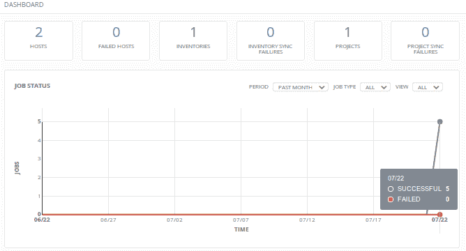

Ansible Tower dashboard


Ansible Tower standard output

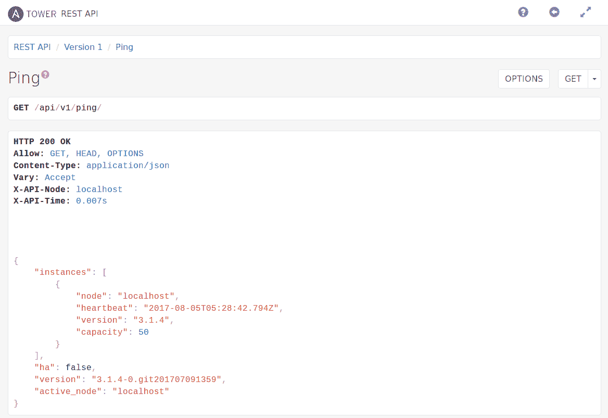

Ansible Tower REST API

# 詹金斯的报告管理

Jenkins 为管理报告提供了标准输出和 REST API。詹金斯有一个非常大的社区，有多个插件可用，如 HTML 发布者插件和黄瓜报告插件。

这些插件提供输出的可视化表示:

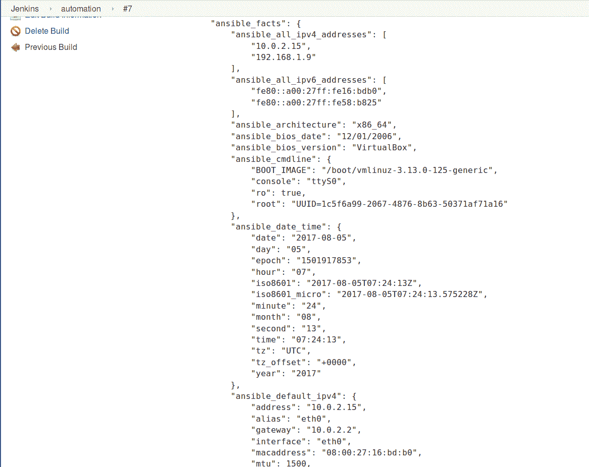

Standard output by the Jenkins job console

# 运行平台的报告管理

Rundeck 还提供了标准输出和 REST API 来查询结果:


Output of a job that can be consumed via stdout, TXT, and HTML formats

# 作业调度

在 Ansible Tower 中，作业的调度简单明了。对于一个作业，您可以指定一个时间表，选项主要类似于 cron。

例如，您可以说您有一个每日扫描模板，并希望它在接下来的三个月中每天凌晨 4 点执行。这种时间表使得我们的元自动化非常灵活和强大。

# 警报、通知和网络挂钩

塔式服务器支持多种方式根据配置向用户发出警报和通知。这甚至可以配置为使用网络钩子向您选择的网址发出 HTTP `POST`请求:


Ansible Tower notification using slack webhook

# 摘要

我们完成了一些信息技术自动化和调度软件的旋风之旅。我们的主要目的是介绍该软件，并强调它的一些共同特点。

这些功能包括以下内容:

*   为我们的秘密提供加密
*   按照我们的时间表要求运行
*   获得好报告的能力

我们已经了解了允许我们重用和创建优秀剧本的 Ansible 角色。加上这些特点，我们有一个完整的自动化系统准备就绪。我们不仅可以随心所欲地运行我们的任务和作业，还可以获得它们运行方式的更新。此外，由于我们的任务在受保护的服务器上运行，因此我们共享的秘密也要安全，这一点很重要。

在下一章中，我们将不再考虑 Ansible 自动化的机制，而是直接考虑特定情况下的安全自动化。自动化我们服务器的补丁是最明显的，也可能是最流行的需求。我们将应用安全自动化技术和方法来建立一个加固的 WordPress 并启用加密备份。