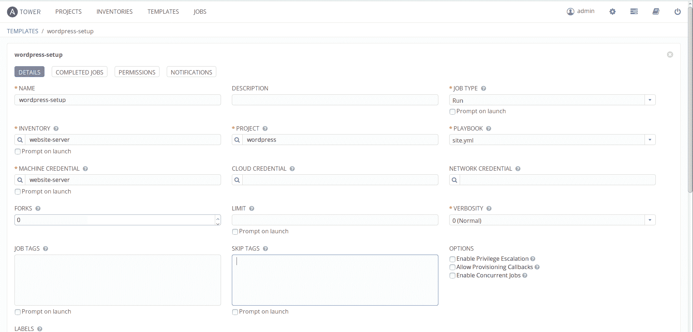
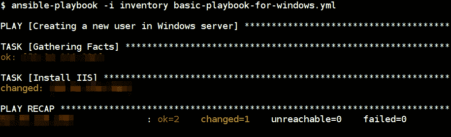

# 三、使用加密自动备份设置加固 WordPress

现在，基本的设置已经完成，让我们挑选各种安全自动化场景，并逐一查看。

每个人都会同意，建立一个安全的网站并保持它的安全是一个相当普遍的安全要求。由于这种情况非常普遍，所以对于许多负责构建和管理网站的人来说，保持安全来查看特定场景是非常有用的。

Are you aware that, according to Wikipedia, 27.5% of the top 10 million websites use WordPress? According to another statistic, 58.7% of all websites with known software on the entire web run WordPress. 

如果有这么多，一个自动安全的方式来设置和维护 WordPress 应该对一些读者有用。

即使你对 WordPress 不太感兴趣，请记住设置和保护 LAMP/LEMP 栈应用的总体步骤是通用的。

对我们来说，设置一个加密自动备份的加固 WordPress 可以分为以下几个步骤:

1.  设置一个安全措施到位的 Linux/Windows 服务器。
2.  设置网络服务器(在 Linux 上是 Apache/Nginx，在 Windows 上是 IIS)。
3.  在同一台主机上设置数据库服务器(MySQL)。
4.  使用名为**的命令行工具设置 WordPress。**
5.  为站点文件和数据库设置增量备份、加密备份，最重要的是，自动备份。

在本章中，我们将使用 Ansible 行动手册和角色来完成所有这些工作。我们将假设我们计划部署我们的 WordPress 网站的服务器已经启动并运行，我们能够连接到它。我们将把备份存储在已经配置好的 AWS S3 存储桶中，已经为该存储桶提供了访问密钥和秘密访问密钥。

我们将讨论以下主题:

*   WordPress 命令行界面
*   为什么要为这种设置负责？
*   一个完整的 WordPress 安装，一步一步
*   设置 Apache2 网络服务器
*   如果你不想自己滚呢？网格栈
*   我们为什么要使用 Trellis，什么时候使用它是个好主意？
*   使用“让我们加密”启用顶级域名系统/SSL
*   视窗操作系统

# WordPress 命令行界面

我们将使用一个名为 WP-CLI 的工具，它允许我们在 WordPress 中做许多传统上需要网络浏览器的事情。

WP-CLI is the CLI for WordPress. You can update plugins, configure multisite installs, and much more, without using a web browser. For more information on WP-CLI, visit [https://WP-CLI.org/](https://wp-cli.org/), and for WordPress, visit [https://wordpress.org/](https://wordpress.org/).

例如，以下命令将下载并设置一个 WordPress:

```
wp core install # with some options such as url, title of the website etc. etc.
```

一个完整的例子可以在[https://developer.WordPress.org/cli/commands/core/#examples](https://developer.wordpress.org/cli/commands/core/#examples):找到

```
wp core install --url=example.com --title=Example --admin_user=supervisor --admin_password=strongpassword --admin_email=info@example.com
```

这个例子让我们看到了从 Ansible 剧本中调用 WP-CLI 工具的威力。

# 为什么要为这种设置负责？

Ansible 是为安全自动化和加固而制造的。它使用 YAML 语法，帮助我们整理重复任务的整个过程。通过使用这一点，我们可以使用角色和行动手册自动化基础架构的持续交付和部署过程。

模块化方法使我们能够非常简单地执行任务。例如，运营团队可以编写剧本来建立一个 WordPress 站点，安全团队可以创建另一个角色来强化 WordPress 站点。

使用模块进行可重复性非常容易，并且输出是幂等的，这意味着为服务器、应用和基础设施创建标准。一些用例包括使用内部策略标准为组织创建基础映像。

Ansible 使用 SSH 协议，默认情况下，该协议通过加密传输和主机加密来保护。此外，在处理不同类型的操作系统时，不存在依赖性问题。它用 Python 来执行；基于我们的用例，这可以很容易地扩展。

# 一个完整的 WordPress 安装步骤

在这一节中，我们将继续完成 WordPress 的完整设置、所需的数据库服务器、强化和备份。我们选择的平台是 Linux (Ubuntu 16.04)，带有 nginx 网络服务器，运行时带有 PHP-FPM。我们将使用双工来设置将存储在 AWS S3 的备份。

# 正在设置 nginx web 服务器

设置 nginx 就像`sudo apt-get install nginx`一样简单，但是为我们的用例配置和管理配置的自动化方式是 Ansible 赋予的权力。让我们看看剧本中 nginx 角色的以下片段:

```
- name: adding nginx signing key
  apt_key:
    url: http://nginx.org/keys/nginx_signing.key
    state: present

- name: adding sources.list deb url for nginx
  lineinfile:
    dest: /etc/apt/sources.list
    line: "deb http://nginx.org/packages/mainline/ubuntu/ trusty nginx"

- name: update the cache and install nginx server
  apt:
    name: nginx
    update_cache: yes
    state: present

- name: updating customized templates for nginx configuration
  template:
    src: "{{ item.src }}"
    dest: "{{ item.dst }}"

  with_items:
    - { src: "templates/defautlt.conf.j2", dst: "/etc/nginx/conf.d/default.conf" }    

  notify
    - start nginx
    - startup nginx
```

在前面的代码片段中，我们添加了签名密钥，然后添加了存储库，然后安装。这确保了我们也可以在从存储库下载包时执行完整性检查。

然后，我们使用 Jinja2 模板来执行配置更改，这些更改可以在服务器更新之前在我们的配置中预先定义。

# 设置先决条件

为了建立 WordPress CMS，我们需要安装一个数据库和 PHP，所以我们将安装 MySQL 作为数据库和 PHP-FPM 进行处理。

# 建立 MySQL 数据库

上一章我们已经看到了如何设置 MySQL。在这里，我们将看到如何为 WordPress 应用创建新的用户和数据库。然后，我们将通过 Ansible 模块应用强化步骤:

```
- name: create WordPress database
    mysql_db:
      name: "{{ WordPress_database_name }}"
      state: present
      login_user: root
      login_password: "{{ mysql_root_password }}"

- name: create WordPress database user
    mysql_user:
      name: "{{ WordPress_database_username }}"
      password: "{{ WordPress_database_password }}"
      priv: '"{{ WordPress_database_name }}".*:ALL'
      state: present
      login_user: root
      login_password: "{{ mysql_root_password }}"
```

前面的代码片段描述了创建一个新的数据库和用户，并分别使用`mysql_db`和`mysql_user`模块将该用户的完全权限分配给 WordPress 应用数据库。

# 为 WordPress 安装程序安装 PHP

下面的代码片段使用不同的模块来执行 PHP 和其他必需包的安装。然后使用`replace`模块更新 PHP-FPM 配置。最后，它还使用`template`模块更新 nginx 配置以更新 PHP-FPM 处理，并重新启动服务以应用更改:

```
- name: installing php
  apt:
    name: "{{ item }}"
    state: present
    update_cache: yes

  with_items:
    - php
    - php-curl
    - php-fpm
    - php-mysql
    - php-xmlrpc

- name: configuring php.ini for php processor
  replace:
    path: /etc/php5/fpm/php.ini
    regex: ';cgi.fix_pathinfo=1'
    replace: 'cgi.fix_pathinfo=0'
    backup: yes

- name: enable and restart the php fpm service
  service:
    name: php7.0-fpm
    enabled: yes
    state: restarted

- name: update the nginx configuration to support php-fpm
  template:
    src: "{{ item.src }}"
    dest: "{{ item.dst }}"

  with_items:
    - { src: "defautlt.conf.j2", dst: "/etc/nginx/conf.d/default.conf" }

- name: restart the nginx
  service:
    state: restarted
    name: nginx
```

# 使用命令行界面安装 WordPress

下面的代码片段将安装和设置 WordPress，使其正常运行:

```
- debug:
  msg: ensure you have installed lamp (or) lemp stack

- name: downloading WordPress cli aka wp-cli
  get_url:
    url: https://raw.githubusercontent.com/wp-cli/builds/gh-pages/phar/wp-cli.phar
    dest: /usr/local/bin/wp
    mode: 0755

- name: download latest WordPress locally
  command: wp core download
  become_user: "{{ new_user_name }}"
  args:
    chdir: /var/www/html/

- name: WordPress site configuration
  command: "wp core config --dbname={{ WordPress_database_name }} --dbuser={{ WordPress_database_username }} --dbpass={{ WordPress_database_password }}

- name: information for WordPress site
  command: "wp core install --url={{ WordPress_site_name }} --title={{ WordPress_site_title }} --admin_user={{ WordPress_admin_username }} --admin_password={{ WordPress_admin_password }} --admin_email={{ WordPress_admin_email }}"
```

# 强化 SSH 服务

这将像一种更传统的方法，使用现代自动化方法，使用 Ansible。这里包括的一些项目有:

*   禁用`root`用户登录，转而创建不同的用户，如果需要，提供`sudo`权限:

```
    - name: create new user
      user:
        name: "{{ new_user_name }}"
        password: "{{ new_user_password }}"
```

```
        shell: /bin/bash
        groups: sudo
        append: yes
```

*   使用基于密钥的身份验证登录。与基于密码的身份验证不同，我们可以生成 SSH 密钥并将公钥添加到授权密钥中:

```
    - name: add ssh key for new user
      authorized_key:
        user: "{{ new_user_name }}"
        key: "{{ lookup('file', '/home/user/.ssh/id_rsa.pub') }}"
        state: present
```

*   使用 SSH 配置文件的一些配置调整；例如:`PermitRootLogin`、`PubkeyAuthentication`、`PasswordAuthentication`:

```
    - name: ssh configuration tweaks
      lineinfile:
        dest: /etc/ssh/sshd_config
        state: present
        line: "{{ item }}"
        backups: yes

      with_items:
        - "PermitRootLogin no"
        - "PasswordAuthentication no"

      notify:
        - restart ssh
```

*   我们还可以设置类似`fail2ban`的服务来抵御基本攻击。
*   此外，如果需要登录，我们可以启用 MFA。更多信息，请访问[https://www . digitalocean . com/community/tutories/how-setup-multi-factor-authentication-for-ssh-on-Ubuntu-16-04](https://www.digitalocean.com/community/tutorials/how-to-set-up-multi-factor-authentication-for-ssh-on-ubuntu-16-04)。

以下行动手册将为开发-sec 团队的 SSH 强化提供更多高级功能:[https://github.com/dev-sec/ansible-ssh-hardening](https://github.com/dev-sec/ansible-ssh-hardening)

# 强化数据库服务

我们已经看到建立数据库。下面的代码片段展示了我们如何通过将 MySQL 服务绑定到 localhost 和与应用交互所需的接口来强化它。然后，它删除匿名用户和测试数据库:

```
- name: delete anonymous mysql user for localhost
  mysql_user:
    user: ""
    state: absent
    login_password: "{{ mysql_root_password }}"
    login_user: root

- name: secure mysql root user
  mysql_user:
    user: "root"
    password: "{{ mysql_root_password }}"
    host: "{{ item }}"
    login_password: "{{ mysql_root_password }}"
    login_user: root

  with_items:
    - 127.0.0.1
    - localhost
    - ::1
    - "{{ ansible_fqdn }}"

- name: removes mysql test database
  mysql_db:
    db: test
    state: absent
    login_password: "{{ mysql_root_password }}"
    login_user: root
```

# 硬化工程

在这里，我们可以开始考虑一些事情，比如禁用服务器令牌以不显示版本信息，添加像`X-XSS-Protection`这样的标题，以及许多其他配置调整。这些更改大多是通过配置更改完成的，Ansible 允许我们根据用户需求对这些更改进行版本控制和自动化:

*   通过将`server_tokens off;`值添加到配置中，可以阻止 nginx 服务器版本信息
*   `add_header X-XSS-Protection "1; mode=block";`将启用跨站点脚本(XSS)过滤器
*   可以通过添加`ssl_protocols TLSv1 TLSv1.1 TLSv1.2;`来禁用 SSLv3
*   根据用例和场景，这个列表可能非常大:

以下代码片段包含用于更新加固的 nginx 配置更改的 nginx 配置模板:

```
    - name: update the hardened nginx configuration changes
      template:
        src: "hardened-nginx-config.j2"
        dest: "/etc/nginx/sites-available/default"

      notify:
        - restart nginx
```

Mozilla runs an updated web page on guidance for SSL/TLS at [https://wiki.mozilla.org/Security/Server_Side_TLS](https://wiki.mozilla.org/Security/Server_Side_TLS). The guidance offers an opinion on what cipher suites to use, and other security measures. Additionally, if you trust their judgment, you can also use their SSL/TLS configuration generator to quickly generate a configuration for your web server configuration. For more information, visit [https://mozilla.github.io/server-side-tls/ssl-config-generator/](https://mozilla.github.io/server-side-tls/ssl-config-generator/).

无论您决定使用哪种配置，模板都需要命名为`hardened-nginx-config.j2`。

# 强化 WordPress

这包括对 WordPress 安全错误配置的基本检查。其中包括:

*   目录和文件权限:

```
    - name: update the file permissions
      file:
        path: "{{ WordPress_install_directory }}"
        recurse: yes
        owner: "{{ new_user_name }}"
        group: www-data

    - name: updating file and directory permissions
      shell: "{{ item }}"

      with_items:
        - "find {{ WordPress_install_directory }} -type d -exec chmod
         755 {} \;"
        - "find {{ WordPress_install_directory }} -type f -exec chmod 
        644 {} \;"
```

*   用户名和附件枚举阻止。以下代码片段是 nginx 配置的一部分:

```
    # Username enumeration block
    if ($args ~ "^/?author=([0-9]*)"){
        return 403;
    }

    # Attachment enumeration block
    if ($query_string ~ "attachment_id=([0-9]*)"){
        return 403;
    }
```

*   禁止在 WordPress 编辑器中编辑文件:

```
    - name: update the WordPress configuration
      lineinfile:
        path: /var/www/html/wp-config.php
        line: "{{ item }}"

      with_items:
        - define('FS_METHOD', 'direct');
        - define('DISALLOW_FILE_EDIT', true);
```

随着配置的更改和更新，我们还可以添加许多其他检查。

# 强化主机防火墙服务

以下代码片段用于安装和配置**简单防火墙** ( **UFW** )及其所需服务和规则。Ansible 甚至有一个针对 UFW 的模块，所以下面的代码片段从安装它并启用日志记录开始。接下来添加默认策略，如默认拒绝所有传入和允许传出。

然后它将添加 SSH、HTTP 和 HTTPS 服务来允许传入。根据需要，这些选项是完全可配置的。然后，它将启用并添加应用更改的启动程序:

```
- name: installing ufw package
  apt:
    name: "ufw"
    update_cache: yes
    state: present

- name: enable ufw logging
  ufw:
    logging: on

- name: default ufw setting
  ufw:
    direction: "{{ item.direction }}"
    policy: "{{ item.policy }}"

  with_items:
    - { direction: 'incoming', policy: 'deny' }
    - { direction: 'outgoing', policy: 'allow' }

- name: allow required ports to access server
  ufw:
    rule: "{{ item.policy }}"
    port: "{{ item.port }}"
    proto: "{{ item.protocol }}"

  with_items:
    - { port: "22", protocol: "tcp", policy: "allow" }
    - { port: "80", protocol: "tcp", policy: "allow" }
    - { port: "443", protocol: "tcp", policy: "allow" }

- name: enable ufw
  ufw:
    state: enabled

- name: restart ufw and add to start up programs
  service:
    name: ufw
    state: restarted
    enabled: yes
```

# 在 S3 自动气象站设置自动加密备份

备份总是我们大多数人认为应该做的事情，但它们似乎是一件苦差事。多年来，人们做了大量的工作来确保我们能够有足够简单的方法来备份和恢复我们的数据。

在当今时代，优秀的备份解决方案/软件应该能够做到以下几点:

| **功能** | **备注** |
| 自动化的 | 自动化允许围绕它的过程 |
| 增加的 | 虽然存储总体上很便宜，但如果我们希望每隔五分钟备份一次，那么应该备份已更改的内容 |
| 在离开我们的服务器前加密 | 这是为了确保我们的静态和动态数据安全 |
| 便宜的 | 虽然我们关心数据，但好的备份解决方案比需要备份的服务器要便宜得多 |

对于我们的备份解决方案，我们将选择以下栈:

| **软件** | 双重-一个包装口是心非，一个 Python 脚本 |
| **储存** | 虽然 duply 提供了许多后端，但它在 AWS S3 上运行得非常好 |
| **加密** | 通过使用 GPG，我们可以使用非对称的公钥和私钥对 |

以下代码片段将设置从服务器到 AWS S3 的双重加密自动备份:

```
- name: installing duply
  apt:
    name: "{{ item }}"
    update_cache: yes
    state: present

  with_items:
    - python-boto
    - duply

- name: check if we already have backup directory
  stat:
    path: "/root/.duply/{{ new_backup_name }}"
  register: duply_dir_stats

- name: create backup directories
  shell: duply {{ new_backup_name }} create
  when: duply_dir_stats.stat.exists == False

- name: update the duply configuration
  template:
    src: "{{ item.src }}"
    dest: "{{ item.dest }}"

  with_items:
    - { src: conf.j2, dest: /root/.duply/{{ new_backup_name }}/conf }
    - { src: exclude.j2, dest: /root/.duply/{{ new_backup_name }}/exclude }

- name: create cron job for automated backups
  template:
    src: duply-backup.j2
    dest: /etc/cron.hourly/duply-backup
```

# 使用 Ansible Tower 对 Ubuntu 16.04 服务器执行剧本

一旦我们准备好行动手册并根据需要更新变量，我们就可以继续执行行动手册。在此之前，我们必须在 Ansible Tower 中创建模板来执行此操作。



Ansible Tower job template for WordPress setup playbook


WordPress setup playbook job execution


WordPress website with HTTPS

# 确保自动更新

下面的代码片段用于运行备份和更新 WordPress 核心、主题和插件。这可以通过每天的Ansible塔式作业来安排:

```
- name: running backup using duply
  command: /etc/cron.hourly/duply-backup

- name: updating WordPress core
  command: wp core update
  register: wp_core_update_output
  ignore_errors: yes

- name: wp core update output
  debug:
    msg: "{{ wp_core_update_output.stdout }}"

- name: updating WordPress themes
  command: wp theme update --all
  register: wp_theme_update_output
  ignore_errors: yes

- name: wp themes update output
  debug:
    msg: "{{ wp_theme_update_output.stdout }}"

- name: updating WordPress plugins
  command: wp plugin update --all
  register: wp_plugin_update_output
  ignore_errors: yes

- name: wp plugins update output
  debug:
    msg: "{{ wp_plugin_update_output.stdout }}"
```

# 通过Ansible塔安排每日更新

Ansible Tower 允许我们安排作业在服务器上自动运行。我们可以通过配置执行行动手册的开始日期和重复频率，在模板中进行配置。


Ansible Tower job scheduling for automated WordPress updates

否则，我们可以使用`cron`作业模板每天执行此操作，并在部署 WordPress 设置时添加此模板:

```
#!/bin/bash

/etc/cron.hourly/duply-backup
wp core update
wp theme update --all
wp plugin update --all
```

# 设置 Apache2 网络服务器

我们已经在 LEMP 栈设置中看到了这一点，它非常相似。但是在这里，我们必须使用使用 WordPress 所需的模块。下面的代码片段显示了我们如何使用模板在服务器中执行配置更新:

```
- name: installing apache2 server
  apt:
    name: "apache2"
    update_cache: yes
    state: present

- name: updating customized templates for apache2 configuration
  template:
    src: "{{ item.src }}"
    dest: "{{ item.dst }}"
    mode: 0644

  with_tems:
    - { src: apache2.conf.j2, dst: /etc/apache2/conf.d/apache2.conf }
    - { src: 000-default.conf.j2, dst: /etc/apache2/sites-available/000-default.conf }
    - { src: default-ssl.conf.j2, dst: /etc/apache2/sites-available/default-ssl.conf }

- name: adding custom link for sites-enabled from sites-available
  file:
    src: "{{ item.src }}"
    dest: "{{ item.dest }}"
    state: link

  with_items:
    - { src: '/etc/apache2/sites-available/000-default.conf', dest: '/etc/apache2/sites-enabled/000-default.conf' }
    - { src: '/etc/apache2/sites-available/default-ssl.conf', dest: '/etc/apache2/sites-enabled/default-ssl.conf' }

  notify:
    - start apache2
    - startup apache2
```

# 使用“让我们加密”启用顶级域名系统/SSL

我们可以使用“让我们加密”提供的命令行工具，以开放、自动化的方式获取免费的 SSL/TLS 证书。

该工具能够读取和理解 nginx 虚拟主机文件，并完全自动生成相关证书，无需任何人工干预:

```
- name: adding certbot ppa
  apt_repository:
    repo: "ppa:certbot/certbot"

- name: install certbot
  apt:
    name: "{{ item }}"
    update_cache: yes
    state: present

  with_items:
    - python-certbot-nginx

- name: check if we have generated a cert already
  stat:
    path: "/etc/letsencrypt/live/{{ website_domain_name }}/fullchain.pem"
  register: cert_stats

- name: run certbot to generate the certificates
  shell: "certbot certonly --standalone -d {{ website_domain_name }} --email {{ service_admin_email }} --non-interactive --agree-tos"
  when: cert_stats.stat.exists == False

- name: configuring site files
  template:
    src: website.conf
    dest: "/etc/nginx/sites-available/{{ website_domain_name }}"

- name: restart nginx
  service:
    name: nginx
    state: restarted

```

“让我们加密”已经成为在网站上启用 SSL/TLS 的一种极其流行和安全的方式。

By the end of June 2017, Let's Encrypt had issued over 100 million free SSL/TLS certificates in an automatic manner. For more information, visit [https://letsencrypt.org/2017/06/28/hundred-million-certs.html](https://letsencrypt.org/2017/06/28/hundred-million-certs.html).

# 如果你不想自己滚呢？网格栈

Trellis stack 是开发团队为 WordPress 网站进行本地试运行和生产设置的一种方式。

Trellis is an open source MIT license set of Ansible playbooks for a WordPress LEMP stack. 

# 我们为什么要使用 Trellis，什么时候使用它是个好主意？

Trellis 是一个成熟的项目，基于 Ansible 提供的各种工具。从许多方面来说，这是本章使用行动手册的更好选择。

如果你需要构建/开发、部署并维护一个或多个 WordPress 网站，那么 Trellis 是一个不错的选择。

唯一需要注意的是，如果有团队进行开发和部署，那么很多可用的特性会更有用。否则，栈是固执己见的，你可能会背负一些你可能不喜欢的软件选择。

# 视窗操作系统

这是我们现在要表演的新节目之一。直到现在，我们一直在基于 Linux 的操作系统中设置东西。现在我们要在 Windows 操作系统中设置 IIS web 服务器，这需要我们在 Windows 服务中启用`WinRM`功能来执行 Ansible 剧本执行。

我们需要确保`pywinrm`模块安装在控制机上；我们可以通过执行以下`pip`命令来安装它:

```
pip install "pywinrm>=0.2.2"
```

# 如何在 Windows 中启用 WinRM

为了简化这个过程，Ansible 提供了一个 PowerShell 脚本，它需要作为管理员在 PowerShell 控制台中运行。从[https://raw . githubuser content . com/ansi ble/ansi ble/develop/examples/scripts/configureremotingforensible . PS1](https://raw.githubusercontent.com/ansible/ansible/devel/examples/scripts/ConfigureRemotingForAnsible.ps1)下载 PowerShell 脚本。

在 Windows 计算机上，以管理员身份打开命令提示符，并运行以下命令:

```
powershell.exe -File ConfigureRemotingForAnsible.ps1 -CertValidityDays 100
```

Make sure you opened port `5986` for the Windows machine in firewall rules. For more references, about Windows setup, visit [http://docs.ansible.com/ansible/latest/intro_windows.html](http://docs.ansible.com/ansible/latest/intro_windows.html).

# 在 Windows 服务器上运行 Ansible

现在，让我们通过对 Windows 服务器执行一个简单的 ping 模块来进行测试。

首先，我们需要创建`inventory`文件，其中包括连接 Windows `winrm`服务的选项:

```
[windows]
192.168.56.120 ansible_user=Administrator ansible_password=strongpassowrd ansible_connection=winrm ansible_winrm_server_cert_validation=ignore ansible_port=5986
```

要执行 Windows ping 模块，我们可以运行以下 Ansible 命令:

```
ansible -i inventory windows -m win_ping
```


To learn more about the different available modules in Windows, refer to [http://docs.ansible.com/ansible/latest/list_of_windows_modules.html](http://docs.ansible.com/ansible/latest/list_of_windows_modules.html).

# 使用行动手册安装 IIS 服务器

下面的代码片段解释了如何在 Windows 服务器操作系统中安装和启动 IIS 服务:

```
- name: Install and start IIS web server in Windows server
  hosts: winblows

  tasks:
    - name: Install IIS
      win_feature:
        name: "Web-Server"
        state: present
        restart: yes
        include_sub_features: yes
        include_management_tools: yes

```



我们将使用巧克力(更多信息，请访问 Windows 软件包管理器[https://chocolatey.org/](https://chocolatey.org/)，了解 Windows 中的高级安装和设置。

下一步是安装网络平台安装程序。

The Microsoft Web Platform Installer (Web PI) is a free tool that makes getting the latest components of the Microsoft Web Platform, including **Internet Information Services** (**IIS**), SQL Server Express, .NET Framework, and Visual Web Developer, easy. For more information, visit [https://www.microsoft.com/web/downloads/platform.aspx](https://www.microsoft.com/web/downloads/platform.aspx).

一旦安装了这个，我们就可以用这个安装 MySQL 和 WordPress 了:

The following playbook runs the PowerShell script created by [https://gist.github.com/chrisloweau/8a15516d551a87b096620134c3624b73](https://gist.github.com/chrisloweau/8a15516d551a87b096620134c3624b73). Please refer to [http://www.lowefamily.com.au/2017/04/11/how-to-install-wordpress-on-windows-server-2016/](http://www.lowefamily.com.au/2017/04/11/how-to-install-wordpress-on-windows-server-2016/) for more details about the PowerShell script.

此设置需要一些先决条件。其中包括设置 PowerShell 执行策略和支持的 windows 版本。

*   首先，我们需要通过运行以下命令来设置执行策略:

```
 Set-ExecutionPolicy RemoteSigned CurrentUser
```

*   此脚本仅支持 Windows Server 2016 操作系统和 Windows 10

以下是在 Windows 操作系统中执行 PowerShell 脚本来安装 WordPress 的操作手册。

```
- name: Windows Wordpress Setup Playbook
  hosts: winblows

  tasks:
    - name: download wordpress setup script
      win_get_url:
        url: https://gist.githubusercontent.com/chrisloweau/8a15516d551a87b096620134c3624b73/raw/b7a94e025b3cbf11c3f183d20e87c07de86124a3/wordpress-install.ps1
        dest: ~\Downloads\wordpress-install.ps1

    # This requires `Set-ExecutionPolicy RemoteSigned CurrentUser` to All
    - name: running windows wordpress script
      win_shell: ~\Downloads\wordpress-install.ps1
      args:
        chdir: ~\Downloads\wordpress-install.ps1
      register: output

    - debug:
        msg: "{{ output.stdout }}"
```

*   在执行之后，它返回类似如下的输出。然后我们可以导航到该 IP 地址，并按照说明设置 WordPress 的最终配置

```
Installation Complete!

MySQL Accounts
       root = 2*Bb!o4#4T2yy/*44ngb
  wordpress = B*OGGrg{{ghr$35nGt4rU

Connect your web browser to http://192.168.56.100/ to complete this WordPress
installation.
```

# 摘要

这一章是关于 WordPress 的。默认情况下，我们使用 Ansible 创建了一个相当安全的 WordPress 安装。通过更改数据库、网络服务器和 WordPress 的默认值，我们利用了使用 Ansible 行动手册编纂安全知识的能力。此外，通过设置自动化的增量加密备份，我们可以在可能发生的最坏情况下保持弹性和连续性。

我们简单看了一下如何启用 Windows 来使用 Ansible。

在下一章中，我们将研究弹性栈，以建立一个集中的日志记录基础设施。这不仅可以很好地存储各种日志，还可以在我们受到攻击时发出警报和通知。我们还将学习如何部署无服务器防御来自动阻止攻击者。