# 六、利用 Nessus 进行漏洞扫描

扫描漏洞是安全团队在其计算机上进行的最容易理解的定期活动之一。对于定期扫描计算机、网络、操作系统软件和应用软件中的漏洞，有完善的策略和最佳实践:

*   基本网络扫描
*   凭据修补程序审核
*   将系统信息与已知漏洞关联起来

对于联网系统，这种类型的扫描通常是从连接的主机上执行的，该主机具有扫描安全问题的适当权限。

最流行的漏洞扫描工具之一是 Nessus。Nessus 最初是一款网络漏洞扫描工具，但现在加入了以下功能:

*   端口扫描
*   网络漏洞扫描
*   Web 应用特定扫描
*   基于主机的漏洞扫描

# 尼斯介绍

Nessus 拥有的漏洞数据库是它的主要优势。虽然我们知道了解哪个服务正在运行以及运行该服务的软件版本是什么的技术，但回答“该服务是否存在已知漏洞”是重要的一个问题。除了定期更新的漏洞数据库之外，Nessus 还拥有关于应用中的默认凭据、默认路径和位置的信息。所有这些都以使用命令行界面或基于网络的工具的简单方式进行了微调。

在深入研究我们将如何设置 Nessus 来针对我们的基础架构执行漏洞扫描和网络扫描之前，让我们看看为什么我们必须设置它，以及它会给我们带来什么回报。

在本章中，我们将重点介绍如何使用 Nessus 进行漏洞扫描。我们将尝试为此所需的标准活动，并看看需要哪些步骤来使用 Ansible 实现自动化:

1.  使用剧本安装 Nessus。
2.  正在配置 Nessus。
3.  正在进行扫描。
4.  使用自动扫描运行扫描。
5.  安装 Nessus REST API Python 客户端。
6.  使用应用编程接口下载报告。

# 安装 Nessus 进行漏洞评估

首先，从[https://www . tenable . com/products/nessus/select-your-operating-system](https://www.tenable.com/products/nessus/select-your-operating-system)获取下载 Nessus 的 URL，然后选择 Ubuntu 操作系统，然后针对要设置 Nessus 的服务器运行以下剧本角色:

```
- name: installing nessus server
  hosts: nessus
  remote_user: "{{ remote_user_name }}"
  gather_facts: no
  vars:
    remote_user_name: ubuntu
    nessus_download_url: "http://downloads.nessus.org/nessus3dl.php?file=Nessus-6.11.2-ubuntu1110_amd64.deb&licence_accept=yes&t=84ed6ee87f926f3d17a218b2e52b61f0"

  tasks:
    - name: install python 2
      raw: test -e /usr/bin/python || (apt -y update && apt install -y python-minimal)

    - name: downloading the package and installing
      apt:
        deb: "{{ nessus_download_url }}"

    - name: start the nessus daemon
      service:
        name: "nessusd"
        enabled: yes
        state: started
```

# 配置 Nessus 进行漏洞扫描

执行以下步骤为漏洞扫描配置 Nessus:

1.  我们必须导航至`https://NESSUSSERVERIP:8834`确认并启动服务:

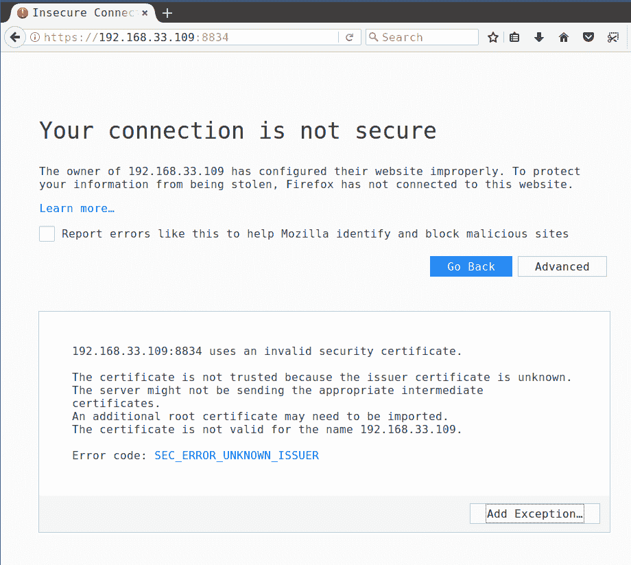

2.  如我们所见，它返回了一个 SSL 错误，我们需要接受 SSL 错误并确认安全异常，然后继续安装:

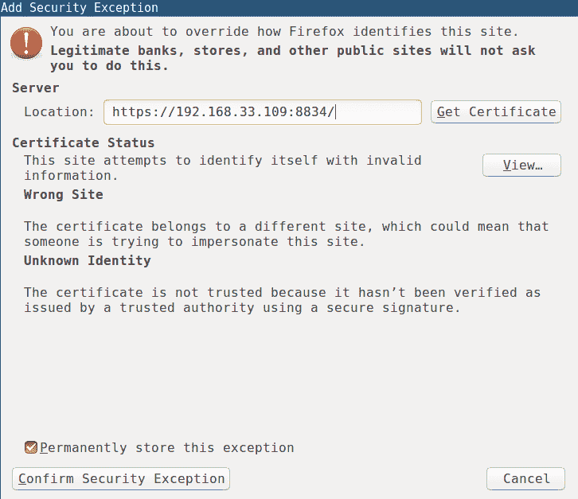

3.  单击确认安全异常并继续安装步骤:

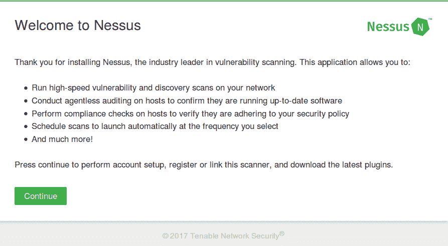

4.  单击继续并提供用户的详细信息，该用户具有完全管理员访问权限:


5.  那么最后我们要提供注册码(激活码)，可以在[https://www.tenable.com/products/nessus-home](https://www.tenable.com/products/nessus-home)注册获得:

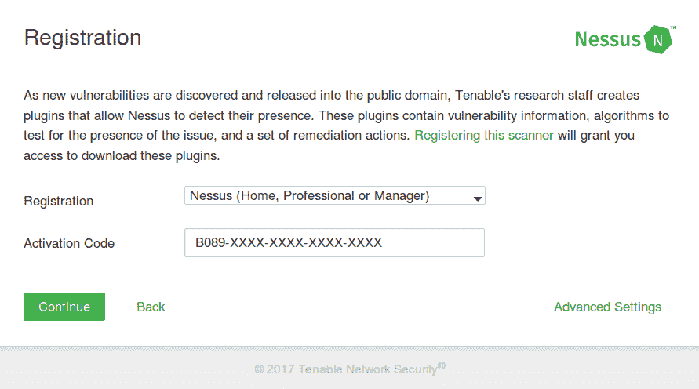

6.  现在它将安装所需的插件。安装需要一段时间，安装完成后，我们可以登录使用该应用:


7.  现在，我们已经成功地设置了 Nessus 漏洞扫描程序:


# 对网络执行扫描

现在，是时候使用 Nessus 执行一些漏洞扫描了。

# 基本网络扫描

Nessus 有各种各样的扫描，其中一些是免费的，一些只有付费版本。因此，如果需要，我们也可以定制扫描。

以下是当前可用的模板列表:

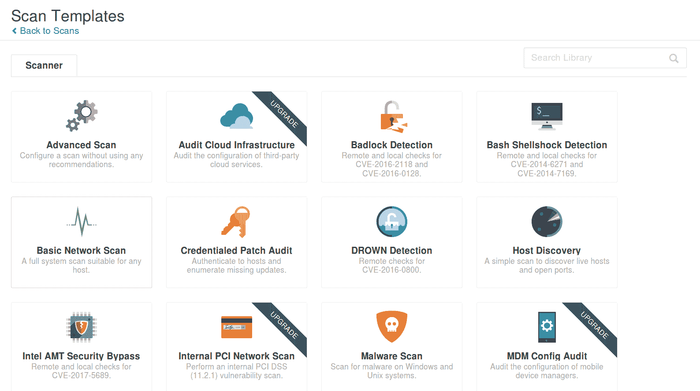

1.  我们可以从基本的网络扫描开始，看看网络中发生了什么。此扫描将对给定主机执行基本的完整系统扫描:

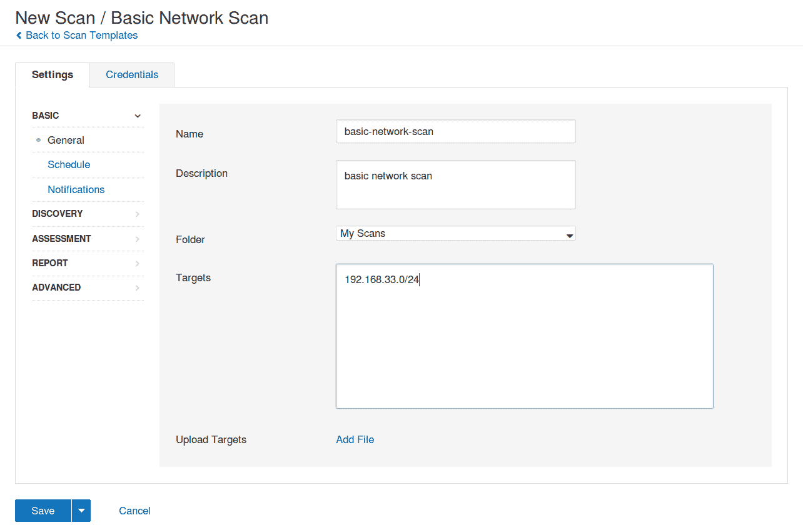

2.  正如您在前面的截图中看到的，我们必须提到扫描名称和目标。目标只是我们想要的主机。

Targets can be given in different formats, such as `192.168.33.1` for a single host, `192.168.33.1-10` for a range of hosts, and also we can upload the target file from our computer.

使用 Nessus 选择新扫描/基本网络扫描进行分析:


3.  我们还可以自定义扫描类型。例如，我们可以执行普通端口扫描，扫描已知端口，如果需要，我们还可以执行完整端口扫描:

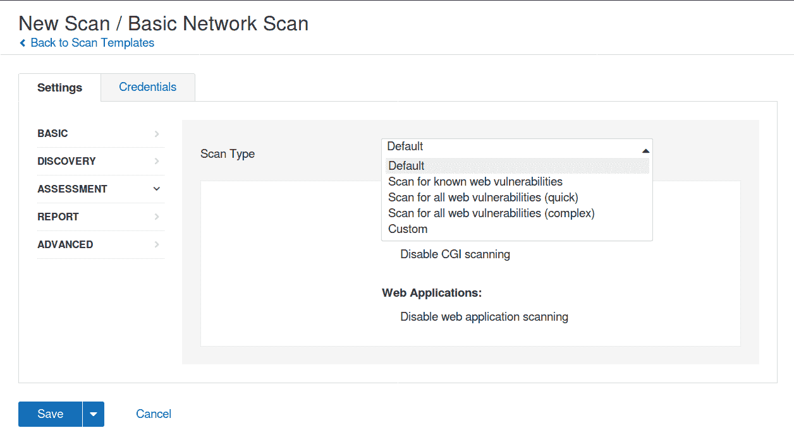

4.  然后，类似地，我们可以指定执行不同类型的 web 应用扫描，如前所述:


5.  还可以使用可用选项根据要求定制报告:


6.  在扫描关键基础架构时，上述选项非常重要。这些选项旨在确保我们不会在目标网络中产生大量流量和网络带宽。Nessus 允许我们根据用例和需求进行定制:

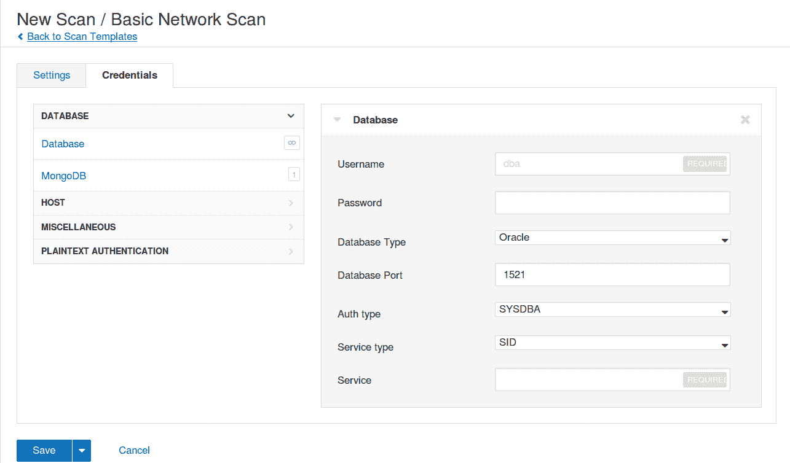

7.  The preceding screenshot represents whether we already have existing credentials for any service and if it requires scanning, we can mention them here. Nessus will use these credentials to authenticate while scanning and this gives better results. Nessus supports multiple types of authentication services:

    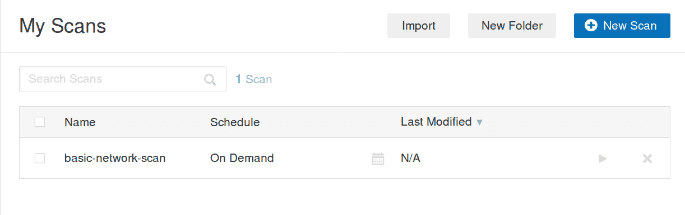

8.  如果需要，可以安排扫描，也可以按需扫描。我们可以单击启动按钮(播放图标)以给定的配置参数开始扫描:


9.  扫描结果可通过基于主机、漏洞、严重性级别等的控制面板获得:

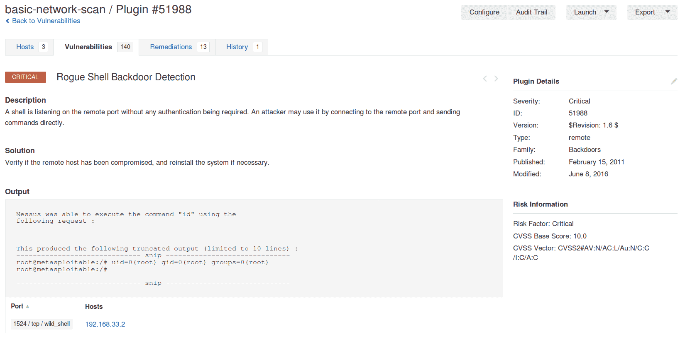

10.  前面的截图显示了 Nessus 将如何使用示例**概念证明** ( **概念验证**)或命令输出生成现有漏洞的详细结果。它还提供了修复、漏洞和参考的详细摘要。

# 使用自动扫描运行扫描

使用 AutoNessus 脚本，我们可以执行以下操作:

*   列表扫描
*   列出扫描策略
*   对扫描执行操作，如开始、停止、暂停和继续

AutoNessus 最大的优点是，由于这是一个命令行工具，它可以很容易地成为计划任务和其他自动化工作流的一部分。

Download AutoNessus from [https://github.com/redteamsecurity/AutoNessus](https://github.com/redteamsecurity/AutoNessus).

# 设置自动用户

下面的代码是 Ansible 剧本片段，用于设置自动用户并将其配置为使用凭据使用 Nessus。本行动手册将允许在路径中设置`autoNessus`工具，我们可以将其用作简单的系统工具:

```
- name: installing python-pip
  apt:
    name: python-pip
    update_cache: yes
    state: present

- name: install python requests
  pip:
    name: requests

- name: setting up autonessus
  get_url:
    url: "https://github.com/redteamsecurity/AutoNessus/raw/master/autoNessus.py"
    dest: /usr/bin/autoNessus
    mode: 0755

- name: updating the credentials
  replace:
    path: /usr/bin/autoNessus
    regexp: "{{ item.src }}"
    replace: "{{ item.dst }}"
    backup: yes
  no_log: True

  with_items:
    - { src: "token = ''", dst: "token = '{{ nessus_user_token }}'" }
    - { src: "url = 'https://localhost:8834'", dst: "url = '{{ nessus_url }}'" } 
    - { src: "username = 'xxxxx'", dst: "username = '{{ nessus_user_name }}'" }
    - { src: "password = 'xxxxx'", dst: "password = '{{ nessus_user_password }}'" }
```

`no_log: True` will censor the output in the log console of Ansible output. It will be very useful when we are using secrets and keys inside playbooks.

# 使用自动扫描运行扫描

以下行动手册代码片段可用于按需执行扫描以及计划的扫描。这也可以用在 Ansible Tower、Jenkins 或 Rundeck 中。

在使用 AutoNessus 运行自动扫描之前，我们必须在 Nessus 门户中创建它们，并进行必要的定制，我们可以使用这些自动行动手册在其上执行任务。

# 列出当前可用的扫描和标识

下面的代码片段将返回当前可用的扫描，并返回带有信息的标识:

```
- name: list current scans and IDs using autoNessus
  command: "autoNessus -l"
  register: list_scans_output

- debug:
    msg: "{{ list_scans_output.stdout_lines }}"
```

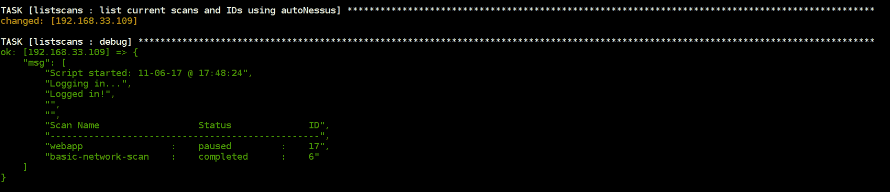

Ansible output returning list of available scans with IDs information

# 使用扫描标识启动指定的扫描

以下片段将基于`scan_id`开始指定的扫描，并返回状态信息:

```
- name: starting nessus scan "{{ scan_id }}" using autoNessus
  command: "autoNessus -sS {{ scan_id }}"
  register: start_scan_output

- debug:
    msg: "{{ start_scan_output.stdout_lines }}"
```

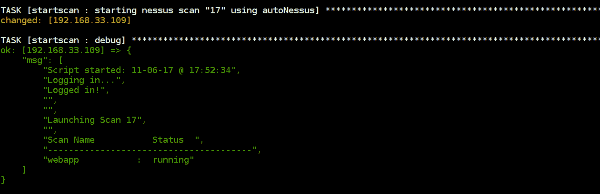

Ansible output returning scan status after starting Similarly, we can perform pause, resume, stop, list policies, and so on. Using the AutoNessus program, these playbooks are available. This can be improved by advancing the Nessus API scripts.

# 存储结果

我们还可以获得漏洞、解决方案以及与漏洞相关的风险信息的详细视图:


整个报告可以导出为多种格式，如 HTML、CSV 和 Nessus。这有助于提供发现的漏洞、具有风险评级的解决方案和其他参考的更详细结构:


输出报告可以根据受众进行定制，如果交给技术团队，我们可以列出所有的漏洞和补救措施。例如，如果管理层想要获得报告，我们只能获得问题的执行摘要。

Reports can be sent by email as well using notification options in Nessus configuration.

以下截图是最近一次基本网络扫描导出的 HTML 格式的详细报告。这可用于分析和修复基于主机的漏洞:


我们可以看到以前按主机分类的漏洞。我们可以在下面的截图中详细看到每个漏洞:

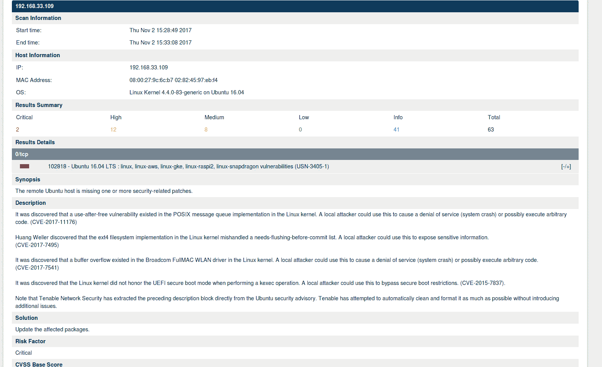

# 安装 Nessus REST API Python 客户端

官方 API 文档可以通过`8834/nessus6-api.html`下连接到您的 Nessus 服务器获得。

要使用 Nessus REST API 执行任何操作，我们必须从门户获取 API 密钥。这可以在用户设置中找到。请确保保存这些密钥:


# 使用 Nessus REST 应用编程接口下载报告

以下行动手册将使用内修斯休息应用编程接口为给定的`scan_id`执行报告导出请求。它将使用简单的剧本自动完成整个过程。这将返回报告的 HTML 输出:

```
- name: working with nessus rest api
  connection: local
  hosts: localhost
  gather_facts: no
  vars:
    scan_id: 17
    nessus_access_key: 620fe4ffaed47e9fe429ed749207967ecd7a77471105d8
    nessus_secret_key: 295414e22dc9a56abc7a89dab713487bd397cf860751a2
    nessus_url: https://192.168.33.109:8834
    nessus_report_format: html

  tasks:
    - name: export the report for given scan "{{ scan_id }}"
      uri:
        url: "{{ nessus_url }}/scans/{{ scan_id }}/export"
        method: POST
        validate_certs: no
        headers:
            X-ApiKeys: "accessKey={{ nessus_access_key }}; secretKey={{ nessus_secret_key }}"
        body: "format={{ nessus_report_format }}&chapters=vuln_by_host;remediations"
      register: export_request

    - debug:
        msg: "File id is {{ export_request.json.file }} and scan id is {{ scan_id }}"

    - name: check the report status for "{{ export_request.json.file }}"
      uri:
        url: "{{ nessus_url }}/scans/{{ scan_id }}/export/{{ export_request.json.file }}/status"
        method: GET
        validate_certs: no
        headers:
            X-ApiKeys: "accessKey={{ nessus_access_key }}; secretKey={{ nessus_secret_key }}"
      register: report_status

    - debug:
        msg: "Report status is {{ report_status.json.status }}"

    - name: downloading the report locally
      uri:
        url: "{{ nessus_url }}/scans/{{ scan_id }}/export/{{ export_request.json.file }}/download"
        method: GET
        validate_certs: no
        headers:
```

```
          X-ApiKeys: "accessKey={{ nessus_access_key }}; secretKey={{ nessus_secret_key }}"
        return_content: yes
        dest: "./{{ scan_id }}_{{ export_request.json.file }}.{{ nessus_report_format }}"
      register: report_output

    - debug:
      msg: "Report can be found at ./{{ scan_id }}_{{ export_request.json.file }}.{{ nessus_report_format }}"
```

Read more at about the Nessus REST API  [https://cloud.tenable.com/api#/overview](https://cloud.tenable.com/api#/overview).

使用 Nessus REST 应用编程接口自动生成报告的 Ansible 行动手册:

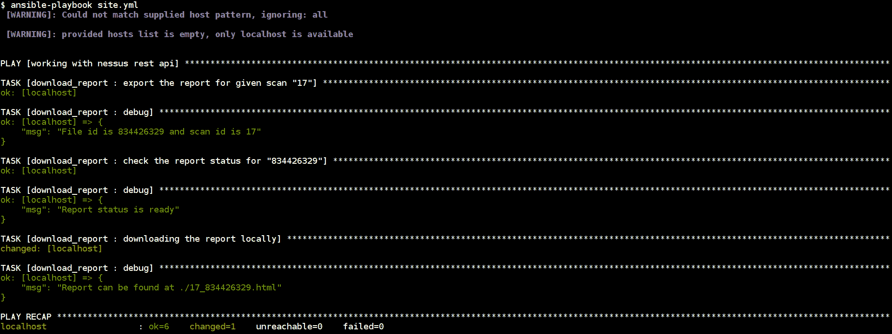

Ansible playbook for automatic report generation and export using Nessus REST API

# 内修斯构型

Nessus 允许我们使用基于角色的身份验证创建不同的用户，以不同的访问级别执行扫描和审查:

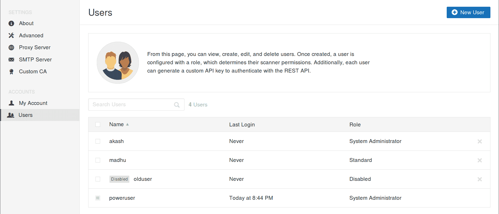

下面的屏幕截图显示了如何创建一个新用户，该用户具有执行 Nessus 活动的角色:


# 摘要

安全团队和信息技术团队依靠工具进行漏洞扫描、管理、补救和持续的安全流程。Nessus 作为最流行和最有用的工具之一，是作者尝试和自动化的自动选择。

在本章中，我们介绍了漏洞扫描的主要活动，例如能够安装和部署工具、启动扫描和下载报告。

在下一章中，我们将深入研究系统安全性和加固。我们将看看各种开放安全倡议和基准项目，如 STIG、开放亚太和**互联网安全中心** ( **CIS** )。我们将学习如何将它们与我们的行动手册和自动化工具集成，例如 Tower 和 Jenkins。关于漏洞扫描的这一章，以及关于网络和应用安全加固的下一章，为探索更多关于安全自动化和保持系统安全和加固的想法奠定了坚实的基础。